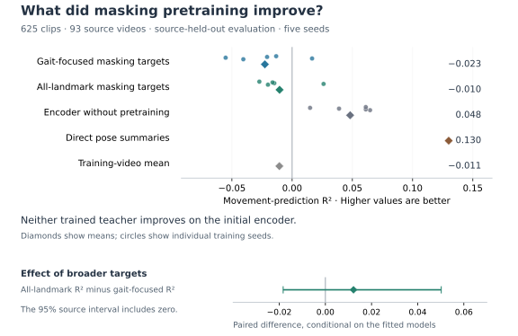
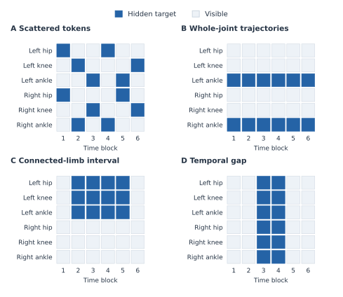

# From gait symmetry to useful movement prediction

A guide to our research questions, findings, and next experiments. The notebook and related-literature review was completed on 8 September 2026. The assessments of v8 for ML4H, Embodied Spatial Reasoning, and RISEx, and v7 for Physical World AI, were updated on 10 September 2026; comparisons with other venues retain their 8 September review date.

The latest completed comparison is documented in notebooks [15](../15_motion_weighted_masking.ipynb),
[16](../16_structured_masking_and_context.ipynb), [17](../17_motion_and_structure_pretraining.ipynb)
and [18](../18_motion_information_and_readout.ipynb). They examine the MAMP code's
motion weighting, structured target geometry, paired JEPA training and
motion-sensitive frozen readouts. The [source review and experiment specification](MOTION_STRUCTURED_MASKING.md)
records the literature checked on 8 September 2026 and the precise adaptations.
All four now default to real GAVD, displaying five source folds and seeds
42–46. The [GAVD run guide](MOTION_GAVD_WORKFLOW.md) explains preparation,
training enablement and loading the same complete grid in Notebook 18.
Real-input and masking audits reproduce the 625-clip, 93-video cohort; the
full comparison is complete: 50 paired jobs, 125 encoders and 150,000
arm-specific optimizer updates. The grid used CUDA BF16 training with FP32
weights, loss reductions and frozen evaluation. Generated software checks are
explicitly separate.

## Contents

- [Research question and current finding](#1-the-question-connecting-the-work)
- [Latest results from notebooks 15–18](#latest-results-from-notebooks-1518-a-simple-walkthrough)
- [Plain-language conclusion and research outlook](#plain-language-conclusion-and-research-outlook)
- [How the matched initial and trained encoders are related](#how-the-matched-initial-and-trained-encoders-are-related)
- [Data and research trajectory](#2-the-data-and-the-research-trajectory)
- [What notebooks 11–14 have established](#what-has-run-in-notebooks-1114)
- [Real-data masking findings](#question-2-does-hiding-gait-relevant-landmarks-help-learning)
- [Mask patterns and worked examples](#what-notebook-11-teaches-about-a-fair-masking-comparison)
- [Feature prediction and missing observations](#what-notebook-13-teaches-about-prediction-and-missing-observations)
- [Future-feature prediction](#question-4-does-learning-future-features-help-predict-future-movement)
- [Comparative masking techniques and priorities](#4-is-our-fixed-landmark-selection-too-restrictive)
- [Novelty and related literature](#5-what-recent-research-changes-about-the-broader-novelty-claim)
- [Next research directions](#6-the-most-productive-research-directions)
- [Workshop and ML4H submission assessment](#7-workshop-and-ml4h-submission-assessment)
- [Practical sequence toward the next paper](#8-a-practical-sequence-toward-the-next-paper)
- [Implementation prompt for the next notebook suite](#9-copy-ready-implementation-prompt-for-the-next-notebook-suite)
- [Evidence and figure reproduction](#evidence-and-figure-reproduction)

## 1. The question connecting the work

**What should a JEPA learn about human movement, and how can we tell whether pretraining has helped?**

Our experiments study sequences of estimated body landmarks, including shoulders, knees, and ankles. An encoder turns these coordinates into numerical features that a prediction model can use. During Joint-Embedding Predictive Architecture (JEPA) pretraining, part of the input is hidden, and a predictor estimates its features from the visible observations. A second, slowly updated encoder supplies the target features. This training does not use gait-condition labels.

The motivating idea is that predicting missing observations could encourage a model to represent meaningful relationships between body parts and their movement. For example, the visible hip and knee trajectory might help predict an obscured ankle. We evaluate that idea by holding the encoder's weights fixed—often called freezing the encoder—and testing whether its features help a simple regression model predict a movement quantity on videos excluded from training.

The latest real-data comparison, completed through Notebook 18, contains 125 trained encoders evaluated on 625 clips from 93 source videos. It compares random targets with motion-weighted targets and connected anatomical regions. None of the alternative masks demonstrates better movement prediction than its matched random reference. More strikingly, every trained encoder performs worse than its matched untrained encoder when both use the same motion-sensitive summary.

The trained predictor also carries clip-related information: it estimates its own clip's hidden teacher features more accurately than teacher features from a different video, while the initial control shows no consistent preference for correct targets. That result does not translate into better prediction of our left–right movement score. A predictor can exploit posture, viewpoint, or other clip-specific information without improving the movement distinction we want to recover. This is the most useful finding to investigate next.

Three questions are especially interesting now:

1. **Where does useful movement information become difficult to recover?** The recorded coordinates, prepared input, learned features, and final feature summary can each affect the result.
2. **Which left–right relationships should the representation preserve?** Overall movement and the side contributing more movement need different responses to reflection.
3. **Can learning these relationships improve prediction of future movement?** This would provide a stronger connection to temporal world models than a test of whole-clip consistency alone.

This tutorial separates measured results on gait recordings from synthetic demonstrations and proposed experiments. The real-data evidence now covers scattered, motion-weighted and connected-region training masks. Whole-trajectory and interior-gap masks have real-data coverage audits but no trained comparison. Forecast decoding in Notebook 14 is also a synthetic demonstration; it has not established a benefit on human gait recordings.

### Latest results from notebooks 15–18: a simple walkthrough

This section follows the four notebooks in order. Keep two questions separate:

1. Did the method change what the model had to predict?
2. Did that change make the frozen representation more useful?

#### Step 1: Notebook 15 confirms that motion weighting changes target selection

All three motion arms hide the same average number of targets: 80.771 per clip, or about 17% of valid all-landmark tokens. The configured 50% mask fraction is calculated from the smaller twelve-landmark gait budget, so it must not be described as hiding half of all tokens.

| Motion arm | Target minus eligible motion | Both legs receive at least one target |
|:--|--:|--:|
| Random uniform | -0.0001 | 1.000 |
| MAMP convention | 0.0175 | 0.999 |
| Robust motion mixture | 0.0378 | 1.000 |

Positive enrichment means that hidden tokens move more than the clip's eligible tokens under one common robust displacement score. The robust mixture shows the largest enrichment, and this pattern is stable across the five mask seeds. This establishes that the sampler works as intended. It does not show that the selected motion is clinically important, free of tracking jumps, or useful for the final prediction task.

#### Step 2: Notebook 16 confirms that mask shapes remove different clues

The structure audit covers 75,000 mask draws. These are repeated draws from the same 625 clips and 93 videos, rather than 75,000 independent observations.

| Mask | Immediate time brackets | Visible body neighbor |
|:--|--:|--:|
| Random region reference | 0.699 | 0.988 |
| Connected region | 0.000 | 0.512 |
| Whole trajectory | 0.000 | 0.995 |
| Interior temporal gap | 0.000 | 0.000 |

Read the rows this way. Random regions usually leave both nearby time and body clues. Connected regions remove immediate time brackets and about half of local body clues. Whole trajectories remove a landmark's local time series but leave body neighbors. Interior gaps remove both measured local clues inside the gap.

The geometry is working. A harder mask is not automatically a better learning task. Each structure also needs its own count-matched random reference: completion hides about 25.3% of valid tokens, while regions and trajectories hide about 9.5-9.9%.

#### Step 3: Notebook 17 confirms that training completed and optimized its objective

The saved grid contains all 50 paired fold/seed jobs: 75 motion-arm encoders and 50 region-arm encoders. Each history contains 1,200 updates. The average masked prediction loss falls from about 15 at the first recorded update to 0.84-0.95 at update 1,200, depending on the arm.

This is evidence that optimization ran and that the predictor learned its training target. It is not evidence that the representation became more useful. Each arm has its own changing teacher and target distribution, so small differences in final training loss cannot rank the masks.

#### Step 4: Notebook 18 provides the decisive held-out result

For each seed, the score pools all five held-out folds and gives every source video equal total weight. The table then averages the five seed scores. The five seeds repeat training on the same videos; they are not five new cohorts.

| Frozen representation | Mean R² | Mean absolute error |
|:--|--:|--:|
| Training-video target mean | -0.0106 | 0.04617 |
| Direct pose summary | 0.0345 | 0.04496 |
| Initial encoder, simple mean | 0.0708 | 0.04434 |
| Initial encoder, motion-sensitive summary | **0.2225** | **0.04155** |
| Trained teachers, motion-sensitive summary | 0.1008-0.1142 | 0.04360-0.04404 |

The motion-sensitive summary adds temporal variation, feature changes and observation support. It reveals substantially more useful signal in the initial encoder: R² rises by 0.1517 over the simple mean. It helps the trained teachers by only 0.0270-0.0468. Every trained arm has lower R² and higher error than its matched initial encoder in all five seeds. This is consistent unfavorable evidence for the current pretraining recipe and laterality readout.

The mask comparisons are also small and uncertain:

| Mask versus its random reference | Difference in R² | 95% source-bootstrap interval |
|:--|--:|:--|
| MAMP motion | -0.0008 | [-0.0204, 0.0153] |
| Robust motion mixture | 0.0005 | [-0.0155, 0.0152] |
| Connected region | -0.0087 | [-0.0333, 0.0177] |

All three intervals include zero. They do not demonstrate that an alternative mask is better, and they are too wide to establish that the masks are equivalent.

There is one positive learning result. For every trained predictor diagnostic, a hidden target from the correct clip is easier to predict than a valid target taken from another source video. The initial predictor does not show this consistent preference. Training therefore learns clip correspondence. That information could describe motion, pose, viewpoint, recording style or another clip property; it does not yet improve the left-right movement endpoint.

#### Step 5: Proceed in this order

1. **Reuse the saved encoders and widen ridge regularization.** Many trained readouts choose 10,000, the largest tested penalty. Add 100,000 and 1,000,000, select using training-source groups only, and retain the current scores as the original analysis.
2. **Find which part of the motion-sensitive summary helps.** Compare mean, observation support, temporal standard deviation and absolute feature changes in fixed ablations. Add support-only and matching direct-coordinate controls. This separates movement information from missingness information.
3. **Check the target against input preparation.** Compare the original target with the same calculation after interpolation, normalization and resizing, stratified by timing and valid support. Treat this as a diagnostic because the same development cohort has already informed the question.
4. **Change training only after those checks.** If the trained deficit remains, use a source-separated pilot with initial and intermediate checkpoints. Change one factor at a time, such as regularizer strength or target objective, and keep masking, initialization and exposure paired.
5. **Run another full grid only after a fixed pilot criterion is met.** Require a consistent trained-over-initial gain on reserved training sources. Preserve the current unfavorable result and seek later confirmation on an untouched cohort or setting.

The practical conclusion is simple: motion weighting and connected regions change the prediction problem, but neither improves the tested laterality readout. Training learns clip correspondence while making the endpoint less accessible to the tested linear readout. The next work should explain that gap before adding more masks, model size or training time.

#### Plain-language conclusion and research outlook

The experiments ask whether S-JEPA-style self-supervised training can learn useful information from human walking. The model sees estimated locations of body landmarks such as knees and ankles. Some observations are hidden, and the model learns to predict features for them without using gait-condition labels.

The strongest experiment used 625 clips from 93 source videos and evaluated 125 trained encoders. Motion-weighted and connected-body masks worked technically: they changed which observations were hidden, and the training loss decreased. Neither change improved prediction of the left-versus-right movement score compared with its matched random mask. More importantly, the matched initial encoder achieved an average R² of 0.2225, while the trained teacher encoders achieved 0.1008–0.1142 with the same motion-sensitive summary. All trained conditions performed worse than their matched initial encoder in every seed.

The predictors did learn clip-related information. After training, they predicted hidden features from the correct clip more accurately than features taken from another video. This information might describe movement, posture, viewpoint, recording style or a mixture of these properties. It did not improve the laterality score. Lower training loss therefore shows that the pretraining task was learned, but does not show that the resulting representation became more useful for the scientific outcome.

There is also evidence that movement information may weaken before or after pretraining. The direction of the original laterality measurement agrees with the same measurement after input preparation in about 70% of comparable clips. In addition, a motion-sensitive feature summary reveals much more signal in the initial encoder than a simple average does. These findings motivate checking the data preparation, temporal summary and final regression procedure separately.

S-JEPA remains worth studying, but the current evidence does not justify starting with larger models, longer training or a broad search over more masks. The most useful directions are:

1. **Find where movement information becomes difficult to recover.** Test interpolation, normalization, temporal summaries and regression settings one at a time, first reusing the saved encoders.
2. **Test reflection more carefully.** Overall movement should remain similar when left and right are exchanged, while a left-minus-right feature should reverse sign. A learned transformation of the feature values may describe this behavior better than requiring every feature to remain unchanged.
3. **Predict observable future movement.** Test whether features predicted from the observed past improve future ankle or knee position estimates over direct pose, simple motion continuation and initial-encoder controls. The current forecasting evidence is synthetic and does not demonstrate a benefit on the gait recordings.
4. **Confirm any selected explanation independently.** A later study should use new people or another dataset and, where possible, an independently measured movement outcome.

The most practical near-term project is the first direction. Reflection-aware features are a focused, low-compute follow-up. Future-motion prediction has greater long-term potential, but requires substantially more empirical work.

#### How the matched initial and trained encoders are related

For each video fold and random seed, the experiment creates an encoder with randomly initialized weights and saves an exact copy before the first optimizer update. The saved copy is the **matched initial encoder**, also called the untrained encoder. An identical copy enters pretraining. In this sense, the trained encoder starts as the matched initial encoder, although the implementation keeps the unchanged snapshot separate so that it remains available as a control.

S-JEPA contains two encoder branches. At initialization, they have identical weights:

- The **online encoder** is updated directly by gradient descent.
- The **teacher encoder** begins as a copy of the online encoder and is updated gradually from it during training. It does not receive direct gradient updates.

The reported trained-teacher comparison therefore relates a final teacher to the same random starting weights from which its online-and-teacher pair developed. Alternative masking conditions within the same fold and seed also start from copies of one common initialization. This pairing prevents a favorable or unfavorable random start from being mistaken for an effect of the mask.

The initial and trained representations are frozen and evaluated on the same held-out source videos. Separate regression models are fitted to their features using the same training-only selection procedure and the same feature summary. Thus, “matched” means that architecture, exact starting weights, video fold, random seed and evaluation procedure are controlled. The difference in held-out scores estimates what changed after this pretraining procedure. The unfavorable difference found here does not show that random encoders are generally better than trained encoders; it shows that this training recipe did not improve access to this laterality outcome under the tested readout.

Section 4 examines whether our masking choices are too restrictive. It distinguishes the landmarks supplied to the encoder from those selected as hidden targets, explains established alternatives, and proposes a manageable comparison grounded in the current results.

## 2. The data and the research trajectory

### A curated movement dataset and a controlled evaluation

The completed evaluations use 625 accepted clips from 93 source videos selected from the Gait Abnormality in Video Dataset (GAVD). GAVD is a researcher-curated collection of online gait videos, with annotations covering normal, pathological, and other abnormal walking patterns. Its YouTube sources were assembled for gait analysis, rather than sampled as arbitrary internet videos. This clinical motivation is important, although our current prediction target is calculated from estimated coordinates and is not a diagnosis or an independently measured clinical score. [GAVD dataset paper](https://arxiv.org/abs/2407.04190)

We divide source videos into five groups. For each group, every clip from its videos is excluded from both encoder training and fitting the final regression model. We repeat training with five random seeds, which change the starting weights as well as sampled clips, hidden targets, and training views. Thus, two training choices require 5 groups × 5 seeds × 2 choices = 50 trained encoders. Notebook 12 has completed this full design, with 1,200 updates per encoder. These are repeated fits on the same recordings, rather than 50 independent datasets. Notebook 08 retains a separate completed comparison using an earlier training and evaluation implementation; its scores must not be pooled with the new ones.

Consider a video contributing ten clips. Testing on two of those clips while training on the other eight could allow the model to benefit from the same recording conditions or repeated movement. Keeping the entire video together prevents that overlap. When scoring, each video receives the same total weight, so a video with many clips cannot dominate simply through its clip count. This is careful recording-level separation; without verified participant identities, it cannot establish separation of people who might appear in different videos.

### How one question led to the next

**We began with an anatomical choice.** Gait-relevant landmarks seemed sensible targets for learning from missing body observations. The initial design used that selection throughout, however, so it could not show whether the anatomical choice caused an improvement.

**We then used laterality to test a known relationship.** Here, laterality means a signed contrast between movement on the left and right anatomical sides. For illustration, a contrast of +0.2 should become −0.2 when we reflect the coordinates and exchange the left/right landmark labels. This follows from the definition of the measurement; it does not require the person's gait to be symmetric.

**The reflection evaluation separated consistency from predictive value.** Adding mirrored clips during training reduced the specified disagreement between original and reflected features. Its effect on movement prediction remained uncertain: the estimated R² improvement was 0.004, with a 95% interval from −0.006 to 0.013. Ordinary pretraining also failed to establish an improvement over the matched initial encoder: the R² difference was −0.018, with an interval from −0.039 to 0.002. These intervals resample whole source videos while keeping the fitted models fixed. [Completed results notebook](../05_aggregate_statistics.ipynb)

A sign-reversal rule imposed on the final output can satisfy the expected relationship even with an untrained encoder. That control showed why satisfying a mathematical rule cannot, by itself, establish useful learning. The feature test also assumes that reflection exchanges anatomical tokens without changing their internal feature coordinates; other possible responses within those coordinates remain untested.

**We next investigated what might explain the gap.** Notebook 07 follows movement information through the pipeline. Notebook 08 supplied the first complete real-data comparison of gait-focused and all-landmark targets. Notebook 09 introduced explicit reflection training, and Notebook 10 asked whether future-feature training produces a useful representation of the observed past.

**Notebooks 11–14 make the comparisons more informative.** Notebook 11 separates which landmarks may be hidden from the shape of the missing observations. Notebook 12 trains paired encoders and now supplies a new complete real-data comparison. Notebook 13 separates feature-prediction accuracy from movement-prediction accuracy, examines both encoders, and selects readout penalties using training sources. Notebook 14 adds the missing step of decoding the JEPA predictor's future features into coordinates. The new real-data result retains the earlier warning about weak predictive benefit, while the added controls narrow what we should investigate.

For navigation, notebooks 00–05 contain the original protocol and evaluation; [06](../06_external_subject_gate.ipynb) checks prerequisites for external evaluation; [07](../07_research_questions_and_diagnostics.ipynb) provides diagnostics; [08](../08_matched_budget_masking.ipynb) compares masking choices; [09](../09_symmetry_aware_jepa.ipynb) tests reflection training; and [10](../10_past_only_movement_prediction.ipynb) introduces past-only forecasting. External participant-level validation has not yet been completed.

## 3. What the updated notebooks help us answer

### What has run in notebooks 11–14?

The four notebooks have different evidence levels. A completed mask-construction example verifies how observations are hidden; a completed real-data training grid can test whether that choice helps prediction on excluded videos.

| Notebook | Retained execution and what it establishes |
|:--|:--|
| [11 — Masking patterns and coverage](../11_masking_patterns_and_coverage.ipynb) | Eight policies run on generated coordinates. Their masks, coverage counts, and infeasible-budget cases can be inspected. This does not rank their usefulness on gait recordings. |
| [12 — Controlled masking pretraining](../12_controlled_masking_pretraining.ipynb) | Small synthetic examples and a complete real-data comparison of gait-focused versus all-landmark scattered targets: 25 paired jobs, 50 encoders, and 60,000 optimizer updates. |
| [13 — Encoder and predictor evaluation](../13_masking_encoder_and_predictor_evaluation.ipynb) | Its inline examples use generated data and three training updates. The same evaluation helpers also produced the real-data prediction and diagnostic tables saved by Notebook 12; those tables support the empirical findings below. |
| [14 — Future features and movement prediction](../14_future_features_and_movement_prediction.ipynb) | The retained teaching copy uses eight generated clips and four updates per arm. Observed future features decode accurately, while predicted future features decode poorly. No real-data forecasting performance has been retained. |

The latest real comparison contains 125,000 prediction records because each clip is evaluated repeatedly across seeds, masks, feature choices, and observation conditions. The underlying cohort remains 625 clips from 93 source videos. Neither those repeated records nor the repeated seeds increase the number of independent recordings.

### Question 1: Does the input still express the movement we want to predict?

Notebook 07 compares the original movement measurement with the same formula applied after input preparation. Preparation fills eligible short gaps, normalizes coordinates, and resizes sequences to a common length. These operations are useful for batching, but they can also change a quantity based on movement between observations.

In a read-only reconstruction, the two calculations have matching signs in about 70% of cases, with equal total weight per source video. Both calculations are finite for 623 clips from 92 sources; two clips have no finite recomputation. This measures agreement between two ways of calculating the target. It is neither a model's accuracy nor a ceiling on what a model could learn.

A simple example explains a separate concern about summarizing time. Let a left landmark follow positions (0, 1, 0, 1), and a right landmark follow (0, 0, 1, 1), at equally spaced times. Their average positions are both 0.5, but their median movement speeds are 1 and 0. Swapping the trajectories reverses the speed contrast while leaving the averages unchanged. A model given only those average positions cannot distinguish the cases. Averaged encoder features could still contain motion if the encoder has represented it before averaging.

The next useful comparison is to apply the measurement after each preparation step on the same clips, then compare time-averaged features with summaries that retain ordered movement. If a change restores measurement agreement and improves held-out prediction, it would identify a practical weakness. If agreement improves without better prediction, we would need to investigate representation learning or the regression model as well. The existing diagnostic motivates these tests but does not identify which operation causes the discrepancy.

### Question 2: Does hiding gait-relevant landmarks help learning?

The completed Notebook 12 comparison selects hidden targets either from twelve landmarks—the left and right shoulders, hips, knees, ankles, heels, and foot tips—or from all 33 landmarks. Both policies scatter targets across joint–time positions. A target token represents one landmark over four prepared time steps. The experiment changes the eligible target landmarks while keeping mask shape and the actual hidden count matched.

The important control is the number of valid targets actually hidden. Suppose there are four time blocks and every landmark is visible. Twelve landmarks provide 48 candidate tokens, while 33 provide 132. Hiding half would produce 24 targets in one condition and 66 in the other. The notebook instead hides the same number in both conditions, adjusting the shared count when observations are missing. This avoids attributing a change in training difficulty merely to hiding more input.

The paired models share starting weights, source-video draws, training views, and 1,200 optimizer updates. Both receive all 33 landmarks, use the same twelve-landmark pooling in the feature-variation regularizer, and use the same five left–right landmark pairs for their movement-feature summary. Consequently, the comparison tests **where masked prediction targets are chosen within an already anatomy-informed procedure**. Broader target eligibility does not remove every anatomical choice from training or evaluation.

The table below was independently recomputed from the saved test predictions; no training was launched for this review. The pretrained rows use the frozen teacher, the slowly updated encoder that supplies JEPA's training targets. “Direct pose summaries” means average landmark positions, their variation over time, average movement between prepared samples, and the fraction of observations available for each landmark. This control uses the same prepared input without an encoder.

| Features supplied to the regression model | R² | Mean absolute error |
|:--|--:|--:|
| Teacher encoder pretrained with gait targets | −0.023 | 0.0471 |
| Teacher encoder pretrained with targets across the body | −0.010 | 0.0461 |
| Matched encoder without pretraining | 0.048 | 0.0451 |
| Direct pose summaries | 0.130 | 0.0432 |
| Mean target from training videos | −0.011 | 0.0462 |

Every row covers all 625 clips and 93 videos. For each seed, predictions are combined across the five held-out groups before scoring, with equal total weight per video. The table then averages the five seed-specific scores. Direct pose and training-mean predictions do not depend on the training seed and are not five independent baseline runs. Imputation, scaling, and regression are fitted using training sources only; the regression penalty is selected through three inner source-separated groups.

R² compares squared prediction errors with variation in the observed target. A value of zero matches the source-weighted mean of the evaluated targets; a negative value has larger squared error. That evaluation mean is a mathematical reference, not a deployable predictor with access to test labels. The last table row is the usable control fitted from training videos only. Mean absolute error measures the average size of the error in units of the normalized movement contrast; smaller values are better, and these values are not percentages.



*Figure 1. Movement prediction in the completed Notebook 12 comparison. The pretrained rows use teacher features. Circles show seed-specific scores and diamonds their means; the two seed-independent controls have one diamond each. The lower panel compares all-landmark with gait-focused targets using 2,000 paired source-video resamples. Its interval keeps the fitted models fixed and excludes uncertainty from retraining.*

Broader targets have a mean teacher-feature R² advantage of 0.012 over gait targets, with a saved 95% paired source interval from −0.018 to 0.050. The interval includes a benefit in either direction. We therefore cannot claim that all-landmark masking is better, that gait-focused masking is better, or that the two are equivalent. The result weakens the claim that this particular gait target set provides a demonstrated advantage for our endpoint. Its anatomical motivation remains a reasonable hypothesis, but the experiment does not validate the set as neurologically optimal.

The learned-over-initial comparison is more consistent. Both pretrained teachers have lower R² than the matched initial encoder in all five seeds. Looking at the actively optimized, or online, encoder does not reveal a hidden benefit: its average R² is −0.027 with gait targets and −0.020 with all-landmark targets, also below the initial encoder in every seed. This result concerns the features and regression procedure we tested; it does not establish that the encoder contains no movement information.

For example, imagine a feature that distinguishes a close-up side view from a distant frontal view. That distinction may help predict missing body features, yet contribute little to estimating which leg moves more. The predictor diagnostics below show why this kind of alternative explanation matters. They do not identify viewpoint as the cause in our data.

One unresolved issue is visible in the regression selection itself. Encoder summaries have 960 dimensions, compared with 264 for direct pose summaries. The tested penalties are 0.01, 0.1, 1, 10, and 100; larger values constrain the fitted weights more strongly. Training-source validation selects the largest value for every initial and online-encoder fit, and for 49 of the 50 pretrained-teacher fits. The search has reached its upper boundary. A wider, prespecified penalty range is a sensible next diagnostic, using training sources only. The current result already shows that allowing some penalty selection does not automatically establish useful pretraining, but it does not show that regularization has been adequately explored.

For historical context, Notebook 08 reported teacher-feature R² values of −0.540 with gait targets and −0.423 with uniform targets, using its earlier implementation and fixed penalty of 1. Those saved results remain intact. The new scores are less unfavorable, and direct pose summaries now have positive R², but training and evaluation implementation details changed together. We cannot attribute that numerical shift solely to penalty selection or treat it as a masking improvement. The controlled inference is the comparison between arms within the new grid.

### What Notebook 11 teaches about a fair masking comparison

The most important lesson from Notebook 11 is that the location and arrangement of missing information define different learning tasks, even when the number of hidden observations is the same. These are verified construction examples; their predictive value still requires training and evaluation.

**Count what is available before choosing what to hide.** The executed example has six time blocks and 33 landmarks, giving 198 possible tokens. One token is naturally unavailable, leaving 197 valid tokens. A scattered mask deliberately hides 18 of those valid tokens and leaves 179 as context. The naturally missing token contributes neither a training target nor visible evidence. Counting it as an additional supervised target would ask the teacher to supply a measurement that was never available.

**Separate landmark preference from mask shape.** Gait-focused and all-landmark scattered masks both hide isolated joint–time positions, but draw those positions from different pools. A fixed random twelve-landmark set tests whether the chosen anatomical set matters beyond restricting the pool to twelve points. The set stays fixed across runs while the masked time positions are redrawn. A soft gait preference keeps every valid landmark eligible but gives gait landmarks more probability. In the implemented starting setting, the sampling weights mix uniform all-landmark and uniform gait-landmark probabilities equally; this does not force half the sampled targets into each group.

For example, a valid wrist token has a chance of being selected under the soft preference, but no chance under the gait-only rule. A random twelve-point set may include wrists and facial points while excluding one ankle. Several sets must be chosen before looking at prediction scores, because selecting the best set afterward would turn a control into a search for a favorable result. None of these additional landmark-selection comparisons has a retained real-data training result yet.

**Check whether motion weighting changes selection as intended.** In a generated clip, the left ankle moves five times as fast as the right ankle, while the left elbow is stationary. Across 200 draws of one hidden target each, the left ankle is selected 128 times, the right ankle 30 times, and the left elbow once; other landmarks account for the remaining 41 draws. These counts combine each landmark's six time blocks. The sampler mixes 75% movement-based probability with 25% uniform probability, so every valid token remains eligible and a fivefold speed difference need not produce a fivefold selection difference. This verifies the intended sampling behavior. No model is trained in this example, and the counts provide no evidence of better movement prediction.

**Keep a whole trajectory whole.** In the six-block example, hiding three complete landmark trajectories produces 18 targets, the same count as an 18-token scattered mask. Their information content differs: scattered masking may leave an ankle's earlier and later positions visible, while a whole-ankle mask removes that landmark throughout the window. A connected three-landmark region over three blocks produces nine targets. The executed two-block interior gap hides 65 valid tokens because one of the 66 possible positions was naturally missing. The notebook reports these unequal counts openly; they are illustrations of different tasks, not a count-matched performance comparison.

At the real input length, 64 prepared time steps become sixteen blocks. A complete trajectory then contributes sixteen valid tokens, whereas a complete time block contributes 33 when all landmarks are visible. Two trajectories hide 32 tokens and one time block hides 33. No positive count can match both intact structures while leaving context in this fully observed example: the first shared multiple is all 528 tokens. The practical solution is a separate scattered reference for each structured mask, matched to its actual count. Trimming a trajectory to fifteen blocks or adding a lone cell would change the task being tested.

**Interpret the advertised masking percentage using its denominator.** With fully valid input, half of the twelve-landmark candidate pool is 96 tokens, about 18% of all 528 input tokens. In the completed real training schedules, actual hidden counts range from 38 to 95 per sampled clip, with a median of 81. The corresponding fraction of valid input hidden is about 7%–25%, with a median of 16%. These counts reflect the shared feasibility rule and varying observation coverage. The models therefore retain substantial context; the experiment does not test hiding half of every body sequence.

The practical question is whether a harder or differently arranged missing-information task improves the chosen movement outcome. Hiding a complete ankle trajectory might encourage use of the knee, hip, and opposite leg, but it might also remove evidence needed to recover genuine asymmetry. Both outcomes are plausible, which is why a defined mask and a successful software check are only the beginning of the experiment.

### What Notebook 13 teaches about prediction and missing observations

**Training loss and movement prediction answer different questions.** Every one of the 50 real-data encoders has lower average feature-prediction training loss in its last fifty updates than in its first fifty. Averaged across the 25 fitted models per policy, those window means decrease from 3.64 to 0.87 for gait targets and from 3.74 to 0.84 for all-landmark targets. The teacher changes during training, so these numbers describe optimization against a changing target. They cannot rank the usefulness of two different teachers' feature spaces.

A more informative check holds the evaluation masks fixed and asks whether the predicted features are closer to the correct clip's teacher features than to teacher features from another source video at the same valid target positions. All 150 trained diagnostic rows—two policies, 25 fitted models, and three evaluation masks—have lower mean error for the correct targets than for the mismatched targets. The matched initial controls do not consistently favor correct targets. These rows repeat models and recordings; they are not 150 independent replications. The outcome shows clip-related predictive information under this check, although posture or camera viewpoint could contribute alongside movement.

For illustration, predicting the features of a bent knee better than those of a different person's straight knee could satisfy this diagnostic without improving an estimate of left–right movement over the clip. The observable laterality score provides a common outcome for comparing encoders whose internal coordinates differ. On that shared outcome, the trained features remain weaker than the initial features. The saved diagnostics do not flag the clip-level target or prediction summaries as nearly constant, so “the features collapsed to one value” would also be too strong an explanation.

Notebook 13's own inline execution uses a small generated dataset and three updates. It first includes a known, recoverable movement signal to check that the evaluation can detect information when it is present. That is a software check, not a real-data result. Its small learned-versus-initial differences cannot establish the ranking of gait masking policies. The larger empirical statements in this section come from the evaluation tables saved by Notebook 12.

**The retained missing-observation tests are mild sensitivity checks.** Every model receives the same altered prepared coordinates. The conditions remove a short connected region on the left leg, the corresponding region on the right leg, or scattered positions, while retaining the laterality target from the unaltered clip. For a clip whose original score is +0.10, the question is whether the remaining observations can still predict +0.10; the experiment does not redefine the reference score after hiding the ankle or reconstruct its coordinates.

These tests usually remove four valid tokens, with a median removal fraction below 1% of valid input. Across the three altered-input conditions, gait-teacher R² ranges from −0.027 to −0.021, all-landmark teacher R² from −0.013 to −0.009, and direct-pose R² from 0.123 to 0.131. The broad ordering remains, but this does not establish reliable prediction under substantial occlusion. A weak predictor whose output changes little can look insensitive to a small gap.

Coverage also matters. The left-leg and scattered conditions evaluate 622 clips; the right-leg condition evaluates 621. All retain 93 sources. Three or four clips are recorded as unavailable because the requested gap contains no fully valid token to remove. They remain in the result records rather than silently disappearing. A claim about the change caused by corruption should compare each altered-input score with the unaltered score on those same available clips; comparing 622 cases with all 625 can mix an observation effect with a change in the evaluated set.

Finally, these masks are applied after interpolation and normalization. A removed coordinate may already have influenced that preparation. The results therefore concern sensitivity of the prepared representation to these small gaps. Notebook 13 also demonstrates removing raw observations before preparation, but a full raw-recording evaluation has not run. For a claim about genuinely absent observations, the withheld ankle measurements must be removed before any preparation that could use them.

### Question 3: Can explicit reflection training preserve information about each side?

Notebook 09 compares the base objective, mirrored training clips, and an explicit penalty for disagreement between corresponding original and reflected landmark features. The penalty encourages agreement after anatomical landmark exchange, with missing observations handled consistently.

Imagine left and right movement values of 3 and 2. Their average remains 2.5 after exchanging sides, while their difference changes from +1 to −1. A useful representation may need to support both quantities. In plain language, some information should stay the same under reflection, while information about which side contributes more should change predictably.

Perfect feature agreement is insufficient evidence of success: giving every clip the same feature vector would also make the comparison agree. The notebook therefore measures predictive performance and checks whether features vary across clips. These checks can expose a trivial solution, although feature variation alone does not establish useful movement content.

The retained run uses generated data and eight training updates. The explicit penalty slightly reduces its targeted reflection error without a displayed predictive advantage; there is no real-data result establishing that it helps gait learning. Its short run is a software and teaching demonstration, not a test of an adequately trained method. The extra reflection calculations also cost computation, so matching update counts alone would not support an efficiency claim.

A useful real-data outcome would be better movement prediction together with better geometric agreement. If only agreement improves, the contribution remains a consistency result. If prediction deteriorates, the next test should examine where the penalty is applied and how strongly, rather than assume that more symmetry training is beneficial.

### Question 4: Does learning future features help predict future movement?

Notebook 10 observes the first 0.8 seconds of a sequence and predicts landmark positions 0.25, 0.50, or 0.75 seconds beyond that boundary. For example, the middle horizon asks about an ankle around 1.3 seconds, using observations available through 0.8 seconds. Unlike the masked-learning notebooks, this forecasting implementation supplies only the twelve selected landmarks to its past and future encoders. Whether a broader input helps is a separate, untested comparison.

This changes the information available to the model. A whole-clip movement score can use the complete sequence; forecasting must prepare the input from the observed past alone. The notebook preserves timestamps and calculates its reference position and body scale using only that prefix. A test changes future coordinates and visibility while checking that the prepared input and prediction stay unchanged.

During pretraining, a predictor estimates features of a future window. During evaluation, a separate regression model maps the frozen encoder's past features to future coordinates. Notebook 10 therefore tests whether future-feature training improves the **representation of the observed past**. It does not decode the JEPA predictor's future feature vector or evaluate a sequence of predicted future states.

The comparisons include keeping each landmark at its last position, continuing its last estimated velocity, regression directly from past coordinates, the initial encoder, and training against a future taken from a different training video. That mismatched-future condition is important: if it performs similarly, correct temporal pairing has not demonstrated added value.

The retained Notebook 10 training results use synthetic oscillating trajectories and do not show a consistent advantage over direct past-coordinate regression or the initial encoder. Correctly paired and mismatched futures also perform similarly in that demonstration.

**Notebook 14 now tests the predictor's future features directly.** After training the forecasting model on training videos, it freezes the model and fits a coordinate decoder using observed future-teacher features from those training videos. At evaluation, the same frozen decoder receives either the observed future-teacher features or the features forecast from the past. The first condition checks whether the features and decoder can express the endpoint when the future is available; it is a diagnostic with access to the answer period. Only the second condition is a past-only forecast.

For example, suppose the endpoint is an ankle's position 0.50 seconds after the observed prefix. If the decoder is inaccurate even when supplied features of the observed future, we have not established an adequate route from features to ankle coordinates. If that diagnostic is accurate but decoding predicted future features fails, the complete forecasting route still needs improvement. Decoder behavior on imperfect predicted features is one possible explanation; the comparison alone cannot identify the cause.

The retained [executed Notebook 14](../14_future_features_and_movement_prediction.ipynb) uses eight generated clips from eight synthetic sources: six for training and two for testing, one seed, and four updates per training arm. It reports the following coordinate errors for correctly paired future training:

| Horizon after the observed prefix | Observed future features, decoded | Predicted future features, decoded |
|:--|--:|--:|
| 0.25 seconds | 0.011 | 2.51 |
| 0.50 seconds | 0.013 | 2.61 |
| 0.75 seconds | 0.025 | 2.64 |

These are source-balanced coordinate root mean squared errors in normalized pose units, where smaller values indicate more accurate coordinates. The normalization uses a pelvis reference and body width calculated from the observed prefix; these errors are not millimeters or calibrated three-dimensional distances. Every method at a given horizon uses the same 24 landmark endpoints from the two test clips. The large gap shows that the decoder can express these synthetic endpoints from observed future features much more accurately than from the predicted features produced by this very short training run. It is an observed failure of that software demonstration, rather than evidence against adequately trained JEPA forecasting.

Regression from the trained past encoder gives errors of 0.064, 0.068, and 0.072 across the same horizons, close to the initial encoder's 0.063, 0.069, and 0.074. Regression directly from past coordinates gives 0.077, 0.057, and 0.059. Training against a future from another training source also produces similar displayed results in this short run. There is no useful learned advantage to claim here. A low effective rank in the past-feature diagnostic is likewise unsurprising with only two distinct test prefixes; it cannot establish feature collapse.

The distinction between an interior gap and a future target remains essential. A missing middle interval can use observations on both sides, much like filling a missing ankle position between two visible steps. A future mask must use only the observed prefix. Notebook 14 checks that changing future values does not change the prepared past input, and keeps twelve- versus 33-landmark input as a separate comparison with identical future landmark endpoints. Predicting several horizons from one fixed prefix also does not constitute a recursive rollout.

Preparing the real recordings is feasible: a read-only check found 611 clips eligible for at least one horizon, from 93 videos, contributing 1,814 clip–horizon examples. Duration and landmark visibility affect which outcomes can be scored. These are repeated questions about existing clips, not new independent samples. The real-data decoder comparison and twelve- versus all-landmark input training remain awaiting results.

## 4. Is our fixed landmark selection too restrictive?

It is a reasonable starting prior, but too narrow a basis for concluding which masking strategy helps movement learning. The twelve-landmark choice has anatomical motivation; our experiments have not established that this exact set is neurologically optimal. “Gait-focused” or “anatomically motivated” describes the evidence more accurately than “neurologically validated.”

The concern also needs a precise account of what is fixed. A fixed number of hidden observations can make a comparison fair. Permanently restricting which landmarks can become targets limits the questions that comparison can answer.

### What is—and is not—restricted in the current notebooks

In notebooks 03, 08, and 09, the encoder receives all 33 landmarks. The original recipe selects hidden prediction targets from twelve of them, but draws a fresh set of hidden landmark–time tokens at each training update. The same anatomical list is reused; the actual missing observations change. Valid elbows, wrists, and other landmarks outside that list remain available as context, and the target encoder processes the unmasked full-body input.

There are additional anatomical choices elsewhere in the pipeline. The feature-variation regularizer summarizes the twelve gait landmarks from unmasked training views, including in Notebook 08's all-landmark masking condition. The laterality readout uses five bilateral pairs: shoulders, knees, ankles, heels, and foot tips. Hips belong to the masking set but not this readout. Notebook 10 makes a stronger restriction by supplying only twelve landmarks as input. Changing any of these choices answers a different question from changing the mask alone.

We have therefore already tested one important alternative: selecting the same number of hidden targets across all 33 landmarks. Both Notebook 08's retained comparison and Notebook 12's new grid fail to establish an advantage for gait-focused selection under their respective procedures. Several random twelve-landmark target sets would be another useful control; Notebook 11 demonstrates their construction, but no such real-data training comparison has been retained.

A numerical example reveals a second restriction. With 64 prepared time steps and four steps per token, all 33 landmarks provide 16 × 33 = 528 tokens. The twelve-landmark target set provides 16 × 12 = 192 candidates. Hiding half of those candidates hides 96 tokens, or about **18% of the full input**, assuming all observations are valid. Thus, the current “50%” setting does not hide half of the body sequence. Missing observations further limit the actual shared count.

This leaves many neighboring observations available. A short ankle gap may be predictable from the ankle immediately before and after it, without requiring a rich account of whole-body movement. That is a plausible explanation to test, rather than an established cause of our weak prediction results. In a JEPA, the targets are contextualized features, so ease of coordinate interpolation alone cannot establish how the learned predictor solves its task.

### Mask shape changes the information available for prediction

The following figure holds the hidden count constant while changing its arrangement. It makes visible why selecting a landmark set, choosing a masking percentage, and choosing a pattern over time are distinct decisions.



*Figure 2. Four ways to hide 12 of 36 landmark–time cells. Blue cells are prediction targets; pale cells remain visible. This is a hypothetical six-landmark example, not the experimental landmark set or masking rate. Panel D illustrates completion, with observations before and after the gap.*

### Established and promising alternatives

The literature contains established baselines as well as newer proposals. Their evidence comes mainly from action recognition, pose reconstruction, or RGB video, so their relevance is a reason for comparison rather than a prediction that they will improve our gait endpoint.

**1. Scattered random masking with broader or softer landmark coverage.** Uniformly sampling joint–time tokens across the body is an important baseline, already present in Notebook 08. Random patch masking is central to MAE, whose image experiments favored it over the grid and block alternatives tested there. That result does not determine the best skeleton mask, but it shows why a simple random baseline deserves serious treatment. [MAE, CVPR 2022](https://arxiv.org/abs/2111.06377)

Two additional controls would clarify the anatomical claim. First, compare the selected gait set with several random twelve-landmark sets chosen before looking at outcomes. Second, give gait landmarks a sampling preference while keeping every valid landmark eligible. For example, an equal mixture of all-landmark and gait-only sampling would soften the exclusion rule. That mixture is a proposed starting comparison, not an established optimum. If it outperforms the fixed set, the useful ingredient might be anatomical emphasis combined with broader coverage.

The landmark scheme itself matters: several of the 33 points describe the face or hands, so uniform sampling of points is not uniform sampling of body regions. A body-region-balanced draw would be another reasonable control, provided its grouping is defined in advance. A fixed random subset and a new subset drawn at every update should also be distinguished: the first tests a particular restricted pool, while the second can eventually cover the whole body.

**2. Motion-weighted masking.** Instead of always favoring the same landmarks, assign higher masking probability to joint–time regions with more observed movement. A swinging arm may receive more targets in one clip, and a moving foot in another. Selection remains stochastic, so this need not always hide the single fastest-moving joint.

This is the closest completed real-data comparison with the source method. The original S-JEPA uses motion-weighted masking inherited from MAMP; our adaptation retains the JEPA feature target and compares MAMP-style and robust motion weighting with a matched random mask. MAMP's mask-only ablation reports NTU-60 cross-subject linear-evaluation accuracy of 84.9% with motion-weighted masking versus 83.7% with random masking. MAMP also changes the prediction target to motion, so its overall performance cannot be attributed to mask selection alone. In our completed GAVD grid, neither motion mask improves the teacher mean-motion readout over random masking, and both are below their matched initial encoder. [S-JEPA, ECCV 2024](https://www.ecva.net/papers/eccv_2024/papers_ECCV/papers/04755.pdf), [MAMP, ICCV 2023, Table 8](https://openaccess.thecvf.com/content/ICCV2023/papers/Mao_Masked_Motion_Predictors_are_Strong_3D_Action_Representation_Learners_ICCV_2023_paper.pdf)

For laterality, movement magnitude is an imperfect guide. A limb that moves less can be essential to the left–right contrast, while an implausibly large jump can come from a tracking error. The robust arm preserves a 25% uniform component, excludes invalid targets and clips extreme motion scores. Its mask audit shows higher-motion target selection. The held-out result shows that these safeguards do not, by themselves, produce a better laterality representation.

**3. Whole-joint trajectories and connected body regions.** A trajectory mask hides the same landmark throughout the input window. For example, withholding the left ankle for the whole clip removes the immediate before-and-after observations that could fill a short gap. VideoMAE's analogous “tube” mask repeats a spatial mask through the video. At the same 90% masking ratio, its reported Something-Something V2 accuracy is 69.6% for tube masking and 68.3% for independent random masking. Those are fine-tuned RGB action-recognition scores; the very high ratio should not be copied directly to sparse pose input. [VideoMAE, NeurIPS 2022](https://arxiv.org/abs/2203.12602)

A connected-region mask hides several anatomically linked landmarks for a continuous interval. For example, hide the left knee, ankle, and foot together while leaving the hip, trunk, and opposite leg available. This asks whether broader body relationships help when local cues are missing. Groups should follow anatomical connections rather than consecutive indices in a data array.

There is close skeleton-specific precedent. The SLiM preprint, revised in August 2026, masks connected anatomical regions over consecutive time blocks and varies temporal duration with region size. It combines teacher-feature prediction with global/local alignment and reports structured-mask comparisons. Its design makes connected-region masking a well-motivated comparator, while ruling out a broad novelty claim based on introducing anatomical tubes alone. [SLiM, 2026 preprint](https://arxiv.org/html/2603.10648v3)

I-JEPA also motivates predicting several connected targets from surrounding context, although its blocks are image regions rather than body parts. Its preference for multiblock masks, alongside MAE's preference for random masks in a different objective, argues for testing mask design within the actual learning task. Hiding an entire asymmetric limb can also make its movement genuinely ambiguous; greater difficulty does not guarantee more useful features. [I-JEPA, CVPR 2023](https://arxiv.org/abs/2301.08243)

**4. Missing time intervals and strictly future targets.** A temporal gap hides every landmark during part of a sequence. With observations before and after the gap, the model performs movement completion. MotionBERT uses joint-level and frame-level corruption, while PoseBERT studies missing poses and temporal blocks. Both provide precedent for varying which parts of time are observed, although their reconstruction objectives differ from our feature-prediction objective. [MotionBERT, ICCV 2023](https://arxiv.org/html/2210.06551v3), [PoseBERT](https://arxiv.org/html/2208.10211v2)

Hiding the entire future asks a different question. Observing through 0.8 seconds and predicting an ankle at 1.3 seconds requires continuation without later clues. Notebook 10 implements that information boundary, but has no retained real-data training result. The August 2026 Human-JEPA preprint offers adjacent evidence from human RGB video by comparing forecasting-oriented masks with other masking choices. Its results motivate testing this choice without establishing a benefit for our skeleton task. [Human-JEPA](https://arxiv.org/html/2608.21160v1)

Joint masks, middle gaps, and future masks can eventually be combined during training. First compare them separately so that a gain can be attributed to a particular source of supervision. Preparing a whole clip and hiding its future afterward can still expose future information through normalization or interpolation; the forecasting pipeline must continue to prepare its input from the observed past alone.

**5. Complementary masks and several levels of difficulty.** Instead of presenting two similarly incomplete views, deliberately hide different kinds of information in each. One view might retain the trunk while hiding moving limbs; another might retain those limbs and hide some trunk observations. ASMa studies complementary choices based on joint connectivity and frame motion, within a method that also changes the encoders and feature-alignment objective. It supports testing complementary coverage, rather than attributing the full method's gains to one mask. [ASMa, TMLR 2026](https://openreview.net/pdf?id=kIFo1q3VMS)

Short gaps, long gaps, small regions, and larger regions can also be sampled with different frequencies. This gives the encoder varied prediction tasks, but broad difficulty variation should follow an interpretable fixed-pattern comparison. A schedule that makes masking harder over training would be another hypothesis; we have no result showing it is preferable here.

For this signed endpoint, caution is needed about making incomplete views identical. Removing the more active leg changes the information available about laterality. A loss that encourages agreement regardless of which limb is missing could suppress the very distinction we want to retain. Evaluate side-sensitive prediction alongside any agreement between views.

**6. Learned or adaptive selection.** A small auxiliary model can learn which observations to reveal or hide. AdaMAE learns a sampling distribution over the tokens that remain **visible**, using a reconstruction-error-based training signal. This differs from a rule that hides high-motion regions. A pose adaptation could learn which observations make the remaining movement predictable, but would add parameters, computation, and another source of training instability. [AdaMAE, CVPR 2023](https://openaccess.thecvf.com/content/CVPR2023/html/Bandara_AdaMAE_Adaptive_Masking_for_Efficient_Spatiotemporal_Learning_With_Masked_Autoencoders_CVPR_2023_paper.html)

I would postpone this until simpler masks provide an informative baseline. A learned selector could prioritize pose-estimation errors because they are difficult to predict, or communicate information through the locations it chooses. Using complete examples to construct self-supervised training masks is not automatically label leakage, but a future-informed mask must never influence an input advertised as past-only. An adaptive method should also beat a simple motion-based rule after accounting for its extra cost.

### Changing the target or the loss is a separate experiment

Some promising methods broaden the learning signal without changing mask placement. V-JEPA 2.1 supervises visible as well as hidden tokens and intermediate encoder layers. AMR assigns greater reconstruction-loss weight to movement-rich regions and also changes the prediction architecture. Neither should be described as merely an alternative sampler. Keep the mask fixed when testing these changes, so a result can be attributed to what the model predicts or how its errors are weighted. [V-JEPA 2.1, 2026 preprint](https://arxiv.org/html/2603.14482v3), [AMR, CVPR 2026](https://openaccess.thecvf.com/content/CVPR2026/html/Sun_Exploring_Adaptive_Masked_Reconstruction_for_Self-Supervised_Skeleton-Based_Action_Recognition_CVPR_2026_paper.html)

The same distinction applies to broadening the regularizer's twelve-landmark summary or Notebook 10's input. Those choices deserve investigation, but changing them together with masking would prevent a clear explanation of the result.

### Which comparisons should we prioritize?

The latest grid has completed the first motion and connected-region comparisons. The most useful next work is to explain the common trained-versus-initial deficit before searching more masks. The following order uses the saved encoders first.

1. **Make the evaluation informative before expanding training.** Use training-source validation to check regression regularization and motion-sensitive feature summaries, retaining the untrained encoder and direct-pose controls. A masking comparison needs a way to reveal useful learned information if it is present.
2. **Test the anatomical exclusion rule.** Keep scattered masks and compare the gait-only and all-landmark references with several preselected random twelve-landmark sets and one soft gait preference. Judge random sets as a declared group rather than reporting whichever set gives the most favorable contrast. If a new condition changes the feasible shared token budget, repeat the reference conditions at that budget.
3. **Use the completed motion and region results as fixed references.** Motion weighting and connected regions have now been tested with matched random controls, without a demonstrated readout gain. Run a whole-trajectory or completion grid only after a specific hypothesis survives the readout and preparation checks. Keep each structure's own count-matched random reference.
4. **Evaluate temporal prediction separately.** Complete the real-data past-only comparison, including direct past-pose regression, initial features, simple motion continuation, and mismatched futures. Compare twelve- and all-landmark inputs only as an explicitly separate question. Future prediction should be scored at the same times on the same supported observations.
5. **Add complex combinations only when simpler results justify them.** Complementary views, visible-token supervision, and learned selectors become more informative after identifying which mask types preserve useful movement. A favorable training loss alone is insufficient grounds to expand the method.

A modest training-only pilot can establish feasible settings before confirming a small declared comparison across the five video groups and five seeds. It should not select the winning recipe from the outer test results.

### How to keep these comparisons fair and interpretable

Match the number of genuinely observed tokens deliberately hidden, while recording the fraction of valid input this represents. Naturally missing landmarks must remain distinct from observations deliberately withheld for prediction. A whole-joint or whole-frame mask may only support certain counts; choose feasible budgets or report a controlled range instead of silently breaking the mask's structure to reach an arbitrary total. Overlapping blocks should not inadvertently count the same target multiple times.

For example, on the fully observed 16-time-block, 33-landmark grid, a complete joint trajectory contributes 16 hidden tokens and a complete time block contributes 33. A 96-token budget accommodates six trajectories, but not an integer number of complete time blocks. These two mask families have no common positive count short of hiding the entire input. One solution is to compare each structured mask with a scattered-mask reference matched to its actual count, and report the different budgets explicitly. Their effects relative to those references would not establish a direct ranking of the two structures at an identical budget.

Equal counts control the amount of missing input, not its difficulty. Record the length of missing intervals and which body regions remain visible. Give each mask family the same training-only tuning opportunity, with several feasible coverage levels rather than assuming that either the current percentage or a video paper's high percentage is suitable. Keep source separation, paired random draws where applicable, architecture, teacher construction, readout procedure, and training exposure consistent. The present encoder retains masked positions in its token sequence, so hiding more tokens does not automatically reduce its computation as in a visible-token-only encoder.

Evaluate intact recordings and prespecified missing-region tests. For example, withhold a short ankle interval from every method and predict the original whole-clip laterality score from the remaining observations. That uses our existing kind of readout; reconstructing the ankle coordinates would require a separate decoder fitted on training videos. Report the direction of the left–right contrast as well as the magnitude of prediction errors, so systematically shrinking asymmetric scores toward zero does not look like an unqualified success. Choose both sides for masking without a permanent left/right preference; reflected-pair comparisons must transform the masks along with the landmarks.

For a test of genuinely missing observations, withhold them before preparing the evaluation input, and calculate normalization and interpolation using only permitted observations or an independently specified reference. The untouched recording supplies the reference score, not hidden information for input preparation. Masking an already prepared sequence remains a useful representation-sensitivity test, but supports a narrower claim. This distinction concerns the evaluation boundary; the full-input teacher remains a legitimate source of self-supervised training targets.

If structured masks improve prediction only when the matching region is missing, that would support a specific robustness benefit. If they also improve intact-video prediction over the initial encoder, the evidence for useful pretraining would be broader. If random subsets or soft preferences match the fixed gait set, the exact anatomical selection has no demonstrated special advantage. If all learned alternatives remain weak, the next explanation should concern the input, objective, or evaluation—not an assumed need for still more elaborate masks.

The most promising contribution is a controlled account of **which missing-information tasks preserve useful movement differences, and under what observation conditions**. The literature already supplies strong masking ideas; our opportunity is to determine how they behave when the outcome depends on fine left–right movement rather than broad action identity.

## 5. What recent research changes about the broader novelty claim

The literature supports the general motivation, while narrowing what would count as a distinct contribution. The following are primary research sources checked for this review; preprints are identified where proceedings publication was not verified.

**Skeleton masking and feature prediction already have substantial precedent.** Section 4 explains why anatomical or motion-aware masking alone is too broad a novelty claim. The ICCV 2025 paper *Towards Efficient General Feature Prediction in Masked Skeleton Modeling* also predicts local and global skeletal features. Our opportunity is a controlled explanation of when particular training targets preserve a useful movement quantity. [Skeletal feature prediction](https://openaccess.thecvf.com/content/ICCV2025/papers/Sun_Towards_Efficient_General_Feature_Prediction_in_Masked_Skeleton_Modeling_ICCV_2025_paper.pdf)

GaitJEPA already combines masked and future-latent prediction on walking silhouettes. Its authors report IJCB 2026 acceptance, with evaluations of person identification and sex classification. Those tasks and inputs differ from our signed coordinate-based movement target, but the work rules out presenting the general combination of JEPA and gait as new. [GaitJEPA author repository](https://github.com/AVAuco/GaitJEPA)

**Combining geometric consistency with useful features is an established research problem.** The NeurIPS 2025 seq-JEPA paper separates representations serving invariant and transformation-sensitive tasks. Soft Equivariance Regularization, published at ICLR 2026, reports that deeper geometric supervision can improve equivariance scores while reducing classification performance, and studies intermediate-layer supervision instead. Our earlier separation between consistency and prediction should be situated within that literature. A stronger new result would identify which geometric relationship preserves signed body dynamics under the observation conditions in our data. [seq-JEPA](https://proceedings.neurips.cc/paper_files/paper/2025/hash/2f63d2963526bdd9ff1b8bcc2dc9905a-Abstract-Conference.html), [Soft Equivariance Regularization](https://proceedings.iclr.cc/paper_files/paper/2026/hash/3be6511c8f56d0dca4b5ed59fdf9b2f4-Abstract-Conference.html)

**What receives supervision matters.** The 2026 V-JEPA 2.1 preprint studies supervision of visible as well as hidden tokens and multiple encoder layers. Its findings motivate a small comparison of training targets that preserve local movement, rather than assuming that predicting any hidden features will retain the information our task needs. Its results concern much larger image/video models and do not establish an expected gain for this dataset. [V-JEPA 2.1](https://arxiv.org/html/2603.14482v3)

The August 2026 Human-JEPA preprint makes the evaluation of forecasting particularly relevant. It adapts a video JEPA to human imagery and reports that the future predictor adds almost no benefit beyond its encoder in an NTU-120 early-action evaluation using the first half of each clip. Improvements to the encoder and improvements from using predicted future features must therefore be measured separately. This motivates extending Notebook 10 beyond a probe of past features. Its RGB-video experiments are adjacent evidence, not results on our skeleton task. [Human-JEPA](https://arxiv.org/html/2608.21160v1)

**A world-model claim needs an evaluation of prediction over time.** The 2026 LeWorldModel preprint evaluates action-conditioned latent prediction and control. It also reports limitations of its feature-distribution regularizer when observations have little diversity. Together with LeJEPA's proposed regularizer, this suggests a possible comparison, not a guaranteed remedy for weak gait prediction. Our recordings contain observational walking without controlled actions; successful forecasting would support a movement-dynamics result, while intervention or planning claims would need additional evidence. [LeWorldModel](https://arxiv.org/html/2603.19312v3), [LeJEPA preprint](https://arxiv.org/html/2511.08544v3)

**Clinical transfer requires an appropriate movement representation and independent outcomes.** The July 2026 GaitEncoder preprint evaluates gait features against clinical outcomes with participant-separated tests, using an evaluation encoder distinct from its final all-participant model. Its preparation flips left strides into a common right-stride convention with the stated aim of avoiding laterality encoding. Those processed inputs would need reconsideration for our signed target; stride-normalized kinematics also differ from our timestamped image-space landmarks. Its strongest lesson here concerns study design, not a ready-to-use external benchmark. [GaitEncoder preprint](https://www.medrxiv.org/content/10.64898/2026.07.07.26357479v1.full), [author repository](https://github.com/rdmagruder/GaitEncoder)

## 6. The most productive research directions

### Direction A: Explain and recover access to movement information

This is the first priority because two complete masking studies now show weak learned-feature prediction. Notebooks 15–18 add motion-weighted and connected-region comparisons to Notebook 12's anatomical target comparison. Every new trained arm is below its matched initial encoder under the motion-sensitive summary, while the predictor consistently distinguishes the correct clip's hidden features from a different source's features. Together with Notebook 07's measurement discrepancy, these findings point toward a mismatch among what is retained, what is predicted during pretraining, and what the readout is asked to recover.

Penalty selection now uses inner training-source groups, but 39% of teacher mean-motion fits and 77% of online mean-motion fits select 10,000, the largest candidate. Widen the range using the saved encoders. The motion-sensitive summary also combines temporal variation with observation-support features, so ablate those components before calling its gain a motion gain. Keep clips and outer groups fixed, and apply each readout change to initial and trained encoders alike. A better regression model would improve evaluation, not pretraining.

For example, if training-only penalty selection improves trained and untrained features equally, the main improvement concerns the readout. If preserving time substantially improves a direct movement baseline but leaves learned features unchanged, the training representation still deserves investigation. If a motion-sensitive feature summary reveals a repeatable learned-over-initial advantage, that would support the more specific explanation that the old summary obscured useful learned content.

The new real-data evaluation already compares the actively optimized encoder and the slowly updated teacher at the final checkpoint; neither has a learned-over-initial advantage. What remains missing is a real-data predictive learning curve at prespecified earlier checkpoints. Such a comparison could help select a defensible training budget through inner source validation, provided candidate pretraining also excludes those validation sources when the whole recipe is being selected. Neither the final checkpoint nor decreasing training loss proves why prediction is weak.

The completed motion and region comparisons should remain fixed evidence. A broader mask sweep is not justified until the readout and preparation checks show a reproducible trained-over-initial benefit. If that benefit appears, test one additional geometry at a time. Whole trajectories isolate loss of one landmark's time series while retaining body neighbors; interior gaps test completion with context on both sides. Add visible-token or intermediate-layer supervision as a separate objective comparison.

For a concrete test of observation loss, hide a short ankle segment and ask whether the remaining hip, knee, and opposite-leg observations help predict the laterality score calculated from the unaltered recording. Follow Section 4's preparation safeguards and compare with randomly placed gaps of the same size, retaining the same clips and reference targets. Such a result could show when learned body relationships help beyond direct measurements of the available coordinates. The reference would still be pose-derived, so clinical accuracy would remain a separate question.

The potential paper would explain how a seemingly sensible pretraining comparison changes when movement information and the prediction procedure are controlled. Its novelty would depend on demonstrating a generalizable mechanism or remedy; adjusting one regression parameter alone would be a modest contribution.

### Direction B: Test whether reflection changes the features in a predictable way

Our current feature test assumes that each numerical feature should stay unchanged after exchanging anatomical landmarks. A learned encoder could instead express reflection through a predictable change in those feature values.

For illustration, suppose two features encode “overall movement” and “left-minus-right movement.” Reflection should preserve the first and negate the second. Comparing both coordinates as if neither should change would penalize a useful representation. This example does not show that our encoders have learned such features; it identifies an alternative explanation worth testing.

A low-compute experiment could freeze each encoder and learn one shared transformation of feature values from original/reflected training pairs, after aligning anatomical landmarks. Evaluate that transformation on held-out videos. Applying it twice should return to the starting point. Requiring it also to preserve lengths is an additional modeling restriction that prevents shrinking all features to obtain better agreement; this restriction is not guaranteed by reflecting the input. Keep the original unchanged-feature score, and compare real pairs with mismatched pairs and trained encoders with their initial references. Failure of this restricted transformation would leave more general reflection responses untested.

If a transformation fitted on training sources explains held-out reflection behavior, it would support a response within the features that the original test does not capture. This expands the assumed reflection rule; simply rotating the coordinate system cannot turn a nontrivial response into an unchanged one. To support a useful-learning claim, relate that structure to signed prediction or forecasting, with independent evaluation. Failure to generalize, similar performance on mismatched pairs, or an equally strong result before training would weaken the learning explanation. Lower alignment error alone would not establish improved prediction.

This direction is a good match for NeurReps because it turns a concrete experimental ambiguity into a question about learned representations. Related equivariance methods already exist; the contribution would be the explanation and its predictive consequence in noisy body observations.

### Direction C: Make geometric structure improve observable future prediction

This has the greatest potential for a paper about movement world models, with substantially more empirical work required. Notebook 14 now implements decoding of observed and predicted future features alongside the direct past-coordinate and past-feature references. Its synthetic result shows a functioning observed-future decoder and a poor predicted-future route after four updates. The next step is a training-source pilot that tests whether the latter improves with an adequate budget, before committing to the real-data grid. Accurate decoding from observed future features alone can reflect directly available future positions and does not establish learned dynamics.

The observed-future diagnostic should stay separate from deployable forecasting. If it fails, the decoder or representation cannot yet express the endpoint adequately. If only the predicted-feature route fails, the forecast features or the decoder's response to them remain candidates for investigation. The same frozen decoder, common endpoints, and matched/mismatched future controls make this more informative than reporting past-feature regression alone.

For example, after observing through 0.8 seconds, ask whether a predicted future feature vector can recover the ankle position at 1.3 seconds. Repeat on the reflected input and check whether the predicted movement transforms appropriately. A model that improves its reflection score without improving position prediction has not demonstrated the desired forecasting benefit.

Retain the direct past-pose, initial-encoder, and mismatched-future controls. To test the value of temporal order, disrupt the association between earlier positions and their timestamps while keeping the last two observations fixed, preserving the immediate position and velocity references. Merely reordering observations together with their timestamps would leave their temporal information intact. Use common evaluable landmarks and clips when comparing methods, and report changes in coverage across horizons. If correct futures or correct temporal associations do not help, apparent success may rely mainly on static pose or smoothness.

Once one-step latent prediction is useful, a further implementation could feed predicted states into subsequent predictions. The current predictor accepts pose windows, so this would require a compatible feature-to-feature transition or an explicitly tested decode-and-re-encode procedure. Asking about several horizons from the same observed prefix does not yet implement repeated prediction. Compare reflection penalties at intermediate versus final features as a separate experiment. Synthetic occlusion and pose perturbations can test robustness to observation errors, but they are not physical interventions on a person.

A convincing result would show where geometric structure improves future movement prediction and where it costs accuracy. An observational forecasting model could support a focused world-model contribution without claiming action planning, clinical decision support, or a complete physiological simulator.

### When expanding external evaluation is worthwhile

Notebook 06 is worthwhile if it leads to an actual independent evaluation. Additional readiness checks alone add little scientific evidence. Select the outcome and dataset first, verify coordinate and timing compatibility, and establish simple baselines before transferring the selected method.

An external set could test generalization to new people where participant separation from development data can be verified and those people are excluded from training and model selection. Any unresolved overlap must be reported. An independently measured movement quantity would test more than reproducing the same coordinate formula. A clinical rating would support a clinical question only if the data, reference, and study design justify that interpretation. These are different goals, and one external dataset need not serve all of them. The existing [external evaluation assessment](external_evaluation_assessment.md) discusses candidate routes and their unresolved requirements.

Because the current recordings have already shaped our hypotheses, further comparisons on them should be described as development evidence. An independently specified evaluation would provide a stronger test of the selected explanation.

## 7. Workshop and ML4H submission assessment

### ML4H 2026: submit to Findings, not Proceedings, in the current form

Assessed on 10 September 2026 against [v8](physworld_revisions/paper_v8.md), *Bilateral Geometry for Evaluating Predictive Representations of Human Gait*, and the [ML4H 2026 call for participation](https://ml4h.ahli.cc/submit/call-for-papers/), [writing guidance](https://ml4h.ahli.cc/resources/writing-guidelines/), and [review policy](https://ml4h.ahli.cc/resources/review-policy/). This is an editorial submission assessment, not a prediction of acceptance.

The work is plainly in scope. It uses video-derived human gait data to evaluate self-supervised representation learning, and ML4H explicitly includes representation learning, video, model evaluation, and model criticism among its scope. The most natural OpenReview area is **Applications and Practice — Investigation, Evaluation, Interpretation, and Deployment**: the central contribution is an evaluation of an established JEPA-style method in a health-relevant setting, not a new general-purpose learning algorithm. The manuscript should state this contribution more directly: bilateral geometry supplies a falsifiable observable for asking whether latent feature matching preserves a gait-relevant movement contrast.

The recommended route is the **4-page, non-archival Findings track**. The call specifically welcomes insightful negative results, preliminary directions, and reproducibility studies. V8's credible and useful finding is narrow: for this preprocessing, JEPA recipe, and frozen ridge readout, feature matching improves but recovery of the signed coordinate-speed contrast worsens relative to the matched initial encoder. The paper is unusually careful not to turn that result into a claim of clinical utility, and it reports source-held-out testing, paired controls, uncertainty conditional on the fitted models, and the limits of source rather than participant separation. Those choices make it a promising Findings submission and should stimulate useful discussion about evaluating self-supervised movement representations.

I would **not recommend the Proceedings track without material additional evidence**. That track requires a polished, technically sophisticated contribution with clear, high-impact health relevance; reviewers are asked to judge novelty, technical soundness, experimental rigor, clinical validity, and clarity. The proposed bilateral evaluation is a reasonable evaluation contribution, but the current evidence leaves several central alternatives unresolved:

- The target calculated after encoder preparation agrees with the original target in sign only 70.4% of the time and has calculation-agreement \(R^2=0.218\). This threatens interpretation of the learned-versus-initial gap until the responsible preparation step(s) and a sensible reference/ceiling are identified.
- The expanded readout simultaneously adds temporal statistics, 1,930 additional inputs, and missing-data support features; many trained fits select the largest tested ridge penalty. The result therefore establishes a failure of the current *training-plus-readout pipeline*, not yet a representation-level loss of movement information.
- The favorable feature diagnostic compares each predictor with its own EMA teacher. Correct-clip preference is consistent with learned correspondence, but it can reflect pose, viewpoint, or missingness and does not provide a common cross-method quality scale.
- The endpoint is an estimated coordinate-speed contrast, not an independently measured gait or clinical outcome; participant independence is unverified. This is adequate for an explicitly limited methodological evaluation, but weak support for the "high-impact relevance" expected of Proceedings.

Before submission, address the non-negotiable operational issues. ML4H requires its 2026 LaTeX template and double-blind formatting; the rendered v8 PDF is still a NeurIPS-template document (including its NeurIPS footer), so it cannot be submitted unchanged. It must fit the selected track's main-text limit—4 pages for Findings or 8 for Proceedings; reviewers are not obliged to read appendices. The deadline is **10 September, 11:59 PM AoE**, with title, authors, track, subject areas, and modality fixed at that deadline. At least one qualified author must register to review at least three papers. Finally, the paper needs an explicit, accurate IRB statement: ML4H requires approval, exemption, or a rationale for non-applicability for human-subjects research, whereas V8 currently explains dataset and platform terms but does not state the authors' institutional determination. Obtain that determination rather than inferring it from the public source or repository license. State whether anonymized code will be supplied; if not, the call requires the paper to say so.

For a time-constrained Findings submission, shorten around one message: define the bilateral observable, report the matched initial-versus-trained result, explain why correct-clip feature matching is insufficient, and give the specific limits above. Move mask variants, synthetic reflection loss, license detail, and most implementation parameters to an appendix or supplement. Do not use further analyses of the same 93 videos to strengthen the claim without labeling them development evidence. The highest-value route to a later Proceedings paper is an independently specified evaluation after resolving the preprocessing/readout confounds, ideally with a reference movement measure and verified participant-level separation.

### Embodied Spatial Reasoning at NeurIPS 2026: scientifically peripheral and closed

Assessed on 10 September 2026 against [v8](physworld_revisions/paper_v8.md) and the [2nd Embodied Spatial Reasoning (ESR) Workshop call for papers](https://embodiedsr.github.io/call-for-papers.html). ESR allows 4–8-page, double-blind, non-archival submissions and expressly welcomes analyses, work in progress, and negative results. However, its stated submission deadline was **5 September 2026, 23:59 AoE**. On the information published by the workshop, this is no longer an available route for V8; this assessment is useful only for deciding whether to pursue a future ESR-style version or contact the organizers about an exceptional administrative issue.

Even if timely, I would not prioritize ESR for the current paper. Its topical fit is **2/5** and its package maturity for that audience is **2/5**—editorial judgments, not acceptance probabilities. There is a genuine connection: the paper uses an articulated human body, named left–right joints, and a reflection transformation to test whether a learned representation retains a spatially meaningful observable. Its matched initial-encoder control and negative result could support a valuable analysis paper if the audience accepts this as a narrowly scoped study of geometric representation learning.

The connection is nevertheless peripheral to the workshop's stated center of gravity. ESR defines its subject as positions, orientations, physical properties, and temporal dynamics of an agent and surrounding objects in 3D space, and solicits embodied agents, physically grounded video world models, object permanence/spatial memory, physical consistency/long-horizon coherence, 3D modeling, and planning or interaction. V8 has none of the following: an embodied agent, an environment or object interaction, calibrated 3D geometry, a spatial-memory or object-permanence task, prediction of future states, long-horizon evaluation, or planning. Its estimated depth and masked-within-clip feature prediction do not establish a physically grounded video world model. The paper itself correctly says that future-movement prediction needs a separate test. Recasting it as an ESR world-model paper would therefore overstate the evidence.

The same core methodological questions also matter more at ESR than at ML4H. The signed movement endpoint is derived from estimated pose coordinates; preparation changes it substantially (70.4% sign agreement and \(R^2=0.218\) with the original calculation). The expanded readout conflates motion statistics, feature dimension, and missing-data indicators, so the reported deficit is not yet attributable specifically to loss of spatial or geometric information in the representation. Correct-clip target matching can reflect camera, pose, or missingness cues. These caveats do not invalidate the reported pipeline result, but they limit a claim that the study reveals a general failure of spatial reasoning.

A credible future ESR submission would need a different central experiment, rather than a stronger rhetorical bridge. For example, predefine a past-only prediction task for future articulated 3D pose or an interaction-relevant outcome; compare simple persistence and velocity baselines with the JEPA representation; test the reflection transformation on an independently measured or consistently prepared target; and evaluate transfer across viewpoints, actors, or environments. A task involving object/body spatial relations, occlusion persistence, or long-horizon physical consistency would align more directly with the call. Retain V8's source-separated controls and negative-result discipline, but treat the present results as preliminary motivation for that work.

Operationally, V8's existing anonymous NeurIPS-style PDF is closer to ESR's requested template than it was to ML4H's, but the paper should still be checked against ESR's 4–8 main-page limit and scrubbed of identifying material in supplements and code links. ESR permits anonymous code/data links and concurrent submissions, but it does not accept work already published at another ML or related conference. Those conditions cannot cure the missed deadline or the current scope mismatch.

### RISEx 2026: a poor archival route for V8

Assessed on 10 September 2026 against [v8](physworld_revisions/paper_v8.md) and the [RISEx 2026 call for papers](https://conference.albertarobotics.ca/call-for-papers/). RISEx is an interdisciplinary Alberta event intended to connect robotics and AI communities. Its call solicits the latest ongoing research in robotics and AI, with program-committee review and poster or oral presentations. V8 has a modest **AI-methods fit of 2/5** and **submission-package maturity of 1/5** for this venue—editorial judgments, not acceptance probabilities.

The modest fit comes from the use of a JEPA-style sequence representation learner, structured masking, and an evaluation of whether learned features retain an observable property of human motion. This could interest researchers working on learning from articulated motion. The current paper, however, neither controls a robot nor contributes a robotic system, sensing pipeline, manipulation/navigation task, or robotics benchmark. Its data are video-derived human skeletons, and its central outcome is a signed left–right coordinate-speed contrast. The clinically motivated gait setting and the methodological question are better aligned with ML4H; the paper should not claim robotics relevance merely because human movement is embodied.

RISEx's **single-page archival format** is the decisive practical and scholarly problem. The call requires the conference's unmodified one-page template (a Word document), while V8's rendered manuscript has eight pages of main text plus references and appendices. Compressing it to one page would force out the target definition, source-held-out protocol, matched initialization control, uncertainty qualification, and the measurement/readout limitations that make its negative result credible. A one-page snapshot could only make the much narrower claim that, in one evaluated recipe, JEPA feature matching did not improve a particular gait readout; it would not support the current paper's scientific argument. Because RISEx is archival, spending that publication opportunity on an under-explained version would also be difficult to justify before resolving the current methodological confounds.

The listed submission deadline is **10 September 2026, 11:59 PM UTC**. The call does not state a dual-submission or prior-publication policy, so authors should obtain clarification from RISEx before submitting any material that is also headed to an archival venue. The site specifies OpenReview submission and a one-page template, but does not state double-blind requirements; the authors should still follow the template and check the live submission form. A RISEx submission would be reasonable only if the authors deliberately want a self-contained one-page local research synopsis and confirm that its archival status and overlap policy fit their publication plan. For V8 as a full paper, the recommendation is **do not submit to RISEx**; prioritize a venue that can accommodate its evaluation design, or use the work to motivate a later robotics study with an actual robot or a clearly robotics-relevant perceptual/control task.

### Historical Physical World AI assessment

Assessed on 10 September 2026 against [v7](physworld_revisions/paper_v7.md), *Bilateral Geometry for Evaluating Predictive Representations of Human Gait*, and the [Physical World AI call](https://physworld-org.github.io/physworld.github.io/cfp/).

V7 has a **strong topical fit: 4/5**, with **current scientific maturity of 3.5/5**. It offers a credible evaluation study whose central result still needs a clearer explanation. These are editorial judgments, not the workshop's review rubric or acceptance probabilities. Five means especially compelling, three credible but limited, and one little relevant support. Operational submission readiness is considered separately.

This supersedes the earlier 3/5 topic and 2/5 package ratings. V7 connects bilateral anatomy, a signed observable and matched training comparisons in a focused argument. The earlier assessment also treated successful forecasting as a prerequisite for relevance. The call includes articulated geometry and evaluation protocols; my reading is that a contribution to those topics can fit without covering every pillar. The reassessment reflects a clearer contribution and a closer reading of the call, without implying new model performance evidence.

### Where v7 fits Physical World AI

| Workshop area | Fit / 5 | Evidence and limits |
|:--|--:|:--|
| Physical Geometry | 4 | Named anatomical pairs and a known reflection operation connect skeleton features to an observable movement relation. Calibrated reconstruction and learned geometric equivariance remain unestablished. |
| Evaluation protocols across physical AI | 4.5 | A common observable tests whether feature correspondence translates into useful movement readout. Matched initialization, source grouping and paired uncertainty strengthen that comparison. |
| Physical Characteristics | 1 | Movement asymmetry concerns behavior. The study does not estimate material properties, mass, friction, stiffness or contact mechanics; clinical categories do not supply those measurements. |
| Physical Sensors | 1 | Skeletons and inferred depth come from RGB video. No independently measured second modality or sensor-fusion experiment is evaluated. |

These are coverage ratings, so their arithmetic mean would be misleading. The paper's strongest contribution sits within geometry and evaluation. Its relevance to temporal world models is more limited: predicting hidden features within a clip does not demonstrate prediction of future physical states. The title's emphasis on evaluating predictive representations matches that scope.

### Why the result is useful to this audience

The strongest finding is the disagreement between two measures of learning. Trained predictors favor their own clip's hidden teacher features over features from another source, while their encoders produce weaker laterality readouts than matched initial weights. With the motion-sensitive summary, the initial encoder reaches approximately R² = 0.223, compared with 0.101–0.114 for trained teachers. All five training arms have exploratory paired intervals below zero for the trained-minus-initial contrast. Those intervals condition on fitted models and existing splits; repeated seeds do not create independent cohorts.

Bilateral geometry gives that comparison a physical interpretation: exchanging anatomical sides reverses the measured contrast. A reader can ask whether information needed for this known relation remains accessible after pretraining. Motion-weighted and connected-region masks provide additional controlled comparisons, although their intervals demonstrate neither superiority over their random references nor equivalence. The precise evidence and conditions appear in [v7's results and Appendix A](physworld_revisions/paper_v7.md).

GAVD supplies varied gait presentations and recording conditions for this question. Section 6 explains the dataset choice and MIT licensing, including the separate status of linked videos and derived poses. Clinical annotations motivate examining bilateral movement; they do not validate the target as a health measure. The two short appendices make the paper easier to follow without requiring familiarity with the notebook history.

### Remaining reviewer concerns

The deficit could arise from the representation, the measurement or the readout around it. Recalculating the target after preparation gives 70.4% sign agreement with the original measurement. This exposes a discrepancy without localizing its cause or defining a prediction ceiling. The richer summary also changes dimensionality and includes observation-support statistics, while many readouts select the largest tested ridge penalty. These are substantive alternative explanations.

Novelty is moderate because skeleton JEPA, anatomical masking and reflection-based evaluation have precedents. V7's contribution is their controlled use to examine access to a movement relation. Explicit reflection training has only synthetic evidence, and the earlier token-consistency comparison is available as a retained summary. Neither demonstrates a new geometric training method that improves real gait prediction.

Generalization also remains limited. The same selected cohort informed successive research decisions. Holding out whole videos prevents within-recording overlap but does not verify participant separation across videos. There is no independent movement measurement or real-data forecast. These limitations constrain the result's reach while leaving room for a focused workshop contribution.

### Improvements with the best return

1. **Test the closest alternative explanations.** Use saved representations to widen the common ridge search, separate observation support from movement summaries, and compare readouts with matched dimensions. Trace the target through preparation stages on common observations. Select revised procedures using training sources; use an independently specified evaluation for stronger confirmation.
2. **Explain the transferable evaluation lesson.** Show how a known transformation, an observable consequence and a matched initial control could guide evaluation of other articulated representations. Identify this as a proposed approach whose present evidence comes from GAVD. Forecasting and multimodal sensing can remain future extensions.
3. **Complete the reproducibility handoff.** Prepare anonymous, accessible configurations, split descriptions and evaluation code in place of local-only links. Record annotation provenance and complete the existing institutional determinations. The MIT statement does not resolve the separate status of derived-pose release.

### Format and submission route

The [v7 PDF](physworld_revisions/paper_v7.pdf) has eight main pages, one reference page and two appendix pages. Its [build manifest](physworld_revisions/submission_build_manifest.json) records an isolated Overleaf compilation. This meets the call's eight-page main-text limit; references and appendices are excluded. Checked on 10 September, the call lists 9 September for the archival route and 29 September–29 October for the non-archival window, whose venue is described as opening soon. Those posted dates do not establish that submissions are currently open. [Submission information](https://physworld-org.github.io/physworld.github.io/cfp/)

The advertised archival status and notification dates also differ from central [NeurIPS workshop guidance](https://neurips.cc/Conferences/2026/WorkshopsGuidance), which describes workshop papers as non-archival and sets a 29 September notification deadline. Confirm the operative policy before relying on a submission route. This planning issue is separate from intellectual fit. The [project governance record](../governance/status.json) still marks the ethics, data-use and derived-pose determinations unresolved.

### Which workshop audience is most appropriate?

Physical World AI is the intended venue for v7. Its row below reflects the 10 September assessment above. The other rows preserve the venue comparison made on 8 September and have not been refreshed for the current manuscript or submission status. **Topic fit** measures the audience's interest in the question; **package maturity** measures how well the available evidence supports the proposed contribution. The historical scores should be read with their original dates, rather than as a new ranking of v7 across venues.

| Workshop or track | Topic fit | Package maturity | Status and date checked | Assessment at that review |
|:--|--:|--:|:--|:--|
| Foundation Models for the Brain and Body, paper | 5/5 | 4/5 | 8 September: paper deadline passed, 5 September AoE | Strong audience for behavioral signals, movement and evaluation of self-supervised pretraining. The limited scale and breadth of the pose task constrain any foundation-model claim. |
| Foundation Models for the Brain and Body, demo | 5/5 | 2/5 | 8 September: demo deadline listed as 19 September AoE | An interactive mask or feature explorer could fit the visualization themes. The reviewed notebooks and plots did not establish a working demonstration. |
| NeurReps, extended abstract | 5/5 | 4/5 | 8 September: deadline passed, 24 August AoE | Strong conceptual audience for Direction B through symmetry, representational geometry and motor control. The advertised four-page format accommodated preliminary or negative work. |
| NeurReps, proceedings / Findings | 5/5 | 2/5 / 1/5 | 8 September: deadline passed, 24 August AoE | The reviewed evidence fell short of a developed geometric explanation or the unusually consequential experimental-theoretical result sought by Findings. |
| Foundation Models for Temporal Systems (FMTS) | 4/5 | 4/5 | 8 September: deadline listed as 15 September AoE | A promising alternative in that review because the call welcomed negative findings, sparse observations and temporal evaluation. Claims would still need to match the limited task and cohort. |
| Physical World AI | 4/5 | 3.5/5 | 10 September: archival date listed as 9 September; non-archival window 29 September–29 October | V7 has strong relevance to articulated geometry and evaluation protocols. Its matched comparisons expose a useful gap between feature correspondence and movement readout. Explaining the deficit remains the main scientific weakness; successful forecasting is not a prerequisite for this contribution. See the submission-route discussion above. |
| Embodied Spatial Reasoning | 2/5 | 2/5 | 8 September: deadline passed, 5 September AoE | Limited overlap beyond spatial observations of a moving body; the study did not evaluate an embodied agent, spatial memory or reasoning about an environment. |
| GenAI4Health | 1/5 | 1/5 | 8 September: deadline listed as 9 September AoE | The reviewed study lacked a generative clinical task, clinical endpoint and evaluated benefit. Health-related source categories alone did not support this destination. |
| Med-Reasoner | 1/5 | 1/5 | 8 September: deadline passed, 5 September AoE | The study did not address medical reasoning, diagnosis, clinical text or medical vision-language modeling. |

[Foundation Models for the Brain and Body paper call](https://brainbodyfm-workshop.github.io/call-for-papers.html) and [demo call](https://brainbodyfm-workshop.github.io/call-for-demos.html); [NeurReps track descriptions](https://neurreps.org/#cfp); [FMTS call](https://fmts-workshop.github.io/cfp.html); [Physical World AI call](https://physworld-org.github.io/physworld.github.io/cfp/); [Embodied Spatial Reasoning call](https://embodiedsr.github.io/call-for-papers.html); [GenAI4Health call](https://genai4health.github.io/2026-NeurIPS/); [Med-Reasoner call](https://med-reasoner.github.io/neurips2026/call_for_paper.html)

The practical priority is to prepare v7 for **Physical World AI as a study of bilateral geometry and representation evaluation**, addressing the measurement and readout questions identified above. Direction C would support a subsequent paper about forecasting physical states; it is an extension of the present research, rather than a condition for submitting this contribution.

FMTS, NeurReps and Foundation Models for the Brain and Body remain historical alternatives to revisit if the intended audience changes. Their calls, dates and track requirements would need a fresh check before making that choice. The policy and reproducibility issues affecting the intended Physical World AI submission are summarized above.

### Why IAAI remains a different research trajectory

The 8 September review rated the work's fit to IAAI-27 at **1/5**, reflecting its application focus. The reviewed call sought pilot or early-deployment evidence for emerging applications, and production use with measured benefits for deployed applications. The notebooks document neither. A relevant study would need an intended user and decision, a working system evaluated against the existing workflow, and evidence from a user pilot. That would require a separate application study. [IAAI-27 call](https://aaai.org/conference/aaai/aaai-27/iaai-27-call/)

At that review, the posted IAAI deadline was 8 September AoE. Its overlapping-submission policy exempted limited-audience workshops without archival proceedings. These dates and terms are retained as historical context and have not been refreshed; they do not establish an available submission route today. [Submission policy reviewed on 8 September](https://aaai.org/conference/aaai/aaai-27/iaai-27-call/)

## 8. A practical sequence toward the next paper

1. **Preserve and explain the completed masking results.** Lead with the new comparison's complete source coverage, both learned-versus-initial controls, and the uncertainty in the masking contrast. Explain why improved feature prediction does not establish improved movement prediction. Keep the older implementation's scores distinct.
2. **Resolve the smallest plausible explanations first.** Refit the saved features with a wider training-only ridge range, then separate temporal variation from observation-support features and compare the original target with prepared-input diagnostics. The completed motion and region comparisons remain the fixed masking references. In parallel, the frozen-feature reflection test from Direction B remains a focused geometry question.
3. **Choose one main contribution.** If the information-recovery experiments identify a repeatable mechanism, develop a focused body-representation paper. If the learned reflection rule explains feature behavior with a useful consequence, develop the geometry paper. Pursue the larger forecasting study when its simple real-data controls establish a credible starting point.
4. **Confirm the selected result independently.** Freeze the principal choices before the external evaluation and make the intended generalization claim explicit. Keep clinical interpretation proportional to the available reference measurements.
5. **Write around the answer, including an unfavorable one.** A workshop paper should make one question, its decisive comparison, and its implications easy to follow. Avoid presenting the entire notebook roadmap as demonstrated novelty. Finalize the applicable ethics, data-use, and submission-policy documentation separately from the scientific assessment.

The project has progressed from a sensible anatomical training choice to a more demanding question about useful learning. The completed masking result gives us a concrete problem to explain, and the new notebooks provide ways to distinguish possible explanations. The strongest next paper will come from resolving one of those questions with a clear comparison and an observable movement outcome.

## 9. Copy-ready implementation prompt for the next notebook suite

The specification below was implemented first in notebooks 11–14. Notebook 12 records the completed real-data gait-target versus all-landmark comparison. Notebooks 15–18 subsequently completed the motion-weighted and connected-region grid described in the latest-results walkthrough. Whole trajectories, interior completion and real-data future-feature training remain unrun. The older prompt is retained as design history; current evidence and priorities appear above.

The automatic missing-observation comparisons evaluate sensitivity to masking prepared coordinates. Notebook 13 also provides and tests a helper that removes raw observations before input preparation. A full dataset comparison using that helper needs a declared raw-recording corruption plan; the prepared-coordinate results alone would support a narrower sensitivity claim.

### Implemented notebooks and how to use them

| Notebook | What the reader can examine |
|:--|:--|
| [11 — Masking patterns and coverage](../11_masking_patterns_and_coverage.ipynb) | Eight policies, illustrated target patterns, natural missingness, and feasible versus impossible hidden counts |
| [12 — Controlled masking pretraining](../12_controlled_masking_pretraining.ipynb) | Paired training, a loss that preserves each clip's targets, retained reference settings, and a real-data workload preview |
| [13 — Encoder and predictor evaluation](../13_masking_encoder_and_predictor_evaluation.ipynb) | Feature prediction, separate online and teacher readouts, initial and direct-pose controls, missing-observation tests, and source-level uncertainty |
| [14 — Future features and movement prediction](../14_future_features_and_movement_prediction.ipynb) | A training-only decoder applied to observed and predicted future features, past-only baselines, and a separate twelve- versus 33-landmark input option |

Read these notebooks in order for the explanation, or use their inexpensive synthetic examples independently. For example, Notebook 12 demonstrates hiding whole joint trajectories with a scattered reference at the same count; Notebook 13 then examines movement readouts and feature variation. Those short examples cannot establish a preferred masking method for gait. The separate real-data section in the retained Notebook 12 has its training flag enabled because that run was performed; inspect the settings before executing it again.

The executed working copies of notebooks 11–14 now have commentary next to their retained outputs. The [current working copy of Notebook 14](../14_future_features_and_movement_prediction.ipynb) includes those annotations and retained synthetic results. This review changed explanation cells only, without changing code, numerical outputs, or model artifacts.

The [experiment specification](COMPARATIVE_MASKING_PLAN.md) gives the comparison stages. The commands below regenerate output-free source notebooks and run synthetic verification. Regeneration replaces the annotated working copies, so archive those copies before using these commands; they were deliberately not run during this results review.

```bash
.venv/bin/python \
  neurips-laterality/scripts/build_research_notebooks.py --only 11 12 13 14
.venv/bin/python \
  neurips-laterality/scripts/verify_comparative_notebooks.py --execute
```

The verifier saves executed copies and vector figures in a new directory under `executed/comparative_masking/`. Real-data training remains an explicit notebook choice after a compact workload summary is displayed; the complete machine-readable workload remains in `real_plan["workload"]`. The real runner explains its workload, hardware, memory strategy, and recovery policy once, then prints only one start and one plain-language outcome for each fold/seed job. Notebook 12 also uses `notebook_progress.py` for one updating display of the active fold, seed, masking arm, optimizer position, sampled loss, elapsed time, and adaptive ETA. Completed compatible results and evaluations are reused. An interrupted fold/seed job can resume from a verified checkpoint that contains both independently optimized masking arms at the same update boundary. Notebook 12 saves that state every 300 updates per arm, reducing large checkpoint writes while bounding repeated work after an interruption.

The following prompt is retained as the implementation specification. It can also guide a review or a further extension; its proposed filenames now refer to the implemented notebooks linked above.

### Role and objective

Act as an AI/ML researcher and research software engineer specializing in skeletal representation learning and JEPA. Extend the tutorial notebooks in `neurips-laterality` to compare masking policies, the encoders trained with them, and the resulting predictor performance. The central question is which missing-information tasks help preserve useful movement differences on recordings excluded from training.

Begin by reading the applicable project instructions, `docs/TUTORIAL.md`, notebooks 00–10, their editable tutorial sources, the relevant training and evaluation helpers, and the retained real-data results. Check the primary papers cited in Section 4 before implementing a named method. Follow the user's plain-research-writing preferences. Use subagents for independent implementation, testing, and adversarial review, with explicit file ownership to avoid conflicting edits.

Implement and verify the notebook suite, but do not launch the full real-data training grid automatically. Default execution must use inexpensive synthetic examples. Provide a clearly labeled, explicitly enabled path for real-data experiments, display its aggregate counts before training starts, and retain the complete job table in the plan object without dumping it into the routine log. Never invent performance values or substitute synthetic examples for missing empirical results.

### Preserve the completed research

Keep notebooks 00–10, their tutorial sources, `laterality/`, the existing protocol, saved results, checkpoints, and executed copies unchanged. In particular, do not extend `laterality_extensions/masked_learning.py` in place: modifying that implementation can invalidate compatibility checks for the completed masking comparison. Put new policies and runners in new modules, reusing unchanged components where appropriate.

The next unused notebook number is 11 at the time of this prompt; check again before creating files. Follow the existing editable-source convention with `tutorials/research_11.py` and subsequent numbered sources. Extend `scripts/build_research_notebooks.py` carefully and generate only the selected new notebooks with `--only`; its default behavior regenerates every notebook in its mapping. Preserve output-free source notebooks and save executed teaching copies separately. Add focused test files without weakening existing tests, and verify that protected files remain unchanged.

### Create four connected tutorials

1. **`11_masking_patterns_and_coverage.ipynb`.** Explain the policies and implement their construction before meaningful model training. Show what is hidden and what remains observable, using readable vector graphics. Demonstrate eligibility, valid-token counts, temporal spans, anatomical coverage, and impossible-budget cases. Clearly separate naturally missing observations from deliberate training masks.
2. **`12_controlled_masking_pretraining.ipynb`.** Implement a shared training runner with matched initial states, source sampling, augmentations, encoder, predictor, teacher construction, and optimizer exposure. Separate the anatomical-selection comparison from the motion and mask-shape comparison. Include a tiny synthetic execution and an explicit real-data configuration, with safe saving and reuse of completed compatible runs.
3. **`13_masking_encoder_and_predictor_evaluation.ipynb`.** Evaluate both the pretraining predictor and the usefulness of frozen encoder features. Include initial encoders, direct-pose summaries, and training-mean controls. Aggregate source-held-out predictions correctly, inspect declared online/teacher checkpoints, and evaluate prespecified missing-observation conditions. Explain why a lower feature-prediction loss may coexist with weak movement prediction.
4. **`14_future_features_and_movement_prediction.ipynb`.** Build on the question in Notebook 10 without rewriting it. Separate regression from past features from decoding the JEPA predictor's future features. Provide the training-only decoder control described below, simple forecasting references, and tests excluding future information from the input. Keep twelve- versus all-landmark input as a separate configurable comparison with the same future landmark endpoints. Its implementation and synthetic tests are required; real training requires explicit enablement.

Each notebook should introduce its question and dependencies, explain consequential design choices before the code, and use small code cells that expose the method. Move repetitive machinery into readable helpers. Explain each displayed result in terms of what it supports, what it leaves unresolved, and what outcome would weaken the hypothesis. Avoid unexplained condition nicknames, long decimal strings, local run identifiers in the narrative, and claims of neurological validity unsupported by the experiment.

### Separate the experimental questions

Before implementing the training grid, write a compact experiment specification distinguishing:

- **Landmark eligibility:** gait-only targets, all-landmark targets, fixed random subsets, and a soft gait preference, with scattered mask geometry held constant.
- **Mask shape and movement weighting:** scattered, motion-weighted, complete-trajectory, and connected-region masks under the same declared landmark eligibility.
- **Time prediction:** an interior missing interval with observations on both sides versus a future interval with observations only before it.
- **Other model choices:** input landmarks, regularizer pooling, temporal feature summaries, predictor capacity, and target/loss changes. These belong in separate comparisons.

For the first masked-learning comparisons, retain the existing 33-landmark input, twelve-landmark pooling of unmasked regularizer views, five-pair laterality summary, and coordinate-derived target. Describe these remaining anatomical choices openly. Do not call the all-landmark masking condition free of all anatomical guidance. Do not describe the extension as an exact reproduction of the original paper's training schedule.

### Define the masking policies precisely

Implement a common policy interface that receives the permitted observations, token-validity mask, budget specification, and a dedicated random generator. It should return the deliberate mask, unique target positions, remaining-context counts, and a coverage summary. It must not receive the laterality label or clinical-condition annotations.

- **Gait-only scattered masking:** preserve the existing twelve-landmark eligible set and redraw joint–time targets at every update.
- **All-landmark random masking:** sample without replacement from every valid joint–time token, with equal initial sampling weight.
- **Fixed random twelve-landmark sets:** preselect several sets with separate recorded selection seeds, reuse them across folds and training seeds, and report them as a declared group. Random individual landmarks and random bilateral pairs are different controls; name them accordingly. Do not select a favorable subset after seeing prediction results.
- **Soft gait preference:** keep every valid token eligible. A starting rule is an equal mixture of uniform all-landmark probabilities and uniform gait-landmark probabilities, followed by weighted sampling without replacement. Specify the fallback when no gait candidates are valid. This mixture does not guarantee that exactly half the sampled targets come from each component, and its weight is a proposed comparison setting rather than a validated optimum.
- **Motion-weighted masking:** make greater reliable movement increase the probability of being hidden, consistent with MAMP and S-JEPA. Specify how movement is computed, its timing units, normalization, treatment of missing transitions, and control of isolated jumps. Retain a uniform sampling component and define behavior for stationary or unusable motion. Keep any motion-target reconstruction objective separate from this sampler.
- **Whole-joint trajectories:** hide selected landmarks throughout the entire input window wherever their observations are valid. Do not shorten the trajectory to satisfy a count while retaining the whole-trajectory label.
- **Connected-region intervals:** use explicit anatomical connections to select a connected region and a consecutive time interval. Ensure the region definitions collectively cover the declared candidate pool. Array-index adjacency is not an anatomical graph.
- **Interior temporal gaps:** hide every valid landmark in a contiguous interior interval while retaining observations before and after it. Evaluate this as completion; implement future-only masks separately in the forecasting tutorial.

Complementary views, learned selectors, broad mixtures of mask families, and visible-token supervision should remain optional follow-ups. Do not add them to the primary grid merely because the interface can support them.

### Make token-budget feasibility explicit

Preserve the current four-step tokenization and validity definition unless a separately named experiment changes them. Count valid input tokens, deliberately hidden valid tokens, remaining valid context, and the fraction hidden. Missing measurements cannot become supervised targets, and overlapping blocks cannot count a position more than once.

Match realized hidden counts exactly for compatible comparisons. Require at least one valid context token. When a new policy lowers the shared feasible count, rerun its reference conditions at that count. Record the actual interval lengths, landmark coverage, and body-side coverage rather than relying on a policy name or requested percentage.

Check counts within each batch as well as between policies. The existing prediction path flattens selected targets and reshapes them by batch, assuming the same count for every example. If structured masks and missingness produce unequal counts, either enforce a feasible equal-count invariant or implement a new dense or packed target path that preserves sample and token identities. Do not reuse the old reshape on unequal counts. Define loss weighting explicitly—for example, average over each example's hidden targets before averaging examples—and test that targets cannot be mixed between clips.

Do not require an impossible combination of exact counts and intact mask shapes. With sixteen time blocks and 33 fully valid landmarks, whole trajectories contribute multiples of sixteen and whole time blocks contribute multiples of 33. Their only common positive count is the whole input, which leaves no context. Use separate count-matched scattered references, a declared coverage-range analysis, or separate experiments for these families. Never trim a structured mask or add isolated cells silently to achieve an arbitrary count, and never describe approximate matching as exact.

### Control training, randomness, and model selection

Use the established five source-video outer groups and five training seeds for the declared full comparison. Every clip from an outer-test video must remain excluded from encoder training, selection of policies or checkpoints, and fitting the movement readout. Repeated seeds represent repeated training choices on the same recordings, not new independent participants.

Use separate reproducible random streams for initialization, source sampling, geometric views, policy-specific mask draws, random-subset selection, and evaluation corruption. An adaptive policy's additional random draws must not change which training clips its reference model receives. Pair compatible initial weights, source schedules, augmentations, and update counts; save evidence that these controls hold. The realized mask itself should differ when mask shape is the intended comparison.

Keep architecture, predictor capacity, teacher update rule, learning-rate schedule, regularizer, batching, training exposure, and readout procedure fixed within a masking-only comparison. If a later experiment changes predictor capacity or encoder dimensions, retain a matched initial control for each architecture and state which parameters can still be paired. Report compute or runtime as well as update counts; equal updates need not imply equal cost.

Extract and display the complete real-data recipe from the saved Notebook 08 comparisons as the starting reference. Do not inherit a small synthetic demonstration's settings for real training. Preserve its 1,200-update budget for a direct extension, or document a different budget selected through training-only evidence and apply it consistently to the compared methods. List all model, optimizer, schedule, teacher, masking, and regularization settings before starting a run.

Predeclare a small primary comparison and a limited training-source validation procedure. Use inner source-separated validation for regression penalties and any mask, budget, or checkpoint choices. Do not use the outer test results to select the best policy or early stopping point. If an inner validation result is intended to assess an entire pretraining recipe, also exclude those validation sources from that candidate's encoder training. Distinguish this from tuning only a supervised readout on representations already pretrained within the outer training set.

Check the current evaluation's ability to detect useful information before expanding training. In a synthetic test with a known movement signal, demonstrate that an appropriate simple readout can recover it; this verifies the evaluation pipeline without implying a real-data gain. Treat subsequent choices informed by the already inspected GAVD results as development decisions, with independent evaluation needed for stronger confirmation.

### Evaluate three different kinds of prediction

**First, measure the JEPA predictor's behavior.** Evaluate hidden-feature prediction on a fixed, declared bank of evaluation masks and include appropriate initial and mismatched-target controls. Preserve its normal pathway: online/context encoder to predictor, with the teacher supplying targets. Record feature variation for targets and predictions, feature norms, effective rank, and a clearly defined normalized error with its denominator. Compare online and teacher features through separately fitted frozen readouts at prespecified checkpoints, using training-source validation for any selection. Substituting the teacher into the predictor's input pathway would be a separate experiment.

Errors against each arm's own learned teacher are not a common measurement scale: a model can make prediction easier by producing less variable targets. Do not rank useful learning by raw training loss or assume that normalization fully resolves this issue. A common frozen teacher could support a separate comparison trained against that shared target. Do not score existing predictors directly against a different teacher's vectors without an explicitly fitted and controlled alignment; their latent coordinates are not automatically compatible. The between-method usefulness claim should rest on a shared observable movement outcome.

**Second, evaluate frozen-feature movement prediction.** Fit the same training-only imputation, scaling, and ridge-selection procedure for every representation. Retain the matched initial encoder, direct-pose summaries, and a mean target estimated from training sources. Keep online and teacher results distinct, and use a common, declared primary endpoint rather than selecting whichever metric favors a method.

Use source-balanced R² as the primary laterality score and mean absolute error as a complementary error measure. Report sign behavior where useful, while explaining instability for targets close to zero. Within each seed, pool all out-of-fold predictions before computing the metric; then summarize seed-specific scores. Do not average fold R² values or silently replace the analysis with an ensemble of seed-averaged predictions. Include evaluated clip and source counts for every table.

**Third, evaluate future-feature prediction in Notebook 14.** After fitting the forecasting model on training sources, freeze it and fit a decoder from observed future-teacher features to future coordinates using training videos only. Freeze that decoder and evaluate it on both observed and predicted future features from held-out videos. The observed-future condition checks whether the features and decoder can express the endpoint; it is a diagnostic with access to the future, not a deployable forecasting baseline. Demonstrate this path synthetically first and leave real-data results absent until their experiment runs.

Compare with regression directly from past coordinates, regression from past encoder features, an initial encoder, persistence, recent-velocity continuation, and an encoder trained against mismatched futures. Sample mismatched futures from other training sources at the same horizon, balancing sources before clips. Keep horizons, prediction units, and evaluated observations identical across the relevant methods. Report actual observation times when sampling does not land exactly on a requested horizon.

Notebook 10's existing past-feature regression must retain its current interpretation. It does not decode the JEPA predictor's future feature vector. Do not call multiple forecasts from one fixed prefix a recursive rollout; recurrent prediction requires a compatible latent transition or an explicitly tested decode-and-re-encode procedure.

### Test missing observations without exposing withheld information

Create a shared, prespecified bank of evaluation corruptions, including scattered gaps and connected missing regions on both sides of the body. Every compared model must receive the same corrupted observations. Keep the laterality score from the unaltered recording as the reference; predict that score from the remaining observations. The unaltered recording may already have missing measurements. Actual coordinate reconstruction requires its own decoder and metrics.

For a claim about genuinely missing data, remove the selected raw observations before interpolation and normalization, using only permitted observations or independently specified reference geometry to prepare the input. A test masking already prepared coordinates should be identified separately as representation sensitivity. Report corruption feasibility, unavailable predictions, and changes in coverage; do not silently discard difficult cases or make each method's test set more favorable.

Ordinary full-input teacher targets during self-supervised training remain legitimate. For past-only forecasting, however, input preparation, context-derived motion scores, and any adaptive selection must use only the observed prefix. The teacher can use the declared future window for training targets. Changing future values must not change the input available to the context encoder or its deterministic predictions.

### Require tests before interpreting real results

Add focused tests that establish all of the following:

- Identical seeds and inputs reproduce masks; outputs contain no duplicate targets, no invalid targets, and at least one valid context token.
- Fixed subsets remain fixed while masks are redrawn; soft preference retains non-gait eligibility; motion-weighted sampling hides higher-motion tokens more often in a repeated-sampling test, with valid stationary and noisy-input behavior.
- Complete trajectories, connected regions, and temporal gaps satisfy their definitions. Infeasible budgets fail clearly or follow an explicitly documented alternative.
- Reflection exchanges coordinate signs, anatomical identities, validity, and mask locations consistently. Both anatomical sides can be selected.
- Withheld content does not enter the relevant student or evaluation pathway. Hold the selected mask fixed when perturbing hidden values to test direct content isolation. Motion-based selection during ordinary self-supervised training can legitimately respond to changes in the complete permitted observation; future-informed selection remains forbidden in a past-only input. Changing labels cannot alter label-blind pretraining when splits and random streams are fixed.
- Teacher parameters receive no gradients; online and teacher checkpoints are stored and identified separately.
- Fitting functions cannot access outer-test sources. Altering outer-test values leaves trained parameters and selected hyperparameters unchanged.
- Perturbing future coordinates, visibility, and timestamps that remain after the boundary leaves prepared context and past-only predictions unchanged. Moving an observation across that boundary is a different test.
- Constant or nearly constant features trigger an explicit diagnostic rather than appearing to demonstrate successful learning.
- Aggregation rejects duplicate predictions, cross-fold source overlap, incomplete declared coverage, and incompatible paired comparisons. A partial run can be summarized only with its actual scope clearly labeled.
- Fresh-kernel execution completes the synthetic tutorials and renders their figures without relying on hidden notebook state.

Tests should verify the implementation and scientific controls. They must not require a proposed mask to outperform a baseline; an unfavorable empirical result is a valid outcome.

### Retain results and quantify uncertainty carefully

Use separate output locations for the new experiments and refuse to overwrite completed results. Save configurations, data and split references, subset definitions, budgets, realized coverage, source schedules, loss components, declared checkpoints, and per-clip predictions with their source, fold, seed, condition, target, and prediction.

Only reuse a completed run when its data, split, policy, model, objective, schedules, random seeds, and implementation are compatible. Corrupted, incomplete, duplicated, or mismatched saved results must fail clearly. Save atomically. If resuming training is supported, retain and restore optimizer, teacher, model buffers such as target centers, every sampler's random state, schedules, and global update position. Test agreement with an uninterrupted run within declared numerical tolerances; otherwise label interrupted runs incomplete.

For paired uncertainty, resample complete source videos while keeping their clips, conditions, and seed predictions together. State that these intervals condition on the fitted models and do not represent full retraining uncertainty. Report variability across seeds separately. Keep full precision in machine-readable results and use sensible rounded values in the tutorial.

Before any real run, display the selected conditions, folds, seeds, updates, approximate workload, output locations, and whether the request is a pilot or the complete declared comparison. Do not launch a large Cartesian product of all masks, ratios, models, and endpoints by default.

### Definition of done

The implementation is complete when the new source notebooks validate and execute their synthetic examples in fresh kernels; mask and evaluation tests pass; protected research files are unchanged; and the explicit real-data path can validate its inputs and display its workload without starting training. The documentation must distinguish implemented methods, software demonstrations, completed empirical comparisons, and analyses still awaiting results.

Use independent reviewers to check mask definitions and budgets, source separation and evaluation, and the clarity of the explanations. Fix substantive findings and rerun the affected checks. In the handoff, state which notebooks and helpers were added, what was executed, what remains unrun, and which scientific conclusions the retained evidence supports. Update the tutorial and its PDF when new results exist, without inventing gains or treating a useful anatomical prior as established neurological validity.

End of implementation prompt.

## Evidence and figure reproduction

This overview combines the completed results in notebooks 00–05, the diagnostic procedures in 07, the earlier real-data comparison associated with 08, the new complete real-data comparison in 12, and the retained teaching executions of 09–14. Absence of inline output was not treated as absence of a saved experiment. No real-data symmetry-training or future-feature forecasting result was found in the reviewed material.

The current masking table and Figure 1 use one pooled held-out score per seed, followed by averaging those scores. The plotted interval is the saved Notebook 12 teacher-feature contrast, calculated from 2,000 resamples of the 93 source videos while keeping each video's clips and all paired seed predictions together. It conditions on fitted models and excludes retraining uncertainty. The distinct Notebook 08 summary retains its earlier 20,000-resample exploratory analysis, which is not the interval plotted here.

The [new result-figure generator](figures/make_comparative_findings.py) verifies the saved summary files, checks paired prediction coverage, and independently recomputes source-balanced scores before drawing Figure 1. Its [numerical summary](figures/tutorial_comparative_masking_summary.json) retains full-precision aggregate values for the new comparison. The [earlier generator](figures/make_tutorial_figures.py) and its [summary](figures/tutorial_masking_summary.json) remain available for the distinct Notebook 08 evidence. The [mask-pattern illustration generator](figures/make_tutorial_masking_patterns.py) draws Figure 2 and verifies that its four hypothetical panels hide equal numbers of cells; it does not run an experiment.

The earlier review checked Notebook 12's 25 paired jobs and 50 complete training histories. The latest review separately verified notebooks 15–18: all 50 motion/region jobs, 125 complete 1,200-step histories, file hashes, 125,000 prediction rows and all 200 pooled score rows. It inspected mask coverage, predictor diagnostics, readout selection and paired source intervals. Recorded forecasting numbers come from the executed synthetic notebook; raw per-example forecast artifacts were not retained for that demonstration, so differences smaller than its displayed precision were not inferred. The notebook interpretation update changed markdown only and preserved 31 code cells and 46 output records. No new model training was performed for the review.

Run the [PDF build script](build_tutorial.sh) after editing this Markdown source to regenerate [TUTORIAL.pdf](TUTORIAL.pdf). Notebooks 00–10, their source tutorials, model implementations, and empirical artifacts were not edited during this documentation review.


For the execution details of Notebook 17, see [the pretraining performance review](MOTION_PRETRAINING_PERFORMANCE.md): the verified CUDA kernel, optional BF16 mode, content-checked motion-score and tensor caches, periodic optimizer recovery, measured real-GAVD throughput, and the boundaries of the short validation runs. Its [low-precision decision](MOTION_PRETRAINING_PERFORMANCE.md#fp8-and-8-bit-quantization-decision) keeps FP32 and BF16 as the only registered modes, reserves FP8 for a separately identified benchmark, rejects 8-bit Adam as immaterial at this model size, and treats INT8 as an inference/deployment study.
