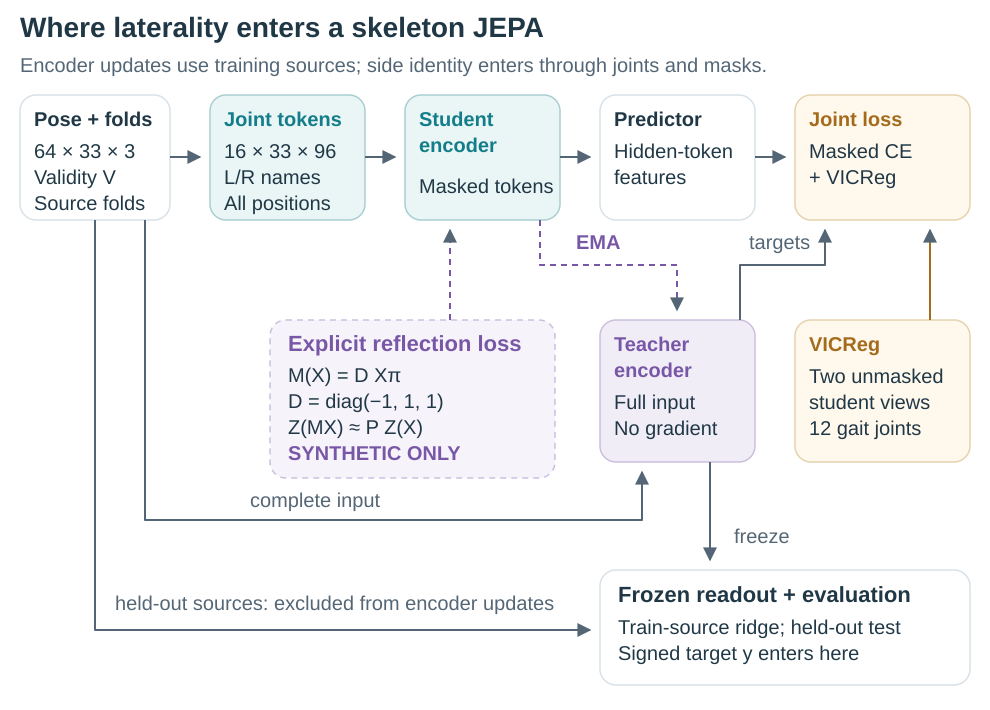
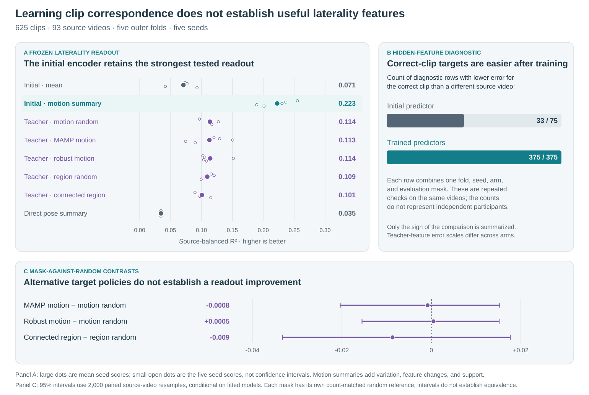
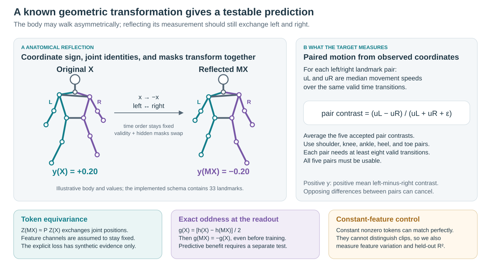

# Bilateral Geometry for Evaluating Predictive Representations of Human Gait

## Abstract

We test whether learning to predict hidden skeleton features helps a model capture left-right differences in human gait. Bilateral geometry provides a known relation for this test: mirroring a skeleton exchanges its left and right joints and reverses a signed measure comparing movement speeds on the two sides. Using 625 clips from 93 source videos, we train a skeleton Joint-Embedding Predictive Architecture (JEPA) to predict features at hidden positions. To test what those features capture, we fit a separate regression model to estimate the movement difference, comparing features from the encoder before and after JEPA training. The encoder stays fixed during regression training, and test videos are excluded from both stages of training. After training, predicted features more consistently match hidden features from the correct clip than from another source video. With a feature summary that includes motion statistics, however, the regression model gives less accurate movement estimates: mean $R^2$ falls from $0.22$ before JEPA training to $0.10$–$0.11$ afterward. Comparisons with matched random masks leave the benefits of motion-based and connected-region masks uncertain. For the JEPA models tested here, improved feature matching in latent space after training did not translate into better performance on our physical-world test of left-right movement.

## 1. Introduction

Human gait offers a concrete setting for studying what predictive models learn about physical movement. The body has corresponding joints on its left and right sides, with a known relationship under reflection: horizontal coordinates change sign and anatomical labels exchange sides. A signed comparison of movement on the two sides should reverse under the same transformation. We use this bilateral geometry to evaluate a skeleton model through a measurable property of its input.

Left-right movement also has a clinical motivation. Stroke is associated with gait asymmetry [[1]](https://pubmed.ncbi.nlm.nih.gov/18226655/), while Parkinson's disease can alter arm-swing symmetry [[2]](https://pubmed.ncbi.nlm.nih.gov/19945285/). Research on cerebral palsy examines asymmetry under changes in walking speed [[3]](https://pubmed.ncbi.nlm.nih.gov/32082235/), and work on Duchenne muscular dystrophy describes changes in pelvic and limb movement [[4]](https://pmc.ncbi.nlm.nih.gov/articles/PMC9201072/). These conditions affect different aspects of gait, so a single speed contrast cannot stand in for clinical assessment. They motivate our choice of geometry without supplying disease-specific conclusions from the present experiments.

Our model learns by predicting features at hidden positions in a skeleton sequence. An online encoder and predictor use the visible context, while a slowly updated teacher encoder supplies the target features. We evaluate the resulting representation by freezing the encoder and fitting a regression, or *readout*, to a signed left-right speed contrast. The null hypothesis is that JEPA training provides no improvement over the same encoder at initialization on held-out source videos. Mask comparisons test whether the result depends on which anatomy, time positions, or motion is hidden.

With motion statistics included in the feature summary, the regression model estimated left-right movement less accurately after JEPA training: mean $R^2$ fell from $0.22$ with the initial encoder's features to $0.10$–$0.11$ with the trained teacher encoders' features. All five training conditions showed a decrease, with 95% intervals below zero when we resampled whole source videos and kept the fitted models fixed. Feature matching improved in a separate test: average prediction error was lower for hidden features from the correct clip than for features from another source video in all 375 trained-model evaluations, compared with 33 of 75 before training. These evaluations reuse models and videos, so the counts describe repeated checks of the fitted models and should not be treated as independent experiments.

We also check how preparing the skeleton data changes the movement measure, whether mirrored training views help, and how different masking choices affect the results. These experiments contribute to Physical World AI by testing whether JEPA features support estimates of physical movement, alongside the model's performance on its training task. We developed and tested the questions on the same group of videos, so the findings remain exploratory. The experiments assess learned features and movement estimates; predicting future movement and combining information from different sensors require separate tests.

## 2. Related work

Masked prediction offers several ways to use the structure of a skeleton. The targets can be learned features, as in S-JEPA [[5]](https://www.ecva.net/papers/eccv_2024/papers_ECCV/papers/04755.pdf), while the hidden positions can be selected according to motion [[6]](https://arxiv.org/abs/2308.07092) or connected body regions [[7]](https://arxiv.org/abs/2603.10648). Their success on action recognition motivates these choices, but leaves open how well a representation preserves a particular movement measurement. Our comparisons hold the JEPA objective fixed and vary the mask. The MAMP-style condition uses the sampling rule from its official code, without adopting the full MAMP training method.

Geometry places a second requirement on representation learning: features may need to retain a transformation rather than discard it. *Invariance* means that features stay unchanged; *equivariance* means that they change by a specified rule. Predictive models can distinguish these properties [[8]](https://proceedings.neurips.cc/paper_files/paper/2025/hash/2f63d2963526bdd9ff1b8bcc2dc9905a-Abstract-Conference.html), and geometric regularization can alter the tradeoff between them [[9]](https://proceedings.iclr.cc/paper_files/paper/2026/hash/3be6511c8f56d0dca4b5ed59fdf9b2f4-Abstract-Conference.html). A reflection-invariant representation assigns the same features to a clip and its mirror, although their nonzero targets have opposite signs. We therefore consider feature transformations alongside prediction of the signed measure.

Dense video features and anticipation of human activity extend predictive learning toward physical behavior [[10]](https://arxiv.org/abs/2603.14482), [[11]](https://arxiv.org/abs/2608.21160), while gait silhouettes offer a related test of identity recognition [[12]](https://github.com/AVAuco/GaitJEPA). Our experiments examine a different outcome: recovery of a coordinate-derived movement contrast using the same readout procedure before and after training. This comparison connects the learned prediction task to a physical property without assuming that recognition, feature matching, and movement estimation improve together.

## 3. Data, training, and evaluation

### 3.1 Data and movement measure

Our data come from the Gait Abnormality in Video Dataset (GAVD) [[13]](https://arxiv.org/abs/2407.04190). Of 666 annotations in our selected subset, 642 have matching pose archives; after quality checks, 625 clips from 93 source videos remain. The five categories selected for this cohort help balance the source splits but do not supervise the encoder. Appendix B gives their counts, and Section 6 discusses the dataset choice and license.

Each pose has image-normalized horizontal and vertical coordinates and estimated depth rescaled from crop to frame-width units. Distances describe movement in these estimated coordinates, without calibration to meters per second. Camera viewpoint, image shape, pose error, and missing landmarks affect the measurement.

The movement measure uses five left-right pairs: shoulders, knees, ankles, heels, and foot tips. Coordinates are centered at the pelvis and scaled by body width before speeds are calculated from the original timestamps. A transition contributes only when both landmarks in a pair are observed at both ends of that same transition. If $m_{L,k}$ and $m_{R,k}$ denote the median left and right speeds for pair $k$, then

$$
y(x)=\frac{1}{5}\sum_{k=1}^{5}
\frac{m_{L,k}-m_{R,k}}{m_{L,k}+m_{R,k}+\epsilon}.
$$

A clip is retained only when every pair has at least eight valid transitions. The hips establish the pelvis center but are absent from the sum, since centering makes their speed magnitudes equal. We calculate $y$ before filling gaps or resizing the sequence. Its scope is narrow: a left-right contrast in median coordinate speed. It contains no stride timing, gait phase, or limb loading. Opposing differences may cancel across joint pairs, and group averages may cancel when people are affected on different sides. Near-zero values therefore have no simple clinical meaning.

Reflection $M$ flips the centered horizontal coordinate and swaps each left-right landmark pair, including the validity flags. Reflecting twice restores the skeleton, $M^2x=x$, while exchanging the two speeds reverses the contrast, $y(Mx)=-y(x)$. These identities describe the transformed coordinates; natural movement may impose constraints beyond this algebraic relation.

### 3.2 Preparing skeleton sequences for the encoder

The encoder receives a processed copy of each clip, separate from the coordinates used to calculate the movement measure. A joint is observed when visibility is at least 0.45 and all three coordinates are finite. We linearly fill interior gaps of up to four missing samples between observed endpoints; these filled positions count as valid encoder input. We center the body on the hip midpoint, using the clip's median midpoint when either hip is missing, and scale by the median of its valid shoulder and hip widths. Coordinates and validity are then linearly resized to 64 positions by sequence index, without retaining the original time intervals. A resized position is valid only if its interpolated validity is at least 0.999; remaining invalid coordinates are zero.

| Stage | Array shape | What the step does |
|:--|:--|:--|
| Archived clip | $T_i\times33\times4$, plus frame numbers and frame rate | Stores three coordinates and visibility for each landmark. |
| Movement-measure path | $T_i\times33\times3$, validity $T_i\times33$ | Uses pelvis-normalized observed coordinates and original timestamps, without gap filling or resizing. |
| Encoder input | $64\times33\times3$, validity $64\times33$ | Keeps all 33 landmark positions, with changed coordinates, timing, and validity. |
| Four-step patches | $16\times33\times12$ | Groups four prepared steps per landmark. All four validity flags must be true for a valid patch. |
| Projected feature grid | $16\times33\times96$ | Maps each 12-value patch to 96 features at the same time-block and landmark position. |
| Encoder attention batch | $B\times528\times96$, plus target and validity masks | Keeps all 528 positions. Hidden projected features are zeroed before positional encoding. Target masks select valid hidden positions; paired policies match counts per clip. |

The table describes the completed GAVD runs; $T_i$ is the archived clip length and $B$ the batch size. Landmark identity follows the fixed order of the 33 landmarks. Sequence IDs, source-video IDs, and the movement measure are stored alongside the prepared arrays. Each clip is processed separately before source splits are saved, using only data from that clip. In each outer-fold run, training draws and augmented views use training sources only; test sources are excluded from both encoder and regression fitting.

### 3.3 Laterality enters through anatomy and training losses

*Figure 1. Left-right structure enters through paired joint names, masks or pooled features based on gait joints, and an optional reflection branch. The dotted branch adds a reflection loss to the online encoder; we have tested this branch only with synthetic data. The signed movement measure is used after training, when a frozen encoder supplies features to a readout. Each clip is prepared on its own before source-fold files are written. Every training sample and transformed view keeps that source assignment.*

Testing uses five outer folds. Their held-out portions contain 19, 19, 19, 18, and 18 source videos, corresponding to 189, 182, 72, 77, and 105 clips. A video's clips and augmented versions never cross folds. For every fold and random seed, a fresh encoder is trained on the other four folds, with source-balanced sampling so that videos containing many clips do not dominate.

The readout uses ridge regression, which penalizes large coefficients to limit unstable fits. Four inner folds in the reflection comparison and three in the mask and motion-readout comparisons select the penalty. Missing-value filling and scaling are fitted on each inner training split. With the selected penalty, these steps and the regression are refitted on all outer-training sources before evaluation on the held-out fold. Inner validation selects the supervised readout; its clips have already contributed without movement labels to that fold's encoder training.

The completed GAVD runs use 64 frames, 33 landmarks, 96-dimensional features, encoder/predictor depths 4/2, four attention heads, batches of 20, and 1,200 updates. Each four-frame patch is projected to a feature vector; hidden vectors are zeroed before positional information is added, retaining the full grid of positions. At hidden positions, cross-entropy matches probability distributions over teacher feature channels. The teacher receives no gradient and follows an exponential moving average of the online encoder. VICReg, weighted by 0.05 [[14]](https://arxiv.org/abs/2105.04906), encourages similar but nonconstant pooled features from twelve gait joints across two complete views. Its access to complete clips supplies an anatomical training signal alongside masking.

Paired mask conditions share starting weights, source draws, geometric views, and update counts, while using separate random streams for their mask policies. Each clip has its own hidden positions. Invalid targets are excluded, and losses are averaged within clips before averaging across the batch.

Reflection augmentation mirrors each training clip with probability 0.5; the motion and region mask conditions contain no reflection. We also consider an explicit reflection loss that sends the unreflected and mirrored clips through the online encoder, aligns paired joint positions, and encourages their feature channels to agree. Evidence for this loss is synthetic, and its two full-input branches add two encoder passes. Appendix B gives the details. At no point does the encoder receive the movement measure or an affected-side label.

### 3.4 Testing and uncertainty

For $V$ sources and $n_v$ clips from source $v$, each clip has weight $w_{vi}=1/(Vn_v)$. With $\bar y_w=\sum w_{vi}y_{vi}$,
$$
R^2_w=1-\frac{\sum_{vi}w_{vi}(y_{vi}-\hat y_{vi})^2}
{\sum_{vi}w_{vi}(y_{vi}-\bar y_w)^2}.
$$
Every source video contributes equally regardless of its number of clips. Predictions from the five held-out folds are pooled within each seed to obtain one $R^2$, and the reported score averages the five seed values. A negative score indicates greater error than a constant prediction equal to the weighted test-set mean. For deployment, a constant baseline must instead be fitted on training sources, since the new test mean would be unknown.

Grid differences are calculated from full-precision saved predictions; summary-only estimates retain the precision available in their records. Scores and interval bounds appear to three decimal places, except that a nonzero difference below 0.001 keeps one significant digit to preserve its sign.

Uncertainty is estimated by resampling whole source videos, keeping their clips and paired seed predictions together. Mask intervals compare a body- or motion-based policy with its random reference; training intervals compare an encoder with its own initialization. We did not define a smallest meaningful difference in advance, so an interval containing zero cannot establish equivalence.

For the mask and trained-versus-initial results, 2,000 resamples are drawn from the saved predictions while the fitted models and splits remain fixed. Retraining and alternative splits would add uncertainty that these intervals do not capture. The reflection comparison also used 2,000 resamples, although only its summary survives and the underlying inputs are unavailable. Seeds and mask draws reuse the same videos; they are repeated fits, not independent participants. Source holdout protects the individual comparisons from direct leakage, while repeated development on this cohort keeps the overall study exploratory.

## 4. Results

### 4.1 Preprocessing changes the measure; reflection reduces feature error

Recalculating the movement measure from the prepared encoder input leaves 623 clips from 92 sources with finite values on both paths. Source-weighted sign agreement is 70.4%, with calculation-agreement $R^2=0.218$. Preparation therefore changes the measured target, although the contribution of individual steps remains unresolved. This comparison of calculations cannot estimate model accuracy or its upper limit.

Reflection augmentation reduces normalized feature error by $\Delta q=-0.008$, with 95% source interval $[-0.010,-0.007]$. Here $q$ compares mirrored teacher features with unreflected features after exchanging joint positions and leaving feature channels unchanged. The corresponding prediction difference is $\Delta R^2=0.004$, with interval $[-0.006,0.013]$, leaving the movement benefit uncertain. Both trained variants have greater reflection error than their initializations. These estimates survive only in the saved summary, so their uncertainty analysis could not be independently repeated.

The channel action matters: mirroring the input need not leave learned feature channels unchanged. Even perfect agreement under a chosen action can coexist with poor movement prediction. Appendix B illustrates an output formula that forces sign reversal and constant features that agree under reflection.

### 4.2 Mask effects are small relative to their uncertainty

For equal target counts, the saved comparison of all-landmark versus gait-joint masking gives $\Delta R^2=0.012$, with interval $[-0.018,0.050]$. Its raw predictions are unavailable. The motion and region comparisons retain a complete prediction grid: 25 fold-and-seed jobs with three motion conditions and 25 with two region conditions, totaling 125 encoders.

The motion-mask budget is half the smallest valid gait-joint pool in each batch, rounded down, while targets are sampled across all 33 landmarks. In the saved mask-inspection draws, this averages 80.8 hidden targets, about 17% of valid tokens over the whole body, and both motion samplers select higher-motion targets than random sampling. Connected-region inspection hides about 9.9% of valid tokens. The fraction of hidden targets with both immediate temporal neighbors visible falls from 69.9% to zero; the fraction with at least one visible adjacent body joint falls from 98.8% to 51.2%. These inspection draws describe the mask policies rather than the realized masks at every optimizer update.

| Alternative minus its own random reference | $\Delta R^2$ | 95% source interval |
|:--|--:|:--|
| MAMP-style motion weighting | −0.0008 | [−0.020, 0.015] |
| Robust motion mixture | 0.0005 | [−0.015, 0.015] |
| Connected region | −0.009 | [−0.033, 0.018] |

All three rows cover 625 clips from 93 source videos and five seeds. Since motion and region masks use different budgets, each is paired with its own random reference. The intervals cross zero and remain compatible with small gains or losses; they support neither superiority nor equivalence. Whole-trajectory and interior-gap masks were checked for coverage but were not carried through a completed training comparison. None of the outer-test results was used to choose a winning mask.

### 4.3 Trained encoders score below initialization with the expanded readout

Our compact summary takes the mean feature difference and sum for five left-right pairs, giving 960 regression inputs. An expanded summary adds temporal standard deviations, mean absolute changes between adjacent features, and ten values describing how much paired data is valid, for 2,890 inputs. The initial encoder's $R^2$ rises from $0.071$ to $0.223$, a difference of $0.152$. With the expanded summary, trained teachers reach $0.101$–$0.114$. Every teacher scores below its initialization on $R^2$ and above it on mean absolute error in every seed. Final online encoders also have lower $R^2$ than their initial weights.

The initial-encoder control includes a trained pose detector, anatomical joint names, preprocessing, feature construction, and a regression fitted with movement labels. Only JEPA training is absent. The expanded summary changes several factors together: its dimension, temporal statistics, and information about missing data. Their individual contributions have not been measured, and standard deviation itself discards event order.

Paired intervals calculated from the saved predictions lie below zero for all five training arms. Under the random motion mask, for example, trained minus initial $R^2$ is $-0.109$, with interval $[-0.170,-0.041]$. Appendix A reports the complete set. These results locate a shortfall in the combination of this training method and readout; another readout might still recover movement information that ours misses.

For the expanded summary, 49 of 125 teacher fits (39.2%) and 96 of 125 online-encoder fits (76.8%) select the largest tested ridge penalty, 10,000. Extending the search through training-source validation could change the scores. A separate baseline fits ridge regression to 264 coordinate and validity summary values from prepared poses and reaches $R^2=0.035$; more expressive coordinate models remain to be tested.

### 4.4 Predictors distinguish correct clips from mismatched sources

*Figure 2. A: With the expanded summary, mean readout $R^2$ falls from $0.223$ at initialization to $0.101$–$0.114$ after training. Points are seed scores on the same 93 videos, not confidence intervals or independent samples. B: Correct-clip feature error is lower in 375/375 trained diagnostic evaluations versus 33/75 initial evaluations. The trained evaluations cover 125 models under three masks; duplicated initial controls are counted once. C: Mask-versus-random intervals, distinct from the trained-minus-initial intervals in Appendix A. Values come from the saved prediction grid.*

For each diagnostic evaluation, we compare source-weighted mean squared feature error against correct-clip teacher targets and valid targets from another source, holding control clips and hidden positions fixed. Correct-clip error is lower in all 375 trained evaluations, compared with 33 of 75 initial evaluations. Each teacher target uses the full clip, so matching can draw on pose, camera view, missing-data patterns, or motion also available in the visible context. These comparisons measure clip correspondence without isolating hidden movement.

Each condition learns against its own teacher, whose feature scale and variation may differ. Consequently, raw feature losses do not provide a common scale for ranking the encoders. The movement readout supplies that shared outcome. The present diagnostics leave the cause of its training deficit unresolved.

## 5. Discussion and next steps

JEPA training improved hidden-feature matching, while the regression model estimated left-right movement less accurately from trained features when the summary included motion statistics. The alternative masks changed which parts of the skeleton sequence remained visible, but their comparison intervals still allowed both gains and losses in movement prediction. Preparing the skeleton data also changed the movement measure, so the present experiments do not identify a single cause of the poorer estimates.

We can test several possible explanations using the saved encoders, without repeating JEPA training. This includes testing missing-data indicators alone, comparing feature summaries of equal size, and trying a wider range of ridge penalties. Recalculating the movement measure after each preparation step would show where it changes. Any videos used to choose a training method must be excluded from both encoder training and regression fitting.

An explicit reflection loss needs to be tested on real gait data against both the same recipe without that loss and the initial encoder. The comparison should measure reflection error and movement-prediction accuracy, check that the features are not constant, and include the cost of extra encoder passes. Reflection augmentation shows why both measures matter: it reduced reflection error relative to training without augmentation, while its movement benefit remained uncertain. Confirmation requires new source videos and an evaluation plan fixed before examining their results.

Testing future movement would extend this work to models of physical dynamics. Each method should use only past inputs to predict the same future coordinates and be compared with simple baselines that repeat the last pose or continue its recent velocity. Our current measure averages normalized differences between left- and right-side median speeds and discards event order. A forecasting test must also measure errors as predictions are rolled forward over several steps and check the left-right geometry of the predicted movement.

## 6. Scope, ethics and reproducibility

We chose GAVD because it provides clinician-annotated examples of normal and abnormal gait from clinics and less controlled settings [[13]](https://arxiv.org/abs/2407.04190). Its varying camera views and pose quality make left-right measurement a practical challenge. Annotated walking segments, boxes locating the person, and source IDs let us trace extracted skeletons to their recordings and keep related clips together. Public annotations make clip selection open to inspection [[15]](https://github.com/Rahmyyy/GAVD/blob/a87859c881603443f200bcd640663d2c3d7a8136/README.md). Gait categories describe our sample and balance source splits without serving as encoder training labels.

Separating videos cannot guarantee that test participants are new, since one person may appear in several recordings. Our sample has no verified labels for which side is affected and no independent clinical measurement of the target. The gait annotations describe what clinicians observed; our speed measure leaves out step timing and forces on the limbs, and opposing differences at different joints can cancel. These limits prevent us from treating the measure as a clinical assessment or assuming that the findings generalize beyond this sample.

GAVD's repository uses the MIT License, copyright 2024 Rahmyyy [[16]](https://github.com/Rahmyyy/GAVD/blob/a87859c881603443f200bcd640663d2c3d7a8136/LICENSE). It allows use, modification, and redistribution of covered materials without a license fee, including for research and commercial work. Copies or substantial portions must retain the copyright and permission notices. The license provides no warranty and limits the authors' and copyright holders' liability. The maintainers explicitly permit research use of the supplied annotations under these terms [[15]](https://github.com/Rahmyyy/GAVD/blob/a87859c881603443f200bcd640663d2c3d7a8136/README.md).

Researchers obtain the videos separately through GAVD's links and must follow platform terms, institutional ethics requirements, and applicable copyright and data-protection rules [[15]](https://github.com/Rahmyyy/GAVD/blob/a87859c881603443f200bcd640663d2c3d7a8136/README.md). The MIT License alone does not authorize redistribution of those videos or our derived pose files; release needs separate review. Reproduction records should include the annotation version, retrieval dates, exclusions, and source splits, because video links can disappear.

We checked the reported results by recalculating 200 rows of pooled prediction scores and three mask-comparison intervals from 125,000 saved predictions. We also verified hashes for the result tables and all 125 training histories, without rerunning checkpoint inference. Results available only as summaries could not be reconstructed. The [evidence records](../README.md#v8-adversarial-claim-review), [recomputation script](../verify_physworld_evidence.py), and [figure provenance](../figures/physworld_figure_provenance.json) identify the available files and the checks performed.

## References

[1] K. K. Patterson, I. Parafianowicz, C. J. Danells, V. Closson, M. C. Verrier, W. R. Staines, S. E. Black, and W. E. McIlroy. [Gait asymmetry in community-ambulating stroke survivors](https://pubmed.ncbi.nlm.nih.gov/18226655/). *Archives of Physical Medicine and Rehabilitation*, 89(2):304–310, 2008. doi:10.1016/j.apmr.2007.08.142.

[2] M. D. Lewek, R. Poole, J. Johnson, O. Halawa, and X. Huang. [Arm swing magnitude and asymmetry during gait in the early stages of Parkinson's disease](https://pubmed.ncbi.nlm.nih.gov/19945285/). *Gait & Posture*, 31(2):256–260, 2010. doi:10.1016/j.gaitpost.2009.10.013.

[3] S. M. Brændvik, T. Goihl, R. S. Braaten, and B. Vereijken. [The Effect of Increased Gait Speed on Asymmetry and Variability in Children With Cerebral Palsy](https://pubmed.ncbi.nlm.nih.gov/32082235/). *Frontiers in Neurology*, 10:1399, 2020. doi:10.3389/fneur.2019.01399.

[4] I. Vandekerckhove, M. Van den Hauwe, N. De Beukelaer, E. Stoop, M. Goudriaan, M. Delporte, G. Molenberghs, A. Van Campenhout, L. De Waele, N. Goemans, F. De Groote, and K. Desloovere. [Longitudinal Alterations in Gait Features in Growing Children With Duchenne Muscular Dystrophy](https://pmc.ncbi.nlm.nih.gov/articles/PMC9201072/). *Frontiers in Human Neuroscience*, 16:861136, 2022. doi:10.3389/fnhum.2022.861136.

[5] M. Abdelfattah and A. Alahi. [S-JEPA: A Joint Embedding Predictive Architecture for Skeletal Action Recognition](https://www.ecva.net/papers/eccv_2024/papers_ECCV/papers/04755.pdf). In *Computer Vision – ECCV 2024*, volume 15090 of *Lecture Notes in Computer Science*, pages 367–384. Springer, 2025. doi:10.1007/978-3-031-73411-3_21.

[6] Y. Mao, J. Deng, W. Zhou, Y. Fang, W. Ouyang, and H. Li. [Masked Motion Predictors are Strong 3D Action Representation Learners](https://arxiv.org/abs/2308.07092). In *Proceedings of the IEEE/CVF International Conference on Computer Vision (ICCV)*, pages 10181–10191, 2023.

[7] J. Do, Y. Chen, G. Youk, and M. Kim. [Less is More: Compact-Token Masked Feature Prediction for Skeleton Representation Learning](https://arxiv.org/abs/2603.10648). arXiv preprint arXiv:2603.10648v3, 2026.

[8] H. Ghaemi, E. B. Muller, and S. Bakhtiari. [seq-JEPA: Autoregressive Predictive Learning of Invariant-Equivariant World Models](https://proceedings.neurips.cc/paper_files/paper/2025/hash/2f63d2963526bdd9ff1b8bcc2dc9905a-Abstract-Conference.html). In *Advances in Neural Information Processing Systems*, volume 38, pages 32943–32973, 2025. doi:10.52202/085713-1104.

[9] J. Lee, C. Kim, H. Kim, K. Lee, and J. Lee. [Soft Equivariance Regularization for Invariant Self-Supervised Learning](https://proceedings.iclr.cc/paper_files/paper/2026/hash/3be6511c8f56d0dca4b5ed59fdf9b2f4-Abstract-Conference.html). In *Proceedings of the International Conference on Learning Representations (ICLR)*, pages 35502–35521, 2026.

[10] L. Mur-Labadia, M. Muckley, A. Bar, M. Assran, K. Sinha, M. Rabbat, Y. LeCun, N. Ballas, and A. Bardes. [V-JEPA 2.1: Unlocking Dense Features in Video Self-Supervised Learning](https://arxiv.org/abs/2603.14482). arXiv preprint arXiv:2603.14482v3, 2026.

[11] H. Wei, L. Sun, and G. Zhao. [Human-JEPA: A Human-Centric Vision Model that Perceives and Anticipates](https://arxiv.org/abs/2608.21160). arXiv preprint arXiv:2608.21160v1, 2026.

[12] M. J. Marin-Jimenez, I. Jimenez-Velasco, and R. Muñoz-Salinas. [GaitJEPA: How Far Can We Go with JEPA on Binary Silhouettes for Gait Recognition?](https://github.com/AVAuco/GaitJEPA) *IEEE International Joint Conference on Biometrics (IJCB)*, accepted paper, 2026. Author repository; accessed 10 September 2026.

[13] R. Ranjan, D. Ahmedt-Aristizabal, M. Ali Armin, and J. Kim. [Computer Vision for Clinical Gait Analysis: A Gait Abnormality Video Dataset](https://arxiv.org/abs/2407.04190). *IEEE Access*, 13:45321–45339, 2025. doi:10.1109/ACCESS.2025.3545787.

[14] A. Bardes, J. Ponce, and Y. LeCun. [VICReg: Variance-Invariance-Covariance Regularization for Self-Supervised Learning](https://arxiv.org/abs/2105.04906). In *Proceedings of the International Conference on Learning Representations (ICLR)*, 2022.

[15] Rahmyyy. [GAVD repository documentation and dataset access policy](https://github.com/Rahmyyy/GAVD/blob/a87859c881603443f200bcd640663d2c3d7a8136/README.md). GitHub, n.d. README at commit a87859c; accessed 10 September 2026.

[16] Rahmyyy. [GAVD MIT License](https://github.com/Rahmyyy/GAVD/blob/a87859c881603443f200bcd640663d2c3d7a8136/LICENSE). GitHub, n.d. Copyright 2024 Rahmyyy; LICENSE at commit a87859c; accessed 10 September 2026.

## Appendix A. Trained versus initial encoders

Each final teacher encoder is compared with its own starting weights using the expanded feature summary and the same ridge-readout procedure. Every row covers 625 clips from 93 source videos and five seeds.

| Training arm | Learned minus initial $R^2$ | 95% source interval |
|:--|--:|:--|
| Motion uniform | −0.109 | [−0.170, −0.041] |
| MAMP-style motion | −0.110 | [−0.165, −0.051] |
| Robust motion | −0.108 | [−0.171, −0.042] |
| Region uniform | −0.113 | [−0.166, −0.060] |
| Connected region | −0.122 | [−0.183, −0.055] |

The intervals come from 2,000 paired resamples of whole source videos, with each video's clips and seed predictions kept together. They condition on the fitted models and current splits, omitting uncertainty from retraining and making no adjustment for the five conditions. All intervals lie below zero for this training and expanded readout.

## Appendix B. Measurement and training details

The target path retains original timestamps and uses transitions where both paired landmarks are observed at both ends. Pelvis centering requires both hips, and body scale is the median valid width across shoulder and hip pairs, with a unit fallback. The contrast uses $\epsilon=10^{-8}$. The encoder path additionally fills short gaps, permits a median-pelvis fallback, and resizes to 64 positions. Their individual contributions to the measurement disagreement have not been separated. All 33 joint positions remain allocated throughout training.

The selected cohort contains 270 normal, 183 myopathic, 75 stroke, 58 cerebral-palsy, and 39 Parkinson's clips. These counts describe the sample; they identify neither the affected side nor disease prevalence.

Motion and region runs use AdamW with learning rate $10^{-3}$, weight decay 0.05, gradient clipping at 1, and teacher EMA 0.999. Online and teacher temperatures are 0.10 and 0.06, and the target-center EMA is 0.9. The reflection-augmentation recipe schedules teacher EMA from 0.999 toward 1. Paired mask conditions match source draws, initial weights, update counts, and hidden-target counts for each clip.

The optional reflection loss compares unreflected and mirrored online-encoder features after aligning joint positions, with feature channels fixed. Squared error over positions valid in both views is divided by their combined feature energy. The denominator is held fixed during gradient calculation and bounded away from zero; clip losses are then averaged. Both branches receive gradients through two extra full-input passes. This loss has synthetic evidence only and was absent from the completed GAVD mask runs.

*Figure 3. Reflection swaps anatomical sides and reverses the movement measure. The lower panels illustrate two ways to satisfy symmetry without accurate movement prediction: force sign reversal in the output formula, or use constant features. Bodies and values are schematic examples.*
