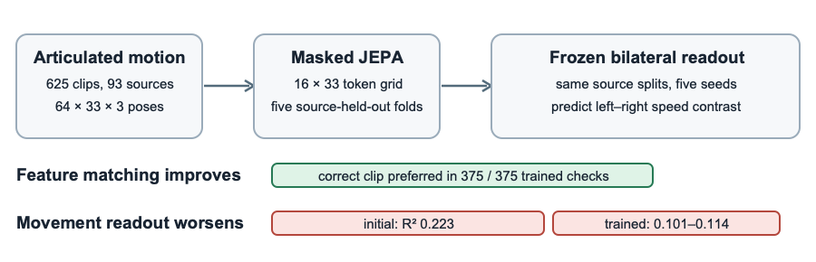

# Neurologically Motivated Self-Supervised Learning for Bilateral Gait Geometry

**[Authors and affiliations to be inserted in the RISEx template]**

## INTRODUCTION

AI systems that perceive people from video often compress articulated motion into learned features. Before using such features in a human-aware robotic pipeline, we should check whether they retain task-relevant geometry. A horizontal reflection exchanges left and right landmarks and reverses a signed contrast between their movement speeds. This relation is relevant to gait asymmetry in stroke and Parkinson's disease [1,2], although our pose-derived contrast is neither a diagnosis nor a clinical measurement. We test whether masked joint-embedding predictive architecture (JEPA) training improves recovery of this contrast.

## MATERIALS AND METHODS

We analyzed 625 quality-checked GAVD pose clips from 93 source videos [3]. Clip-local preparation retains all 33 landmarks in a 64-by-33-by-3 sequence; four-frame patches form a 16-by-33 time-by-joint grid. The encoder predicts hidden teacher features from visible tokens [4]. Movement scores and affected-side labels are absent from pretraining.

The score averages normalized left-minus-right median speeds for five joint pairs. The null hypothesis was no improvement over the same encoder at initialization. Five outer folds exclude whole source videos from encoder and frozen ridge-readout fitting. Five seeds repeat matched comparisons with shared starts, source draws, views, and updates. Scores weight sources equally; intervals resample complete sources while holding fitted models fixed.

## RESULTS AND DISCUSSION

| Prespecified check | Result |
|:--|:--|
| Initial encoder, bilateral readout | $R^2=0.223$ |
| Five trained teacher encoders | $R^2=0.101$–$0.114$ |
| Trained minus matched initial | $-0.109$ to $-0.122$; each saved interval below zero |
| Correct clip gives lower feature error | 375/375 trained checks; 33/75 at initialization |

JEPA training made hidden features more specific to the correct clip, yet trained encoders gave weaker bilateral-movement estimates. Motion and connected-region masks showed no clear gain over matched random references. This comparison tests latent correspondence against a known geometric observable under a matched source-held-out control.

Feature errors use condition-specific teachers and can reflect pose, viewpoint, or missing observations. The readout changes feature dimension and adds motion and missingness summaries. Input preparation changes the score (70.4% sign agreement; $R^2=0.218$). These factors may contribute to the deficit.

## CONCLUSIONS

In this dataset and recipe, improved latent prediction did not improve the frozen bilateral readout. Future human-aware robotics studies should test future motion or interaction-relevant quantities with stable targets and simple baselines.

## REFERENCES

[1] Patterson KK et al. *Arch Phys Med Rehabil* 89:304–310, 2008. [2] Lewek MD et al. *Gait Posture* 31:256–260, 2010. [3] Ranjan R et al. *IEEE Access* 13:45321–45339, 2025. [4] Assran M et al. arXiv:2301.08243, 2023.
