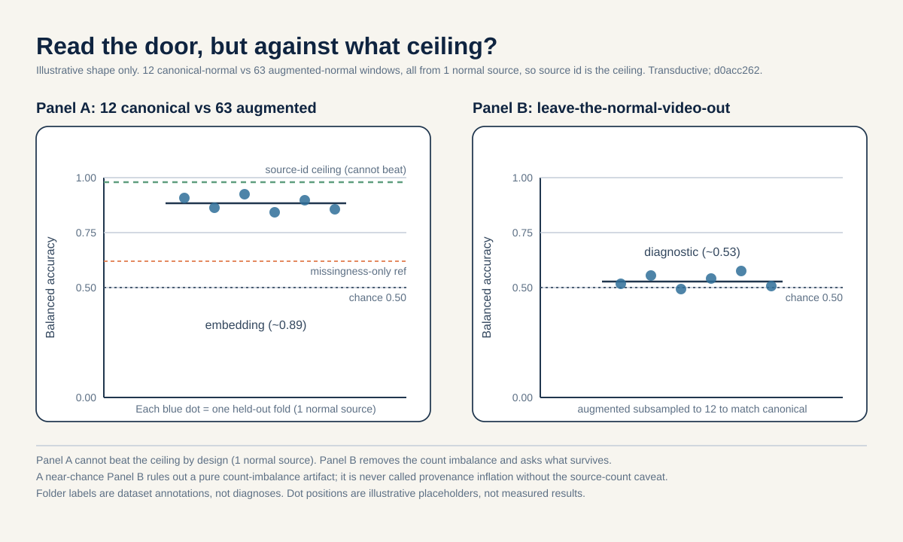
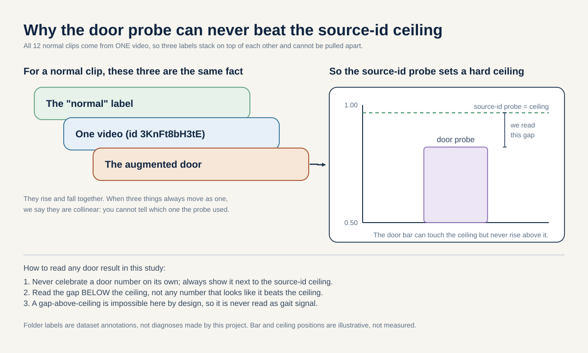

# Extraction-pathway attribution: how much normal-vs-abnormal signal is provenance, not gait?

**Portfolio role:** evaluation-validity, rank 1
**Three-week endpoint:** 5 September 2026
**Estimated effort:** 6 to 9 researcher-days, largely zero-retrain (one re-embedding pass plus linear probes)

*If you want to actually run this, see [METHODOLOGY.md](./METHODOLOGY.md).*

> First re-embed every clip under one frozen model. The clips arrived through two processing pipelines: an augmented path and a canonical path. How much of the very high normal-vs-abnormal signal is the model reading the pipeline instead of the walking? We test this by asking a simple classifier to guess a clip's pipeline, and we compare that guess against a fair ceiling set by source-video identity.

## The question in plain words

### The big idea in plain words

Imagine you built a machine that watches videos of people walking and decides "this person walks normally" or "this person's walk looks unusual." The machine is almost never wrong. That sounds great. But then you notice something awkward: all your normal walking videos came from one place, and they were prepared in a slightly different way than the unusual ones. So maybe the machine is not judging the walking at all. Maybe it just learned to spot which pile each video came from, like a kid who "aces" a test because someone wrote the answers on the desk. This project is the honest check: we try to prove the machine is cheating. If we cannot make it cheat, the impressive result survives one hard round of doubt.

### The longer version

This project trains a model to turn short skeleton clips of people walking into compact number vectors, called embeddings. (A skeleton is a stick figure traced over the person. An embedding is a short fingerprint of numbers that stands in for the whole clip.) Take those embeddings, then ask a simple straight-line classifier (a linear probe) to split the clips labeled "normal" from every clip labeled "abnormal." It succeeds almost perfectly. Separability at the embedding level is very high, on the order of 0.96 area-under-curve (AUC, a score where 0.5 is a coin flip and 1.0 is perfect). That single number is the most impressive headline the project produces. It is also the most fragile.

Here is why it is fragile. The clips did not all arrive through the same door. Most of the normal clips were produced by an AUGMENTED extraction path: extra normal walking windows were mined and added to enlarge the normal group. Every abnormal clip was produced by the original CANONICAL path. "Provenance" here just means which door a clip came through. If the two doors leave any fingerprint, such as a slightly different camera setting, a different cropping habit, or a different way missing joints get filled in, then a classifier can separate normal from abnormal by reading the door, not the walking. It would look like the model understands gait when it is really reading a processing artifact.

So the question is not "can the model tell normal from abnormal." It is "when the model looks normal-versus-abnormal, how much of that is gait and how much is the door." We attack this directly by trying to predict the door itself. If the embeddings let a simple probe recover which extraction path a clip came from, then provenance is written into the representation, and any normal-vs-abnormal claim that rides on that axis is suspect.

There is one hard limitation we state up front, not at the end. All twelve normal sequences in the canonical cohort come from a single YouTube source video. So "which door," "which video," and even "normal versus abnormal" are almost the same question for normal clips. When two things move together like this, we say they are collinear (they rise and fall together, so you cannot tell them apart). That collinearity means a provenance probe cannot possibly beat a probe that just memorizes source-video identity. We therefore do not claim to isolate provenance from source. We measure provenance decodability against the source-identity ceiling and report the gap honestly.

### Words you will need

- **Skeleton:** a stick figure of body joints traced over a walking person, instead of the raw video. It hides the face and clothing and is much smaller than video.
- **Embedding:** a short list of numbers that acts as a fingerprint for a whole clip. Similar walks get similar fingerprints.
- **Token:** the smallest chunk the model reads, here one body joint at one moment in time.
- **Linear probe:** a simple straight-line classifier trained on top of frozen embeddings to see what information the embeddings already contain.
- **Provenance (the door):** which processing pipeline produced a clip, augmented or canonical. Not a fact about the walking, a fact about the plumbing.
- **Collinear:** two things that move together so tightly you cannot separate their effects (here, "normal label," "one video," and "augmented door" all coincide).
- **AUC:** area-under-curve, a separability score from 0.5 (coin flip) to 1.0 (perfect).
- **Balanced accuracy:** the average correct-rate across the two classes, so a lopsided group size cannot flatter the score. 0.5 is chance for two classes, 1.0 is perfect.
- **Transductive:** the model was trained on the very clips you later score it on, so a high score can just be memory, not understanding.
- **Source-identity ceiling:** the best a probe can do if you simply hand it the source-video id. Because our doors ride on video identity, no provenance probe can beat this, so we always report next to it.
- **Lateralized vs symmetric:** lateralized means one side of the body moves differently from the other (a one-sided problem). Symmetric means both sides are affected about the same.
- **Upper-motor-neuron lesion:** an injury in the brain's movement-command wiring (the nerves that carry "move" signals down to the muscles), not in the muscle itself.
- **Corticospinal tract / decussates:** the corticospinal tract is the main bundle of movement-command nerves running from the brain down the spinal cord. It "decussates," meaning it crosses to the other side of the body, so a one-sided brain injury weakens the opposite side.
- **PVL (periventricular leukomalacia):** early-life damage to the brain's white matter (its wiring). One-sided PVL leads to a one-sided (hemiplegic) walk.
- **Nigrostriatal pathway:** a dopamine circuit deep in the brain that helps make movement smooth. Early Parkinson's damages it on one side first.

## Why this matters

A positive result means provenance is strongly decodable from the embeddings and tracks the same axis that separates normal from abnormal. In plain words: the model can read the door, and reading the door lines up with reading "normal versus abnormal." That confirms a specific belief: the order-0.96 separability is at least partly an acquisition or extraction shortcut, not gait understanding. It would tell everyone downstream to distrust any normal-vs-abnormal claim built on this cohort until the two extraction paths are harmonized (made to match). It converts a documented hard-constraint confound into a concrete, quantified caution.

A null result means provenance is NOT decodable beyond what source identity trivially forces. In plain words: once you account for the fact that all normal clips come from one video, there is no extra "door signal" left to find. That would rule out the simplest "it is just a processing artifact" explanation. It would not prove the model understands gait, because source identity still confounds everything, but it would remove one specific and plausible failure mode and let the normal-vs-abnormal number survive one round of adversarial scrutiny.

Either way the deliverable is a reusable evaluation lesson for small, grouped skeleton cohorts: when you enlarge one class through a different pipeline, measure how much of your separability is the pipeline. Reviewers reward this originality-through-evaluation framing (ICLR 2026 Reviewer Guide values a well-motivated study that contributes new knowledge, including a careful negative result).

## Conference-level augmentation

This section lifts the study from a single-cohort audit to a named, transferable leakage diagnostic, and states plainly why the provenance confound is not just a bookkeeping nuisance but a threat to the one axis every other proposal in this portfolio leans on.

**The neuroscience source, mechanism, and skeleton-measurable feature (why provenance is dangerous here).** The conditions in this cohort separate along a single mechanism-defined axis. Some are LATERALIZED (they break left-right symmetry, so one side of the body moves differently from the other). One is SYMMETRIC (both sides are affected about the same way). Here is the story one condition at a time.

Stroke: it follows from injury on one side of the brain to the nerves that carry movement commands down to the muscles (an upper-motor-neuron lesion, which just means the injury is in the brain's movement-command wiring, not in the muscle itself). Those nerves cross over to the other side of the body on their way down (the corticospinal tract decussates, meaning it crosses sides), so a one-sided brain injury weakens the opposite side of the body, and the walk becomes one-sided (Natali and Javed StatPearls, PMID 30571044).

Hemiplegic cerebral palsy: it comes from a one-sided injury to the brain's white matter early in life (unilateral PVL, one-sided damage to the brain's wiring), so again one side is weaker (Volpe 2009, PMID 19081519).

Early Parkinson's disease: it starts with cell loss on one side of a deep brain circuit that controls smooth movement (the nigrostriatal pathway, a dopamine circuit deep in the brain), so it too begins one-sided (Riederer and Sian-Hulsmann 2012, PMID 22367437).

Myopathy: this one is different in kind. It is a disease of the muscle itself, not the brain wiring, and it weakens the muscles closest to the trunk on both sides about equally (Barohn et al. 2014, PMID 25037080). At the skeleton level it reads as near-symmetric, with no clear left-versus-right timing or spacing difference compared with healthy walkers (Xiong et al. 2023, PMID 37525241).

The skeleton-measurable feature that carries this contrast is low signed left-minus-right asymmetry, the symmetry-ratio biomarker family (Patterson et al. 2010, PMID 19932621). Markerless skeleton tracking is accurate enough to carry it (Stenum et al. 2021, PMID 33891585: temporal error 0.02 seconds per step, sagittal joint angles 4 to 7 degrees).

Here is the danger, stated as a chain. Myopathy is the near-symmetric anchor of the whole axis. It is also the class that dominates the canonical extraction path: 47 of the 96 canonical sequences are myopathic, drawn from 10 of the 18 source videos, while most normal rows arrive through the augmented path. So the acquisition-pathway split (which door a clip came through) rides on nearly the same partition as the symmetric-versus-lateralized class contrast. A provenance leak therefore does not smear across the cohort evenly. It lands hardest on exactly the axis that separates the symmetric anchor from the lateralized conditions, which is the axis every downstream proposal in this portfolio depends on. That is why this item is the foundation: if provenance is decodable, the mechanism axis is compromised at its most load-bearing joint.

Reading the math (47 of 96, 10 of 18):
- 47 of 96 says myopathic sequences are just under half of all canonical sequences (47 divided by 96 is about 0.49).
- 10 of 18 says those myopathic sequences come from 10 of the 18 canonical source videos, a majority of the independent units.
- Both are plain counts and fractions, no units, taken directly from the cohort composition.
- The point of the two numbers together: the symmetric anchor class is over-represented on the canonical path at both the clip level and the source-video level, so pathway identity and the symmetric-vs-lateralized label move together.

**The generalizable claim (what transfers beyond gavd5-drift).** The transferable object is not a number about this cohort. It is a method: a Provenance-Decodability Index, defined as the fraction of a headline separability that a same-label acquisition-pathway probe can recover, reported against the source-identity upper bound. In plain words, it asks: of all the "normal versus abnormal" signal we are proud of, what slice can be reproduced just by guessing the door? Framed under the leakage taxonomy of Kapoor and Narayanan (arXiv:2207.07048) (leakage means information sneaking into the answer that should not be there), this names a distinct leakage subtype for self-supervised skeleton pipelines: same-label acquisition-pathway identity, separate from ordinary train-test contamination. The claim that generalizes is that in grouped self-supervised skeleton pipelines, same-label acquisition-pathway identity is a distinct, quantifiable leakage subtype whose severity is captured by this index, and that the index transfers to any setting where the class label is partially collinear with extraction or acquisition provenance. The principle travels; the gavd5-drift value stays local.

Reading the math (the Provenance-Decodability Index):
- The index is a fraction between 0 and 1.
- It is (how much of the headline separability a same-label pathway probe recovers) divided by (how much the source-identity upper-bound probe recovers).
- 0 means the pathway probe recovers none of the headline separability, so provenance is not the shortcut.
- A value near 1 means the pathway probe recovers almost as much as source identity itself, so the headline number is mostly the door, not the walking.
- It is reported against the source-identity upper bound (not against a raw accuracy) because with only 1 canonical-normal source the pathway probe cannot beat source identity by design, so the ceiling has to travel with the number.

**Biomarker-specific external-cohort note (honest scope).** No external cohort is required or claimed. This is a near-zero-retrain internal leakage diagnostic on the frozen `d0acc262` checkpoint over the canonical 96 sequences and 18 source videos, and the transferable object is the method (the index and its source-identity upper bound), not a clinical number. The honest limitation is structural: because no participant-disjoint public skeleton cohort exists for cerebral palsy or myopathy (no separate dataset with different people we could re-test on), the index cannot be externally revalidated on skeletons here. It is therefore reported only as an internal, transductive audit, every result is labeled transductive (the encoder saw all rows), and folder labels remain dataset annotations, not diagnoses. This item does not carry a clinical-accuracy claim and does not try to; that would be an external-cohort reach-tier statement, and there is no such cohort to make it against.

**Honest feasibility delta versus the original.** There is essentially no delta. The original plan is already core, roughly 3 weeks, and near-zero-retrain, and the augmentation keeps it there. It reuses the frozen `d0acc262` target-encoder features (bound to one fingerprint before any comparison) and fits only cheap linear or probe readouts: the same-label pathway probe, the source-identity upper bound, and the headline separability being audited. No encoder retraining is added. The only data need is the existing canonical parquet with source-video id, condition label, and provenance (canonical versus augmented) columns, verified before any join; no new data collection. The gates are unchanged: a Day-5 gate on fingerprint and provenance-column integrity, and a Day-14 decisive index figure. Reach weeks: none, because there is no external cohort to reach for. This item stays the fast, bulletproof foundation and does not chase ambition.

## Background and related work

**What a token is.** The model does not see raw video. Each walking sequence is resized to 64 frames. Every group of 4 adjacent frames becomes one time patch, giving 16 time positions. BlazePose tracks 33 body joints (Grishchenko et al., arXiv:2206.11678). One joint at one time position is a "token": there are 33 x 16 = 528 possible joint-time tokens. Think of a token as one cell in a grid, where the rows are joints and the columns are moments in time.

Reading the math (33 x 16 = 528):
- This says the number of tokens is joints times time positions.
- 33 is the count of BlazePose body joints.
- 16 is the count of time positions (64 frames divided into groups of 4).
- "x" is ordinary multiplication.
- 528 is a plain count, no units, and it is fixed by the design.
- If you used more frames per patch, you would get fewer time positions and fewer tokens.

Each token starts as a 4-frame-by-3-coordinate = 12-number vector (x, y, and a relative depth z) and is mapped by a linear layer to an embedding of width 64. In plain words, each little grid cell begins as a short list of 12 raw numbers and is turned into a richer list of 64 learned numbers.

Reading the math (4 x 3 = 12):
- This says each token begins as a small list of 12 numbers before the model touches it.
- 4 is the frames in one time patch.
- 3 is the coordinates per joint: x (across), y (up-down), and z (a rough front-back depth).
- 12 is the length of that starting list, no units.
- 64 is the width of the embedding the linear layer produces, meaning each token becomes a list of 64 numbers.

**JEPA, encoder, teacher, predictor, masking.** JEPA stands for Joint-Embedding Predictive Architecture. The everyday picture: cover part of a photo with your hand, then guess what is behind your hand. JEPA does that with skeleton clips, but with one twist. Instead of rebuilding raw pixels or coordinates, it hides some tokens and predicts their FEATURES (the learned number vectors, not the raw inputs). It guesses the summary of the hidden part, not its exact position. Two encoders are used. (An encoder is the part that turns tokens into embeddings.) The online (view) encoder sees only the visible tokens. The target encoder sees all 528 tokens. It is an EMA teacher. EMA means exponential moving average, which is like a slow-moving average that ignores day-to-day noise: the teacher's weights are a smoothed running average of the online encoder's weights (momentum near 0.999 to 1.0) and are never updated by gradient descent (stop-gradient, meaning no learning signal flows back into it, so the teacher stays a calm reference).

Reading the math (momentum 0.999 to 1.0):
- This says the teacher updates very slowly toward the online encoder.
- Momentum is the fraction of the old teacher weights kept at each step.
- The range 0.999 to 1.0 is between 0 and 1; values this close to 1 mean the teacher barely moves each step.
- At exactly 1.0 the teacher would never change at all.

A predictor, a small 2-layer Transformer with a learned mask token, guesses the teacher's hidden features at the masked positions (Assran et al., I-JEPA, arXiv:2301.08243; Bardes et al., V-JEPA, arXiv:2404.08471, which established masked latent feature prediction with an EMA target and stop-gradient). S-JEPA (Abdelfattah and Alahi, ECCV 2024, DOI 10.1007/978-3-031-73411-3_21) is the skeleton-specific member of this family and supplies the architecture used here.

**Anti-collapse and VICReg.** A predict-your-own-features objective can cheat by making all features identical, a failure called collapse (imagine the model answering "42" to every question). VICReg (Bardes, Ponce, LeCun, ICLR 2022, arXiv:2105.04906) adds a variance floor (keep some spread) and a covariance penalty (do not let dimensions duplicate each other) so features stay varied. Here the total training loss is:

`L = L_JEPA + 0.05 * L_VICReg + 0.25 * L_group`

Reading the math:
- This says the total training loss is a weighted sum of three parts. (Loss is a score of how wrong the model is; training tries to make it small.)
- L is the total loss the training tries to make small.
- L_JEPA is the main part: how badly the predictor guesses the teacher's hidden features.
- L_VICReg is the anti-collapse part: it pushes features to stay spread out and not all become the same.
- L_group is a label-aware part: it pulls clips of the same condition close together and pushes different conditions apart.
- "*" is multiplication and "+" is addition, so each part is scaled then added up.
- 0.05 and 0.25 are weights (dimensionless dials). 0.05 is small, so anti-collapse is a light nudge, just enough to prevent cheating. 0.25 is larger, so the label-aware term has real pull. Both are much smaller than the implicit weight of 1.0 on L_JEPA, so feature prediction stays the main job.
- Loss values have no fixed units; only their relative size matters.
- If you set 0.05 to zero, features could collapse to one point. If you set 0.25 to zero, the encoder would stop being pushed to sort conditions and Stages 1 to 4 would no longer be supervised fine-tuning.

Note that the group loss makes Stages 1 to 4 supervised representation fine-tuning, not pure self-supervised learning. (It uses the labels, so it is not learning purely on its own.) Final feature standard deviation is 0.413745 (not collapsed), meaning the features kept a healthy spread.

**Why leakage is the frame.** Kapoor and Narayanan (arXiv:2207.07048) catalog leakage failures in ML-based science, including the absence of a truly independent test set. In this cohort the independent unit is the SOURCE VIDEO, not the clip: clips from one video are not independent samples, the same way two frames of one movie are not two different movies. All results reported here are TRANSDUCTIVE, meaning the encoder saw every evaluation row during training. A held-out probe split is still transductive if the encoder saw that video's clips. Varoquaux (NeuroImage 2018) warns that tiny sample sizes produce large error bars (wide uncertainty), which is why we report per-source dots and permutation nulls rather than a single accuracy. GAVD, the gait video dataset, is Ranjan et al. (IEEE Access 2025, DOI 10.1109/ACCESS.2025.3545787).

## Method

Everything below reuses existing artifacts and adds no encoder retraining.

### Step 0: pin one checkpoint fingerprint

Two encoder lineages have been observed locally: the augmented curriculum-final checkpoint with fingerprint prefix `d0acc262`, and a canonical (non-augmented) lineage prefix `dba24a`. (A checkpoint is a saved copy of the trained model; a fingerprint is a short code that names exactly which copy.) Comparing embeddings across two lineages would itself be a confound, like weighing two things on two different scales. We therefore re-embed BOTH cohorts under ONE checkpoint, the `d0acc262` curriculum-final encoder, before any probe is fit. Every embedding row records this fingerprint, the source-video id, the extraction pathway, and a flag saying whether the encoder saw that row during training. Here the encoder saw all of them, so every number is labeled transductive (transductive means the encoder had already seen the row it is being scored on).

### Step 1: build the provenance table and verify the join

Re-embed the 96 canonical sequences (18 source videos) and the 63 accepted augmented-normal windows under `d0acc262`, reusing the cached 528-token tensors. Before presuming any join (matching each embedding to its door label), VERIFY that the canonical parquet actually carries a provenance column. If it does not, provenance is reconstructed from the extraction manifest and the reconstruction is documented. State all source counts up front: canonical per-condition sources are normal 1, Parkinson's 2, stroke 3, myopathic 10, cerebral palsy 2. The augmented-normal windows are 63 accepted of 64 candidates (one rejected at neurologic coverage 0.027).

### Step 2: three probes, one linear family

Fit L2-regularized logistic regression (a straight-line classifier with a penalty that discourages overly large weights, so it does not overreact to any one feature) to predict the extraction pathway (augmented vs canonical) from the inputs below. The strength of that penalty is a dial we have to tune, and we tune it using only the training sources. We never let the tuning look at the source we are going to evaluate on, so the evaluation source stays untouched until scoring. The inputs:

1. the frozen `d0acc262` embedding;
2. a missingness-only feature (per-joint visibility, no gait coordinates), the same nuisance-only control the project already computes. Missingness means the pattern of which joints the pose detector found versus lost, with all the position numbers thrown away;
3. an UNTRAINED-encoder embedding (random weights, same architecture), an input-level bound.

Chance is the balanced-accuracy floor. The missingness-only probe tells us how much provenance is just "which joints were visible." The untrained-encoder probe tells us how much is trivially present at the input before any learning (a model that learned nothing, used as a floor).

**Reading balanced accuracy.** Balanced accuracy is the average of the correct-rate on each class, so it stays fair even when one group is much bigger. It runs from 0 to 1. A value of 0.5 is chance (coin flip) for two classes; 1.0 is perfect. We use it because the augmented group (63) is far larger than the canonical-normal group (12), and plain accuracy would flatter a probe that just guesses the big class.

### Step 3: within-normal provenance decodability (the honest primary)

Restrict to the normal label and ask whether a probe can tell the 12 canonical-normal sequences from the 63 augmented-normal windows. Report this against the SOURCE-IDENTITY UPPER BOUND (a probe given source id) because with only 1 canonical-normal source the provenance probe cannot beat source identity by design. This is the number we headline, and we headline it with its ceiling attached.

### Worked example (illustrative numbers only)

The numbers in this example are made up to show the arithmetic. They are illustrative numbers only, not measured facts. Only the margin rule (0.05) and chance (0.5) are real.

Suppose the source-video-disjoint provenance probe returns these balanced accuracies:
- embedding lane: 0.82 (illustrative)
- missingness-only lane: 0.71 (illustrative)
- source-permutation null band top edge: 0.60 (illustrative)
- chance: 0.5 (real floor)

Step 1: is the embedding lane above the null band? 0.82 is greater than 0.60, yes. (The null band is what a probe scores when the labels are shuffled, so beating it means the signal is not luck.)
Step 2: does the embedding lane beat missingness by the pre-registered margin? Compute 0.82 minus 0.71 = 0.11. The margin requires at least 0.05. Since 0.11 is at least 0.05, yes.
Step 3: both tests pass, so with these illustrative numbers provenance would be judged DECODABLE, meaning the confound is real.

How to read it: if instead the gap had been 0.82 minus 0.79 = 0.03, that is below 0.05, so the embedding would NOT clear the margin over the missingness baseline and we would not call provenance decodable, no matter how high the raw accuracy looked. The rule protects us from calling a hair-thin edge a real effect.

### Illustrative code (the core operation)

This snippet shows the key move of the whole proposal: build a source-video-disjoint split, then compare the embedding lane against the missingness-only lane using the pre-registered margin. It is readable pseudo-code, not tied to real files.

```python
import numpy as np

# Pre-registered constants (these two are the real grounded values).
MARGIN = 0.05     # embedding must beat missingness by at least this
CHANCE = 0.5      # balanced-accuracy floor for two classes

def source_disjoint_folds(source_ids):
    # No source video may appear on both sides of a fold.
    # We leave out one source at a time (leave-one-source-out).
    for held_out in np.unique(source_ids):
        train_mask = source_ids != held_out   # everything else trains
        eval_mask = source_ids == held_out     # this one source evaluates
        yield train_mask, eval_mask

def provenance_is_decodable(embed_bal_acc, missing_bal_acc, null_top_edge):
    # Rule 1: embedding lane must sit above the permutation null band.
    above_null = embed_bal_acc > null_top_edge
    # Rule 2: embedding must beat the missingness baseline by the margin.
    beats_missingness = (embed_bal_acc - missing_bal_acc) >= MARGIN
    return above_null and beats_missingness

# Illustrative call (numbers invented, not grounded facts):
print(provenance_is_decodable(0.82, 0.71, 0.60))  # -> True
```

## The decisive experiment

**The split, stated before any fitting.** Folds are SOURCE-VIDEO-DISJOINT: no source video contributes clips to both the probe-training and probe-evaluation side of any fold. (A fold is one train-then-test division of the data; disjoint means the two sides share no video.) Seed variation is not source variation and is never substituted for it. (A seed just re-shuffles the random starting point; it does not give you new videos.) Because normal has one canonical source, the within-normal probe additionally runs a LEAVE-THE-SINGLE-NORMAL-VIDEO-OUT diagnostic with augmented-normal subsampled to 12 to match the canonical count.

**Primary endpoint.** Balanced accuracy of the provenance probe on source-video-disjoint evaluation, embedding lane, reported next to the source-identity upper bound, the missingness-only lane, the untrained-encoder lane, chance, and a source-permutation null band.

**Pre-registered margin.** Provenance is judged DECODABLE (the confound is real) only if the embedding-lane balanced accuracy exceeds the source-permutation null band AND exceeds the missingness-only lane by at least 0.05 balanced accuracy. Pre-registered means we wrote this rule down before looking at the results, so we cannot move the goalposts later.

Reading the math (margin of 0.05):
- This says the embedding must beat the missingness baseline by a clear gap, not by a hair.
- 0.05 is a difference in balanced accuracy, which ranges from 0 to 1, so 0.05 is 5 points on that 0-to-1 scale.
- The test is: (embedding balanced accuracy) minus (missingness balanced accuracy) must be at least 0.05.
- If the margin were 0 instead, any tiny edge would count and noise could be mistaken for a real confound.

We do NOT interpret any embedding-versus-source-identity gap as gait signal, because source identity is collinear with provenance for normal.

**Simple non-neural baseline.** The missingness-only probe (visibility counts, no coordinates) is the nuisance baseline. The project's own all-96 missingness-only control already reaches accuracy 0.448, balanced 0.466, macro-F1 0.429 on the five-class task, well below the S-JEPA readout (accuracy 0.793, balanced 0.889), so missingness is a live, non-trivial reference here. A "readout" here means a simple probe or classifier read off the frozen embedding, the same idea as the linear probe above.

Reading the math (0.448, 0.466, 0.429 vs 0.793, 0.889):
- These say how well two very different feature sets sort the five conditions.
- accuracy 0.448 is the plain fraction the missingness-only probe gets right, between 0 and 1.
- balanced 0.466 is its class-averaged correct-rate, between 0 and 1, near the 0.5 chance level for a balanced two-class case (with five classes chance is lower, so 0.466 is still above pure guessing but weak).
- macro-F1 0.429 is the average across classes of F1, where F1 balances catching a class against not over-calling it; macro-F1 is between 0 and 1, higher is better.
- The S-JEPA readout numbers 0.793 and 0.889 are the same kinds of scores from the trained embedding, and being much higher means the embedding carries real signal the visibility counts alone do not.

| Lane | Predicts | Feature | Reference role | Anchor number |
|---|---|---|---|---|
| Embedding (`d0acc262`) | pathway | frozen tokens, each 64 numbers wide, combined (pooled) into one vector | primary | to be measured |
| Missingness-only | pathway | per-joint visibility, no coords | non-neural nuisance baseline | 5-class balanced 0.466 |
| Untrained encoder | pathway | random-weight embedding | input-level bound | to be measured |
| Source identity | pathway | source-video id | upper bound (collinear) | ceiling by design |
| Chance / permutation | pathway | label-shuffled | null band | balanced 0.5 |

## Controls and incorporated repairs

Every repair from `_selection.json` for this slug, and how it is addressed:

- **Re-embed BOTH cohorts under ONE checkpoint before any probe.** Step 0 fixes `d0acc262` (curriculum-final, augmented lineage) for all 96 canonical + 63 augmented rows, eliminating the `dba24a`-vs-`d0acc262` lineage confound, and states the single fingerprint on every row.
- **Reframe the primary as within-normal provenance decodability against the source-identity upper bound and an untrained-encoder input-level bound.** Step 3 and the decisive-experiment table do exactly this and state the ceiling that 1 canonical-normal source imposes: the probe cannot beat source identity by design.
- **Drop the pathway-matched normal-vs-abnormal AUC-drop as a discrimination claim.** We do not report an AUC-drop as evidence of provenance inflation. If reported at all, it appears ONLY as a leave-the-single-normal-video-out diagnostic with augmented-normal subsampled to 12, and the delta is never called "provenance inflation" without the source-count caveat.
- **State all source counts up front.** Given in Step 1 and "The question in plain words": normal 1, Parkinson's 2, stroke 3, myopathic 10, cerebral palsy 2 canonical sources; 63 of 64 augmented windows accepted.
- **Label every number transductive.** The encoder saw every row; each number carries an encoder-exposure flag, and the Background section defines transductive explicitly.
- **Verify the canonical parquet carries a provenance column before presuming the join.** Step 1 makes this a gated precondition; if absent, provenance is reconstructed from the manifest and documented.

Responsible-use control: the folder labels (stroke, Parkinson's) are dataset annotations, not diagnoses.

## How this differs from the existing plan

The nearest neighbor is `plan/06`, the missingness/visibility confound control. That proposal studies WITHIN-pathway missingness and lists provenance only as a nuisance to be regressed out (something to remove and ignore). Here provenance IS the predicted target: we make extraction pathway the object of study and measure how much of the at-risk normal-vs-abnormal separability it explains. `plan/06` asks "does visibility leak"; this asks "does the door leak, and against what ceiling."

## Three-week timeline

### Week 1 (16 to 22 August 2026)
- Pin the `d0acc262` checkpoint and re-embed all 96 canonical + 63 augmented rows from cached 528-token tensors.
- Verify the provenance column on the canonical parquet; reconstruct from manifest if absent.
- Implement the three probe lanes (embedding, missingness-only, untrained-encoder) and the source-permutation null.

**Day 5 gate (20 August 2026):** continue only if all rows carry one fingerprint, provenance is verified or documented as reconstructed, source-video-disjoint folds are auditable, and no lane silently mixes lineages.

### Week 2 (23 to 29 August 2026)
- Run the source-video-disjoint provenance probes across all lanes.
- Run the within-normal 12-vs-63 probe against the source-identity upper bound and the leave-one-normal-video-out (augmented subsampled to 12) diagnostic.
- Assemble per-source dots and permutation null bands.

**Day 14 gate (29 August 2026):** continue to confirmation only if the embedding-lane result either clears the pre-registered margin over missingness-only and the null band, or falls clearly inside the null band (a clean, reportable null). Ambiguous middle outcomes trigger a documented stop-and-diagnose.

### Week 3 (30 August to 5 September 2026)
- Freeze probes; run repeat seeds for stability (seeds vary the probe, not the sources).
- Produce fig1 and fig2 and the source-count and fingerprint provenance table.
- Package embeddings manifest, probe code, split manifest, and seed-level results.

## Figures


Fig 1: Grouped bar chart of provenance-decodability balanced accuracy (embedding vs missingness-only visibility feature vs untrained-encoder vs chance) with a source-permutation null band, all under one checkpoint fingerprint.
How to read this picture: each bar is one "lane" (one kind of input), and taller means the probe guessed the door more often. Compare the embedding bar to the missingness bar: if the embedding bar is not clearly taller (by at least the 0.05 margin) and above the shaded null band, we do not call provenance decodable.


Fig 2: Two-panel dot plot of within-normal 12-canonical-vs-63-augmented provenance separability against the source-identity upper bound and the leave-one-normal-video-out diagnostic bound with augmented subsampled to 12.
How to read this picture: each dot is one held-out source video, so the spread of dots shows how shaky the number is with so few videos. The ceiling line is what a probe scores using source id alone; our probe cannot rise above it, so we read the gap below the ceiling, not any number above it.


Fig 3: A plain concept picture. Two "doors" (the augmented path and the canonical path) feed clips into one model, and a small probe tries to guess which door a clip came through instead of how the person walked.
How to read this picture: follow the arrows from the two doors into the shared model, then to the probe. If the probe can name the door from the fingerprint alone, then some of the "normal versus abnormal" magic was really door-spotting, not gait understanding.


Fig 4: A plain concept picture of collinearity. Because all normal clips come from one video, the "normal label," the "one video," and the "augmented door" stack on top of each other, so a door probe can never do better than a source-id probe.
How to read this picture: see the three labels drawn as overlapping stacks. Because they overlap so tightly, the source-id line sits above the door line as a hard ceiling, which is why every door result is reported against that ceiling instead of on its own.

## Responsible use

The folder labels (stroke, parkinsons, normal) are dataset annotations attached to publicly sourced videos, not clinical diagnoses made by this project. No number here is a screening tool or a medical claim. The study's purpose is the opposite: to quantify how much of an apparent clinical-looking signal is a data-processing artifact, so that no one over-reads the separability number.

## References

- Abdelfattah and Alahi, S-JEPA, ECCV 2024, DOI 10.1007/978-3-031-73411-3_21.
- Assran et al., I-JEPA, CVPR 2023, arXiv:2301.08243.
- Bardes et al., Revisiting Feature Prediction for Learning Visual Representations from Video (V-JEPA), 2024, arXiv:2404.08471.
- Bardes, Ponce, LeCun, VICReg, ICLR 2022, arXiv:2105.04906.
- Grishchenko et al., BlazePose GHUM, 2022, arXiv:2206.11678.
- Ranjan et al., GAVD, IEEE Access 2025, DOI 10.1109/ACCESS.2025.3545787.
- Kapoor and Narayanan, Leakage and the Reproducibility Crisis in ML-based Science, 2022, arXiv:2207.07048.
- Varoquaux, Cross-validation failure: small sample sizes lead to large error bars, NeuroImage 2018.
- Barohn et al., Approach to the muscular dystrophies, Neurol Clin 2014, PMID 25037080 (symmetric proximal weakness is the characteristic myopathy distribution).
- Xiong et al., Gait analysis in Duchenne muscular dystrophy, Biomed Eng Online 2023, PMID 37525241 (no significant left-right spatiotemporal asymmetry vs controls).
- Patterson et al., Gait asymmetry in community-ambulating stroke survivors, Gait Posture 2010, PMID 19932621 (canonical symmetry-ratio biomarker methods paper).
- Natali and Javed, Corticospinal tract anatomy, StatPearls, PMID 30571044 (pyramidal decussation gives contralateral control, the mechanistic basis of lateralized asymmetry).
- Volpe, Brain injury in premature infants, Lancet Neurol 2009, PMID 19081519 (periventricular leukomalacia; unilateral lesion gives hemiplegia).
- Riederer and Sian-Hulsmann, The significance of neuronal lateralisation in Parkinson's disease, J Neural Transm 2012, PMID 22367437 (asymmetric onset from contralateral nigrostriatal degeneration).
- Stenum et al., Two-dimensional video-based analysis of human gait using pose estimation, PLoS Comput Biol 2021, PMID 33891585 (temporal MAE 0.02 s/step; sagittal joints 4 to 7 deg).
