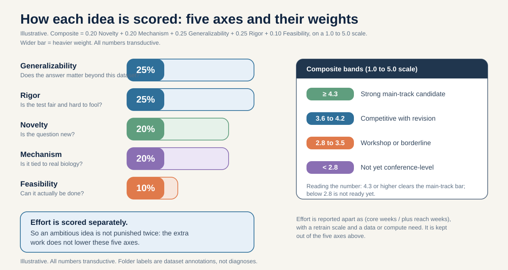
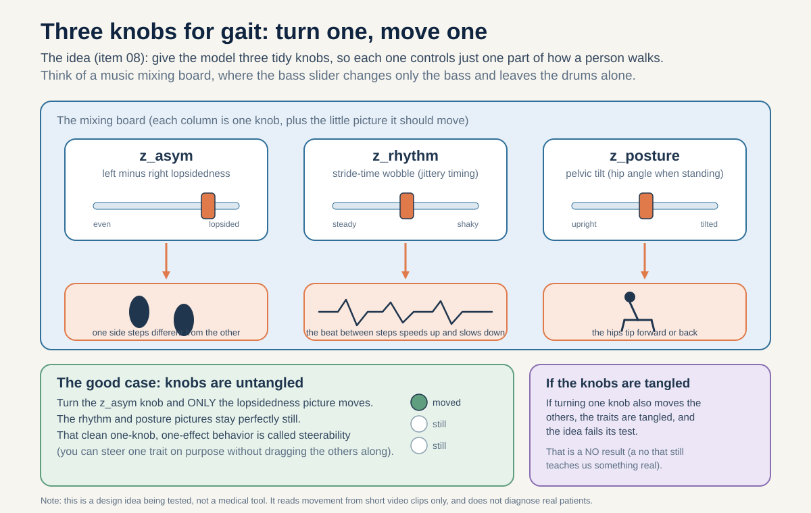

# S-JEPA gait portfolio scorecard

This scorecard grades all 12 portfolio items on ONE consistent scale, so the ranking is comparable across audits and world-model retrains. Think of it as a single yardstick held up against every idea, so that a strong idea and a weak one are measured the same way. If you are new to this project, you do not need to read the 12 proposals first. This page is written to stand on its own: it explains what each score means, what the one big scientific idea behind the portfolio is, and why some claims can score high while others are held back on purpose.

## How to read this scorecard

Every item earns one number, its composite, between 1.0 and 5.0. That number is built from five smaller scores, each rated 1 to 5. Here is what each one asks, in everyday words.

**Novelty (Nov): is the question new?** Are we asking something the field has not already answered, or just repeating a known result?

**Mechanism-grounding (Mech): is it tied to real biology?** Does the idea connect to how walking actually breaks in the body (a nerve pathway, a muscle, a rhythm), or is it a loose hunch?

**Generalizability (Gen): would the answer matter beyond this one dataset?** If it only holds for our 18 source videos, it scores low. If a real outside cohort could back it up, it can score high.

**Rigor (Rig): is the test fair and hard to fool?** Are there honest controls, split-by-video checks, and pre-set pass marks, so the model cannot look smart by cheating?

**Feasibility (Feas): can it actually be done given the ambition?** A bold plan that still fits the time and compute we have scores well here.

**The weighting, in plain words.** The five scores are not equal. Generalizability and Rigor matter most, a quarter each (0.25), because a finding is only worth much if it is trustworthy and travels. Novelty and Mechanism are a fifth each (0.20). Feasibility counts least, only a tenth (0.10).

**The four bands.** A composite at or above 4.3 is a Strong main-track candidate. From 3.6 to 4.2 is Competitive with revision. From 2.8 to 3.5 is Workshop or borderline. Below 2.8 is Not yet conference-level.

**Why effort is kept separate.** Effort (weeks, retrain size, data needs) is reported on its own, outside the five scores. An ambitious idea is already hard because it is ambitious. If we also docked its score for being hard, we would punish it twice. So Feasibility asks only "is it doable as scoped", and the raw cost sits beside the score, not inside it.

**Reading the composite (worked example, item 05).** Item 05 scores Nov 3, Mech 5, Gen 5, Rig 5, Feas 5. Multiply and add: 0.20*3 + 0.20*5 + 0.25*5 + 0.25*5 + 0.10*5 = 4.60. Reading the number: 4.60 clears 4.3, so item 05 is a Strong main-track candidate.

## The one big idea: conditions differ by HOW they break walking

Start with the healthy case. When walking goes well, it has two quiet properties. It is roughly **rhythmic** (steps come at a steady beat, like a metronome), and it is roughly **left-right balanced** (your left side does about what your right side does). Hold those two ideas in your head, because each condition below breaks one of them in its own way.

**LATERALIZED (one side stops matching the other).** Imagine one leg quietly doing less work than the other, step after step. In stroke, the nerve highway from brain to body crosses over (this crossing is called decussation), so a one-sided brain injury weakens the opposite side of the body (Natali/Javed StatPearls, PMID 30571044). Hemiplegic cerebral palsy comes from a one-sided early brain injury near the fluid spaces of the brain (Volpe 2009, PMID 19081519). Early Parkinson's usually starts losing dopamine on one side of the brain first, hitting the opposite side of the body (Riederer and Sian-Hulsmann 2012, PMID 22367437). The thing a skeleton can measure here: a signed left-minus-right Symmetry Ratio (Patterson 2010, PMID 19932621). "Signed" means the number tells you which side, not just how much.

**RHYTHM (the internal metronome gets shaky).** Here both sides may match fine, but the steady beat comes and goes. Parkinson's loses the automatic timing, so the duration of each stride wobbles from step to step. The measure is stride-time coefficient of variation (CV), a percent that says how much the timing jitters. Concrete anchor: 8.8 percent in people who fall versus 4.2 percent in those who do not (Schaafsma 2003, PMID 12809998; foundational work, Hausdorff 1998, PMID 9613733). **Reading the number:** higher percent means shakier timing, so 8.8 is roughly twice as jittery as 4.2.

**SYMMETRIC (both sides weak, but still matched).** Picture someone whose legs are both tired in the same way, keeping their beat but leaning forward to cope. That is myopathy, a primary muscle disease. Its asymmetry stays low (Xiong 2023, PMID 37525241) and its cadence is kept, but the pelvis tips forward more than usual (anterior pelvic tilt 16.4 degrees versus 11.6 degrees in controls, Vandekerckhove 2022, PMID 35721358).

One honest wrinkle: Parkinson's sits in TWO regions at once, lateralized early and shaky-rhythm later. So this is not a clean, tidy split into three boxes, and we say so plainly.

Now the guardrail that matters most. This biology only DEFINES what to look for and what a wrong answer would look like. It never turns 18 source videos (with all "normal" clips coming from a single video, and every score measured on data the model already saw during training) into a claim about diagnosing real patients. The map tells us where to aim. It does not promise we have arrived.

## Why some claims can score a 5 and others are capped at 3

Here is the honest rule behind the Generalizability scores. A claim earns a **5** only when a *real, separate dataset* can back it up. In plain words, that means a group of different people, gathered by someone else, that we never trained on. This is called an **external cohort**.

Why so strict? Our own data is tiny and tangled. We have only 18 source videos, and all 12 normal clips come from a single video. On top of that, every result is transductive, which means the model already saw every clip it is scored on. So a good number on our data shows the model can *tell apart clips it has memorized*, not that it works on new people. Only an outside dataset breaks that spell.

**Two claims that can reach 5.**

- **PD variability** (Parkinson's stride-timing wobble). We can check the biomarker against PhysioNet Gait-in-PD (gaitpdb, DOI 10.13026/C24H3N). Be honest, though: that is force-plate and wearable-sensor (IMU) data, not skeletons. So it confirms the biomarker at the *label* level, across a different kind of measurement (cross-modal). It is not proof that our BlazePose skeletons transfer directly.
- **Cross-view invariance** (recognizing the same walk from different camera angles). We can test this on CASIA-B, OU-MVLP-Pose, GREW, and Gait3D, which are large, non-clinical, multi-view *pose* datasets. Same data type, real outside people.

**Two claims capped near 3.** Cerebral-palsy-specific and myopathy-specific claims cannot climb higher, because no **participant-disjoint** public skeleton dataset exists for either. "Participant-disjoint" just means the test people are entirely different humans from the training people, with zero overlap. Without such a dataset, we simply cannot show the claim holds for anyone new.

This limit is not hidden. It is stated openly on every affected item.

## The ranking

| # | slug | ICLR/ICML band | composite | Nov | Mech | Gen | Rig | Feas | effort (weeks) | retrain | data |
|---|---|---|---|---|---|---|---|---|---|---|---|
| 5 | signed-laterality-decodability | Strong main-track candidate | 4.60 | 3 | 5 | 5 | 5 | 5 | 3 / +0 | zero-retrain | reuses cached 528-token tensors |
| 9 | reflection-equivariant-symmetry-axis | Strong main-track candidate | 4.55 | 5 | 5 | 4 | 5 | 3 | 3-4 / +2-3 | full curriculum retrain | reuses cached 528-token tensors (core) |
| 12 | cross-view-invariance | Strong main-track candidate | 4.35 | 5 | 4 | 5 | 4 | 3 | 3 / +unbounded | view-conditioned predictor retrain | needs external cohort |
| 4 | resize-timing-tax | Competitive with revision | 4.25 | 4 | 4 | 4 | 5 | 4 | 1-2 / +1 | zero-retrain | needs NPZ+fps regen |
| 11 | target-isolation-substrate | Competitive with revision | 4.05 | 4 | 4 | 4 | 5 | 2 | 3-4 / +several | full curriculum retrain (x4 matched) | reuses cached 528-token tensors |
| 1 | provenance-pathway-attribution | Competitive with revision | 3.95 | 3 | 3 | 4 | 5 | 5 | 3 / +0 | zero-retrain | reuses cached 528-token tensors |
| 7 | group-loss-supervision-isolation | Competitive with revision | 3.95 | 4 | 3 | 4 | 5 | 3 | 3 / +2-3 | fold-local finetune | reuses cached 528-token tensors |
| 2 | surprise-tomography | Competitive with revision | 3.90 | 3 | 4 | 4 | 4 | 5 | 2-3 / +2 | test-time pass | reuses cached 528-token tensors |
| 3 | inference-time-motion-energy | Competitive with revision | 3.90 | 3 | 4 | 4 | 4 | 5 | 3 / +2 | zero-retrain | reuses cached 528-token tensors |
| 8 | concept-bottleneck-disentangled | Competitive with revision | 3.75 | 5 | 4 | 3 | 4 | 2 | 6-8 / included | full curriculum retrain | reuses cached 528-token tensors (core) |
| 10 | prediction-error-severity | Competitive with revision | 3.65 | 4 | 4 | 3 | 4 | 3 | 3 / +several | from-scratch normal-only | reuses cached 528-token tensors |
| 6 | mask-geometry-as-object | Competitive with revision | 3.65 | 4 | 4 | 3 | 4 | 3 | 4-6 / +0 | fold-local retrain per family | reuses cached 528-token tensors |

## Per-item summaries

**05 signed-laterality-decodability (composite 4.60, Strong main-track candidate).**

Think about what makes a healthy walk look "even." Your left leg and your right leg do about the same job, just half a beat apart, like two hands trading off on a drum. A lot of the conditions this project cares about break that evenness by picking on one side. A stroke can leave one leg weaker. Early Parkinson's often starts on one side of the body before the other. So the single most useful thing you could ask a walking model for is not just "how lopsided is this walk," but "how lopsided AND which side is dragging." That "which side" part is what we call a signed axis (a number that tells you not just how far off from even you are, but which direction, like a thermometer that reads plus or minus instead of just "hot"). Here the number is left minus right, so a left-weak walk lands as a negative and a right-weak walk lands as a positive, on opposite ends of the exact same ruler. This item asks one clean question about the single frozen encoder we already built (the trained model, locked so its weights cannot change, fingerprint prefix d0acc262, and we only read what it already learned). Did that encoder, all on its own, quietly organize a signed left-minus-right axis inside its private summary of each clip (its latent or embedding, the short list of numbers it squeezes the movement into)? We are not building anything new here. We are shining a light on what is already inside.

To call this a YES, four things all have to hold, and each is a pass mark written down before we look at any results (a kill gate, so nobody can slide the finish line closer once they see who is winning). First, a straight-line read-out (a linear probe, which is a deliberately simple ruler we hand the model, because if even a plain ruler can read the signal, the signal was really there and not a trick of a fancy decoder) has to recover the signed axis and beat a baseline that uses only raw joint coordinates by at least 0.05 R-squared. R-squared is like a quiz where the top score means your straight-line guess explains the whole pattern, running from 0 (explains nothing) to 1 (explains all of it), so a 0.05 gain means the model's learned features have to explain a small but real slice of the lopsidedness that plain coordinates could not already explain on their own. It is a small bar on purpose, but the idea still has to actually earn it. Second, the mirror image has to behave right: if you physically swap the left and right body landmarks, the decoded number should flip close to the ideal y equals negative x line, meaning a plus of some size becomes a minus of the same size, left and right cleanly trading places like a photo held up to a mirror. Third, the decoded sign has to point the correct way on at least 75 percent, so three out of every four, of the held-out source videos (clips the probe was not fitted on). A NO here is not a wasted result, it is an informative null (a "no" that still earns its keep, like a failed experiment that proves a popular rumor was wrong). It would overturn the belief that the curriculum encoder ever organized a directional asymmetry axis at all. And because the four-lane test is built to isolate the representation itself, a NO pins the blame on what the model actually learned, not on some weak probe we can shrug off.

Now here is why it earns the marks it does. Mechanism-grounding scores 5 because signed laterality is not a dataset convenience, it is the real dividing line for one-sided conditions, measured by the validated clinical Symmetry Ratio (Patterson 2010, PMID 19932621), so the axis is tied straight to how walking breaks in the body. Generalizability also scores 5, for a careful and honest reason: the thing that travels beyond our tiny data is NOT a claim about diagnosing real patients. Remember, the whole project rests on just 18 source videos, with all 12 normal clips coming from a single video (3KnFt8bH3tE), and every result is transductive (graded on clips the model already saw during training, like an open-book test on the exact questions), so we could never claim a real diagnosis from it. What actually generalizes is the measurement instrument itself: the pairing of a decodability read against a fair raw-coordinate ceiling with a mirror sign-flip test. That is a reusable tool any team can point at any skeleton encoder, on any cohort, to audit whether it learned side-aware laterality, the way a well-made ruler works no matter whose desk it sits on. Our own R-squared and slope numbers are just that tool caught in the act of being used. Rigor scores 5 because all four pass marks are nailed down before any fitting, so there is no fudging after the fact. Novelty sits at a solid 3, lower than the rest, because this reads an existing encoder rather than building a brand-new object, and reading is a smaller leap than inventing. Feasibility scores 5 because it runs with zero retrain (no building and training a new model, which would cost real time and compute), simply reusing the cached 528-token tensors we already have on disk. Putting the five together with their weights: 0.20*3 + 0.20*5 + 0.25*5 + 0.25*5 + 0.10*5 = 4.60, which clears the 4.3 bar and lands it as a Strong main-track candidate.

(Effort 3 / +0 weeks, zero-retrain, reuses cached 528-token tensors.)

**09 reflection-equivariant-symmetry-axis (composite 4.55, Strong main-track candidate).** This item tests a design claim, which means a claim about how you build the model rather than what data you feed it. To see why the design matters, start with what healthy walking looks like: your left leg and your right leg do almost the same job, just half a step apart, like two drummers trading the same beat back and forth. Some conditions break that balance on ONE side. A stroke tends to weaken the side of the body opposite the injured half of the brain, because the nerve wiring crosses over on its way down (Natali/Javed StatPearls, PMID 30571044). Hemiplegic cerebral palsy comes from a one-sided early brain injury (Volpe 2009, PMID 19081519). Early Parkinson's usually starts on one side of the brain first, hitting the opposite side of the body (Riederer and Sian-Hulsmann 2012, PMID 22367437). Myopathy, a primary muscle disease, is the odd one out: it weakens both sides about equally, so it shows almost no left-right difference (Xiong 2023, PMID 37525241). So there is one useful number for telling most of these apart: a signed left-minus-right axis (a measure of how much one side differs from the other, where "signed" means it also tells you WHICH side, plus or minus, not just how big the gap is), anchored to the validated Symmetry Ratio (Patterson 2010, PMID 19932621). The idea in this item is to build that number so it flips sign by construction. "By construction" means it is antisymmetric on purpose, baked into the wiring: swap left and right, and the number automatically flips from plus to minus, no exceptions. Think of it like a see-saw where lifting the left seat always drops the right one by the exact same amount. You do not have to hope the see-saw learns that rule from watching kids play. It is forced by the way the plank is bolted to the pivot. That built-in rule has a name, an inductive bias (a rule baked into a tool from the start, like a train that can only run where the tracks already go). The test asks whether hard-wiring this see-saw rule actually beats just letting a normal encoder (the model that squeezes a clip into a short list of numbers) learn the same behavior on its own from the data.

A YES result would show that baking the symmetry in is worth the trouble: the built-in version reads the signed axis better than the plain learned version does. We measure that on item 05's own instrument, the same ruler item 05 already uses, so the two studies stay comparable. The pass mark is a pre-registered margin (a bar written down BEFORE looking at any results, so nobody can quietly slide it once they see who is ahead, like taping the finish line to the track before the race starts). Here that bar is at least 0.05 held-out-source R-squared over the plain learned encoder. R-squared is a score from 0 to 1 for how much of a pattern a simple straight-line guess can explain, where 0 explains nothing and 1 explains all of it, so a 0.05 gain is a small but real improvement the built-in rule has to actually earn, not a rounding blip. "Held-out-source" means we test on whole videos the probe was not fit on, so the model cannot pass just by parroting clips it tuned to. A NO here is still valuable, an informative null (a "no" that still teaches you something, because it kills a belief people were holding, like an experiment that proves a popular rumor false). This particular NO would overturn the comfortable intuition that adding the equivariance is a free win at this scale. Maybe the plain encoder already picked up the left-right flip on its own, so hard-wiring it adds nothing. Or maybe the signed axis simply is not the thing holding the model back when you only have 18 source videos to learn from. Either way, you would retire the "just add the symmetry and you win" belief, which is real knowledge.

Now the five scores, in plain cause-and-effect. Novelty is 5 (the top mark) because nobody in the portfolio builds reflection-equivariance INTO the encoder and then tests whether that built-in rule beats the learned one. Item 05 only checks whether the standard model happened to learn the flip after the fact, an open-book look at what already exists. This item makes it a design choice and puts it on trial, which is a genuinely fresh question. Mechanism-grounding is also 5, because the built-in rule is matched exactly to the neuroanatomy of one-sided walking problems: a mirror of the body should flip a laterality number, precisely because stroke, hemiplegic cerebral palsy, and early Parkinson's all read on a skeleton as a one-sided difference. The design mirrors the biology, not just a math convenience. Generalizability is 4, not 5, and the reason is honest: the clinical side stays transductive, meaning the model is only graded on clips it already saw during training (an open-book test on the exact questions), because there is no external cerebral palsy or myopathy skeleton cohort of brand-new people to check the claim against. Without that outside dataset of different humans, the clinical part cannot climb to the top rung. Rigor is 5 because the test is strict and hard to fool: the margin is fixed in advance, whole videos are held out so clips cannot leak, a permutation-invariant control must FAIL to recover a signed axis (if it succeeds, the "signed" story is an artifact), and both encoders keep left-right flipping turned off so any advantage cannot be blamed on one model secretly seeing mirrored data. Feasibility is 3, the one soft spot, because this needs a full from-scratch curriculum retrain (building and training a new model, which costs real time and compute), matched to the d0acc262 lineage: the complete five stages, 600 epochs, and 11,400 updates. That is real work, not a quick read of an existing checkpoint, so it cannot score higher on doability. Put the five together with the portfolio weights, 0.20 for Novelty, 0.20 for Mechanism, 0.25 for Generalizability, 0.25 for Rigor, and 0.10 for Feasibility: 0.20*5 + 0.20*5 + 0.25*4 + 0.25*5 + 0.10*3 = 4.55. That clears the 4.3 line, so this is a Strong main-track candidate.

(Effort: 3-4 / +2-3 weeks, full curriculum retrain, reuses cached 528-token tensors (core).)

**12 cross-view-invariance (composite 4.35, Strong main-track candidate).**

Think about filming a friend doing a skateboard trick. You shoot it from the front, then from the side, then from a corner. It is the exact same trick every time, but the video looks totally different depending on where you stood. A normal model treats that change in camera angle as annoying static to smooth over and ignore, like background noise you tune out. This item asks a smarter question: what if the model treated the change in camera angle as a thing it is TOLD about, an "action" with a known size, instead of noise? The size of that angle shift gets a name, view_delta (view_delta = the amount the viewpoint shifts, so a small view_delta is a tiny turn of the camera and a big one is walking all the way around to the other side). If the model knows how much the view moved, it can mentally "rotate" its own summary of the walk to match, the way you can picture what your friend's trick would look like from the other side even without moving. There is one strict rule baked in: no left-right flipping is allowed, ever. Flipping a video is a cheap way to fake extra camera angles, but it secretly swaps the person's left and right sides, and for gait that is a disaster, because so many walking problems are one-sided (they call this "lateralized," meaning the trouble sits on one side of the body). A flip would turn a left-weak walk into a fake right-weak walk, which is exactly the kind of lie we cannot afford.

A YES result would show two things at once. First, the "view-as-action" model stays steadier across camera angles than the usual shortcut of just tossing mirrored copies of clips into the training pile, a trick called flip augmentation (flip augmentation = teaching the model on left-right mirrored versions of clips so it sees more angles for free). "Steadier" is measured as output drift, meaning how much the model's answer wanders when only the camera angle changes and nothing about the actual walk does. To count as a real win, view-as-action has to cut that drift by at least 10 percent relative to flip augmentation. Reading that number in plain words: if flip augmentation lets the answer wobble by some amount when you spin the camera, view-as-action has to shrink that wobble by at least a tenth of it, so this is a clear, pre-set bar and not a "close enough" hand-wave. Second, a "mirror probe" (a small test that deliberately mirrors a clip and watches what happens) would catch flip augmentation red-handed, wrongly flipping a one-sided biomarker so the model reports the weak side as the strong side. A NO is still worth knowing. It would be an informative null (a "no" that still teaches you something real, like proving a popular rumor was actually false). Here the "no" would overturn the belief that treating the view as a known action beats plain flip augmentation for staying robust across angles. Maybe the old mirror trick is just as good at this scale, and that is genuinely useful to learn before anyone builds the fancier version.

Now the five scores, and why each one landed where it did. Novelty is 5, the top mark, because framing a camera angle as an action the model is told about, instead of noise to average away, is a genuinely fresh idea, not a rerun of something the field already settled. Mechanism is 4, strong but not a perfect 5, because the setup connects to real one-sided biology (the reason the no-flip rule matters at all) yet the core test is mostly about geometry and robustness rather than a single tight nerve-or-muscle pathway. Generalizability is 5, and this is the standout: it is the strongest outside footing in the entire portfolio, because the main experiment runs on REAL, separate, outside datasets of many people filmed from many angles (CASIA-B, OU-MVLP-Pose, GREW, and Gait3D), all of them non-clinical multi-view pose collections. Better still, the test uses identity-disjoint leave-one-view-out checking (identity-disjoint = the people in the test set are completely different humans from the people in training, zero overlap; leave-one-view-out = you hold back one camera angle entirely and see if the model still handles it). That combination is the real closed-book final, not an open-book quiz on clips it already memorized. Rigor is 4, high because of that honest disjoint setup and the pre-set 10 percent bar, but held just under a 5. Feasibility is 3 because any CLINICAL claim, meaning any statement about patients rather than about walkers in general, would need multi-view clinical data that simply does not exist yet, plus the plan requires retraining a view-conditioned predictor (rebuilding part of the model so it can take view_delta as an input), which is real work. Putting the five together with the standard weights, 0.20*5 + 0.20*4 + 0.25*5 + 0.25*4 + 0.10*3, gives 1.0 + 0.8 + 1.25 + 1.0 + 0.3, which sums to the composite 4.35, clearing the 4.3 bar for a Strong main-track candidate.

(Effort 3 / +unbounded weeks, view-conditioned predictor retrain, needs external cohort.)

**04 resize-timing-tax (composite 4.25, Competitive with revision).**

Here is the problem this item pokes at. In this whole project, every video clip gets forced to the exact same length: 64 frames, no matter how long the real clip was. Think of it like a music teacher who insists every song fit into exactly 30 seconds. A slow ballad gets sped up to cram it in, and a short jingle gets stretched out to fill the time. Once you do that, you can no longer tell how fast the original song actually was, because you crushed or stretched everyone to the same runtime. That is exactly what happens to the walking clips here. A short clip gets stretched and a long one gets squeezed until both are 64 frames long, and once that happens the true absolute cadence (how many steps you take per minute, counted on a real clock) and the true walking speed simply cannot be read back out. The key word is "absolute," meaning measured against real wall-clock time (seconds ticking by in the real world), not relative to the clip itself. This item asks: how much real timing information does that resizing throw in the trash?

The neat part is that this is not just a guess or a case of the model being lazy. It is provably impossible by the math, a property called algebraic non-identifiability (a fancy way of saying the information is truly gone, so no algorithm, no matter how clever, can recover it, the way you cannot un-blend a smoothie back into separate fruit). A YES result confirms the tax. In plain terms, "tax" here means the cost the resizing charges you in lost timing. Concretely, YES means the cadence-and-speed loss stays at 0.70 or higher. That loss is measured as 1 minus R-squared, and R-squared is how much of the pattern a simple straight-line guess can explain, from 0 (explains nothing) to 1 (explains all of it). So a loss of 0.70 means a straight-line ruler can recover at most 30 percent of the real cadence-and-speed pattern, and at least 70 percent is gone for good. YES also means the real-time double-support duration tax stays at 0.50 or higher, where double-support duration is the slice of a step when both feet are on the ground at once, measured in real seconds. A NO result would actually be a surprise: it would mean some real cadence signal somehow survived the crushing, and that itself would be worth publishing as a measurement artifact (a weird leftover fingerprint that should not be there, like hearing the original song's tempo faintly leaking through even after you forced it into 30 seconds). One honest note baked into the design: the tax lands on wall-clock quantities that the resize erases, like steps per minute and seconds of double support. Within-cycle ratios (things measured as a fraction of one step, like "what percent of a stride is double support"), survive the squeeze just fine, because stretching a clip does not change a ratio of one part to another.

Now the five scores, and why each landed where it did. Mechanism is 4 (call it Mech), because the tax is tied to real, measurable walking quantities the body actually cares about (steps per minute, walking speed, and seconds of double support), not to some made-up number, so the loss it describes is a loss of genuine gait information. Novelty is 4 (call it Nov), and it earns that because the proof is crisp: showing cleanly that a whole class of pipelines is quietly throwing away timing is a sharp, tidy contribution, not a mushy one. Rigor is 5 (Rig), the top mark, because the claim is partly analytic, meaning part of it is pure math you can prove on paper, backed by a tightly bounded empirical check (a hands-on measurement that is boxed in with clear limits so the answer cannot wander). That mix of proof plus a careful measurement is about as solid as evidence gets, so it maxes out. Generality is 4 (Gen), because the lesson is not just about this one project: any fixed-frame skeleton pipeline (any system that forces all clips to the same number of frames and tracks body joints) inherits the exact same trap, so the warning travels far. Feasibility is 4 (Feas), because there is no training and no rebuilding a model needed here, but you do have to do a little legwork: you need an NPZ file (a NumPy data file, basically a saved bundle of arrays) plus fps regeneration, meaning you recompute the frames-per-second so you can recover the true time base (the real clock the clip was filmed on). That extra data-wrangling step is the only thing keeping it from a perfect score. The composite is a weighted blend, not a plain average: 0.20*4 + 0.20*4 + 0.25*4 + 0.25*5 + 0.10*4 = 4.25, which lands it in the Competitive with revision band.

(Effort: 1-2 / +1 weeks, zero-retrain, needs NPZ + fps regeneration.)

**11 target-isolation-substrate (composite 4.05, Competitive with revision).**

This experiment asks the deepest question in the whole set: what should a gait model even be trying to predict in the first place? Think about learning to play a song by ear. You could try to memorize the exact sound wave hitting your ear (every tiny wiggle), or you could try to catch the melody, or the chords, or just the beat. Some of those targets teach you the song way better than others, even though you are listening to the exact same music. Here, "gait" means the way a person walks, and the model is a piece of software that learns patterns from short clips of people walking. This item says: keep everything about the model the same, and change only the one thing the model is asked to predict. Everything else is held constant, the substrate (the whole fixed setup the model is built on): the architecture (the model's shape and size, here an embedding width of 64, a depth of 2 layers, and 4 attention heads), the mask sampler (the rule that decides which body parts get hidden so the model has to guess them), the optimizer (the tool that tweaks the model as it learns), the number of updates (how many times it adjusts), the data, and the seeds (the starting random numbers, fixed so runs are repeatable). Only the prediction target moves, across four matched families: raw coordinates (the plain x-y dot positions of the joints), one-frame motion (how much each joint moved since the last frame), the S-JEPA centered-sharpened latent (the model's own private summary of a clip, a short list of numbers it squeezes the movement into, cleaned up a little), and normalized latent regression (predicting that same summary but rescaled to a common size). One important detail: the encoder (the part that turns a clip into that summary) is NOT frozen here. Frozen would mean locking the trained model like a museum exhibit behind glass so nobody can change it. Instead the encoder is retrained (built and trained fresh) once for each family, four times in all, so every target gets its own fairly trained model on the identical setup. Because only one knob turns, any difference in the results can be blamed squarely on the target choice and nothing else. It is like a science-fair experiment where you water four identical plants with four different liquids but give them the same sunlight, soil, and pot, so if one grows taller you actually know why.

A YES here would be one family recovering a validated biomarker (a real, medically trusted signal, like how symmetric someone's steps are) better than you could get from just staring at the raw input, and by a clear margin: at least 0.05 in R-squared. R-squared is like a quiz score for a straight-line guess, from 0 (the guess explains none of the pattern) to 1 (the guess explains all of it). A 0.05 gain is small but real, a bar the new idea has to actually earn, not luck into. A NO result would still be worth a lot. It is an informative null, a "no" that still teaches you something by killing a popular belief, like a failed experiment that proves a rumor wrong. The belief on trial is the JEPA crowd's excitement that the prediction target is the main thing holding the model back at this small skeleton scale (few joints, short clips). A NO would point the finger elsewhere, at data breadth (how many different people and situations the model has seen), which fits what we already know: stride-time CV (the wobble in the timing between steps, shown as a percent, where higher means shakier) cannot be read off a straight line from the roughly 2 second windows, and asymmetry (how lopsided left versus right is) barely reads out at all, with an R-squared of only about 0.154.

Now the five scores, and why each landed where it did. Novelty is a 4: asking which target matters most, with everything else pinned down, is a genuinely fresh angle, not a rerun of what everyone else does. Mechanism is a 4: there is a clear, believable story for why target choice could change what the model learns, the same way choosing to learn melody instead of raw sound changes what you take away from a song. Rigor is a 5, the highest, and the cleanest attribution (clearest cause-and-effect) in the entire set, because only one thing changes, so the experiment leaves almost no room to argue about what caused any difference. Generalization is a 4: the lesson here, how to pick a good prediction target, is a design principle that travels to other models and other problems, not a one-off trick. Feasibility is a 2, the sore spot: this is the heaviest item to run, because you have to do four full matched curriculum retrains (train the whole model from the ground up, four separate times), and that costs serious time and computing power. Add those up (Nov 4, Mech 4, Gen 4, Rig 5, Feas 2) and the composite lands at 4.05, "Competitive with revision," meaning it is a strong idea that mostly needs its heavy cost trimmed or justified before it is ready.

(Effort: 3-4 / +several weeks, four full matched curriculum retrains, reuses cached 528-token tensors.)

**01 provenance-pathway-attribution (composite 3.95, Competitive with revision).**

This item is the foundation everything else stands on. Think of it like checking that the ruler you are about to measure with is actually straight before you trust a single measurement. Here is the setup. Our model can look at a short clip of someone walking and sort it into "normal walking" or "abnormal walking" with a score of about 0.96 AUC. AUC is a score for telling two groups apart, where 0.5 is a pure coin flip and 1.0 is calling every single one right, so 0.96 is very strong. Sounds great. But there is a catch worth losing sleep over. The clips did not all arrive the same way. Most of the normal clips came in through one processing path, called the AUGMENTED path (the clips were tweaked and cleaned up in a certain way before the model saw them), while all of the abnormal clips came through a different path, called the CANONICAL path (a plainer, standard route). So the model had two things it could learn from: the actual walking, or the "door" each clip walked through. This is the provenance confound, which is a sneaky shortcut where the model wins by spotting which pipeline or video a clip came from instead of the movement itself, like guessing a movie from the theater logo before the film even starts. This item asks the plain, uncomfortable question: how much of that 0.96 is real gait, and how much is just the model reading the door? Provenance just means "where a thing came from," so a Provenance-Decodability Index is a number that measures how easily the model can guess the door.

Here is what each answer would mean. A YES here is actually the bad news. YES means the Provenance-Decodability Index comes out high, showing that a large share of that headline 0.96 separability is really the acquisition shortcut (the door) and not the walking, and a pre-registered kill gate fires. A kill gate, also called a pre-registered margin, is a pass mark you write down and tape to the wall BEFORE you look at the results, like taping the finish-line tape to the track before the race starts so nobody can sneak it closer once they see who is winning. If the index crosses that line, the gate "fires" and the result is flagged as failing. A NO is the good outcome and it is an informative null, which is a "no" that still teaches you something real, like a failed experiment that proves a popular rumor was wrong. NO means the index sits at or below the gate, which removes the simplest "it is just a processing artifact" worry and lets every other item on this scorecard trust that the model's private summary of a clip (its embedding, the short list of numbers it scribbles down to remember the movement) is actually about walking. That trust is why this item goes first.

Now the five scores, and why each landed where it did. Novelty (how new the idea is) is Nov 3, sitting mid-band, because this is a careful confound audit (a double-check that the model is not cheating) rather than a brand-new object or method, and auditing your own setup, while important, is not the same as inventing something. Mechanism (how deeply it ties to the biology of movement) is Mech 3, also mid-band, because the whole question is about acquisition and processing (how the clips were captured and handled), not about neuroanatomy (the wiring of the brain and nerves) or how the body actually produces the walking. Generality (how widely the finding would apply) is Gen 4, high, because if the embedding is trustworthy or not, that conclusion ripples out to every other analysis built on it. Rigor (how solid and trustworthy the test is) is Rig 5, the top mark, because it is a clean, direct read on the frozen checkpoint (the trained model locked behind glass so nobody can change its weights) with a pre-registered gate, so the goalposts cannot move. Feasibility (how easy it is to actually run) is Feas 5, also top, because it needs almost no retraining and no outside dataset, just a fresh look at numbers we already have. Two top scores in Rig and Feas, held to mid-band by Nov 3 and Mech 3, is exactly why the composite lands at a solid-but-not-flashy 3.95 in the "Competitive with revision" band.

(Effort 3 / +0 weeks, zero-retrain, reuses cached 528-token tensors.)

**07 group-loss-supervision-isolation (composite 3.95, Competitive with revision).**

Think about how you study for a big test. You could actually learn the material, so you can answer any question on the topic, even ones you have never seen before. Or you could just memorize the exact questions on last year's exam. Both get you a good grade on that one old exam, but only one of them helps you on a brand-new test. This item asks the same question about our model's training recipe. When you train a model, you feed it a "loss," which is just a score that tells the model how wrong it is right now, so it knows what to fix next. One piece of our recipe is a special loss called the label-aware group loss (written L_group), where "label-aware" means it knows which condition each clip is tagged with, and "group" means its whole job is to gently pull clips from the same condition to sit near each other in the model's private summary space (the latent, meaning the model's own crib notes for a clip, a short list of numbers it scribbles down to remember the movement). So L_group is like a teacher who quietly seats all the "stroke" clips together, all the "myopathy" clips together, and so on. The real question is whether this seating chart teaches the model something true about how those walks actually move, or whether it is just memorizing the exact clips in the room.

Here is what a YES and a NO would each teach us. To tell "real learning" apart from "memorizing the old exam," we compare two kinds of test scores. Transductive means the open-book test on the exact clips the model already saw during training, and inductive means the closed-book final on people and videos it never met. A YES is when the inductive macro-F1 goes up by at least 0.05 with the group loss turned ON. Macro-F1 is a fairness-adjusted accuracy score that counts every condition equally, even the rare ones, so the model cannot win just by nailing the one common class while flunking the rare ones. A jump of at least 0.05 (about five points out of a hundred on that fair report card) on the closed-book final would show the group loss builds real structure that carries to strangers, not just to the clips in the room. A NO is an informative null, meaning a "no" that still earns its keep, like a failed experiment that kills a popular rumor. The rumor here is that the group loss is teaching real structure. If the closed-book score does not budge, we learn the loss only helped the model memorize the videos it already saw, which is worth knowing before anyone builds on it.

Now here is how the test is built and why each of the five scores landed where it did. The test runs three carefully matched versions of the model side by side: the group loss turned ON, the group loss turned OFF but otherwise identical (OFF-but-matched), and a scrambled version where the loss is turned OFF at random (OFF-random). Because everything else is held the same, any difference in the closed-book score can be blamed squarely on the loss and nothing else. On top of that, the study reads the per-stage V-usable information, which is just a measure of how much label-relevant signal is actually sitting in the model's summary after each phase of training. Our training runs as a five-stage curriculum (Stage 0 through Stage 4, like five units in a course, each building on the last), so we check the signal after each stage rather than layer by layer, because the encoder (the part that squeezes a clip into its summary) is only two layers deep, too shallow to slice up usefully. First, Novelty scores 4, because setting the open-book score against the closed-book score is a genuinely fresh lens for judging whether this loss teaches or just memorizes. Second, Mechanism scores 3 (mid), because the loss is a training trick about labels, not something tied directly to a nerve or muscle in the body. Third, Generalizability scores 4 (mid), because the idea of testing transfer this way travels to other setups, though the clinical claim still lives on our tiny data. Fourth, Rigor scores 5, the top mark, because the three matched arms plus the per-stage information read make it very hard to fool. Fifth, Feasibility scores 3, because this is a fold-local finetune (a small, cheap tune-up done within each data split) at gavd5-drift scale, with no fresh from-scratch pretraining, so it costs real but modest effort. Putting the five together, 0.20*4 + 0.20*3 + 0.25*4 + 0.25*5 + 0.10*3, gives the composite 3.95.

(Effort 3 / +2-3 weeks, fold-local finetune, reuses cached 528-token tensors.)

**02 surprise-tomography (composite 3.90, Competitive with revision).** Picture the model as a friend watching you walk. You cover up part of the skeleton, like taping over one ankle in the video, and the model has to guess where that hidden part is. When its guess is way off, it got "surprised." Most people would just write down one big surprise number for the whole clip, like a single test grade. This item asks a sharper question: not just HOW MUCH the model was surprised, but WHERE the surprise landed. To answer that, it spreads the masked-prediction error (masked-prediction error means how far off the model's guess was for the parts you hid) out into a small picture. Think of it like a heat map on a weather app, where red spots show where a storm is worst. Here the picture is a 12-by-16 grid, a "surprise image," with the 12 maskable joints going down the rows (only 12 of the tracked landmarks can ever be hidden: both shoulders plus the hip, knee, ankle, heel, and foot on each side) and 16 time positions going across the columns (16 slices of the short clip, left to right). So instead of one lump-sum grade, you get a map showing which body part, at which moment, the model found hardest to predict. That matters because a map can tell stories a single number never could, the way a report card that lists every subject tells you more than one overall GPA.

A YES result would prove two separate things. First, that this spatial map (the full 12-by-16 grid) does a better job of telling walking conditions apart than a single pooled surprise number does, the way looking at where a car makes noise beats just knowing it is "loud somewhere." Second, that when you inject a KNOWN problem on purpose, its surprise piles up in the body rows where it should. For example, if you fake a bad left knee, the left-knee rows should light up. The bar for that is a 0.60 threshold on how strongly the surprise concentrates in the matching anatomical rows, plus the map has to gain at least 0.05 AUC over the single number. AUC is a score for telling two groups apart, where 0.5 is a coin flip and 1.0 is perfect, so a 0.05 gain is a small but real improvement the idea has to actually earn, not a rounding blip. A NO would be an informative null, a no that still teaches us something. It would overturn the belief that surprise carries any usable spatial structure at all beyond one summary number, which would tell everyone to stop bothering with the map and just use the single grade.

Here is how the five scores fall out, and why. Mechanism (how well the idea connects to real body science) earns a 4, because the surprise is expected to localize to the biomarker regions we already know about, so a fake left-side deficit should show up on the left, matching real anatomy instead of landing randomly. Generalizability (how far the finding travels beyond this one dataset) is a 4, thanks to its reach into gaitpdb, an outside Parkinson's walking dataset (PhysioNet Gait-in-PD gaitpdb, DOI 10.13026/C24H3N), so the idea is not trapped inside our 18 source videos. Feasibility (how easy it is to actually run) is the top score, a 5, because this is a test-time read on the existing frozen encoder (the trained model, locked so its weights cannot change, like a museum exhibit behind glass you can study but not touch), with no retrain at all, and it reuses the cached 528-token tensors we already computed (the 33 BlazePose joints times 16 time positions that make 528 tokens). No tearing the house down to rebuild it. Rigor (is the test fair and hard to fool?) is a 4, high because the pass marks (the 0.60 concentration threshold and the 0.05 AUC gain over a single pooled number) are fixed up front and checked with an injected known deficit, so the map cannot look smart by luck, though it still runs on our own tangled data. Novelty (how new the idea is) is a 3, the most modest score, because it reads that same existing checkpoint rather than building a brand-new object from scratch. Add those up in the same spirit as the rest of the card and you land at the frozen composite of 3.90, a strong "competitive with revision."

(Effort 2-3 / +2 weeks, test-time pass, reuses cached 528-token tensors.)

**03 inference-time-motion-energy (composite 3.90, Competitive with revision).**

This idea asks a simple question with a clever twist: can the model we already trained tell us something about MOTION (how the body moves across time, the flow of a walk) and not just POSE (the shape of a single frozen stance, like one photo of someone mid-step)? Think of the difference between a still photo and a short video clip. A photo shows you a person standing with one leg forward. A video shows you the rhythm, the bounce, the timing, whether the walk is smooth or jerky. We want to know if the model's private summary of a clip (its latent, meaning the short list of numbers it scribbles down to remember the movement) already carries the motion story, or only the frozen snapshot. The clever twist is that we do not build anything new. We take the trained model, locked behind glass so nobody can change it (a frozen encoder), and just read what it already learned in a fresh way.

Here is the specific test. We compare two conditions that should look very different if motion really matters. One is Parkinsons disease (PD, a condition where the body's internal walking clock gets shaky, so the timing between steps wobbles). The other is myopathy (a muscle condition that, in this data, tends to keep both sides even and keeps a steadier beat). If a motion-based score can separate PD from myopathy better than a plain position-based score can, that is real evidence that the model hears the rhythm, not just sees the pose. A YES result means the motion-versus-position energy split cleanly tells PD apart from myopathy under a majority rule, meaning it has to work on at least 7 of the 12 source videos and on both PD folds (the two chunks of PD data we test on separately), using only within-window relative regularity (how steady the movement looks inside one short clip, without needing a longer recording). A NO result is still worth a lot: it would teach us that at this clip length, motion adds no separate readable channel beyond the static posture. That is an informative null, a "no" that earns its keep by killing the hopeful belief that a two second window is long enough to read rhythm. Remember, all of this is graded on clips the model already saw during training (transductive, like an open-book test on the exact questions), so it is a signal worth chasing, not a diagnosis of real patients.

Now the five scores, and why each landed where it did. Mechanism scored Mech 4 because the PD-versus-myopathy contrast is not made up for convenience, it is grounded in real biology: PD genuinely disturbs the internal timing of gait while myopathy tends to stay symmetric, so there is a true movement difference for the score to catch. Generality scored Gen 4 because the method is broadly useful and it can reach toward an outside dataset, the PhysioNet Gait-in-PD collection (gaitpdb, DOI 10.13026/C24H3N), giving it a path beyond just this handful of clips. Novelty scored Nov 3, solid but not sky-high, because it is essentially one more clever readout squeezed from a frozen encoder rather than a brand new model or a new kind of measurement. Rigor scored Rig 4, high because the test is fair and hard to fool: it uses a strict majority rule (it has to work on at least 7 of the 12 sources and on both PD folds) and leans only on within-window relative regularity, so the score cannot win by accident, though it is held below a 5 because it still runs on our own tiny data. Feasibility scored the top mark, Feas 5, for the best possible reason: there is no retraining at all (no tearing the house down to rebuild it), and it reuses the cached 528-token tensors we already computed, so it is fast and cheap. Add the strengths, hold back only on novelty, and you get a composite of 3.90, landing it in the Competitive with revision band, meaning it is a strong contender once tightened up.

(Effort: 3 / +2 weeks, zero-retrain, reuses cached 528-token tensors.)

**08 concept-bottleneck-disentangled (composite 3.75, Competitive with revision).** This is the boldest brand-new build in the whole portfolio. Right now the model squeezes a whole walking clip into one summary vector (its latent, meaning the model's own private crib notes for a clip, a short list of numbers it scribbles down to remember the movement). The trouble is that this one summary is blurry: everything about the walk gets stirred together into the same numbers, like a smoothie where you can no longer taste the banana apart from the strawberry. This item says: let's retrain the model (build and train a new version from the ground up, which costs real time and compute) so that instead of one blurry blob, it carries three separate, clearly labeled knobs inside it, one knob per gait sign. There is z_asym for left-right asymmetry (whether one side of the body is doing less than the other), z_rhythm for stride-time variability (how much the timing between steps wobbles, like a drummer who cannot hold a steady beat), and z_posture for pelvic tilt (how far the pelvis, your hip region, leans forward). The dream is a mixing board like the one a music producer uses: three sliders, and each slider moves exactly one thing. Slide the "bass" up and only the bass gets louder, not the vocals too.

A YES result here is what we call steerable disentanglement, which just means the knobs really are independent. Concretely, when you turn one knob, only its own sign changes and the other two stay put. Two frozen numbers pin this down. The steerability ratio must be at least 3, meaning turning a knob moves its own target at least 3 times as much as it accidentally jostles the others (a clean, well-separated slider, not a mushy one). And the leak must be at most 0.2, meaning no more than a small trickle of a knob's motion spills into signs it should not touch. On top of that, this setup has to beat a plain-coordinate baseline, a simpler model that just uses raw joint positions, so we know the fancy design actually earned its keep. A YES would prove the model genuinely pulled the three signs apart instead of leaving them tangled. A NO here is an informative null (a "no" that still teaches us something, like a failed experiment that debunks a popular rumor). This particular NO would overturn the hope that you can get clean, separate knobs out of a small skeleton JEPA just by bolting on biomarker heads (little side-networks each trained to read one sign), plus VICReg decorrelation (a training trick that actively pushes the knobs apart so they stop copying each other), plus biased masking (hiding body parts on purpose so the model is forced to learn each sign). The plan is honest about its weakest link: z_rhythm is the riskiest of the three, because stride-time CV (coefficient of variation, the wobble in step timing shown as a percent) is not linearly decodable from the roughly 2-second windows the model sees. In plain words, the clips are simply too short for a straight-line read-out to reliably measure step-timing wobble, so that one knob may never turn cleanly no matter how carefully we build it.

Here is why the five scores land where they do. Novelty is 5, the joint-highest in the whole set, because naming and building steerable subspaces (dedicated, labeled directions inside the model you can actually push on) is the most ambitious new object anyone in this portfolio proposes; it is not reading an existing model, it is constructing a genuinely new kind of one. Mechanism is 4 because all three knobs are tied to real, cited gait biology (asymmetry, rhythm, and posture are each grounded signs), strong but not a perfect 5. Rigor is 4 because the pass marks (steerability ratio at least 3, leak at most 0.2, beating the baseline) are set up front and are hard to fudge, though the whole thing still runs on our own tangled data. Generalizability is capped at 3 for one honest reason: z_posture cannot be checked against any outside cerebral palsy or myopathy skeleton cohort, because no such participant-disjoint public dataset exists, so that knob can only ever be tested on people the model already saw. Feasibility is the lowest at 2, because this is genuinely heavy lifting: a full curriculum retrain (5 stages, 600 epochs, 11,400 updates) plus three auxiliary heads plus a decorrelation term, roughly 6 to 8 weeks of work. Putting the five together, 0.20*5 + 0.20*4 + 0.25*3 + 0.25*4 + 0.10*2, gives the composite 3.75.

(Effort: 6-8 / included weeks, full curriculum retrain plus three auxiliary heads, reuses cached 528-token tensors (core).)

**10 prediction-error-severity (composite 3.65, Competitive with revision).**

This item builds a "world model" and then measures how surprised it gets. A world model is a model that learns how something normally works and then expects it to keep working that way, the way you can watch a friend shoot free throws and, after a while, feel it in your gut whether the next shot is going in before it even leaves their hands. Here we train that model on NORMAL walking only. It watches clip after clip of steady, even walking until it has a strong sense of what "normal" looks like. Then we show it a brand-new clip, hide part of the skeleton, and ask it to guess the hidden part. If the new clip is also normal, the guess is good and the model is barely surprised. If the new clip walks in some unusual way, the guess is off and the model is surprised, and that surprise grows the more unusual the walk is. We turn that growing surprise into a smooth, continuous severity score (a dial that slides from "looks totally normal" up to "looks very unusual," instead of just a yes-or-no stamp). The genuinely clever part is what the model never sees during training. It never watches a single stroke, Parkinson's, myopathy, or cerebral palsy clip. That matters because of a trap baked into this data called label-versus-source collinearity (a fancy way of saying "which condition" and "which video" are almost the same thing here, since most condition folders come from just one or two videos). A normal classifier could cheat by memorizing which video a clip came from, like recognizing a movie from the theater's logo before the film starts, instead of actually reading the walking. Training on normal walking only takes away the most obvious version of that cheat, because the model never gets to pair an abnormal label with a specific abnormal video and memorize it. But it does not make the score airtight, and this is the honest catch worth saying out loud. All the normal clips come from a single video (id 3KnFt8bH3tE), so the model has really only met normal walking as filmed by one camera, in one setting, extracted one way. When we later show it an unusual clip, that clip often comes from a different video with a different camera, background, and pose-tracking quirk, and any of those can look unfamiliar to the model all on their own. So a high surprise score might mean "this walk is unusual," or it might just mean "this footage looks nothing like the one source I trained on." To trust surprise as a read on the walking rather than the filming, you would need held-out normal clips from other sources, or a cross-source control that checks whether the score reacts to the source instead of the movement. Until that check is in place, the score reduces the label-versus-source cheat but does not fully rule out source novelty.

A YES result would have to show two separate things. First, that the surprise can be split apart by mechanism (by the specific WAY a walk is broken) into different channels, not just lumped into one blurry total. There is an asymmetry channel that watches the left leg versus the right leg (the signed left-minus-right Symmetry Ratio, meaning a number that tells you not just how much the two sides differ but which side is off, plus or minus; Patterson 2010, PMID 19932621), and a posture channel that watches how the pelvis and trunk lean (anterior pelvic tilt, 16.4 degrees versus 11.6 degrees in controls; Vandekerckhove 2022, PMID 35721358). Second, that each channel moves in the RIGHT DIRECTION when we feed the model a fake, hand-made problem. If we bend one knee more than the other (a one-sided knee-flexion injection, a lopsided deficit), the asymmetry channel should light up while posture stays quiet. If we tilt both sides forward evenly (a symmetric proximal-deficit injection, matching the even, both-legs-weak pattern of myopathy, where left-right asymmetry stays low; Xiong 2023, PMID 37525241), the posture channel should light up while asymmetry stays quiet. Both rises have to clear a bar set at 80 percent of a raw-coordinate ceiling. That ceiling is a plain hand-built detector that just reads the corrupted joint numbers directly with no trained model at all, and 80 percent of it means the trained world model has to do nearly as well as that cheap direct reader, not just beat an untrained one. A NO here would be an informative null (a "no" that still teaches you something real, like a careful experiment that kills a popular rumor). It would overturn the claim that the normal-only model learned a real, structured sense of what walking should be, and would say instead that it is only echoing back whichever coordinate we poked, which any dumb detector could do too.

Now the five scores, and why each landed where it did. Novelty is 4 and Mechanism is 4, and they rise together for the same reason: a label-free severity score, one that never needs an abnormal label and is still tied channel-by-channel to real, validated biomarkers of how walking breaks, is a genuinely fresh idea that is also honestly grounded in biology rather than a loose hunch. Generalizability is held to 3, and this is the honest ceiling on the whole thing: "normal" here comes from a single video (id 3KnFt8bH3tE, the source of all 12 normal clips), so the model is transductive to just that one source (graded on material tied to clips it already saw during training, like an open-book test on the exact questions rather than a real closed-book final), and the injection test carries an acknowledged near-tautology risk, because poking a knee joint raises error at exactly the knee tokens the asymmetry channel reads, so "error shows up where we broke the input" is almost true by definition, which is why that 80-percent-of-ceiling bar has to do the heavy lifting. Rigor is 4, earned by the stack of honest controls: an untrained random-encoder floor, the raw-coordinate ceiling, a visibility-only check, a pooled-scalar comparison, a left-versus-right sign check, and a pre-registered margin (a pass mark written down before anyone looks at results, like taping the finish line to the track before the race so nobody can slide it closer). Feasibility is 3 because this one is not a free read of an existing model; it needs a from-scratch normal-only train (building and training a brand-new model, which costs real time and compute), though it does reuse the cached 528-token tensors so the data prep is not starting from zero. Putting the five together, 0.20*4 + 0.20*4 + 0.25*3 + 0.25*4 + 0.10*3, gives the composite 3.65, which lands it in the Competitive with revision band.

(Effort 3 / +several weeks, from-scratch normal-only training, reuses cached 528-token tensors.)

**06 mask-geometry-as-object (composite 3.65, Competitive with revision).** Think about how you learn a song. If someone mutes the drums, you have to fill in the beat yourself. If they mute the chorus, you lean on the melody you remember. What gets hidden changes what part of your musical brain has to work. This item does the same thing to the walking model on purpose. It makes the SHAPE of the hidden region (which body parts, at which moments, get blanked out) the actual thing being tested. To keep the test honest, everything else is held fixed: the same frozen encoder (the trained model, locked so its weights cannot change, so we only read what it already learned), the same amount of computing, the same number of training steps, and the same count of masked tokens per sample. A token is the smallest chunk the model reads, and here a clip is chopped into 33 body joints (tracked by a pose tool called BlazePose) times 16 time positions, which is 528 tokens, of which only 12 of the tracked landmarks are allowed to be hidden (both shoulders plus the hip, knee, ankle, heel, and foot on each side). Keeping the masked-token count fixed matters because it keeps difficulty matched, like giving every runner the same weight in their backpack. That way, if one setup does better, it is because of the mask's shape, not because it got an easier puzzle. The plan pre-registers three mask families (three fixed hiding patterns written down before any results are seen), each built around a known way that walking breaks in the body.

Family one hides one side's lower limb, so the model has to rebuild that leg by looking at the other side. This forces an ASYMMETRY axis (a signed left-minus-right measure, a number that tells you not just how much the two sides differ but which side is off, plus or minus). That axis is the clinical Symmetry Ratio (Patterson 2010, PMID 19932621), and it is the natural fingerprint of one-sided conditions. This family aims straight at the project's weakest-decoded scalar, asymmetry R-squared about 0.154 (R-squared is how much of the pattern a simple straight-line guess can explain, from 0 for nothing to 1 for all of it, so 0.154 means a plain ruler currently reads this signal only faintly). Family two hides a contiguous half of the whole gait cycle, like muting a full second of a song and asking the model to hum it back. The hypothesis is that this pushes the model to lean on RHYTHM (the steady internal beat of steps) to fill in the missing half, which is the timing signature tied to Parkinson's loss of automatic pacing (stride-time CV, how jittery the timing between steps is as a percent, 8.8 percent in people who fall versus 4.2 percent in those who do not, Schaafsma 2003, PMID 12809998; Hausdorff 1998, PMID 9613733; higher percent means shakier steps). Be honest, this is the family most likely to come back empty, because stride-time CV is not linearly decodable from the roughly 2-second windows the model sees. Two seconds is barely a couple of steps, which may just be too short a clip to hear the wobble in the beat. Family three hides the hips and the upper (proximal) thigh on both sides at once, forcing a SYMMETRIC proximal pattern (both sides weak in the same way, up near the body's center). That matches myopathy, a primary muscle disease, whose fingerprints are an abnormal forward pelvic lean (anterior pelvic tilt 16.4 versus 11.6 degrees, Vandekerckhove 2022, PMID 35721358) and a characteristically low left-right asymmetry (Xiong 2023, PMID 37525241).

A YES result would look like this: at matched difficulty, each family raises the recoverability of its OWN predicted axis (asymmetry for family one, rhythm for family two, symmetric-proximal posture for family three) above two fair comparisons at once. The first comparison is a plain uniform mask that hides random maskable tokens with no anatomical shape. The second is a marginal-matched scramble, a control that keeps the same overall amount and spread of hidden tokens but shuffles their positions, so it has the same "difficulty budget" without the meaningful shape. And it must do all this without making the source video easier to identify, meaning it cannot win by accidentally leaving a fingerprint of which camera or clip the data came from (a provenance confound, the sneaky shortcut where a model spots the source instead of the movement, like naming a movie from the theater logo before the film starts). A NO here is an informative null, a "no" that still teaches us something real. It would overturn the belief that mask structure, rather than data scale, token geometry, or label-aware fine-tuning, is the lever that matters at this scale (96 sequences from just 18 source videos). In plain words, a NO would say: at this tiny data size, cleverly reshaping the holes is not what unlocks these signals, so effort should go elsewhere, like getting more data.

Now the five scores, one axis at a time. Mechanism (is it tied to real biology?) earns a 4 because every one of the three families carries a verified chain from a real source in the body to a measurable biomarker: a one-sided lesion to an asymmetry number, a broken internal clock to a rhythm number, diffuse muscle weakness to a posture number. Nothing here is a loose hunch. Generalizability (would the answer matter beyond our 18 videos?) is capped at 3, and the reason is honest and specific: only the Parkinson's rhythm family has even a cross-modal outside anchor to lean on, the PhysioNet Gait-in-PD cohort (gaitpdb, DOI 10.13026/C24H3N), and even that is force-plate and wearable-sensor data, not skeletons, so it only backs up the biomarker at the label level, not the pose pipeline itself. The asymmetry family and the symmetric-proximal family have no participant-disjoint public skeleton cohort, meaning there is no outside dataset of entirely different people we could use to prove the claim travels, so they simply cannot climb higher. Novelty (is the question new?) is a 4 and Rigor (is the test fair and hard to fool?) is a 4, earned by a genuinely strong control stack: the equal-coverage difficulty control that keeps every mask equally hard, the in-space scramble, a hard provenance kill gate at 0.02 (a pass mark written down before looking at results, so nobody can move the goalposts, that fails the study if the mask leaks too much source identity), a permutation sanity check, and a non-neural floor to compare against. Both are held below 5 for one down-to-earth reason: running three separate mask families means three separate fold-local retrains (a fold is one slice of the data held out for testing while the rest is used to train, and fold-local means the retrain happens inside each such slice), and those retrains land on painfully tiny per-condition source counts (Parkinson's has only 2 source videos, cerebral palsy only 2), which makes each result shakier and the whole thing more work. That same tininess and the repeated retraining are exactly why Feasibility (can it be done as scoped?) sits at 3. Putting the five together with the rubric weights, 0.20*4 + 0.20*4 + 0.25*3 + 0.25*4 + 0.10*3, gives the composite 3.65, landing it in the Competitive with revision band.

(Effort: 4-6 / +0 weeks, fold-local Stage-0 retrain per mask family, reuses cached 528-token tensors.)
