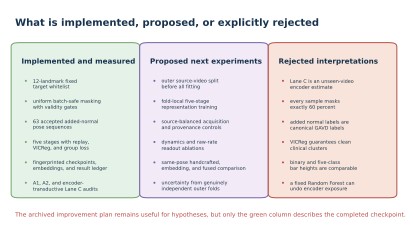
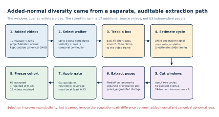
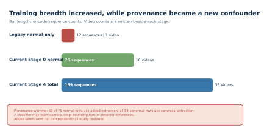
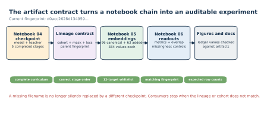
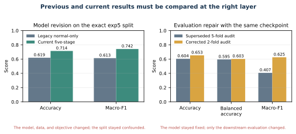
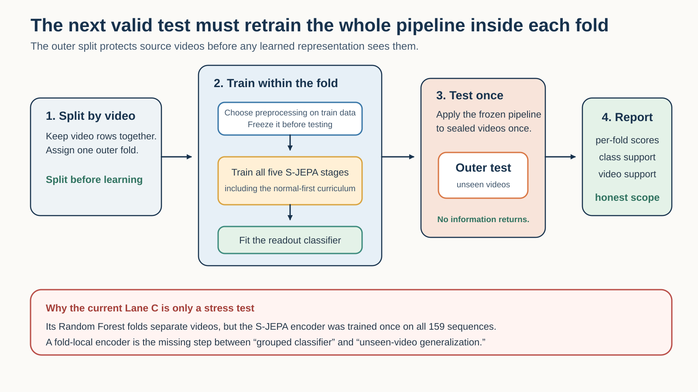

# How GAVD3 S-JEPA approach evolved to GAVD4

This tutorial explains how the S-JEPA work in this folder changed from a small normal-only prototype into the current five-stage, fingerprinted experiment. It explains what was changed, why it was changed, what the saved results show, and which ideas are still only proposals.

The central lesson is that three kinds of improvement must remain separate:

1. A **model improvement** changes data, masking, losses, architecture, or training.
2. An **evaluation improvement** changes how an existing representation is measured.
3. A **reporting improvement** makes provenance, exposure, and limitations more visible.

All three matter. They do not support the same claim.

## 1. How to read this tutorial

Every method in this document has one of three statuses.

|Status|Meaning|
|---|---|
|Implemented and measured|The current notebooks or saved artifacts contain the method and its outputs.|
|Superseded|The method or result was used earlier and is retained only to explain the evolution.|
|Proposed|The idea appears in the improvement notes, but the current checkpoint does not implement it.|

This distinction is especially important for the [archived improvement plan](../notes/04_improvement_plan.md) and [archived execution prompt](../notes/05_improvement_instr.md). They contain useful research hypotheses, but they predate the completed five-stage run. They must not be read as a list of current features.

The current source of truth is:

- the executable notebooks 00 through 06;
- the real artifacts under cache/artifacts/real;
- [classifier_contract.json](../cache/artifacts/real/classifier_contract.json);
- [result_history.csv](result_history.csv);
- the completed checkpoint sjepa_curriculum_final_augmented.pt;
- experiment fingerprint d0acc2628d134959d8b91e96d5112fc3bed560fe8feb9569e5b13b11a8b614d1.

The fingerprint identifies the saved experiment payload and lineage. It is not a byte checksum of the checkpoint file.

## 2. The research question stayed stable

The project has always asked a representation-learning question:

> Can a compact skeleton representation retain useful gait structure when it first learns from normal gait and then continues through several condition groups?

The project does not establish diagnosis. GAVD folder names are dataset annotations. The added normal clips were created by this project and were not independently clinically reviewed.

The core JEPA idea also stayed stable. A view encoder receives visible joint-time tokens. A predictor estimates the latent features of selected hidden tokens. A slowly updated target encoder sees the complete sequence and supplies the target representation. S-JEPA applies this predictive idea to skeleton sequences [1]. The current implementation is paper-aligned, but it is not the authors' official S-JEPA code.

The large changes happened around that core:

- more normal source videos;
- two additional eligible landmark identities;
- an active anti-collapse term;
- a five-stage continuing curriculum;
- a supervised group term after Stage 0;
- stronger artifact contracts;
- explicit missingness, video-overlap, and encoder-exposure audits.

## 3. Generation 1: the legacy normal-only prototype

### 3.1 Data support

The first completed real study trained the representation on 12 normal sequences from one YouTube source video. These were separate annotated windows, but they shared the same source.

This was enough to test the end-to-end code path. It was not enough to teach broad normal gait variation. The encoder could learn person identity, camera style, clothing, crop behavior, or detector behavior that was specific to that one source.

### 3.2 Ten eligible landmark identities

The legacy whitelist contained:

~~~text
11, 12, 23, 24, 25, 26, 27, 28, 31, 32
~~~

These are the left and right shoulders, hips, knees, ankles, and foot indices. Heels 29 and 30 were absent.

Only these identities could become hidden prediction targets. All 33 BlazePose identities could still provide visible context.

### 3.3 Prediction-only objective

The legacy training objective was centered and sharpened latent cross-entropy:

$$
L_{\mathrm{legacy}} = L_{\mathrm{JEPA}}.
$$

Collapse diagnostics were measured after or during training, but no active variance or covariance regularizer pushed the feature dimensions away from a constant solution.

### 3.4 Training and readout

The legacy model used the same main Transformer dimensions as the current model:

|Component|Value|
|---|---:|
|Input frames|64|
|Joints|33|
|Frames per patch|4|
|Time patches|16|
|Embedding width|96|
|Encoder layers|4|
|Predictor layers|2|
|Attention heads|4|

The 64 by 33 sequence produced 528 possible joint-time tokens. Four pooled 96-dimensional summaries produced the same 384-dimensional downstream vector that is still used today.

The legacy normal-only run used 300 epochs and roughly 900 optimizer updates. Its main preserved result on the exact historical 47/21 exp5 split was:

|Legacy exact-exp5 result|Value|
|---|---:|
|Accuracy|0.619|
|Macro-F1|0.613|

These rounded values are historical ledger entries. The repository does not retain the legacy fold predictions needed to recompute them from first principles.

## 4. The failure audit changed the direction of the project

The first result was useful because it revealed several limitations.

### 4.1 One source video was not a normal-gait distribution

Twelve windows from one source are correlated. More windows increase the number of rows, but they do not create more independent camera, person, or acquisition settings.

### 4.2 A sequence split was not a source-video split

The exact exp5 test rows shared all nine of their source videos with classifier training. The all-96 split shared all 16 test videos. The representation encoder had also already trained on the evaluated rows.

The result therefore answered:

> Can a shallow classifier recover labels from features inside this already-seen corpus?

It did not answer:

> How well does the complete pipeline work on a new source video or person?

### 4.3 Pose-detector missingness was predictive

The project introduced a control that uses no gait coordinates. It contains:

- 33 per-joint observed fractions;
- 64 per-frame observed fractions;
- 97 visibility-only features in total.

The missingness-only Random Forest reached:

|Lane|Accuracy|Balanced accuracy|Macro-F1|
|---|---:|---:|---:|
|All-96|0.448|0.466|0.429|
|Exact exp5|0.333|0.364|0.336|

This showed that detector success and failure were related to the labels. Any learned representation result had to be read against this shortcut floor.

### 4.4 Temporal information was compressed

Every sequence was resized to 64 frames. The downstream vector then averaged over time. This removes native duration and makes temporal order inaccessible to the Random Forest.

The representation may still encode motion context inside each token. The final pooling cannot tell the classifier when an event occurred or directly preserve native walking rate.

### 4.5 The audit produced a research plan, not an automatic implementation

The archived plan proposed temporal pooling, raw-rate features, explicit visibility channels, smoothing, width sweeps, block masks, motion targets, hybrid features, and fold-local representation training.

Only part of that plan was adopted. The current method kept the project's fixed, non-motion-aware target rule. It prioritized more normal videos, two restored heel identities, VICReg, progressive condition training, reproducibility contracts, and stronger evaluation warnings.

## 5. Generation 2: broaden the normal data without mixing provenance

### 5.1 Canonical data remained locked

The canonical experiment stayed fixed at 96 GAVD sequences from 18 videos:

|Condition|Sequences|Source videos|
|---|---:|---:|
|Normal|12|1|
|Parkinson's|9|2|
|Stroke|12|3|
|Myopathic|47|10|
|Cerebral palsy|16|2|
|Total|96|18|

This preserved comparability with the earlier analysis.

### 5.2 Added normal videos used a separate pipeline

The project created normal walking windows from 17 additional YouTube videos. These rows were never relabeled as canonical GAVD data.

The added-normal preparation worked step by step:

1. Inspect up to three pose candidates.
2. Select a walker using visible-body area, pose confidence, and temporal continuity.
3. Pad, fill, smooth, and clamp the automatic bounding-box track.
4. Estimate a walking cycle from ankle-separation autocorrelation.
5. Create windows of about two cycles with 50 percent overlap.
6. Require at least 24 frames and cap a clip at eight windows.
7. Extract MediaPipe landmarks into a separate poses_augmented directory.
8. Accept only candidates with authorized-landmark coverage of at least 0.45.

The report contained 64 candidate windows. Sixty-three passed. One 44-frame candidate, aug-MN4vnaNwIsA-w05, had coverage 0.027 and was rejected.

Notebook 04 and notebook 06 now use the extraction report as the selection contract. A rejected file cannot enter merely because it remains in the pose directory.

### 5.3 What improved

Stage 0 expanded from 12 sequences and one video to 75 sequences and 18 videos:

$$
12\ \text{canonical normal} + 63\ \text{added normal} = 75.
$$

This is a large improvement in source breadth.

### 5.4 What new risk appeared

Sixty-three of 75 normal training rows came through the added extraction path. Every abnormal row came through the canonical path.

A model can therefore associate the normal label with:

- a different bounding-box process;
- different camera styles;
- different video quality;
- different crop behavior;
- different detector missingness.

The scientific unit of diversity is 17 added source videos, not 63 independent people. Several windows overlap within the same video.

## 6. Pose preprocessing became an explicit contract

Each raw pose array has shape:

$$
[T, 33, 4],
$$

where the final dimension is x, y, relative z, and visibility.

Notebook 04 prepares a sequence in this order:

1. A landmark is valid when visibility is at least 0.45 and all three coordinates are finite.
2. Internal coordinate gaps of at most four frames are linearly filled.
3. The original validity mask is retained. A filled coordinate may provide context, but the originally invalid position cannot become a target.
4. Coordinates are centered at the pelvis.
5. Coordinates are divided by a robust shoulder-or-hip width scale.
6. Remaining missing coordinates become zero.
7. Coordinates and validity are resized to 64 frames.
8. A four-frame patch is target-valid only when all four validity values are true.

This separation between coordinates and validity matters. Zero is still used as the coordinate sentinel, so invalid tokens can influence attention as context. The validity mask prevents those tokens from becoming targets and excludes them from downstream pooling, but it does not make the sentinel invisible to every Transformer layer.

## 7. The target whitelist expanded from 10 to 12 identities

The current set is:

|BlazePose index|Landmark|
|---:|---|
|11|Left shoulder|
|12|Right shoulder|
|23|Left hip|
|24|Right hip|
|25|Left knee|
|26|Right knee|
|27|Left ankle|
|28|Right ankle|
|29|Left heel|
|30|Right heel|
|31|Left foot index|
|32|Right foot index|

The two added identities are the heels. This corrected the earlier ten-identity description and made the executable mapping agree with the de-duplicated project mapping.

The whitelist is a project rule. It is not a clinically validated biomarker for all five conditions.

### 7.1 A landmark identity is not one hidden token

Each identity appears at 16 time patches. The maximum authorized target grid therefore contains:

$$
16 \times 12 = 192
$$

positions. The complete sequence contains:

$$
16 \times 33 = 528
$$

possible positions.

### 7.2 The 0.60 rule is batch-safe

For sample $b$, let $\mathcal E_b$ be its valid eligible positions. The common target count is:

$$
n_{\mathrm{mask}}
=
\min\left(
\left\lfloor 0.60\min_b|\mathcal E_b|\right\rfloor,
\min_b|\mathcal E_b|-1
\right).
$$

Every sample in the batch receives this same target count. A sample with more valid eligible tokens therefore realizes a fraction below 0.60.

For example, suppose four samples contain 180, 160, 150, and 175 valid eligible positions. The smallest count is 150:

$$
\lfloor 0.60 \times 150 \rfloor = 90.
$$

Every sample receives 90 targets. Their realized fractions are 0.500, 0.5625, 0.600, and about 0.514.

The completed run recorded a mean eligible fraction of 0.551 at the Stage 0 endpoint and 0.423 at the Stage 4 endpoint.

The sampler does not read coordinate magnitude, displacement, velocity, acceleration, topology weight, or a learned motion score.

## 8. The learning objective gained two additional jobs

The current objective is:

$$
L
=
L_{\mathrm{JEPA}}
+0.05L_{\mathrm{VICReg}}
+0.25L_{\mathrm{group}}.
$$

### 8.1 JEPA latent prediction

The target encoder sees the complete sequence. The view encoder sees only non-target tokens. The predictor inserts learned mask tokens into the full positional layout and estimates target features.

For target features $R_t$, predictor features $R_p$, target center $c$, teacher temperature 0.06, and predictor temperature 0.10:

$$
q = \operatorname{softmax}((R_t-c)/0.06),
$$

$$
\log p = \operatorname{logsoftmax}(R_p/0.10),
$$

$$
L_{\mathrm{JEPA}}
=
-\frac{1}{M}\sum_m q_m^\top\log p_m.
$$

The target center uses momentum 0.9. The target encoder follows the view encoder through an exponential moving average that starts at 0.999 and approaches 1.0 within each stage.

### 8.2 VICReg anti-collapse pressure

Two transformed views of a sequence pass through the view encoder. Valid authorized features are pooled and projected through a 96 to 96 to 96 projector.

The inner VICReg expression is [2]:

$$
L_{\mathrm{VICReg}}
=
25L_{\mathrm{inv}}
+25L_{\mathrm{var}}
+L_{\mathrm{cov}}.
$$

- Invariance brings paired views together.
- Variance penalizes dimensions whose spread falls below the target.
- Covariance reduces redundant dimensions.

VICReg is active during every stage.

### 8.3 Label-aware group pressure

The group term is zero during Stage 0 because only normal data are active. In Stages 1 through 4, condition labels are used.

Compactness reduces squared distance to the condition centroid. Separation penalizes centroid pairs closer than margin 1.0:

$$
L_{\mathrm{sep}}
=
\frac{1}{P}\sum_{i<j}
\left[\max(0,1-\|c_i-c_j\|_2)\right]^2.
$$

This means the complete five-stage method is not fully self-supervised. Stage 0 is label-free representation learning. Stages 1 through 4 are label-informed representation fine-tuning.

## 9. Generation 3: one model continued through five curriculum stages

The current curriculum is cumulative:

|Stage|New condition|Active sequences|Videos|Epochs|Updates|
|---:|---|---:|---:|---:|---:|
|0|Normal|75|18|300|5,700|
|1|Parkinson's|84|20|75|1,425|
|2|Stroke|96|23|75|1,425|
|3|Myopathic|143|33|75|1,425|
|4|Cerebral palsy|159|35|75|1,425|

Total training was 600 curriculum epochs and 11,400 optimizer updates.

### 9.1 What continues

The following state continues from one stage to the next:

- view-encoder weights;
- predictor weights;
- EMA target-encoder weights;
- target center;
- VICReg projector weights;
- normal anchor used for drift monitoring.

### 9.2 What restarts

Each stage creates a fresh AdamW optimizer and learning-rate scheduler. The following state restarts:

- optimizer moments;
- scheduler warmup;
- scheduler position;
- EMA schedule position.

Model parameters are not reinitialized.

Stage 0 begins at learning rate 0.001. Later stages begin at 0.0003. AdamW uses betas 0.9 and 0.95, weight decay 0.05, and gradient clipping at 1.0.

### 9.3 Balanced replay

Every active condition contributes four samples to a batch. The largest active condition has 75 rows, so each stage uses:

$$
\left\lceil \frac{75}{4} \right\rceil = 19
$$

batches per epoch. Smaller conditions are replayed through repeated random permutations.

The batch size grows with the number of active conditions:

|Stage|Active conditions|Batch size|
|---:|---:|---:|
|0|1|4|
|1|2|8|
|2|3|12|
|3|4|16|
|4|5|20|

Balanced replay keeps earlier conditions in the optimization stream. It does not guarantee that their representation remains fixed.

## 10. Reproducibility became part of the methodology

The current checkpoint lineage is:

|Stage|Fingerprint prefix|Parent prefix|
|---:|---|---|
|0|0a14fe12c6f5|none|
|1|563b9227a065|0a14fe12c6f5|
|2|b367796d186f|563b9227a065|
|3|e81d529a7373|b367796d186f|
|4|d0acc2628d13|e81d529a7373|

Each checkpoint records:

- mode and stage;
- ordered conditions;
- completed epoch and update counts;
- parent fingerprint;
- sequence, video, and cohort membership;
- data-content and validity hashes;
- mapping path and mapping hash;
- the 12-identity whitelist;
- model and loss configuration;
- model, teacher, predictor, target-center, and VICReg projector state;
- complete training history.

Optimizer and scheduler state are deliberately not saved because a fresh optimizer and schedule begin at every stage.

Notebook 05 and notebook 06 reject:

- an incomplete curriculum;
- the wrong condition order;
- the wrong run mode;
- a different target whitelist;
- embeddings with a different fingerprint;
- unexpected canonical or augmented row counts.

The augmented flag selects sjepa_curriculum_final_augmented.pt. The notebooks no longer silently substitute a different final checkpoint when the requested variant is absent. This directly resolves the earlier failure where a consumer looked for sjepa_curriculum_final.pt even though the completed run had produced only the augmented final alias.

## 11. What training health actually showed

The endpoint diagnostics are:

|Stage|JEPA|VICReg|Feature std|Pair cosine|Minimum training centroid distance|Normal anchor|
|---:|---:|---:|---:|---:|---:|---:|
|0|0.569|16.997|0.466|0.359|not applicable|reference|
|1|0.449|12.989|0.430|0.492|0.740|0.954|
|2|0.613|10.474|0.399|0.624|0.527|0.839|
|3|0.611|9.368|0.406|0.628|0.336|0.707|
|4|0.478|8.418|0.414|0.609|0.364|0.594|

These values support limited conclusions:

1. Training remained finite and completed all stages.
2. Final feature standard deviation was 0.414, which is evidence against total collapse.
3. Pair cosine was 0.609 rather than nearly one, which is another non-collapse signal.
4. Normal-anchor cosine fell to 0.594, which shows substantial drift.
5. The final group-margin penalty remained positive, so the requested margin was not fully achieved.

They do not prove that the representation learned clinically meaningful gait structure.

## 12. Frozen representation inspection stayed separate from classification

Notebook 05 first ran a small hidden-token check. Across four sequences and 108 masked tokens per sequence, mean prediction cosine was 0.572 with standard deviation 0.116.

This is a spot check. It is not a corpus-level accuracy measure.

### 12.1 The 384-dimensional vector

The complete, unmasked EMA target encoder produces a 96-dimensional feature for each valid token. Four summaries are concatenated:

1. global valid-token mean, 96 values;
2. global valid-token standard deviation, 96 values;
3. valid 12-landmark mean, 96 values;
4. valid 12-landmark standard deviation, 96 values.

The result is:

$$
96 + 96 + 96 + 96 = 384.
$$

This pooling is intentionally simple and has no trainable sequence head. It is suitable for a small frozen-feature probe. It cannot retain the order of the 16 time patches or native walking duration.

The planned per-segment, left-right, and raw-rate extensions shown in the figure are not implemented current results.

### 12.2 Canonical geometry was weak

For the canonical 96 sequences:

|Geometry measure|Value|
|---|---:|
|Cosine silhouette|0.008975|
|Minimum centroid distance|0.036718|
|Mean centroid distance|0.292119|
|Mean within-condition distance|0.119521|

The closest centroids were myopathic and cerebral palsy.

A silhouette near zero indicates overlapping group boundaries. The minimum centroid distance was also much smaller than the average within-condition distance.

This can coexist with a high in-corpus Random Forest score. A nonlinear classifier can exploit local boundaries, source identity, acquisition style, detector artifacts, and label-informed exposure even when global centroids overlap.

## 13. Classifier readouts improved, but their scope stayed descriptive

The readout uses:

- StandardScaler fitted on classifier-training embeddings;
- Random Forest with 100 trees;
- maximum depth 5;
- square-root feature sampling;
- bootstrap sampling;
- balanced class weights;
- random seed 42.

The classifier does not update the encoder. However, the encoder already trained on the evaluated sequences and, after Stage 0, their condition labels.

### 13.1 Same-split model comparison

On the exact historical 47/21 exp5 assignment:

|Version|Accuracy|Balanced accuracy|Macro-F1|
|---|---:|---:|---:|
|Legacy normal-only S-JEPA|0.619|not saved|0.613|
|Current five-stage S-JEPA|0.714|0.730|0.742|

The approximate change is +0.095 accuracy and +0.129 macro-F1.

This is not a component ablation. The following changed together:

- normal data breadth;
- target whitelist;
- number of updates;
- VICReg;
- progressive condition exposure;
- balanced replay;
- label-aware group pressure;
- artifact and preprocessing contracts.

The score change cannot be assigned to one of these components.

### 13.2 The historical handcrafted comparison

On the same exact 47/21 assignment:

|System|Accuracy|Macro-F1|
|---|---:|---:|
|Current S-JEPA readout|0.714|0.742|
|Historical 82-feature Random Forest|0.762|0.728|

S-JEPA had lower accuracy and slightly higher macro-F1. The two systems used different pose and feature pipelines, so this is a system comparison rather than a clean representation ablation.

### 13.3 All-96 and exact-split controls

|Readout|Accuracy|Balanced accuracy|Macro-F1|
|---|---:|---:|---:|
|A1 all-96 S-JEPA|0.793|0.889|0.821|
|A1 missingness only|0.448|0.466|0.429|
|A2 exact exp5 S-JEPA|0.714|0.730|0.742|
|A2 missingness only|0.333|0.364|0.336|

The learned vector exceeded the visibility-only control on these splits. This shows label-related structure beyond the 97 saved visibility fractions. It does not isolate gait from person, video, crop, or extraction style.

### 13.4 Additional historical readout changes

The expanded result ledger also preserves the legacy all-96 and one-versus-normal readouts recovered from commit cc6e6de:

|Readout|Legacy accuracy|Current accuracy|Legacy macro-F1|Current macro-F1|
|---|---:|---:|---:|---:|
|All-96 five class|0.621|0.793|0.594|0.821|
|Parkinson's versus normal|0.714|1.000|0.708|1.000|
|Stroke versus normal|0.857|1.000|0.857|1.000|
|Myopathic versus normal|0.778|0.944|0.679|0.926|
|Cerebral palsy versus normal|0.889|0.889|0.883|0.889|

These binary test sets contain only 7 to 18 rows. They remain sequence-level, video-confounded, and encoder-exposed. Their apparent gains are useful regression checks, not independent estimates.

## 14. Class-level examples explain why one aggregate number is insufficient

The A2 macro-F1 was 0.742, but stroke F1 was only 0.333. The exact-split confusion pattern was:

|True condition|Correct / support|
|---|---:|
|Cerebral palsy|3 / 5|
|Myopathic|5 / 7|
|Normal|3 / 3|
|Parkinson's|3 / 3|
|Stroke|1 / 3|

Specific error examples make the pattern concrete:

- two stroke sequences from video 5gpoegYv1hs were predicted as myopathic;
- two cerebral-palsy sequences from video DlPDuHBAP7A were predicted as myopathic;
- one myopathic sequence from 05oyBOE_0UE and one from HDkWDe6FZDg were predicted as stroke.

Repeated errors from the same source video are one reason that sequence rows should not be treated as independent people.

## 15. Generation 4: Lane C repaired classifier grouping

Lane C pools 96 canonical embeddings with 63 added-normal embeddings.

### 15.1 Binary task

The binary normal-versus-abnormal task uses five source-video-grouped Random Forest folds:

|Metric|Five-fold mean|
|---|---:|
|Accuracy|0.849|
|Balanced accuracy|0.874|
|Macro-F1|0.826|
|ROC AUC|0.966|

The accuracy percentile range over five fold scores was 0.800 to 0.906. This is not a population confidence interval. Five related fold values provide only a rough stability summary.

### 15.2 Why the first five-class grouping was superseded

The first five-class attempt used five ordinary GroupKFold folds:

|Superseded five-class Lane C|Value|
|---|---:|
|Mean accuracy|0.604|
|Mean balanced accuracy|0.595|
|Mean macro-F1|0.407|

One training fold contained no cerebral-palsy rows. Macro-F1 label sets also differed across folds. The means therefore did not summarize the same five-class task in every fold.

### 15.3 Corrected two-fold evaluation

Parkinson's and cerebral palsy each have only two source videos. Two StratifiedGroupKFold folds are the largest feasible design that keeps every class in both training and test portions.

|Corrected five-class Lane C|Value|
|---|---:|
|Mean accuracy|0.653|
|Mean balanced accuracy|0.603|
|Mean macro-F1|0.625|
|Pooled out-of-fold accuracy|0.654|
|Pooled out-of-fold macro-F1|0.619|

The checkpoint and embeddings did not change. The macro-F1 increase from 0.407 to 0.625 is an evaluation repair, not a model gain.

The legacy 0.619 was accuracy. The corrected pooled Lane C 0.619 is macro-F1. The equal rounded values are a coincidence.

### 15.4 Lane C is still encoder-transductive

Every one of the 159 Lane C rows had already influenced representation training. Grouping the Random Forest by source video does not undo that exposure.

The correct description is:

> classifier-video-disjoint, encoder-transductive.

The actual five-class majority in the 159-row Lane C corpus is normal:

$$
75/159 \approx 0.472.
$$

This differs from the canonical-96 majority of 47/96, or 0.490.

## 16. The three current lanes answer different questions

|Lane|Rows and split|Classifier video overlap|Encoder exposure|Valid interpretation|
|---|---|---|---|---|
|A1|96 rows; stratified 67/29|16 of 16 test videos overlap|29 of 29 test rows seen|Can labels be recovered inside the full known canonical corpus?|
|A2|68 rows; exact 47/21|9 of 9 test videos overlap|21 of 21 test rows seen|How does the current system compare on the historical assignment?|
|Lane C|159 rows; grouped RF folds|No overlap inside each classifier fold|159 of 159 fold-test rows seen|How stable is a grouped classifier on one fixed, exposed encoder?|

None is an independent estimate for a new patient, camera, clinic, or complete video pipeline.

## 17. The next valid methodology

A truly held-out estimate must split source videos before any data-dependent fitting.

For each outer fold:

1. Hold out complete source videos.
2. Choose all preprocessing and selection rules using outer-training videos only.
3. Start S-JEPA from fresh weights.
4. Train Stage 0 using only outer-training normal videos.
5. Continue Stages 1 through 4 using only outer-training videos and labels.
6. Freeze the complete representation pipeline.
7. Create embeddings for outer-training data and fit the classifier.
8. Open the held-out videos once for final prediction.
9. Save fold-level predictions, confusion matrices, provenance, and exposure audits.
10. Aggregate metrics across genuinely independent outer folds.

### 17.1 High-priority proposed ablations

These are useful next experiments, not current results:

|Proposed experiment|Question|
|---|---|
|Per-segment temporal summaries|Does retaining the 16-step profile improve classification?|
|Left-right trajectory differences|Does timing of asymmetry add information beyond pooled magnitude?|
|Raw duration, FPS, cadence, or autocorrelation|Does restoring the native rate axis help?|
|Same-pose handcrafted, embedding, and fused features|What is the learned representation's marginal contribution?|
|Explicit visibility input and provenance controls|How much of the score depends on detector and acquisition behavior?|
|Source-balanced normal and abnormal acquisition|Does reducing path-label correlation change the result?|
|Width and objective ablations|Which model component, if any, causes the observed change?|

Any trainable readout, width sweep, or new masking geometry must be evaluated inside the same outer-fold discipline.

## 18. Practical reproduction map

Run notebooks in order:

|Notebook|Evolution role|
|---|---|
|00|Explains JEPA theory and the current learning graph.|
|01|Locks the canonical manifest, source-video provenance, and embedded/cached video viewing.|
|02|Creates time-aligned 33-landmark pose caches.|
|03|Builds and tests the 12-identity uniform target sampler.|
|04|Trains the five-stage checkpoint lineage.|
|05|Checks prediction, collapse, drift, and canonical geometry.|
|06|Fits A1, A2, and Lane C readouts with controls and exposure audits.|

The current real configuration requires:

~~~dotenv
GAVD_MODE=real
SJEPA_INCLUDE_AUGMENTED_NORMAL=1
SJEPA_RUN_PROFILE=recommended
~~~

Leave SJEPA_INSPECT_CHECKPOINT and SJEPA_CLASSIFIER_CHECKPOINT unset unless selecting an artifact deliberately.

Rebuild all publication figures:

~~~bash
MPLCONFIGDIR=cache/matplotlib .venv/bin/python docs/make_figures.py
MPLCONFIGDIR=cache/matplotlib .venv/bin/python docs/make_evolution_figures.py
~~~

The evolution generator validates the completed checkpoint, fingerprint, five-stage lineage, row counts, reports, and result ledger before writing SVG, PDF, and PNG variants.

## 19. A compact interpretation checklist

Before quoting a result, ask:

- Which checkpoint and fingerprint produced it?
- Did the model change, or did only evaluation change?
- Which rows and videos were used?
- Did classifier train and test share source videos?
- Did the representation encoder already see the test rows?
- Did representation training use condition labels?
- What did the missingness-only control score?
- Are the compared tasks and metrics the same?
- What does the confusion matrix show for small classes?
- Were added labels and bounding boxes independently reviewed?
- Is the statement about a known corpus or a new source?

If these questions are unanswered, the score is not ready to stand alone.

## 20. Bottom line

The current system is a meaningful engineering improvement over the legacy prototype:

- Stage 0 grew from one normal video to 18 normal videos.
- The whitelist expanded from 10 to 12 landmark identities.
- VICReg added active anti-collapse pressure.
- Four condition stages and balanced replay were added.
- The exact-split readout moved from 0.619 accuracy and 0.613 macro-F1 to 0.714 and 0.742.
- Checkpoint, cohort, and metric lineage became explicit.
- Lane C's five-class fold design was repaired without pretending that the model improved.

The saved representation did not totally collapse. It also did not form clean five-condition clusters. Normal features drifted substantially, and all current readout lanes remain encoder-exposed.

The next important improvement is not another in-corpus score. It is a complete outer source-video experiment that retrains all five representation stages without access to the held-out videos.

## References

1. Abdelfattah and Alahi, “S-JEPA: A Joint Embedding Predictive Architecture for Skeletal Action Recognition,” ECCV 2024. [DOI 10.1007/978-3-031-73411-3_21](https://doi.org/10.1007/978-3-031-73411-3_21)
2. Bardes, Ponce, and LeCun, “VICReg: Variance-Invariance-Covariance Regularization for Self-Supervised Learning,” ICLR 2022. [OpenReview](https://openreview.net/forum?id=xm6YD62D1Ub)
3. Assran et al., “Self-Supervised Learning from Images with a Joint-Embedding Predictive Architecture,” CVPR 2023. [DOI 10.1109/CVPR52729.2023.01499](https://doi.org/10.1109/CVPR52729.2023.01499)
4. Ranjan et al., “Computer Vision for Clinical Gait Analysis: A Gait Abnormality Video Dataset,” IEEE Access, 2025. [DOI 10.1109/ACCESS.2025.3545787](https://doi.org/10.1109/ACCESS.2025.3545787)
5. Grishchenko et al., “BlazePose GHUM Holistic,” 2022. [DOI 10.48550/arXiv.2206.11678](https://doi.org/10.48550/arXiv.2206.11678)
6. Google AI Edge, “Pose Landmark Detection Guide.” [Official documentation](https://ai.google.dev/edge/mediapipe/solutions/vision/pose_landmarker)
7. Roberts et al., “Cross-Validation Strategies for Data with Temporal, Spatial, Hierarchical, or Phylogenetic Structure,” Ecography, 2017. [DOI 10.1111/ecog.02881](https://doi.org/10.1111/ecog.02881)
8. Bengio and Grandvalet, “No Unbiased Estimator of the Variance of K-Fold Cross-Validation,” JMLR, 2004. [JMLR](https://www.jmlr.org/papers/v5/grandvalet04a.html)
9. Rousseeuw, “Silhouettes: A Graphical Aid to the Interpretation and Validation of Cluster Analysis,” 1987. [DOI 10.1016/0377-0427(87)90125-7](https://doi.org/10.1016/0377-0427(87)90125-7)
10. Breiman, “Random Forests,” Machine Learning, 2001. [DOI 10.1023/A:1010933404324](https://doi.org/10.1023/A:1010933404324)
11. Hui et al., “Skeleton Motion Topology-Masked Prediction and Contrastive Learning for Self-Supervised Human Action Recognition,” Scientific Reports, 2026. [DOI 10.1038/s41598-026-39330-9](https://doi.org/10.1038/s41598-026-39330-9)
