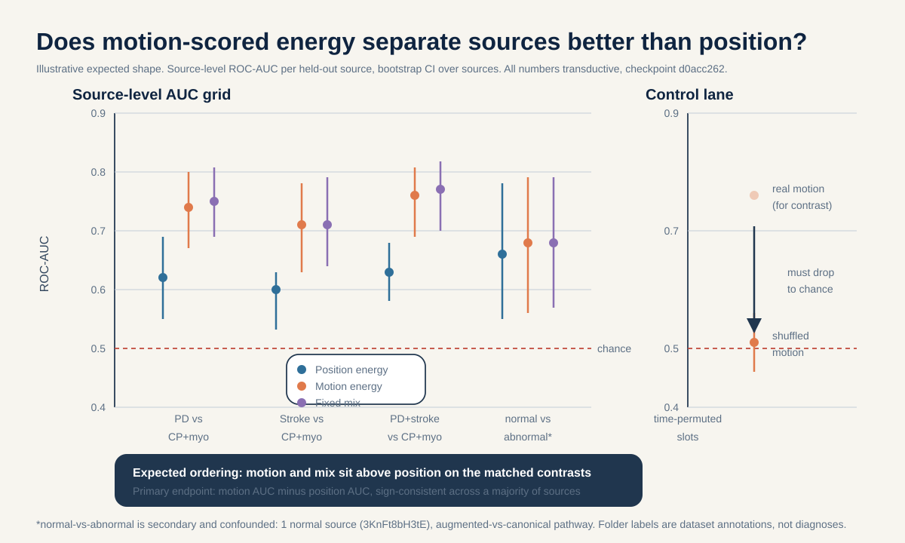
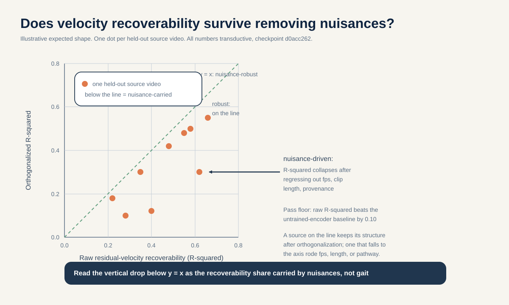

# Position-vs-motion prediction energy at inference: does the frozen S-JEPA already know motion, or only pose?

> Using a dense readout of the frozen encoder and predictor over all 16 time slots, with zero retraining, is latent-velocity structure linearly recoverable from prediction residuals, and does a motion-scored energy separate held-out source videos better than a position-scored energy after a shuffled-motion scale control?

## The question in plain words

This project trained a model to watch a person walking and to fill in body joints it was not allowed to see. The person is described only as a moving stick figure of skeleton joints, not as a full video image. The model type is called a JEPA, which stands for Joint Embedding Predictive Architecture. Here is the key trick: it does not try to draw the missing joints as pixels. Instead it predicts a hidden feature vector, which is just a short list of numbers that summarizes a masked joint. It then compares that prediction to a target feature made by a second copy of the model. Because this model reads skeleton coordinates instead of image patches, the exact variant is called S-JEPA (Abdelfattah and Alahi, ECCV 2024), where the S is for skeleton.

The training goal was basically about position. For a hidden joint at one moment in time, the model learns to predict what its feature should be. It was never directly asked to predict how fast a joint is moving. That speed of change is called velocity, the change in position from one moment to the next. Velocity is what clinicians actually watch when they judge a person's walk (gait). A stroke survivor and a person with Parkinson's disease differ less in where a foot sits and more in how it speeds up, hesitates, and comes back. So here is a fair question: even though we only trained on position, did the model quietly store motion anyway, as a side effect, deep inside its predictions?

We can test this without training anything new. We take the already-frozen model, run its predictor over every one of the 16 time slots in a clip, and read two different scores out of the very same predictor output. The first score, the position energy, measures how surprised the model is about where a joint sits. The second score, the motion energy, measures how surprised it is about how a joint changes from one time slot to the next. If the motion energy tells walking conditions apart better than the position energy, then motion structure is already hiding inside the frozen model. If it does not, then motion has to be trained in on purpose, and that would justify a much more expensive experiment.

One rule runs through everything below. The unit we are allowed to generalize over is the source video, not the clip. Many short clips can come from one YouTube video, and clips from the same video share a camera, a person, and an extraction pipeline. If we let clips from the same video sit on both sides of a train-test split, the model can win by recognizing the video, not the gait. Source-video-disjoint means every clip from a given video lands entirely on one side of the split. We hold that line before we fit anything.

## Why this matters

A positive result would confirm a specific and non-obvious belief: that a self-supervised goal stated purely about position can, at this small scale and with this architecture, still build a representation from which motion can be read out with a simple linear tool. That would be a concrete, reusable fact about what feature-prediction goals capture as a byproduct. It echoes the V-JEPA finding that video feature prediction must be judged on motion-sensitive tasks, not just on appearance (Bardes et al., arXiv:2404.08471). It would also mean a cheap inference-time score can surface motion information that the training loss never named.

A null result is just as useful, and it rules out a hopeful belief. If a motion-scored readout does no better than a position-scored one, and no better than a simple non-neural baseline, then the frozen position-trained S-JEPA does not carry velocity structure that a linear tool can reach. That tells anyone extending this work that motion must be built into the training target, not squeezed out afterward. It sets a clear, honest floor before anyone spends compute retraining encoders.

Either way the finding stays descriptive: is velocity structure recoverable from frozen predictor residuals, yes or no, under a source-video-disjoint protocol with nuisance controls. We do not claim a diagnostic, and we do not claim the model was designed to know motion.

## Conference-level augmentation

The plain question above (does a position-trained model already carry motion) becomes a top-venue study once we say WHICH motion feature we want and WHY a clinician would care. The neuroscience picks the target for us, and it names one specific gait axis that this motion-energy readout is built to touch.

### The neuroscience chain: source, mechanism, skeleton-measurable feature

Start with Parkinson's disease. The disease begins with the death of dopamine-making cells in a small midbrain region (the substantia nigra pars compacta, SNpc). Losing that dopamine degrades the control loops of the basal ganglia, the brain's system for running well-practiced movements on autopilot. The result is a loss of habitual, automatic movement control (Redgrave et al. 2010, PMID 20944662; Wu, Hallett, Chan 2015, PMID 26102020). When walking is no longer automatic, it stops being metronome-steady. The behavioral hallmark of that lost automaticity is elevated gait-timing VARIABILITY: in PD, the stride-to-stride timing wobbles about twice as much as in controls, and that wobble tracks disease severity (Hausdorff et al. 1998, PMID 9613733; Hausdorff 2007, PMID 17618701).

**Reading the math (variability, not average, is the signal).**
- "Variability" here means how much the timing of one stride differs from the next, not how fast the person walks on average.
- "About 2x controls" means the stride-timing spread in PD is roughly double the spread in healthy walkers.
- The average stride timing (the mean) can look almost normal while the variability is clearly high, because the mean and the variability are under different control (Hausdorff 1998, PMID 9613733). So you must look at the spread, not the average, to see the deficit.
- A concrete anchor: stride-time coefficient of variation (CV, the spread divided by the mean, expressed as a percent) was 8.8 percent in PD fallers versus 4.2 percent in non-fallers (Schaafsma et al. 2003, PMID 12809998). A CV is a fraction turned into a percent; higher means less regular.

Now the mechanism-defined CONTRAST, which is what makes this a clean axis rather than a vague "PD is different" claim. Symmetric myopathy (primary muscle disease) has no lesion in the rhythm generator at all. Its problem is weak muscles, not a broken autopilot. So myopathic gait keeps a preserved, regular cadence (in Duchenne muscular dystrophy, 2.25 versus 2.21 steps per second, not significantly different; Vandekerckhove et al. 2022, PMID 35721358) and shows no significant left-right spatiotemporal asymmetry (Xiong et al. 2023, PMID 37525241). Myopathy therefore sits at the OPPOSITE end of the rhythm-regularity axis from PD: PD is irregular from a broken autopilot, myopathy is regular with intact timing. That opposition is the target this study asks the frozen model to see.

The skeleton-measurable feature is the recoverable side of this axis. A markerless skeleton can measure step timing accurately (temporal mean absolute error 0.02 seconds per step; Stenum et al. 2021, PMID 33891585), so the timing structure of a walk is legible to a stick-figure model. In this study the frozen predictor's slot-to-slot residual velocity structure is scored as a within-window RELATIVE rhythm-regularity axis: the dispersion of the per-slot motion residual across the 16 time positions of a clip. A regular, metronomic walk should produce an evenly structured residual across slots; an irregular one should produce a more scattered residual.

**Honest boundary, cross-linked to item 04.** This item CANNOT recover absolute cadence (steps per minute) or walking speed. Item 04 shows algebraically that the mandatory fixed-64-frame temporal_resize warps every clip to the same duration, which erases absolute cadence and speed by construction (duration-warp invariance, pre-registered tax >= 0.70). Because every clip is stretched or squeezed to 64 frames before the encoder sees it, "steps per minute" is simply not in the input any more. So item 03's rhythm claim is restricted to WITHIN-WINDOW RELATIVE regularity, the shape of the timing wobble inside one already-normalized clip, not a calibrated timing rate. A second, tighter bound also applies: notebook 05 shows that stride_time_cv is not linearly decodable from roughly 2-second windows in the mean/std readout (`_shared_facts.md`). So item 03 does not target a calibrated CV either. It targets only a within-window relative-regularity ORDERING (more regular versus less regular), and it must clear a raw-coordinate velocity ceiling and the shuffled-motion control to count.

### The generalizable claim (what transfers beyond gavd5)

The reusable claim is a method, not a gavd5 number. A position-only trained skeleton-JEPA either does or does not carry, in its frozen predictor's slot-to-slot residual velocity structure, a within-window relative rhythm-regularity axis that separates the loss-of-automaticity (PD) mechanism from the symmetric-myopathy baseline, above a raw-coordinate velocity ceiling and a shuffled-motion control. Answering that yes or no is a reusable inference-time test of whether feature-prediction objectives capture motion regularity as a byproduct, with no retraining. Any lab holding a frozen position-trained JEPA can run the same dense-readout-plus-ceiling-plus-shuffle protocol to ask the same question of their own model. This directly instantiates the mechanism-probe-with-a-raw-input-ceiling lever: credit the representation only if it beats a raw-coordinate probe on the named gait axis. It also echoes the V-JEPA finding that feature-prediction models must be judged on motion-sensitive tasks, not appearance alone (Bardes et al., arXiv:2404.08471), and stands opposite the V-JEPA 2 recipe that builds motion in by training a new action-conditioned predictor (arXiv:2506.09985) rather than reading it out of a frozen one.

### Biomarker-specific external-cohort note (honest scope)

The stride-time-variability biomarker has a real, label-aligned external cohort: PhysioNet Gait-in-PD (gaitpdb: 93 PD plus 73 controls; Hausdorff; DOI 10.13026/C24H3N). It can serve as a LABEL-LEVEL, cross-modal confirmation that the PD-versus-control rhythm-variability axis is real and points the way the neuroscience says. Honest scope: gaitpdb is force and IMU data (vertical ground-reaction force under the feet), NOT skeleton. So it can corroborate that the variability axis exists and is label-aligned, but it CANNOT confirm skeleton-level recoverability, it cannot confirm within-window recoverability, and it has no myopathy arm at all. Honest limitation: no participant-disjoint public SKELETON cohort exists that pairs PD rhythm variability against symmetric myopathy. So skeleton-level clinical transfer of the relative-regularity axis stays an internal transductive diagnostic on the 18-source GAVD cohort (PD 2 sources, myopathic 10 sources), and the external cohort is label-level cross-modal support only, never skeleton transfer. Nothing here upgrades an 18-source dataset into a clinical-accuracy claim.

### Feasibility delta versus the original

The core study does not change. It stays cheap and near-zero-retrain: 3 weeks (16 Aug to 5 Sep 2026), CPU or single-GPU inference only, reusing the cached 528-token tensors and the frozen `d0acc262` encoder, target encoder, and predictor. No encoder weights change, exactly matching the existing plan (dense readout, ridge probe, per-source-holdout table, shuffled-motion control). Retrain scale is none. Data needs are the existing GAVD canonical-path tensors plus the per-source fps already recovered for the dt in this item, and the item-04 resize-erasure result is IMPORTED as a stated boundary, not re-run. The only additions are framing and one contrast: name the PD-versus-myopathy rhythm-regularity axis as the endpoint and report it. The reach tier adds 2 to 4 weeks with still no retrain: a label-level cross-modal check against PhysioNet gaitpdb (DOI 10.13026/C24H3N) confirming the direction of the PD stride-time-variability axis only.

## Background and related work

A **token** here is the model's smallest input unit. Each walking clip is resized to 64 frames. Then every 4 next-door frames are grouped into one time patch, which gives 16 time positions. There are 33 BlazePose skeleton joints (Grishchenko et al., BlazePose GHUM, arXiv:2206.11678). One token is a single joint at a single time position, so there are 33 x 16 = 528 possible joint-time tokens.

**Reading the math (528 tokens):**
- This says the total number of joint-time slots is the number of joints times the number of time positions.
- `33` is the count of BlazePose skeleton joints.
- `16` is the count of time positions, which came from 64 frames grouped 4 at a time (64 / 4 = 16).
- `x` is ordinary multiplication.
- The result 528 is a plain count, so it has no upper limit other than the grid size; it is exactly 33 times 16.
- If either factor changed, the token grid would change size, and every readout below would run over a different number of slots.

Each token starts as a 4-frame by 3-coordinate vector, that is 4 x 3 = 12 numbers, and a linear layer embeds it into a 64-dimensional space (embed_dim 64).

The model has three parts. The **online encoder** (also called the view encoder) sees only the visible tokens. The **target encoder** is a slowly updated copy of the online encoder; it sees all 528 tokens and is never updated by gradient descent. It is an **EMA teacher**: EMA means exponential moving average, which is like a slow-moving average that ignores day-to-day noise. So the teacher's weights are a running blend of the student's past weights. They drift with momentum that follows a cosine schedule, which just means the momentum value rides a smooth curved ramp (the shape of a cosine curve) instead of a straight line, moving from 0.999 toward 1.0.

**Reading the math (EMA momentum 0.999 to 1.0):**
- This says how much of the old teacher we keep each step when we blend in a little of the current student.
- A momentum of `0.999` means each update keeps 99.9 percent of the old teacher weights and mixes in only 0.1 percent of the student, so the teacher barely moves per step.
- The schedule slides from `0.999` up toward `1.0`; a value of exactly 1.0 would mean the teacher stops moving at all.
- "Cosine schedule" describes the shape of that slide: instead of a straight line, the value follows a gentle curved ramp (the arc of a cosine curve), so it changes slowly at first and near the end and a bit faster in the middle.
- Momentum here is a fraction between 0 and 1: closer to 1 means a slower, steadier teacher.
- If momentum were small (near 0), the teacher would jump around with the student, the target would be unstable, and both sides could collapse to a constant and cheat.

Because the teacher is not trained by backpropagation, its outputs can serve as stable prediction targets without the model cheating by collapsing both sides to a constant. The **predictor** is a small 2-layer Transformer with a learned mask token. Given the encoder's view of the visible tokens, it predicts the teacher's features at the masked positions and returns predictions only there.

**Masking** is what forces the model to learn. Only 12 lower-body landmarks can ever be hidden as prediction targets: left and right shoulder, hip, knee, ankle, heel, and foot index. Face and arm joints are always visible context and are never targets. So the largest possible global mask fraction is 12 out of 33.

**Reading the math (mask fraction 12/33 = 0.364):**
- This says the biggest share of joints we could ever hide is the maskable joints divided by all joints.
- `12` is the number of joints allowed to be hidden targets.
- `33` is the total number of joints.
- `/` is division, so 12 / 33 = about 0.364.
- A fraction like this is between 0 and 1; here it is about 0.364, or roughly 36 percent.
- This is far below the 75 to 90 percent hidden in image and video JEPA, because hiding a face or arm joint is forbidden; if that rule were dropped, more joints could be hidden and the task would get harder.

The training loss is:

`L = L_JEPA + 0.05 * L_VICReg + 0.25 * L_group`

**Reading the math (total loss):**
- In one sentence: the total training loss is a weighted sum of three separate penalties.
- `L` is the total loss, the single number training tries to make small; lower is better.
- `L_JEPA` is the main prediction penalty: how far the predictor's guess is from the teacher's target feature. It has weight 1 (it is the biggest voice).
- `L_VICReg` is an anti-collapse penalty that keeps features spread out. Its weight is `0.05`, which is small, so it acts as a gentle guardrail, not the main goal.
- `L_group` is a label-aware penalty that pulls same-condition features together. Its weight is `0.25`, which is bigger than 0.05 but still smaller than the main term, so it shapes the space without taking over.
- `*` means multiply (scale a penalty by its weight); `+` means add the three scaled penalties together.
- All three terms are non-negative, so `L` is at least 0; there is no fixed upper bound, and training just drives it lower.
- If you set `0.05` to zero, the anti-collapse guardrail is gone and features could shrink toward one point. If you set `0.25` to zero, the model would no longer be pulled by labels, and Stages 1 to 4 would stop being supervised fine-tuning.

L_JEPA is a latent cross-entropy. Cross-entropy is a way to measure how far apart two soft guesses are: both the prediction and the target are turned into soft distributions (a spread of weights that adds up to 1, like "60 percent this, 40 percent that"), and cross-entropy scores how much the prediction's spread disagrees with the target's spread. "Latent" just means this is done on the hidden feature vectors, not on pixels. Before that comparison, the teacher target is centered by a running EMA center. That center is a slow-moving average of recent teacher outputs (updated at rate beta 0.9, so it keeps 90 percent of the old center and blends in 10 percent of the newest batch), and subtracting it just shifts the target so no single feature can dominate every time. The target is then sharpened at temperature 0.06, which makes it more peaked and confident, and detached (stop-gradient, meaning no gradient flows back through the teacher), while the prediction uses temperature 0.10.

**Reading the math (temperatures 0.06 and 0.10):**
- This says how peaky each side's soft label is; a temperature is a knob that sharpens or softens a distribution.
- `0.06` is the teacher's temperature; a small temperature makes the teacher target sharp and confident.
- `0.10` is the prediction's temperature; it is slightly larger, so the student side is a touch softer.
- Temperatures are positive numbers; smaller means sharper and more peaked, larger means smoother.
- If both temperatures went very large, the targets would flatten toward uniform and carry almost no signal to learn from.

**VICReg** (Bardes, Ponce, LeCun, ICLR 2022, arXiv:2105.04906) adds a variance floor and a covariance penalty so features do not collapse into a single point; its variance term keeps the representation spread out. L_group is a label-aware term active only in Stages 1 to 4, which is why those stages are supervised fine-tuning, not pure self-supervised learning.

The lineage of this design runs from I-JEPA, which predicts masked image features in latent space (Assran et al., CVPR 2023, arXiv:2301.08243), through V-JEPA for video (Bardes et al., arXiv:2404.08471), to V-JEPA 2, which first does action-free pretraining and then adds an action-conditioned predictor (Assran et al., arXiv:2506.09985). The V-JEPA 2 two-stage recipe is the philosophical opposite of what we test here: they add motion conditioning by training a new predictor, while we ask whether motion is already latent in a position-trained one, read out at inference only. The dataset is GAVD (Ranjan et al., IEEE Access 2025, DOI 10.1109/ACCESS.2025.3545787). On the evaluation side, our discipline follows the leakage taxonomy of Kapoor and Narayanan (arXiv:2207.07048), which names no-independent-test-set and train-test contamination as failure modes, and the small-sample warning of Varoquaux (NeuroImage 2018) that tiny cohorts produce large error bars, so we report per-source dots rather than a single confident number.

## Method

Everything reuses the existing frozen artifact. Bind every number in this study to ONE checkpoint fingerprint prefix `d0acc262`, the curriculum-final checkpoint. A second lineage prefix `dba24a` has been observed locally; we do not mix lineages, and we state the single fingerprint next to every result.

**Step 1: one dense-readout estimator, stated honestly as new.** The trained model scores surprise only at hidden positions. For this study we add a single new inference-time estimator and use it for both energies, so the position and motion scores are not made by two conflicting procedures. We run the predictor densely over all 16 time slots for the maskable lower-body joints. This produces a predicted feature at every joint-time slot. We then get the matching teacher target features from the frozen target encoder over the same slots. This dense pass is a new readout, not the trained masked scoring, and we say so plainly. From this one dense output we compute two energies against the same dense target operator:

- **Position energy**: the per-slot residual between predicted and target features. A residual is just the gap between a prediction and its target. This summarizes how surprised the model is about where each joint is at each time slot.
- **Motion energy**: the residual of the slot-to-slot differences, that is the change of the dense features from one time slot to the next, summarizing how surprised the model is about how each joint moves. Because the per-source frame rate is confirmed and recoverable, we can attach a real time step dt to these differences.

**Worked example (illustrative numbers only, not grounded facts).** Say we hold out one source video and look at two clips from it. All values below are made up to show the arithmetic.
- Motion-energy separation on this held-out source: AUC = 0.72 (illustrative). AUC, area under the ROC curve, runs from 0 to 1, where 0.5 is a coin flip and 1.0 is perfect.
- Position-energy separation on the same source: AUC = 0.61 (illustrative).
- Per-source delta = motion AUC minus position AUC = 0.72 - 0.61 = 0.11, which is positive, so motion won on this source.
- Now the ridge probe. Trained-encoder velocity recoverability: R-squared = 0.34 (illustrative). Untrained-encoder baseline: R-squared = 0.20 (illustrative). R-squared runs up to 1.0, where higher means more velocity structure explained.
- Recoverability margin = 0.34 - 0.20 = 0.14 (illustrative).
- How to read it: our pre-registered floor asks the trained probe to beat the untrained baseline by at least 0.10 in median across held-out sources. Here 0.14 clears 0.10 on this one source, and the positive AUC delta agrees, so this source would count toward the majority-of-sources rule. One source is not the verdict; the rule is a majority across sources with consistent sign.

**Step 2: linear recoverability of velocity.** Fit a plain linear tool with a smoothing penalty (ridge probe) that maps the dense prediction residuals to a held-out latent-velocity target built from the target-encoder features. Choose the ridge penalty inside training sources only. The endpoint is how much velocity structure a linear tool can recover, reported as R-squared (the share of the target's variation the probe explains, from 0 to 1, higher is better), never as a claim that the model was trained for it. This probe carries its own pre-registered pass criterion, so it is decisive on its own and not just descriptive. We compute the same ridge probe against a matched untrained-encoder baseline: identical architecture and identical dense-readout pipeline, but random (never trained) weights, which fixes the input-level floor from raw coordinate structure alone. We pre-register that the frozen `d0acc262` probe counts as recoverable only if its per-source-holdout R-squared beats the untrained-encoder baseline by at least 0.10 in median across held-out sources, with the sign consistent on a majority of sources.

**Reading the math (recoverability floor, 0.10 margin):**
- This says the trained probe must explain meaningfully more velocity than a random-weight version of the same pipeline.
- The compared quantity is R-squared, the fraction of velocity variation the probe explains, between 0 and 1.
- `0.10` is the required gap in the median (middle) R-squared across held-out sources; it is a margin, not a raw score.
- "Sign consistent on a majority of sources" means more than half the sources must show the trained probe ahead, not just the average.
- If we set that 0.10 margin to zero, any tiny edge would count as a pass, and noise alone could fake recoverability.

If the trained encoder does not clear that floor, velocity structure is not linearly recoverable beyond what raw coordinates already provide, and that is a clean, reportable null.

**Step 3: energy as a separator.** For each held-out source video, compute a position-scored energy and a motion-scored energy per clip, and measure how well each separates a condition contrast, reported as ROC-AUC (0.5 is chance, 1.0 is perfect). The comparison of interest is motion energy versus position energy versus a fixed mix.

**Step 4: reuse of tensors and code.** Reuse the cached 528-token tensors and the frozen `d0acc262` target encoder and predictor. No encoder weights change. Every readout file records source, checkpoint hash, fold, and encoder-exposure label, because all current embeddings are transductive, a technical word that here simply means the encoder saw every evaluation row during training, so no row is truly new to it.

Below is a short, readable sketch of the core operation: one dense pass, two energies from it, plus the shuffled-motion control. It illustrates the idea and is not meant to run against real files.

```python
import numpy as np

# pred[t, j, d]  : predicted feature at time slot t, joint j, dim d (dense over all 16 slots)
# targ[t, j, d]  : frozen teacher target feature at the same slot
# Shapes: 16 time slots, 12 maskable lower-body joints, 64 feature dims.

def position_energy(pred, targ):
    # per-slot residual: how far the prediction is from the target at each slot
    residual = pred - targ                      # gap between guess and target
    return np.mean(np.sum(residual ** 2, axis=-1))   # average squared gap over slots and joints

def motion_energy(pred, targ):
    # slot-to-slot change first, THEN compare the changes (this is the velocity view)
    pred_change = np.diff(pred, axis=0)         # feature change between adjacent time slots
    targ_change = np.diff(targ, axis=0)
    residual = pred_change - targ_change
    return np.mean(np.sum(residual ** 2, axis=-1))

def shuffled_motion_control(pred, targ, rng):
    # scramble time order, which destroys real velocity but keeps per-slot sizes
    order = rng.permutation(pred.shape[0])      # random reordering of the 16 time slots
    return motion_energy(pred[order], targ[order])   # must sit at chance as a separator
```

## The decisive experiment

State the split before any fitting. The **primary contrast is mechanism-matched AND acquisition-path matched**: it is exactly the loss-of-automaticity-versus-symmetric-myopathy axis the neuroscience section builds (lines 29 to 45). Positives are canonical-path Parkinson's (2 source videos, the loss-of-automaticity / rhythm-irregularity end of the axis); negatives are canonical-path myopathic (10 source videos, the symmetric, rhythm-preserved end). Both sides use the canonical extraction path, so the extraction pathway cannot pretend to be the signal, and the contrast is precisely the mechanism-defined opposition named in the generalizable claim (line 45): PD irregular from a broken autopilot, myopathy regular with intact timing.

The **pooled abnormal-motion contrast is reported only as secondary**: canonical-path Parkinson's (2) and stroke (3) as positives against canonical-path myopathic (10) and cerebral palsy (2) as negatives. This pooled lane mixes mechanisms (stroke is lateralized / asymmetry, cerebral palsy is lateralized / crouch, neither is on the rhythm-regularity axis), so it does NOT test the loss-of-automaticity chain and is not the load-bearing number. It is kept only as an exploratory broad-abnormality readout. The **normal contrast is also secondary and flagged as confounded**, because all 12 normal sequences come from ONE source video (id `3KnFt8bH3tE`) and most normal rows use the augmented extraction path while every abnormal row uses the canonical path. With only one normal source, the condition label is nearly the same thing as the source identity there.

The split is **source-video-disjoint by construction**: every clip from a source video is assigned wholly to train or to holdout, and we evaluate one held-out source at a time. Because several conditions have very few sources, we do NOT report a single pooled AUC with an un-estimable fixed margin. Instead we **pre-register a per-source-holdout sensitivity table**: hold out one source at a time, record motion-energy AUC and position-energy AUC, and require that motion energy beats position energy on a majority of held-out sources with the sign consistent, rather than by a magic pooled delta.

**Per-source-holdout majority rule for the PD-versus-myopathy primary arm (stated explicitly given PD = 2 sources, myopathic = 10).** We hold out one source at a time. For a PD-versus-myopathy AUC to be estimable on a given fold, the held-out set must contain at least one PD source and at least one myopathic source, so a single leave-one-source-out fold that removes only a myopathic source still scores against the remaining PD source in training-side reference, and the two PD sources each anchor their own held-out fold. Concretely: there are 2 PD folds (hold out PD source 1, hold out PD source 2) and 10 myopathic folds, giving 12 held-out sources with an estimable per-source AUC. The **decisive rule** is that motion-energy AUC exceeds position-energy AUC on a MAJORITY (at least 7 of 12) of these held-out sources with the sign consistent, AND that the sign holds on BOTH PD folds (since with only 2 PD sources, a rule that ignored PD-fold agreement could pass on myopathic folds alone and miss the axis). Requiring both PD folds to agree keeps the decisive rule estimable and mechanism-anchored rather than resting on an un-estimable pooled margin (consistent with our rejection of a magic pooled delta above).

The **simple non-neural baseline** is a handcrafted coordinate motion feature computed straight from the raw joint coordinates (per-joint speed magnitude summarized over the clip), with no neural network. If the frozen model's motion energy cannot beat this baseline, the model adds nothing on this axis.

The **shuffled-motion control must stay at chance**: permute the time order of slots before computing the motion difference, which destroys real velocity while keeping per-slot magnitudes. A motion energy that still separates conditions after this shuffle is picking up scale, not motion, and the finding is void.

| Lane | What it scores | Source-disjoint | Role |
|---|---|---|---|
| Position energy | per-slot residual (where) | yes | comparison baseline |
| Motion energy | slot-to-slot residual (how it changes) | yes | primary readout |
| Mix | fixed blend of both | yes | does combining help |
| Handcrafted coordinate speed | raw-coordinate motion, no network | yes | non-neural floor |
| Shuffled-motion control | motion energy on time-permuted slots | yes | must stay at chance |

Primary endpoint: per-source-holdout motion-energy AUC minus position-energy AUC, with the sign required consistent across a majority of held-out sources and on both PD folds, on the mechanism-matched PD-versus-canonical-myopathic contrast, all under fingerprint `d0acc262`. The pooled PD+stroke versus myopathic+CP contrast is a secondary, exploratory lane only.

**What a positive AUC does and does not mean.** A positive motion-energy AUC on this endpoint is evidence for within-window RELATIVE rhythm-regularity structure only: it says the frozen predictor's slot-to-slot residual carries an ordering (more regular versus less regular) that separates the loss-of-automaticity end from the symmetric-myopathy end within already-normalized clips. It does NOT constitute recovery of the stride-time-CV biomarker and does NOT recover absolute cadence or walking speed, both of which are erased by the fixed-64-frame temporal_resize (see the honest boundary cross-linked to item 04 at line 41). A reader must not infer CV recovery or a calibrated timing rate from a positive AUC here.

## Controls and incorporated repairs

Every repair listed for this proposal in `_selection.json` is addressed here.

- **One estimator, not a conflicting pair.** The original sketch paired a hold-mask-fixed score with a two-sided finite difference. We drop that. There is now a SINGLE dense-readout estimator: run the predictor densely over all 16 time slots for the masked joints, and compute both position and motion energies from that same dense output against the same dense target operator. We state plainly that this is a new dense-readout estimator, not the trained masked scoring.
- **No causal-screening bridge; descriptive framing only.** We do not claim this screens whether the plan-04 motion-target retrain is worth running. The question is reframed strictly as descriptive: is velocity structure linearly recoverable from frozen predictor residuals.
- **Mechanism-matched AND acquisition-path matched in the primary contrast.** The primary comparison is canonical-path Parkinson's (positive, loss-of-automaticity end) against canonical-path myopathic (negative, symmetric rhythm-preserved end), exactly the axis the neuroscience section builds. The pooled PD+stroke versus myopathic+CP contrast, which mixes lateralized mechanisms, is demoted to a secondary exploratory lane, and the normal contrast is secondary only, with the one-normal-source and augmented-vs-canonical provenance confound flagged in place.
- **Orthogonality test against nuisances.** We check whether each energy is secretly just tracking a boring side variable. To do that we fit a simple line that predicts the energy from three nuisances (per-source fps, raw clip length, provenance path), subtract off that predicted part, and keep only the leftover, called the residual (the part of the energy the nuisances cannot explain). We then re-measure separation on that leftover and report it as the residual AUC (the same 0.5-is-chance-to-1.0-is-perfect score, but computed after the nuisances are removed). An energy that only works because it tracks frame rate, clip length, or extraction pathway will lose its separation here.
- **No pooled AUC with an un-estimable margin.** We replace the single pooled AUC and the un-estimable 0.05 margin with a pre-registered per-source-holdout sensitivity table and a majority-of-sources sign-consistency rule.
- **Shuffled-motion control that must stay at chance.** Kept and made a hard gate: if the time-permuted motion energy still separates conditions, the motion finding is void.
- **Transductive labeling and source counts up front.** Every number is labeled transductive because the frozen encoder saw every evaluation row. Source-video counts (normal 1, Parkinson's 2, stroke 3, myopathic 10, cerebral palsy 2) are stated before any fitting, and we bind to fingerprint `d0acc262`.

## How this differs from the existing plan

The nearest neighbor is **plan/04, the motion-vs-position TARGET ablation**, which changes the training target to motion and retrains eight encoders. This proposal changes only the inference SCORING target on the existing frozen encoder and asks whether motion is already latent-recoverable, at zero retraining cost. Where plan/04 spends compute to build motion into the objective, we spend a single test-time pass to ask whether the position-trained model already carries motion, using the confirmed per-source fps to compute a real dt.

## Three-week timeline

### Week 1 (16 to 22 Aug)

- Load the frozen `d0acc262` encoder, target encoder, and predictor; verify the fingerprint and refuse the `dba24a` lineage.
- Reuse the cached 528-token tensors; recover per-source fps and confirm dt is non-degenerate and varies across sources.
- Implement the single dense-readout estimator over all 16 time slots and unit-test that position and motion energies come from the same dense output.
- Build the source-video-disjoint holdout manifest and the handcrafted coordinate-speed baseline.

**Day 5 gate (20 Aug):** continue only if the dense estimator runs on `d0acc262`, per-source fps is non-degenerate, the shuffled-motion control sits at chance on a spot check, and no held-out source's clips leaked into any fit.

### Week 2 (23 to 29 Aug)

- Run the per-source-holdout sensitivity table for position, motion, and mix energies on the mechanism-matched PD-versus-canonical-myopathic primary contrast, then on the secondary pooled PD+stroke versus myopathic+CP lane.
- Fit the linear velocity-recoverability probe; report R-squared per held-out source against the untrained-encoder baseline, and score it against the pre-registered floor (median R-squared at least 0.10 above the untrained baseline, sign-consistent on a majority of sources).
- Run the orthogonality test regressing each energy on fps, clip length, and provenance, and report residual AUC.
- Run the secondary, flagged normal contrast.

**Day 14 gate (29 Aug):** continue confirmation only if motion energy beats position energy on a majority of held-out sources with consistent sign (and on both PD folds) on the mechanism-matched PD-versus-myopathic contrast, OR the null is clean (motion does not beat position and does not beat the handcrafted baseline). Either outcome is decisive and reportable.

### Week 3 (30 Aug to 5 Sep)

- Produce the per-source AUC grid with bootstrap CIs and the shuffled-motion control lane.
- Produce the raw-vs-orthogonalized velocity-recoverability scatter.
- Package the estimator code, split manifest, per-source tables, and seed-level results bound to `d0acc262`.

## Figures


*Figure 1: a 3 (target: position, motion, mix) by 4 grid of source-level AUC. The leftmost x-group is the PRIMARY mechanism-matched PD-versus-canonical-myopathic contrast (the loss-of-automaticity versus symmetric-myopathy axis); the remaining three are secondary exploratory lanes (stroke vs myo, the pooled PD+stroke vs myopathic+CP broad-abnormality lane, and the confounded normal-vs-abnormal lane), all canonical path except the flagged normal lane. Bootstrap CIs over held-out sources, plus a shuffled-motion control lane that must not beat motion.*


*Figure 2: scatter of raw residual-velocity recoverability R-squared versus the orthogonalized residual after regressing out fps, clip length, and provenance, per held-out source. The pre-registered floor is the untrained-encoder baseline plus 0.10; a source below the y = x line lost recoverability to nuisances.*

## Responsible use

The folder labels used here (stroke, parkinsons, myopathic, cerebral palsy, normal) are dataset annotations attached to GAVD source videos. They are not diagnoses made by this project, and nothing in this study should be read as a clinical assessment of any individual. All results are transductive representation diagnostics on a small, source-limited cohort, and any separation reported is a statement about the frozen model's features, not about a person's health.

## References

- Abdelfattah and Alahi, S-JEPA, ECCV 2024, DOI 10.1007/978-3-031-73411-3_21.
- Assran et al., I-JEPA, CVPR 2023, arXiv:2301.08243.
- Bardes et al., V-JEPA, "Revisiting Feature Prediction for Learning Visual Representations from Video", 2024, arXiv:2404.08471.
- Bardes, Ponce, LeCun, VICReg, ICLR 2022, arXiv:2105.04906.
- Assran et al., V-JEPA 2, 2025, arXiv:2506.09985.
- Grishchenko et al., BlazePose GHUM, 2022, arXiv:2206.11678.
- Ranjan et al., GAVD, IEEE Access 2025, DOI 10.1109/ACCESS.2025.3545787.
- Kapoor and Narayanan, "Leakage and the Reproducibility Crisis in ML-based Science", 2022, arXiv:2207.07048.
- Varoquaux, "Cross-validation failure: small sample sizes lead to large error bars", NeuroImage 2018.
- Redgrave et al., "Goal-directed and habitual control in the basal ganglia: implications for Parkinson's disease", Nat Rev Neurosci 2010, PMID 20944662.
- Wu, Hallett, Chan, "Motor automaticity in Parkinson's disease", Neurobiol Dis 2015, PMID 26102020.
- Hausdorff et al., "Gait variability and basal ganglia disorders: stride-to-stride variations in gait cycle timing in Parkinson's disease and Huntington's disease", Mov Disord 1998, PMID 9613733.
- Hausdorff, "Gait dynamics in Parkinson's disease: common and distinct behavior among stride length, gait variability, and fractal-like scaling", Hum Mov Sci 2007, PMID 17618701.
- Schaafsma et al., "Gait dynamics in Parkinson's disease: relationship to Parkinsonian features, falls and response to levodopa", J Neurol Sci 2003, PMID 12809998.
- Vandekerckhove et al., "The role of hip abductor and extensor muscle strength in the gait of children with Duchenne muscular dystrophy", Front Hum Neurosci 2022, PMID 35721358.
- Xiong et al., "Gait analysis of Duchenne muscular dystrophy: spatiotemporal and synergy asymmetry", Biomed Eng Online 2023, PMID 37525241.
- Stenum et al., "Two-dimensional video-based analysis of human gait using pose estimation", PLoS Comput Biol 2021, PMID 33891585.
- Goldberger et al., PhysioNet Gait in Parkinson's Disease Database (gaitpdb), DOI 10.13026/C24H3N.
