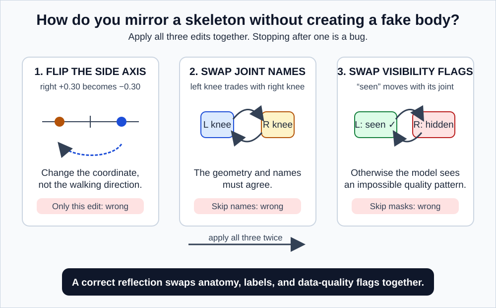
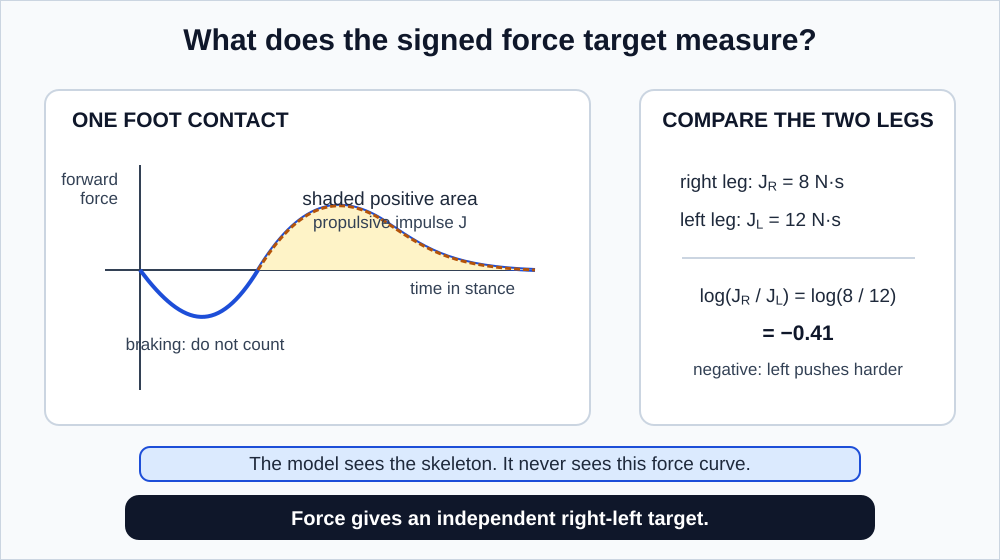
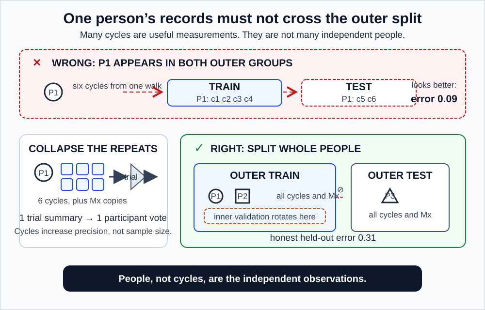
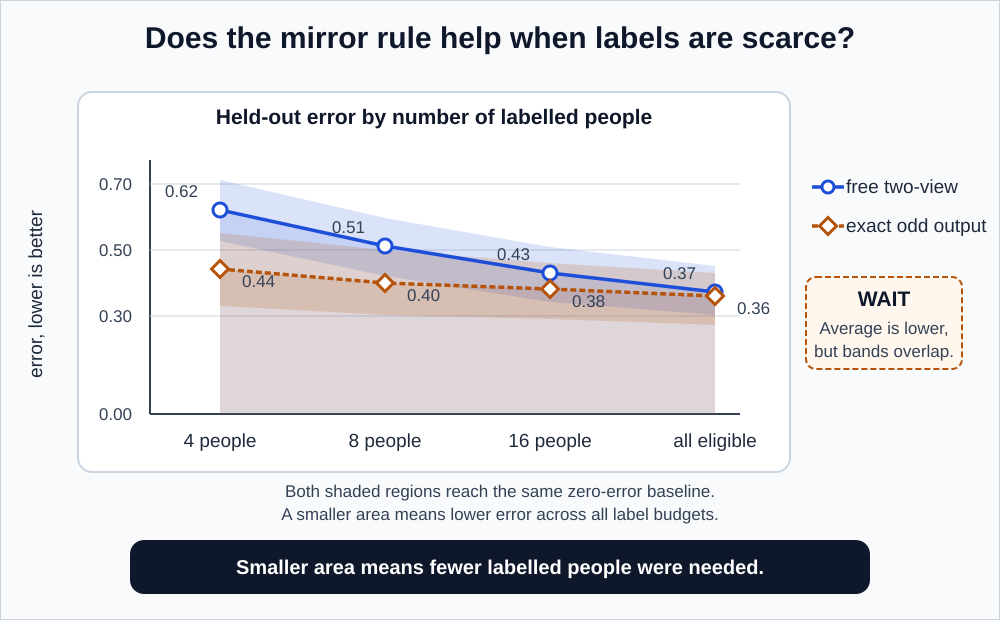

# GaitParity shared methodology

This document defines everything the [Prototype](./README_SHORT_TERM.md) and the [Study](./README_LONG_TERM.md) have in common: what gets measured, what a mirror does, how data is split, what the metrics mean, and which honesty rules are non-negotiable.

The two studies ask different questions. They must use identical anatomy, identical sign conventions, identical data boundaries, and identical definitions of evidence, or their results cannot be compared.

**Prerequisite:** [README.md](./README.md) for the concepts. [GLOSSARY.md](./GLOSSARY.md) for any word that stops you.

Every rule below is stated as **the rule**, then **why it exists**, then **what goes wrong without it**. Rules without reasons get quietly dropped the first time they are inconvenient, and this document is meant to survive that.

---

## 1. What is being measured

### The input

One trial is a block of numbers:

$$
x \in \mathbb{R}^{T \times J \times C}
$$

Read that as a 3D table of numbers, like a stack of spreadsheets: $T$ rows, $J$ columns, $C$ layers deep.

- $T$ = number of time points. In this repository, 64 frames per sequence.
- $J$ = number of joints. The pose estimator produces 33 landmarks. The primary **core-11 schema** keeps the bilateral lower-body set that every dataset must provide (section 4). A separately reported core-13 sensitivity version adds both shoulders only where their mapping is reliable.
- $C$ = coordinates per joint. Three: forward, vertical, and side to side.

Three concrete instances can appear in this folder: the raw pose-estimator output is $64 \times 33 \times 3 = 6{,}336$ numbers; the primary core-11 input is $64 \times 11 \times 3 = 2{,}112$; and the optional core-13 input is $64 \times 13 \times 3 = 2{,}496$. All describe roughly two seconds of walking. Core-11 is the primary common input. Core-13 is a prespecified sensitivity analysis, never a pooled substitute.

Carried alongside is a **visibility mask**, the same shape, recording which values were genuinely observed. This is not optional bookkeeping. In this project's video-derived data, shoulders and hips are visible about 99 percent of the time, while heels are visible only about 68 to 70 percent of the time. The remaining 30 percent of heel values are interpolations. A model that cannot tell measured values from filled-in ones is learning partly from fiction.

> **A word that means two things.** "Mask" is used in two unrelated senses in this field. A **visibility mask** records what was genuinely *missing* in the data. A **training mask** records what a JEPA deliberately *hid* during self-supervised training. One is observed, the other is chosen. This folder always says which one it means, and never writes a bare "mask."

### The encoder and the readout

$$
h = E(x), \qquad \hat{y} = q(h)
$$

The encoder $E$ compresses the trial into a representation $h$. The readout $q$ turns $h$ into one number.

### The output

That number is a signed **right minus left** quantity.

| Sign | Meaning |
|---|---|
| Positive | The right side's value is larger |
| Negative | The left side's value is larger |
| Zero | The two sides matched |

**The convention is right minus left, everywhere, in every file, with no exceptions.** Half the sign errors in laterality research come from one script using left minus right while everything downstream assumes the opposite. The result is a model that is confidently, systematically backwards, and the failure is silent because everything still runs.

### One thing the sign is not

A negative score means the measured left-side value was larger. It does **not** mean "the left side is the impaired side." Those are different statements, they usually agree, and they sometimes do not, because people compensate. Someone with right-side weakness may push harder with the right leg in a way that partially masks or even reverses the expected difference on one particular measure.

Keep "which direction the measurement points" and "which side is clinically affected" as separate variables in the code and in the writing. They are analysed separately throughout.

---

## 2. The reflection operator

Anatomical reflection $M$ must do exactly four things:

1. **Negate the mediolateral coordinate.** The side-to-side axis flips sign. Forward stays forward, up stays up.
2. **Exchange every left and right joint.** Left knee becomes right knee, left heel becomes right heel, for every bilateral pair. The pelvis has no left-or-right twin, so it keeps its own name and only its side-to-side coordinate flips.
3. **Exchange the matching masks and confidence values.** If the left heel was 70 percent visible and the right was 95 percent, then after reflection the right heel must read 70 percent and the left 95 percent.
4. **Leave time order, forward direction, and vertical direction untouched.** Reflection is not time reversal and not a rotation. This one gets stated explicitly because a naive implementation that negates the wrong axis will run the walk backwards, or stand the person on their head, and **both of those still pass an $M(Mx) = x$ test**. Doing the wrong thing twice also returns you to the start.

A worked instance of steps 1 through 3. Say the left ankle sits at side-to-side coordinate $+0.10$ metres and the right ankle at $-0.09$, with the left ankle unobserved in this frame. After $M$: the slot named "left ankle" holds $+0.09$ and is observed, and "right ankle" holds $-0.10$ and is unobserved. Apply $M$ again and you are back to $+0.10$, $-0.09$, left unobserved.

### Why step 3 is the one that gets skipped

Steps 1 and 2 are obvious and people implement them. Step 3 looks like fussy bookkeeping and gets left out.

Here is what that costs you. Suppose left heels are consistently harder to see than right heels in your dataset, which is exactly the case here. You reflect the coordinates but not the masks. You have now built a body whose *geometry* is right-dominant but whose *data quality pattern* is still left-dominant. No real recording looks like that.

A model can detect that mismatch. It then has a perfect shortcut: "high-quality-left plus flipped-geometry means this is a reflected example, so I should output the negative." It scores beautifully on your mirror test while having learned nothing about anatomy. Your test now measures your bug.

### The two properties that must hold

Reflecting twice returns the original:

$$
M(Mx) = x
$$

This is the cheapest possible unit test and it catches an enormous fraction of real implementation errors. Run it first, on real data, not just on synthetic arrays.

An odd target flips sign; an even target does not:

$$
y_{\text{odd}}(Mx) = -y_{\text{odd}}(x), \qquad y_{\text{even}}(Mx) = y_{\text{even}}(x)
$$

**Odd examples:** right-minus-left propulsive impulse, right-minus-left step length, right-minus-left stance time.

**Even examples:** average walking speed, total distance travelled, total bilateral propulsion, overall movement amplitude.

These are physical expectations. Where a physical expectation and the implemented target definition disagree, **the implemented definition wins and the discrepancy gets investigated**, because a mismatch usually means one of the two is wrong.



*Figure 1. All four requirements of an anatomical reflection. Performing three of the four produces a body that could not exist, which a model will find and exploit.*

---

## 3. Reflection, rotation, viewpoint, and time shift are four different things

These four operations get casually lumped together as "symmetry stuff." They behave differently and need separate tests.

| Operation | What actually changes | What the signed prediction should do |
|---|---|---|
| **Anatomical reflection** | Body sides are genuinely exchanged | Flip sign, exactly |
| **Rigid frame rotation** | Coordinate axes rotate; anatomy keeps its labels | Stay put, after consistent body-frame handling |
| **Real camera-view change** | Projection, visibility, and pose-estimation error all change | Stay roughly put, after view normalization |
| **Half-cycle time shift** | The walking phase moves | Depends on how the cycle summary is defined. See below. |

**On row 4.** Shifting a window by half a cycle makes the right leg's data line up where the left leg's used to be. An unaligned summary can therefore flip sign for a reason that has nothing to do with anatomy. This is exactly why every cycle must be aligned to a fixed event, such as right heel strike, before anything is summarized.

Rows 2 and 3 are not the same test, and conflating them is a specific over-claim this project refuses to make. Rotating a coordinate frame in software is a clean mathematical operation on data you already have. Filming a person from a genuinely different angle changes which joints are occluded, changes how much the pose estimator gets wrong, and changes the error's structure. A model can pass the rotation test easily and fail the real-camera test badly. Only the second one is evidence about camera invariance, so only the second one gets described that way.

### The alternating-gait subtlety

This one is worth slowing down for, because it is counterintuitive and it invalidates a natural-seeming test.

Walking is alternating. At any single instant, one leg is on the ground and the other is in the air. They are roughly half a cycle out of phase, always, by design.

So consider a perfectly symmetric walker and ask: "what is right-minus-left at frame 30?"

The answer is not zero. At frame 30, the right foot might be flat on the ground bearing full weight while the left foot is mid-swing. The instantaneous difference between them is large. It is large for *everyone*, including people with no impairment whatsoever, because that is what walking is.

**Therefore: a healthy walker is not expected to produce zero from any individual frame.** Zero is only the expectation for a properly aligned, cycle-level bilateral summary, where the right leg's full stance phase is compared against the left leg's full stance phase.

Getting this wrong produces a "symmetry measure" that mostly reports where in the gait cycle your window happened to start.

---

## 4. Common body representation

Every dataset here (motion capture with markers, video with pose estimation) describes bodies differently. The primary **core-11 schema** maps each one to:

- pelvis centre
- left and right hip
- left and right knee
- left and right ankle
- left and right heel
- left and right toe or forefoot

The **core-13 sensitivity schema** adds both shoulders, but only when the mapping is direct and reliable in every dataset being compared. It is a separate declared analysis, not an excuse to quietly change the input after seeing results.

### The preprocessing sequence, and why each step exists

**Step 1. Determine walking direction from within-trial pelvis motion, without using outcome labels.**
Track where the pelvis goes over the trial; that is the direction of travel. The restriction matters: if you used the label to decide direction, the label has entered preprocessing, and every downstream result is contaminated. This is a textbook leakage path and it is easy to walk into.

**Step 2. Orient forward motion to the positive anterior direction.**
Otherwise a person filmed walking right-to-left and one filmed left-to-right have opposite-signed coordinates for identical movement.

**Step 3. Orient vertical upward.**
Different capture systems disagree about this. Some use y-up, some z-up.

**Step 4. Construct a right-handed mediolateral axis.**
Once forward and up are fixed, handedness determines the side-to-side axis. Getting it backwards mirrors your entire dataset silently. Every measurement still looks plausible, every plot still looks reasonable, and every sign is inverted. This is the single most dangerous error available in this project, which is why the reflection unit tests exist and why visual overlays get inspected by a human.

**Step 5. Centre each frame at the pelvis.**
Removes where the person is in the room. We care about how they move, not where they are.

**Step 6. Scale using a robust within-trial leg-length estimate.**
A tall person's step is longer in centimetres than a short person's without being asymmetric. Normalizing by the person's own leg length converts "how many centimetres" into "what fraction of a leg," which is comparable across bodies. "Robust" means using a median or trimmed estimate, so that a single badly-tracked frame does not set the scale for everything.

**Step 7. Keep the transform so processed sequences can be replayed visually.**
Automated numerical tests do not catch every left-right swap. Someone needs to watch a skeleton walk and confirm it is not moonwalking, not inside out, and not mirrored. Save the inverse transform so this is possible.

**Step 8. Resample the whole gait cycle jointly, never each side separately.**

This last one deserves its own explanation, because it is the most seductive mistake here.

### Why separate left-right time normalization is forbidden

It is standard practice to resample a gait cycle to a fixed number of samples, say 100, so that cycles of different durations become comparable. Very reasonable.

Now suppose you do it per leg. You take the right leg's stance phase and stretch it to 100 samples. You take the left leg's stance phase and stretch it to 100 samples.

Consider a stroke survivor who spends 0.75 seconds on their left foot and 0.48 seconds on their right. That 0.27 second difference is one of the clearest markers of their impairment. After per-leg resampling, both are 100 samples long. **The asymmetry has been normalized out of existence.** Your pipeline is now provably incapable of detecting the thing you built it to detect, and nothing will error out.

Resample the full cycle as one unit and the relative timing of the two legs is preserved.

---

## 5. Data roles

| Data source | Its job here | Hard limit |
|---|---|---|
| **GAVD** | Code and historical-representation audit | Transductive; no participant IDs; target derived from the model's own input |
| **Public stroke cohort** | Primary clinical test, both studies | Force coverage must be verified participant by participant |
| **AMASS** | Non-clinical motion pretraining, full study only | Supports no clinical claim |
| **MoVi** | Real calibrated-view geometry test | Supports no clinical claim |
| **Parkinson's disease cohort** | Locked replication, after fields and force pass audit | Refitting within the cohort is replication, not transfer |
| **GaitRec** | Larger-scale target sanity check | Compatibility and unilateral-side rules must be frozen first |

### The GAVD label that must appear on every GAVD result

Any GAVD number reported anywhere carries four qualifiers:

- **transductive** (the encoder was trained on these very recordings);
- **grouped by source video** (not by person, because person IDs do not exist);
- **based on a signed coordinate excursion** (a quantity computed from the input, not measured independently);
- **produced by an old encoder that already trained on these recordings and later received label-guided tuning**, when the old checkpoint is used.

The last phrase is deliberately long because the short label "historically exposed hybrid JEPA" hides the important fact: the old encoder has already met these recordings during its earlier training. That is not hedging. These four facts are precisely what separate "our code works" from "our method works," and only the first is available from GAVD.

### On the direct-coordinate reference

A model that reads the raw coordinates directly, with no learned representation, is a **strong reference point**. It is not a null, and it is not a ceiling.

It is not a null because it is genuinely informative; beating a random guess is no achievement next to it. It is not a ceiling because a learned representation could legitimately exceed it by pooling information across time and joints in ways a direct feature does not. Describing it as either one misrepresents what a comparison against it shows.

---

## 6. The independent force target

The whole point of using force is that it comes from a different instrument than the input. The encoder sees movement. The target comes from sensors in the floor. Neither derives from the other.



*Figure 2. Where the target comes from. The gait cycle splits into stance and swing; during stance the fore-aft force first brakes the body and then drives it forward; the shaded forward-driving area is one leg's propulsive impulse. The model never sees any of this. It sees only the skeleton.*

### Constructing it

For each clean foot contact, integrate only the **positive** (forward-driving) portion of the fore-aft ground reaction force over the stance phase. That gives a propulsive impulse for that contact. Average the valid contacts on each side to get $J_R$ and $J_L$. Then:

$$
y_{\text{prop}} = \log\left(\frac{J_R}{J_L}\right)
$$

### Reading that formula

Take the project's running participant, $J_R = 8$ and $J_L = 12$ newton-seconds:

$$
\frac{8}{12} = 0.667, \qquad \ln(0.667) = -0.41
$$

Negative, because the left leg is pushing harder. Now swap the sides, $J_R = 12$ and $J_L = 8$:

$$
\frac{12}{8} = 1.5, \qquad \ln(1.5) = +0.41
$$

Same size, opposite sign. Exactly odd, which is what we need.

**Logarithms are natural throughout** (base $e$). Using base 10 instead would change every reported number by a factor of 2.303, and a codebase that mixes the two produces two incompatible sets of results that both look plausible.

### Three design choices worth understanding

**Why a ratio instead of a difference?** A difference carries the person's overall strength inside it. A large athletic adult with 5 percent asymmetry might show a difference of 3 newton-seconds; a small frail adult with 30 percent asymmetry might also show 3. A ratio is scale-free, so 12 versus 8 and 6 versus 4 both give the same answer, which is what "asymmetry" should mean.

**Why the logarithm?** Because raw ratios are lopsided around 1. Right-double-left gives 2.0; left-double-right gives 0.5. Those are the same degree of asymmetry in opposite directions, but 2.0 is 1.0 away from symmetric while 0.5 is only 0.5 away. Any model trained on raw ratios inherits that distortion. Taking the log fixes it: $\log(2) = +0.69$ and $\log(0.5) = -0.69$. Symmetric, and exactly odd, which raw ratios are not.

**Why use a lower reporting limit instead of a tiny made-up constant?** $\ell_{\text{LOQ}}$ is the force plate's lower limit of quantification: the smallest impulse the audit says it can measure usefully. It is determined from the plate calibration and baseline noise **before** model fitting. If either participant-level impulse is below that limit, the confirmatory continuous target is censored and the participant is excluded from that regression. A prespecified sensitivity analysis repeats the calculation with half and twice the audited limit. If the conclusion changes, the result is described as fragile. This avoids producing enormous log ratios that are really artifacts of an arbitrary $10^{-6}$ constant rather than measurements of a person's push.

### The force-quality gate

Force is a **confirmatory** target only if all five conditions hold:

1. At least 30 stroke participants are eligible **after** every confirmatory force screen: they have enough clean bilateral contacts, each participant-level side average is above $\ell_{\text{LOQ}}$, and each side's predeclared split-half estimate is also above $\ell_{\text{LOQ}}$.
2. Each of those participants has at least 4 usable contacts from each side for the repeatability audit.
3. Two non-overlapping subsets of contacts produce estimates that agree acceptably.
4. Axis signs and force-plate contact assignments are unambiguous.
5. The split-half reliability gate below passes.

Condition 3 is a reliability check and it is the one people skip. For every participant with at least four clean contacts per side, split each side's contacts into two balanced, non-overlapping groups. Compute the target separately from the two groups. Before any model is fitted, report the two-way absolute-agreement intraclass correlation (ICC, a repeatability score from 0 to 1) with a participant-bootstrap confidence interval, plus the median absolute disagreement between the two estimates. The confirmatory gate is an ICC point estimate of at least 0.75, a lower 95 percent interval bound above 0.50, and a predeclared maximum median disagreement. That maximum disagreement sets $\delta_{\text{MAE}}$, the smallest model MAE improvement worth caring about.

Two contacts per side are enough to calculate a rough target, but not enough to split it into two two-contact estimates. Such participants may appear in an exploratory sensitivity analysis. They do not enter the confirmatory force result. If a person's own steps disagree with each other, the target is too noisy to detect anything between people. There is no point testing whether a model can predict a quantity that cannot predict itself.

The threshold of 30 is a **feasibility floor**, not a power calculation. It is the point below which the analysis is not worth running. It is not a claim that 30 participants suffice to detect the effect.

**If the gate fails,** force analyses become exploratory and are labelled that way. A narrower categorical fallback (predicting documented paretic side instead) is permitted only if every training split and every retained label budget contains enough people from both side classes. A "classifier" trained on 14 left-paretic and 2 right-paretic participants has learned to say "left."

---

## 7. Stable model names

Every name below means the same thing in every document in this folder. Full descriptions are in the [glossary](./GLOSSARY.md).

| Name | Definition | What it isolates |
|---|---|---|
| `standard_one_view` | Standard encoder, ordinary readout on $x$ | The practical baseline |
| `sign_augmented` | Standard encoder trained on both $(x, y)$ and $(Mx, -y)$ | Whether encouragement suffices, without a guarantee |
| `two_view_free` | Unconstrained readout that sees both $E(x)$ and $E(Mx)$ | Whether the benefit was just the second look |
| `odd_output` | $[q(E(x)) - q(E(Mx))]/2$ | Whether the rule itself helps |
| `paired_unconstrained_encoder` | Same paired branches, cross-branch fusion, and exact odd output wrapper as the equivariant encoder, without branch-swap tying | Whether two-branch fusion alone explains a gain |
| `equivariant_encoder` | Paired reflection state preserved through every claimed layer | Whether encoder-wide structure beats output repair |
| `raw_kinematics` | Regularized phase-aware coordinate features | Whether learning beat direct measurement |
| `random_encoder` | Frozen randomly-initialized encoder, matched readout | The representation floor |
| `side_agnostic` | Predicts from $[E(x) + E(Mx)]/2$ only | Whether an originals-only association survives side removal |
| `nuisance_only` | Source, view, speed, and missingness, no gait content | Whether a shortcut explains everything |

> **A naming warning.** In `two_view_free`, "view" means **as-recorded versus mirrored**. Everywhere else in this project "view" means a camera position. Read the model name as "two *branches*, freely combined." Confusing those two senses is precisely the error section 3 exists to prevent.

### The pair that carries the prototype

`odd_output` versus `two_view_free` is the comparison the entire prototype is built around, and it exists to answer one specific objection.

Somebody will say: "of course your odd model did better, it got to look at the data twice."

So `two_view_free` gets to look twice too. It sees $E(x)$ and $E(Mx)$, the same two representations, and it can combine them any way that helps. The only thing it lacks is the constraint. If `odd_output` still wins, the second look is ruled out as the explanation, and the *rule* is what is doing the work.

Building the control that defuses the obvious objection, before anyone raises it, is most of what careful experimental design is.

### What an exact odd output does not prove

`odd_output` guarantees that the final scalar flips sign. That is a fact about one number at the exit. It says nothing whatsoever about how features transform inside the encoder, which may still be as tangled as ever. Any claim about internal structure requires layer-by-layer tests, and those live in the [full study methodology](./METHODOLOGY_LONG_TERM.md).

---

## 8. Participant-safe evaluation



*Figure 3. One person contributes many cycles. All of them go to the same side of every split. Test participants never influence preprocessing, model settings, or thresholds.*

**The rule: one person, one vote.**

### Why, concretely

Take a stroke survivor who walks for two minutes and contributes 30 gait cycles. Split cycles at random into 80 percent train and 20 percent test. Roughly 24 of her cycles land in training and 6 in test.

Now the model is evaluated on her. But it has already seen 24 near-copies of exactly those cycles, from the same person, same body proportions, same camera, same session, same shoes. Recognizing cycle 27 after training on cycles 1 through 24 is close to a memory task.

Your reported accuracy answers "can this model recognize someone it has already met?" You will report it as if it answered "does this work on a new patient?" Those numbers can differ enormously, and this specific mistake is one of the most common causes of machine-learning findings in medicine failing to reproduce.

### The full rule

- Every stride, trial, visit, medication condition, camera view, and reflected copy from one participant stays in the same outer split.
- Model settings are chosen using outer-training participants only, through grouped inner folds.
- Outer test participants are used exactly once, to produce predictions.
- Predictions are aggregated cycle to trial to participant *before* any confidence intervals are computed or conclusions drawn.
- For every signed outcome, score both the recorded pair $(x,y)$ and its synthetic mirror $(Mx,-y)$, average the two losses, then give that participant one vote. This makes a common-side guess unable to win by prevalence alone.
- GAVD groups by source video, since participant IDs are unavailable. Clips cut from one YouTube video are not independent people.
- **Seeds, folds, trials, and cycles never count as extra participants.** Ever. If a study has 40 people and 5 seeds, the sample size is 40.

### The reflected-copy detail

The reflected version $Mx$ of a participant's walk is not new data. It is the same person, mirrored. Putting $x$ in training and $Mx$ in test is leakage of the most direct kind, wearing a disguise. Reflected copies follow their originals everywhere.

---

## 9. Label efficiency: does the rule help when data is scarce?

This is where a built-in structural rule should pay off most, so it gets measured directly rather than assumed.

### The setup

Build **nested** sets of labelled training participants: 4, then 8, then 16, then all eligible. Nested means the 4 are inside the 8, which are inside the 16. Every model gets exactly the same people at every budget.

Nesting matters because otherwise a model's apparent advantage at a small budget might just be that its randomly-drawn 4 people happened to be easier. Same people, every model, every budget, removes that explanation.

### Reading the curve

Plot held-out error against number of labelled people. You get something like:

| Labelled people | `two_view_free` error | `odd_output` error |
|---|---|---|
| 4 | 0.62 | 0.44 |
| 8 | 0.51 | 0.40 |
| 16 | 0.43 | 0.38 |
| 32 | 0.37 | 0.36 |

This is the signature you would expect if the built-in rule genuinely helps: a large gap when labels are scarce, shrinking as data accumulates. That makes sense. With 32 labelled people the standard model has enough evidence to work out the mirror rule on its own, so being handed it for free is worth little. With 4 people it has almost no chance, and being handed the rule is worth a lot.

**A structural constraint is a substitute for data.** That is the mechanism, and the curve is how you see it.



*Figure 4. Two learning curves and the area beneath each. Lower is better, since the vertical axis is error. The gap at the left edge is where a built-in rule earns its keep.*

### AULC

Summarizing a whole curve as one number: the **area under the learning curve**, integrated across $\log_2$ of participant count. Lower is better.

Report the paired difference:

$$
\Delta_{\text{AULC}} = \text{AULC}_{\texttt{odd\_output}} - \text{AULC}_{\texttt{two\_view\_free}}
$$

Negative favours the exact rule.

### On thresholds

Any numeric "smallest effect worth caring about" must be justified before final inference. A provisional engineering threshold such as 0.03 normalized AULC means three hundredths of the chosen normalized-error scale. **It is an engineering convention, not a clinically important difference,** and it must never be described as one. Tying a threshold to something real means grounding it in measurement reliability or in a documented clinical interpretation, and until that is done, the threshold is a placeholder.

---

## 10. Metrics, and what each one is for

### The primary endpoint comes first

Many numbers are reported below. They do not all get to decide the headline. The primary endpoint is the **paired, participant-orbit-averaged force-target MAE difference at the largest prespecified label budget**. “Orbit-averaged” means that each held-out walk and its synthetic mirror are scored as $(x,y)$ and $(Mx,-y)$, then averaged before the participant gets one vote. A shortcut that merely guesses the common affected side cannot win this test.

Define the difference as treatment MAE minus comparison MAE, so a negative number favours the treatment. The pair is frozen before fitting:

- **Prototype:** `odd_output` minus `two_view_free`.
- **Full study, co-primary comparison A:** `equivariant_encoder` minus `odd_output`.
- **Full study, co-primary comparison B:** `equivariant_encoder` minus `paired_unconstrained_encoder`.

The full study reports `equivariant_encoder` minus `two_view_free` as a prespecified protective comparison. It checks that an encoder-wide result remains competitive with a model that sees the same two inputs without the constraint. It does not replace either co-primary comparison.

Before fitting the readouts, set $\delta_{\text{MAE}}$, the smallest MAE reduction worth caring about, from the force reliability audit in section 6. Use a paired participant-bootstrap confidence interval for the prototype difference. For the full study, use simultaneous 97.5 percent intervals for both co-primary differences. Interpret each interval in three ways: **advantage** when the whole interval is below $-\delta_{\text{MAE}}$; **practical equivalence** when the whole interval lies between $-\delta_{\text{MAE}}$ and $+\delta_{\text{MAE}}$; and **inconclusive** otherwise. Tier 5 requires advantage on **both** full-study co-primary comparisons. A wide interval is not evidence that the methods are the same.

Learning-curve area, $R^2$, calibration, sign behaviour, geometry, and corruption are prespecified secondary endpoints. They explain a primary result or reveal a limitation. They cannot be chosen afterward as a substitute headline because they look better.

No single number captures whether this works. Each metric below answers a different question, and a model can look good on one while failing another in a way that matters.

**Mean absolute error (MAE).** Average size of the mistakes, in the target's own units. Predict 0.4, 0.9, 0.2 when the truth is 0.5, 0.5, 0.5, and the errors are 0.1, 0.4, 0.3, so MAE is 0.267. Easy to interpret; says nothing about direction or systematic bias.

**Untruncated $R^2$.** How much of the variation the model explains, compared to always guessing the average. 1.0 is perfect; 0.0 is no better than the mean. **Untruncated** means negative values get reported honestly rather than clipped to zero. Negative $R^2$ on held-out participants is common and informative: it means the model is worse than a constant guess, and hiding that behind a clipped zero is a form of dishonesty.

**Calibration slope and bias.** Plot predictions against truths, fit a line. Slope 1 and intercept 0 means the scale is right. Slope 0.5 means the model systematically under-reacts, moving half as far as it should, which will look mild in MAE but makes the output useless for judging severity. Bias is a constant offset. Two models with identical MAE can have very different calibration, which is why both get reported.

**Normalized learning-curve area (AULC).** Section 9.

**Oddness error.** How badly the model violates the mirror rule:

$$
e_{\text{odd}} = \frac{\mathbb{E}\,|s(Mx) + s(x)|}{\mathbb{E}\,|s(Mx)| + \mathbb{E}\,|s(x)| + \varepsilon_{\text{num}}}
$$

The numerator is near zero when $s(Mx) \approx -s(x)$, which is exactly the odd condition. The denominator normalizes by typical output size, so a model that outputs tiny numbers does not get credit for tiny violations. $\varepsilon_{\text{num}}$ is a fixed tiny numerical safeguard used only to avoid dividing by zero; it is not the force-plate reporting limit. For `odd_output` this quantity is essentially zero by construction, which makes it a **wiring test**, not a finding.

**Drift under frame rotation and real camera views.** Reported separately, always. See section 3.

**Added error under corruption.** How much worse predictions get when joints are dropped, coordinates are noised, or time is degraded.

### Sign accuracy and the near-zero zone

"Did the model get the direction right?" is a natural question with a trap in it.

Take a participant whose true asymmetry is $+0.02$, essentially symmetric. A model predicting $-0.01$ is *numerically excellent*, off by 0.03 on a scale where typical values run to 0.5. But it got the sign wrong, so sign accuracy scores it as a total failure.

If measurement noise on the target is around $\pm 0.10$, the true sign of a $+0.02$ participant is not reliably known in the first place. Scoring sign there measures noise.

**So: define a near-zero zone before looking at results, and do not score sign inside it.** The boundary comes from measurement reliability or a training-only scale estimate. Choosing it afterward, once you can see which choice flatters your model, converts a legitimate metric into a knob.

### Uncertainty

Estimate by **resampling whole participants**, not cycles and not seeds. With 40 participants, draw 40 at random with replacement (some appear twice, some not at all), recompute the metric, repeat a few thousand times, and look at the spread. That spread estimates how much the result depends on which particular people were recruited, which is the uncertainty that actually threatens the conclusion.

Resampling cycles instead would pretend 40 people times 30 cycles equals 1,200 independent observations, producing intervals perhaps five times too narrow and a result that looks far more certain than it is.

**Stated limitation:** this bootstrap treats the fitted out-of-fold predictions as fixed. It captures which-people uncertainty but not full retraining uncertainty. Where resources permit, the full study repeats whole participant partitions as a sensitivity analysis. Where they do not, the limitation is stated rather than glossed.

---

## 11. Tests that must pass before any scientific claim

These are wiring checks. Passing them earns nothing scientifically. Failing any one of them invalidates everything downstream, so they run first and they run on real data, not only on synthetic arrays.

Each line is annotated with the specific bug it catches, because a test whose purpose you cannot state is a test that gets deleted the first time it is inconvenient.

```text
reflection(reflection(x)) == x          # catches most implementation errors, cheaply
odd_target(reflection(x)) == -odd_target(x)   # catches a target defined with the wrong sign
even_target(reflection(x)) == even_target(x)  # catches an even/odd misclassification
sequence length is preserved            # catches accidental cropping or padding
mask count is preserved                 # catches swapping coordinates but not visibility flags
bone lengths are preserved              # catches negating the wrong axis, or an added scaling
forward direction is preserved          # catches running the walk backwards
no participant or source video crosses a split   # catches the leakage in section 8
label-budget prefixes are nested and shared      # catches a model getting an easier subset
odd_output is odd to numerical tolerance         # catches a stray bias term
```

Two of these are less obvious than they look.

**Bone lengths are preserved.** The distance from hip to knee cannot change when you mirror somebody. If it does, your reflection is not a reflection; it is a reflection plus a scaling or a shear, and it is silently deforming the anatomy.

**Mask count is preserved.** Reflecting must not create or destroy observations. If 412 values were observed before, 412 are observed after, just attached to the opposite side.

**"To numerical tolerance"** means computers store numbers approximately, so the computed $-(+0.3)$ and the computed $-0.3$ can differ in the fifteenth decimal place. The requirement is that the mismatch stays below about $10^{-6}$, not that the two are bit-identical.

### The check these tests cannot perform

**A dataset that has been mirrored end to end passes every single line above.** Reflecting twice still recovers the input. Odd targets still negate. Bone lengths are still preserved. All of these checks are internally consistent under a global mirror, because a globally mirrored body is still a valid body.

The only thing that catches it is a human watching a rendered skeleton and saying "that person is limping on the wrong leg." Which is why saving visual overlays is a requirement and not a nicety.

The full study adds layer-by-layer commutation tests. **If any claimed layer fails, the model is described as parity-regularized, not equivariant.** Equivariance is a mathematical claim with a specific meaning, and using the word for something that merely approximates it degrades the term for everyone.

---

## 12. Falsification: actively try to break your own result

Every check below is designed to *fail*. If one succeeds, you have found a bug or a shortcut, and that is a good day, because the alternative was publishing it.

| Test | What it should do | What it means if it does not |
|---|---|---|
| Permute outer-training participant targets, refit, then score on unpermuted outer-test targets | Prediction collapses to chance | Leakage, or a broken evaluation |
| Corrupt left-right joint identities | Signed prediction is destroyed | The model is not using anatomy |
| Average left-right pairs explicitly (`side_agnostic`) | It fails the paired sign-reversal test | An originals-only association needs a confounding audit |
| Predict an even target with an even readout | Stays stable under reflection | The even/odd machinery is wrong |
| Predict from nuisance variables alone | Performs clearly worse than the real model | A shortcut explains your result |
| Rotate the frame without swapping anatomy | Sign does not systematically reverse | Rotation and reflection are conflated in code |
| Add missing joints, noise, temporal gaps | Degrades gracefully | Fragile in ways that matter clinically |
| Compare against phase-aware raw kinematics | Learned features do at least as well | Learning added nothing |
| Drop each participant in turn | Conclusion is stable | One person is driving the entire result |

The first row is the most important line in this document. **If a model still predicts well after you have randomly scrambled the labels, it has learned nothing about the labels.** It found a path from input to score that does not go through the thing you meant to measure. There is no configuration where this is acceptable, and no amount of good performance elsewhere compensates.

---

## 13. The shared claim ladder

One large pass-or-fail rule forces everything into "it worked" or "it failed," and neither will be true. Use a ladder instead.

**This is the canonical ladder for the whole program.** Both studies report against these tier numbers rather than inventing their own, so that a claim made in one document means the same thing in the other.

| Tier | Name | What it asserts | Reachable by |
|---|---|---|---|
| **1** | Implementation validity | Transforms, splits, and exact guarantees pass | Prototype and Study |
| **2** | Predictive benefit | Held-out error improves on new participants | Prototype and Study |
| **3** | Sample-efficiency benefit | Low-label performance improves | Prototype and Study |
| **4** | Robustness benefit | Corruption or view sensitivity improves | Prototype and Study |
| **5** | Encoder-level benefit | The equivariant encoder beats both `odd_output` and `paired_unconstrained_encoder` | **Study only** |
| **6** | Replication | The frozen comparison repeats in another cohort | **Study only** |

Tiers 5 and 6 are structurally out of reach for the prototype: it never builds an equivariant encoder and never opens a second cohort. That is not a shortcoming, it is the division of labour between the two studies.

The full study adds two architecture-specific gates that sit *before* tier 2 rather than replacing any tier: the encoder must pass every layerwise commutation test, and its odd channel must be shown to carry real information rather than having collapsed to zero. Both are documented in [METHODOLOGY_LONG_TERM.md](./METHODOLOGY_LONG_TERM.md) sections 8 and 9.

**Failing a higher tier does not erase a lower one.** Reaching tier 3 and failing tier 5 is a real, publishable, useful result. It is just not the tier-5 result, and it must not be written as though it were.

---

## 14. Reproducibility record

Freeze and release, where licences permit:

- dataset checksums and anonymous participant manifests
- joint mappings, axis conventions, and quality rules
- target code and reflection unit tests
- participant folds and nested label rankings
- model configurations, seeds, and measured compute
- participant-level out-of-fold predictions
- corruption manifests
- scripts that regenerate every table and figure
- a model card stating the non-diagnostic scope

Participant-level out-of-fold predictions are the highest-value item on that list. With them, anyone can recompute every metric, try a different statistic, or find an error, without needing the raw clinical data or a GPU. Most published results cannot be checked this way. These should be.

---

## Where to go next

- **[README_SHORT_TERM.md](./README_SHORT_TERM.md)** and **[METHODOLOGY_SHORT_TERM.md](./METHODOLOGY_SHORT_TERM.md)**: the prototype, which decides whether the full study is worth building.
- **[README_LONG_TERM.md](./README_LONG_TERM.md)** and **[METHODOLOGY_LONG_TERM.md](./METHODOLOGY_LONG_TERM.md)**: the full study.
- **[GLOSSARY.md](./GLOSSARY.md)**: every term, defined.
