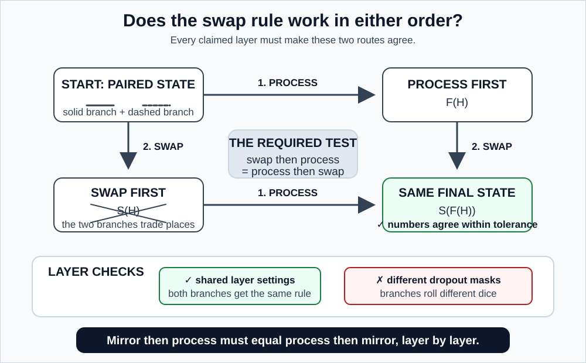
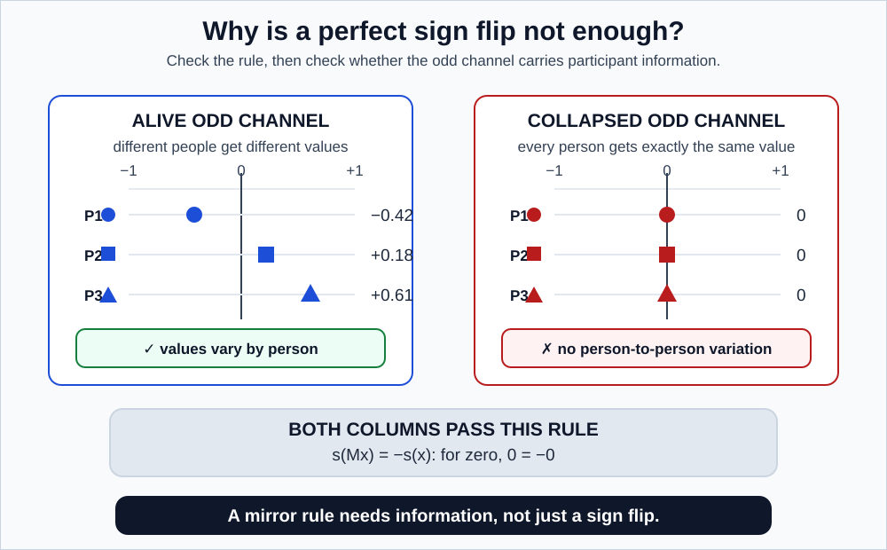
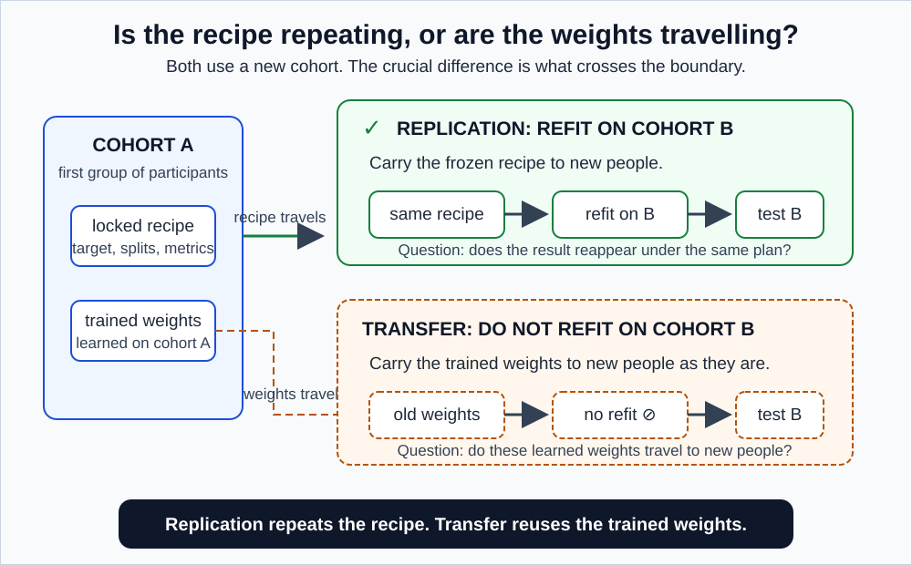

# GaitParity Study methodology

> **Companion proposal:** [README_LONG_TERM.md](./README_LONG_TERM.md)
> **Common rules:** [METHODOLOGY.md](./METHODOLOGY.md)
> **Prototype it builds on:** [METHODOLOGY_SHORT_TERM.md](./METHODOLOGY_SHORT_TERM.md)
> **Lost on a word?** [GLOSSARY.md](./GLOSSARY.md)

This is the maximum-effort protocol for testing reflection-equivariant gait models. It extends the prototype from an exact final-output rule to a **layer-tested encoder**, and adds broad pretraining, matched architecture controls, clinical replication, and a reusable benchmark release.

---

## 1. Keep the claims separate

| ID | Claim | Required evidence |
|---|---|---|
| L1 | The new encoder is genuinely reflection-equivariant | Layerwise commutation tests |
| L2 | Its odd channel is informative rather than collapsed | Variance, rank, decodability, shuffle controls |
| L3 | It improves signed clinical prediction | Participant-held-out stroke force comparison |
| L4 | It adds value beyond paired two-branch fusion | Comparison against `paired_unconstrained_encoder` |
| L5 | It adds value beyond output repair | Primary MAE comparison against `odd_output` |
| L6 | It helps under few labels or damaged input | Label curves and the frozen corruption suite |
| L7 | The architecture effect repeats | Locked Parkinson's disease replication |

**Do not merge these claims.** Exact geometry can coexist with poor prediction. Good prediction can coexist with a non-equivariant encoder. Each row needs its own evidence, and a study that reports one number has thrown away six distinctions.

---

## 2. Freeze the evidence map

Before any clinical result is inspected, version and commit:

- dataset agreements, checksums, participant manifests, and field dictionaries
- the shared joint schema and every dataset adapter
- coordinate-frame and reflection implementations
- force and secondary target definitions, including the audited lower reporting limit $\ell_{\text{LOQ}}$ and natural logarithms
- the AMASS pretraining split
- stroke outer folds, inner folds, and nested label rankings
- the untouched Parkinson's disease replication manifest
- MoVi actor and camera splits
- model architectures, loss terms, seeds, tuning bounds, and compute rules
- layerwise numerical tolerances and representation-health gates
- corruption families and severities
- primary comparisons, uncertainty procedures, and the claims table

### What "locked" actually means

The replication outcome stays unopened until the architecture and stroke analysis are frozen. That is a mechanism, not an honour system:

> The Parkinson's outcome column lives in a separate encrypted archive that nobody on the modelling side holds the key to. The analysis script is committed and timestamped **before** the key is handed over.

Without a mechanism, "we didn't look" is unverifiable, including to yourself.

---

## 3. Audit each data source

### 3.1 GAVD: implementation audit only

Reuse the prototype audit exactly. Do not train or select the main architecture using GAVD's clinical folder labels.

The historical checkpoint may be described only as **transductive**: the model was trained on the same recordings it is now being evaluated on, so a good score does not indicate it works on new people.

### 3.2 AMASS: broad motion pretraining

Map compatible walking and locomotion sequences into the shared schema. **Split by source subject before cutting windows.**

A **window** is a fixed-length chunk cut from a longer recording, here 64 frames or about two seconds. Order matters: split people first, then cut windows. Cutting first and splitting after puts two windows from the same person on opposite sides of the split, which is leakage.

**Exclude every person or source dataset known to overlap a downstream evaluation cohort.** AMASS is an aggregation of many other motion-capture datasets, so it can silently contain the very people who appear in your evaluation cohorts. If it does, your model met your test subjects during pretraining, and every held-out score is contaminated in a way no downstream check will reveal.

Preserve source dataset, subject, motion type, frame rate, and mapping provenance.

AMASS supplies movement diversity. It validates no clinical target.

### 3.3 Stroke: the primary clinical test

Use the force-quality and participant-split rules from the prototype. Kinematics are the input, force is a separate target, and the two never mix.

Healthy participants may support self-supervised adaptation and the even stroke-versus-healthy control. They never receive an invented signed clinical label.

### 3.4 MoVi: calibrated-view geometry

Use walking trials from synchronized stationary cameras with motion capture. Keep all views and motions from one actor on one side of the split.

Test whether the body-frame signed output stays stable across real camera views while anatomical reflection still reverses it. This test includes changes in projection and visibility that a rigid yaw rotation does not, which is exactly why it is a separate test with a separate name.

### 3.5 Parkinson's disease: locked replication

Before inspecting any prediction:

1. audit participant IDs, medication conditions, bilateral force contacts, side metadata, and missingness
2. keep all conditions and visits from one participant together
3. decide whether the force target meets the same coverage and reliability rules used for stroke
4. freeze one participant partition and prohibit any architecture tuning on this cohort

**A note on medication conditions.** Parkinson's participants are typically recorded twice: once on their dopaminergic medication (ON) and once after withholding it (OFF). The two states produce visibly different gait. Analyse them separately, but when averaging across people, count each *person* once, so someone with both an ON and an OFF recording contributes half from each rather than counting double.

### The distinction that gets abused

| Term | What it means | Why it matters |
|---|---|---|
| **Replication** | Fit the same frozen method comparison **within** Parkinson's disease, using its own people | Moderate evidence. The recipe travels. |
| **Transfer** | Apply the frozen stroke-trained encoder and readout **without refitting** | Much stronger evidence. Nothing from the new cohort was used to fit anything. |

Refitting inside the new cohort and calling it transfer overstates the result substantially. Both are run here, both are labelled correctly, and transfer is treated as the separate, harder, secondary analysis it is.

### 3.6 GaitRec and optional cerebral palsy data

Use GaitRec to check that the force target and unilateral metadata behave consistently on a much larger pile of force recordings. Cerebral palsy data enter only when participant identity, shared joints, bilateral measurements, and signed side metadata pass a written compatibility gate. Otherwise, omit the claim rather than weakening it.

---

## 4. Build auditable inputs

Use the shared processing pipeline, with per-dataset tests for joint mappings, anatomical left-right labels, walking direction and body axes, pelvis centring and robust scale, joint cycle resampling, marker-only event detection, visibility masks, and trial and participant aggregation.

### Why a human still has to look

Save visual overlays in native and canonical coordinates for randomly sampled records and for every exclusion class.

Here is the specific reason, and it is not a platitude. **A dataset that is mirrored end to end passes every automated check in section 11 of the shared methodology.** Reflecting twice still recovers the input. Odd targets still negate. Bone lengths are still preserved. Mask counts still match. Every one of those checks is internally consistent under a global mirror, because a global mirror is a valid transformation of a valid body.

The only thing that catches it is a human watching a rendered skeleton and saying "that person is limping on the wrong leg."

---

## 5. Odd and even targets

### Primary odd target

$$
y_{\text{prop}} = \log\left(\frac{J_R}{J_L}\right)
$$

Contacts, integration windows, aggregation, lower-reporting-limit handling, and natural logarithms are exactly as in the [prototype](./METHODOLOGY_SHORT_TERM.md) section 5.1. A force value below the audited reporting limit does not become an extreme ratio through an arbitrary tiny constant.

### Secondary odd targets

- right-minus-left step length
- right-minus-left stance time
- right-minus-left swing time
- documented paretic or more-affected side, analysed separately from movement sign
- controlled one-sided motion attenuation with known sign and size

**On the last one.** Deliberately shrink one leg's motion by 10, 20, and 30 percent, creating a fake asymmetry whose direction and magnitude you chose. Because the right answer is known exactly, this checks whether the method finds a planted signal and gets its sign right. It is a **positive control**, and positive controls are rarer and more informative than negative ones.

Two words to disambiguate: "size" here means how much the motion was shrunk, nothing to do with medication dosing; and this is an **edit we made to the data**, not a clinical intervention. It is not a simulation of disease.

### Even controls

- average walking speed
- total bilateral propulsion
- overall movement amplitude
- stroke versus healthy status

When parity is part of the test, fit even targets through an exact even readout:

$$
s_{\text{even}}(x) = \frac{q(E(x)) + q(E(Mx))}{2}
$$

**Proof that this is even**, matching the odd proof elsewhere:

$$
s_{\text{even}}(Mx) = \frac{q(Mx) + q(M(Mx))}{2} = \frac{q(Mx) + q(x)}{2} = s_{\text{even}}(x)
$$

Numerically, with the running example $q(x) = +0.7$ and $q(Mx) = +0.1$: $s_{\text{even}} = 0.4$ whichever input you feed it. Compare the odd version, which gives $+0.3$ and $-0.3$.

---

## 6. The standard JEPA baseline

Use a pure skeleton JEPA that hides some joints at some time steps and predicts the **encoder's own compact description** of the hidden part, not the raw coordinates. No human labels are involved.

Match the equivariant model on every axis below. Each is a way a model can win for reasons that have nothing to do with its architecture.

| Matched quantity | What it is, and why it matters |
|---|---|
| Input windows and training masks | Same data, hidden the same way |
| Embedding **width** | How many numbers are in the representation, e.g. 256 |
| Effective **depth** | How many processing layers, e.g. 12. Called *effective* because the equivariant model carries two branches through the same 12 layers. We count that as 12, not 24, and state the choice explicitly since it affects the parameter match. |
| Optimizer and learning-rate schedule | The algorithm that adjusts the weights, and how fast it does so over training |
| Update count and stopping rule | What makes you decide training is done. Matched, because a model given more training will usually win regardless of architecture. |
| Augmentation exposure | Same transformations applied to inputs |
| Target-encoder update | See below |
| Regularization coefficients | Same penalties discouraging overfitting |
| Paired random seeds | Run 7 against run 7, not best against best |

**The target encoder.** A JEPA runs two copies of the encoder: a *student* trained normally, and a *teacher* whose weights are a slowly-drifting average of the student's, used to produce the prediction targets. The teacher exists so the student cannot trivially satisfy its objective. In the equivariant model, the teacher must be mirrored consistently with the student, or the prediction targets themselves break the symmetry the architecture claims to have.

The standard model receives as-recorded and mirrored windows during pretraining as ordinary examples, but nothing in its wiring links a clip to its mirror. They are just two more items in the pile. The equivariant model always processes the two together as a linked pair and never lets them come apart.

---

## 7. The reflection-equivariant JEPA

### 7.1 Lift the input

For each input, form a two-branch reflection **orbit**:

$$
H^0(x) = [\phi(x), \phi(Mx)]
$$

$\phi$ is the first step that turns raw coordinates into the model's internal number format. The superscript $0$ means "before any processing layers have run."

An *orbit* is everything you can reach by applying the available operations. Since the only operations are "do nothing" and "mirror," the orbit of $x$ is exactly the pair $\{x, Mx\}$. Two items, no more, ever. This is what makes the whole construction tractable.

Now feed in a mirrored input:

$$
H^0(Mx) = [\phi(Mx), \phi(M(Mx))] = [\phi(Mx), \phi(x)]
$$

The second slot collapses because mirroring twice returns the original. So the two branches simply **swap**. That is the entire mechanism.

### 7.2 Use a real paired encoder, not two silent copies

Running the same ordinary encoder independently on both branches would already satisfy the swap rule. It is a useful baseline, but it is not enough to claim that the *interior* is organized around parity: it is just two independent calculations followed by subtraction.

The full model must therefore include at least one prespecified **symmetric cross-branch interaction**. In plain language, each branch may use information from the other, but the same operation runs with the branches reversed. One valid pattern is a shared block $g$ that takes the current branch and the ordered pair of both branches: $[g(a; a,b), g(b; b,a)]$. Swap $a$ and $b$, and the outputs swap too. The exact layer, token set, and parameter count are frozen before training.

The required architecture control is `paired_unconstrained_encoder`: it uses the same two branches, cross-branch interactions, depth, masks, parameter count, training exposure, tuning budget, paired seeds, and measured compute, but removes the branch-swap weight tying. It also uses the exact same final odd-output wrapper described below. This answers the objection that any gain came from two-branch fusion or a different output head rather than equivariance itself.

### 7.3 Preserve the group action

For every layer $F_\ell$, require:

$$
F_\ell(SH) = S\,F_\ell(H)
$$

where $S$ swaps the two branches. In words: **swap then process must equal process then swap.**

*Figure 1. The commutation square. Both routes from the top-left to the bottom-right corner must arrive at the same numbers, within a frozen tolerance, in the precision actually used for training.*

**A two-element example, so you can see a violation.** Take $H = [3, 5]$.

| Layer | Process then swap | Swap then process | Verdict |
|---|---|---|---|
| Double each branch | $[6,10] \to [10,6]$ | $[5,3] \to [10,6]$ | Passes |
| Add 1 to the **first** branch only | $[4,5] \to [5,4]$ | $[5,3] \to [6,3]$ | **Fails** |

Note how the failure behaves: it produces perfectly plausible numbers, no error, no crash, no warning. That is why this has to be tested rather than reasoned about.

### The layer audit, with what breaks

Every entry below is a real place the guarantee dies quietly.

| Component | What breaks it |
|---|---|
| Coordinate and joint embeddings | A left-right joint ordering that is not consistent with the swap |
| Time and joint positional information | Position encodings tied to array index rather than to anatomy |
| Attention queries, keys, values, masks | Any attention pattern computed from one branch and applied to both |
| Normalization statistics | Branch-specific or otherwise asymmetric statistics. Symmetric statistics across both branches can be valid, but the commutation test, not intuition, decides. |
| Nonlinearities | Rarely a problem, since they act elementwise. Verify anyway. |
| Residual paths | A skip connection that bypasses the paired structure |
| Stochastic depth and dropout | Training randomly skips layers or zeroes features. If the two branches roll different dice, they stop matching. Use the same random draw in both branches. |
| JEPA masking and target prediction | Independently sampled training masks per branch |
| Target-encoder moving average | The teacher drifting out of sync with the student's symmetry |
| Mixed-precision kernels | 16-bit addition is not perfectly associative, so $a + b$ and $b + a$ can differ in the last bit |

### 7.4 Read out the parity channels

Keep the pair alive through the final encoder layer, then form:

$$
h_{\text{even}} = \frac{h_{\text{orig}} + h_{\text{mirr}}}{2}, \qquad h_{\text{odd}} = \frac{h_{\text{orig}} - h_{\text{mirr}}}{2}
$$

where $h_{\text{orig}}$ is the branch carrying the body as recorded and $h_{\text{mirr}}$ the branch carrying the mirrored body.

Use a **zero-bias** signed readout on $h_{\text{odd}}$.

Here the bias genuinely must be zero, unlike in the prototype where it cancelled. The readout is applied *directly* to $h_{\text{odd}}$ rather than to a difference of two predictions, so a bias $c$ would give $s(Mx) = -s(x) + 2c$, which is not odd unless $c = 0$. A single default argument in a linear layer destroys the guarantee the whole architecture exists to provide.

**The matched architecture comparison uses one shared final rule.** For both `equivariant_encoder` and `paired_unconstrained_encoder`, let $d(H(x))$ be the raw scalar produced from the paired state. The reported primary score is:

$$
s_{\text{shared}}(x) = \frac{d(H(x)) - d(H(Mx))}{2}
$$

This outer construction makes the final answer exactly odd for both models, even though the paired-unconstrained interior is not equivariant. Both systems therefore make the same two paired-state forward passes for every scored example. The direct zero-bias readout from $h_{\text{odd}}$ remains a useful equivariant-encoder ablation and health check, but it is not allowed to give the equivariant model an easier output head in the co-primary comparison.

---

## 8. Test equivariance, never assume it

Before any downstream fitting, generate random and real inputs and compare both sides of every layer's commutation equation. Test in:

- float32 **and** the mixed precision used in training. float32 is the standard 32-bit format, accurate to about 7 significant digits; training often uses a 16-bit format for speed, accurate to about 3. An equality that holds cleanly at 7 digits can fail at 3, so test in the precision you actually train in.
- the presence of missing-joint masks
- different sequence lengths, where supported
- batched and single-example modes
- training and evaluation modes
- deterministic paired dropout masks
- after a checkpoint save and reload

### Tolerances

Freeze a single `allclose` rule before testing: $|a-b| \leq \mathrm{atol} + \mathrm{rtol}|b|$. Calibrate `atol` and `rtol` on non-clinical test inputs for each precision, then lock them before clinical data are opened. A float32 test may use much smaller tolerances than a mixed-precision test. The exact values, maximum observed mismatch, and precision are released with every claim.

Tolerances must loosen with depth, because each layer's rounding error feeds into the next. Never require exact equality; floating-point arithmetic does not provide it.

**If a layer fails, the model is not equivariant until it is fixed.** If it cannot be fixed, the system is renamed **parity-regularized**.

Those two words mean different things and support different claims:

- **Equivariant**: the equality holds exactly, to a stated tolerance, at every layer, and you have tested it.
- **Parity-regularized**: you added a penalty encouraging the equality, and it approximately holds.

The second is a perfectly reasonable thing to build. It is just not the first, in the same way that "nearly right-angled" is not "right-angled."

---

## 9. Prove the representation is not trivially correct

*Figure 2. Both columns pass the symmetry test. Only one carries information. The symmetry test alone cannot tell them apart.*

An all-zero odd channel flips sign perfectly, because $0 = -0$. It is also completely useless. **Collapse** (the model discovering it can satisfy its own training objective by producing nearly the same output for every input) is a normal failure mode of self-supervised learning, which is why this is a gate rather than an accusation.

Measure:

| Diagnostic | What it means in plain terms |
|---|---|
| Per-dimension variance | Is each feature actually moving, or is it a constant? |
| Covariance **effective rank** | Roughly, how many genuinely independent directions do these 256 features use? If all 256 move in lockstep, the effective rank is about 1 and you really have one feature wearing 256 hats. This is the primary anti-collapse number. |
| Mean pairwise cosine similarity | Do different inputs get different representations, or does everything look alike? |
| Odd-channel **energy** by participant | Energy is average squared size. An odd channel with near-zero energy is the all-zeros failure. |
| Even-to-odd energy ratio | Has one channel absorbed everything? |
| Masked JEPA prediction quality | Did pretraining actually learn anything? |
| Decodability of odd, even, and nuisance targets | What information is accessible, including information you did not want |
| Response to an explicit left-right label shuffle | Should destroy signed recovery |
| Response to controlled unilateral attenuation | Should move in the right direction by roughly the right amount |

Set health gates from standard-model distributions and training-only data, before any clinical outcome is opened.

---

## 10. Compare a minimal, stable model set

### Primary architecture models

1. `standard_one_view`
2. `two_view_free`
3. `odd_output`
4. `paired_unconstrained_encoder`
5. `equivariant_encoder`

### Explanatory models

6. `sign_augmented`
7. A structured paired-joint head: a readout that explicitly pairs the left-knee features with the right-knee features and differences them. Labelled an ablation, not a guarantee, because it constrains the readout without constraining the encoder.
8. MotionBERT and ST-GCN-family encoders. These are two standard published skeleton architectures (ST-GCN stands for spatio-temporal graph convolutional network). Including them checks that our baseline is a genuine competitor and not a strawman we built ourselves.
9. `raw_kinematics`
10. `random_encoder`, `side_agnostic`, `nuisance_only`, even-only, side-shuffled, and target-permuted controls

**The standard, paired-unconstrained, and equivariant JEPAs each receive separately matched pretraining.** The output variants reuse the exact standard checkpoint for each seed. This prevents pretraining luck from being reported as a readout effect: two models can differ purely because one got a luckier random starting point.

### The two comparisons that matter

The first **co-primary mechanism** comparison, which uses the shared primary MAE endpoint:

> (participant-orbit-averaged MAE of `equivariant_encoder`) $-$ (participant-orbit-averaged MAE of `odd_output`)

The second **co-primary architecture-isolation** comparison:

> (participant-orbit-averaged MAE of `equivariant_encoder`) $-$ (participant-orbit-averaged MAE of `paired_unconstrained_encoder`)

The protective two-input comparison:

> (participant-orbit-averaged MAE of `equivariant_encoder`) $-$ (participant-orbit-averaged MAE of `two_view_free`)

Negative means the equivariant model made smaller errors. The first comparison answers whether organizing the interior beats output repair; the second asks whether the gain survives an equally capable paired encoder without equivariant tying. Neither can be replaced by a favourable point estimate on a secondary metric.

---

## 11. Match exposure and compute

For standard, paired-unconstrained, and equivariant pretraining, match participants and source motions, as-recorded and mirrored windows, visible and masked tokens, optimizer updates, hyperparameter trials, paired seeds, trainable parameter count, and the exact number of paired-state forward passes within a prespecified tolerance.

### Why you cannot match everything at once

This is a real constraint, not a caveat, and the reason is worth stating.

The equivariant model runs every input through **twice**, once as recorded and once mirrored. So:

- Give both models the same number of training examples, and the equivariant one used roughly double the GPU hours.
- Give them the same GPU hours, and the equivariant one saw half the examples.

You can match one or the other. Never both.

**Report theoretical FLOPs** (arithmetic operations counted from the architecture) **and** measured throughput, wall time, peak memory, and inference cost. The first is reproducible; the second is what actually happens; they can disagree by a large factor.

If exposure-matching and compute-matching answer subtly different questions, report both answers and say which question each one answers. **Never imply a matching that was not achieved.**

---

## 12. Train without clinical leakage

1. Pretrain standard, paired-unconstrained, and equivariant models on participant-disjoint non-clinical motion.
2. Freeze checkpoints for each seed.
3. Within each stroke outer fold, permit only self-supervised adaptation on outer-training participants.
4. Build each force target and skeleton feature from the same eligible walking bout and condition before frozen participant-level aggregation. Keep different speeds, sessions, and Parkinson's ON/OFF medication conditions separate until that step.
5. Fit supervised readouts on participant-level features from labelled outer-training people.
6. Select settings with grouped inner folds.
7. Produce exactly one prediction per outer-test participant.

Clinical force, affected-side labels, and clinical scores never enter generic pretraining.

---

## 13. Evaluate sample efficiency

Use the same nested 4, 8, 16, and all-participant prefixes as the prototype, built the same way: fix a random ordering of training participants and take prefixes of it, so the 4 are inside the 8 which are inside the 16. Every model receives every prefix identically.

Repeat with several fixed, side- and severity-stratified participant orderings to reduce dependence on one small labelled subset, but average those repeats **within participant** before drawing conclusions. These are not extra participants.

Call this **label efficiency conditional on access to the outer-training unlabelled skeletons**. The encoder is allowed self-supervised adaptation on those skeletons, so the experiment asks how many *force labels* are needed after unlabelled movement is available. It does not ask how few total recordings are needed.

Report learning curves, normalized AULC, and full-label error.

### What supports the label-efficiency claim, and what does not

The claim is supported by **paired within-participant comparisons**: for participant 7, was `equivariant_encoder` better or worse than `odd_output`? Those 40 within-person comparisons are the evidence.

Re-running with a different random subset gives you a better estimate **for the same 40 people**. It does not give you more people, and treating subset repeats as extra participants inflates confidence without adding information.

---

## 14. Evaluate geometry and robustness

### Anatomical reflection

Report output oddness for every signed model. Report layerwise commutation **only for the equivariant encoder**. The paired-unconstrained encoder has paired branches, but it is deliberately not required to commute with the swap, so a failed commutation check is expected rather than diagnostic.

### Coordinate-frame sensitivity

Prespecified rigid yaw rotations without changing anatomical labels. Call this a frame test.

### Real view sensitivity

MoVi calibrated views with actor-held-out splits. This includes projection and visibility changes that rigid yaw does not, so it is a different claim with a different name.

### Corruption

Use the prototype's frozen coordinate, missingness, and temporal families with the same severities, and the exact same corrupted arrays across models.

Add **joint-schema reduction**: progressively drop joints from the bottom up, first toes, then heels, then ankles, simulating a cheaper or lower-quality capture setup. This measures how far the input can degrade before the signal dies, which is the practically relevant question for anyone who wants to run this outside a laboratory.

Report clean error and added error by severity. Keep destructive left-right identity corruption **outside** the averaged robustness summary, for the reason given in the prototype: shrugging off a left-right swap is a failure, not robustness.

---

## 15. The primary stroke analysis

For each participant, obtain seed-averaged out-of-fold predictions at every retained label budget. Score each original walk and its synthetic mirror equally, then average to one participant-orbit loss. At the largest label budget, the two co-primary endpoints are the force-target MAE differences against `odd_output` and against `paired_unconstrained_encoder`, interpreted with simultaneous 97.5 percent intervals and the shared $\delta_{\text{MAE}}$ rule. Tier 5 requires a practically meaningful advantage on both. Report normalized MAE, untruncated $R^2$, calibration slope and bias, normalized error AULC, frame and real-view drift, corruption degradation, and a direct comparison against raw kinematics as secondary results.

Estimate paired differences by resampling whole participants. Report model-seed dispersion and repeated-partition sensitivity.

**Avoid a single conjunctive pass rule.** Do not require every test to pass for the study to count. Report which tiers of the claim ladder were reached and which were not.

---

## 16. Locked replication and transfer

*Figure 3. Two different operations that get called by the same name. Only the second shows that the model itself travels.*

Open Parkinson's disease model outcomes only after stroke decisions are frozen.

**Replication:** fit the same prespecified readout comparison within Parkinson's disease, using one frozen participant split and no architecture tuning. Keep ON and OFF medication records separate, but give each participant total weight one.

**Transfer:** apply the frozen stroke-trained representation and readout directly to compatible Parkinson's records, with no refitting. Any target recalibration must be declared and evaluated separately.

### The sentence that must not be written

If the estimated benefit is $+0.05$ but the 95 percent interval runs from $-0.02$ to $+0.12$, then "no benefit at all" remains fully consistent with what you saw.

You may say the direction matched. You may call it **directionally consistent**. You may not say it replicated.

If force coverage fails, the force replication is **absent**, not replaced with a different analysis chosen after seeing model results.

---

## 17. Statistical discipline

- Participants are the independent unit. Always.
- Report effect sizes and intervals for every main comparison.
- **Correct for multiple comparisons** across the small prespecified family of secondary tests. If you run 20 independent tests at the 5 percent level, you expect one to come out "significant" by pure luck even when nothing is happening. Correcting raises the bar so that does not occur. Fix the list of secondary tests in advance so the count is fixed.
- Keep exploratory analyses clearly labelled as exploratory.
- **Never use seed count as sample size.** Forty people and five seeds is a sample size of forty.
- **Never interpret nonsignificance as equivalence.** "We could not tell them apart" is not "they are the same," in the same way that a blurry photo of two people is not evidence they are twins.
- To claim equivalence, state a margin first, for example "within 0.02 normalized error," then test whether the whole interval fits inside that band. Without a stated margin, "equally good" means nothing.
- **Report sensitivity to participant partitions**, because outer training sets overlap. With 5 folds, any two training sets share three quarters of their participants. The five fold results are heavily correlated. They are not five independent experiments, and their agreement is not fivefold confirmation.
- Define the near-zero sign-scoring zone before any inference.
- Justify any smallest effect of interest from target reliability, prior evidence, or a clearly labelled engineering criterion.

---

## 18. Adversarial checks

Before writing conclusions, have an independent reviewer (a colleague who did not build the pipeline, or an automated adversarial checking pass) hunt for:

- participant or source leakage
- target information hiding in preprocessing
- force channels accidentally reaching the encoder
- an incorrect left-right joint mapping
- camera-invariance claims resting only on rigid rotation
- encoder-equivariance claims resting only on the final output
- raw coordinates described as a null or a ceiling
- folds, trials, or seeds counted as extra participants
- post hoc changes to targets, thresholds, or cohorts
- a transfer claim resting on within-cohort refitting

Resolve every finding, or state it as a limitation. There is no third option.

---

## 19. Completion criteria

The study is complete when:

- shared adapters and reflection tests pass
- the equivariant encoder passes every claimed layer test
- standard, paired-unconstrained, and equivariant representations pass their health audits
- matched pretraining and compute records are complete
- participant-held-out stroke comparisons are frozen and reproduced
- low-label, frame, view, corruption, and raw-feature comparisons are reported
- the Parkinson's gate and locked replication are resolved
- participant-level artifacts can recreate every table and figure
- conclusions follow the tiered claims table

**Extra compute may add prespecified seeds, partitions, or robustness checks. It may not be used to search for a favourable story after test results are known.**

---

## 20. Release package

- the `GaitParity` joint schema and dataset adapters
- the anatomical reflection library
- the odd and even target registry
- the layerwise commutation test suite
- participant-safe folds and nested label rankings
- the corruption generator and manifests
- standard, paired-unconstrained, and equivariant model configurations
- compute accounting, and **carbon accounting** (an estimate of the emissions from the GPU hours used) where available
- participant-level out-of-fold predictions
- the locked replication script
- statistical reproduction notebooks
- **model and data cards**: short standard documents stating what the model or dataset is, what it was built from, and, critically here, what it must not be used for

Participant-level out-of-fold predictions are the highest-value item. With them, anyone can recompute every metric, try a different statistic, or find an error, without needing the raw clinical data or a GPU.
