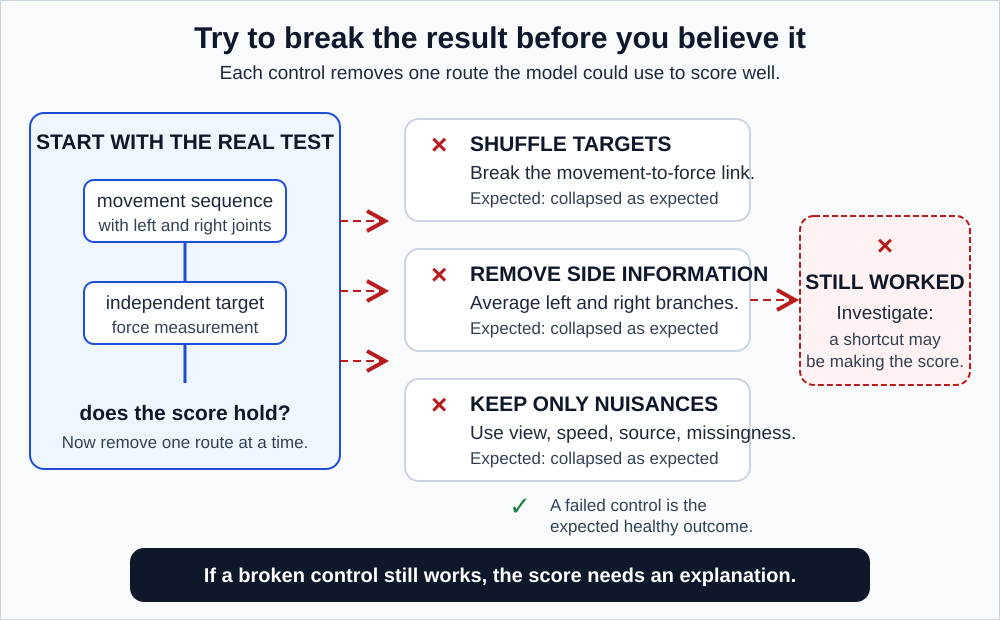

# GaitParity Prototype methodology

> **Companion proposal:** [README_SHORT_TERM.md](./README_SHORT_TERM.md)
> **Common rules:** [METHODOLOGY.md](./METHODOLOGY.md)
> **Lost on a word?** [GLOSSARY.md](./GLOSSARY.md)
> **Concepts from scratch:** [README.md](./README.md)

This protocol is complete when it produces a trustworthy **go, revise, or stop** decision about building a reflection-equivariant encoder. It ends on evidence, not on a date. Rapid implementation and parallel compute shorten the model runs; they do not shorten a data audit, and they cannot improve a noisy measurement.

Every rule below is written as **the rule**, then **why**, then **what breaks without it**.

---

## 1. The claims being tested

| ID | Claim | Evidence that would settle it |
|---|---|---|
| P1 | A frozen skeleton representation contains signed information about an independently measured quantity | Participant-held-out force prediction |
| P2 | Being able to decode the signal and behaving correctly under a mirror are separate properties | Prediction accuracy plus a separate oddness measurement |
| P3 | An exact odd output beats a free two-branch output | Paired held-out comparison on the same people |
| P4 | Any advantage is strongest, or at least survives, with few labels and damaged input | Nested label budgets plus corruption tests |
| P5 | Geometry can improve without prediction improving | Report geometry and biomechanics separately, never merged |

**Decodability** (in P2) asks one narrow thing: can a simple readout pull this quantity out of the representation at all? It is a yes-or-no about whether the information is *present and accessible*. It says nothing about whether the geometry is clean. P2 exists because these two properties genuinely come apart, and conflating them is the most common way this kind of work overstates itself.

**The primary contrast** is stated once, fully, so no one has to reconstruct the sign convention later:

> (participant-orbit-averaged force-target MAE of `odd_output`) **minus** (participant-orbit-averaged force-target MAE of `two_view_free`), at the largest prespecified label budget

A **negative** number means `odd_output` made smaller errors, which favours the exact rule.

### A naming warning

`two_view_free` uses "view" to mean **original versus mirrored**, not camera angle. Everywhere else in this project "view" means a camera position. The name is kept for continuity with the shared model table, but read it as **two branches**: the as-recorded branch and the mirrored branch. Confusing these two senses is exactly the error the whole project is built to avoid.

---

## 2. Freeze before fitting anything

Save one versioned protocol record containing:

- dataset versions, checksums, licences, and anonymous participant IDs
- inclusion and exclusion rules
- joint mappings and coordinate transforms
- the odd and even target definitions, including the audited force reporting limit $\ell_{\text{LOQ}}$ and natural logarithms throughout
- the force-quality gate
- participant folds and nested label rankings
- model names, seeds, tuning budget, and the compute-matching rule
- the primary outcome and the uncertainty procedure
- corruption settings and severities
- a table mapping each possible outcome to the conclusion it permits

A **checksum** is a short fingerprint of a file that changes if the file changes, so you can prove later that you analysed the data you said you did. A **manifest** is the explicit list of exactly which recordings were used.

### Why freeze, in plain terms

**Do not change these items after inspecting outer-test comparisons.**

Not because changing them would be dishonest, but because if you are allowed to adjust the analysis after seeing the score, you will always be able to find *some* defensible version that wins. That is not a character flaw; it is what happens to everyone who leaves themselves the option. Freezing removes the option.

Correcting a genuine code defect is permitted and expected. When you do, record the defect, which runs it affected, and why they were rerun.

### Confirmatory versus exploratory

These two words appear throughout and they are not decoration.

- **Confirmatory** means you committed to the exact test in advance. The result counts as evidence.
- **Exploratory** means you are looking around. The result generates hypotheses and does not count as evidence.

The same number means different things depending on which one it was. An analysis that started confirmatory and got adjusted mid-flight is exploratory, and saying so is the whole point.

---

## 3. Audit the datasets

### 3.1 GAVD: implementation audit only

GAVD verifies the pipeline and the historical representation. It does not test the method.

1. Point the pipeline at the real extracted-pose artifact root, not the synthetic one. Fake data with known answers is fine for checking that the code runs end to end and that the pieces connect, but every output from it must be visibly marked **SYNTHETIC, NOT A RESULT**.
2. Use the canonical extraction route for the primary audit table.
3. Show the wider local set only as a provenance-labelled sensitivity analysis. A **sensitivity analysis** redoes the work a different reasonable way and checks whether the conclusion survives.
4. Group every record by source video. Clips cut from one YouTube video are not independent observations.
5. **The historical files stored the target as left minus right.** Do not rewrite them. Multiply by $-1$ at display time so every new report follows the project-wide right-minus-left convention. Getting this backwards inverts every sign in the audit while leaving all other checks passing.
6. Report MAE, untruncated $R^2$, oddness error, mirror slope and intercept, and sign behaviour outside the near-zero zone.
7. Include direct-coordinate, random-encoder, side-agnostic, nuisance-only, side-shuffled, and target-permuted controls.

**Mirror slope and intercept**: plot $s(Mx)$ against $s(x)$ for every trial and fit a line. A perfectly odd model gives slope exactly $-1$ and intercept exactly $0$. A slope of $-0.4$ means the model only partly honours the mirror. A nonzero intercept means it has a constant left-or-right preference baked in, which is worth knowing about separately.

**Two controls that sound alike and are not:**

- `side_agnostic` **removes** side information: predict from $[E(x) + E(Mx)]/2$ only. That quantity is unchanged by mirroring, so it cannot make a correct paired signed map. An originals-only correlation is a shortcut warning, not a reason to call the control impossible.
- `side-shuffled` **randomizes** which side is which before encoding. The signal should also die, but by a different route, catching the case where the model reads side identity from something other than the paired joint structure.

The GAVD question is narrow: does a historically exposed representation retain its own coordinate-derived signed signal, and does its output behave sensibly under a mirror? That is all.

### 3.2 Stroke force audit

For each participant:

1. verify participant and paretic-side fields
2. inspect lower-body marker coverage
3. verify force-plate axes and sign
4. assign each clean contact to the correct limb
5. require at least two clean contacts from each limb
6. compute two separate target estimates from alternating contact sets
7. record every exclusion and its reason

**On step 3.** Different laboratories define $+x$ as forward or backward, and different export formats report the force *on* the plate or the force *from* the plate. Getting either wrong reverses every answer in the study while every other check continues to pass. Check it explicitly, on a trial where you know which way the person walked.

**A contact** is one footfall landing cleanly on a single force plate with a single foot. Partial contacts and two-feet-on-one-plate trials are excluded.

**On step 6, and why it matters most.** Compute the target twice for each person, once from their odd-numbered footfalls and once from their even-numbered ones. If a person's own steps disagree wildly with each other, the target is mostly noise, and no model can predict a quantity that cannot predict itself. Freeze the exact agreement statistic and its threshold before any model result exists.

Continue with confirmatory force prediction only when at least 30 stroke participants remain **after** the reporting-limit screen, have at least four clean contacts per side, and pass the shared split-half reliability gate: the frozen ICC and disagreement thresholds in [METHODOLOGY.md](./METHODOLOGY.md) section 6. Thirty is a **feasibility floor**, the point below which the analysis is not worth running. It is not a statement about **statistical power**, which is the chance a study would detect a real effect of a given size if one exists.

**If the gate fails,** force becomes exploratory. A paretic-side fallback is permitted only as a clearly renamed side-classification prototype, and only when each fold and each retained label subset contains at least two people from each side class. Two is a minimum *feasibility* requirement: with fewer, the fold contains no contrast and the fit is undefined. It is emphatically not a claim that two is enough for a reliable estimate.

### 3.3 Optional MoVi gate

Use MoVi only when actor IDs, licences, walking trials, calibrated stationary views, and the shared joint mapping are all working **before** the main comparison is interpreted. Keep every view and motion from one actor on one side of the split. If any of that is not ready, omit the external view claim entirely rather than weakening it.

---

## 4. Prepare the skeletons

Use the shared schema and preprocessing from [METHODOLOGY.md](./METHODOLOGY.md) section 4. Then:

1. **Detect gait events from markers alone.** *Gait events* are the two moments bracketing each footfall: heel strike (the foot lands) and toe off (the foot leaves). Detect them from marker positions. **The force signal must not be used here**, because force is the answer, and using it to build the input leaks the answer into the input.
2. Use force events only to set the integration window for the force target itself.
3. Resample the full gait cycle jointly, never per leg. Section 4 of the shared methodology explains why this one is fatal.
4. Divide the cycle into eight ordered **phase bins**: slices covering 0 to 12.5 percent of the cycle, 12.5 to 25 percent, and so on. Summarize within each slice.
5. Retain visibility masks and original timing metadata.
6. Reject technically invalid records **without looking at targets**.

**Why eight bins.** Eight is enough to distinguish "the left-right difference happens at push-off" from "it happens at foot contact", without exploding the feature count. A single mean and standard deviation over the whole sequence discards *when* in the cycle the difference occurred, which is often the informative part, so that version is reported only as a stripped-down comparison and never as the main feature set.

---

## 5. Construct the targets

### 5.1 The force target

For each clean contact, integrate only the **positive** forward ground-reaction force.

Concretely: while the foot is on the ground, the fore-aft force starts *negative*, braking the body, and then turns *positive* as the person pushes off. Integrate only the positive half. That shaded area is the propulsive impulse for that contact, in newton-seconds. Impulse is force integrated over time, the $J = \int F\,dt$ from physics class.

Average the valid contacts within each side to get $J_R$ and $J_L$. Before model fitting, determine the force plate's lower limit of quantification, $\ell_{\text{LOQ}}$, from its calibration and baseline noise. For the confirmatory continuous target, both side averages must clear that limit. Then:

$$
y_{\text{prop}} = \log\left(\frac{J_R}{J_L}\right)
$$

With the project's running example, $J_R = 8$ and $J_L = 12$ newton-seconds:

$$
y_{\text{prop}} = \ln\left(\frac{8}{12}\right) = \ln(0.667) = -0.41
$$

Mirror the sides and $\ln(12/8) = \ln(1.5) = +0.41$. Same size, opposite sign.

**Logarithms are natural throughout** (base $e$). This matters: using base 10 instead changes every reported number by a factor of 2.303, and a mixed codebase produces two incompatible sets of results that both look plausible.

**What if one side is below the reporting limit?** Do not hide it behind an arbitrary tiny constant. Censor that participant from the confirmatory continuous-force result, report the count, and repeat a prespecified sensitivity analysis with half and twice $\ell_{\text{LOQ}}$. If the conclusion changes, call the result fragile. This is stricter than adding $10^{-6}$ to the denominator, but it makes the reported target a quantity the instrument could actually resolve.

**Never feed the encoder** force, EMG (electromyography, the electrical activity recorded from muscles), paretic side, clinical scores, or any other kinetic variable.

That last word matters: **kinematics** describes motion (positions, angles, speeds); **kinetics** describes the forces that caused it. This project feeds kinematics in and predicts kinetics out. Mixing them up is exactly how force information leaks into the input.

### 5.2 Secondary targets

- right-minus-left step length
- right-minus-left stance time
- right-minus-left swing time
- documented paretic side, kept conceptually separate from movement sign
- stroke versus healthy, as an **even** control

**Stance** is the roughly 60 percent of each cycle when a foot is on the ground; **swing** is the roughly 40 percent it is in the air. Because 60 plus 60 exceeds 100, there are two brief windows per cycle when both feet are down.

**Why stroke-versus-healthy is an even control:** mirroring a stroke survivor's skeleton does not make them healthy. The diagnosis is unchanged by which side is which. So this target must come out identical before and after mirroring, which makes it a clean test that the even machinery works.

Healthy participants never receive invented left- or right-paretic labels.

---

## 6. Build the frozen representation

Use one compact skeleton JEPA trained without condition, force, paretic-side, or any other clinical label.

Within each outer fold, the encoder is allowed one round of further **self-supervised adaptation** (predict-the-hidden-part training, no labels involved) using **outer-training participants only**. Then it is frozen. It stays frozen for everything after that point.

This resolves an apparent contradiction worth naming: the encoder is described as frozen, and also as adapting. The adaptation happens first, on training people only; the freeze happens second; every comparison happens third.

Then, for each participant and each model seed:

1. encode every eligible cycle and its anatomical reflection
2. aggregate cycle features to trial features with a **componentwise median** (take the median of each of the 256 features separately across that trial's cycles, median rather than mean so that one badly-tracked stride cannot drag the whole summary)
3. pair each trial feature only with the force target built from the same eligible walking bout and condition, then aggregate matched trial pairs to one as-recorded and one mirrored participant feature vector using frozen equal trial weights
4. save those features **before** fitting any supervised readout

Never pool across speed conditions, sessions, or treatment conditions before that matching step. Walking speed may be part of why force differs, not a nuisance automatically removed. A speed-stratified or speed-adjusted analysis is a prespecified secondary analysis. Step 4 is what makes a four-person label budget mean four people rather than four people multiplied by their strides.

---

## 7. Fit the model comparisons

Identical participants, identical label subsets, identical outer folds, identical tuning opportunities, paired seeds. Every model, every time.

Read $(x, y)$ throughout as "this input, with this correct answer."

### `standard_one_view`

An ordinary regularized linear readout of $E(x)$.

### `sign_augmented`

The same model family, trained on both $(x, y)$ and $(Mx, -y)$. Every walk is shown twice: as recorded with answer $y$, and mirrored with answer $-y$. This *encourages* odd behaviour without guaranteeing it.

### `two_view_free`

An unconstrained regularized readout of $E(x)$ and $E(Mx)$ concatenated:

$$
s_{\text{free}}(x) = a^\top E(x) + b^\top E(Mx) + c
$$

Here $a$ and $b$ are each lists of 256 weights. The notation $a^\top E(x)$ means: multiply each of the 256 features by its weight and add them all up, giving one number. $c$ is a constant added at the end.

### `odd_output`

Use a shared scalar head $q(h) = w^\top h$ and train through the final expression:

$$
s_{\text{odd}}(x) = \frac{q(E(x)) - q(E(Mx))}{2}
$$

**Optimize that displayed expression directly.** Do not fit a one-branch head and wrap it afterward.

The difference is real and easy to get wrong. *Wrong:* train $q$ to predict $y$ from $E(x)$, then afterwards wrap it as $[q(E(x)) - q(E(Mx))]/2$. *Right:* build the whole expression first, and let gradient descent tune $w$ against the **final** number. In the wrong version, $w$ was chosen to make the one-branch prediction good, and a difference of two such predictions is not what it was optimized for.

**On the bias term.** A bias would cancel here anyway: $[(w^\top h_e + c) - (w^\top h_m + c)]/2 = w^\top(h_e - h_m)/2$. We still set it to zero so this head is literally identical to the one used in the full study, where the bias does *not* cancel because the readout is applied directly to an odd channel rather than to a difference.

### An honest note on parameter matching

`two_view_free` and `odd_output` **cannot** have equal parameter counts. With $d = 256$:

| Model | Parameters |
|---|---|
| `two_view_free` | $a$, $b$, and $c$: $2d + 1 = 513$ |
| `odd_output` | a single shared $w$: $d = 256$ |

The gap is structural. The constraint is precisely what removes the parameters, so removing the gap would remove the treatment. Report both counts, and note that the comparison is therefore biased **in favour of** `two_view_free`. That makes an `odd_output` win harder to earn, which is the right direction for a bias to run.

### References and controls

Fit `raw_kinematics` (hand-computed numbers straight from the coordinates: step lengths, stance times, joint ranges, computed within each of the eight phase bins so that *when* something happened is preserved), `random_encoder`, `side_agnostic`, and `nuisance_only`.

For `side_agnostic`, predict from $[E(x) + E(Mx)]/2$. That quantity is provably unchanged by mirroring, so it cannot give a correct paired signed prediction: it returns the same score for $x$ and $Mx$ even though their targets are $y$ and $-y$. Score both members of each pair. On the recorded orientation alone, it may still correlate with a signed target through site, severity, speed, or side-prevalence imbalance. That is a shortcut warning to investigate, not automatic proof that side information leaked through the code.

---

## 8. Split by participant

Use fixed participant-level outer folds. Inside each outer-training set only:

- fit scaling and **imputation** (filling in values that were missing, for instance replacing an unseen heel position with an estimate; fit the filling-in rule on training data only, or you have used test data to build your inputs)
- perform any self-supervised adaptation
- select readout regularization with participant-grouped inner folds
- create the nested labelled-participant sets
- derive any training-based quality or corruption scales

**What out-of-fold means, concretely.** Split 40 participants into 5 groups of 8. Train on 32, predict the held-out 8, rotate five times. Every person ends up with exactly one prediction, made by a model that had never seen them. That is their out-of-fold prediction, and it is the unit of every result in this program.

Every outer-test participant receives exactly one prediction per model, per label budget, per prespecified condition. **The test fold never selects a target, a mapping, a transform, a hyperparameter, or a model.**

---

## 9. Test label efficiency

### Building nested budgets

Put the training participants in a fixed random order and write it down. The first 4 in that order are the 4-person budget, the first 8 the 8-person budget, the first 16 the 16-person budget. This is what makes budgets **nested**: the 4 are inside the 8, which are inside the 16. Every model is compared on exactly the same people at every budget, so no model can win by drawing an easier subset.

Use budget prefixes 4, 8, 16, and all eligible outer-training participants, subject to the force and class gates.

**Why the budgets double.** The decision a researcher actually faces is "is it worth doubling my labelling effort?", not "what does one more person buy me". Doubling budgets makes each step the same decision, which is also why the curve is integrated on a $\log_2$ axis: 4, 8, and 16 become evenly spaced points at $x = 2, 3, 4$, so each doubling contributes equally.

### Computing AULC, with numbers

Suppose normalized held-out error is 0.62 at 4 people, 0.48 at 8, and 0.40 at 16. On the $\log_2$ axis those sit at $x = 2, 3, 4$. Trapezoid rule:

$$
\frac{0.62 + 0.48}{2} + \frac{0.48 + 0.40}{2} = 0.55 + 0.44 = 0.99
$$

Divide by the total width of 2 to normalize:

$$
\text{AULC} = 0.495
$$

Normalize force error using a scale estimated from the **outer-training targets only**, never the test targets.

Report the paired difference:

$$
\Delta_{\text{AULC}} = \text{AULC}_{\texttt{odd\_output}} - \text{AULC}_{\texttt{two\_view\_free}}
$$

Negative favours the exact rule.

**Interpreting a threshold.** If one model scores 0.495 and another 0.465, that 0.03 gap is roughly a 6 percent relative improvement. Whether a 6 percent improvement matters to a clinician is a separate question that this number cannot answer, and any claim that it does must be justified from measurement reliability or from documented clinical interpretation.

---

## 10. Measure distinct properties separately

### Prediction

- MAE in the force target's own units
- normalized MAE
- untruncated $R^2$. The formula is $R^2 = 1 - \frac{\text{your squared error}}{\text{squared error of always guessing the average}}$. Nothing is squared at the top level, so if you do worse than guessing the average, this goes below zero. *Untruncated* means reporting $-0.4$ honestly instead of clipping it to 0.
- calibration slope and bias. Slope 1 with intercept 0 means the predictions are on the right scale; slope 0.5 means the model under-reacts, moving half as far as it should.

### Odd geometry

$$
e_{\text{odd}} = \frac{\mathbb{E}\,|s(Mx) + s(x)|}{\mathbb{E}\,|s(Mx)| + \mathbb{E}\,|s(x)| + \varepsilon_{\text{num}}}
$$

$\mathbb{E}$ means "average over trials." The numerator measures the failure of the flip: a perfectly odd model has $s(Mx) = -s(x)$, so the sum inside is zero. $\varepsilon_{\text{num}}$ is only a tiny fixed safeguard against dividing by zero. It is not the force plate's reporting limit.

Two worked cases:

| Case | $s(x)$ | $s(Mx)$ | $e_{\text{odd}}$ |
|---|---|---|---|
| Perfectly odd | $+0.3$ | $-0.3$ | $\frac{|0|}{0.3 + 0.3} = 0$ |
| The badly-behaved raw model | $+0.7$ | $+0.1$ | $\frac{|0.8|}{0.7 + 0.1} = 1.0$ |

So 0 is perfect and 1 means no oddness at all. For `odd_output` this quantity is zero by construction, which makes it a **wiring test**, not a scientific outcome.

Also report the as-recorded versus mirrored scatter, slope, and intercept.

### Coordinate-frame sensitivity

Apply fixed rigid **yaw** rotations to held-out 3D cycles without swapping joint labels. Yaw is a spin about the vertical axis, like a figurine on a turntable.

Call this a **coordinate-frame sensitivity test**, not camera invariance. Rotating the 3D numbers changes nothing about what was visible or how accurately it was tracked. A real camera move changes both. Passing this test tells you your maths is frame-independent. It does not tell you the system works from a different camera. If MoVi is available, real calibrated views are a separate test with a separate name.

### Sign behaviour

Define the near-zero zone **before** any inference, from measurement reliability or a training-only scale.

Why: if the true value is $+0.01$ and the model predicts $-0.01$, it got the sign wrong while being off by only 0.02 on a scale where typical values run to 0.5. Scoring that as a total failure would make a good model look bad, and the true sign of such a participant is not reliably known anyway. So sign is not scored inside a band, say $|y| < 0.05$, chosen in advance rather than after seeing which choice flatters the model.

---

## 11. Corrupt and falsify

*Figure 1. A control is a prediction that something will fail. If it succeeds instead, you have found a bug, not a discovery.*

Use shared deterministic corruption manifests, so every model sees the exact same corrupted arrays:

| Corruption | Severity levels |
|---|---|
| Coordinate noise | Gaussian at 1, 2, and 5 percent of leg length |
| Random joint dropout | 10, 20, and 40 percent of joints |
| Contiguous lower-limb occlusion | blank the entire left shank for 15 consecutive frames |
| Temporal gaps and downsampling | delete a 0.2 second window; halve the frame rate |
| Phase-window shifts | shift the phase alignment by 5 percent of a cycle |
| Deliberate left-right identity corruption | destructive, see below |

**The last row is excluded from any averaged robustness score.** A model that shrugs off having its left and right labels swapped is not robust. It is ignoring side entirely, which is the exact failure this study exists to detect. Averaging that into a robustness summary would reward the failure.

### Required falsification outcomes

- **Target permutation** destroys held-out prediction. Within every outer training fold, shuffle which participant owns each target, refit the complete readout pipeline, then score on the unpermuted outer-test targets. A correct pipeline now scores no better than chance. If it still scores well, the score was never coming from the biology.
- **Explicit side removal** (`side_agnostic`) fails the paired sign-reversal test. An originals-only association triggers a confounding audit.
- **An even output** remains stable under reflection. If the machinery is wired correctly, an even readout on an even target such as walking speed should be completely unmoved by mirroring. If it moves, the reflection operator is broken.
- **Nuisance-only input** does not match the main model.
- **A camera or frame change** does not systematically reverse sign.

---

## 12. Estimate uncertainty

Average paired model-seed predictions per participant **before** computing that participant's loss. Then resample **participants**, never cycles and never seeds, to form paired intervals for model differences.

Concretely: with 40 participants, draw 40 at random *with replacement* (some appear twice, some not at all), recompute the result, repeat about 2,000 times, and report the middle 95 percent of those answers. That tells you how much your result depends on which people you happened to recruit.

For a categorical fallback, resample within side class, so each resample keeps the same number of left-paretic and right-paretic people. Otherwise a resample can contain only one class and accuracy becomes undefined.

### The limitation, stated plainly

This bootstrap holds the fitted out-of-fold predictions fixed. If you deleted everything and retrained from scratch with a different random seed, you would get somewhat different predictions, and our intervals do **not** include that wobble. They capture only which-people uncertainty. The true uncertainty is wider than reported.

Show seed dispersion, and if resources allow, repeat the whole participant partition as a sensitivity analysis.

---

## 13. The decision rule

Do not hide several outcomes inside one composite score.

| Decision | Trigger |
|---|---|
| **Predictive go**: build the full encoder study with a predictive claim | The primary MAE interval shows a practically meaningful `odd_output` advantage |
| **Structure-only go**: study encoder geometry without a predictive claim | Signed information is reliable but mirror behaviour is unstable; the full study's co-primary force tests still decide any predictive claim |
| **Revise**: improve measurement or representation learning | The target is reliable but every representation performs poorly |
| **Stop**: do not build a complex equivariant encoder | The primary interval shows practical equivalence, raw kinematics dominate, or the target is too unreliable to answer the question |
| **Inconclusive**: collect or audit more evidence | The primary interval is too wide to show either advantage or practical equivalence |

**Why "useful information with bad mirror behaviour" is a green light** rather than a failure: it is the most encouraging case available. The side information is genuinely present, but the standard encoder holds it in a form that does not simply negate when you mirror the input. It is smeared across many features in combinations a readout can dig out but that are not organized around side. Cleaning up exactly that geometry is what an equivariant encoder is for, so there is a specific, named mechanism by which it could improve things.

The decision begins with the primary endpoint and its $\delta_{\text{MAE}}$ margin from the shared methodology. Secondary label-efficiency and robustness results add explanation; they do not replace a weak or inconclusive primary result. The only exception is the predeclared **structure-only go**, which authorizes a geometry investigation and explicitly does not authorize a predictive claim. **A small favourable average with wide uncertainty is not a predictive go result.** A well-run experiment that finds practical equivalence, with an interval tight enough to rule out a useful difference, is a good reason to stop and a genuinely useful thing to report.

---

## 14. Prototype artifact checklist

- frozen protocol and claims table
- data audit with exclusion flow
- tested shared schema and reflection operator
- GAVD audit, clearly marked transductive
- participant-level out-of-fold predictions
- label-efficiency curves
- geometry, frame, and corruption panels
- target-permutation and side-removal results
- compute and parameter comparison, including the structural 513-versus-256 gap
- a go, revise, or stop memo for the full study
