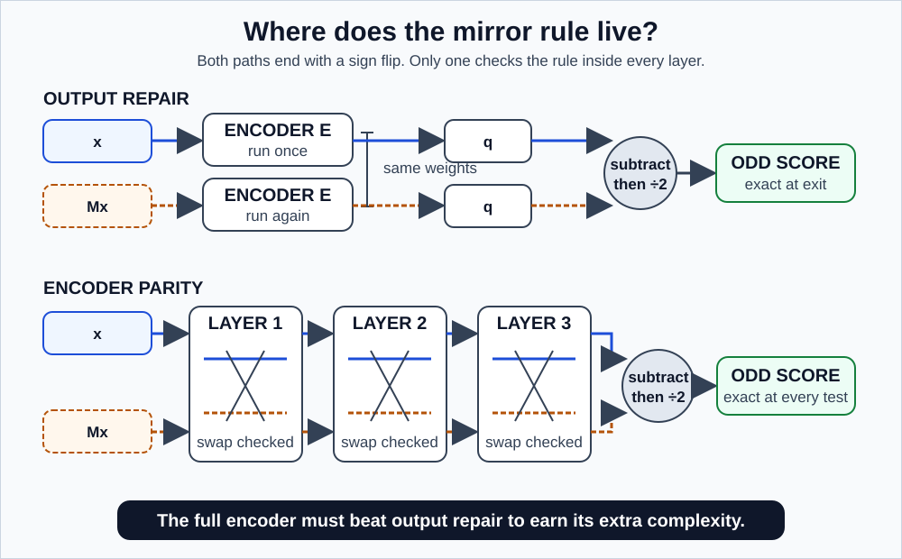
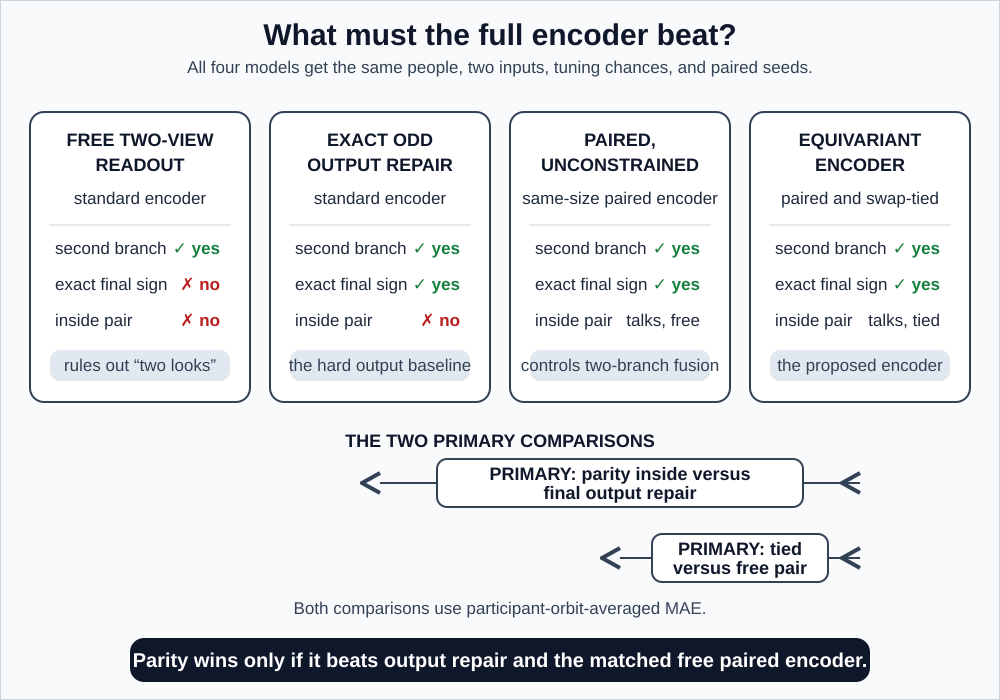

# GaitParity Study: building the mirror rule into the model itself

> **The one thing this study decides:** whether organizing a whole skeleton representation around left-right reflection beats simply forcing the correct sign on the final output.
>
> **Detailed protocol:** [METHODOLOGY_LONG_TERM.md](./METHODOLOGY_LONG_TERM.md)
> **Shared definitions:** [METHODOLOGY.md](./METHODOLOGY.md)
> **Concepts and vocabulary:** [README.md](./README.md) and [GLOSSARY.md](./GLOSSARY.md)

---

## 1. The question, and why the bar is set where it is

> When does building left-right reflection structure into a skeleton JEPA make a signed force target easier to estimate on held-out participants **than merely imposing the correct sign rule on the final output**?

That last clause is the whole study. Everything hangs on it.

Recall from the [prototype](./README_SHORT_TERM.md) that any predictor whatsoever can be made exactly odd with three lines of arithmetic:

$$
q_{\text{odd}}(x) = \frac{q(x) - q(Mx)}{2}
$$

Three lines. No new architecture, no retraining, works around any encoder. If a paper proposes an elaborate equivariant network and compares it only against an ordinary network, it has not shown that the architecture matters. It has shown that *something* about respecting mirrors matters, and three lines of arithmetic would have delivered that.

**So the baseline this study must beat is `odd_output`, not `standard_one_view`.** That is a deliberately hard bar, and setting it anywhere lower makes the result uninterpretable.

---

## 2. Patching the output versus organizing the interior

A useful way to picture the difference.

**Output repair** is like a student who works a long problem, makes sign errors throughout, and then checks the final answer against a rule at the end and corrects it. The final answer becomes right. The working stays a mess. If you ask that student for an intermediate quantity, it is still wrong.

**Encoder equivariance** is like a student who keeps track of signs correctly at every step. Every intermediate quantity is meaningful. You can stop them anywhere and ask what they have, and the answer makes sense.

**But why does the interior matter, if the final number is guaranteed either way?**

That is the right objection, and the whole study exists to answer it. Here is the reason to think the interior might matter: a guarantee about the *sign* is not a guarantee about the *value*. If the encoder has already blurred the two legs together into features that no longer distinguish them, subtracting at the very end cannot recover information that was destroyed three layers earlier. The output rule fixes the symmetry. It cannot undo a loss.

Whether that loss actually happens, and whether fixing it actually helps, is an empirical question. Which is why this is a study and not an assertion.

*Figure 1. The top path is a strong and very cheap baseline. The bottom path is the proposal. Both produce an exactly odd final answer, so the question is entirely about whether the organized interior buys anything measurable.*

---

## 3. How the construction works

### The group has two elements, and that is the good news

**You need no group theory for this.** There are exactly two things you can do to the anatomy: nothing, or mirror it. Mirror twice and you are back to nothing. That is the entire structure. Mathematicians write it

$$
C_2 = \{e, m\}
$$

where $e$ means "leave the anatomy alone" and $m$ means "mirror it." You can equally well call it "the two options."

This matters practically. Equivariant network literature often deals with rotation groups that are continuous and infinite, which requires substantial mathematical machinery (spherical harmonics, irreducible representations, and so on). None of that is needed here. **A two-element group means you carry two copies of everything and make sure operations treat them symmetrically.** The idea is genuinely simple; the difficulty is entirely in the bookkeeping, and the bookkeeping is where it breaks.

### Lifting the input

Instead of one internal state, carry a pair:

$$
H^0(x) = [\phi(x), \phi(Mx)]
$$

The first slot holds the body as recorded. The second holds it mirrored.

Now feed in a mirrored input $Mx$ and see what happens:

$$
H^0(Mx) = [\phi(Mx), \phi(M(Mx))] = [\phi(Mx), \phi(x)]
$$

The two slots **swapped**. That is the entire mechanism. Mirroring the input permutes the pair, and nothing else.

### One important control: two branches are not automatically a new idea

There is a subtle trap here. We could run the same ordinary encoder once on $x$ and once on $Mx$, keep the two results separate, and still pass the swap test. That is a useful baseline, but it is just two independent calculations. It does not yet show that the model's inside is organized around the mirror rule.

The proposed encoder therefore includes at least one **symmetric cross-branch interaction**: each branch can use information from the other, and the same operation runs when their order is reversed. To test whether the gain comes from that extra conversation rather than from the mirror rule, the study includes a `paired_unconstrained_encoder` with the same two branches, cross-branch interaction, depth, masks, parameter count, training exposure, tuning budget, paired seeds, compute, and exact odd final-output wrapper, but without the branch-swap weight ties. That control is the cleanest test of the stronger architecture claim.

### The requirement on every layer

Every layer $F_\ell$ must satisfy:

$$
F_\ell(SH) = S\,F_\ell(H)
$$

where $S$ is the operation that swaps the two slots.

In words: **swap-then-process must equal process-then-swap.** If that holds at every layer, then the swap propagates cleanly from the input all the way to the output, and the guarantee holds throughout rather than only at the exit.

*Figure 2. The commutation square. Both routes from the top-left corner to the bottom-right corner must arrive at the same place. Every layer in the encoder gets tested against this, in the actual numerical precision used for training.*

A concrete way to see why this is not automatic: suppose a layer computes normalization statistics over the first slot only, then applies them to both. Process-then-swap and swap-then-process now differ, because the statistics came from a different slot in each route. Nothing crashes. The tensors have the right shapes. The model trains. The equivariance claim is simply false, and only an explicit test will reveal it.

### Reading out even and odd

Keep the pair alive through the final encoder layer, then combine:

$$
h_{\text{even}} = \frac{h_{\text{orig}} + h_{\text{mirr}}}{2}, \qquad h_{\text{odd}} = \frac{h_{\text{orig}} - h_{\text{mirr}}}{2}
$$

Add to get the part that ignores side. Subtract to get the part that flips with side.

A tiny numerical example. Suppose the final pair, in some two-dimensional feature space, is:

$$
h_{\text{orig}} = (5, 3), \qquad h_{\text{mirr}} = (5, -3)
$$

Then:

$$
h_{\text{even}} = \left(\frac{5+5}{2}, \frac{3-3}{2}\right) = (5, 0), \qquad
h_{\text{odd}} = \left(\frac{5-5}{2}, \frac{3+3}{2}\right) = (0, 3)
$$

The first feature turned out to be purely even, the second purely odd, and the decomposition separated them cleanly. Real feature vectors are hundreds of dimensions and most components are mixtures, but the arithmetic is exactly this.

One detail that is easy to get wrong: the readout on $h_{\text{odd}}$ must have **no bias term**. A bias $c$ adds a constant that does not flip sign, so $s(Mx) = -s(x) + 2c$, which is not odd unless $c = 0$. A single default argument in a linear layer silently destroys the guarantee that the entire architecture exists to provide.

---

## 4. Why this might help, honestly stated

### The case for

Clinical gait datasets have **few people and many cycles per person**. Take the numbers seriously: 50 stroke survivors at roughly 30 cycles each gives you 1,500 recordings but only **50 independent data points**. Every statistical claim in this study rests on the 50, not on the 1,500, and a study with 50 stroke survivors is already a substantial one.

Fifty is a very small number for learning anything structural.

A standard model has to infer the mirror rule from those 50 people. It may well fail, not because the rule is hard, but because 50 examples is not much evidence about a global property of the data. An equivariant model is handed the rule and can spend all of its capacity on things it actually has to learn.

**Built-in structure is a substitute for data.** That is the mechanism, and it predicts three specific things:

1. **Sample efficiency.** Fewer labelled participants needed to reach a given accuracy. Should be most visible at the smallest label budgets.
2. **Robustness.** Missing or noisy joints should be less likely to produce arbitrary side errors, since the side relationship is structural rather than learned.
3. **Organization.** Even and odd information are separated by construction, so they can be inspected and used independently.

Prediction 1 is the sharpest, because it says *where* to look: at 4 and 8 labelled people, not at the full dataset. A method that only helps when data is plentiful is not doing what this method claims to do.

### The case against

All of these are real, and several would be worth publishing:

- The standard encoder may already learn adequate parity from data, making the constraint redundant.
- Output repair may capture the entire available benefit, leaving nothing for encoder-wide structure.
- The constraint may remove flexibility the model needed, making it worse.
- The real bottleneck may be timing and force measurement quality, in which case no architectural change helps.

The last one is the most likely quiet failure. If the force target has poor reliability, every model performs poorly for reasons that have nothing to do with symmetry, and the study returns a null that says more about the measurement than about the architecture. This is why the [shared methodology](./METHODOLOGY.md) puts a reliability gate on the target before any of this begins.

---

## 5. The trap: perfectly odd and completely useless

Here is the failure mode that would be easiest to accidentally declare a success.

Suppose the odd channel outputs zero. Always. For every input, every participant, every condition.

Check the oddness condition:

$$
s(Mx) = 0, \qquad -s(x) = -0 = 0
$$

They match. **The model is perfectly, exactly odd.** It passes the mirror test with a perfect score. It would pass every symmetry test in the suite.

It also contains no information whatsoever.

This is not a hypothetical. **Representation collapse is the standard failure mode of self-supervised learning**, and a channel defined by a subtraction is unusually exposed to it, because the training objective can be partly satisfied by making the two branches identical, at which point their difference is zero everywhere.

*Figure 3. Both models pass the oddness check. The left one carries participant-varying information; the right one has collapsed to zero. Symmetry tests alone cannot tell them apart, which is why representation-health gates are a required milestone rather than a diagnostic afterthought.*

So the study checks that the representation is **alive** before checking that it is correct:

- per-dimension variance, so channels are not constant
- covariance effective rank, so the representation is not secretly one-dimensional
- mean pairwise cosine similarity, so different inputs get different representations
- odd-channel energy per participant, so the signal varies between people rather than being a global constant
- even-to-odd energy ratio, so one channel has not absorbed everything
- masked JEPA prediction quality, so pretraining actually learned something
- response to deliberate one-sided motion attenuation with known sign and dose

That last one is the sharpest test available. Take a real recording, artificially reduce the motion on one side by a known amount, and confirm that the odd channel moves in the correct direction by roughly the right magnitude. A collapsed representation cannot do this. A representation reading a shortcut cannot do this either. It is a positive control, and positive controls are rarer and more informative than negative ones.

---

## 6. The comparisons that decide it

*Figure 4. The models use the same participants and mirrored views. The paired unconstrained control prevents ordinary two-branch fusion from being mistaken for an equivariant benefit.*

### Comparison 1: `equivariant_encoder` versus `paired_unconstrained_encoder`

**Question:** does the mirror-preserving structure help beyond equally large two-branch fusion?

This is a co-primary architecture-isolation comparison. Both models talk across branches and use the same exact odd final-output wrapper. Only one is forced to keep that conversation consistent under a left-right swap.

### Comparison 2: `equivariant_encoder` versus `odd_output`

**Question:** does preserving the rule through every internal layer help beyond enforcing it only at the exit?

**This is one co-primary mechanism comparison and it is the point of the study.** Both models return exactly odd final scores and both see both views. The equivariant model also has an organized paired interior, which is why the previous co-primary comparison is required to separate parity from generic two-branch fusion. If this comparison shows no practically meaningful advantage, then three lines of arithmetic were sufficient for this task, and that conclusion should be stated plainly rather than buried.

### Comparison 3: `equivariant_encoder` versus `two_view_free`

**Question:** does the proposed system remain useful relative to a standard encoder whose readout sees both inputs?

This is a protective comparison against the simplest "two looks" explanation. It is reported alongside, not instead of, the two comparisons above.

### Comparison 4: the practical context

Also compared: `standard_one_view`, `sign_augmented`, `raw_kinematics`, established skeleton encoders from the MotionBERT and ST-GCN families, `random_encoder`, `side_agnostic`, `nuisance_only`, and target-permuted controls.

The MotionBERT and ST-GCN comparison answers a question reviewers will certainly ask: is a JEPA the right choice here at all, or would an established skeleton architecture have done as well?

### Matching, and why it is genuinely hard

For any of these comparisons to mean anything, the models must be matched on: participant exposure, original and reflected windows seen, optimizer update counts, hyperparameter tuning opportunities, random seeds, trainable parameter counts, and measured compute.

Here is the awkward part. **You often cannot match all of these at once.** An equivariant model that processes two branches does roughly twice the arithmetic per example. Match the parameter count and you have not matched the compute. Match the compute and the standard model gets more updates. Match the updates and you have not matched wall-clock cost.

There is no clean resolution, and pretending otherwise is a common way to overstate results. **The rule here: report exposure-matched and compute-matched results separately, and never imply a matching that was not achieved.** A reader can then judge which comparison they consider fair, which is the honest arrangement.

---

## 7. What each dataset is for

| Source | The question it answers |
|---|---|
| **GAVD** | Does the historical code and representation behave as expected? |
| **AMASS** | Can matched standard, paired-unconstrained, and equivariant encoders learn from broad non-clinical motion? |
| **Stroke cohort** | Does the architecture improve held-out signed force prediction? |
| **MoVi** | Does correct mirror behaviour coexist with stability across real calibrated camera views? |
| **Parkinson's cohort** | Does the frozen comparison replicate in a second clinical cohort? |
| **GaitRec** | Does the force target behave sensibly at larger scale? |

No dataset proves everything, and each has a specific ceiling. GAVD cannot establish clinical generalization. AMASS and MoVi cannot establish clinical value at all, since neither contains clinical outcomes. Success on the stroke cohort alone cannot establish that the effect holds across conditions.

---

## 8. Milestones

Ordered by dependency. Each is complete when its evidence gate is satisfied, not when a period of time has elapsed.

### L0. Build the benchmark foundation

**Complete when** dataset agreements, checksums, participant manifests, force fields, joint mappings, and target definitions are all audited; the stroke folds are frozen; and the Parkinson's outcome data is **sealed and not looked at**.

Sealing the replication cohort at the start is what makes it a real replication later. A dataset you have been glancing at throughout cannot serve as an independent test, because every glance is an opportunity to adjust.

### L1. Build a genuinely reflection-equivariant JEPA

**Complete when** every claimed layer passes its commutation test, in the numerical precision actually used for training, in both training and evaluation modes, with masks present, and after a save-and-reload cycle.

**If a layer fails: fix it, or rename the system `parity-regularized`.** Do not weaken what "equivariant" means. It is a precise mathematical claim, and a field where the word comes to mean "approximately, mostly, in the cases we checked" has lost a useful term permanently.

### L2. Show the representation is alive and informative

**Complete when** the even and odd channels show healthy variance and rank, the JEPA has not collapsed, nuisance decodability has been measured, and the odd channel carries participant-varying information.

Section 5 explains why this comes before, not after, the performance comparisons. A channel that is always zero is perfectly odd and perfectly useless, and no downstream metric will tell you which one you have.

### L3. Complete a fair architecture comparison

**Complete when** standard, paired-unconstrained, and equivariant models have matched data exposure, tuning, seeds, update counts, paired-state forward passes, and output construction, with compute reported explicitly and pretraining luck controlled through paired seeds and frozen checkpoints.

"Paired seeds" means the standard, paired-unconstrained, and equivariant runs with seed 7 are compared run for run, rather than comparing best against best. Comparing the best of five runs against the best of five runs measures how lucky you got, not how good the method is.

### L4. Establish primary stroke-cohort value

**Complete when** every held-out stroke participant has predictions covering force error, low-label recovery, calibration, coordinate-frame sensitivity, missing and noisy joint robustness, and a direct comparison against raw kinematics.

### L5. Test generality

**Complete when** the Parkinson's fields and force pass their own independent audit, the architecture comparison has been frozen, and the second cohort is opened exactly once.

The distinction that gets misused constantly:

| Term | What it means | Difficulty |
|---|---|---|
| **Replication** | Run the same frozen procedure in the new cohort, refitting the readout there | Moderate |
| **Transfer** | Apply the already-fitted stroke model directly, with no refitting | Much harder |

Refitting inside the new cohort and calling it transfer overstates the result substantially. Both are run here, and both are labelled correctly.

### L6. Release a reusable research tool

**Complete when** the reflection operator, the odd/even target registry, the common joint schema, the participant-safe splits, the corruption suite, the layerwise tests, the compute accounting, and the participant-level predictions together allow someone else to recreate the paper's evidence.

This milestone survives every possible outcome of the study. If the architecture wins, the benchmark supports it. If the architecture loses, the benchmark is what lets the next person test a different idea without rebuilding the infrastructure. It is the most reliably valuable thing this project can produce.

---

## 9. What counts as success

Using the **shared claim ladder** from [METHODOLOGY.md](./METHODOLOGY.md) section 13, plus two architecture gates that come before it.

**Two gates first**, both specific to building an actual equivariant encoder:

- **G1. Exact architecture.** Every layerwise commutation test passes.
- **G2. Informative architecture.** The odd channel carries real information and has not collapsed to zero.

Neither is a scientific result. G1 without G2 is the trap described in section 5: perfectly odd, perfectly useless.

**Two co-primary headline tests are fixed in advance:** at the largest label budget, compare the participant-orbit-averaged force MAE of `equivariant_encoder` against both `odd_output` and `paired_unconstrained_encoder`. Tier 5 needs a practically meaningful advantage on both simultaneous intervals: output repair must not be enough, and ordinary two-branch fusion must not be enough. The alternatives are practical equivalence and inconclusive, defined by the reliability-based MAE margin in the [shared methodology](./METHODOLOGY.md) section 10. Learning curves and corruption tests add explanation. They do not replace a weak headline result.

**Then the shared tiers:**

| Tier | What it means here |
|---|---|
| **1. Implementation validity** | Transforms, splits, and exact guarantees pass |
| **2. Predictive benefit** | Beats `two_view_free` on held-out force prediction |
| **3. Sample-efficiency benefit** | Helps when labelled participants are scarce |
| **4. Robustness benefit** | Helps when joints are missing or noisy |
| **5. Encoder-level benefit** | **Beats `odd_output` and the matched `paired_unconstrained_encoder`** |
| **6. Replication** | The frozen advantage reappears in the second cohort |

**Tier 5 is the result that matters.** Without it, the study has not shown that encoder-wide equivariance beats three lines of arithmetic *and* an equally capable two-branch fusion control. No amount of evidence from the tiers below substitutes for that.

---

## 10. Possible findings

| Finding | What it means |
|---|---|
| Beats both controls | Internal parity organization genuinely adds value. The headline result. |
| Beats `two_view_free`, shows no detectable advantage over `odd_output` | Exact final parity helps; encoder-wide structure adds nothing we could detect. Note that "no detectable advantage" is not "equally good" unless an equivalence margin was stated in advance and the interval fits inside it. |
| Geometry exact, force prediction unchanged | Correct symmetry, no clinical predictive gain. |
| Benefit only at low labels or with missing joints | Parity is a sample-efficiency or robustness bias, not a general improvement. Useful and specific. |
| Standard model wins | The constraint removes needed flexibility, or is imposed at the wrong level. Worth understanding. |
| Stroke effect fails in Parkinson's | Does not replicate across these cohorts. |
| `raw_kinematics` wins | Learned representations add nothing for this target. |
| Intervals stay wide | Inconclusive. Concretely: an estimated difference of $+0.02$ with an interval from $-0.15$ to $+0.19$ is consistent with a large benefit *and* with a large harm. "We could not tell them apart" is not "they are the same," in the same way that a blurry photo of two people is not evidence they are twins. |

---

## 11. Contributions if the study succeeds

1. A tested reflection-equivariant skeleton JEPA, with layerwise verification rather than an architectural diagram.
2. A comparison against the controls that actually threaten the claim, including the cheap output fix.
3. A participant-safe benchmark for odd and even gait targets.
4. Evidence about **when** symmetry structure helps low-label clinical learning, rather than a blanket assertion that it does.
5. A clinical replication clearly distinguished from transfer.

Items 3 and 5 survive a negative result. A careful null, with the infrastructure to check it, is a real contribution to a field where the same idea gets rebuilt repeatedly because nobody published the time it did not work.

---

## 12. Boundaries

- The model estimates a signed biomechanical quantity. It does not produce a diagnosis.
- Force association is concurrent evidence. It is not causal, prognostic, or predictive of treatment response.
- Paretic side, force sign, and compensation direction can genuinely disagree. They are analysed separately.
- Parkinson's disease, stroke, cerebral palsy, and myopathy are distinct conditions, not points on one severity axis.
- Real camera invariance requires real multi-view evidence. Rigid yaw rotation is a frame-sensitivity test and gets that name.

  Worth restating, because the two words are the backbone of the whole project: **invariant** means the answer does not change; **equivariant** means the answer changes in a known, predictable way. We want the prediction *invariant* under camera moves and *equivariant* (sign-flipping) under mirroring. Those are different requirements and they need different tests.
- A small cohort supports bounded held-out evidence. It does not support clinical deployment.

---

## Key references

1. Abdelfattah and Alahi, S-JEPA, ECCV 2024. [DOI](https://doi.org/10.1007/978-3-031-73411-3_21).
2. Assran et al., I-JEPA, CVPR 2023. [arXiv](https://arxiv.org/abs/2301.08243).
3. Bardes et al., V-JEPA, 2024. [arXiv](https://arxiv.org/abs/2404.08471).
4. Cohen and Welling, group-equivariant networks, ICML 2016. [Paper](https://proceedings.mlr.press/v48/cohenc16.html).
5. Geiger and Smidt, e3nn, 2022. [arXiv](https://arxiv.org/abs/2207.09453).
6. Mahmood et al., AMASS, ICCV 2019. [arXiv](https://arxiv.org/abs/1904.03278).
7. Van Criekinge et al., stroke gait dataset, *Scientific Data* 2023. [DOI](https://doi.org/10.1038/s41597-023-02767-y).
8. Shida et al., Parkinson's disease gait data, *Frontiers in Neuroscience* 2023. [DOI](https://doi.org/10.3389/fnins.2023.992585).
9. Ghorbani et al., MoVi, *PLOS ONE* 2021. [DOI](https://doi.org/10.1371/journal.pone.0253157).
10. Horsak et al., GaitRec, *Scientific Data* 2020. [DOI](https://doi.org/10.1038/s41597-020-0481-z).
