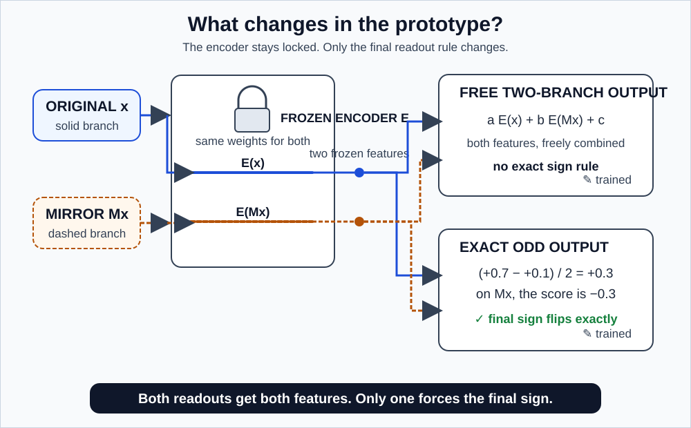
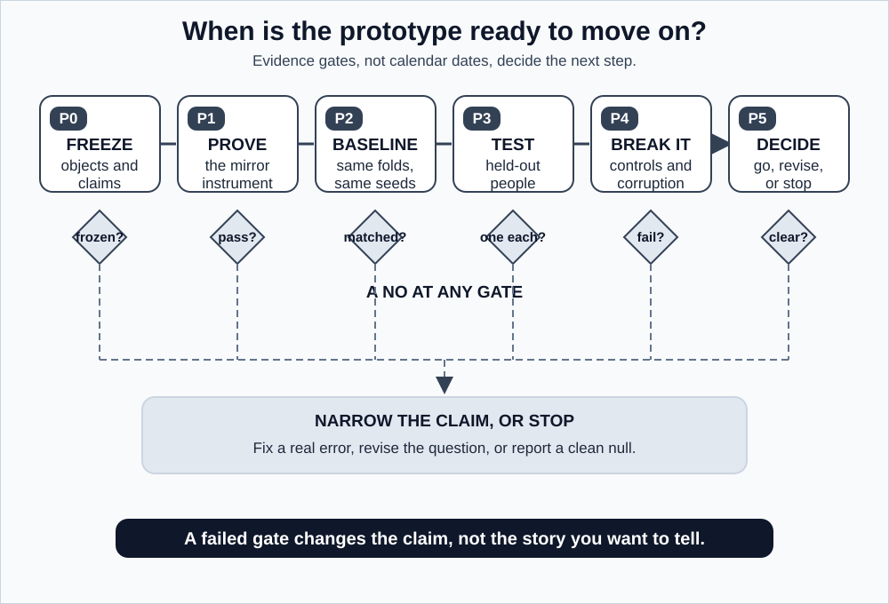
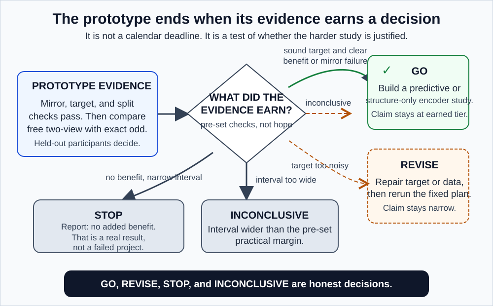

# GaitParity Prototype: is the mirror rule worth building into a model?

> **The one thing this study decides:** whether an exact left-right sign rule helps enough to justify building a whole new reflection-equivariant encoder.
>
> **Detailed protocol:** [METHODOLOGY_SHORT_TERM.md](./METHODOLOGY_SHORT_TERM.md)
> **Shared definitions:** [METHODOLOGY.md](./METHODOLOGY.md)
> **Concepts and vocabulary:** [README.md](./README.md) and [GLOSSARY.md](./GLOSSARY.md)

---

## 1. Why run a prototype at all?

The full [GaitParity Study](./README_LONG_TERM.md) proposes building a skeleton JEPA where the left-right mirror rule holds at every layer. That is a serious engineering project. Every component has to be rebuilt and individually verified: the embeddings, the positional encodings, the attention, the normalization layers, the residual paths, the dropout masks, the masking scheme, the moving-average target encoder. Each one is a place where the guarantee can silently break.

Before committing to that, three things are worth knowing:

1. **Does the pipeline actually work?** Is the mirror implemented correctly, is the sign convention consistent, are the splits leak-free, is the force target reliable?
2. **Is the signal even there?** Does a frozen representation contain recoverable side-specific information about an independently measured quantity?
3. **Is the cheap fix already enough?** You can make *any* predictor exactly odd with three lines of arithmetic. If that captures the whole benefit, the elaborate version has nothing left to win.

Question 3 is the sharp one. It is entirely possible that the answer is "the cheap fix is enough," and finding that out in a prototype is far better than finding it out after building the hard version.

**This prototype changes only the final readout.** It does not build, and does not claim, a reflection-equivariant encoder.

### What "prototype" does not mean

It does not mean sloppy, and it does not mean fast. It means *narrow*. The evidence standards are the same as the full study: the same participant-level splits, the same falsification tests, the same refusal to relabel outcomes after the fact.

Rapid implementation shortens the coding. It does not shorten a data audit, it does not manufacture participants, and it does not improve a noisy force measurement. Those are the actual constraints.

---

## 2. The question, precisely

> On participants held out from every model-selection decision, does forcing a signed gait prediction to reverse under anatomical reflection improve estimation of a separately measured right-minus-left target, compared against an equally-informed readout that sees both views but is free to use them however it likes?

In plain terms: if we hand the model the correct left-right rule instead of hoping it works the rule out, does the answer get better, does it need fewer labelled patients, or does it hold up better when the data is damaged?

Note what is doing the work in that sentence: **"equally-informed."** The comparison model gets exactly the same information. That is the whole design, and section 5 explains why.

---

## 3. A worked example, end to end

Take one held-out participant, the same one from [the hub README](./README.md). The force plates measured:

- right leg propulsive impulse $J_R = 8$ newton-seconds
- left leg propulsive impulse $J_L = 12$ newton-seconds

So the true target is:

$$
y = \log\left(\frac{8}{12}\right) = \log(0.667) = -0.41
$$

Negative, because the left leg is pushing harder. The model has never seen this number, and has never seen this person.

We feed the model her skeleton sequence, and separately her mirrored skeleton sequence. The raw predictor returns:

- on the original: $q(x) = +0.7$
- on the mirrored version: $q(Mx) = +0.1$

Stop and look at how badly behaved that is. A model that had learned the mirror rule would have returned $-0.7$ on the mirrored input. It returned $+0.1$: wrong magnitude, wrong sign. **This model has clearly not learned the rule from data**, which is exactly the situation we are investigating.

The exact odd construction repairs it regardless:

$$
s_{\text{odd}}(x) = \frac{q(x) - q(Mx)}{2} = \frac{0.7 - 0.1}{2} = +0.3
$$

And on the mirrored input, the two raw scores trade places:

$$
s_{\text{odd}}(Mx) = \frac{0.1 - 0.7}{2} = -0.3
$$

Perfect sign flip, guaranteed by the arithmetic rather than by training.

**Now the honest part.** The truth was $-0.41$. The odd model predicted $+0.3$. That is not just inaccurate, it is the wrong sign. The geometric guarantee did nothing to make this prediction correct.

That is precisely the point of this whole document. **Perfect symmetry and useful accuracy are different properties, and this study measures them separately.** A model can be flawlessly odd and clinically worthless. If we only tracked oddness we would call this a triumph.

*Figure 1. Both models see the original and the mirrored sequence through the same frozen encoder. Only the lower path is forced to return an odd final number. Everything else is matched, which is what isolates the value of the rule from the value of the second look.*

---

## 4. What goes in and what comes out

**Input:** a body-centred 3D skeleton sequence with a small common set of bilateral lower-body joints (hips, knees, ankles, heels, toes), plus the visibility masks recording which values were genuinely observed.

**Target:** the log ratio of right and left propulsive impulse, when the force data pass their quality gate:

$$
y = \log\left(\frac{J_R}{J_L}\right)
$$

### The separation that makes this meaningful

**The force measurement never enters the encoder.** Not as an input, not as an auxiliary loss, not as a preprocessing signal, not indirectly through event detection.

This is what distinguishes real evidence from a code test. Consider two experiments:

| Experiment | What it shows |
|---|---|
| Predict a coordinate-derived asymmetry from those same coordinates | The pipeline can extract information it was handed. Useful as a wiring check. |
| Predict a force-plate measurement from movement alone | Movement carries information about forces the model never saw. A real finding. |

The first is a closed loop; you are checking that a number survives a round trip. The second connects two independent instruments. Only the second supports any biomechanical claim, and this project runs both while never confusing them.

---

## 5. The one comparison that matters

Everything else in this prototype supports one contrast. Both models use the **same frozen standard encoder**, so the encoder cannot be the explanation for any difference.

### Model A: exact odd output

$$
s_{\text{odd}}(x) = \frac{q(E(x)) - q(E(Mx))}{2}
$$

Guaranteed to flip sign under reflection.

### Model B: free two-view output

$$
s_{\text{free}}(x) = a^\top E(x) + b^\top E(Mx) + c
$$

Sees exactly the same two representations. Learns its own weights $a$, $b$, and offset $c$. No constraint at all.

### Why B exists

Model B is there to kill the obvious objection before anyone makes it.

Without B, a critic says: "Your odd model got two looks at the data and the baseline got one. Of course it did better. You have not shown your rule matters, you have shown that more information helps."

They would be right. So B gets both looks. It sees $E(x)$ and $E(Mx)$, both representations, the same total information, with a matched parameter and tuning budget. B could even *learn* to be odd, by setting $a = -b$ and $c = 0$. Nothing stops it. It just is not required to.

The only difference between A and B is the constraint.

- **If A beats B:** the second look is ruled out. The rule is doing the work. This is evidence that built-in symmetry structure helps, and a reason to build the full study.
- **If A ties B:** the model can learn the rule adequately from the data available, and forcing it adds nothing. Also a real finding.
- **If B beats A:** the constraint is removing flexibility the model needed, which is genuinely surprising and worth understanding.

Designing a comparison so that every outcome teaches you something is the goal. A study that is only informative if it wins is a bad study.

### The supporting cast

Each of these answers a specific alternative explanation:

| Model | The objection it answers |
|---|---|
| `standard_one_view` | "What does the ordinary approach get?" |
| `sign_augmented` | "Couldn't you just train on mirrored examples instead of constraining anything?" |
| `raw_kinematics` | "Would hand-computed features have worked just as well?" |
| `random_encoder` | "Did pretraining contribute anything, or is the readout doing everything?" |
| `side_agnostic` | "Is side information really the channel? Destroy it and check." |
| `nuisance_only` | "Could recording metadata alone produce this score?" |
| target-permuted | "Would this pipeline produce a good score on scrambled labels?" |

The last three are supposed to **fail on the paired task**. `side_agnostic` must give the same answer for a recording and its mirror, so it cannot correctly follow their opposite signed targets. If it looks useful on the recorded orientation alone, first suspect uneven side prevalence, site, speed, or severity and investigate that shortcut.

---

## 6. Where the data comes from, and what each dataset can support

| Dataset | Its job | What it cannot show |
|---|---|---|
| **GAVD** | Catch sign errors, grouping errors, provenance problems, and historical-checkpoint issues | Anything about new people or clinical validity |
| **Public stroke gait cohort** | The decisive participant-held-out force test | Generalization to conditions other than stroke |
| **MoVi** (optional) | Real calibrated-view geometry check, actor-held-out | Clinical usefulness |

**The stroke cohort is the experiment. GAVD is the audit.** That distinction is load-bearing.

GAVD is already in this repository and will produce numbers quickly, which is exactly why it is dangerous. Those numbers cannot support a claim about generalization, for three reasons documented in [METHODOLOGY.md](./METHODOLOGY.md) section 5: the encoder was trained on the evaluation recordings, participant identities do not exist, and the target is computed from the model's own input.

GAVD is genuinely valuable for what it *can* do. It will surface a broken mirror, an inverted sign, or a leaky split within hours, on data already at hand, before any expensive experiment is run on top of the bug. That is worth a lot. It is simply not evidence about whether the method works.

---

## 7. Milestones

*Figure 2. Progress is gated by evidence, not by dates. A failed gate narrows the question. It is not an invitation to substitute a more convenient analysis.*

The milestones below are ordered because each depends on the one before. Running P3 before P1 has passed produces numbers that mean nothing, and you will not be able to tell.

### P0. Freeze the scientific objects

**Complete when:**

- the sign convention is right minus left, verified in every file
- reflection code and camera-view code are separate functions with separate tests
- dataset roles and participant manifests are fixed and versioned
- force coverage and contact quality have been audited participant by participant
- the primary contrast and the table of permitted conclusions are written down **before any model result exists**

**Why write conclusions first?** Because writing them afterward is how honest people mislead themselves. Once you have seen that your model does well on metric 7 out of 9, metric 7 starts looking like the important one. Deciding in advance removes that degree of freedom. This is not bureaucracy; it is the difference between a test and a search.

**If the force gate fails:** run a clearly renamed, narrower paretic-side classification prototype, or stop the confirmatory clinical claim entirely. Do not quietly swap in an easier target and present it as though it were the original plan.

### P1. Prove the instrument works

**Complete when:**

- reflecting twice recovers every tested sequence, on real data and not just synthetic arrays
- odd synthetic targets negate and even synthetic targets do not
- masks, bone lengths, time order, and forward direction all survive reflection
- no participant, and no GAVD source video, crosses any split
- the exact odd output flips sign to numerical tolerance

**None of this is a scientific result.** It is the equivalent of calibrating a scale before weighing anything. But if P1 fails and you have already run P3, every number from P3 is uninterpretable, and you will not know which ones were affected.

### P2. Establish the frozen-encoder baseline

**Complete when** every named model has run on identical participants, identical folds, identical label subsets, and identical seeds, and the GAVD result carries its transductive label.

Identical matters more than it sounds. If model A used fold assignment 1 and model B used fold assignment 2, their difference includes which people happened to land where, and with 40 participants that difference can easily swamp the effect being measured.

### P3. Run the participant-held-out test

**Complete when** every participant has exactly one out-of-fold prediction per model and per label budget, with the force target hidden from encoder learning and from every preprocessing decision.

"Exactly one" is deliberate. A person with several predictions gets more influence over the final metric than a person with one, which quietly weights the result toward whoever contributed the most data.

### P4. Try to break the result

**Complete when** target permutation, side removal, identity corruption, missing-joint, coordinate-noise, and frame-rotation tests all behave as [METHODOLOGY.md](./METHODOLOGY.md) section 12 requires.

This step is not optional and it is not a formality. It is the step where you find out whether you have a result or an artifact. Do it before you believe anything, and specifically before you tell anyone else.

### P5. Make the encoder decision

*Figure 3. Four evidence-based exits. A go can be predictive or structure-only; "stop" is a legitimate and valuable outcome rather than a failure.*

**Predictive go**, and build the [full study](./README_LONG_TERM.md) with a predictive claim, when the predeclared primary MAE interval shows a practically meaningful `odd_output` advantage. Low-label or robustness results then help explain where the advantage matters most.

**Structure-only go** is narrower. If the standard encoder contains reliable signed information but fails the mirror tests, the full study may be built to test encoder geometry. This is not evidence of a predictive advantage. The full study must report it as a geometry investigation unless its own co-primary force tests succeed.

**Revise** when the target is reliable but every representation performs poorly. The bottleneck is measurement or representation learning, not symmetry, and building a symmetric version of a weak model does not help.

**Stop** when the primary interval shows practical equivalence, raw kinematics dominate, or the independent target is too noisy to answer the question. A clean null result here is genuinely valuable: it saves both this project and anyone reading it from building an architecture that had no room to help.

---

## 8. How success is judged

Tiered, not pass-or-fail, using the **shared claim ladder** defined in [METHODOLOGY.md](./METHODOLOGY.md) section 13. The prototype can reach tiers 1 through 4. Tiers 5 and 6 are structurally out of its reach, because it never builds an equivariant encoder and never opens a second cohort.

| Tier | What it means here |
|---|---|
| **1. Implementation validity** | The exact sign rule holds and the leakage tests pass |
| **2. Predictive benefit** | `odd_output` lowers held-out error relative to `two_view_free` |
| **3. Sample-efficiency benefit** | `odd_output` lowers the area under the error-versus-labelled-people curve |
| **4. Robustness benefit** | The advantage survives prespecified corruption |

Running alongside all four, and not a tier of its own: **clinical grounding**, meaning the prediction agrees with the independently measured force target. This is what makes tier 2 worth anything. Tier 2 against a target derived from the model's own input would be a code test.

**The one headline test is fixed in advance:** at the largest label budget, compare the participant-orbit-averaged force MAE of `odd_output` and `two_view_free`. Each held-out walk and its mirror are graded together before the participant gets one vote. The result is an advantage, practical equivalence, or inconclusive according to the reliability-based MAE margin in the [shared methodology](./METHODOLOGY.md) section 10. Learning curves and corruption tests explain what happened. They do not get promoted to the headline after the fact.

Effect sizes and participant-level uncertainty matter more than which tiers show a check mark. An advantage of 0.002 with an interval spanning zero is not tier-2 success, whatever the point estimate says.

Any threshold for "smallest useful effect" is provisional until it is tied to measurement reliability or to a clinical interpretation. Until then it is an engineering convention, and it gets described as one.

---

## 9. Possible outcomes, decided in advance

| What we observe | What it honestly means |
|---|---|
| The signed target predicts well, but raw output does not flip | Useful side information exists, but it is geometrically tangled. Strong case for the full study. |
| `odd_output` beats `two_view_free` | The exact output rule adds value beyond two-view information. Go. |
| Mirror behaviour improves, force error does not | Cleaner geometry without stronger biomechanical usefulness. Real, and limited. |
| `raw_kinematics` wins | The learned representation added no predictive advantage here. Publish it. |
| Permuted targets still predict well | Leakage or a broken evaluation. Fix before anything else. |
| Force gate fails | No confirmatory independent-force claim is available. Say so. |
| Intervals are wide | Inconclusive, even if the average looks favourable. |

Every row is a legitimate outcome that this study is prepared to report. The point of writing them down now is that none of them can be relabelled once the results are in.

---

## 10. Boundaries

This prototype **cannot** show that the full encoder is equivariant. It tests only the final output.

It **cannot** establish diagnosis, affected side, prognosis, or treatment response.

What it **can** do: test whether an exact output rule is a useful inductive bias for one signed biomechanical task, in one primary clinical cohort, evaluated on participants the model has never seen.

That is a narrow claim. Stating it narrowly is what makes it worth anything.

---

## Key references

1. Abdelfattah and Alahi, S-JEPA, ECCV 2024. [DOI](https://doi.org/10.1007/978-3-031-73411-3_21).
2. Cohen and Welling, group-equivariant networks, ICML 2016. [Paper](https://proceedings.mlr.press/v48/cohenc16.html).
3. Van Criekinge et al., stroke and able-bodied gait dataset, *Scientific Data* 2023. [DOI](https://doi.org/10.1038/s41597-023-02767-y).
4. Bowden et al., paretic-limb propulsion, *Stroke* 2006. [DOI](https://doi.org/10.1161/01.STR.0000204063.75779.8d).
5. Ghorbani et al., MoVi, *PLOS ONE* 2021. [DOI](https://doi.org/10.1371/journal.pone.0253157).
