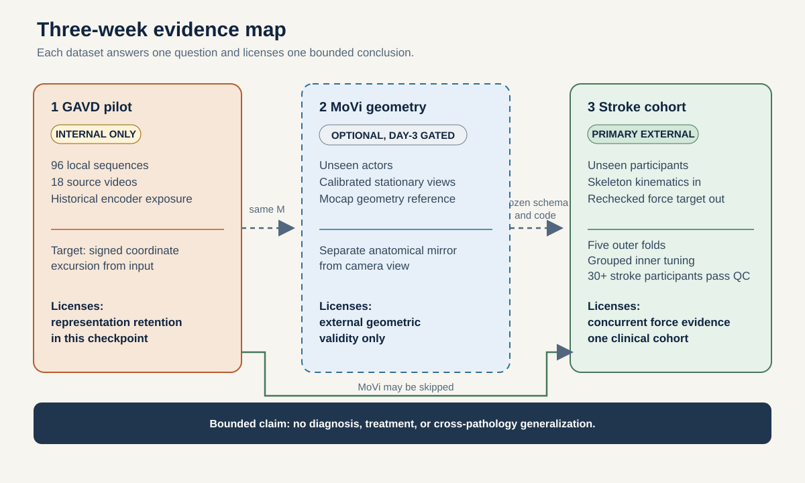
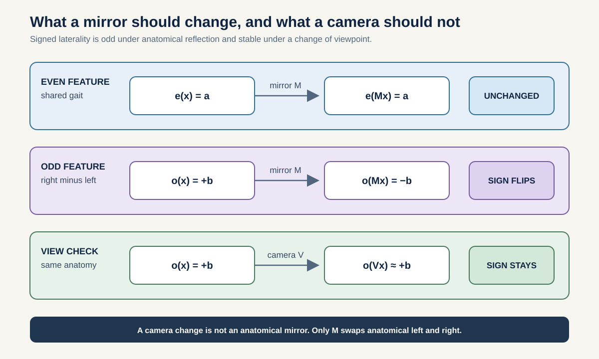
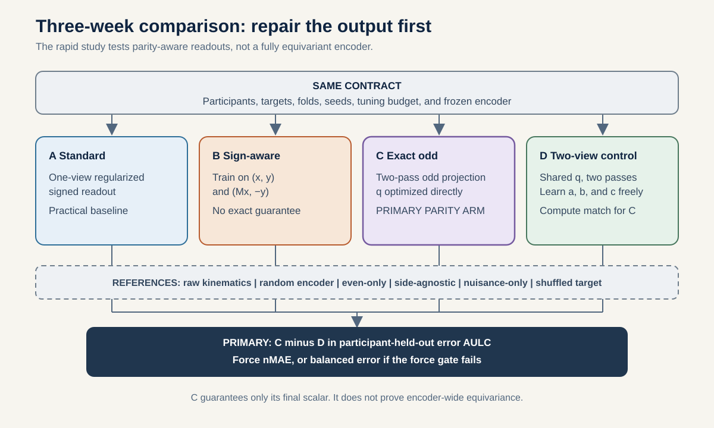
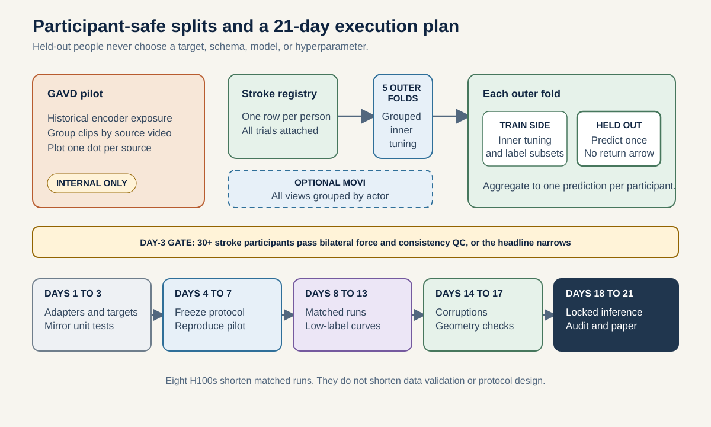

# Methodology tutorial: 21-day signed-laterality study

> **Companion proposal:** [README_3_WEEK.md](./README_3_WEEK.md)
> **Schedule:** 21 calendar days
> **Compute envelope:** 8 H100 GPUs, capped at 1,000 H100-hours unless a written prespecified run requires more
> **Original preserved:** [METHODOLOGY.md](./METHODOLOGY.md) remains unchanged

## How to use this document

This methodology is both a tutorial and an executable protocol. Each numbered step answers three questions in order:

1. What is being done?
2. Why is it needed?
3. What exact rule makes it reproducible?

Read Steps 1 through 4 to understand the scientific argument. Steps 5 through 8 explain the data transformation, target, and model comparison. Steps 9 through 11 explain how the study avoids leakage and measures performance. Steps 12 through 14 turn the protocol into a reproducible three-week workflow.

### The study in one pass

A walking trial is converted into a time sequence of labelled body joints. An encoder compresses that sequence into a feature vector. A small readout predicts a signed right-minus-left quantity. The key intervention forces this output to change sign when the anatomy is reflected. The key control sees the same original and reflected inputs but is not forced to obey that rule. Both are tested on entirely unseen participants and compared with a force-plate target that was not used as model input.

### Essential terms

| Term | Meaning in this study |
|---|---|
| Trial | One recorded walking session or pass |
| Gait cycle | One repeated unit of walking, such as successive contacts of the same foot |
| Skeleton | Labelled joint coordinates over time |
| Encoder | A model that turns a skeleton sequence into numerical features |
| Representation | The features produced by the encoder |
| Readout, head, or probe | A small supervised model that predicts a target from the representation |
| Signed laterality | A side difference whose sign identifies whether right or left is greater |
| Anatomical reflection | A transformation that exchanges left and right anatomy |
| Odd quantity | A quantity that changes sign under anatomical reflection |
| Even quantity | A quantity that remains unchanged under anatomical reflection |
| Participant-disjoint | All records from one person remain in only one data split |
| Outer fold | The held-out participant group used only for final evaluation |
| Inner fold | Training participants used to select settings without touching the outer fold |
| Label budget | The number of labelled training participants available to a readout |
| Confidence interval | A resampling-based range that represents uncertainty in an estimated effect |
| AP force | Anterior-posterior ground-reaction force, meaning forward-backward force between the foot and ground |
| ICC | Intraclass correlation coefficient, used here to measure agreement between two non-overlapping contact-based target estimates |
| MAE and nMAE | Mean absolute error and the same error divided by a training-set scale |
| AULC | Area under the learning curve, which summarizes error across label budgets |
| cAUC | Corruption area under the curve, which summarizes added error across corruption severities |
| AUROC | Area under the receiver operating characteristic curve, a threshold-independent ranking measure for two classes |
| Brier score | Mean squared error of predicted class probabilities, where lower is better |
| FLOPs | Floating-point operations, used as an approximate measure of computation |

## Step 1: Define the scope and claim boundary

This protocol tests whether a skeleton representation supports an **odd**, signed left-versus-right number and whether an exact parity-aware readout improves recovery when few labelled people are available.

The study has four evidence levels:

1. **GAVD retention audit:** can the historical representation recover a coordinate-derived diagnostic?
2. **Geometric test:** does the scalar negate under anatomical reflection and remain stable under view change?
3. **Matched intervention:** does the parity constraint improve prediction and robustness beyond a compute-matched two-view readout?
4. **Concurrent biomechanical test:** does skeleton input predict a contemporaneous signed quantity measured independently by force plates?

Only the fourth level supplies cross-modal concurrent-validity evidence, and only for the studied cohort. **Cross-modal** means that skeleton input is compared with a different instrument, the force plate. **Concurrent** means that both measurements describe the same walking period. This is one bounded part of a construct-validity argument, not proof that the output captures every clinical meaning of laterality. None of the levels supports diagnosis, prognosis, or treatment selection.

## Step 2: Freeze decisions before seeing test predictions

Preregistration means writing down the scientific decisions before inspecting the results that those decisions will judge. This prevents an appealing test result from changing the target, split, model, or threshold after the fact.

The following records are committed before any outer-test prediction is inspected:

- dataset checksums, licenses, and participant manifests;
- inclusion and exclusion counts with reasons;
- common joint schema and every dataset-specific mapping;
- coordinate axes, anatomical reflection operator, and unit tests;
- force and kinematic target definitions;
- participant-disjoint outer folds and inner folds;
- model arms, parameter and compute matching rules;
- label-budget participant subsets and random seeds;
- primary contrast, metrics, confidence interval, and success rule;
- corruption types and severity levels;
- a signed claims table mapping every possible result to allowed wording.

The order is deliberate. Dataset feasibility is decided first, target validity second, and models last. A positive or negative pilot result cannot change an eligibility gate.

## Step 3: Turn the question into measurable comparisons

### 3.1 Choose the primary outcome with a data-quality gate

An **estimand** is the exact effect the study intends to estimate. Here it is the difference in learning-curve error between the exact odd readout, Arm C, and the equally informed but unconstrained readout, Arm D.

The day-3 gate selects one of two frozen outcomes before any model is fitted:

- if at least 30 stroke survivors pass the count and split-contact consistency gate in Section 4.4, the outcome is signed propulsion and the participant loss is normalized absolute error;
- otherwise, the outcome is documented paretic side and the loss is class-weighted 0-1 error, whose participant mean is balanced error.

Only eligible stroke survivors enter either primary head. For each held-out participant, let $L_C$ be the loss from the exact odd readout and $L_D$ the corresponding loss from the unconstrained, compute-matched two-view readout. Across label budgets, the primary estimand is:

$$
\Delta_{AULC}=AULC_C-AULC_D.
$$

The area under the learning curve, or AULC, combines performance at several label budgets into one number. Lower error AULC is better. A negative difference therefore favors Arm C. The smallest effect of interest is $-0.03$ AULC under either gated outcome. Activating the fallback deletes the independent-force concurrent-validity hypothesis, but it does not change the arms, budgets, contrast, margin, or confidence rule.

### 3.2 Link each hypothesis to one evidence level

| ID | Prespecified statement | Status |
|---|---|---|
| H1 | The historical GAVD representation contains linearly accessible signed coordinate excursion. | Pilot, not clinical |
| H2 | Decodability and anatomical oddness are distinct. A standard readout can show one without the other. | Geometry |
| H3 | Correct sign-aware readout training improves over an ordinary one-view readout. | Secondary intervention |
| H4 | The exact odd readout lowers clinical error AULC relative to a compute-matched two-view control. | Primary intervention |
| H5 | Participant-held-out predictions agree with a contemporaneous, independently measured bilateral propulsion target. | Cross-modal concurrent validity |
| H6 | Parity benefit persists under joint, coordinate, and temporal corruption. | Robustness |

Arm C is chosen as the primary parity method before any clinical evaluation. The study will not select whichever parity variant looks best.

## Step 4: Give each dataset a permitted role

No single dataset can answer the whole question. The pilot can reveal implementation problems. The non-clinical cohort can test geometry. Only the stroke cohort supplies the participant-held-out clinical test and independent force target.

### 4.1 GAVD is a pilot audit, not the clinical test

Use the local canonical subset of 96 sequences from 18 source videos and the existing $d0acc262$ checkpoint. The wider historical curriculum contains 159 sequences from 35 source videos.

Mandatory labels on every GAVD result:

- **transductive**, because the encoder saw the evaluation sequences;
- **source-video-grouped**, because participant identifiers are unavailable;
- **signed coordinate excursion**, because the target is computed from coordinates;
- **hybrid JEPA checkpoint**, because stages 1 to 4 used the supervised $L_{group}$ term.

Use the common canonical extraction path for the primary pilot table. Treat the full 96-sequence local set as a sensitivity analysis, include extraction provenance in nuisance controls, and do not interpret condition differences when normal and abnormal rows follow different extraction routes.

The historical GAVD target is:

$$
y_{hist}(x)
=
\sum_{(l,r)\in\mathcal{P}}
\sum_{a\in\{x,y,z\}}
\left[
\mathrm{SD}_t(x_{l,a})
-
\mathrm{SD}_t(x_{r,a})
\right],
$$

where $\mathcal{P}$ contains the shoulder, hip, knee, ankle, heel, and foot-index pairs. It is left minus right. To use one right-minus-left convention across the revised study, report $y_{GAVD}=-y_{hist}$. The stored historical value remains unchanged for reproducibility. This is an input-derived diagnostic, and its sign is not an affected-side label.

The raw-coordinate model is an input-information reference and is expected to be very strong on this target. It is not a null.

### 4.2 The stroke cohort is the main test

The primary external data are the public full-body gait recordings of 50 stroke survivors and 138 able-bodied adults [1]. The release contains source C3D files plus postprocessed MAT and spreadsheet files with Plug-in Gait kinematics, force plates, bilateral EMG, and clinical metadata.

Use only:

- marker or joint kinematics and their missingness masks as model input;
- force-plate traces to construct the primary target;
- paretic-side metadata for a secondary signed endpoint;
- healthy status for an even control and normative analysis.

Do not give force, EMG, kinetic variables, paretic side, or clinical score to the encoder.

All trials, strides, visits, and derived windows from one participant remain in the same fold.

### 4.3 MoVi is an optional external geometry check

MoVi contains 90 actors with motion capture, video, and IMU recordings [2]. Only walking trials from the two synchronized and calibrated stationary cameras are eligible for paired-view analysis. The handheld phone views are excluded from calibrated view comparisons.

All views and motions from one actor remain together. MoVi is used only when access and conversion pass the day-3 gate. It supplies non-clinical geometry evidence, never a clinical claim.

### 4.4 Day 3 decides whether force is reliable enough

The force target is primary only if enough participants have usable bilateral contacts and two independent halves of their contacts agree. This decision is made before fitting any model.

The force-based primary continues only when at least 30 stroke participants have:

1. an unambiguous participant identifier and paretic side;
2. at least one technically valid kinematic walking trial;
3. at least two clean, correctly sided force contacts for each limb;
4. a strictly positive anterior propulsion impulse for each side after quality control;
5. sufficient lower-limb markers for the frozen common schema.

Thirty is a feasibility minimum, not a power guarantee. Before model fitting, order valid contacts separately within each limb. Put odd-indexed contacts into split A and even-indexed contacts into split B. Then construct two non-overlapping bilateral target estimates, each using both limbs.

The intraclass correlation coefficient, or ICC, measures how closely those two estimates agree across people. The force gate requires the two-way random-effects, absolute-agreement, single-measure ICC to be at least 0.60. It also requires the 2.5th bootstrap percentile, which is the lower endpoint of the two-sided 95% interval, to be above zero. This is a within-session consistency check, not test-retest reliability.

If the count or consistency gate fails, the force target becomes exploratory. The replacement primary is paretic side among stroke survivors with an unambiguous label, coded $+1$ for right and $-1$ for left. Its primary metric is class-balanced error AULC over the same four label budgets. Its contrast remains C versus D, and its superiority and noninferiority margins remain $-0.03$ and $+0.02$. Signed step-length, stance-time, and swing-time ratios remain secondary. The independent-force concurrent-validity claim is deleted.

The replacement primary has its own feasibility gate. Every outer-training fold must contain at least two eligible left-paretic and two eligible right-paretic participants. A label budget is usable only when its nested prefix contains at least two participants from each class in every outer fold. Remove an unusable budget from every fold before analysis. At least two common budgets must remain. If either condition fails, paretic-side recovery is secondary only and the rapid study has no confirmatory clinical headline.

MoVi is dropped if its access, actor IDs, calibrated views, or joint mapping are not operational by day 3.

## Step 5: Convert every recording into the same skeleton format

### 5.1 Keep only joints that can be mapped reliably

The minimum shared schema is:

- pelvis center;
- left and right hip;
- left and right knee;
- left and right ankle;
- left and right heel;
- left and right toe or forefoot.

Shoulders are added only if every included dataset has a direct and quality-controlled mapping. Direct anatomical markers are preferred. Any midpoint or marker-derived joint is documented as a formula in a versioned schema file.

Every tensor includes:

- three coordinates per joint where available;
- a binary observed or imputed mask;
- source confidence when supplied;
- time stamps or frame interval;
- the frozen semantic left or right label.

### 5.2 Give every trial the same coordinate meaning

The same numerical coordinate must mean the same physical direction in every trial. Otherwise a model could mistake an arbitrary laboratory axis for anatomical laterality.

For each walking trial:

1. determine forward direction from pelvis displacement using training-independent within-trial geometry;
2. orient anterior progression to positive AP;
3. orient vertical upward;
4. define the remaining axis as mediolateral in a right-handed frame;
5. subtract pelvis center at each frame;
6. scale by a within-trial robust leg-length estimate;
7. retain the transformation matrix for audit and inverse visualization.

No cohort-wide mean or variance is fitted before the outer split. Feature normalization is fitted only on outer-training participants.

### 5.3 Preserve when events occur within the gait cycle

Segment the primary skeleton input with a frozen marker-only event detector. Validate that detector against force events using outer-training participants only. Force events may define the force-target integration window, but they never segment the primary skeleton input. A sensitivity analysis may use provided events and is labelled as such.

Resample the whole cycle jointly to a fixed grid. Never normalize the left and right sides independently, because that would remove timing asymmetry. Preserve original event times and cycle duration as separate covariates for sensitivity analysis.

Use phase-aware token pooling with eight temporal bins. In plain terms, divide the cycle into eight ordered parts and summarize each part separately. The previous global mean and standard-deviation pooling is retained only as an ablation because one summary of the full cycle discards temporal order.

### 5.4 Reject technically invalid records without using outcomes

Reject or flag:

- non-finite values that survive bounded interpolation;
- gaps longer than the frozen maximum;
- implausible bone-length variation;
- discontinuous velocity spikes;
- inconsistent walking direction;
- left-right labels that disagree with static calibration;
- force contacts involving both limbs on an inseparable plate record;
- force traces with unresolved sign or axis orientation.

Quality thresholds are selected from instrument guidance and training data only. Every exclusion is reported by participant and reason.

## Step 6: Implement reflection and viewpoint as different operations

### 6.1 Anatomical reflection exchanges body sides

Let $P_{LR}$ swap every semantic left-right joint pair and let $R_{ML}$ negate the mediolateral coordinate. Define:

$$
M=P_{LR}R_{ML}.
$$

Midline joints remain in their slots. Masks and confidence values swap with their joints. The time axis is unchanged. Reflecting twice must reconstruct the starting sequence, just as exchanging two labels twice restores their original order.

Required unit tests run for each dataset adapter:

$$
M(Mx)=x,
$$

$$
y_{odd}(Mx)=-y_{odd}(x),
$$

$$
y_{even}(Mx)=y_{even}(x).
$$

Numerical tolerance is based on data type precision. The transform must also preserve sequence length, missingness count, bone lengths, and forward direction.

### 6.2 A viewpoint change keeps body-side identity fixed

A valid view transform $V$ changes the observer or rigid coordinate frame while retaining anatomical labels. It does not swap left and right meaning. The desired behavior is:

$$
s(Vx)\approx s(x).
$$

The confirmatory operator is available even if MoVi fails its access gate. It tests rigid sensor-frame yaw stability, not real camera-view invariance. After canonical preprocessing, rotate every clean held-out stroke cycle rigidly by $-30^\circ$ and $+30^\circ$ about the saved vertical axis. Keep anatomical joint names fixed. Apply no reflection, reprojection, recanonicalization, or target-dependent alignment. Recompute the participant feature and prediction separately for each angle using the same cycle-to-trial-to-participant aggregation as the clean input.

For participant $i$, use the full-label out-of-fold heads and first average predictions across the five paired model seeds. Let $s_{i,0}$ be the clean prediction and $s_{i,\theta}$ the prediction at $\theta\in\{-30^\circ,+30^\circ\}$. For the fallback, $s$ is the pre-threshold logit. Define

$$
e_{view,i}
=
\frac{
\sum_\theta |s_{i,\theta}-s_{i,0}|
}{
\sum_\theta (|s_{i,\theta}|+|s_{i,0}|)+\epsilon_v
},
$$

where $\epsilon_v=10^{-8}\max(1,\mathrm{median}_{train}|y|)$ is computed in each outer-training fold. The confirmatory $e_{view}$ is the equal-participant mean over held-out stroke participants, and its arm difference uses the paired participant bootstrap. MoVi synchronized stationary cameras and synthetic perspective projections are secondary geometry analyses. They never replace this frozen confirmatory test and are not described as independent clinical evidence. Because a collapsed output can look stable, this metric can support a claim only together with the predictive success rules.

## Step 7: Construct a signed target outside the skeleton input

### 7.1 Measure each limb's forward propulsion

A force plate records ground-reaction force over time. The study keeps only the positive forward part during stance and integrates it. The result, $J_s$, summarizes the forward impulse for side $s$.

For each valid stance, normalize AP ground-reaction force by body weight. Let $F^+_{AP}(t)=\max(F_{AP}(t),0)$ after forward-axis validation. Define the positive propulsive impulse following the established limb-contribution measure [12]:

$$
J_s=\int_{stance}F^+_{AP,s}(t)\,dt,
\qquad s\in\{L,R\}.
$$

Use the participant median across valid contacts for each side. The signed target is right minus left in log space:

$$
y_{prop}
=
\log\left(
\frac{J_R+\epsilon}{J_L+\epsilon}
\right),
$$

with $\epsilon=10^{-6}$ body-weight seconds for numerical protection only. The positive-impulse eligibility rule makes its practical effect negligible.

This target equals zero when the sides are equal. It is positive when right propulsion is greater and negative when left propulsion is greater. Exchanging the sides changes its sign, so $y_{prop}(Mx)=-y_{prop}(x)$. Raw anterior-posterior, or AP, force crosses zero and is never inserted directly into a log ratio.

The analysis retains both anatomical sign and a paretic-aligned copy. It does not assume that the paretic limb must always have the smaller impulse, because compensatory strategies can change direction.

Estimate contact-level target uncertainty by bootstrapping valid contacts within each side only when at least three contacts per side are available. Evaluate the cohort-level split-contact ICC exactly as defined in the day-3 gate. The main analysis gives each participant one vote; inverse-uncertainty weighting is a sensitivity analysis restricted to participants whose uncertainty can be estimated. Individual contacts are never counted as independent clinical samples.

### 7.2 Use secondary targets to test interpretation

- right-versus-left paretic side, coded $+1$ for right and $-1$ for left;
- signed log ratios for step length, stance time, and swing time [3];
- stroke versus healthy status as an even target;
- walking speed as an even nuisance and sensitivity covariate;
- GAVD signed coordinate excursion as a pilot-only target.

Healthy gait is not assumed to be perfectly symmetric. Report its participant-level signed distribution and confidence interval rather than forcing its mean to zero.

### 7.3 Use documented paretic side only if the force gate fails

This fallback changes the prediction problem from regression to classification. Regression predicts a continuous force ratio. Classification predicts one of two documented side labels. The paper must state which branch was activated and must not describe the fallback as force validation.

If the force gate fails, use only stroke survivors with a directly documented paretic side. Encode right paretic as $+1$ and left paretic as $-1$. Do not infer the label from movement, force, diagnosis text, file name, or model output.

Every learned arm produces a real-valued score $s_i$. Fit its head by minimizing class-weighted logistic loss, with training weight $N_{train}/(2N_{g,train})$ for class $g$, plus the arm's prespecified L2 penalty. Select only that penalty inside the grouped inner loop using class-balanced logistic loss. Convert scores to probabilities with $p_i=\sigma(s_i)$, and set $\hat y_i=+1$ if and only if $s_i\ge 0$. The zero threshold is fixed and is never tuned on validation or test labels.

For participant $i$ in side class $g$, use class-weighted error

$$
L_i=
\frac{N\,\mathbf{1}(\hat y_i\ne y_i)}{2N_g},
$$

where $N_g$ is the pooled out-of-fold participant count in that class at the evaluated label budget and $N$ is the corresponding total. The participant mean of these contributions is balanced error. The participant bootstrap is stratified by paretic side and recomputes the class weights in each resample. Signed kinematic ratios and force, when available below the gate, are secondary only.

## Step 8: Train one encoder and compare matched readouts

### 8.1 Learn features without clinical labels

S-JEPA is a skeleton joint-embedding predictive architecture. It hides some skeleton tokens and learns to predict their internal representations from the visible tokens. This trains an encoder without giving it force, diagnosis, or affected-side labels.

For each outer fold, train a compact pure S-JEPA only on the outer-training participants [4-7]. It predicts masked latent skeleton tokens with an exponential-moving-average target encoder. It does not use condition, affected side, force, or any clinical label. A participant-balanced sampler prevents people with more cycles from dominating self-supervised updates.

The architecture, masks, optimizer, updates, batch exposure, and five random seeds are identical for all readout arms. Before any supervised head is fitted, take the componentwise median of cycle embeddings within each trial and then the componentwise median across trials, producing one original-view and one reflected-view feature vector per participant. This makes a label budget of four mean four people, not four people multiplied by their cycle counts.

The historical $d0acc262$ encoder is evaluated only on GAVD. It is not mixed into the clinical matched comparison.

### 8.2 Change only the readout rule

| Arm | Definition | Interpretation |
|---|---|---|
| A | Frozen pure S-JEPA plus ordinary regularized one-view head | Standard practical baseline |
| B | Same as A, trained with $(x,y)$ and $(Mx,-y)$ | Sign-aware augmentation, no guarantee |
| C | $s_C(x)=[q(E(x))-q(E(Mx))]/2$ | Exact odd scalar, primary parity arm |
| D | $s_D(x)=a q(E(x))+b q(E(Mx))+c$ | Unconstrained two-pass and information control |
| E | Ridge and elastic net on phase-aware raw kinematics and engineered gait features | Strong non-neural reference |
| F | Random frozen encoder with the same head | Representation floor |
| G | Even-only, side-agnostic, nuisance-only, side-shuffled, and target-permuted models | Falsification controls |

Arm A uses $s_A(x)=q_A(E(x))+c_A$. Arm B uses the same affine one-view family and fits it on the sign-aware original and reflected pairs. For the force target, every learned head minimizes L2-regularized squared error, with the penalty selected by inner-fold MAE. For the categorical fallback, every head uses the class-weighted logistic rule in Section 7.3.

For C, the shared zero-bias scalar head $q(h)=w^Th$ is optimized directly against the target through the projected two-pass output. It is not fitted to one view and projected afterward. For D, $q,a,b,c$ are optimized jointly. The embedding dimension is at least 64, so D's three extra scalar parameters keep its readout count within 5 percent of C. Report parameters, floating-point operations, or FLOPs, inference passes, latency, and peak memory. C versus D is the primary comparison. C versus A is the practical one-pass comparison.

For even controls, train a separate head directly through

$$
s_{even}(x)=\frac{q_e(E(x))+q_e(E(Mx))}{2}.
$$

Use this exact even form to predict stroke status from stroke and healthy participants. As a leakage audit, fit the same form to paretic side among stroke survivors. Each endpoint receives its own nested-training head. Above-chance side recovery from the even output signals dataset or nuisance structure, not valid odd encoding.

The paired-joint head, if reported, is exploratory. Its shared per-joint features are subtracted as right minus left. This head is odd under swapping its input features, but it is not proof that mirroring the raw skeleton swaps encoder features correctly.

## Step 9: Keep training choices separate from final evaluation

### 9.1 Use nested participant folds

An outer fold measures final performance on unseen people. Inner folds use only the remaining people to choose regularization and other settings. This nesting prevents the final test participants from quietly influencing the model.

Create five fixed outer folds at the participant level. Stratify stroke participants by paretic side and coarse severity when counts permit. The primary force or side head and every primary label budget contain eligible stroke survivors only. Healthy participants are balanced across folds by age and sex for self-supervised training-only adaptation, normative analysis, and the even control, but never enter the primary supervised head.

Within every outer-training set:

- fit all scalers and imputers;
- train the self-supervised encoder;
- choose regularization and head hyperparameters with participant-grouped inner folds;
- construct label-budget subsets;
- estimate any training-derived nuisance thresholds.

The outer fold is used once to create out-of-fold predictions. It never selects a target, joint mapping, transform, model family, or hyperparameter.

Original and mirrored instances always remain attached to the same participant.

### 9.2 Build fair low-label comparisons

Use participant counts of 4, 8, 16, and all eligible outer-training stroke participants.

For each outer fold, create 20 frozen, paretic-side-stratified random rankings of eligible outer-training stroke survivors. Independently shuffle the left-paretic and right-paretic strata, alternate between them until one is exhausted, then append the remainder. Budgets are nested prefixes of each ranking, so the four-person set is contained in the eight-person set, which is contained in the 16-person set. Every arm receives the identical ranking and participants. At the all-eligible budget there is one unique subset, so a duplicate fit is not counted as another draw. The same outer-test participants are evaluated at every budget. A budget unavailable in any fold is removed from every fold before evaluation.

At budget 4, select regularization by leave-one-participant-out validation inside that labeled subset. At budgets 8 and above, use four grouped inner folds when both side classes can appear in every fold; otherwise use leave-one-participant-out validation. The two-per-class prefix rule in Section 4.4 guarantees that every leave-one-out training set still contains both classes. The grid and tie-breaking rule are frozen before outer inference.

### 9.3 Give each person one vote

Supervised head fitting and inference both use the participant-level features defined in Section 8.1:

1. apply the componentwise-median trial and participant aggregation from Section 8.1 before fitting the head;
2. for force, average the five paired-seed scalar predictions for each participant and subset draw;
3. for the fallback, average the five paired-seed logits first, then apply the sigmoid and fixed zero threshold;
4. compute that participant's loss for the draw;
5. average its loss over the 20 frozen rankings at each non-full budget;
6. integrate the resulting participant losses over label budget;
7. use participants, not cycles, subset draws, folds, or seeds, as the resampling unit.

Seed dispersion is reported separately. Seeds are never counted as additional participants.

## Step 10: Measure prediction, sample efficiency, and uncertainty

### 10.1 Normalize error before combining label budgets

Absolute force errors are divided by a robust training-set scale, the median absolute deviation, or MAD. This makes results from different outer folds comparable without using test-target statistics.

When the force gate passes, normalize absolute error by the median absolute deviation of $y_{prop}$ estimated from eligible stroke survivors in outer fold $k$'s training set:

$$
nAE_i=
\frac{|\hat y_i-y_i|}
{\max[MAD(y_{train(k)}),10^{-6}]}.
$$

The participant mean of normalized absolute error, or nAE, is normalized mean absolute error, or nMAE. For each participant, use the trapezoidal rule to integrate draw-averaged loss over the retained $\log_2(n)$ values, then divide by that outer fold's maximum minus minimum retained $\log_2(n)$.

The base-2 logarithm makes the doublings from 4 to 8 and 8 to 16 equally spaced. Dividing by the retained span turns the area into the average height of the error curve. This keeps AULC on a comparable scale when the all-eligible budget differs by fold. At least two common retained budgets are required for a sample-efficiency claim. When the fallback is active, replace nAE with the class-weighted error from Section 7.3, yielding balanced-error AULC.

Exact oddness of C within the frozen numerical tolerance is an implementation gate, not an outcome. After that gate passes, support for the primary superiority claim requires:

1. $\Delta_{AULC}=AULC_C-AULC_D\le -0.03$;
2. the two-sided 95% participant-bootstrap interval for $\Delta_{AULC}$ lies below zero;
3. the upper 95% confidence limit for full-label $nMAE_C-nMAE_D$ is at most $+0.02$;
4. the upper 95% confidence limit for $e_{view,C}-e_{view,D}$ is at most $+0.02$;
5. the upper 95% confidence limit for $cAUC_C-cAUC_D$ is at most $+0.02$, using the exact definition in Section 11.

For the paretic-side fallback, balanced error replaces nMAE in items 1 to 3, and the participant bootstrap is stratified by side. No condition is combined into an unreported summary score.

Otherwise report mixed, null, or inconclusive evidence.

### 10.2 Report complementary performance measures

- mean absolute error, or MAE, in the original target units;
- untruncated $R^2$, which compares prediction error with a mean-prediction baseline and may be negative when the model is worse;
- concordance correlation, which measures agreement with the identity line, and calibration slope, which compares predicted and observed scale;
- paretic-side balanced accuracy, which averages accuracy within the two side classes, AUROC, which measures ranking across thresholds, and Brier score, which measures probability error;
- Spearman association, which measures monotonic rank agreement with signed propulsion;
- error AULC for C versus A and B versus A;
- corruption-area difference;
- participant-level failure plots with no hidden trial multiplication.

### 10.3 Check whether outputs follow the intended geometry

Output oddness error:

$$
e_{odd}
=
\frac{
\mathbb{E}|s(Mx)+s(x)|
}{
\mathbb{E}|s(Mx)|+\mathbb{E}|s(x)|+\epsilon
}.
$$

Confirmatory view error is the equal-participant mean of the participant-specific yaw ratios defined in Section 6.2. Do not replace it with a ratio pooled over observations.

Also report mirror regression slope, intercept, and sign-flip rate. No arbitrary slope window is used as proof. The exact oddness of Arm C is a wiring check.

### 10.4 Quantify uncertainty by resampling people

A participant bootstrap repeatedly samples people with replacement and recomputes the paired model difference. It shows how much the estimated result changes when the observed participant sample changes. It does not pretend that cycles, trials, folds, or seeds are new people.

- Generate 10,000 paired bootstrap samples of participants for every success-rule interval. Use master seed 2027, reuse the same saved resample indices across arms and related endpoints, and use paretic-side-stratified sampling for the fallback.
- Use percentile intervals. A two-sided 95% interval is the 2.5th to 97.5th bootstrap percentiles. A one-sided upper 95% bound is the 95th percentile. Recompute fallback class weights inside every resample.
- Use participant-level paired permutations for model contrasts and mirror checks.
- Repeat the entire training-label assignment with permuted participant targets as a falsification test.
- Treat non-headline superiority comparisons as descriptive in the rapid study. Do not promote an unplanned secondary p-value.
- Report effect sizes and intervals even when a test is not significant.
- Do not treat outer folds, trials, clips, or seeds as independent subjects.

Because the eligible stroke sample is small, uncertainty may remain wide. The paper must say so directly.

## Step 11: Stress the model and try to falsify the claim

Robustness asks whether realistic input problems erase the advantage. Falsification asks whether deliberately broken labels, side information, or targets produce the expected failure.

Predefine four severity levels from clean to severe for:

- isotropic coordinate noise calibrated to training-set marker residuals;
- independent joint dropout weighted by observed missingness;
- contiguous occlusion of one or more lower-limb joints;
- temporal gaps and frame-rate reduction;
- window start shifts;
- walking-speed strata;
- plausible coordinate-frame rotation;
- left-right label corruption as a destructive positive control.

The confirmatory corruption area, or cAUC, uses full-label out-of-fold predictions and four equally weighted technical families: coordinate noise; missingness, which averages random dropout and contiguous occlusion; time, which averages temporal gaps and frame-rate reduction; and phase, which shifts the window start. For every subtype, use normalized severity $u\in\{0,1/3,2/3,1\}$, with the physical magnitudes frozen from outer-training data and $u=0$ denoting the same clean input. For force, participant loss is absolute error divided by $\max(MAD_{train}(y),10^{-6})$. For the fallback, participant loss is the class-weighted 0-1 loss from Section 7.3 and receives no target-scale division.

For every stochastic subtype and nonzero severity, generate 20 fixed realizations per participant. Derive each seed from SHA-256 of master seed 2027, cohort, outer fold, participant ID, family, subtype, severity, and replicate index. Use the identical corrupted arrays for every arm and model seed. For each realization, average model logits or regression scores across the five model seeds before computing loss, then average loss across the 20 realizations. Deterministic subtypes use one realization. Save the corruption manifest.

For arm $m$, participant $i$, family $f$, and subtype $t$, subtract that arm and participant's clean loss from corrupted loss. This isolates the degradation caused by corruption. Average subtypes at each $u$, retain negative changes rather than clipping them, and apply the trapezoidal rule over severity. Average the four family areas to obtain $cAUC_{i,m}$, then average participants equally. Lower cAUC means less degradation. The paired participant bootstrap recomputes the arm difference. View rotations, walking-speed strata, and left-right identity or label corruption are excluded from cAUC. They remain separate view, subgroup, and destructive falsification tests. The $0.02$ tolerance is a dimensionless statistical robustness tolerance in each gated branch, not a shared clinical minimum important difference; report raw force-error or balanced-error degradation beside it.

For each corruption, also report clean performance and performance by severity. The test transform is identical across arms and generated without test labels.

Required falsification results:

- target permutation should destroy held-out prediction;
- side-agnostic pooling should reduce signed-side recovery;
- an even target should not change under $M$;
- nuisance-only features should not match the main model;
- double reflection should reconstruct the input;
- camera change should not systematically reverse sign.

## Step 12: Make every result reproducible

Use version-pinned tools selected after repository compatibility checks:

- **ezc3d** for C3D access and force channels;
- **NumPy, SciPy, and pandas or Polars** for signal processing and manifests;
- **PyTorch** for S-JEPA and readouts;
- **scikit-learn** for ridge, elastic net, grouped folds, and calibration;
- **Hydra or equivalent immutable configuration files** for the run matrix;
- **DVC, DataLad, or checksum manifests** for data provenance;
- **MLflow, Weights & Biases, or append-only local tables** for run tracking;
- **pytest** for mirror, mapping, split, and target tests.

Pin exact package versions in the environment lock file. Never store protected or identifying clinical fields in experiment logs.

Release:

- participant and source manifests using permitted anonymous identifiers;
- schema and axis specifications;
- checksums and license notes;
- transform and target unit tests;
- frozen fold and label-budget files;
- model configurations and seed list;
- participant-level out-of-fold predictions;
- statistical scripts that recreate every table and figure;
- a model card stating the non-diagnostic scope.

## Step 13: Complete the work in 21 days

| Days | Mandatory completion criterion | Main resource |
|---|---|---|
| 1 to 3 | Dataset audit, force coverage table, target plots, schema prototype, gate decision | CPU and one GPU |
| 4 to 7 | Frozen protocol, passing transform tests, GAVD pilot reproduction | CPU and two GPUs |
| 8 to 13 | Five outer folds, paired seeds, Arms A to G, label budgets | Up to eight GPUs |
| 14 to 17 | Corruption suite, force sensitivity, optional MoVi geometry | Up to eight GPUs |
| 18 to 21 | Locked inference, adversarial leakage audit, paper, artifact bundle | Mostly CPU |

Suggested cluster allocation:

- two GPUs for feature extraction and adapter tests;
- five GPUs for paired folds and seeds;
- one GPU reserved for confirmed implementation reruns and robustness work.

Extra compute cannot be used for post hoc architecture search. A rerun after protocol freeze requires a logged implementation defect, the affected run IDs, and the unchanged scientific decision rule.

## Step 14: Translate every outcome into allowed wording

| Observation | Allowed conclusion |
|---|---|
| GAVD target decodes | The historical exposed checkpoint retains a coordinate-derived signal |
| Standard output predicts but is not odd | Signed information is accessible but geometrically entangled |
| Sign-aware training wins | Correct target transformation improves the readout |
| Exact odd readout beats D | The output constraint improves recovery beyond two-pass compute |
| C does not meet the superiority rule against D | No supported benefit beyond two-view information; equivalence is not established |
| Mirror score improves but force prediction does not | Geometry improved without clinical predictive value |
| Raw kinematics beat learned representations | Learned features add no predictive advantage |
| Force gate fails | No independent-force concurrent-validity claim |
| MoVi gate fails | No external non-clinical view claim |
| Intervals are wide | The study is underpowered or inconclusive, even if point estimates look favorable |

## Reference guide

1. Van Criekinge et al., full-body motion capture gait data from 138 able-bodied adults and 50 stroke survivors, *Scientific Data* 2023. [DOI 10.1038/s41597-023-02767-y](https://doi.org/10.1038/s41597-023-02767-y), [data DOI](https://doi.org/10.6084/m9.figshare.c.6503791.v1).
2. Ghorbani et al., MoVi, *PLOS ONE* 2021. [DOI 10.1371/journal.pone.0253157](https://doi.org/10.1371/journal.pone.0253157), [data DOI](https://doi.org/10.5683/SP2/JRHDRN).
3. Patterson et al., gait symmetry after stroke, *Gait & Posture* 2010. [DOI 10.1016/j.gaitpost.2009.10.014](https://doi.org/10.1016/j.gaitpost.2009.10.014).
4. Abdelfattah and Alahi, S-JEPA, ECCV 2024. [DOI 10.1007/978-3-031-73411-3_21](https://doi.org/10.1007/978-3-031-73411-3_21).
5. Assran et al., I-JEPA, CVPR 2023. [arXiv:2301.08243](https://arxiv.org/abs/2301.08243).
6. Bardes et al., V-JEPA, 2024. [arXiv:2404.08471](https://arxiv.org/abs/2404.08471).
7. Bardes, Ponce, and LeCun, VICReg, ICLR 2022. [arXiv:2105.04906](https://arxiv.org/abs/2105.04906).
8. Ranjan et al., GAVD, *IEEE Access* 2025. [DOI 10.1109/ACCESS.2025.3545787](https://doi.org/10.1109/ACCESS.2025.3545787).
9. Kapoor and Narayanan, leakage in ML-based science. [arXiv:2207.07048](https://arxiv.org/abs/2207.07048).
10. Varoquaux, cross-validation with small samples, *NeuroImage* 2018. [DOI 10.1016/j.neuroimage.2017.06.061](https://doi.org/10.1016/j.neuroimage.2017.06.061).
11. Cohen and Welling, group-equivariant convolutional networks, ICML 2016. [arXiv:1602.07576](https://arxiv.org/abs/1602.07576).
12. Bowden et al., anterior-posterior ground reaction force as paretic-limb propulsion, *Stroke* 2006. [DOI 10.1161/01.STR.0000204063.75779.8d](https://doi.org/10.1161/01.STR.0000204063.75779.8d).
