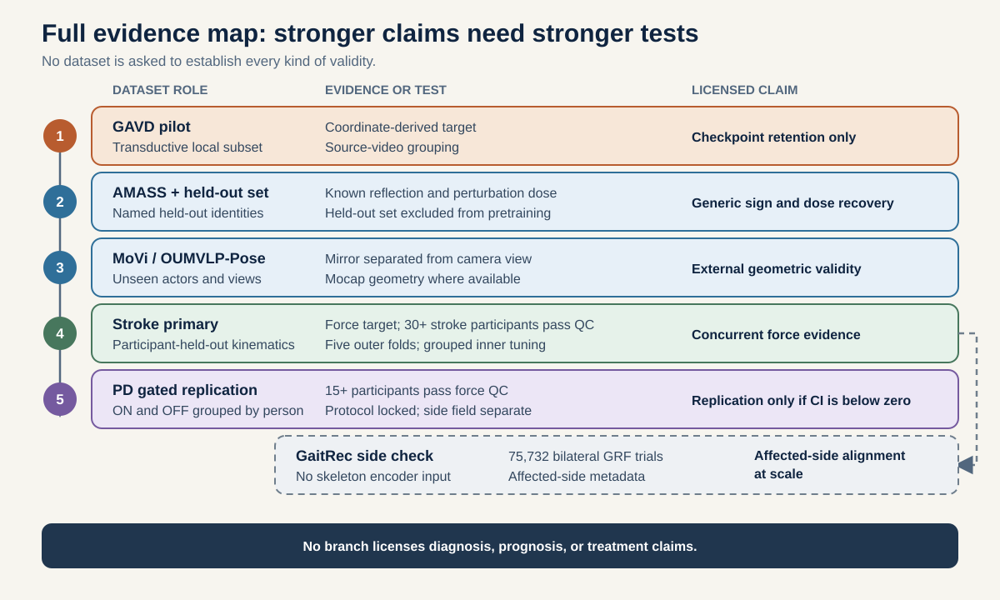
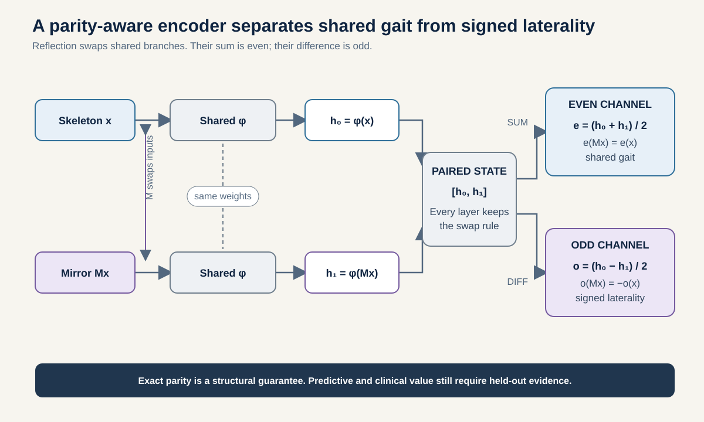
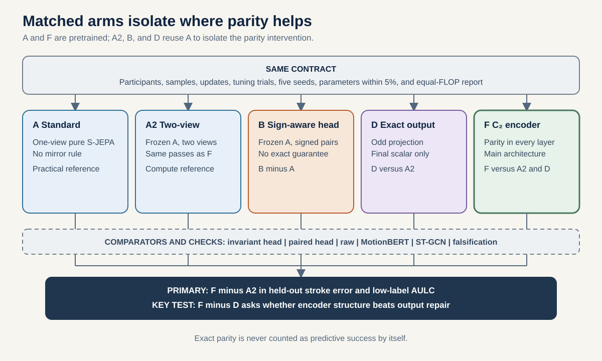
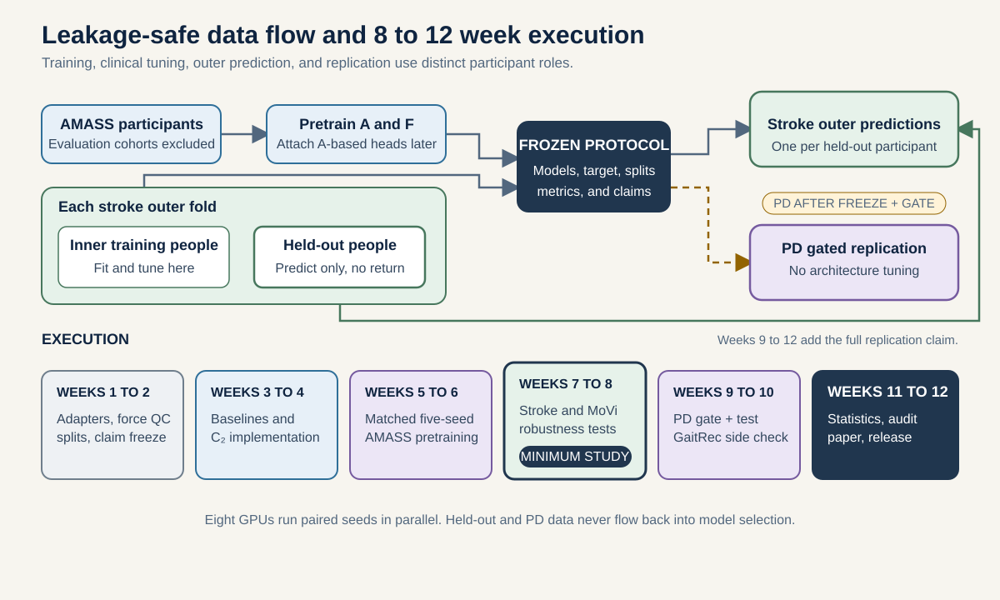

# Methodology tutorial: 8 to 12 week parity-aware gait study

> **Companion proposal:** [README_8_12_WEEK.md](./README_8_12_WEEK.md)
> **Minimum study:** 8 weeks, ending with external geometry and one primary clinical cohort
> **Full study:** 12 weeks, adding locked clinical replication and convergent target evaluation
> **Compute:** 8 H100 GPUs, planned range 4,000 to 8,000 H100-hours
> **Original preserved:** [METHODOLOGY.md](./METHODOLOGY.md) remains unchanged

## How to use this document

This document teaches the full study and fixes its executable rules. It begins with the physical left-right idea, then defines the data and targets, then builds the model one component at a time. The later steps explain fair comparisons, participant-held-out evaluation, statistics, robustness, and reproducibility.

If the group notation is unfamiliar, read the equations as precise versions of this sentence: **reflecting the anatomy should exchange the model's two internal branches, preserve their average, and reverse the sign of their difference.**

### The complete study in one pass

1. Convert each walking recording into a common sequence of labelled body joints.
2. Train a standard skeleton encoder and a reflection-equivariant encoder on non-clinical motion without clinical labels.
3. Hold their data exposure, training updates, tuning, parameter count, and computation as close as the protocol requires.
4. Freeze both encoders.
5. Train small readouts to predict a right-minus-left force target in a stroke cohort.
6. Test the readouts only on held-out participants.
7. Measure prediction, low-label recovery, reflection behavior, view stability, and corruption robustness.
8. If the stroke study succeeds, open the locked Parkinson's disease replication.

### Essential terms

| Term | Meaning in this study |
|---|---|
| Skeleton sequence | Labelled body-joint coordinates over time |
| Encoder | A network that converts a sequence into features |
| Representation | The features produced by the encoder |
| Readout, head, or probe | A small model that predicts a target from features |
| Anatomical reflection | Exchange all left-right joints and reverse the side-to-side axis |
| Parity | Whether a quantity stays the same or changes sign under reflection |
| Even component | Reflection-stable information, such as shared gait |
| Odd component | Sign-reversing information, such as right-minus-left propulsion |
| Equivariance | A guarantee that internal features follow a declared transformation rule |
| Invariance | A guarantee that an output does not change under a transformation |
| Participant-disjoint | No person occurs on both sides of a training or evaluation split |
| Orbit | The pair containing an input and its anatomical reflection |
| Label budget | The number of labelled participants available for readout training |
| Outer fold | Held-out people used only for final evaluation |
| Inner fold | Training people used to select settings |
| Calibration | Agreement between predicted numerical scale and observed numerical scale |
| AP force | Anterior-posterior ground-reaction force, meaning forward-backward force between the foot and ground |
| ICC | Intraclass correlation coefficient, used here to measure agreement between two non-overlapping contact-based target estimates |
| MAE and nMAE | Mean absolute error and the same error divided by a training-set scale |
| AULC | Area under the learning curve, which summarizes error across label budgets |
| cAUC | Corruption area under the curve, which summarizes added error across corruption severities |
| AUROC | Area under the receiver operating characteristic curve, a threshold-independent ranking measure for two classes |
| Brier score | Mean squared error of predicted class probabilities, where lower is better |
| EMA | Exponential moving average, used to update the JEPA target encoder smoothly |
| VICReg | Variance-Invariance-Covariance Regularization, used to discourage collapsed or redundant features |
| FLOPs | Floating-point operations, used as an approximate measure of computation |

## Step 1: Separate the four scientific questions

The study separates four questions that are often treated as if they were the same:

1. **Decodability:** can a probe recover a signed quantity from a representation?
2. **Output parity:** does a decoded scalar negate under anatomical reflection?
3. **Encoder equivariance:** does every claimed encoder layer transform under a known group action?
4. **Concurrent biomechanical validity:** does the learned quantity agree with a contemporaneous, separately measured biomechanical instrument?

GAVD addresses only the first question and a pilot form of the second. Non-clinical motion and multi-view data address geometry. Stroke supplies the primary independent target. Parkinson's disease supplies an eligibility-gated locked replication. GaitRec supplies convergent target evidence at scale without evaluating the skeleton encoder.

Here **cross-modal concurrent validity** means that a prediction from skeleton motion agrees with a separate force-plate measurement of the same walking period. It is one bounded component of construct validity. It does not prove diagnosis, prognosis, treatment relevance, or every clinical meaning of laterality.

## Step 2: Match every claim to the evidence it needs

The table below is a claim ladder. Passing an early row does not automatically pass a later row. For example, a model can obey reflection perfectly but still fail to predict force.

| Claim | Necessary evidence |
|---|---|
| Coordinate retention | Source-grouped GAVD probe above shuffled and random controls |
| Output antisymmetry | Low $s(Mx)+s(x)$ error on unseen participants |
| View stability | Low $s(Vx)-s(x)$ error with anatomical labels preserved |
| Encoder equivariance | Layerwise commutation under a fixed $C_2$ representation |
| Predictive benefit | Lower participant-held-out force-target error than matched controls |
| Sample-efficiency benefit | Lower normalized error area across fixed label budgets |
| Robustness benefit | Lower integrated corruption degradation with corrected inference |
| Cross-modal concurrent validity | Participant-held-out prediction of contemporaneous, independently measured force |
| Cross-clinical replication | PD force gate passes and the participant-bootstrap interval for the locked effect lies below zero |

The protocol and claim table are frozen before primary stroke inference. Architecture, targets, statistics, and wording are frozen again before any PD model result is inspected. A negative PD point estimate whose interval overlaps zero is called directional consistency, not replication.

## Step 3: Define reflection, viewpoint, and equivariance

### 3.1 Anatomical reflection exchanges body sides

Let $x\in\mathbb{R}^{T\times J\times C}$ be an anatomically labelled skeleton with $T$ time points, $J$ joints, and $C$ coordinate channels. Let $P_{LR}$ swap every semantic left-right joint pair, and let $R_{ML}$ negate the mediolateral, or side-to-side, coordinate. Define:

$$
M=P_{LR}R_{ML},
\qquad M^2=I.
$$

Masks, confidences, and joint metadata follow the same permutation. Time is unchanged.

An even target obeys:

$$
y_e(Mx)=y_e(x).
$$

An odd target obeys:

$$
y_o(Mx)=-y_o(x).
$$

### 3.2 A viewpoint change does not exchange body sides

A view operation $V$ changes rigid frame or camera projection without changing anatomical identity. Its desired signed behavior is:

$$
y_o(Vx)\approx y_o(x).
$$

A rear, frontal, or contralateral camera is not treated as an anatomical mirror. Any image flip used by a pose estimator is undone or explicitly propagated through semantic joint labels before evaluation.

### 3.3 An odd final output is weaker than an equivariant encoder

For any scalar model $q$, an exact odd output can be constructed:

$$
q_o(x)
=
\frac{q(x)-q(Mx)}{2}.
$$

The subtraction cancels any part that is unchanged by reflection and keeps the sign-changing part. It proves only output antisymmetry.

A fully equivariant encoder must satisfy:

$$
E_\ell(Mx)=\rho_\ell(m)E_\ell(x)
$$

for every layer $\ell$ called equivariant and a fixed, declared group action $\rho_\ell(m)$. In plain language, reflecting before the layer must match applying the layer first and then transforming its features by the declared rule.

## Step 4: Give every dataset one permitted role

The design uses an evidence ladder because no available dataset contains ideal skeletons, force, clinical labels, multiple views, and a large number of independent participants at once.

### 4.1 GAVD is a transductive pilot

Use the local 96-sequence canonical subset, grouped by its 18 source videos. Audit the existing $d0acc262$ checkpoint without retraining.

Report:

- its historical exposure to all evaluated rows;
- its label-aware group loss in stages 1 to 4;
- its 159-sequence, 35-source training curriculum;
- its coordinate-derived signed excursion target;
- every source video as the independent plotted unit.

The historical coordinate function is left minus right. Multiply it by -1 in revised displays so every target follows the study-wide right-minus-left convention. Preserve the original stored value and record the transformation in the target registry.

Restrict the primary GAVD pilot table to rows from the common canonical extraction path. Use the full local subset only as a sensitivity analysis with provenance in the nuisance model. Do not infer condition effects from acquisition routes that differ between normal and abnormal rows.

No GAVD result enters the primary cross-dataset estimator.

### 4.2 AMASS supplies non-clinical pretraining motion

Pin the referenced AMASS release with 344 subjects, 11,265 motions, and about 40 hours [1]. Build a subject manifest across constituent datasets. Remove:

- MoVi and any other downstream evaluation collection;
- any known or suspected duplicate evaluation subject;
- sequences without reliable body-side semantics;
- non-walking motions from the main gait pretraining arm.

Use broader non-gait motion only in a prespecified diversity ablation. Split by subject, never by motion clip.

### 4.3 OUMVLP-Pose is an optional 2D view stress test

The underlying OU-MVLP has 10,307 people across 14 view angles [2]. The pose release is a separate resource with OpenPose and AlphaPose sequences [3]. Its 18-joint representation ends at the ankle, so it uses a separate reduced 2D schema and never enters foot-level or primary 3D comparisons.

Keep all views, directions, and repeat walks from one person together. Use this dataset for optional 2D pretraining and large-scale view stability. Do not use camera angle as a mirror label and do not infer clinical laterality.

### 4.4 MoVi checks geometry with calibrated views

MoVi contains 90 actors with optical motion capture, video, and IMUs [4]. Use:

- walking motions only for the main geometry analysis;
- the two stationary synchronized, calibrated cameras for cross-view comparison;
- mocap as the clean 3D reference;
- held-out actors only.

The handheld phone views are excluded from calibrated comparisons. MoVi is removed from AMASS pretraining if present in the selected release.

### 4.5 Stroke is the primary clinical cohort

Use the public recordings from 50 stroke survivors and 138 able-bodied adults [5]. Input is full-body kinematics mapped to the common skeleton. The primary target is constructed from raw, rechecked force plates.

The release notes incomplete and incompletely audited kinetic coverage for stroke. A week-1 eligibility gate requires at least 30 stroke participants with clean bilateral input, two valid force contacts per side, and a force target that passes the split-contact consistency rule in Section 6.1. All exclusions and manual reviews are blinded to model arm and prediction.

Healthy participants contribute:

- self-supervised adaptation only within outer-training folds when that ablation is enabled;
- normative signed-target distribution;
- an even stroke-status control;
- no invented affected-side label.

### 4.6 Parkinson's disease is the locked replication

Use the 26-participant ON and OFF medication dataset with raw markers, bilateral forces, and clinical metadata [6]. The released side field is categorical and condition-specific. Some records are missing, undetermined, or change designated side between medication conditions. It is not treated as a continuous UPDRS asymmetry score or collapsed into one stable participant label.

Before any PD model result is inspected, run two separate gates:

1. **Force gate:** verify item-level participant, condition, marker, and force mappings, then require at least 15 participants with a valid bilateral force target in at least one condition under the same minimum-contact and split-contact consistency rules used for stroke. Construct split A and split B separately within each limb and medication condition. Estimate ICC over eligible participant-condition records and cluster the confidence-interval bootstrap by participant.
2. **Clinical-side gate:** retain only condition records with an explicit left or right categorical label. Preserve ON and OFF labels separately, including genuine switches, and exclude missing or undetermined records only from this endpoint.

All medication states and trials from one person stay together. Features, force targets, and clinical-side fields remain condition-specific. The confirmatory replication is a fixed-protocol participant-held-out PD refit with architecture and head hyperparameters frozen from stroke. A strict stroke-trained cross-dataset transfer is a harder secondary analysis. Average condition-specific model effects to one effect per participant only after condition-level prediction. No healthy control is invented for this dataset.

If the force gate fails, PD is descriptive and cannot support a cross-clinical force claim. If the clinical-side gate fails, omit the clinical-side endpoint without changing the force analysis.

### 4.7 GaitRec checks the force target at larger scale

GaitRec contains 2,084 patients, 211 healthy controls, and 75,732 bilateral GRF trials, including affected-side metadata [7]. It has no skeleton input.

Use unilateral records to test whether the force-derived signed target aligns with affected side at scale. Group every session and trial by participant. Compensation can reverse an expected direction, so this is convergent target evaluation in a musculoskeletal setting. It does not validate the target by itself, evaluate the encoder, or establish neurological generalization.

### 4.8 Cerebral palsy data remain compatibility-gated

The referenced release contains 356 patients and 1,719 trials, with processed gait variables and repeated sessions [8]. It is not assumed to contain raw skeleton tensors or a signed affected-side label.

Include CP only if:

- participant IDs link every session and trial;
- input variables can be mapped without reconstructing unsupported coordinates;
- signed-side metadata are directly documented;
- the resulting test was frozen before PD inference.

Otherwise use the release only for pattern-level target sensitivity or omit it.

## Step 5: Convert every dataset into auditable model input

### 5.1 Use a shared anatomical joint schema

An adapter translates each dataset's joint names, coordinates, timing, and metadata into one declared format. It must never use the outcome or a test prediction to decide how a joint is mapped.

The core 3D schema contains:

- pelvis center;
- bilateral hip, knee, ankle, heel, and toe or forefoot;
- optional bilateral shoulder when direct mappings pass quality control.

For AMASS, hip, knee, and ankle come from the fixed SMPL joint regressor. Heel and forefoot are fixed virtual markers derived from declared SMPL mesh vertices or barycentric surface points and verified after reflection. If that rule fails geometry checks, remove heel and forefoot from every primary 3D adapter rather than inventing a dataset-specific joint.

The optional OUMVLP-Pose track uses a separate pelvis, shoulder, hip, knee, and ankle 2D schema. It is never silently padded with heel or toe landmarks and is not pooled with primary 3D clinical inputs.

Each dataset adapter outputs:

$$
(x,\; mask,\; confidence,\; time,\; participant,\; trial,\; session,\; view,\; provenance).
$$

Store direct marker mappings and derived midpoint formulas in versioned YAML or JSON. No mapping may use target values or test predictions.

### 5.2 Give coordinates the same physical meaning

For each trial, derive a forward, vertical, and mediolateral basis from calibration and within-trial geometry. Center on pelvis and scale by robust leg length. Save the affine transform.

Dataset-level standardization, imputation, and nuisance adjustment are fitted only from the relevant training participants.

### 5.3 Preserve the order of events in each gait cycle

Use a frozen marker-only event detector for the primary skeleton input. Validate it against force events on training participants only. This separation is important: force may define the force-target stance interval, but it must not quietly enter the skeleton input through segmentation. A provided-event analysis is a labelled sensitivity check.

Resample the whole body jointly over the gait cycle. Preserve unnormalized timing channels. Build phase-aware features with eight bins, because global mean and standard deviation discard the temporal ordering needed for gait. For stroke, healthy, and non-clinical supervised analyses, take the componentwise median of cycle embeddings within each trial and then the componentwise median across trials, producing one original-view and one reflected-view feature vector per participant before fitting. For PD, apply the same aggregation separately within each participant and medication condition, producing one pair of feature vectors per participant-condition record. Never aggregate ON and OFF records before prediction. Self-supervised and adaptation batches use participant-balanced sampling.

### 5.4 Apply quality rules before model comparison

Automated checks cover:

- non-finite coordinates;
- gap length;
- marker swaps;
- bone-length coefficient of variation;
- velocity and acceleration spikes;
- consistent axis direction;
- force-contact side;
- force baseline and drift;
- trial duration and gait-cycle completeness.

Human review is allowed only for preregistered ambiguous force or marker cases. Reviewers see raw signals and metadata, not model identity or prediction.

## Step 6: Define targets with the correct reflection behavior

### 6.1 Build the primary target from bilateral force

The anterior-posterior, or AP, ground-reaction force measures forward-backward interaction with the ground. The positive AP impulse is the area under only the forward-propulsive part of that force during stance.

After validating the AP axis, normalize AP force by body weight. For side $s$, integrate the positive anterior component over stance using the established limb-contribution definition [21]:

$$
J_s
=
\int_{stance}\max(F_{AP,s}(t),0)\,dt.
$$

Eligibility requires at least two clean, correctly sided contacts per limb. Take the participant median across technically valid contacts. Define:

$$
y_{prop}
=
\log\left(
\frac{J_R+10^{-6}}{J_L+10^{-6}}
\right).
$$

The constant is in body-weight seconds and protects only numerical evaluation. Eligibility requires positive impulses, so it does not define the result.

The logarithmic ratio is zero when the two sides are equal, positive when right is greater, and negative when left is greater. The anatomical target is retained exactly as right minus left. A second paretic-aligned view is derived from metadata for interpretation. The study does not assume that compensation must have a fixed direction.

Before any model is fitted, order valid contacts separately within each limb. Put odd-indexed contacts into split A and even-indexed contacts into split B. Then construct two non-overlapping bilateral target estimates, each using both limbs.

Estimate agreement between these estimates with a two-way random-effects, absolute-agreement, single-measure ICC across eligible stroke participants. This is a within-session consistency check, not test-retest reliability. The force primary requires at least 30 eligible stroke participants, ICC at least 0.60, and the 2.5th bootstrap percentile, the lower endpoint of the two-sided 95% interval, above zero. Failure activates the fallback in Section 6.2.

Bootstrap contacts within each side only for participants with at least three contacts per side. The primary analysis remains equally weighted by participant. Inverse-uncertainty weighting is a sensitivity analysis restricted to participants with estimable uncertainty. Contacts never become independent clinical samples.

### 6.2 Fall back to documented side only if force quality fails

The fallback changes a continuous regression problem into a two-class prediction problem. It can test signed-side recovery, but it cannot support the independent-force or cross-clinical force claims.

If the stroke count or split-contact consistency gate fails, use documented paretic side among stroke survivors with an unambiguous label. Encode right paretic as $+1$ and left paretic as $-1$. Do not infer side from movement, force, file names, diagnosis text, or model output.

Every learned arm produces a real-valued score $s_i$. Fit the fallback head with class-weighted logistic loss, using training weight $N_{train}/(2N_{g,train})$ for class $g$, plus the arm's prespecified L2 penalty. Select only that penalty inside the grouped inner loop using class-balanced logistic loss. Define $p_i=\sigma(s_i)$ and $\hat y_i=+1$ if and only if $s_i\ge 0$. The zero threshold is frozen and is never tuned on validation or test labels.

For participant $i$ in side class $g$, define

$$
L_i=
\frac{N\,\mathbf{1}(\hat y_i\ne y_i)}{2N_g},
$$

where $N$ is the pooled out-of-fold participant count at the evaluated label budget and $N_g$ is its count in class $g$. The mean is balanced error. Use it at full labels and integrate it across the same label budgets for balanced-error AULC. The primary contrast remains F versus A2, the AULC smallest effect of interest remains $-0.03$, and the full-label noninferiority margin remains $+0.02$. Use a paretic-side-stratified participant bootstrap that recomputes class weights in every resample.

This fallback deletes the independent-force concurrent-validity and cross-clinical force claims. Force and signed spatiotemporal ratios become secondary.

The fallback is confirmatory only if every stroke outer-training fold contains at least two eligible participants from each paretic-side class. A label budget is usable only if its nested prefix contains at least two participants per class in every fold. Remove an unusable budget globally. At least two common budgets must remain. If these conditions fail, side recovery is secondary only and no week-8 clinical headline is made.

### 6.3 Secondary odd targets change sign under reflection

- signed step-length log ratio;
- signed stance-time log ratio;
- signed swing-time log ratio [9];
- stroke paretic side;
- PD condition-specific categorical most-affected side, if its metadata gate passes;
- GAVD signed coordinate excursion, pilot only.

Log ratios are used only for strictly positive summaries. They are never applied directly to a force trace that crosses zero.

### 6.4 Even controls should not change sign

- walking speed;
- total movement amplitude;
- stroke versus healthy status;
- medication state in PD;
- subject-level demographic covariates used only for stratified error analysis.

Even controls should remain stable under $M$. A model that flips them has learned an invalid parity rule.

### 6.5 Controlled one-sided changes test mechanism recovery

In held-out MoVi actors, or in a named AMASS participant subset excluded from every pretraining and development manifest, alter one side at fixed 5%, 10%, 20%, and 30% levels in joint-rotation space, followed by forward kinematics. Enforce joint limits, bone lengths, and foot-ground plausibility.

Test recovery of known side and monotonic dose. These examples are geometry checks, not simulated clinical patients and not part of clinical training.

## Step 7: Build the standard and equivariant encoders

### 7.1 Start with a standard skeleton JEPA

A joint-embedding predictive architecture, or JEPA, learns by predicting hidden internal features rather than reconstructing every coordinate. S-JEPA applies this idea to skeleton tokens indexed by time and joint. VICReg regularization discourages the representation from collapsing to an uninformative constant.

The standard comparator uses skeleton tokens indexed by time and joint. A context encoder predicts target-encoder representations of masked tokens [10-13]. The target encoder is an exponential-moving-average copy.

The main standard loss is:

$$
\mathcal{L}_A
=
\mathcal{L}_{JEPA}
+\lambda_v\mathcal{L}_{VICReg}.
$$

There is no condition-label group loss. This is the pure self-supervised comparator.

### 7.2 Lift each input into a two-branch reflection orbit

The reflection group $C_2$ contains two elements: do nothing, written $e$, and reflect, written $m$. The model stores one feature branch for each element.

Create a regular group representation:

$$
h^0_e(x)=\phi(x),
\qquad
h^0_m(x)=\phi(Mx).
$$

Reflection swaps $h_e$ and $h_m$. At each linear mixing step, use the tied equations:

$$
h'_e=Ah_e+Bh_m,
$$

$$
h'_m=Bh_e+Ah_m.
$$

The repeated $A$ and $B$ blocks are tied. Exchanging the input branches therefore exchanges the output branches in exactly the same way. This is what it means for the block to commute with branch exchange.

For the matched pretraining orbit, let $x_e=x$, $x_m=Mx$, and let $z_{A,g}$ and $h_g$ denote the A and F representations at the same regularized layer and valid token positions. Use the exact objectives

$$
\mathcal{L}_A^{orbit}
=
\frac12\sum_{g\in\{e,m\}}
\left[
\mathcal{L}_{JEPA,A}(x_g)
+\lambda_v\mathcal{L}_{VICReg}(z_{A,g})
\right],
$$

$$
\mathcal{L}_F^{orbit}
=
\frac12\sum_{g\in\{e,m\}}
\left[
\mathcal{L}_{JEPA,F,g}(x_e,x_m)
+\lambda_v\mathcal{L}_{VICReg}(h_g)
\right].
$$

Compute VICReg variance and covariance statistics separately for each branch over the same batch and valid-token axes used for the corresponding A view, then average the two scalar branch losses. Do not concatenate branches, mix even and odd channels, or sum branch losses. A and F use the same $\lambda_v$, VICReg variance and covariance coefficients, numerical epsilon, valid-token denominator, and batch-statistic convention. There is no label-aware or condition-aware loss in either objective. Applying the same branchwise functional preserves the branch-swap action.

### 7.3 Preserve the branch-swap rule through every layer

Every claimed equivariant block must satisfy all of the following:

- shared query, key, value, and feed-forward weights across group branches;
- relative attention biases tied across reflection orbits;
- paired joint positional encodings that transform under the joint permutation;
- identical normalization affine parameters across branches;
- shared pointwise nonlinearities applied in the regular representation;
- residual connections that join the same representation type;
- paired context and target masks under the anatomical joint permutation;
- dropout and stochastic-depth masks shared under the branch swap, or rates set to zero in both A and F if tied masks are unavailable;
- EMA updates applied identically to both target branches.

Even and odd irreducible components are read only after group-preserving layers:

$$
h_+=\frac{h_e+h_m}{2},
\qquad
h_-=\frac{h_e-h_m}{2}.
$$

General gait tasks may use both. Signed laterality probes use $h_-$. Even controls use $h_+$.

### 7.4 Test equivariance rather than assuming it

For every layer $\ell$:

$$
e_{eq,\ell}
=
\frac{
\|E_\ell(Mx)-\rho_\ell(m)E_\ell(x)\|_2
}{
\|E_\ell(x)\|_2+\epsilon
}.
$$

Test random tensors, real clean sequences, missing-joint masks, training-mode tied stochastic masks, evaluation mode, and mixed precision. Set numerical tolerance from float precision and accumulated depth before training. If any layer fails, the implementation is not called fully equivariant.

### 7.5 Verify that correct geometry still carries information

Monitor by layer and parity channel:

- per-dimension standard deviation;
- covariance off-diagonal energy;
- effective rank;
- mean pairwise cosine;
- token prediction loss;
- even and odd channel energy;
- cross-channel redundancy;
- sensitivity to side shuffling.

An odd channel of all zeros is geometric but useless. A high-variance odd channel that predicts only view or missingness is also a failure.

## Step 8: Compare arms under fair exposure and compute rules

The main scientific comparison is not “a large model versus a small model.” It is “a standard organization versus a reflection-equivariant organization” under the same participants, view exposure, updates, tuning budget, and nearly matched parameters and computation.

| Arm | Definition | Required comparison |
|---|---|---|
| A | Pure standard S-JEPA | Standard reference |
| A2 | Frozen A encoder plus unconstrained shared-head two-view readout | Equal-FLOP reference for F |
| B | Frozen A encoder plus sign-aware supervised mirror pairs | Learned, non-guaranteed output parity |
| C | Frozen A encoder plus invariant supervised mirror pairs | Sign-erasure negative intervention |
| D | Standard frozen encoder plus exact odd projection | Output-only guarantee |
| E | Frozen A encoder plus shared paired-joint right-minus-left head | Structured-head ablation |
| F | Fully $C_2$-equivariant S-JEPA | Main architecture |
| G | Historical hybrid checkpoint | GAVD supervision audit |
| H1 | MotionBERT | Pretrained motion baseline [14] |
| H2 | ST-GCN-family model | Graph baseline [15] |
| I | Raw phase-aware kinematics and clinical features | Non-neural reference |
| J | Random, shuffled, nuisance-only, even-only, side-agnostic | Falsification |

Pretraining fairness rules for A and F:

- the primary regime is paired-exposure and equal-update matching;
- each sampled base window supplies the same $x$, $Mx$, and reflection-paired mask orbit to both models;
- A treats $x$ and $Mx$ as two ordinary augmented examples and averages their two standard JEPA losses, while F processes them as the two branches of its regular representation;
- F uses the exact branch-averaged JEPA plus VICReg objective in Section 7.2, with the same valid-token and batch-statistic normalization as A;
- identical pretraining participants, base windows, total view tokens, update count, optimizer family, schedule, and tuning trials;
- five paired seeds;
- F width and feed-forward expansion are fixed during development so both trainable parameters and measured forward-plus-backward FLOPs per anatomical orbit remain within 5 percent of A;
- report measured training FLOPs for the primary regime and run the separately defined equal-FLOP sensitivity in Section 9.1;
- at downstream inference, A2 runs the frozen A encoder on $x$ and $Mx$, and its measured inference FLOPs must remain within 5 percent of F;
- downstream probes have the same selection budget, and all stated readout parameter tolerances are verified from actual counts.

A2, B, C, D, and E reuse the exact frozen A checkpoint for each seed. None is separately pretrained. This isolates downstream parity structure from pretraining randomness.

No main arm receives more clinical labels, favorable subsets, or additional test-time augmentation.

If simultaneous exposure, parameter, and per-orbit FLOP matching cannot be achieved within 5 percent, report exposure-matched and equal-FLOP results as different estimands and do not describe the architecture contrast as fully compute matched or causal.

## Step 9: Train without changing rules between arms

### 9.1 Pretrain A and F on the same non-clinical motion

Pretrain only A and F on the frozen AMASS walking manifest. During development, use participant-disjoint pretraining validation to choose one shared update count $K$, or prespecify $K$ directly. Freeze that single value before the five main seeds. Main A and F runs never stop separately by arm or seed. A participant-balanced sampler prevents people with more motions from dominating updates.

Tune shared optimizer and masking ranges in a small development sweep. Freeze them before the five main seeds. Do not tune each model with a different search budget.

Let $K$ be the frozen primary update count. In every primary update, A and F receive the identical sampled base windows, their anatomical reflections, and the same paired mask orbits as specified in Section 8. This means both models see the same content the same number of times. The paired-exposure, $K$-update checkpoint supplies every headline result.

Before the five main seeds, profile training FLOPs per complete update, $f_A$ and $f_F$, using the final implementations after warm-up. The profile includes context encoder, target encoder, predictor, loss computation, and backward pass for the same orbit batch shape. Freeze a common sensitivity budget

$$
B_{FLOP}=K\min(f_A,f_F).
$$

Train a separate A and F sensitivity checkpoint for $\lfloor B_{FLOP}/f_m\rfloor$ complete updates for model $m$, using the same participant sampler, paired inputs, seeds, and a schedule parameterized by fraction of allotted updates. Run the same downstream protocol on these checkpoints. This sensitivity matches total pretraining FLOPs to within one expensive update but may expose the models to different numbers of windows. It cannot replace the primary exposure-matched result. Report any reversal explicitly.

### 9.2 Keep clinical adaptation separate and participant-safe

The primary stroke evaluation freezes the non-clinical encoder and trains the regularized linear heads defined below on one aggregated feature vector per stroke participant. The PD replication instead uses one vector per participant-condition with total participant weight one, as defined in Sections 5.3 and 10.3. This asks what the generic representation already makes accessible without allowing people with more cycles or conditions to receive more supervised weight.

A secondary adaptation arm may continue JEPA training on outer-training clinical participants without labels. It is rerun inside every outer fold. It cannot see outer-test participants and is reported separately from the frozen main result.

### 9.3 Train each readout through its actual final formula

Let the shared scalar head be $q(h)=w^Th$, with zero bias and embedding dimension at least 64. Arm B trains an ordinary one-view head on original and reflected signed pairs:

$$
(x,y),\quad(Mx,-y).
$$

For even targets, its reflected label remains $y$. Arm C is the deliberately incorrect negative intervention: it trains the same one-view family on $(x,y)$ and $(Mx,y)$ even though the target is odd.

Arm A uses $s_A(x)=q_A(E_A(x))+c_A$. Arms B and C use the same affine one-view family. For force, all learned heads minimize L2-regularized squared error, with the penalty selected by inner-fold MAE. For the categorical fallback, all heads use the class-weighted logistic loss and fixed zero-score decision rule in Section 6.2.

Arm A2 computes

$$
s_{A2}(x)=a q(E_A(x))+b q(E_A(Mx))+c,
$$

with $q,a,b,c$ optimized jointly. It reuses the frozen A encoder and is not a separately pretrained model. Its three extra scalar parameters keep its readout within 5 percent of D.

Arm D computes:

$$
s_D(x)=\frac{q(E_A(x))-q(E_A(Mx))}{2}.
$$

For D, optimize $q$ directly against the target through this projected two-pass output. Do not fit a one-view head and project it afterward.

Arm E applies one shared joint function to paired joint features and subtracts right minus left before its scalar map. It is a structured head, not an encoder-equivariance claim.

For F, scale each odd feature using a positive scale estimated from outer-training participants without mean centering, then use

$$
s_F(x)=w_F^T h_-(x)
$$

with no bias. Any nonlinear secondary probe must use odd activations with no biases or apply a final exact odd projection. This prevents the downstream probe from destroying F's signed parity.

## Step 10: Evaluate on people who did not shape the model

### 10.1 Use nested participant folds in stroke

The outer folds estimate final performance. The inner folds select regularization using only outer-training participants. All trials, windows, reflections, and visits from one person stay together.

Create five participant-disjoint outer folds. Stratify stroke survivors by paretic side and coarse severity where possible. In each outer fold, branch the data once into outer-training participants and untouched held-out participants. Only the outer-training branch enters grouped inner tuning. There is no information or fitted object flowing back from the held-out branch.

The primary force or fallback head and all primary label budgets contain eligible stroke survivors only. Healthy participants contribute only to training-only self-supervised adaptation, normative analysis, and even controls. Within the outer-training participants:

- fit target and feature transforms;
- select probe regularization;
- create label-budget subsets;
- fit optional clinical adaptation;
- estimate nuisance adjustments.

Produce one out-of-fold prediction per participant. Use the frozen componentwise-median participant aggregation before both head fitting and inference.

### 10.2 Compare recovery at fixed label budgets

Use 4, 8, 16, and all eligible outer-training stroke participants.

For each outer fold, freeze 20 paretic-side-stratified random rankings of eligible outer-training stroke survivors. Independently shuffle the two side strata, alternate between them until one is exhausted, then append the remainder. The 4, 8, and 16 person budgets are nested prefixes of each ranking. All arms receive the same people and ranking. The all-eligible subset is unique and is fitted once per model seed rather than counted as 20 draws. The outer test fold remains fixed.

At budget 4, select regularization by leave-one-participant-out validation inside that labeled subset. At budgets 8 and above, use four grouped inner folds when both side classes can appear in every fold; otherwise use leave-one-participant-out validation. The two-per-class prefix rule in Section 6.2 guarantees that every leave-one-out training set still contains both classes. Freeze the grid and tie-breaking rule before outer inference.

### 10.3 Open the locked Parkinson's disease replication only after stroke

The PD analysis is intentionally rigid. It reuses the architecture, target, head family, and regularization logic selected without PD outcomes. Medication conditions remain separate records, but each person receives total weight one.

After stroke choices are frozen and before model results are inspected:

1. verify every released PD participant, medication-condition, force, marker, and categorical side field used by the study;
2. apply the force and clinical-side eligibility gates from Section 4.6;
3. map eligible PD records with the already frozen common schema and compute the same force target;
4. create exactly five fixed participant folds with seed 2027, balancing one-condition versus two-condition availability where possible, and keep every ON and OFF record from one person in one fold;
5. run one five-fold confirmatory fixed-hyperparameter PD refit with no repeated partitions and no inner tuning;
6. report strict stroke-trained encoder-and-head transfer as a harder secondary analysis;
7. retain condition-specific clinical-side labels and never force a stable participant side;
8. average condition-specific architecture effects to one effect per participant before resampling.

PD data cannot change the headline architecture, target, head family, regularization, corruption set, or success rule. Choose regularization separately for each arm. Within each stroke outer fold and candidate penalty, average inner-validation loss across the five encoder seeds, choose the minimum-loss penalty with ties going to the stronger penalty, and thereby obtain one value per arm and fold. Take the mode across the five folds, again breaking ties toward the stronger penalty, and freeze that arm-specific value for every PD fold. Use force-head inner loss for the force replication and the separately fitted stroke paretic-side classifier loss for the PD side endpoint. Within a PD training fold, refit only training-derived feature scales and head coefficients. If fewer than 15 participants pass the force gate, all PD model comparisons are descriptive.

Let $C_i$ be the eligible medication conditions for participant $i$. Give each condition record training weight $1/|C_i|$, so every participant has total weight one. Average the five paired-seed predictions before calculating loss. For force, define the participant-level architecture effect

For example, a participant with both ON and OFF records gives weight $1/2$ to each record. A participant with only one eligible condition gives weight 1 to that record. Both people therefore contribute total weight 1.

$$
\delta_i
=
\frac{1}{|C_i|}
\sum_{c\in C_i}
\left(
|\hat y_{F,ic}-y_{ic}|
-
|\hat y_{A2,ic}-y_{ic}|
\right).
$$

The confirmatory contrast is the mean of $\delta_i$, and its interval bootstraps participants. For F's seed-averaged out-of-fold condition predictions, define $w_{ic}=1/|C_i|$. Fit the intercept $\alpha_F$ and slope $\beta_F$ by choosing the values that minimize:

$$
\sum_i\sum_{c\in C_i}
w_{ic}(y_{ic}-\alpha_F-\beta_F\hat y_{F,ic})^2.
$$

The gated calibration slope is $\beta_F$, from the regression of observed target on prediction with an intercept. A slope of 1 means the predicted scale matches the observed scale. A slope far below 1 means predictions vary too widely, while a slope far above 1 means they vary too little. Define

$$
\bar y_w=\frac{1}{N}\sum_i\sum_c w_{ic}y_{ic},
\qquad
b_F=\frac{1}{N}\sum_i\sum_c w_{ic}(\hat y_{F,ic}-y_{ic}),
$$

$$
SD_w(y)
=
\sqrt{
\frac{1}{N}
\sum_i\sum_c w_{ic}(y_{ic}-\bar y_w)^2
}.
$$

The bias $b_F$ is the average signed prediction error. Positive bias means overprediction and negative bias means underprediction. The fixed gate is $|b_F|\le0.5SD_w(y)$. The divisor is exactly $N$, with no Bessel correction. Zero weighted target variance or zero weighted F-prediction variance makes calibration undefined and fails the replication gate. Report the same quantities for A2. All intervals resample participants as clusters. This analysis is a within-PD head refit under a frozen protocol. It is not strict stroke-to-PD head transfer.

For the secondary PD clinical-side endpoint, let $C_i^{side}$ contain only conditions with an explicit left or right label. Use the same five participant folds. Fit a condition-level real-valued logit with the arm-specific modal stroke side-classifier penalty. Give each record base weight $r_{ic}=1/|C_i^{side}|$. Within a training fold, let $W_g=\sum_{i,c}r_{ic}\mathbf{1}(y_{ic}=g)$ and let $N_{side}=\sum_{i,c}r_{ic}$. This endpoint proceeds only if $W_{-1}>0$ and $W_{+1}>0$ in every PD training fold; otherwise omit inferential side metrics and report label counts only. When feasible, multiply each record's logistic loss by $r_{ic}N_{side}/(2W_g)$. Average logits across paired seeds, apply the fixed zero threshold, compute participant-weighted balanced accuracy and AUROC, and bootstrap participants as clusters. Missing, undetermined, and genuine condition-switching records are handled exactly as stated in Section 4.6. This endpoint is secondary and cannot rescue a failed force replication.

### 10.4 Keep non-clinical geometry tests participant-disjoint

All views of a participant stay together. Model selection uses development actors or identities. Report:

- anatomical mirror oddness;
- cross-view stability;
- 2D-pose versus 3D-mocap error on calibrated MoVi views;
- view-stratified nuisance decoding.

Do not describe opposite views as mirrored anatomy.

## Step 11: Compute the outcomes that answer each claim

### 11.1 Primary stroke prediction error

When the stroke force gate passes, the participant-level primary error difference is:

$$
\Delta_{MAE}
=
MAE_F-MAE_{A2}.
$$

F is superior only if the two-sided 95% participant-bootstrap interval lies below zero.

Report raw-unit MAE and training-scale-normalized MAE. Also report untruncated $R^2$, which may be negative when the model is worse than a mean-prediction baseline; concordance correlation, which measures agreement with the identity line; and calibration slope, which compares predicted and observed numerical scale.

When the fallback is active, replace MAE with class-balanced error and use a paretic-side-stratified participant bootstrap. Full-label F is noninferior to A2 only when the upper 95% confidence limit for their balanced-error difference is at most $+0.02$. The fallback supports only the narrower side-label claim defined in Section 6.2.

### 11.2 Sample efficiency across label budgets

The area under the learning curve, or AULC, summarizes error across small and large labelled samples. Lower AULC means the representation is useful with fewer labels across the tested range.

For force, normalize absolute error by $\max[MAD_{train}(y),10^{-6}]$ in the eligible outer-training stroke participants. For each held-out participant and non-full budget, average loss across the 20 frozen subset rankings after averaging regression scores across the five paired model seeds. For the fallback, average seed logits first, then apply the sigmoid and fixed zero threshold before computing class-weighted error.

For each participant, integrate loss by the trapezoidal rule over the retained $\log_2(n)$ values and divide by that outer fold's maximum minus minimum retained $\log_2(n)$. The base-2 logarithm makes each doubling in labelled participants occupy the same horizontal distance. Dividing by the span turns the area into an average curve height. The full budget has one unique subset per seed. At least two common retained budgets are required for a sample-efficiency claim. Average participant areas to form normalized error AULC. Compare F with A2, D, and A using the same rankings. The fallback produces balanced-error AULC on the same normalized budget axis.

### 11.3 Cross-clinical replication

The full cross-clinical replication claim requires:

- at least 15 PD participants to pass the force gate;
- the two-sided participant-bootstrap 95% interval for the mean participant effect $\delta_i$ from Section 10.3 to lie below zero;
- an out-of-fold PD calibration slope for F from 0.5 to 1.5;
- absolute out-of-fold PD mean prediction bias for F no greater than $0.5SD_w(y)$, using the participant-condition weighting and fixed population divisor in Section 10.3.

Report the same calibration quantities for A2, but they do not gate replication. Strict stroke-to-PD transfer is a secondary stress test. A negative PD point estimate whose interval includes zero is reported as directional consistency only. Condition-specific categorical side agreement is a separate secondary endpoint and is reported only when its metadata gate passes.

### 11.4 Reflection and view geometry

Output oddness:

$$
e_{odd}
=
\frac{
\mathbb{E}|s(Mx)+s(x)|
}{
\mathbb{E}|s(Mx)|+\mathbb{E}|s(x)|+\epsilon
}.
$$

The confirmatory view operator is rigid sensor-frame yaw on clean held-out stroke data, not real camera-view invariance. After canonical preprocessing, apply $V_\theta$ at $\theta\in\{-30^\circ,+30^\circ\}$ about the saved vertical axis without swapping joint identities, reprojection, or recanonicalization. Recompute the participant feature independently at each angle. Using full-label out-of-fold scores averaged across paired seeds, define

$$
e_{view,i}
=
\frac{
\sum_\theta |s_i(V_\theta x)-s_i(x)|
}{
\sum_\theta\left(|s_i(V_\theta x)|+|s_i(x)|\right)+\epsilon_v
}.
$$

Here $\epsilon_v=10^{-8}\max(1,\mathrm{median}_{train}|y|)$ within each outer fold. Average $e_{view,i}$ equally over eligible held-out stroke participants, and bootstrap the paired arm difference by participant. For the fallback, $s$ is the pre-threshold logit. Calibrated MoVi cameras provide a separate external camera-view analysis. Layerwise $e_{eq,\ell}$ is reported for F. Exact values for guaranteed models are manipulation checks. Because a collapsed output can look stable, $e_{view}$ can support a claim only together with the predictive criteria in Section 11.7.

### 11.5 Robustness to controlled corruption

The corruption area, or cAUC, measures the extra error caused by increasingly damaged inputs. It is separate from clean prediction error. Lower cAUC means less degradation.

The confirmatory cAUC uses full-label out-of-fold predictions and four equally weighted technical families: coordinate; missingness; time; and schema. Within a family, average its listed subtypes equally. Use normalized severity $u\in\{0,1/3,2/3,1\}$, with physical magnitudes frozen from outer-training data and $u=0$ denoting the same clean input. For force, participant loss is absolute error divided by $\max(MAD_{train}(y),10^{-6})$. For the fallback, participant loss is the class-weighted zero-threshold 0-1 loss from Section 6.2, with no target-scale division.

The schema family is never empty. It applies one deterministic, nested, bilateral whole-sequence slot reduction to the universally required pelvis, hip, knee, and ankle core. At $u=1/3$, mask every optional slot plus both ankles. At $u=2/3$, additionally mask both knees. At $u=1$, additionally mask both hips, leaving only the pelvis. This fixed symmetric schema reduction is distinct from the stochastic and contiguous patterns in the missingness family.

For every stochastic subtype and nonzero severity, generate 20 fixed realizations per participant. Derive each seed from SHA-256 of master seed 2027, cohort, outer fold, participant ID, family, subtype, severity, and replicate index. Use identical corrupted arrays for every arm and model seed. For each realization, average regression scores or logits across the five model seeds before computing loss, then average loss across the 20 realizations. Deterministic subtypes use one realization. Save the full corruption manifest.

For each arm, participant, family, and subtype, subtract the same arm and participant's clean loss from corrupted loss. Average subtypes at each severity, retain negative changes, and integrate with the trapezoidal rule over $u$. Average the four family areas to obtain participant-level cAUC, then average participants equally. The key paired-bootstrap contrast is $cAUC_F-cAUC_{A2}$. View perturbations, gait strata, estimator changes, and destructive left-right identity corruption remain separate analyses and do not enter cAUC. Report raw force-error or balanced-error degradation beside normalized cAUC.

### 11.6 Clinical side and numerical calibration

Report:

- stroke paretic-side and condition-specific PD most-affected-side balanced accuracy, which averages accuracy within the two side classes, and AUROC, which measures ranking across thresholds;
- calibration and Brier score, which measures squared probability error;
- force-target association with paretic or most-affected side;
- sensitivity with and without walking-speed adjustment;
- participant-level plots showing all available trials without counting them as independent.

Affected-side accuracy is secondary because compensation can decouple motion or force sign from the clinically affected side. The PD categorical field measures broad motor laterality and is not treated as gait-specific ground truth.

### 11.7 Apply the frozen claim rules at weeks 8 and 12

The week-8 single-cohort claim that F benefits over A2 uses the paired-exposure, equal-update checkpoints from Section 9.1. It first requires the 5 percent parameter, per-orbit training-FLOP, and downstream inference-FLOP gates in Section 8. It then requires all of the following:

1. every claimed F layer passes its frozen commutation tolerance;
2. the unadjusted 95% participant-bootstrap interval for full-label stroke $MAE_F-MAE_{A2}$ lies below zero;
3. $AULC_F-AULC_{A2}\le -0.03$, with its one-sided superiority test rejected by the exact Holm procedure in Section 12.3;
4. the upper 95% confidence limit for $e_{view,F}-e_{view,A2}$ is at most $+0.02$;
5. the one-sided superiority test for $cAUC_F-cAUC_{A2}$ is rejected by the exact Holm procedure in Section 12.3.

If the fallback is active, item 2 is replaced by an upper 95% confidence limit of at most $+0.02$ for full-label balanced error of F minus A2, and balanced error replaces normalized absolute error in item 3. The claim is limited to side-label recovery. A stronger statement that internal equivariance adds value beyond exact output repair additionally requires rejection of the Holm-family one-sided superiority test for full-label error of F minus D.

The week-12 cross-clinical replication claim additionally requires the PD force gate and every item in Section 11.3. If PD is unavailable or fails its gate, the study stops with the week-8 claim. It does not weaken a threshold, substitute a cohort, or rename directional consistency as replication.

## Step 12: Quantify uncertainty without inflating sample size

### 12.1 Resample people, not their repeated records

A participant bootstrap repeatedly samples people with replacement and recalculates a paired effect. All records belonging to a sampled person travel together. This respects the fact that repeated trials, views, and medication conditions are correlated observations from the same individual.

Resample participants. Never resample strides, clips, views, medication sessions, folds, label-subset rankings, or model seeds as if they were people. Use a paretic-side-stratified bootstrap for the fallback and recompute class weights inside every resample.

Use 10,000 paired participant bootstraps for every success-rule interval. Use master seed 2027 and save each resample-index matrix; reuse it across arms and related endpoints. Use percentile intervals: the two-sided 95% interval is the 2.5th to 97.5th percentiles, while a one-sided upper 95% bound is the 95th percentile. Use paretic-side-stratified resampling for the fallback and recompute class weights inside each resample. For PD replication, bootstrap the per-participant condition-averaged effects from Section 10.3. For PD calibration and bias, resample participants as clusters while retaining all of each sampled person's eligible condition records.

### 12.2 Treat model seeds as uncertainty, not extra patients

Train five paired seeds. Average seed predictions for the primary participant-level comparison and report seed dispersion separately. A hierarchical sensitivity analysis may resample seeds inside participant bootstrap draws, but seed count never increases clinical sample size.

### 12.3 Correct the three prespecified secondary tests

Testing several favorable-looking outcomes increases the chance of a false positive. The Holm procedure controls this family of three superiority tests by applying stricter thresholds to the smallest p-values first.

One primary contrast is F versus A2 on stroke MAE, or on stroke balanced error if the fallback is activated. Apply Holm correction to the key secondary superiority family:

- F versus A2 label-efficiency area;
- F versus A2 corruption area;
- F versus D full-label error.

For each contrast $j$, form one participant-level paired difference $d_{ij}$, with a negative value favoring F. The statistic is $T_j=N^{-1}\sum_i d_{ij}$. Under the zero-centered paired null, independently multiply each participant difference by $+1$ or $-1$. Enumerate all sign patterns when $N\le20$; otherwise draw 100,000 sign patterns with seed 2027. For Monte Carlo draws, compute the one-sided p-value

$$
p_j=
\frac{1+|\{b:T_{jb}\le T_j\}|}
{1+100000}.
$$

Sort the three p-values as $p_{(1)}\le p_{(2)}\le p_{(3)}$. Compare them in order with $0.05/3$, $0.05/2$, and $0.05$. Stop at the first failure. In general, at position $k$, reject $H_{(k)}$ only when $p_{(k)}\le0.05/(3-k+1)$.

Report the adjusted value as $p^{Holm}_{(k)}=\min[1,\max_{r\le k}\{(3-r+1)p_{(r)}\}]$. A required secondary superiority condition passes only when its Holm-adjusted p-value is at most 0.05. Report the prespecified percentile participant-bootstrap 95% intervals from Section 12.1 for effect size, but do not call them Holm-adjusted intervals.

The locked PD comparison is a separate replication gate with its own participant-bootstrap interval, not a member of the stroke secondary family. Other analyses are labelled secondary or exploratory.

### 12.4 Break the proposed mechanism on purpose

- permute targets by participant and rerun the complete probe pipeline;
- shuffle left-right semantic labels within participant;
- compare even-only and side-agnostic features;
- verify that nuisance-only metadata do not reproduce performance;
- use paired original-versus-mirror permutation tests;
- report negative $R^2$, not a value truncated to zero.

### 12.5 Describe achievable precision without moving the goalposts

During week 2, estimate split-contact target consistency and variance without inspecting model comparisons. Simulate detectable paired effects for the eligible participant count. Use this analysis to describe precision and the smallest detectable effect, not to change the outcome gate.

If the study is underpowered for superiority, continue the frozen protocol and report intervals rather than replacing the endpoint.

## Step 13: Apply a frozen robustness matrix

Predefine severities and apply the same corrupted instances to all models:

| Family | Perturbation | Purpose |
|---|---|---|
| Coordinate | Calibrated Gaussian and temporally correlated noise | Marker or pose uncertainty |
| Missingness | Random joint dropout and contiguous occlusion | Occlusion and tracking failure |
| Identity | Left-right landmark swap | Destructive laterality control |
| Time | Frame-rate reduction, temporal gaps, phase shifts | Acquisition and segmentation |
| View | Yaw, calibrated projection, stationary MoVi cameras | View stability |
| Schema | Fixed nested bilateral removal of optional slots, ankle, knee, then hip levels | Cross-dataset adapter sensitivity with a universally nonempty perturbation |
| Gait | Speed strata and cycle-length variation | Physiological nuisance |
| Estimator | At least two pose estimators on MoVi video if feasible | Pose-pipeline dependence |

Corruption thresholds come from training data, instrument accuracy, or MoVi mocap-to-pose residuals. They are frozen before clinical testing.

Only coordinate, missingness, time, and schema enter confirmatory cAUC. Identity swaps test whether laterality semantics matter and therefore cannot be scored as ordinary robustness. View, gait, and estimator rows are reported separately.

## Step 14: Use ablations to identify the source of any gain

An ablation changes one component while holding the rest fixed. It helps explain a result, but it cannot replace the preregistered main comparison.

| Ablation | Question |
|---|---|
| A versus C | Does invariant mirror training erase sign? |
| A versus B | Is learned sign-aware behavior sufficient? |
| A2 versus D | Does exact output projection help beyond two-view information? |
| D versus F | Does internal equivariance add value beyond output repair? |
| Matched GAVD retraining without versus with $L_{group}$ | What changes when only the label-aware group loss changes? |
| Phase-aware versus global pooling | Was temporal information lost at readout? |
| Odd versus even channel | Is side information concentrated in the intended component? |
| Frozen versus training-only adaptation | Is the gain generic or cohort-adapted? |
| Kinematics versus learned features | Does representation learning add predictive value? |
| With versus without speed adjustment | Is the effect a speed proxy? |

The matched $L_{group}$ ablation holds data, curriculum, architecture, optimizer, updates, seeds, and evaluation fixed. Historical checkpoint G is shown only as context because its differing curriculum cannot identify the causal effect of the group loss. Every ablation is subordinate to the main comparison. None can be promoted after test inspection.

## Step 15: Make the study reproducible

### 15.1 Pin compatible tools

Pin compatible versions of:

- ezc3d for C3D markers and force channels;
- NumPy, SciPy, pandas or Polars for signal processing;
- PyTorch for JEPA, group layers, and distributed training;
- scikit-learn for regularized probes, grouped folds, and calibration;
- Hydra or an equivalent immutable configuration system;
- DVC, DataLad, or checksum manifests for dataset provenance;
- MLflow, Weights & Biases, or an append-only local run table;
- pytest for transformations, group commutation, splits, and targets;
- einops or explicit named dimensions for auditable group and token axes.

Optional comparison libraries are used only when their transformation conventions are verified. An equivariance framework such as e3nn is relevant for a later extension to full $O(3)$ parity, but the main $C_2$ implementation remains small enough to test directly [16].

### 15.2 Require tests before inference

- $M(Mx)=x$ for every adapter;
- odd and even target transformation;
- all left-right pair mappings;
- no participant overlap across any split;
- no evaluation dataset inside AMASS pretraining;
- paired masks under reflection;
- tied training-time dropout and stochastic-depth masks, or verified zero rates;
- layerwise commutation in float32 and mixed precision;
- equality of main-arm data exposure and tuning count;
- one supervised feature vector per stroke participant, and one per PD participant-condition with total PD participant weight one;
- PD condition-specific side labels preserved without forced participant-level collapse;
- target recomputation from raw force files;
- recreation of every result table from participant-level predictions.

### 15.3 Release the evidence trail

Release when licenses permit:

- LateralityBench transformation package;
- versioned common schema and adapters;
- anonymous participant manifests and dataset checksums;
- target and quality-control code;
- frozen splits, label subsets, and seeds;
- all main model configurations;
- participant-level predictions;
- layerwise parity diagnostics;
- compute and carbon accounting;
- model card and dataset role cards;
- claims table and negative-result templates.

## Step 16: Follow the 8 to 12 week execution plan

| Week | Work | Hard gate |
|---|---|---|
| 1 | Licenses, checksums, C3D audit, target quality, dataset overlap | At least 30 eligible stroke targets or headline narrows |
| 2 | Common schema, participant folds, precision analysis, claims table, GAVD reproduction | Protocol and primary target freeze |
| 3 | Train A pilot; assemble A2, D, I, and falsification baselines | Two-pass fairness verified |
| 4 | B, C, E, F implementation and layerwise tests | F passes all commutation tests or is relabelled |
| 5 to 6 | Five-seed AMASS pretraining and health monitoring | Encoders frozen |
| 7 | Stroke probes, label budgets, calibration | No architecture changes |
| 8 | Stroke inference, robustness, MoVi geometry | Minimum complete study |
| 9 | PD field and force gates, fixed-protocol refit, and strict transfer | Locked replication opened only after gates |
| 10 | GaitRec convergent target evaluation, optional OUMVLP-Pose and CP gates | Cross-dataset extensions fixed |
| 11 | Ablations, corrected inference, adversarial leakage audit | Results and claim language frozen |
| 12 | Paper, code, model and data cards, benchmark release | Full reproducibility pass |

Compute plan:

- 500 H100-hours for implementation pilots and measured profiling;
- 3,000 to 4,500 for matched five-seed pretraining;
- 1,000 to 1,500 for external baselines;
- 1,000 to 1,500 for prespecified ablations and low-label fits;
- up to 500 for corruption and cross-dataset evaluation.

Re-estimate after one measured epoch in week 2. Report actual consumption. Extra capacity does not authorize post hoc search.

## Step 17: Match every result to allowed wording

| Result | Licensed conclusion |
|---|---|
| GAVD only decodes | The historical checkpoint retains its coordinate-derived target |
| A predicts but is not odd | Laterality is accessible but geometrically entangled |
| D beats A2 | Output organization is a useful inductive bias |
| F beats A2 and D | Encoder structure adds value beyond compute and output repair |
| F does not meet the superiority rule against D | No encoder-level benefit beyond output repair is supported; equivalence is not established |
| Exact parity but poor force prediction | Correct geometry is insufficient for clinical information |
| Raw kinematics beat all models | Learned features add no predictive advantage |
| Stroke succeeds, PD estimate is negative but its interval overlaps zero | Directional consistency only, no replication claim |
| Stroke criteria pass and the PD effect, F calibration, and F bias gates all pass | Cross-clinical replication, with limits from PD sample size |
| Only corruption improves | Robustness benefit without clean predictive benefit |
| Stroke force gate fails | Side-label fallback only, with no independent-force or cross-clinical headline |
| PD force gate fails | Descriptive PD results only |
| F fails commutation | Parity-regularized model, not fully equivariant |
| CP mapping or side metadata fail | CP omitted from signed encoder claims |

## Reference guide

1. Mahmood et al., AMASS, ICCV 2019. [arXiv:1904.03278](https://arxiv.org/abs/1904.03278).
2. Takemura et al., OU-MVLP. [DOI 10.1186/s41074-018-0039-6](https://doi.org/10.1186/s41074-018-0039-6).
3. An et al., OUMVLP-Pose. [DOI 10.1109/TBIOM.2020.3008862](https://doi.org/10.1109/TBIOM.2020.3008862).
4. Ghorbani et al., MoVi. [DOI 10.1371/journal.pone.0253157](https://doi.org/10.1371/journal.pone.0253157), [data DOI](https://doi.org/10.5683/SP2/JRHDRN).
5. Van Criekinge et al., stroke and able-bodied gait dataset. [DOI 10.1038/s41597-023-02767-y](https://doi.org/10.1038/s41597-023-02767-y), [data DOI](https://doi.org/10.6084/m9.figshare.c.6503791.v1).
6. Shida et al., public PD full-body gait dataset. [DOI 10.3389/fnins.2023.992585](https://doi.org/10.3389/fnins.2023.992585), [data DOI](https://doi.org/10.6084/m9.figshare.14896881).
7. Horsak et al., GaitRec. [DOI 10.1038/s41597-020-0481-z](https://doi.org/10.1038/s41597-020-0481-z), [data DOI](https://doi.org/10.6084/m9.figshare.c.4788012).
8. Nieuwenhuys et al., CP gait classification data. [DOI 10.1371/journal.pone.0178378](https://doi.org/10.1371/journal.pone.0178378), [data DOI](https://doi.org/10.6084/m9.figshare.4877432.v1).
9. Patterson et al., gait symmetry after stroke. [DOI 10.1016/j.gaitpost.2009.10.014](https://doi.org/10.1016/j.gaitpost.2009.10.014).
10. Abdelfattah and Alahi, S-JEPA. [DOI 10.1007/978-3-031-73411-3_21](https://doi.org/10.1007/978-3-031-73411-3_21).
11. Assran et al., I-JEPA. [arXiv:2301.08243](https://arxiv.org/abs/2301.08243).
12. Bardes et al., V-JEPA. [arXiv:2404.08471](https://arxiv.org/abs/2404.08471).
13. Bardes, Ponce, and LeCun, VICReg. [arXiv:2105.04906](https://arxiv.org/abs/2105.04906).
14. Zhu et al., MotionBERT. [arXiv:2210.06551](https://arxiv.org/abs/2210.06551).
15. Yan, Xiong, and Lin, ST-GCN. [arXiv:1801.07455](https://arxiv.org/abs/1801.07455).
16. Geiger and Smidt, e3nn. [arXiv:2207.09453](https://arxiv.org/abs/2207.09453).
17. Cohen and Welling, group-equivariant networks. [arXiv:1602.07576](https://arxiv.org/abs/1602.07576).
18. Ranjan et al., GAVD. [DOI 10.1109/ACCESS.2025.3545787](https://doi.org/10.1109/ACCESS.2025.3545787).
19. Kapoor and Narayanan, leakage in ML-based science. [arXiv:2207.07048](https://arxiv.org/abs/2207.07048).
20. Varoquaux, cross-validation with small samples. [DOI 10.1016/j.neuroimage.2017.06.061](https://doi.org/10.1016/j.neuroimage.2017.06.061).
21. Bowden et al., AP ground reaction force as paretic-limb propulsion. [DOI 10.1161/01.STR.0000204063.75779.8d](https://doi.org/10.1161/01.STR.0000204063.75779.8d).
