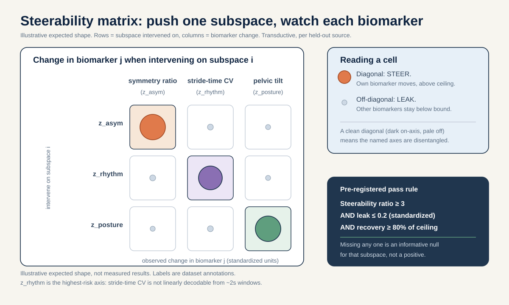
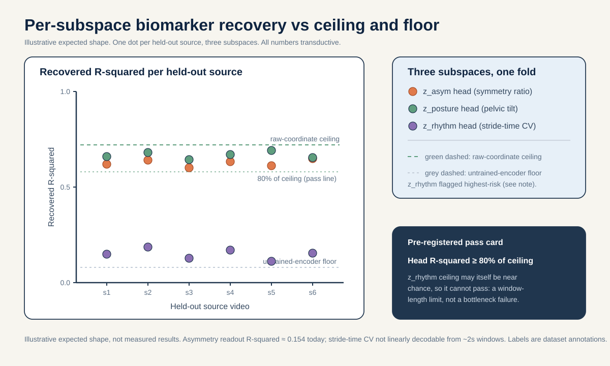

# Concept-bottleneck disentangled S-JEPA: named z_asym / z_rhythm / z_posture subspaces tied to validated biomarkers

> After a full curriculum retrain with three biomarker-supervised latent subspaces, does intervening on one named subspace move only its mechanism-linked biomarker (symmetry ratio, stride-time CV, or anterior pelvic tilt) and leave the other two biomarkers unmoved, by a pre-registered margin, and only where that steerability beats a raw-coordinate probe ceiling?

## The question in plain words

Different gait conditions break walking in mechanistically different ways, and the clinical literature ties each way to a separate, validated number you can measure from the body.

- Some conditions are LATERALIZED: they hurt one side more than the other. A stroke lesion sits on one side of the brain and, because the motor fibers cross over (the pyramidal decussation), it weakens the opposite side of the body (PMID 30571044). Hemiplegic cerebral palsy comes from a one-sided early brain injury to the leg fibers (PMID 19081519). Early Parkinson's often starts on one side because the dopamine loss starts on one side of the brain (PMID 22367437). The validated way to measure "how one-sided is this gait" is the Symmetry Ratio on step length, swing time, and stance time (Patterson 2010, PMID 19932621).
- Parkinson's has a second, different signature: the walking rhythm becomes irregular. The basal ganglia lose their grip on automatic, habitual movement (PMID 20944662, PMID 26102020), so the time between steps wobbles from stride to stride. The validated way to measure that wobble is the stride-time coefficient of variation (stride-time CV): fallers sit near 8.8 percent, non-fallers near 4.2 percent (Schaafsma 2003, PMID 12809998; Hausdorff 1998, PMID 9613733).
- Myopathy is different again: it is a primary muscle disease with symmetric, both-sides weakness of the proximal muscles (PMID 25037080). It does NOT make gait one-sided (PMID 37525241) and it does NOT wreck the rhythm; cadence stays roughly normal. What it does is tip the posture: weak hip extensors let the pelvis tilt forward, so anterior pelvic tilt rises (16.4 vs 11.6 degrees in Duchenne muscular dystrophy, PMID 35721358; hip-extensor weakness drives anterior pelvic tilt, PMID 41034979). The related crouch posture in cerebral palsy is defined as a minimum stance knee flexion of at least 30 degrees (PMID 20300011).

So there are three mechanism-defined axes: one-sidedness (asymmetry), rhythm regularity (variability), and posture. This project trained a self-supervised skeleton model (S-JEPA) that learned by predicting hidden parts of its own input, with no human labels. The trouble is that its learned features mix everything together in one undifferentiated 64-number vector. Notebook 05 could read step amplitude back out reasonably well (R-squared about 0.719) but asymmetry poorly (R-squared about 0.154), and stride-time CV was not linearly decodable at all from roughly 2-second windows.

This proposal asks whether we can retrain the model so that three NAMED slices of its latent space each carry exactly one of those three validated biomarkers, and whether we can then STEER the model: nudge one slice and watch only its own biomarker move.

**Reading the math (a latent subspace).** A latent is one of the numbers the model uses to describe an input. A subspace is a named group of those numbers.
- The full embedding is 64 numbers per token. We reserve three named blocks inside it: `z_asym`, `z_rhythm`, `z_posture`.
- "Intervening on a subspace" means changing the numbers in one block while holding the others fixed, then decoding all three biomarkers to see what moved.
- If the split worked, pushing on `z_asym` changes only the decoded symmetry ratio, not the decoded stride-time CV or pelvic tilt.
- If the split failed, pushing on `z_asym` also drags the other two biomarkers around, which means the axes are entangled.

## Why this matters

A positive result would give a gait representation you can read AND steer one mechanism at a time, with each mechanism anchored to a number a clinician already trusts. That is a stronger object than a black-box embedding: it is a representation whose named parts have external, validated meaning.

The honest caveat is a theorem, not an opinion. Locatello et al. 2019 (ICML) proved that you cannot get disentangled representations for free from unsupervised learning alone; you need inductive bias or supervision. So the whole point of adding biomarker-supervised heads and biased masking is to supply exactly that inductive bias. We name it up front so no reviewer thinks we expect disentanglement to fall out of self-supervision by magic.

An informative null rules out specific beliefs. If, after the retrain, intervening on `z_asym` still moves stride-time CV or pelvic tilt as much as it moves the symmetry ratio, that rules out the belief that per-subspace biomarker heads plus VICReg plus biased masking are enough to disentangle these three gait mechanisms in a small-cohort skeleton JEPA. If the steered subspaces never beat a raw-coordinate probe ceiling, that rules out the belief that the learned representation adds steerable structure beyond what the input coordinates already trivially provide. Both nulls are publishable knowledge (ICLR/ICML/NeurIPS 2026 reward informative negative results that change understanding), because they tell the next builder that the bottleneck design, not the idea of named axes, is what needs to change.

Crucially, the neuroscience DEFINES the three targets and the falsifiable steerability prediction. It does not upgrade an n=18-source cohort into a clinical-accuracy claim. Any clinical-accuracy statement here is external-cohort reach-tier only and is stated as such.

## Background and related work

S-JEPA is a Joint-Embedding Predictive Architecture for skeletons (Abdelfattah and Alahi, S-JEPA, ECCV 2024, DOI 10.1007/978-3-031-73411-3_21). It descends from image and video JEPAs (Assran et al., I-JEPA, CVPR 2023, arXiv:2301.08243; Bardes et al., V-JEPA "Revisiting Feature Prediction for Learning Visual Representations from Video", 2024, arXiv:2404.08471). V-JEPA is the world-model anchor here: it learns by predicting masked latent features of video with an exponential-moving-average target encoder and a stop-gradient, then reads out with a frozen probe. We keep that machine and add named structure to its latent.

Here are the moving parts from scratch. A TOKEN is the model's smallest input unit: one BlazePose joint (Grishchenko et al., BlazePose GHUM, 2022, arXiv:2206.11678) watched over a short 4-frame window. Each sequence is resized to 64 frames, then 4 adjacent frames form one time patch, giving 16 time positions. With 33 joints that is 33 x 16 = 528 possible joint-time tokens.

**Reading the math (token count).** This says the total number of joint-time tokens is joints times time positions.
- 33 is the number of BlazePose joints.
- 16 is the number of time positions (64 frames split into groups of 4).
- "x" means multiply. 33 x 16 = 528, so there are 528 tokens.

Each token turns a 4-frame by 3-coordinate (x, y, relative z) 12-vector into a 64-number embedding through a linear layer. MASKING means hiding some tokens from one encoder and asking the model to predict what a second encoder computed for the hidden positions. There are two encoders: the VIEW (online) encoder sees only visible tokens and is trained by gradient descent; the TARGET encoder sees all 528 tokens, is not updated by backpropagation, and its weights are an exponential moving average (EMA) of the view encoder (momentum cosine from 0.999 toward 1.0). A PREDICTOR, a 2-layer Transformer with a learned mask token, predicts the target encoder's hidden features and returns outputs only at masked positions.

Two facts bound what any subspace can carry. Only 12 lower-body-and-shoulder landmarks are ever maskable prediction targets (left/right shoulder, hip, knee, ankle, heel, foot index); face and arm joints are context but never targets. The maximum global mask fraction is therefore 12/33 = 0.364, far below JEPA's usual 75 to 90 percent. Laterality FLIP is OFF by default (flip_probability 0.0) because left-right identity matters for stroke; we keep it off, which is essential for `z_asym`.

The training loss already carries three terms:

`L = L_JEPA + 0.05 * L_VICReg + 0.25 * L_group`

**Reading the math (the existing training loss).** This says the total loss is a weighted sum of three parts, and smaller is better.
- `L_JEPA` is the main prediction error: how badly the predictor guessed the hidden target features. Its weight is 1.
- `L_VICReg` is an anti-collapse penalty; weight `0.05`.
- `L_group` is a label-aware condition-centroid term; weight `0.25`.
- `*` means multiply a term by its weight; `+` means add.
- Because `L_group` is active in Stages 1 to 4, those stages are already supervised representation fine-tuning, not pure self-supervised learning.

VICReg (Bardes, Ponce, LeCun, VICReg, ICLR 2022, arXiv:2105.04906) adds a variance floor and a covariance penalty that stop all tokens collapsing to one vector and keep the features spread across many independent directions (a high effective rank). Its covariance term is exactly the tool we will repurpose to keep the three named subspaces from leaking into one another.

The concept-bottleneck idea comes from the disentanglement literature. Locatello et al. 2019 (ICML, "Challenging Common Assumptions in the Unsupervised Learning of Disentangled Representations") showed that unsupervised disentanglement is impossible without inductive bias or supervision; that is the honest reason we attach biomarker heads. The biomarker anchors are all clinically validated and skeleton-recoverable: the Symmetry Ratio for asymmetry (Patterson 2010, PMID 19932621), stride-time CV for rhythm (Hausdorff 1998, PMID 9613733; Schaafsma 2003 fallers 8.8 vs non-fallers 4.2 percent, PMID 12809998), anterior pelvic tilt and crouch for posture (Vandekerckhove 2022 DMD 16.4 vs 11.6 degrees, PMID 35721358; hip-extensor weakness drives anterior pelvic tilt, PMID 41034979; de Morais Filho 2010 crouch min stance knee flexion at least 30 degrees, PMID 20300011). Myopathy's LOW left-right asymmetry (Xiong 2023, PMID 37525241) and preserved cadence are what let `z_asym` and `z_rhythm` separate it from the lateralized and rhythm conditions. Skeleton recovery is credible at the level these biomarkers need: markerless pose tracks temporal events to a mean absolute error of 0.02 seconds per step and sagittal hip/knee/ankle to 4 to 7 degrees (Stenum 2021, PMID 33891585). What skeletons CANNOT recover, and we say so in limitations, are kinetics and propulsion (Bowden 2006), EMG and spasticity (Ropars 2016), transverse-plane rotation, and any etiologic muscle diagnosis.

Prior in-repo work frames the gap. Notebook 05 pooled tokens to a 384-dimensional mean-and-standard-deviation readout (permutation-invariant, so it discards temporal order) and found step amplitude decodable (R-squared about 0.719), asymmetry the weakest scalar (R-squared about 0.154), and stride-time CV not linearly decodable from roughly 2-second windows. Notebook 06 established that all readouts are transductive and that a missingness-only control still reaches accuracy 0.448. Leakage discipline follows Kapoor and Narayanan 2022 (arXiv:2207.07048) and Varoquaux 2018 (NeuroImage): the source video is the independent unit.

## Method

This is a RETRAIN, not a frozen-probe read. We keep the S-JEPA architecture frozen in shape (33 joints x 16 time positions, embed_dim 64, depth 2, 4 heads) and the five-stage curriculum, and we add three auxiliary per-subspace heads plus a subspace-decorrelation term. Everything else reuses the existing codebase and cohort.

1. Partition the embedding into named blocks. Reserve three contiguous slices of the 64-dimensional per-token (and pooled sequence) embedding as `z_asym`, `z_rhythm`, `z_posture`, plus a fourth unnamed residual block `z_free` that absorbs everything else so the named heads are not forced to explain all variance. The partition indices are fixed before training and logged.

2. Freeze three biomarker target functions from raw coordinates BEFORE training. Each target is a deterministic function of the cached BlazePose coordinates in the normalized 64-frame time base, never a diagnosis.
   - `y_asym`: the signed Symmetry Ratio style contrast on per-side step-length and swing/stance summaries (Patterson 2010, PMID 19932621), using the exact `LEFT_RIGHT_PAIRS` anatomy.
   - `y_rhythm`: a cycle-to-cycle timing-variability proxy in the normalized time base (the stride-time CV construct of Hausdorff 1998, PMID 9613733). We flag up front, per `_shared_facts.md`, that stride-time CV is not linearly decodable from roughly 2-second windows, so `z_rhythm` is the highest-risk subspace and its raw-coordinate ceiling may itself be low.
   - `y_posture`: sagittal anterior pelvic tilt / trunk-lean angle and minimum stance knee flexion (Vandekerckhove 2022, PMID 35721358; de Morais Filho 2010, PMID 20300011).

3. Attach a small linear head on each named block. Head_asym reads `z_asym` to predict `y_asym`; likewise for rhythm and posture. Each head is linear so the constraint is "the biomarker must be linearly present in this block," which is the disentanglement claim we can test.

4. Add subspace supervision and decorrelation to the loss. Extend the existing loss with per-subspace regression terms and a cross-subspace covariance penalty (the VICReg covariance term, arXiv:2105.04906, applied BETWEEN blocks) so the blocks stay decorrelated:

`L = L_JEPA + 0.05 * L_VICReg + 0.25 * L_group + a * (L_asym + L_rhythm + L_posture) + b * L_decorr`

**Reading the math (the augmented loss).** This says we add two new pieces to the existing three-term loss.
- `L_asym`, `L_rhythm`, `L_posture` are the regression errors of each named head predicting its own biomarker; smaller means the biomarker is well carried by its block.
- `L_decorr` penalizes correlation BETWEEN the three named blocks; smaller means the blocks share less information, which is what "disentangled" means.
- `a` is the weight on the biomarker heads and `b` is the weight on decorrelation. Both are new knobs chosen ONLY on training sources.
- If `a` is 0, the blocks are not named at all and we are back to the original model. If `b` is 0, the blocks can freely overlap and steering one will drag the others.
- We do NOT let the new terms swamp `L_JEPA`; the prediction task stays the main goal, so `a` and `b` are pre-registered to keep the sum of new terms below the `L_JEPA` magnitude on the training sources.

5. Bias the masking toward each subspace's landmarks per stage, WITHOUT reading motion. The batch-safe sampler still masks a fixed count and never reads coordinate size, displacement, velocity, acceleration, or a learned motion score (MAMP and MTM remain forbidden). The only allowed bias is anatomical: over-weight left/right paired joints when the asymmetry head is active, ankle timing tokens for rhythm, pelvis/knee sagittal tokens for posture. The global mask cap stays 12/33 = 0.364 and at least one eligible token stays visible.

Here is the core operation, block partition plus the steerability intervention, in short readable pseudo-code:

```python
import numpy as np

# Fixed block layout inside the 64-dim embedding (indices logged before training).
BLOCKS = {"asym": slice(0, 12), "rhythm": slice(12, 24),
          "posture": slice(24, 36), "free": slice(36, 64)}

def decode_biomarkers(z, heads):
    # heads[name] is the trained linear head for that named block.
    return {name: heads[name] @ z[BLOCKS[name]] for name in ("asym", "rhythm", "posture")}

def intervene(z, target_block, delta, heads):
    # Push ONLY the target block along its head direction, hold the rest fixed.
    z_new = z.copy()
    z_new[BLOCKS[target_block]] = z[BLOCKS[target_block]] + delta
    before = decode_biomarkers(z, heads)
    after = decode_biomarkers(z_new, heads)
    # Disentangled iff only the target biomarker moved.
    return {name: after[name] - before[name] for name in before}

# A clean split: intervene("asym", ...) moves 'asym' a lot, 'rhythm'/'posture' near zero.
```

**Reading the math (the steerability ratio).** For each intervention we compute how much the OWN biomarker moved versus how much the OTHER two moved.
- Let d_own be the change in the biomarker of the block we pushed, and d_other be the largest change among the two blocks we did not push.
- The steerability ratio is d_own divided by the size of d_other (both measured in each biomarker's own standardized units).
- A large ratio (own moves, others do not) means the axes are disentangled. A ratio near 1 means pushing one axis drags the others, which is entanglement.

## The decisive experiment

The split is stated before any fitting. Folds are SOURCE-VIDEO-DISJOINT: we hold out whole YouTube source videos, never clips, because the independent unit is the source video and a held-out clip from a seen video is still transductive. Per-condition source counts are tiny (normal 1, Parkinson's 2, stroke 3, myopathic 10, cerebral palsy 2), so we do NOT report per-class leave-one-source-out numbers on n=1 held-out sources; the steerability endpoint is pooled across conditions with every source video shown as its own dot. The comparison runs on a PROVENANCE-MATCHED (canonical-path) subset so a decoded axis cannot be an augmented-vs-canonical acquisition artifact (most normal rows use the augmented path; every abnormal row uses the canonical path).

Primary endpoint: the steerability ratio for each named subspace, evaluated on held-out source videos, credited ONLY where the intervened subspace's biomarker recovery beats a RAW-COORDINATE PROBE CEILING for that biomarker. The ceiling is a ridge probe on handcrafted coordinate features for the same biomarker, no neural network. Steerability that does not clear the ceiling is not credited, because the input coordinates already carry the biomarker trivially.

Pre-registered margin: for a subspace to count as disentangled and steerable, all three must hold on held-out sources. (1) Its head must recover its own biomarker with held-out-source R-squared at least 80 percent of that biomarker's raw-coordinate ceiling. (2) Its steerability ratio (own change over largest other change) must be at least 3. (3) The largest cross-biomarker leak must be no more than 0.2 in standardized units per unit of own-biomarker change. Any subspace missing any one of the three is scored as an informative null for that subspace: the biomarker heads plus VICReg plus biased masking did not disentangle that axis.

**Reading the math (the three margin numbers).** This says a subspace passes only if all three thresholds hold at once.
- 80 percent (a fraction of 0.80, between 0 and 1) is the share of the raw-coordinate ceiling the head must reach, so the learned block is at least competitive with raw input.
- 3 is the smallest steerability ratio that counts as "mostly own axis moved"; the own biomarker must move at least three times as much as the worst-case other biomarker.
- 0.2 (standardized units of leak per unit of own change) caps the spillover; above it, pushing one axis meaningfully moves another.
- Missing any one threshold scores that subspace as an informative null, not a positive.

Simple non-neural / nuisance baselines. The raw-coordinate probe ceiling above is the non-neural baseline for each biomarker. The mean/std-pooled negative control is the nuisance baseline: a mean-and-standard-deviation pooling of tokens is permutation-invariant and side-agnostic, so it must NOT recover a signed asymmetry axis; if it does, the `z_asym` claim is an artifact. A shuffled-label control (biomarker targets permuted across sources) must collapse every head to its raw-coordinate ceiling floor.

| Lane | Feature source | Retrain? | Role | Expected outcome |
|---|---|---|---|---|
| A Named-subspace heads | Retrained `z_asym`/`z_rhythm`/`z_posture` blocks | Yes | Primary | Each head >= 80% of its biomarker ceiling; steerability ratio >= 3; leak <= 0.2 |
| B Raw-coordinate ceiling | Handcrafted per-biomarker coordinate features | No | Non-neural ceiling | Reference target per biomarker |
| C Untrained-encoder floor | Random-init encoder, same block layout | No | Floor | Near chance |
| D Mean/std-pooled control | Permutation-invariant pooled tokens | No | Nuisance | Must NOT recover signed asymmetry |
| E Original d0acc262 (no named heads) | Frozen curriculum-final features | No | Ablation | Entangled: steering one axis drags others |

## Controls

- Bind to ONE fingerprint. The new run gets its own logged fingerprint; the original curriculum-final checkpoint prefix `d0acc262` (and the observed canonical lineage prefix `dba24a`) are used only as the Lane E ablation, and every number is bound to one fingerprint before any comparison.
- Provenance-matched primary. Run the primary comparison on the canonical-path subset so the axes cannot be augmented-vs-canonical acquisition artifacts.
- Transductive labeling on every number. All readouts are transductive; a held-out probe split is still transductive if the encoder saw that video's clips. Where the fold-local encoder was trained without a fold's videos, mark the number as transductive only for that fold; otherwise mark it fully transductive.
- Mean/std-pooled negative control (Lane D) must fail to recover a signed asymmetry axis, since pooling discards token order and side identity.
- Shuffled-biomarker control: permuting each biomarker target across sources must drop every head to its raw-coordinate floor, confirming the heads learn the biomarker and not source identity.
- Ablate the decorrelation term. Train once with `b > 0` and once with `b = 0`; disentanglement (steerability ratio) must improve with `b > 0`, otherwise the decorrelation term is not doing the work we claim.
- No per-class LOSO margins on n=1 held-out sources. Steerability is pooled across conditions, every source is a dot, source-level permutation used only where meaningful.
- `z_rhythm` honesty control. Because stride-time CV is not linearly decodable from roughly 2-second windows, the `z_rhythm` raw-coordinate ceiling is reported first; if that ceiling is near chance, `z_rhythm` cannot pass and we report it as a mechanism-level limit of the window length, not a failure of the bottleneck idea.
- Responsible use: folder labels (stroke, parkinsons) are dataset annotations, not diagnoses.

## How this differs from the existing plan

The existing plan items are: 01 honest video-disjoint anomaly screening; 02 clinical threshold audit; 03 SIGReg effective-rank audit; 04 motion-vs-position target ablation; 05 temporal readout diagnostic; 06 missingness/visibility confound control; 07 viewpoint/selective-invariance stress test. The nearest ideas-portfolio neighbors are ideas/05 (signed laterality as a decodable axis) and ideas/03 (effective-rank health). This proposal is sharply distinct on all counts.

- Plan/04 retrains encoders but varies the prediction TARGET (raw vs motion). This proposal keeps the JEPA target and adds NAMED, biomarker-supervised subspaces plus a between-block decorrelation term; the object is disentanglement and steerability, not what to predict.
- Ideas/05 tests whether ONE axis (signed laterality) is linearly decodable from the frozen encoder and whether a mirror flips its sign. This proposal RETRAINS to build THREE named axes at once and tests causal steerability (intervene on one, watch the other two), which ideas/05 never does. We reuse ideas/05's signed-laterality target only as the `z_asym` biomarker, and we do not re-derive its mirror-equivariance arm.
- Ideas/03 and plan/03 measure representation health (effective rank) globally. This proposal uses the VICReg covariance term BETWEEN named blocks as a design constraint, not as a global health readout.
- No existing plan or ideas item builds named, causally steerable, biomarker-anchored subspaces. That is the new object.

## Feasibility-tiered timeline

This is a HIGH-effort, reach-tier item: a full five-stage curriculum retrain plus three new auxiliary heads and a decorrelation term, roughly 6 to 8 weeks. The core arm needs no new video data and runs entirely on the canonical 96-sequence / 18-source cohort (transductive, source video is the unit). Only the reach arm needs a download.

Core tier (weeks 1 to 6).

Week 1 (16 to 22 Aug 2026): freeze the three biomarker target functions from raw coordinates, log the fixed block layout, verify the canonical parquet carries source, condition, and provenance columns, assemble the provenance-matched canonical subset, and build the source-video-disjoint fold manifest. Compute the raw-coordinate ceiling (Lane B) for all three biomarkers FIRST.

Day-5 gate (20 Aug 2026): continue only if the three target functions pass a small-noise reliability check, the fold manifest has no clip leakage across sources, and the `z_rhythm` raw-coordinate ceiling is high enough to be worth chasing; if that ceiling is near chance, freeze `z_rhythm` scope to a reported window-length limit and proceed with `z_asym` and `z_posture`.

Weeks 2 to 4 (23 Aug to 12 Sep 2026): run the augmented five-stage curriculum retrain with the new heads and decorrelation term, plus the `b = 0` ablation and the shuffled-biomarker control. Log the new fingerprint and health metrics (per-dim std, effective rank, between-block covariance).

Day-14 gate (29 Aug 2026): continue only if the retrain is stable (no collapse: feature standard deviation clearly above zero, effective rank not degenerate) and at least one named head clears 80 percent of its raw-coordinate ceiling on training sources; otherwise stop and report the training-stability null.

Weeks 5 to 6 (13 to 26 Sep 2026): run steerability interventions on held-out sources, compute the three margin checks per subspace against the raw-coordinate ceiling, run Lanes C, D, E, assemble per-source dots, and write transductive caveats next to every number.

Reach tier (weeks 7 to 8, honestly marked).

Week 7 (27 Sep to 3 Oct 2026): download PhysioNet Gait-in-PD (gaitpdb, 93 PD + 73 controls, Hausdorff, DOI 10.13026/C24H3N) and confirm the `z_rhythm` stride-time-CV biomarker at the LABEL level only. gaitpdb is force/IMU, not skeleton, so this is a cross-modal confirmation that the variability biomarker separates PD from controls, NOT a claim of skeleton-level clinical transfer of `z_rhythm`.

Week 8 (4 to 10 Oct 2026): write the honest limitation that no participant-disjoint public SKELETON cohort exists for CP crouch or myopathy anterior pelvic tilt, so `z_posture` cannot be externally confirmed at the skeleton level, and finalize.

## Figures



Fig 1: the steerability matrix. Rows are the subspace we intervene on (z_asym, z_rhythm, z_posture); columns are the change observed in each biomarker (symmetry ratio, stride-time CV, anterior pelvic tilt). Diagonal cells sit above the raw-coordinate ceiling (a subspace moves its own biomarker), off-diagonal cells fall below the pre-registered leak bound (it leaves the other two unmoved), which is the falsifiable signature of steerable disentanglement.



Fig 2: per-subspace biomarker recovery R-squared, one dot per held-out source, with the raw-coordinate probe ceiling (Lane B) and the untrained-encoder floor (Lane C) overlaid, and z_rhythm flagged as the highest-risk subspace because stride-time CV is not linearly decodable from roughly two-second windows.

## Responsible use

The condition folder labels (normal, parkinsons, stroke, myopathic, cerebralpalsy) are dataset annotations from GAVD (Ranjan et al., IEEE Access 2025, DOI 10.1109/ACCESS.2025.3545787), not diagnoses made by this project. The three biomarkers are representation diagnostics computed from cached skeleton coordinates; they are not validated clinical measurements of any individual and must not be read as such. All core results are transductive and small-sample, with the source video as the independent unit. The gaitpdb reach arm confirms the variability biomarker's clinical signal at the label level in a force/IMU cohort; it does NOT establish skeleton-level clinical transfer, and no public skeleton cohort exists to externally confirm `z_posture`. Skeletons cannot recover kinetics or propulsion, EMG or spasticity, transverse-plane rotation, or an etiologic muscle diagnosis, so no claim here depends on those.

## References

- Abdelfattah and Alahi, S-JEPA, ECCV 2024, DOI 10.1007/978-3-031-73411-3_21.
- Assran et al., I-JEPA, CVPR 2023, arXiv:2301.08243.
- Bardes et al., V-JEPA "Revisiting Feature Prediction for Learning Visual Representations from Video", 2024, arXiv:2404.08471.
- Bardes, Ponce, LeCun, VICReg, ICLR 2022, arXiv:2105.04906.
- Grishchenko et al., BlazePose GHUM, 2022, arXiv:2206.11678.
- Locatello et al., "Challenging Common Assumptions in the Unsupervised Learning of Disentangled Representations", ICML 2019.
- Ranjan et al., GAVD, IEEE Access 2025, DOI 10.1109/ACCESS.2025.3545787.
- Kapoor and Narayanan, "Leakage and the Reproducibility Crisis in ML-based Science", 2022, arXiv:2207.07048.
- Varoquaux, "Cross-validation failure: small sample sizes lead to large error bars", NeuroImage 2018.
- Patterson et al., symmetry-index methods (Symmetry Ratio), Gait Posture 2010, PMID 19932621.
- Hausdorff et al., gait-timing variability in Parkinson's, Mov Disord 1998, PMID 9613733.
- Schaafsma et al., stride-time CV fallers vs non-fallers, J Neurol Sci 2003, PMID 12809998.
- Vandekerckhove et al., DMD anterior pelvic tilt vs typically developing, Front Hum Neurosci 2022, PMID 35721358.
- Vandekerckhove et al., hip-extensor weakness and anterior pelvic tilt, J Neuroeng Rehabil 2025, PMID 41034979.
- de Morais Filho et al., crouch min stance knee flexion at least 30 degrees, J Pediatr Orthop B 2010, PMID 20300011.
- Xiong et al., DMD shows no significant left-right spatiotemporal asymmetry, Biomed Eng Online 2023, PMID 37525241.
- Barohn et al., symmetric proximal distribution characteristic of myopathy, Neurol Clin 2014, PMID 25037080.
- Natali/Javed, corticospinal-tract anatomy and pyramidal decussation, StatPearls, PMID 30571044.
- Volpe, periventricular leukomalacia and leg-corticospinal fibers in cerebral palsy, Lancet Neurol 2009, PMID 19081519.
- Riederer and Sian-Hulsmann, asymmetric nigrostriatal degeneration in Parkinson's, J Neural Transm 2012, PMID 22367437.
- Redgrave et al., posterior-putamen dopamine loss and loss of automatic control, Nat Rev Neurosci 2010, PMID 20944662.
- Wu, Hallett, Chan, loss of automaticity in Parkinson's, Neurobiol Dis 2015, PMID 26102020.
- Stenum et al., markerless skeleton validity (temporal MAE 0.02 s/step, sagittal joints 4 to 7 degrees), PLoS Comput Biol 2021, PMID 33891585.
- PhysioNet Gait-in-PD (gaitpdb), Hausdorff, DOI 10.13026/C24H3N.
