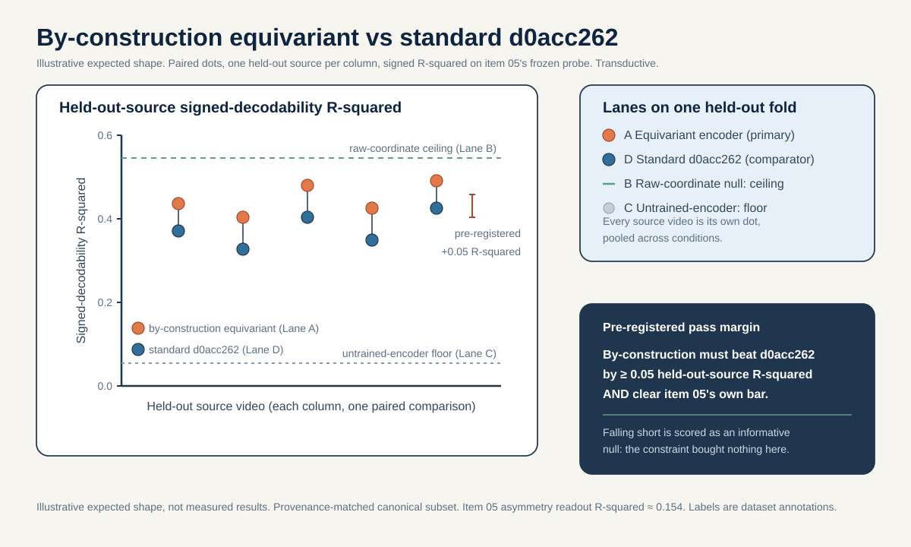
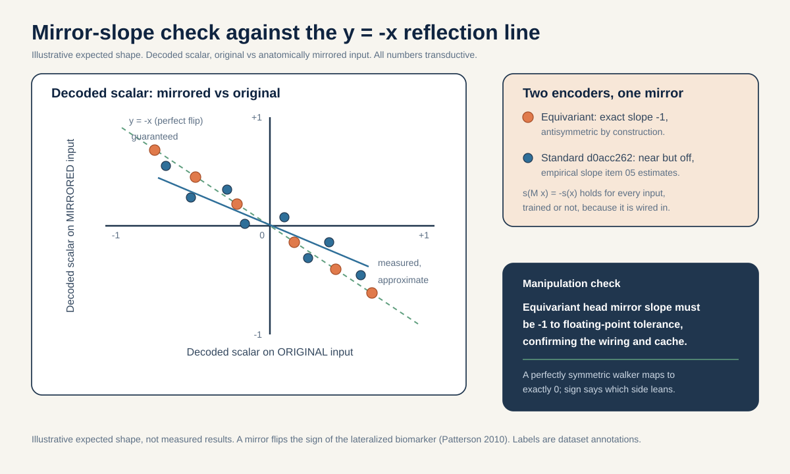

# Reflection-equivariant representation: separating lateralized from symmetric gait by construction

> On source-video-disjoint folds, does building the signed left-minus-right axis to be antisymmetric BY CONSTRUCTION (an encoder whose readout the anatomical mirror is guaranteed to negate) separate lateralized gait (stroke, hemiplegic cerebral palsy, early Parkinson's) from symmetric gait (myopathy) better than the standard `d0acc262` encoder that was only allowed to learn that behavior, measured by item 05's frozen signed-decodability and mirror-slope instrument at a pre-registered margin?

## The question in plain words

Walking is nearly symmetric in healthy people: the left leg and the right leg do almost the same thing, half a stride apart. Several gait conditions break that symmetry on ONE side. A stroke weakens the side of the body opposite the injured half of the brain, because the motor tract crosses over (the pyramidal decussation, Natali/Javed StatPearls, PMID 30571044, 30521239). Hemiplegic cerebral palsy comes from a one-sided injury to the developing brain's leg fibers, so one leg is spastic (Volpe 2009, PMID 19081519; Back 2007, PMID 17261726). Parkinson's disease usually starts on one side, reflecting one-sided loss of dopamine cells (Riederer and Sian-Hulsmann 2012, PMID 22367437). All three read on a skeleton as a left-right difference. Myopathy is different: it is a primary muscle disease that weakens both sides about equally (Barohn 2014, PMID 25037080), and at the skeleton level it shows NO meaningful left-right asymmetry versus controls (Xiong 2023, PMID 37525241).

So there is one axis that separates most of these conditions: how different the two sides are, and which side leans. Item 05 asked whether the existing frozen model already carries a signed (direction-carrying) version of that axis, and whether mirroring the body flips the decoded sign. This proposal takes the next step. Instead of hoping a standard encoder learned to behave antisymmetrically, we BUILD the axis so that mirroring the input is guaranteed to negate it. That property has a name: reflection-equivariance. In plain words, reflection-equivariant means a mirrored input produces a mirrored output, always, because the architecture forces it, not because the training data happened to teach it.

**Reading the math (antisymmetric by construction).** "Antisymmetric" describes a number `s(x)` computed from an input `x` such that mirroring the input negates the number.
- Write the anatomical mirror as `M` (negate the horizontal coordinate and swap each left landmark with its right partner). Antisymmetric means `s(M x) = -s(x)` for every input `x`.
- "By construction" means the equation holds because of how the readout is wired, not because a loss nudged it there. It is true even for inputs the model never saw.
- If `s(M x)` equalled `+s(x)` instead, the readout would be side-blind (symmetric): a mirror would leave it unchanged, so it could not tell left from right.
- The value `s(x) = 0` is the only value that is its own negative, so a perfectly symmetric walker maps to exactly `0` on this axis, and the sign of a nonzero value says which side leans.

The claim we test is that this built-in bias is the CORRECT one for telling lateralized conditions from symmetric ones, and that building it in beats letting a standard encoder learn it. The negative class in this test is myopathy, which by mechanism should sit near zero on a signed axis.

## Why this matters

Item 05 treats reflection-equivariance as an emergent property to be measured after the fact: does the frozen `d0acc262` encoder happen to flip its decoded sign under a mirror? This proposal treats reflection-equivariance as a design choice to be installed and then judged on whether it helps. The scientific question is an inductive-bias question, which is exactly the kind of question that generalizes beyond this one dataset. An inductive bias is a built-in assumption that shapes what a model prefers to represent (Locatello et al., ICML 2019, argue that recovering structured latent factors needs such a bias or supervision, not just more data). Here the assumption is a symmetry of the world: laterality is a signed quantity that a left-right mirror should negate.

A positive result confirms a specific, transferable belief: for encoders meant to separate lateralized pathology from symmetric pathology, wiring the signed left-minus-right axis to be antisymmetric by construction beats letting a standard encoder learn it, on the same frozen instrument, at a pre-registered margin. That is a claim about how to build gait encoders, not a claim about one cohort's accuracy.

A null result rules out an equally specific belief, and it is genuinely informative. If the reflection-equivariant encoder does NOT beat the standard `d0acc262` encoder on item 05's signed-decodability and does not sharpen the lateralized-vs-symmetric contrast, then the architectural constraint bought nothing here: either the standard encoder already learned the symmetry well enough (with flip_probability held at 0.0, see Method), or the signed axis is not the bottleneck for this separation on n=18 sources. Both readings retire the intuition that "just add the equivariance" is a free win at this scale. ICLR/ICML/NeurIPS 2026 reviewer guidance explicitly values a well-motivated study that contributes new knowledge, including a careful negative result.

What this does NOT do: it does not turn n=18 sources into a clinical-accuracy claim. The neuroscience DEFINES the target (a signed axis that separates lateralized from symmetric mechanisms) and the falsifiable prediction (equivariant beats standard on that axis). It does not license any statement about diagnosing an individual. Any clinical-accuracy statement would be external-cohort reach-tier only, and no participant-disjoint skeleton cohort for hemiplegic CP or myopathy exists to support one (see Controls and Responsible use).

## Background and related work

S-JEPA is a Joint-Embedding Predictive Architecture for skeletons (Abdelfattah and Alahi, S-JEPA, ECCV 2024, DOI 10.1007/978-3-031-73411-3_21), in the JEPA family from images and video (Assran et al., I-JEPA, CVPR 2023, arXiv:2301.08243; Bardes et al., V-JEPA, 2024, arXiv:2404.08471). Here are the moving parts from scratch, because the architectural change lands inside them.

A TOKEN is the model's smallest input unit: one BlazePose joint (Grishchenko et al., BlazePose GHUM, 2022, arXiv:2206.11678) watched over a short window. Each sequence is resized to 64 frames, then 4 next-door frames form one time patch, giving 16 time positions. With 33 joints that is 33 x 16 = 528 possible joint-time tokens.

**Reading the math (token count).** This says the total number of joint-time tokens is joints times time positions.
- 33 is the number of BlazePose joints.
- 16 is the number of time positions (64 frames split into groups of 4).
- "x" means multiply. 33 x 16 = 528, so there are 528 tokens.
- Fewer frames per patch would give more time positions and a larger token count.

Each token turns a 4-frame by 3-coordinate (x, y, relative z) 12-vector into a 64-number embedding through a linear layer. There are two encoders. The VIEW (online) encoder sees only visible tokens and is trained by gradient descent. The TARGET encoder sees all 528 tokens, is not updated by backpropagation, and its weights are an exponential moving average (EMA, a slowly-updated copy) of the view encoder (momentum cosine, from 0.999 toward 1.0). A PREDICTOR (a small 2-layer Transformer with a learned mask token) predicts the target encoder's hidden features at masked positions. Only 12 landmarks are ever maskable prediction targets: left/right shoulder (11,12), hip (23,24), knee (25,26), ankle (27,28), heel (29,30), foot index (31,32). The training loss is:

`L = L_JEPA + 0.05 * L_VICReg + 0.25 * L_group`

**Reading the math (total training loss).** This says the total training loss is a weighted sum of three parts. "Loss" is the error the model tries to make small.
- `L` is the total loss the optimizer minimizes (smaller is better).
- `L_JEPA` is the main prediction error (weight 1, the biggest term): how badly the predictor guessed the hidden target features.
- `L_VICReg` is an anti-collapse penalty (weight `0.05`).
- `L_group` is a label-aware term (weight `0.25`).
- `*` means multiply and `+` means add. Both extra weights are below 1, so they are gentle nudges; `0.25` pushes five times harder than `0.05` but both stay under the main term.
- Setting `0.05` to zero removes the anti-collapse guard; setting `0.25` to zero removes the label-aware pull and Stages 1 to 4 stop being supervised fine-tuning.

VICReg (Bardes, Ponce, LeCun, ICLR 2022, arXiv:2105.04906) adds a variance floor and a covariance penalty that keep features spread across many independent directions (high effective rank) instead of collapsing to one vector. L_group is a label-aware term active only in Stages 1 to 4, which is why those stages are supervised fine-tuning.

One augmentation fact is load-bearing here. The training-time geometric augmentation includes a small y-axis rotation (max 8 degrees) and small translation, but laterality FLIP is OFF (flip_probability 0.0), precisely because left-right identity matters for stroke.

**Reading the math (flip_probability 0.0).** This says how often the pipeline mirrors an input left-to-right.
- flip_probability is a chance, so it runs from 0 to 1 (0 means never, 1 means always).
- 0.0 means the pipeline never flipped left and right during training.
- If this were above 0, the model would be taught to treat left and right as interchangeable, erasing exactly the signed asymmetry this axis needs. We hold it at 0.0 for both encoders so the comparison is about architecture, not augmentation.

The code defines the anatomical mirror as the exact `LEFT_RIGHT_PAIRS` list (shoulder 11/12, hip 23/24, knee 25/26, ankle 27/28, heel 29/30, foot index 31/32, plus face and arm pairs), which negates the x coordinate and swaps each left landmark with its right partner. The architectural change and the mirror test both reuse this exact operation.

The mechanism grounding is the discriminative symmetry axis. LATERALIZED conditions raise a signed left-right difference: stroke via corticospinal decussation (PMID 30571044, 30521239) with the validated Symmetry Ratio on step length, swing time, and stance time as the biomarker (Patterson et al. 2010, PMID 19932621); hemiplegic CP via unilateral periventricular injury (PMID 19081519, 17261726), where the within-CP hemiplegic-vs-diplegic split is itself the lateralized-vs-symmetric axis; early PD via contralateral nigrostriatal onset (PMID 22367437), even though PD's dominant validated biomarker is stride-time CV (Hausdorff 1998, PMID 9613733; Schaafsma 2003, stride-time CV 8.8% fallers vs 4.2% non-fallers, PMID 12809998). The NEGATIVE class is myopathy: symmetric proximal muscle disease (Barohn 2014, PMID 25037080) with no significant left-right spatiotemporal asymmetry versus controls (Xiong 2023, PMID 37525241) and preserved cadence and anterior pelvic tilt (Vandekerckhove 2022, anterior pelvic tilt 16.4 vs 11.6 deg, PMID 35721358). These signed spatiotemporal and sagittal-joint quantities are the skeleton-recoverable ones (Stenum 2021 temporal MAE 0.02 s/step, sagittal hip/knee/ankle MAE 4.0/5.6/7.4 deg, PMID 33891585). What skeletons CANNOT recover, and this proposal does not claim, is kinetics or propulsion (Bowden 2006), EMG or spasticity, transverse-plane rotation, or an etiologic muscle diagnosis.

The equivariance idea is standard in representation learning: encoding a known symmetry of the world as an architectural constraint rather than a learned regularity. Item 05 tested reflection-equivariance as an emergent, post-hoc property of the frozen `d0acc262` encoder. This proposal makes it a design choice and measures its payoff on the same instrument. TRANSDUCTIVE means the encoder saw the evaluation rows during training; all readouts here are transductive, and even a held-out probe split is transductive if the encoder saw that video's clips (Kapoor and Narayanan, arXiv:2207.07048; Varoquaux, NeuroImage 2018). SOURCE-VIDEO-DISJOINT means no clip from a held-out source video is used to fit the probe. Data provenance: the canonical cohort is 96 sequences from 18 source videos (normal 12 clips from 1 video, Parkinson's 9 from 2, stroke 12 from 3, myopathic 47 from 10, cerebral palsy 16 from 2); the wider curriculum is 159 sequences from 35 source videos.

## Method

This is an ambition-first, effort-HIGH item: it changes the architecture and RETRAINS the encoder, then evaluates with item 05's frozen instrument. Everything downstream of training reuses the item 05 code.

The architectural lift is a reflection-equivariant readout head over paired-joint features. Instead of pooling all tokens into one vector and hoping a linear probe finds a signed axis, we compute, for each `LEFT_RIGHT_PAIRS` entry, the DIFFERENCE between the left-joint feature and the right-joint feature after passing both through the SAME shared per-joint map, then sum those differences into the signed axis. Because the two sides go through the identical map and only their difference survives, mirroring the input (which swaps left and right and negates x) negates the axis exactly.

**Reading the math (the antisymmetric head).** Let `f` be a single shared function applied to each maskable joint's token feature, and let `L_k`, `R_k` be the left and right joint features of pair `k`. The signed axis is `s = sum over k of ( f(L_k) - f(R_k) )`.
- `f` is shared: the same `f` acts on the left joint and on the right joint, so the two sides are treated identically before the subtraction.
- The mirror `M` swaps `L_k` with `R_k` (and negates x inside each feature). After the swap the term becomes `f(R_k) - f(L_k)`, which is the negative of the original term.
- Summing over all pairs, `s(M x) = -s(x)` exactly: the head is antisymmetric by construction, for every input, trained or not.
- A perfectly symmetric walker gives `f(L_k) = f(R_k)` for each pair, so every term is `0` and `s = 0`. Myopathy should sit near `0`; lateralized conditions should sit away from `0` with a consistent sign.

We keep the S-JEPA backbone unchanged (one small Transformer, embed_dim 64, depth 2, 4 heads, GELU, pre-norm) and add the antisymmetric head as the readout used to define and score the signed axis. We RETRAIN the full five-stage curriculum matching the `d0acc262` lineage: Stage 0 normal 300 epochs, then Stages 1 to 4 add PD, stroke, myopathic, cerebral palsy at 75 epochs each, for 600 curriculum epochs and 11,400 optimizer updates, on the 96 canonical (up to 159 curriculum) sequences, single-GPU feasible. flip_probability stays 0.0 throughout, for BOTH the new equivariant encoder and the standard `d0acc262` baseline, so the comparison isolates the architectural constraint and the no-flip rule protects lateralized asymmetry (that protection is the whole point).

Pseudo-code for the antisymmetric head and the by-construction mirror guarantee:

```python
import torch

# LEFT_RIGHT_PAIRS: (left_joint_index, right_joint_index), the exact anatomy.
LEFT_RIGHT_PAIRS = [(11, 12), (23, 24), (25, 26),
                    (27, 28), (29, 30), (31, 32)]

def signed_axis(token_features, f):
    # token_features: dict joint_index -> feature vector from the encoder.
    # f: a SHARED per-joint map (the same f for left and right).
    s = 0.0
    for left_idx, right_idx in LEFT_RIGHT_PAIRS:
        s = s + (f(token_features[left_idx]) - f(token_features[right_idx]))
    return s          # antisymmetric by construction

# Guarantee check: mirroring swaps left/right, so the axis must negate.
# For any input, signed_axis(mirror(x)) == -signed_axis(x) holds exactly,
# because each (f(L) - f(R)) term becomes (f(R) - f(L)).
```

Evaluation reuses item 05's frozen instrument without change. Cache the 528-token target-encoder features for each sequence from the RETRAINED equivariant encoder and, separately, from the standard `d0acc262` encoder. Fit item 05's ridge probe for signed-decodability (a linear rule from features to the signed target, with a small penalty keeping weights modest, chosen on training sources only), report held-out-source R-squared and mean absolute error (the average size of the miss, in target units), against item 05's two reference bounds: the RAW-COORDINATE NULL (same fit on handcrafted signed left-minus-right coordinate features, no network) and the UNTRAINED-ENCODER FLOOR (same probe on a random-init encoder of identical architecture). Then run item 05's mirror-slope test: apply the exact `LEFT_RIGHT_PAIRS` mirror, re-embed, decode, and fit the slope of decoded-mirrored vs decoded-original against the ideal line y = -x.

**Reading the math (the mirror line y = -x and its slope).** The ideal mirror response is: mirrored output equals the negative of the original output.
- `x` is the decoded scalar on the original input; `y` is the decoded scalar on the mirrored input.
- A perfect flip has slope -1: same size, opposite sign, so points fall on y = -x.
- For the equivariant head this slope is -1 by construction and serves only as a manipulation check that the wiring and cache are correct. For the standard `d0acc262` encoder the slope is the empirical quantity item 05 estimates.

## The decisive experiment

The split is stated before any fitting. Folds are SOURCE-VIDEO-DISJOINT: signed laterality is pooled across all conditions and whole source videos are held out, never clips. Because per-condition source counts are tiny (normal 1 source, Parkinson's 2, stroke 3, myopathic 10, cerebral palsy 2), we do NOT report per-class leave-one-source-out R-squared on n=1 held-out sources; the primary endpoint is pooled across conditions, every source video is its own dot, and a source-level permutation null is used only where the number of held-out sources makes it meaningful. The primary comparison runs on a PROVENANCE-MATCHED subset (all canonical-path sequences), because most normal rows use the augmented extraction path while every abnormal row uses the canonical path, so a naive contrast could learn acquisition differences rather than gait.

Primary endpoint: held-out-source signed-decodability R-squared of the RETRAINED reflection-equivariant encoder MINUS that of the standard `d0acc262` encoder, both read with item 05's identical frozen probe and both reference bounds.

Pre-registered margin: the reflection-equivariant encoder must exceed the standard `d0acc262` encoder by at least 0.05 held-out-source R-squared on the signed axis AND must itself clear item 05's own bar (above the untrained-encoder floor by at least 0.05 R-squared and at least 80 percent of the raw-coordinate null), with the sign of the decoded scalar consistent on at least 75 percent of held-out sources. Falling short is scored as an informative null: the architectural constraint did not beat the learned behavior at this scale.

**Reading the math (the margin numbers).** A positive result needs all thresholds at once.
- 0.05 R-squared is the smallest advantage of the equivariant encoder over the standard one that counts as a real gain; below it the architecture bought nothing measurable.
- 0.05 R-squared over the untrained floor is the smallest gap that counts as beating chance for the equivariant encoder on its own.
- 80 percent (a fraction of 0.80) is the share of the raw-coordinate ceiling the equivariant probe must reach to count as competitive with the non-neural baseline.
- 75 percent (a fraction of 0.75) is the share of held-out sources whose decoded sign must point the correct way.
- If any threshold is missed, the run is an informative null.

**Worked example (illustrative numbers only, not grounded facts).** Suppose on 4 held-out source videos the standard `d0acc262` probe scores R-squared 0.36, the equivariant encoder scores 0.44, the untrained floor scores 0.05, and the raw-coordinate null scores 0.50.
- Beat the standard encoder by at least 0.05: 0.44 minus 0.36 = 0.08, above 0.05. Pass.
- Beat the floor by at least 0.05: 0.44 minus 0.05 = 0.39, far above 0.05. Pass.
- Reach at least 80 percent of the null: 0.80 times 0.50 = 0.40, and 0.44 is above 0.40. Pass.
- Sign consistency: decoded sign matched on 3 of 4 sources, 3 / 4 = 0.75, meets the bar. Pass.
- All pass, so this illustrative run would support "reflection-equivariance is the correct inductive bias, and building it in beats learning it." If instead the equivariant encoder scored 0.39, then 0.39 minus 0.36 = 0.03 is below 0.05, and the run would be scored an informative null even though 0.39 clears the floor.

Lateralized-vs-symmetric secondary endpoint: on the provenance-matched canonical subset, the signed axis on lateralized-labelled sources (stroke, hemiplegic-labelled CP, PD) should sit away from zero with a consistent sign, and on symmetric-labelled sources (myopathic) should sit near zero, matching the mechanism (Xiong 2023, PMID 37525241; Patterson 2010, PMID 19932621). This is reported as a mechanism check with every source as a dot, never as a per-individual diagnosis.

Simple non-neural / nuisance baseline: the raw-coordinate null (Lane B) is the non-neural baseline. The mean/std-pooled control (Lane E) is the nuisance baseline: a mean-and-standard-deviation pooling of tokens is permutation-invariant and side-agnostic by construction, so it must NOT recover a signed axis; if it does, the "signed" claim is an artifact.

| Lane | Feature source | Retrain? | Role | Expected on signed axis |
|---|---|---|---|---|
| A Equivariant probe | RETRAINED antisymmetric-head encoder | Yes | Primary | Beat Lane D by >= 0.05 R-squared; >= 80% of null; slope -1 by construction |
| B Raw-coordinate null | Handcrafted signed left-minus-right coords | No | Non-neural ceiling | Reference target |
| C Untrained-encoder floor | Random-init encoder of identical architecture | No | Floor | Near chance |
| D Standard encoder | Frozen `d0acc262` per-token features | No | Learned-behavior comparator | Item 05's learned baseline |
| E Mean/std-pooled control | Permutation-invariant pooled tokens | No | Nuisance | Must NOT recover a signed axis |

## Controls

- Hold flip_probability at 0.0 for BOTH the equivariant encoder and the standard `d0acc262` comparator, so the only difference is the architectural constraint, not the augmentation. Any advantage cannot be an "the equivariant model saw mirrored data" artifact.
- Bind every number to ONE fingerprint before comparing. The standard baseline is the `d0acc262` lineage; the equivariant encoder gets its own recorded fingerprint. Do not mix the `dba24a` canonical lineage into the same comparison.
- Provenance-matched primary comparison on the canonical-path subset, since normal rows are mostly augmented-path and abnormal rows are canonical-path; a naive normal-vs-abnormal contrast could learn acquisition differences (embedding-level normal-vs-abnormal separability is around 0.96 AUC, the number the provenance confound puts at risk).
- Mean/std-pooled negative control (Lane E) that must NOT recover a signed axis, because a mean and a standard deviation are permutation-invariant and discard token order and side identity by construction.
- Untrained-encoder floor (Lane C) and raw-coordinate null (Lane B) reused unchanged from item 05, so the equivariant encoder is credited only when it clears the same bars item 05 set.
- No per-class LOSO R-squared margins on n=1 held-out sources; signed laterality is pooled across conditions, every source is a dot, source-level permutation only where meaningful.
- Transductive caveat next to every number: all readouts are transductive, and a held-out probe split is still transductive if the encoder saw that video's clips. Seed variation is not source variation.
- Equivariance manipulation check: verify numerically that the equivariant head's mirror slope is -1 to floating-point tolerance, confirming the by-construction guarantee before any comparison is trusted.
- Honest external-cohort limitation: no participant-disjoint skeleton cohort for hemiplegic CP or myopathy exists, so the lateralized-vs-symmetric separation stays transductive and internal. The only bounded external anchors are method-level: CASIA-B (Yu 2006), OU-MVLP-Pose (Takemura 2018), GREW (arXiv:2205.02692), Gait3D (arXiv:2204.02569) can test whether the built-in mirror-equivariance property holds across viewpoints and mirrored views (an architecture check, non-clinical); Human3.6M (Ionescu 2014, DOI 10.1109/tpami.2013.248) versus mocap validates that the pose landmarks feeding the signed axis are geometrically faithful. The PD stride-time-variability biomarker has a label-level cross-modal anchor in PhysioNet Gait-in-PD (gaitpdb, 93 PD + 73 controls, Hausdorff, DOI 10.13026/C24H3N), but that is force/IMU, not skeleton, and speaks to the variability axis, not this signed axis.

## How this differs from the existing plan

The nearest neighbor is item 05, which this proposal deliberately uses as its EVALUATION INSTRUMENT rather than duplicating. Item 05 asks whether the standard frozen `d0acc262` encoder HAPPENED to learn an antisymmetric signed axis (an emergent property measured post hoc). This proposal BUILDS reflection-equivariance into the architecture (antisymmetric by construction, mirror slope -1 exactly) and RETRAINS, then asks whether that built-in bias BEATS the learned behavior on item 05's own frozen probe and bounds. Item 05 does not retrain and does not compare a constrained encoder against the standard one; this item does both.

Against the wider portfolio: plan/04 retrains encoders to ablate the prediction TARGET (motion vs position); this item retrains to change the READOUT symmetry, not the target. Plan/05 varies the pooling operator and defines signed ankle phase-lag targets; this item keeps item 05's single clean signed-laterality target and does not re-derive phase-lag. Plan/07 stresses viewpoint invariance broadly; this item installs one specific equivariance (the anatomical left-right mirror) as a mechanism-aligned inductive bias, not a general robustness sweep. Item 06 treats provenance as a nuisance control; here provenance-matching is a control, not the object. No existing plan or ideas item builds reflection-equivariance into the encoder and tests whether the architectural constraint beats the learned one.

## Timeline (feasibility-tiered, ambition-first)

Core tier (effort HIGH, may exceed 3 weeks because it retrains the curriculum).

Week 1 (16 to 22 Aug 2026): implement the antisymmetric head over `LEFT_RIGHT_PAIRS`, prove the by-construction mirror guarantee numerically (slope -1 to tolerance), wire it into the S-JEPA backbone (embed_dim 64, depth 2, 4 heads), and confirm the canonical parquet carries source, condition, and provenance columns before any join. Freeze item 05's signed-laterality target function and source-video-disjoint fold manifest unchanged.

Day-5 gate (20 Aug 2026): continue only if the equivariant head's mirror slope is -1 to floating-point tolerance (the guarantee holds), the standard `d0acc262` baseline cache is bound to a single fingerprint, the provenance-matched canonical subset is assembled, and no held-out source's clips leaked into the fold being read.

Week 2 to Week 3 (23 Aug to 5 Sep 2026): RETRAIN the five-stage curriculum for the equivariant encoder (Stage 0 normal 300 epochs, Stages 1 to 4 add PD, stroke, myopathic, cerebral palsy 75 epochs each, 600 epochs, 11,400 updates, flip_probability 0.0), monitor representation health (feature std, effective rank, mean pairwise cosine) against the `d0acc262` reference figures, and cache the 528-token features. Fit Lanes A, B, C, D, E on source holdouts; run the mirror-slope check on all lanes; assemble per-source dots and the source-level permutation null where meaningful.

Day-14 gate (29 Aug 2026): continue to write-up only if the equivariant encoder trained without collapse (feature std well above zero, non-degenerate effective rank), the primary equivariant-minus-standard endpoint has a clean verdict (clearing the pre-registered margin or an interpretable null), and Lane E correctly fails to recover a signed axis.

Week 4 (6 to 12 Sep 2026): produce the two figures, finalize the equivariant-vs-standard signed-decodability table, the lateralized-vs-symmetric source-level panel, and the mirror-slope manipulation check, write transductive caveats next to every number, and package the head implementation, retrained fingerprint, fold manifest, and per-source results.

Reach tier (+2 to 3 weeks, marked honestly): the multi-view mirror-consistency check on CASIA-B and OU-MVLP-Pose as a method-level external anchor (does the built-in equivariance hold across viewpoints and mirrored views on non-clinical multi-view pose). No new clinical data is used or exists; reach anchors use existing public non-clinical multi-view pose only. All results remain transductive; source video is the independent unit; folder labels are dataset annotations, not diagnoses.

## Figures



Fig 1: per held-out source, the signed-decodability R-squared of the by-construction reflection-equivariant encoder against the standard `d0acc262` encoder on item 05's frozen instrument, paired dot by dot, with the pre-registered 0.05 R-squared advantage drawn as the pass band. The by-construction encoder must beat `d0acc262` by at least that margin.



Fig 2: the mirror-slope check. Readout on the original input (x) against readout on the anatomically mirrored input (y), against the y = -x reflection line. The by-construction head lands exactly on y = -x (a mirror is guaranteed to negate its output), while the standard `d0acc262` encoder only approximates that line (a measured, approximate slope), which is the geometric core of the reflection-equivariance claim.

## Responsible use

The condition folder labels (normal, parkinsons, stroke, myopathic, cerebralpalsy) are dataset annotations from GAVD (Ranjan et al., IEEE Access 2025, DOI 10.1109/ACCESS.2025.3545787), not diagnoses made by this project. Terms like "lateralized" and "symmetric" here describe a skeleton-measurable signed axis grounded in the cited mechanisms, not a clinical judgment about any individual. The signed axis is a representation diagnostic computed from cached skeleton coordinates; it is not a validated clinical biomarker and must not be read as a measurement of any person's health. All results are transductive and small-sample (18 canonical source videos), with the source video as the independent unit. The neuroscience defines the target and the falsifiable prediction; it does not upgrade n=18 sources into a clinical-accuracy claim. Any clinical-accuracy statement would be external-cohort reach-tier only, and no participant-disjoint skeleton cohort for hemiplegic CP or myopathy exists to support one. Skeletons cannot recover kinetics or propulsion, EMG or spasticity, transverse-plane rotation, or an etiologic muscle diagnosis, and this proposal claims none of these.

## References

- Abdelfattah and Alahi, S-JEPA, ECCV 2024, DOI 10.1007/978-3-031-73411-3_21.
- Assran et al., I-JEPA, CVPR 2023, arXiv:2301.08243.
- Bardes et al., V-JEPA "Revisiting Feature Prediction for Learning Visual Representations from Video", 2024, arXiv:2404.08471.
- Bardes, Ponce, LeCun, VICReg, ICLR 2022, arXiv:2105.04906.
- Locatello et al., "Challenging Common Assumptions in the Unsupervised Learning of Disentangled Representations", ICML 2019.
- Grishchenko et al., BlazePose GHUM, 2022, arXiv:2206.11678.
- Ranjan et al., GAVD, IEEE Access 2025, DOI 10.1109/ACCESS.2025.3545787.
- Kapoor and Narayanan, "Leakage and the Reproducibility Crisis in ML-based Science", 2022, arXiv:2207.07048.
- Varoquaux, "Cross-validation failure: small sample sizes lead to large error bars", NeuroImage 2018.
- Natali and Javed, StatPearls, corticospinal tract anatomy, PMID 30571044, 30521239.
- Volpe, Lancet Neurology 2009, periventricular leukomalacia, PMID 19081519.
- Back et al., Stroke 2007, periventricular white-matter injury, PMID 17261726.
- Riederer and Sian-Hulsmann, J Neural Transm 2012, asymmetric nigrostriatal onset in PD, PMID 22367437.
- Patterson et al., Gait Posture 2010, symmetry-index methods (Symmetry Ratio), PMID 19932621.
- Hausdorff et al., Mov Disord 1998, PD gait-timing variability, PMID 9613733.
- Schaafsma et al., J Neurol Sci 2003, stride-time CV fallers vs non-fallers, PMID 12809998.
- Barohn et al., Neurol Clin 2014, symmetric proximal (limb-girdle) distribution, PMID 25037080.
- Xiong et al., Biomed Eng Online 2023, DMD shows no significant left-right asymmetry, PMID 37525241.
- Vandekerckhove et al., Front Hum Neurosci 2022, DMD anterior pelvic tilt 16.4 vs 11.6 deg, PMID 35721358.
- Stenum et al., PLoS Comput Biol 2021, markerless pose validity, PMID 33891585.
- Yu et al., CASIA-B multi-view gait dataset, 2006.
- Takemura et al., OU-MVLP-Pose multi-view gait dataset, 2018.
- Zhu et al., GREW gait recognition in the wild, arXiv:2205.02692.
- Zheng et al., Gait3D, arXiv:2204.02569.
- Ionescu et al., Human3.6M, DOI 10.1109/tpami.2013.248.
- Goldberger et al., PhysioNet Gait-in-PD (gaitpdb), DOI 10.13026/C24H3N.
