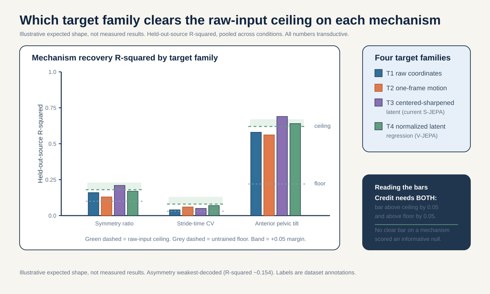
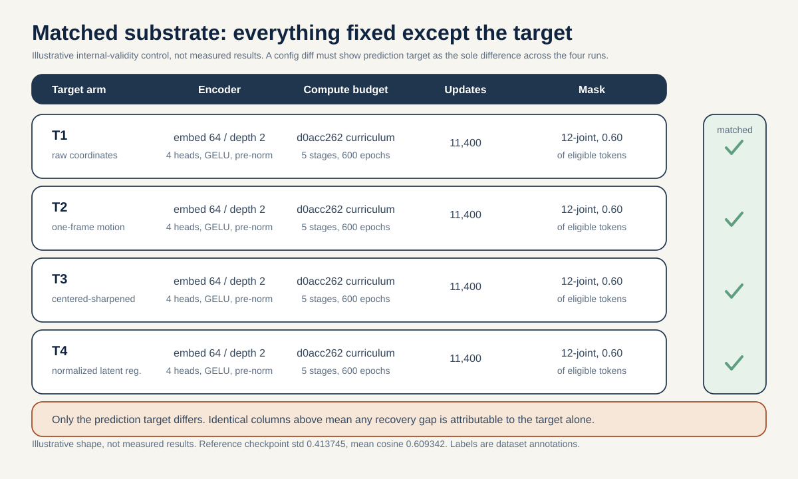

# What should a gait world model predict? A matched-substrate target-isolation study

> Holding the encoder, the compute budget, the number of updates, and the mask fixed, and varying ONLY the prediction target across four families (raw coordinates, one-frame motion, S-JEPA centered-sharpened latent, normalized latent regression), does any target family recover the three validated gait mechanisms (left-right symmetry ratio, stride-time CV, anterior pelvic tilt) above a raw-input probe ceiling on source-video-disjoint folds by a pre-registered margin?

## The question in plain words

When you train a model to predict something it cannot see, the thing you ask it to predict is a design choice. You can ask it to predict the raw joint positions it is missing. You can ask it to predict how those joints are MOVING (the change from one frame to the next). Or you can ask it to predict not the input at all, but a compressed internal description (a "latent") that a second copy of the model computed. Each of these is a different bet about what is worth learning. This proposal asks a single, transferable question: for gait, which bet pays off best?

"Best" here is not the training loss. A model can drive its own training loss to zero and still have learned nothing a clinician would care about. So we score each trained model by whether its features let a simple readout recover three gait quantities that the clinical literature has already validated as meaningful:

- The left-right SYMMETRY RATIO (how lopsided the two legs are), which is the validated biomarker for the lateralized conditions: stroke, hemiplegic cerebral palsy, and early Parkinson's (Patterson et al. 2010, PMID 19932621).
- The STRIDE-TIME CV (how much the stride timing wobbles cycle to cycle), which is the validated biomarker for Parkinsonian loss of automaticity (Hausdorff et al. 1998, PMID 9613733; Schaafsma et al. 2003, PMID 12809998).
- The ANTERIOR PELVIC TILT (how far the pelvis tips forward), which is the validated posture biomarker for myopathy, a symmetric muscle disease (Vandekerckhove et al. 2022, PMID 35721358).

**Reading the math (why three targets, not one).** These three are not arbitrary. They are the three axes along which the conditions separate by mechanism.
- Symmetry ratio is a signed left-versus-right size. Near 1.0 means the two sides match; far from 1.0 means one side is affected.
- Stride-time CV is a coefficient of variation, a percentage: the standard deviation of stride times divided by their mean, times 100. A concrete anchor is 8.8 percent for Parkinsonian fallers versus 4.2 percent for non-fallers (Schaafsma 2003).
- Anterior pelvic tilt is an angle in degrees. A concrete anchor is 16.4 degrees for Duchenne muscular dystrophy versus 11.6 degrees for typically developing children (Vandekerckhove 2022).

The catch is that a model only deserves credit for a mechanism if it beats what you could already read straight off the raw joint coordinates with no neural network at all. That is the RAW-INPUT CEILING. If a target family cannot push a mechanism above that ceiling, then the representation added nothing on that mechanism, no matter how clever the pretext task sounded.

## Why this matters

The JEPA idea family (predict a latent, not the pixels) is built on a claim that WHAT you predict matters more than how hard you predict it. V-JEPA predicts latent features rather than raw video and argues this is why it learns useful structure (Bardes et al. 2024, arXiv:2404.08471); V-JEPA 2 extends this to action-conditioned prediction (Assran et al. 2025, arXiv:2506.09985); S-JEPA brings the same latent-prediction recipe to skeletons (Abdelfattah and Alahi, ECCV 2024, DOI 10.1007/978-3-031-73411-3_21). For skeleton motion specifically, a competing school argues you should predict MOTION (velocity / one-frame displacement), because motion beats coordinate reconstruction for skeletons (masked motion prediction, MAMP-style). These are opposing design bets and they have never been isolated cleanly for gait, where the "useful structure" has a concrete, clinically validated definition.

A positive result names a winner: one target family recovers the validated mechanisms above the raw ceiling by a margin, and it does so at fixed encoder, compute, steps, and mask, so the win is attributable to the target and nothing else. That is a transferable design principle ("for gait, predict X") that carries beyond this repository.

The three endpoints are not equally open. The project's own notebook-05 readout diagnostic already establishes baselines against which these endpoints must be read. On the frozen `d0acc262` encoder, mean-and-standard-deviation-pooled features decode step amplitude well (R-squared about 0.719), but LEFT-RIGHT ASYMMETRY is the weakest-decoded scalar (R-squared about 0.154), and STRIDE-TIME CV is not linearly decodable at all from the roughly two-second windows. So the symmetry-ratio endpoint starts from a weak known baseline, and the stride-time-CV endpoint starts from a known negative: the interesting question is whether ANY of the four target families lifts CV or asymmetry above the raw-input ceiling where the current pooled readout could not. This proposal therefore interprets its three mechanism probes against the project's own measured baselines, not as fully open questions.

An informative null is equally valuable and rules out a specific belief. If NO target family clears the raw-input ceiling on held-out source videos, that says the choice of prediction target is not the bottleneck at this scale and cohort: the mechanisms are either already saturated by the raw coordinates or not learnable from 18 source videos regardless of pretext. Given that stride-time CV was already not linearly decodable and asymmetry was the weakest scalar in notebook 05, a CV or asymmetry null here would confirm rather than contradict the project's prior finding, and would locate the limit in data breadth rather than target engineering. That directly tempers the JEPA-target enthusiasm for small skeleton cohorts. ICLR/ICML/NeurIPS 2026 reviewer guidance explicitly values a well-motivated study that contributes new knowledge, including a careful negative result.

## Background and related work

**JEPA and the target-design frontier.** A Joint-Embedding Predictive Architecture predicts the representation of a hidden part of the input, not the input itself. I-JEPA introduced this for images (Assran et al., CVPR 2023, arXiv:2301.08243). V-JEPA showed that predicting latent video features (with an EMA target encoder, stop-gradient, and tube masking, evaluated with a frozen probe) learns transferable structure (Bardes et al. 2024, arXiv:2404.08471). V-JEPA 2 adds an action-conditioned predictor on top of action-free pretraining (Assran et al. 2025, arXiv:2506.09985). VICReg supplies the variance and covariance terms that keep the predicted latents from collapsing to a constant (Bardes, Ponce, LeCun, ICLR 2022, arXiv:2105.04906). The competing bet, that predicting motion beats predicting coordinates for skeletons, is the MAMP-style masked-motion school. S-JEPA is the skeleton instance of the latent-prediction recipe used in this project (Abdelfattah and Alahi, ECCV 2024, DOI 10.1007/978-3-031-73411-3_21). This proposal turns "what to predict" from a background assumption into the measured variable.

**The mechanism-defined axis (the neuroscience that fixes the targets).** The conditions separate along a mechanism axis, and each mechanism ties to a skeleton-measurable, literature-validated feature.

- LATERALIZED (left-right asymmetry). The corticospinal tract decussates (crosses), so one hemisphere controls the opposite side of the body; a one-sided brain lesion therefore produces a one-sided motor deficit (Natali/Javed StatPearls, PMID 30571044, 30521239). Stroke follows this directly. Hemiplegic cerebral palsy arises from unilateral periventricular leukomalacia of the leg-bound corticospinal fibers (Volpe 2009, PMID 19081519; Back et al. 2007, PMID 17261726). Early Parkinson's shows asymmetric onset from contralateral nigrostriatal degeneration (Riederer and Sian-Hulsmann 2012, PMID 22367437). The skeleton-measurable feature is the signed left-right Symmetry Ratio on step, stance, and swing (Patterson et al. 2010, the canonical symmetry-index methods paper, PMID 19932621), which is fully skeleton-recoverable.
- RHYTHM / VARIABILITY. Loss of substantia nigra dopamine produces basal-ganglia loss of automaticity (Redgrave et al. 2010, PMID 20944662; Wu, Hallett, Chan 2015, PMID 26102020). The skeleton-measurable feature is stride-time CV, with the concrete anchor 8.8 percent for fallers versus 4.2 percent for non-fallers (Schaafsma et al. 2003, PMID 12809998; foundational variability biomarker, Hausdorff et al. 1998, PMID 9613733).
- SYMMETRIC, rhythm-preserved, posturally abnormal. Myopathy is a primary muscle disease producing symmetric proximal weakness (Barohn et al. 2014, PMID 25037080), which reads at the skeleton level as LOW left-right asymmetry (Xiong et al. 2023, PMID 37525241). The skeleton-measurable feature is anterior pelvic tilt, 16.4 degrees [14.3 to 19.0] versus 11.6 degrees [8.7 to 15.3], p = 0.005, alongside preserved cadence (Vandekerckhove et al. 2022, PMID 35721358).

**Skeleton validity for all three probes.** Monocular skeletons recover the sagittal and temporal quantities these probes need: temporal MAE 0.02 s/step and sagittal hip/knee/ankle MAE 4.0 / 5.6 / 7.4 degrees against instrumented gait (Stenum et al. 2021, PMID 33891585). Pose validity against motion capture is further anchored by Human3.6M (Ionescu et al. 2014, DOI 10.1109/tpami.2013.248). Skeletons CANNOT recover kinetics or propulsion, EMG or spasticity, transverse-plane rotation, or an etiologic muscle diagnosis; those are out of scope and stated as limitations.

**Leakage and small samples.** The independent unit is the source video, not the clip. A held-out probe split is still transductive if the encoder saw that video's clips (Kapoor and Narayanan 2022, arXiv:2207.07048; Varoquaux 2018 on small-sample error bars).

## Method

The whole design is a MATCHED SUBSTRATE. Everything that is not the prediction target is held identical across the four trained encoders: same architecture, same embed dim, same depth, same heads, same mask sampler and mask fraction, same optimizer, same number of updates, same data, same seeds. Only the prediction target changes. This is the only way a difference in mechanism recovery can be attributed to the target rather than a confound.

The fixed substrate (from the project's own configuration): 96 canonical sequences from 18 source videos; each sequence resized to 64 frames; 4 adjacent frames form one time patch, giving 16 time positions; 33 BlazePose joints times 16 positions = 528 possible joint-time tokens; embed dim 64, depth 2, 4 heads, GELU, pre-norm; only 12 lower-body-and-shoulder landmarks are ever maskable (global mask cap 12/33 = 0.364), configured target 0.60 of eligible tokens; five-stage curriculum totalling 600 epochs and 11,400 optimizer updates matching the `d0acc262` curriculum; laterality flip OFF (flip_probability 0.0). Every retrain reuses this exact substrate.

**Reading the math (528 tokens).** The token count is joints times time positions.
- 33 is the number of BlazePose joints.
- 16 is the number of time positions (64 frames split into groups of 4).
- 33 times 16 = 528, the number of joint-time tokens the target encoder always sees.

The four target families (the ONLY thing that varies):

- T1 RAW COORDINATES. The predictor predicts the hidden joints' raw (x, y, relative z) coordinates. This is coordinate reconstruction, the plainest bet.
- T2 ONE-FRAME MOTION (MAMP-style). The predictor predicts the one-frame displacement (velocity) at hidden positions instead of position. This is the "predict motion, not location" bet.
- T3 S-JEPA CENTERED-SHARPENED LATENT. The project's existing objective: predict the EMA target encoder's hidden features under a centered (running EMA center, beta 0.9) then sharpened (temperature 0.06, stop-gradient) latent cross-entropy, prediction at temperature 0.10. This is the current JEPA bet.
- T4 NORMALIZED LATENT REGRESSION. Predict the EMA target encoder's hidden features by regression onto normalized (unit-variance) latents rather than a centered-sharpened cross-entropy. This is the "V-JEPA-style feature regression" bet, a smoother latent objective.

All four keep the anti-collapse structure of the project loss. The reference form is:

`L = L_target + 0.05 * L_VICReg + 0.25 * L_group`

**Reading the math (the training loss).** The total loss is a weighted sum. Only `L_target` changes across T1 to T4.
- `L` is what the optimizer minimizes (smaller is better).
- `L_target` is the prediction error against whichever target family (T1 to T4) is active; its weight is 1, so it dominates.
- `L_VICReg` is the anti-collapse penalty (variance floor plus covariance), weight `0.05` (Bardes et al. 2022, arXiv:2105.04906).
- `L_group` is the label-aware condition-centroid term, weight `0.25`, active only in Stages 1 to 4, which makes those stages supervised fine-tuning.
- Because `L_VICReg` and `L_group` are held identical across all four retrains, any difference in mechanism recovery is attributable to `L_target` alone.

A note on collapse for T2, T3, T4: predicting latents can collapse (all tokens map to one vector). The `0.05 * L_VICReg` term guards against this and its weight is held fixed across families so no family gets a collapse advantage. The EMA target-encoder momentum schedule (cosine, 0.999 toward 1.0) is also held fixed.

After the four encoders are trained, a SINGLE shared mechanism-probe readout is fit on top of each, identically. For each of the three mechanisms (symmetry ratio, stride-time CV, anterior pelvic tilt), a ridge linear probe reads the frozen 528-token features and predicts the mechanism value. The mechanism ground-truth values are computed once, deterministically, from the raw cached coordinates using the validated definitions (Patterson 2010 for symmetry ratio; stride-time CV in the normalized 64-frame time base; anterior pelvic tilt as a pelvis-segment sagittal angle). Stride-time CV is a dimensionless ratio, the standard deviation of stride times divided by their mean, so a uniform time rescale leaves it unchanged in principle; its validity on the 64-frame-resized sequences is therefore contingent on the resize being a uniform rescale that preserves this ratio, and any credit on the CV probe is reported only under that condition so the resize does not silently confound the CV endpoint. "Ridge" adds a small-weight penalty chosen using only training sources, which matters at small n.

**Reading the math (ridge probe and R-squared).** The probe is a straight-line rule from features to a mechanism value.
- R-squared runs 0 to 1; it is the fraction of the mechanism's variation the probe explains. Higher is better.
- Mean absolute error (MAE) is the average size of the miss, in the mechanism's own units (a ratio, a percent, or degrees), with the sign dropped. Smaller is better.
- The ridge penalty keeps the rule's weights small so it does not overreact to any one feature; it is tuned only on training sources so held-out sources never influence it.

Pseudo-code for the matched-substrate loop and the shared readout:

```python
# Fixed substrate: everything below is IDENTICAL across the four runs.
SUBSTRATE = dict(embed_dim=64, depth=2, heads=4,
                 mask_fraction=0.60, eligible_joints=12,   # global cap 12/33 = 0.364
                 updates=11_400, seeds=SEEDS, data=CANONICAL_96)

TARGET_FAMILIES = ["T1_raw_coords", "T2_one_frame_motion",
                   "T3_centered_sharpened_latent", "T4_normalized_latent_reg"]

encoders = {}
for target in TARGET_FAMILIES:
    # ONLY `target` changes; SUBSTRATE is passed unchanged every time.
    encoders[target] = train_sjepa(substrate=SUBSTRATE, prediction_target=target)

# Ground-truth mechanisms: deterministic, from raw coords, frozen before probing.
MECHANISMS = ["symmetry_ratio",      # Patterson 2010, PMID 19932621
              "stride_time_cv",       # Schaafsma 2003, PMID 12809998
              "anterior_pelvic_tilt"] # Vandekerckhove 2022, PMID 35721358

def mechanism_recovery(features, y, folds):        # source-video-disjoint folds
    return ridge_cv_r2(features, y, groups=folds)  # held-out-source R-squared

# Raw-input ceiling: same probe on handcrafted raw-coordinate features (no network).
ceiling = {m: mechanism_recovery(raw_coord_features, gt[m], folds) for m in MECHANISMS}

results = {}
for target in TARGET_FAMILIES:
    feats = frozen_token_features(encoders[target], CANONICAL_96)  # 528 tokens each
    results[target] = {m: mechanism_recovery(feats, gt[m], folds) for m in MECHANISMS}
    # A target is credited on mechanism m only if it clears ceiling[m] by the margin.
```

## The decisive experiment

The split is stated BEFORE any fitting. Folds are SOURCE-VIDEO-DISJOINT: whole source videos are held out, never individual clips. The primary comparison runs on a PROVENANCE-MATCHED subset (all canonical-path sequences) so a recovered mechanism cannot be an augmented-versus-canonical acquisition artifact. Because per-condition source counts are tiny (normal 1 source, Parkinson's 2, stroke 3, myopathic 10, cerebral palsy 2), the mechanism probes are fit and scored POOLED across conditions with every source video shown as its own dot; no per-class leave-one-source-out R-squared is reported on n=1 held-out sources. All numbers are transductive: the encoder saw every evaluation row, and a held-out probe split is still transductive if the encoder saw that video's clips. Every number is bound to a single checkpoint lineage before comparison, matching the `d0acc262` curriculum budget; the `dba24a` canonical lineage is never mixed in.

Primary endpoint: for each mechanism, the held-out-source R-squared of the shared ridge probe, per target family, pooled across conditions.

Pre-registered margin: a target family is CREDITED on a mechanism only if its held-out-source R-squared exceeds the raw-input ceiling by at least 0.05 R-squared on that mechanism, AND exceeds the untrained-encoder floor by at least 0.05 R-squared. The study's headline verdict names the target family that is credited on the most mechanisms; a tie or zero-credit outcome is scored as an informative null (target choice is not the bottleneck at this scale).

**Reading the math (the two margin numbers).** A target is credited on a mechanism only if both hold.
- Exceed the raw-input ceiling by at least 0.05 R-squared: the learned features must add at least 0.05 of explained variation beyond what handcrafted raw coordinates already give. Below that, the representation added nothing over raw input on that mechanism.
- Exceed the untrained-encoder floor by at least 0.05 R-squared: rules out a random network coincidentally scoring well.
- Both thresholds are on the 0-to-1 R-squared scale, so 0.05 is a five-percentage-point gap.

Simple non-neural / nuisance baseline: the raw-input ceiling IS the non-neural baseline (handcrafted raw-coordinate features, no network). The nuisance baseline is a mean-and-standard-deviation pooling of tokens, which is permutation-invariant and discards temporal order by construction, so it must NOT recover stride-time CV (a timing-order quantity) above the raw ceiling; if it does, that mechanism's recovery is an artifact.

**Reading the math (why mean/std pooling caps stride-time CV).** A mean and a standard deviation over tokens do not know which token came first.
- Stride-time CV is defined by the ORDER of stride events in time.
- A permutation-invariant pool throws that order away, so it cannot carry cycle-to-cycle timing.
- If the pooled control still "recovers" stride-time CV, the signal is leaking from something other than timing (for example provenance), and the result is rejected.

| Lane | Feature source | Retrain? | Role | Expected on mechanism recovery |
|---|---|---|---|---|
| A T1 raw-coordinate target | Frozen tokens from the coordinate-reconstruction encoder | Yes (matched) | Target family | Credited only if beats ceiling and floor by >= 0.05 |
| B T2 one-frame-motion target | Frozen tokens from the MAMP-style motion encoder | Yes (matched) | Target family | Credited only if beats ceiling and floor by >= 0.05 |
| C T3 centered-sharpened latent | Frozen tokens from the current S-JEPA objective encoder | Yes (matched) | Target family | Credited only if beats ceiling and floor by >= 0.05 |
| D T4 normalized latent regression | Frozen tokens from the V-JEPA-style regression encoder | Yes (matched) | Target family | Credited only if beats ceiling and floor by >= 0.05 |
| E Raw-input ceiling | Handcrafted raw-coordinate features, no network | No | Non-neural ceiling | Reference target for all four |
| F Untrained-encoder floor | Random-init encoder of identical architecture | No | Floor | Near chance |
| G Mean/std-pooled control | Permutation-invariant pooled tokens | No | Nuisance | Must NOT recover stride-time CV above ceiling |

## Controls

- Matched substrate is the primary control: the encoder, compute, number of updates, mask sampler, mask fraction, VICReg weight, group-loss weight, EMA schedule, data, and seeds are identical across T1 to T4. Any of these differing would break attribution and is checked before results.
- Raw-input ceiling (Lane E) guards against crediting a target for information already present in the raw coordinates.
- Untrained-encoder floor (Lane F) guards against crediting a random network.
- Mean/std-pooled nuisance control (Lane G) guards against a permutation-invariant pool "recovering" stride-time CV, which it cannot do honestly.
- Provenance-matched (canonical-path) subset guards against the augmented-versus-canonical acquisition confound, since most normal rows use the augmented extraction path and every abnormal row uses the canonical path.
- Single-fingerprint binding: every retrain's budget matches the `d0acc262` curriculum and is bound to one lineage before comparison; the `dba24a` lineage is never mixed in.
- Collapse monitoring per family: report final feature standard deviation and mean pairwise cosine for each of T1 to T4, since latent-target families (T2 to T4) can collapse; the reference healthy checkpoint sat at feature std 0.413745 and mean pairwise cosine 0.609342.
- Pooled-across-conditions probing with per-source dots and a source-level permutation null where meaningful; no n=1 per-class LOSO margins.
- Transductive caveat printed next to every number.

## How this differs from the existing plan

The nearest neighbor is the plan's motion-versus-position TARGET ablation (plan item 04), which "fixes masks, varies targets" and retrains encoders to compare a position target against a motion target: a TWO-way contrast with a generic representation-quality endpoint. Because plan/04 already fixes the mask and varies the target, that framing alone does NOT distinguish this proposal. The distinctness rests entirely on three other counts.

1. It is a FOUR-way target-family study, not a two-way one: {raw coordinates, one-frame motion, centered-sharpened latent, normalized latent regression}. It includes both latent-target families (the JEPA and V-JEPA-style bets), which the two-way position-versus-motion ablation does not.
2. Its endpoint is MECHANISM-PROBE recovery of three clinically validated biomarkers (symmetry ratio, stride-time CV, anterior pelvic tilt), not a generic accuracy or representation-quality score.
3. It gates every credit on a RAW-INPUT CEILING, so a target family earns credit only for information beyond the raw coordinates, which no plan item requires.

It is also distinct from the sibling ideas items: ideas/05 reads a signed laterality axis off the FROZEN `d0acc262` encoder without retraining (a readout diagnostic), whereas this item RETRAINS four matched encoders and varies the target; ideas/06 makes mask geometry the treatment at fixed target, the exact mirror image of this item, which fixes the mask and varies the target.

## Timeline (feasibility-tiered, ambition-first)

Effort is HIGH: this item requires four matched encoder retrains. The core tier can exceed three weeks and that is stated honestly.

CORE TIER (roughly 3 to 4 weeks, existing scale, all transductive).

Week 1: assemble the fixed substrate harness so a single config differing only in `prediction_target` drives all four runs; verify the canonical parquet carries source, condition, and provenance columns; freeze the three deterministic mechanism target functions (symmetry ratio, stride-time CV, anterior pelvic tilt) and the source-video-disjoint fold manifest; build the raw-input ceiling and mean/std nuisance features. Kick off T1 and T2 retrains.

Day-5 gate (20 Aug 2026): continue only if the substrate is provably matched (a config diff shows `prediction_target` as the sole difference across the four runs), the three frozen target functions pass a small-noise reliability check, the provenance-matched canonical subset is assembled, and no held-out source's clips leaked into any fold used to fit a probe.

Week 2: complete T3 and T4 retrains; monitor collapse per family (feature std, mean pairwise cosine); cache the frozen 528-token features for all four encoders plus the untrained-encoder floor; fit the shared ridge mechanism probes on source-video-disjoint folds against the raw-input ceiling.

Day-14 gate (29 Aug 2026): continue to write-up only if each of the four families has a clean per-mechanism recovery number versus the raw-input ceiling and the untrained floor, no family collapsed silently, and the mean/std nuisance control correctly fails to recover stride-time CV above the ceiling.

Week 3 (to 5 Sep 2026): assemble the per-mechanism-by-target recovery table, the per-source dots, the source-level permutation null where meaningful, write transductive caveats next to every number, and package the substrate config, target functions, fold manifest, and per-source results.

REACH TIER (plus several weeks, new data, marked honestly). Any external participant-disjoint SKELETON confirmation of the target-design choice. This does NOT exist for CP or myopathy (no participant-disjoint public skeleton cohort), and for Parkinson's it is only a LABEL-LEVEL cross-modal confirmation of the stride-time-CV biomarker in PhysioNet Gait-in-PD (gaitpdb, 93 PD + 73 controls, force/IMU, DOI 10.13026/C24H3N), not a skeleton test. Pose validity supporting probe recovery draws on Human3.6M (DOI 10.1109/tpami.2013.248) and Stenum 2021 (PMID 33891585). Any clinical-accuracy statement is external-cohort reach-tier only and out of scope for this n=18-source transductive study.

## Figures



Fig 1: a grouped bar chart with one column group per mechanism (symmetry ratio, stride-time CV, anterior pelvic tilt) and four bars per group (T1 to T4). Each group draws the raw-input ceiling as a green dashed line and the untrained-encoder floor as a lower grey dashed line, with the pre-registered 0.05 margin shaded as a band above the ceiling. It shows at a glance which target family, if any, clears both the ceiling and the floor by the margin on each mechanism. The illustrative shape has the latent-target families lifting anterior pelvic tilt above the ceiling while stride-time CV stays below the ceiling for every family, an informative null. All values are illustrative and transductive.



Fig 2: a four-row audit grid, one row per target arm (T1 to T4), with columns for Encoder, Compute budget, Updates, and Mask. Every cell holds identical values across all four rows (same embed 64 and depth 2, same `d0acc262` curriculum budget, same 11,400 optimizer updates, same 12-joint mask at 0.60 of eligible tokens), and a green checkmark strip confirms each arm is substrate-matched. This is the internal-validity control: everything is fixed except the prediction target, so any recovery difference is attributable to the target alone.

## Responsible use

The condition folder labels (normal, parkinsons, stroke, myopathic, cerebralpalsy) are dataset annotations from GAVD (Ranjan et al., IEEE Access 2025, DOI 10.1109/ACCESS.2025.3545787), not diagnoses made by this project. The three mechanism scalars (symmetry ratio, stride-time CV, anterior pelvic tilt) are representation diagnostics computed from cached skeleton coordinates; they are not validated clinical measurements of any individual and must not be read as such. Skeletons cannot recover kinetics or propulsion, EMG or spasticity, transverse-plane rotation, or an etiologic muscle diagnosis, so no claim here touches those. All results are transductive and small-sample, with the source video as the independent unit before any fitting.

## References

- Abdelfattah and Alahi, S-JEPA, ECCV 2024, DOI 10.1007/978-3-031-73411-3_21.
- Assran et al., I-JEPA, CVPR 2023, arXiv:2301.08243.
- Bardes et al., V-JEPA "Revisiting Feature Prediction for Learning Visual Representations from Video", 2024, arXiv:2404.08471.
- Assran et al., V-JEPA 2, 2025, arXiv:2506.09985.
- Bardes, Ponce, LeCun, VICReg, ICLR 2022, arXiv:2105.04906.
- Ranjan et al., GAVD, IEEE Access 2025, DOI 10.1109/ACCESS.2025.3545787.
- Kapoor and Narayanan, "Leakage and the Reproducibility Crisis in ML-based Science", 2022, arXiv:2207.07048.
- Natali/Javed, corticospinal tract anatomy, StatPearls, PMID 30571044, PMID 30521239.
- Volpe, periventricular leukomalacia, Lancet Neurology 2009, PMID 19081519.
- Back et al., periventricular white-matter injury, Stroke 2007, PMID 17261726.
- Riederer and Sian-Hulsmann, asymmetric nigrostriatal onset in Parkinson's, J Neural Transm 2012, PMID 22367437.
- Patterson et al., gait symmetry-index methods, Gait Posture 2010, PMID 19932621.
- Redgrave et al., basal-ganglia habit and automaticity, Nat Rev Neurosci 2010, PMID 20944662.
- Wu, Hallett, Chan, loss of automaticity in Parkinson's, Neurobiol Dis 2015, PMID 26102020.
- Schaafsma et al., stride-time CV in Parkinsonian fallers, J Neurol Sci 2003, PMID 12809998.
- Hausdorff et al., gait-timing variability in Parkinson's, Mov Disord 1998, PMID 9613733.
- Barohn et al., myopathy distribution patterns, Neurol Clin 2014, PMID 25037080.
- Xiong et al., no left-right spatiotemporal asymmetry in DMD, Biomed Eng Online 2023, PMID 37525241.
- Vandekerckhove et al., DMD gait kinematics (anterior pelvic tilt), Front Hum Neurosci 2022, PMID 35721358.
- Stenum et al., markerless pose gait validity, PLoS Comput Biol 2021, PMID 33891585.
- Ionescu et al., Human3.6M, IEEE TPAMI 2014, DOI 10.1109/tpami.2013.248.
- Goldberger et al., PhysioNet Gait-in-PD (gaitpdb), DOI 10.13026/C24H3N.
