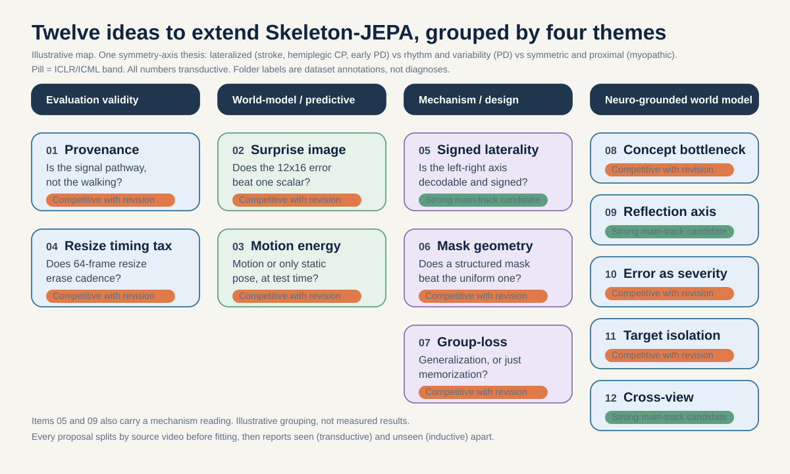

# Twelve research proposals for Skeleton-JEPA gait

This folder holds twelve concrete research proposals that extend the gavd5 Skeleton-JEPA (S-JEPA) gait project. The first seven are augmented audits: focused studies that mostly read the pose tensors and checkpoints the project already has. The last five (08 to 12) are neuroscience-grounded world-model proposals that tie a learned representation to a validated clinical biomarker. Each proposal asks one question that can be proven wrong, is written from first principles so a motivated high school student can follow it, and states its own feasibility honestly. The framing is ambition-first: several items are clean three-week studies, but some (for example 08, 11, and 12) exceed three weeks or need an external cohort, and each one marks that cost plainly rather than hiding it.

This page is the map. Read it first, then open the proposal that fits your interest.

## The shared setup, in plain words

Every proposal sits on top of the same machine, so it helps to understand that machine once.

The project takes short video clips of people walking. It does not keep the pixels. Instead it runs a pose detector (MediaPipe BlazePose) that finds 33 body joints in each frame, so a clip becomes a moving stick figure, called a skeleton. That is much smaller than video and it hides a person's face and clothing.

The model that learns from these skeletons is a Skeleton-JEPA. JEPA stands for Joint-Embedding Predictive Architecture. The idea, first shown for images by Assran et al. (I-JEPA, CVPR 2023, arXiv:2301.08243) and for video by Bardes et al. (V-JEPA, 2024, arXiv:2404.08471), is simple: hide part of the input, then predict the hidden part in feature space, not pixel space. Feature space means the model predicts a summary vector of the hidden part, not its exact coordinates. The skeleton version we build on is Abdelfattah and Alahi (S-JEPA, ECCV 2024, DOI 10.1007/978-3-031-73411-3_21).

A few numbers show up in almost every proposal, so here they are once:

- Each clip is stretched or squeezed to exactly 64 frames. Then 4 frames in a row are grouped into one time patch, giving 16 time positions. With 33 joints, that is 33 times 16 = 528 possible joint-time tokens. A token is the smallest chunk the model reads.
- Only 12 of the 33 joints (shoulders, hips, knees, ankles, heels, foot indices) can ever be hidden as prediction targets. So the largest fraction the model can hide is 12 divided by 33 = 0.364, far below the 75 to 90 percent that image and video JEPAs hide.
- The final model is one frozen checkpoint with fingerprint prefix `d0acc262`. Every number in these proposals is bound to one checkpoint before any comparison.

## What "missingness only" means

Several proposals compare the model against a "missingness-only" baseline (also called the missingness-only probe or control). It is worth defining once, because it is the simplest way to catch a model that is fooling us.

When we turn a video into a skeleton, the pose detector (MediaPipe BlazePose, pose_landmarker_lite) finds 33 body joints in each frame. For every joint in every frame it reports two separate things: where the joint is (coordinates x, y, and a relative z), and a visibility score between 0 and 1 saying how confident it is that the joint is actually there. "Missingness" is the pattern of which joints are visible versus missing (low or zero visibility) across all joints and over time. It is built from the visibility scores only, throwing away every x, y, and z coordinate. So it records which joints the detector managed to find, not how the person moved.

A missingness-only probe is a classifier trained on that pattern alone. It sees which joints were found, how often, and when, and it is deliberately given none of the real gait coordinates.

The catch is that these holes are not random. Heels are the weak link: left heel visibility averages about 0.699 and right heel about 0.673, while shoulders and hips sit near 0.988. Failed pose rows are kept on the timeline with zero visibility to preserve gait timing. So different cameras, angles, occlusions, or video sources leave systematic gaps. If, for example, all normal clips came from one YouTube video, the gap pattern alone could correlate with the label. A model could then look like it recognizes walking while it is really reading which video the clip came from, an acquisition artifact rather than gait.

The numbers show how much this matters. The full Skeleton-JEPA readout scores 0.793 accuracy across the five conditions; the missingness-only control, given visibility alone and no coordinates, scores 0.448; pure guessing across the five classes would land at 0.20. Both of these are transductive numbers (the encoder saw every evaluation clip, so they measure separability, not generalization). Missingness-only sits well above chance but well below the full model, which means some of the apparent signal really is just holes. That is why it is the baseline: a real gait finding must beat missingness only on unseen videos, or we cannot rule out that the model is reading the gaps instead of the walking.

## The one rule that ties all twelve together

The single most important idea in this whole folder is the difference between two words:

- Transductive means the model was trained on the very videos you later test it on. A high transductive score can just mean the model memorized those videos.
- Inductive means you test on videos the model has never seen. Only an inductive score tells you the model learned something that transfers.

Why this matters here: the independent unit is the source video, not the clip. The whole dataset is 96 canonical clips, but they come from only 18 YouTube videos (normal 1, Parkinson's 2, stroke 3, myopathic 10, cerebral palsy 2). All 12 normal clips come from a single video. So two clips from the same video are not independent evidence, any more than two frames of the same movie are two different movies. Because of this, every proposal splits the data by source video before any fitting, and reports seen-video (transductive) and unseen-video (inductive) results separately. This follows the leakage taxonomy of Kapoor and Narayanan ("Leakage and the Reproducibility Crisis in ML-based Science", 2022, arXiv:2207.07048).

## The unifying discriminative thesis: a symmetry axis

The neuroscience-grounded items (08 to 12), and the mechanism items 05 and 09, share one organizing idea. Gait conditions do not blur into one "abnormal" blob. They separate along a symmetry axis, and each region of that axis has its own validated biomarker.

- Lateralized (a left-versus-right asymmetry). Stroke (corticospinal decussation), hemiplegic cerebral palsy (a one-sided white-matter lesion), and early Parkinson's disease (a one-sided nigrostriatal onset) all break left-right symmetry. The validated biomarker is the clinical Symmetry Ratio (Patterson et al. 2010, PMID 19932621).
- Rhythm and variability (a broken internal clock, not a broken side). Parkinson's disease loses automatic rhythm, so its biomarker is the stride-time coefficient of variation, elevated to 8.8 percent versus 4.2 percent in controls (Schaafsma et al. 2003, PMID 12809998).
- Symmetric and proximal (both sides weak, rhythm preserved, posture abnormal). Myopathy is diffuse proximal weakness with a characteristically low left-right asymmetry (Xiong et al. 2023, PMID 37525241) and an abnormal anterior pelvic tilt (Vandekerckhove et al. 2022, PMID 35721358).

The full mechanism chains, condition by condition, live in `_neuro_facts.md`. The point for this index is that "symmetric versus lateralized versus rhythm-broken" is a discriminative axis, not a cosmetic grouping, and it is the spine of the world-model proposals.

## The twelve proposals at a glance

The proposals span four themes: evaluation validity, world-model / predictive, mechanism / design, and a fourth theme, neuro-grounded world model, for the biomarker-anchored items 08 to 12 (items 05 and 09 also carry a mechanism reading). The table is sorted by scorecard composite, highest first. The full graded rubric, with all five axes per item, is in [SCORECARD.md](./SCORECARD.md).

| # | Proposal | Plain question | Theme | ICLR/ICML band | Effort |
|---:|---|---|---|---|---|
| 05 | [Signed laterality decodability](./05-signed-laterality-decodability/README.md) | Is a signed left-minus-right asymmetry axis linearly decodable from the frozen tokens above a raw-coordinate null, and does an anatomical mirror flip its sign? | Mechanism | Strong main-track candidate | 3 / +0 weeks; zero-retrain; reuses cached 528-token tensors |
| 09 | [Reflection-equivariant symmetry axis](./09-reflection-equivariant-symmetry-axis/README.md) | Does building the signed axis to be antisymmetric BY CONSTRUCTION separate lateralized gait from symmetric gait better than the standard encoder that was only allowed to learn that behavior? | Neuro-grounded world model | Strong main-track candidate | 3-4 / +2-3 weeks; full curriculum retrain; reuses cached 528-token tensors (core) |
| 12 | [Cross-view gait invariance](./12-cross-view-invariance/README.md) | Does a view-conditioned predictor with a strict no-left-right-flip rule produce more view-stable gait features than a flip-augmented baseline, while a mirror still inverts the lateralized biomarker's sign? | Neuro-grounded world model | Strong main-track candidate | 3 / +unbounded weeks; view-conditioned predictor retrain; needs external cohort |
| 04 | [The 64-frame resize tax](./04-resize-timing-tax/README.md) | How much recoverable cadence and walking-speed information does the mandatory fixed-64-frame resize destroy? | Evaluation validity | Competitive with revision | 1-2 / +1 weeks; zero-retrain; needs NPZ+fps regen |
| 11 | [Target-isolation substrate](./11-target-isolation-substrate/README.md) | Holding everything else fixed and varying ONLY the prediction target across four families, does any target recover the three validated gait mechanisms above a raw-input ceiling on unseen sources? | Neuro-grounded world model | Competitive with revision | 3-4 / +several weeks; full curriculum retrain (x4 matched); reuses cached 528-token tensors |
| 01 | [Extraction-pathway attribution](./01-provenance-pathway-attribution/README.md) | How much of the very high normal-vs-abnormal signal is the model reading the processing pipeline instead of the walking? | Evaluation validity | Competitive with revision | 3 / +0 weeks; zero-retrain; reuses cached 528-token tensors |
| 07 | [Group-loss supervision isolation](./07-group-loss-supervision-isolation/README.md) | Does the label-aware group-loss term improve condition separation on unseen videos, or only on videos the encoder already saw? | Mechanism / design | Competitive with revision | 3 / +2-3 weeks; fold-local finetune; reuses cached 528-token tensors |
| 02 | [Prediction-error tomography](./02-surprise-tomography/README.md) | Does the 12-by-16 surprise-image structure separate held-out abnormal sources from normal better than one pooled surprise number, without just reproducing missingness or provenance maps? | World-model / predictive | Competitive with revision | 2-3 / +2 weeks; test-time pass; reuses cached 528-token tensors |
| 03 | [Inference-time motion energy](./03-inference-time-motion-energy/README.md) | With zero retraining, is latent-velocity structure recoverable from prediction residuals, and does a motion-scored energy separate held-out sources better than a position-scored one? | World-model / predictive | Competitive with revision | 3 / +2 weeks; zero-retrain; reuses cached 528-token tensors |
| 08 | [Concept-bottleneck disentangled S-JEPA](./08-concept-bottleneck-disentangled/README.md) | After a retrain with three biomarker-supervised subspaces, does intervening on one named subspace move only its biomarker (symmetry ratio, stride-time CV, or anterior pelvic tilt) and leave the other two unmoved? | Neuro-grounded world model | Competitive with revision | 6-8 / +0 (reach included) weeks; full curriculum retrain; reuses cached 528-token tensors (core) |
| 10 | [Prediction-error-as-severity](./10-prediction-error-severity/README.md) | For a normal-only world model, does a one-sided knee-flexion injection raise error specifically in the asymmetry channel while a symmetric proximal-deficit injection raises it specifically in the posture channel? | Neuro-grounded world model | Competitive with revision | 3 / +several weeks; from-scratch normal-only; reuses cached 528-token tensors |
| 06 | [Mask geometry as the object](./06-mask-geometry-as-object/README.md) | Does one anatomically structured mask beat the uniform 12-joint mask on unseen-video decodability of timing and asymmetry targets, without raising provenance decodability? | Mechanism / design | Competitive with revision | 4-6 core weeks / +0 reach; fold-local Stage-0 retrain per family; reuses cached 528-token tensors, no external cohort, retrain-compute-bound |

## How these differ from the existing `plan/` portfolio

The project already has a conservative seven-proposal portfolio in [`../../plan/`](../../plan/README.md). Those are audit and validation studies. This folder is a distinct, more exploratory menu. Each proposal states its own distinctness, and here is the short version:

- 01 makes the processing pipeline (provenance) the object of study. `plan/06` treats provenance only as a nuisance to control.
- 02 makes the two-dimensional surprise image the object. `plan/01` pools that surprise into a single number.
- 03 changes only the inference-time scoring on the frozen encoder. `plan/04` retrains encoders with motion targets.
- 04 makes the fixed 64-frame resize itself the measured object. No `plan/` item does this.
- 05 makes signed asymmetry a decodable axis and tests learned mirror behavior. This is distinct from `plan/05` and `plan/07`.
- 06 makes mask geometry the treatment that changes. `plan/01` sweeps masks only for robustness; `plan/04` fixes masks and varies targets.
- 07 isolates the label-aware group loss as the single changed factor. No `plan/` item does this.
- 08 builds three named, biomarker-supervised latent subspaces and tests causal intervention on each. No `plan/` item builds a disentangled concept bottleneck, and none tests one-subspace steerability against a raw-coordinate ceiling.
- 09 makes the signed left-right axis antisymmetric by construction (an architecture the mirror is guaranteed to negate) rather than only learned. `plan/07`'s invariance sweep and item 05's learned-behavior probe do not build the equivariance in.
- 10 trains a normal-only world model and reads relative masked-prediction error as a continuous, mechanism-channelled severity score under controlled deficit injections. No `plan/` item trains normal-only or injects targeted deficits.
- 11 holds encoder, compute, updates, and mask fixed and varies ONLY the prediction target across four matched families against a raw-input ceiling. `plan/04` varies motion-vs-position targets but does not run the four-family matched substrate study against biomarker recovery.
- 12 treats viewpoint change as an action for a view-conditioned predictor with a strict no-flip rule, on external multi-view cohorts. No `plan/` item is cross-view or action-conditioned; `plan/07` stresses viewpoint only as a robustness sweep on gavd5.

## The reviewer rubric each proposal passes

The proposals are written to match what current top venues actually reward. State-of-the-art performance is not required. ICLR 2026 explicitly values a well-motivated study that contributes new knowledge, including careful analysis or an informative negative result. ICML 2026 and NeurIPS 2026 reward originality that comes from evaluation and from null results that change understanding.

So every proposal must pass seven screening questions:

1. Is the question falsifiable in one sentence?
2. Is the source video treated as the independent unit before all fitting?
3. Does the experiment change only the named factor, or control every extra change?
4. Is there a simple non-neural or nuisance baseline (for example a missingness-only probe)?
5. Would a null result rule out a plausible belief?
6. Can the decisive figure be produced by Day 14 (for three-week items) or at the stated milestone (for longer items)?
7. Does the claim matter beyond this one repository?

## A suggested order

If you are choosing one to run, sequence matters:

- Start with the fast, near-zero-retrain studies: 03, 04, and 02. They need no new training and can produce a decisive figure quickly.
- 01 is the validity foundation. Its provenance check protects the normal-vs-abnormal claim that several other proposals lean on, so run it early even if it is not your headline.
- 05 is a clean mechanism study on the frozen tensor and explains the project's weakest decoded scalar, asymmetry. It is also the measurement instrument for 09.
- 06, 07, 09, 10, and 11 need controlled retraining, so budget for that. They carry high novelty but also the most moving parts.
- 08 and 12 are the most ambitious: 08 is a multi-week disentangled retrain, and 12 needs an external multi-view cohort. Treat them as reach-tier headline studies, not quick wins.

Whatever you pick, keep to the one rule: split by source video first, and never let a seen-video score stand in for evidence of generalization.

## Responsible use

The condition folder labels used across these proposals (normal, parkinsons, stroke, myopathic, cerebral_palsy) are dataset annotations from GAVD (Ranjan et al., IEEE Access 2025, DOI 10.1109/ACCESS.2025.3545787). They are not diagnoses made by this project. The neuroscience in the world-model items defines the target and the falsifiable prediction; it never turns the n=18 source videos into a clinical-accuracy claim. Any clinical-accuracy reading is external-cohort reach-tier only and is stated as such. Nothing here is a clinical screening tool, and every reported number is labeled transductive or inductive so no seen-video score is mistaken for evidence about new people.

## Shared references

- Abdelfattah and Alahi, S-JEPA, ECCV 2024, DOI 10.1007/978-3-031-73411-3_21.
- Assran et al., I-JEPA, CVPR 2023, arXiv:2301.08243.
- Bardes et al., V-JEPA "Revisiting Feature Prediction for Learning Visual Representations from Video", 2024, arXiv:2404.08471.
- Bardes, Ponce, LeCun, VICReg, ICLR 2022, arXiv:2105.04906.
- Assran et al., V-JEPA 2, 2025, arXiv:2506.09985.
- Ranjan et al., GAVD, IEEE Access 2025, DOI 10.1109/ACCESS.2025.3545787.
- Kapoor and Narayanan, "Leakage and the Reproducibility Crisis in ML-based Science", 2022, arXiv:2207.07048.
- Grishchenko et al., BlazePose GHUM, 2022, arXiv:2206.11678.
- Xu et al., "A Theory of Usable Information Under Computational Constraints", ICLR 2020, arXiv:2002.10689.
- Patterson et al., "Evaluation of gait symmetry after stroke" (Symmetry Ratio), Gait Posture 2010, PMID 19932621.
- Schaafsma et al., gait dynamics in Parkinson's disease (stride-time CV 8.8% vs 4.2%), 2003, PMID 12809998.
- Xiong et al., gait analysis in Duchenne muscular dystrophy (no significant left-right asymmetry), Biomed Eng Online 2023, PMID 37525241.
- Vandekerckhove et al., anterior pelvic tilt in myopathic gait, 2022, PMID 35721358.
- Stenum et al., "Two-dimensional video-based analysis of human gait using pose estimation", PLoS Comput Biol 2021, PMID 33891585.
