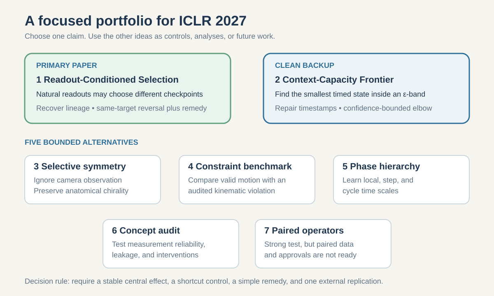
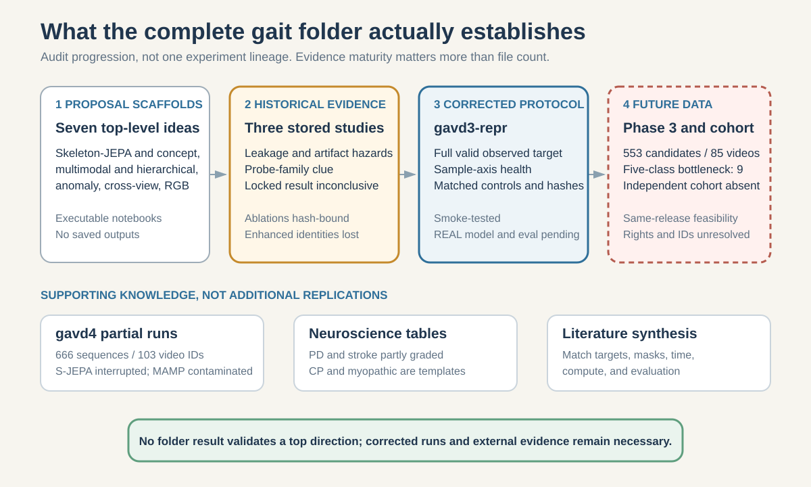
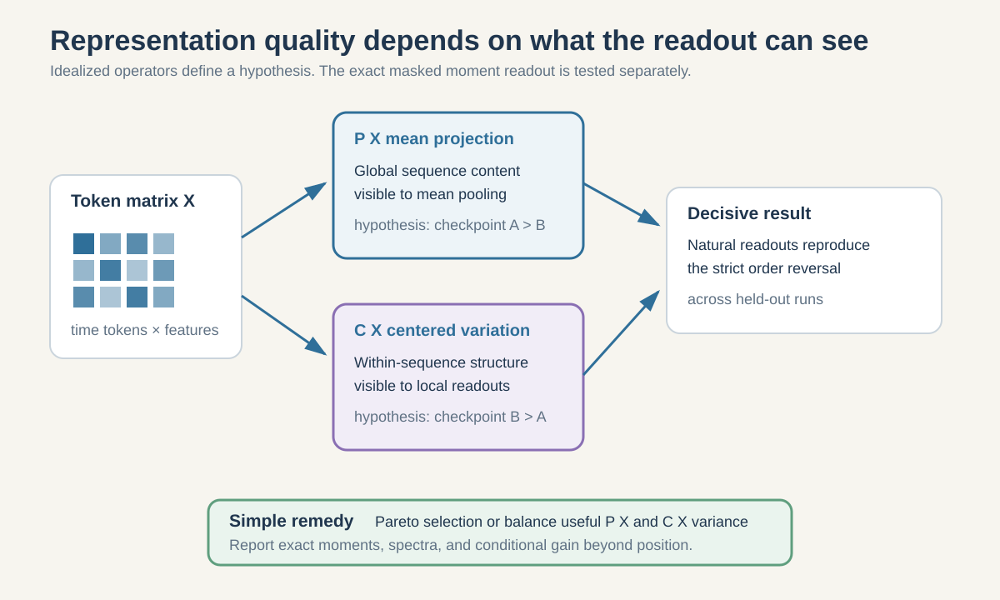
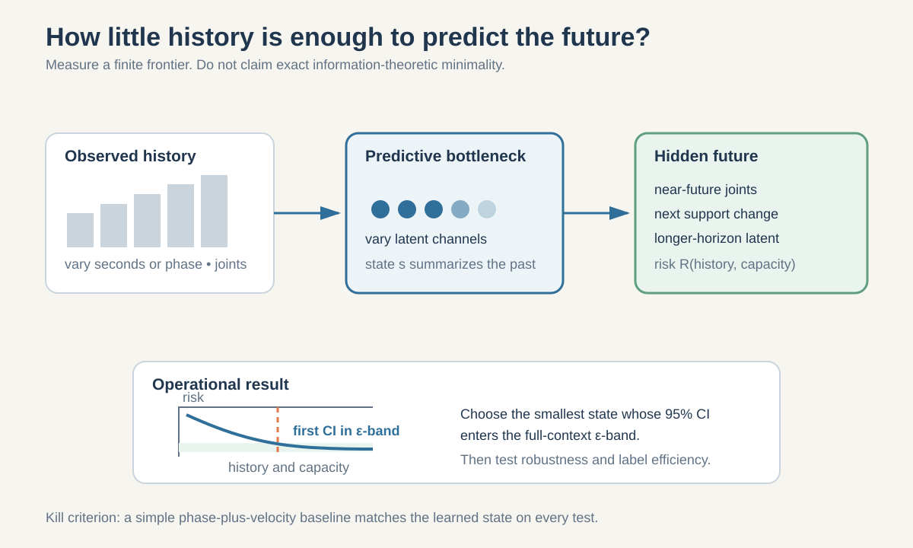
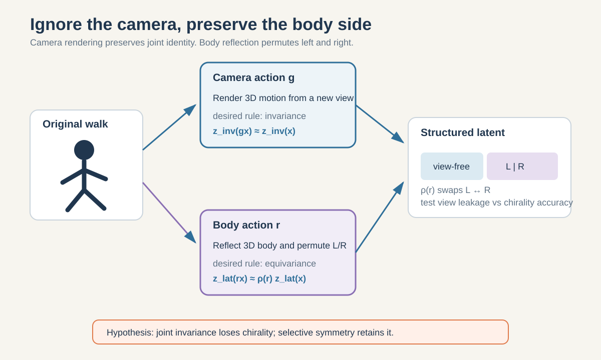
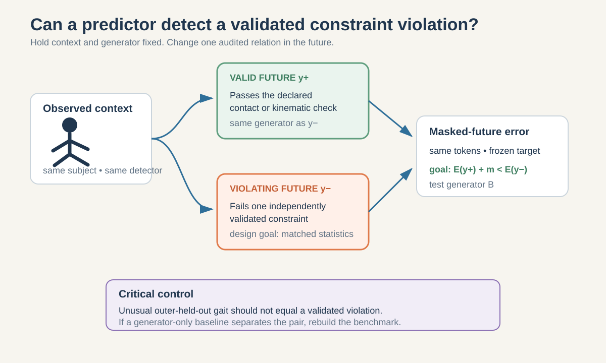
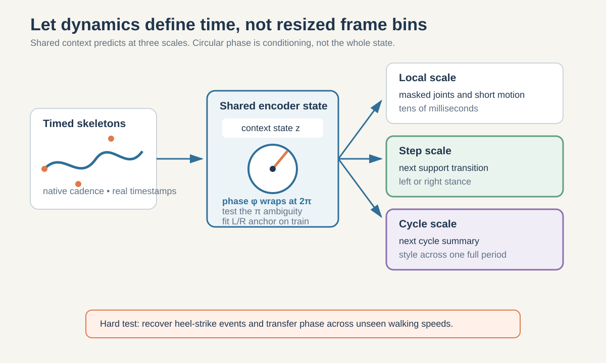
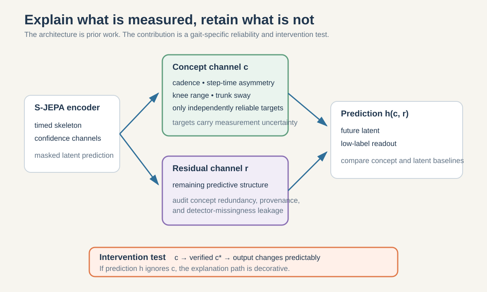
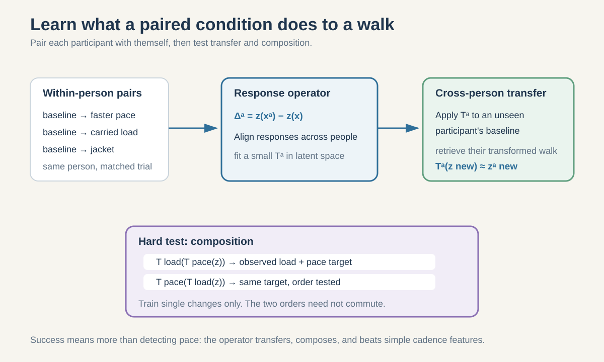
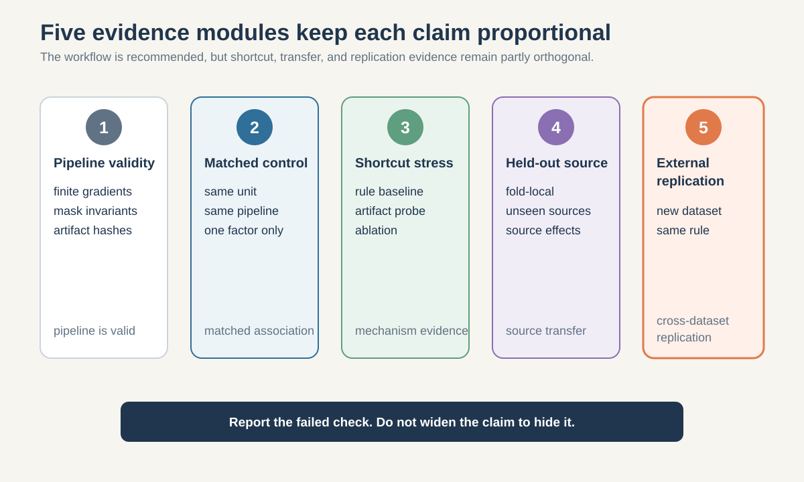

# Seven research directions for the next GAVD S-JEPA paper

**Research memo, revised 15 August 2026**

The ICLR 2027 abstract deadline is **18 September 2026 Anywhere on Earth**, and the paper deadline is **25 September 2026 Anywhere on Earth**. These are the current dates on the [official conference calendar](https://www.iclr.cc/Conferences/2027/Dates) and [author guide](https://iclr.cc/Conferences/2027/AuthorGuidelines). The main text limit is nine pages. This leaves about six weeks, so the best project is not the one with the largest possible system. It is the one that can support one sharp claim with decisive controls.

## Executive recommendation

The strongest deadline-feasible direction is **Readout-Conditioned Model Selection**, with the working paper title *Representation Quality Is Readout-Relative: Operator-Aware Checkpoint Selection for Skeleton JEPA*. It turns an internal inconsistency in the current pipeline into a general empirical question: a checkpoint that is good after global pooling need not be good when a downstream model can use centered token variation. The older `gavd2` studies report a small, same-video-confounded mean-ordering reversal across probe families and a lower-loss checkpoint that is worse under two probes. All historical probes consume the same mean-pooled embedding, so this clue is consistent with decoder-relative selection but says nothing yet about mean-versus-centered token operators. Decoder dependence already has prior theory, and the order-reversal proposition is elementary. The paper becomes significant only if natural preregistered readouts reverse checkpoint rankings on the same task and split under a corrected provenance-bound experiment, existing selection metrics fail out of run, and a simple Pareto or readout-balanced remedy replicates externally. This direction can reuse code and any recovered consistent lineage, not the currently missing augmented checkpoints.

The cleanest backup is an **Empirical Context-Capacity Frontier**. It asks how much timed history and latent capacity are needed to remain within a fixed uncertainty band around full-context future prediction. This study is less surprising, but it is feasible if reliable timestamps can be restored immediately and it yields a falsifiable capacity surface rather than another classifier.

The highest-upside longer-horizon stretch is a **Constraint-Violation Counterfactual Benchmark for Skeleton Predictors**. It asks whether a context-to-future predictor assigns a larger masked-future error to a trajectory that violates a prespecified and independently validated kinematic or contact constraint than to a generator-matched valid trajectory. The wording is deliberately narrower than “learned physics.” Monocular MediaPipe trajectories cannot establish dynamic possibility, and the current S-JEPA is a same-clip infiller rather than a future-energy model. Building a credible 3D oracle and two artifact-matched generators is not a realistic six-week fallback unless those resources already exist.

The ranking below is my deadline-aware re-ranking of the source collections for this codebase. It is not the order used by the original world-models notes. The qualitative assessments avoid false numerical precision. “Data ready” includes the availability of the required external benchmark and a reproducible local lineage.

|Rank|Direction|Prior-adjusted novelty|Data ready now|Critical-path risk|Strength of decisive test|Recommendation|
|---:|---|---|---|---|---|---|
|1|Readout-Conditioned Model Selection|Medium|Medium-high|Medium|High|Primary paper after artifact recovery|
|2|Empirical Context-Capacity Frontier|Medium-low|Medium|Medium|High|Clean backup if timestamps are reliable|
|3|Selective Symmetry and Anatomical Chirality|Medium|Low|High|High|Proceed only with real multi-view 3D data|
|4|Constraint-Violation Counterfactual Benchmark|Medium-high|Low|Very high|High|Longer-horizon stretch unless oracle and generators already exist|
|5|Learned Phase-Hierarchical JEPA|Medium|Low-medium|High|Medium-high|Better as an enabling result unless phase transfer is strong|
|6|Reliability-Audited Concept-Residual Benchmark|Low as a method|Low|High|Medium|A benchmark contribution, not a new architecture|
|7|Paired Transformation Operators|Medium|Low|Very high|High|Defer unless paired data and approvals already exist|

## What notebooks 00 to 06 actually establish

### The method, from raw video to representation

Notebook 00 builds a paper-aligned S-JEPA learning graph. A 64-frame sequence is divided into patches of four frames. Each sequence therefore has 16 temporal positions. With 33 MediaPipe landmarks, the model can form 528 joint-time tokens. The online encoder receives the deliberately unmasked tokens. An exponential-moving-average target encoder receives all available valid tokens without the deliberate prediction mask. It cannot make detector-missing landmarks complete. A predictor inserts learned mask tokens and predicts the target encoder's contextual latent distributions at the hidden positions. The central loss is centered, sharpened latent cross-entropy. VICReg adds invariance, variance, and covariance constraints to discourage collapse. After normal-only Stage 0, a condition-aware group loss encourages compact class groups and separated normalized centroids. This means only Stage 0 is condition-label-free. Stages 1 to 4 are supervised representation fine-tuning as well as latent prediction. The task is same-clip masked joint-time infilling. It is not causal future prediction and does not yet establish a world model.

Notebook 01 creates the canonical data manifest. The fixed cohort contains 96 sequences from 18 source videos: 12 normal, 9 Parkinson's, 12 stroke, 47 myopathic, and 16 cerebral palsy sequences. This is enough for pipeline development and paired mechanistic tests. It is not enough to estimate population-level clinical performance when some conditions are represented by only two or three source videos.

Notebook 02 extracts 33 MediaPipe Pose Landmarker Lite points on CPU. The same detector version, model, and confidence thresholds are used throughout the canonical cohort. Missingness is not random. Mean neurologic-landmark coverage is 0.991 for normal, 0.971 for Parkinson's, 0.943 for stroke, 0.993 for myopathic, and 0.986 for cerebral palsy. Stroke contains the worst individual sequence at 0.569, but 0.569 is not the stroke mean. Detector visibility can carry condition and source information even when coordinates are removed. This is why the missingness-only controls in Notebook 06 are essential rather than optional.

Notebook 03 permits prediction masks only on 12 shoulder, hip, knee, ankle, heel, and foot-index landmarks. It samples targets uniformly and never uses displacement, velocity, acceleration, or a learned motion score. The configured mask rate is 60 percent of the eligible tokens, but the batch-safe rule is limited by the least visible sample. In the completed curriculum, the realized eligible-mask fraction fell from 0.551 at Stage 0 to 0.423 at Stage 4. Relative to all 33 landmarks, the final hidden fraction was only 0.147. Thus the implemented pretext problem is a sparse, condition-dependent joint-infilling task, not the original S-JEPA's high-ratio global masking task.

Notebook 04 fills short internal gaps, centers every frame on the pelvis, scales coordinates by body width, replaces remaining missing entries with zero, and resizes every clip to 64 frames. These choices remove camera translation and body scale. They also remove elapsed duration and cadence as explicit inputs, although normalized motion can still contain indirect speed cues. In the augmented 159-sequence run, source videos range from about 15 to 30 frames per second, so four frames do not correspond to one fixed physical time interval. The encoder has width 96 and depth 4; the predictor has depth 2. The completed five-stage curriculum uses 75 normal sequences followed by cumulative Parkinson's, stroke, myopathic, and cerebral-palsy stages, reaching 159 sequences from 35 videos. Crucially, 63 of the 75 normal sequences come from added videos selected through an automatic window and MediaPipe-box extraction path, while the abnormal sequences retain canonical GAVD boxes. Extraction provenance is therefore confounded with normal-versus-abnormal status. The run uses 300 Stage 0 epochs plus four 75-epoch stages, totaling 11,400 optimizer updates. The final recorded losses and diagnostics are JEPA loss 0.478, VICReg loss 8.418, feature standard deviation 0.414, mean pairwise cosine 0.609, group-separation penalty 0.0379, minimum Euclidean distance 0.364 between normalized 96-dimensional group-loss centroids, and normal-anchor cosine 0.594. The nonzero standard deviation argues against total collapse. The anchor decline from 0.954 after Stage 1 to 0.594 after Stage 4 shows substantial drift.

Notebook 05 pools each sequence into a 384-dimensional vector using global and selected-token means and standard deviations. On the 96 canonical rows, cosine silhouette is 0.009, the minimum cosine distance between 384-dimensional pooled condition centroids is 0.0367, mean centroid distance is 0.2921, and mean within-condition distance is 0.1195. This 0.0367 quantity is defined in a different space with a different metric from Notebook 04's 0.364 group-loss diagnostic, so the two values must not be compared directly. Myopathic and cerebral-palsy centroids are closest. These results do not show five clean condition clusters. Normal-reference standardized distances are descriptive: normal 0.992, Parkinson's 2.852, stroke 2.099, myopathic 1.645, and cerebral palsy 1.466. A token-level consistency statistic was measured on only four sequences and should not carry a broad claim.

Notebook 06 attaches a class-balanced Random Forest with 100 trees, maximum depth 5, and square-root feature subsampling. Its all-96 split gives 0.793 accuracy, 0.889 balanced accuracy, and 0.821 macro-F1. Yet every test sequence was already exposed to the encoder, and all 16 test source videos overlap the training side. The exact earlier 68-row cohort gives 0.714 accuracy, 0.730 balanced accuracy, and 0.742 macro-F1, with the same encoder exposure issue. A video-grouped readout reaches mean macro-F1 0.826 for normal-versus-abnormal and 0.625 for five classes, but the frozen encoder still saw every row before the grouped Random Forest split. These are in-corpus decodability diagnostics. They are not generalization estimates for a new person, source video, camera, or clinic.

### What is solid, what is suggestive, and what remains unknown

|Evidence level|Supported conclusion|
|---|---|
|Established by implementation tests|The learning graph runs, mask constraints hold, some artifact contracts record hashes, and gradients remain finite.|
|Established for the completed run|The representation did not totally collapse; it drifted across the curriculum; labels are decodable inside a known corpus.|
|Suggestive only|The transductive embedding and coordinate pipeline has more in-corpus decodability than the missingness-only baseline. Source, camera, subject, provenance, and label-aware training remain inseparable.|
|Not established|Unseen-video, unseen-person, cross-camera, cross-dataset, or clinical diagnostic generalization.|
|Not established|That condition labels reflect causal pathophysiology rather than subject, source, acquisition, or detector provenance.|

One reproducibility issue needs resolution before any new experiment. Stored sidecars and reported outputs refer to the augmented experiment fingerprint `d0acc262...`, while the currently available cache was observed to contain canonical checkpoints with fingerprint `dba24a...`; the augmented checkpoints were not present during this audit. Some default paths also still mention `penny` or `gavd3`. Thus the reported augmented lineage is not currently reproducible from the local checkpoints. The paper must regenerate or recover one internally consistent artifact lineage, publish its manifest and hashes, and never combine metrics across these lineages.

### The design implications

The current evidence points away from a larger diagnostic classifier and toward controlled representation science:

1. Split by source video before any representation learning when claiming generalization. This is necessary, not sufficient: participant identities are unavailable, every source video belongs to only one condition, and Parkinson's and cerebral palsy each have only two source videos. Report raw source-level effects and leave-one-source-out sensitivity because ordinary bootstrap intervals are unstable at this support.
2. Preserve physical time or gait phase instead of resizing every clip blindly to 64 frames.
3. Treat landmark validity as uncertainty, not as a zero-valued coordinate.
4. Separate camera viewpoint, anatomical chirality, phase, and condition rather than asking one latent vector to absorb all factors.
5. Match pretraining masks, checkpoint-selection metrics, and final readouts.
6. Use the tiny labeled cohort for controlled contrasts and falsification, not inflated clinical claims.

## What the external idea collections contribute

The `worldmodels/gait` collection is larger than its seven approachable JEPA proposals. It also contains the original Skeleton-JEPA proposal, four generations of GAVD studies, a closed ablation program, two newer tutorial implementations, a long MAMP and S-JEPA literature review, a blocked independent-cohort plan, and neuroscience feature materials. Across this collection and 68 wiki notes, several themes recur under different names: physics violation, fall surprise, viewpoint invariance, phase hierarchy, multimodal teachers, personal baselines, and concept explanations. The useful synthesis is smaller than the file count. For this implementation and deadline, I re-rank the source ideas rather than reproduce their original order. The most valuable recombination is to turn physics intuition into a narrow matched constraint-violation test. The next is to treat camera viewpoint as a nuisance while retaining anatomical chirality. Dynamics factorization, learned gait phase, video-to-skeleton distillation, and concept audits supply additional components. Generic anomaly detection, full sensor fusion, active control, and months-long personal adaptation are too broad or too data-dependent for this deadline.

The `cody-jepa/tutorials` collection contributes a different insight: representation quality is always relative to a response operator. Mean pooling retains one subspace; token-centered readouts retain another. A single scalar quality score can fail when two legal downstream readouts prefer checkpoints in opposite orders. Its paired-condition and minimum-state tutorials then turn this principle into matched transformation and compression experiments. The personal-baseline tutorial is scientifically attractive, but the present corpus has too few repeated sessions per person.

These collections should not simply be concatenated. My deadline-aware portfolio narrows the physics notes into a constraint benchmark, uses readout geometry as the general analysis tool, and treats chirality, paired transformations, phase, and concepts as bounded alternatives.

### Source-by-source consolidation

The audit covered the seven proposals in the [gait README](/Users/theodoremui/dev/worldmodels/gait/README.md), every Markdown file under the [world-models wiki](/Users/theodoremui/dev/worldmodels/wiki/index.md), and all four research tutorials in the [Cody-JEPA overview](/Users/theodoremui/dev/cody-jepa/tutorials/00-overview-and-evaluation.md). Many of the 68 wiki files explain foundations rather than propose distinct experiments. The table below collapses repeated mechanisms while preserving the reason each family was accepted, merged, or deferred.

|Candidate family and representative sources|Scientific value|Main weakness|Disposition|
|---|---|---|---|
|Neuro-Concept JEPA; gait-analysis-and-fall-risk.md|Named measurements can support correction and audit|Monocular concepts may be noisy or clinically invalid|Retain as a reliability benchmark, ranked 6|
|Skeleton-JEPA; jepa.md; jepa-model-family.md|Strong implementation backbone|A backbone is not a research question|Use under every proposal, not as a standalone direction|
|MC-JEPA for Gait; mc-jepa.md; multi-task-self-supervised-learning.md|Motion and content factorization may improve robustness|Broad factorization objectives are hard to identify on this corpus|Merge its structured-factor idea into laterality and paired operators|
|Hierarchical JEPA for Severity; hierarchical-gait-world-model.md; tempo notes|Multi-scale time is well matched to gait|Severity labels are coarse and current frame resizing removes cadence as an explicit input|Replace severity hierarchy with learned phase hierarchy, ranked 5|
|JEPA prediction-error screening; energy-based-models.md|A predictive error gives a natural compatibility score|Ordinary anomaly scoring confuses rarity with a validated constraint violation|Replace with the narrow constraint benchmark, ranked 4|
|Cross-View JEPA; cycle-consistency.md|Viewpoint robustness is a real deployment problem|Naive reflection invariance can erase anatomical chirality|Refine into selective symmetry, ranked 3|
|V-JEPA clinical probe; v-jepa-2.md|RGB can teach cues missing from skeletons|Video-scale training and causal clinical claims are infeasible now|Defer; consider one RGB teacher only as future replication|
|gait-physics-iq.md; fall-anticipation-violation-of-expectation.md; intuitive-physics.md|Creates a sharp valid-versus-violating question|Synthetic negatives can leak generator artifacts and monocular pose lacks a physics oracle|Combine into Rank 4 with motion-capture validation and cross-generator controls|
|Objective-driven AI, model-predictive control, fall-prevention, and coaching notes|Connects perception to action and assistance|No validated action space, transition model, or safety evaluation|Defer beyond ICLR 2027|
|Multimodal gait, privacy, and ambient-intelligence notes|Could improve robustness across sensors|Alignment and missing-modality work is too large; embedding does not imply privacy|Defer full fusion and remove privacy claims|
|Optical-flow and PWC-Net notes|Motion fields can complement pose|Literal flow estimation does not address the central representation question|Use only as a baseline or possible teacher|
|VICReg, Barlow Twins, collapse, and covariance notes|Essential stability and diagnostic background|Swapping regularizers alone is incremental|Use as controls in Rank 1|
|Personal striving, user-model, and co-creation notes|Personal baselines are valuable for longitudinal change|GAVD lacks repeated sessions per person|Defer until a longitudinal cohort exists|
|Cody 01-readout-problem tutorials|Exposes objective and readout mismatch|Decoder dependence has prior theory; needs a real reversal|Strengthen with exact operators and external replication, ranked 1|
|Cody 02-paired-condition-geometry.md|Within-person contrasts reduce identity confounding|Paired interventions require new data and approvals|Refine into transferable operators, ranked 7|
|Cody 03-minimum-sufficient-state.md|Yields a clear capacity and history curve|Exact sufficiency is not identifiable from a finite sweep|Use an empirical context-capacity frontier, ranked 2|
|Cody 04-personal-baseline.md|Clinically intuitive change detection|One session per person cannot validate it|Defer|

### Complete audit of `/worldmodels/gait`

The folder mixes five different kinds of material, which must not be treated as equally strong evidence:

1. **Proposal scaffolds.** Seven top-level proposal families, including the original Skeleton-JEPA, contain an executable notebook with no saved outputs. They show that an experiment could be implemented. They do not show that its hypothesis is true.
2. **Historical experimental evidence.** The `skeleton-jepa/gavd`, `skeleton-jepa/gavd2`, and `skeleton-jepa/gavd2-ablations` studies contain stored results. These results expose leakage, probe-family dependence, artifact hazards, and optimization instability, but the controlled studies reuse a tiny collection whose 68 sequences come from only 12 source videos. The four locked ablation checkpoints are hash-bound. Only the two enhanced `gavd2` lanes lost predictor identity.
3. **Corrected but unfinished protocols.** `skeleton-jepa/gavd3-repr` repairs important representation and evaluation errors and passes smoke tests. Its corrected real model has not been trained, so it supplies a trustworthy experimental contract rather than a performance result.
4. **Partial and contaminated `gavd4` runs.** The S-JEPA series contains partial real preprocessing and an interrupted training run, but no completed checkpoint or evaluation. The MAMP extraction notebook failed to import `ambient`, synthesized all 666 skeletons despite `SMOKE_TEST=False`, and wrote them under `cache/real`. Those artifacts are not a trustworthy real baseline.
5. **Plans and supporting knowledge.** The literature review, root claim-boundary syntheses, Phase 3 data plans, neuroscience tables, slide decks, cached videos, and generated renderings are useful inputs. They are not additional replications. Generated slides, vendored libraries, duplicate notebook renderings, and cached media were treated as derived artifacts rather than independent scientific sources.

The directory-by-directory assessment is:

|Folder|Core hypothesis or role|Evidence present|Strongest reusable contribution|Decisive limitation|Decision for this memo|
|---|---|---|---|---|---|
|[`neuro-concept-jepa`](/Users/theodoremui/dev/worldmodels/gait/neuro-concept-jepa/README.md)|Split a latent into asymmetry, rhythm, and posture concepts|Proposal notebook with no saved outputs|Pose-derived proxy definitions and interpretable readout tests|Fixed subspaces are not identifiable; proxy concepts are only partly validated|Retain only as the Rank 6 reliability benchmark|
|[`mc-jepa-gait`](/Users/theodoremui/dev/worldmodels/gait/mc-jepa-gait/README.md)|Jointly learn RGB motion and content using optical flow, JEPA or VICReg, and warp consistency|Proposal notebook with no saved outputs|A warp-consistency motion branch, temporal-variability tests, and a camera-motion nuisance baseline|Broad multi-task objective, high compute, and flow that can encode camera shake|Use selected baselines, not a standalone paper|
|[`hierarchical-jepa-severity`](/Users/theodoremui/dev/worldmodels/gait/hierarchical-jepa-severity/README.md)|Use fine and coarse causal prediction errors as a severity score|Proposal notebook with no saved outputs|Causal future prediction and multiple temporal horizons|Severity is generated from the same engineered features, and abnormality need not be harder to predict|Replace severity with Ranks 2 and 5|
|[`jepa-anomaly-screening`](/Users/theodoremui/dev/worldmodels/gait/jepa-anomaly-screening/README.md)|Train on normal motion and use relative prediction error for screening|Proposal notebook with no saved outputs|A clean one-class baseline and error decomposition|Rarity, source style, missingness, and camera shift can all raise error; injected anomalies are circular tests|Use as a baseline for Rank 4, not as a clinical claim|
|[`cross-view-jepa`](/Users/theodoremui/dev/worldmodels/gait/cross-view-jepa/README.md)|Predict across camera views while protecting left-right identity|Proposal notebook with no saved outputs|The explicit warning that mirror invariance can erase laterality|No paired real views; noisy 2.5D reprojection is not real camera transfer|Retain only with external real multi-view data in Rank 3|
|[`video-jepa-clinical`](/Users/theodoremui/dev/worldmodels/gait/video-jepa-clinical/README.md)|Probe a public pretrained RGB V-JEPA on clinical gait clips|Proposal notebook with no saved outputs|A strong RGB teacher and RGB-versus-pose shortcut audit|It is mainly an application of an existing model, with severe identity and background leakage risk on 68 clips|Use as an external teacher or baseline|
|[`neuroscience`](/Users/theodoremui/dev/worldmodels/gait/neuroscience)|Map gait conditions to interpretable measurements and thresholds|Feature tables and an 18-page educational report|A broad candidate list of joint, timing, symmetry, kinematic, and variability measurements|Only Parkinson's and stroke tables are partly graded; cerebral-palsy and myopathic tables remain empty templates|Do not support five-class concept claims from these files|
|[`skeleton-jepa/proposal`](/Users/theodoremui/dev/worldmodels/gait/skeleton-jepa/proposal/PROPOSAL.md) and [`tutorials`](/Users/theodoremui/dev/worldmodels/gait/skeleton-jepa/tutorials/README.md)|Introduce and explain the latent masked-skeleton program|Original hypotheses and teaching material|The research questions, architecture vocabulary, and reproducible learning path|Later audits changed the valid estimands, and contextual latent skeleton prediction now has close prior work|Use as program history, not an empirical or novelty claim|
|[`skeleton-jepa/gavd`](/Users/theodoremui/dev/worldmodels/gait/skeleton-jepa/gavd/README.md)|Build the first full masked-skeleton pipeline|Stored prototype results from 42 surviving labeled sequences and 296 overlapping windows|A strong leakage demonstration and an artifact-lineage failure case|Only 42 of 68 intended labeled sequences survived; stale reports, earlier 26-clip behavior, and fresh-encoder fallback hazards complicate provenance|Use only for leakage and fail-open lessons|
|[`skeleton-jepa/gavd2`](/Users/theodoremui/dev/worldmodels/gait/skeleton-jepa/gavd2/README.md)|Compare small and enhanced JEPA recipes with sequence pooling|Stored results and notebooks|A reported same-task mean-ordering reversal across probe families and a proxy-loss mismatch|All probes use the same mean-pooled embedding; source confounding and overwritten checkpoint identities remain|Use as screening evidence for Rank 1|
|[`skeleton-jepa/gavd2-ablations`](/Users/theodoremui/dev/worldmodels/gait/skeleton-jepa/gavd2-ablations/README.md)|Test registered input, schedule, architecture, and probe upgrades|Closed development and locked internal resampling study with four hash-bound confirmation checkpoints|An inconclusive predeclared comparison with strong seed instability|The same 68 sequences and source videos support development and the locked check|Treat as an internal stability diagnostic|
|[`phase3/expanded-gavd`](/Users/theodoremui/dev/worldmodels/gait/skeleton-jepa/gavd2-ablations/phase3/expanded-gavd/README.md)|Freeze a larger candidate pool for a future check|553 candidate sequences across 85 video IDs|Same-release new-video feasibility and a frozen manifest|A balanced five-class analysis is bottlenecked at nine videos per class; participant identity, rights, and model remain unresolved|Do not call it an independent cohort|
|[`skeleton-jepa/gavd3-repr`](/Users/theodoremui/dev/worldmodels/gait/skeleton-jepa/gavd3-repr/README.md)|Correct context, target, collapse, provenance, and evaluation errors|Smoke-tested implementation and real corpus QC; no corrected real checkpoint|The best available experiment contract and negative-control suite|No claim-eligible real efficacy result exists yet|Use its protocol for the next study|
|[`skeleton-jepa/gavd4/data-gavd`](/Users/theodoremui/dev/worldmodels/gait/skeleton-jepa/gavd4/data-gavd)|Provide the larger annotated source manifest|666 annotated sequences across 103 video IDs|Source and extraction-feasibility evidence|No participant identities and no completed model result|Use for corpus planning only|
|[`skeleton-jepa/gavd4/notebooks-mamp`](/Users/theodoremui/dev/worldmodels/gait/skeleton-jepa/gavd4/notebooks-mamp/README.md)|Teach masked motion prediction with motion-aware masks|Saved output from a nominal real-mode extraction that failed open to synthetic data|A useful warning that data mode must be manifest-bound and fail closed|All 666 synthetic skeletons were written under `cache/real` after the `ambient` import failed|Not a trustworthy matched baseline until repaired|
|[`skeleton-jepa/gavd4/notebooks-sjepa`](/Users/theodoremui/dev/worldmodels/gait/skeleton-jepa/gavd4/notebooks-sjepa/README.md)|Teach a fuller S-JEPA pipeline with video-disjoint evaluation language|Partial real preprocessing and interrupted training|100 of 103 videos cached, 657 of 666 sequences extracted, and 82 windows from 19 normal videos|Training stopped at step 33 of 6000; no completed checkpoint or evaluation|Feasibility evidence, not a replication|
|[`skeleton-jepa/background`](/Users/theodoremui/dev/worldmodels/gait/skeleton-jepa/background/s-jepa-mamp-literature-review.md)|Compare MAMP, S-JEPA, Skeleton2vec, and gait-specific design choices|Detailed literature synthesis|A matched-objective and matched-mask experimental program|It synthesizes published action-recognition evidence rather than new gait evidence|Use to define baselines and novelty|
|[`skeleton-jepa/README`](/Users/theodoremui/dev/worldmodels/gait/skeleton-jepa/README.md) and [`CONTEXT`](/Users/theodoremui/dev/worldmodels/gait/skeleton-jepa/CONTEXT.md)|Reconcile study identities, evidence levels, and claim boundaries|Canonical cross-study synthesis|The most reliable map of what each result can support|A synthesis cannot replace missing corrected or external experiments|Use as the claim-language authority|

#### What the historical Skeleton-JEPA results actually add

The complete folder contains a valuable precursor to Rank 1 that was not visible from the top-level proposal README. The canonical [`gavd2` experiment review](/Users/theodoremui/dev/worldmodels/gait/skeleton-jepa/gavd2/notes/research-experiment-review.md) reports that, on the same repeated five-class sequence splits, the enhanced MLP-predictor checkpoint has higher means under linear and MLP probes, while the Random Forest narrowly reverses the order. The stored means are 0.621 versus 0.595 for the linear probe, 0.660 versus 0.629 for the MLP probe, and 0.581 versus 0.590 for the Random Forest. The transformer also achieves a lower pretraining loss, about 0.372 versus 0.542, without producing better linear or MLP means. This is consistent with a proxy and probe-family mismatch, which motivates Rank 1.

It is not yet a paper result. Every historical probe consumes the same mean-pooled 128-dimensional sequence embedding. The ordering may reflect linear, nonlinear, and tree decision-boundary compatibility, not conflict between mean and centered token subspaces. The splits share source videos, only one encoder seed supports each lane, and no paired uncertainty establishes that the Random Forest difference of 0.009 exceeds noise. The predictor comparison also changes architecture, parameter count, and predictor context input: the MLP receives context tokens plus their shared mean, while the transformer receives context tokens. Finally, the two lanes reused a model identifier and checkpoint filename, so the current cache cannot reproduce both checkpoints independently. The archival result is therefore a **screening precursor**: it justifies testing a broader readout-relative hypothesis but does not support the proposed token-operator mechanism.

The folder also contains three strong negative findings that should shape every new experiment:

- **The evaluation unit dominates.** The leaky window pipeline reported scores around 0.87 to 0.97, while sequence-level evaluation fell to roughly 0.49 to 0.66. More windows did not create more independent people or videos.
- **The locked upgrade comparison was inconclusive.** The [closed ablation report](/Users/theodoremui/dev/worldmodels/gait/skeleton-jepa/gavd2-ablations/results/tranche2-final-report.md) records that the predeclared A3+B5 combination reached accuracy 0.633 against 0.625 for its matched baseline, a difference of 0.0083 with conditional split interval [-0.0179, 0.0321]. One fresh seed moved negatively and another positively. The result does not establish equivalence or no effect. It argues against assuming that individually promising engineering changes combine additively.
- **Token diversity hid weak pooled sample diversity.** The [`gavd3-repr` publishability audit](/Users/theodoremui/dev/worldmodels/gait/skeleton-jepa/gavd3-repr/notes/research-publishability-review.md) records that the withdrawn predecessor had pooled clip standard deviation near 0.091 and effective rank near 1.4 out of 128 even though token-axis statistics looked healthy. These values show severe concentration, not necessarily total collapse. Flattening joint and time positions lets position embeddings masquerade as sample diversity.

These findings make a larger architecture sweep less attractive. They favor a smaller study in which the checkpoint identity, readout operator, outer group split, and sample-axis health measurements are all explicit.

#### What the corrected and planned studies do not yet add

The `gavd3-repr` protocol is the most rigorous implementation in the folder. It gives the target encoder every valid observed token, gives the predictor position-only target queries, measures VICReg across samples rather than token positions, distinguishes historical compatibility from matched comparison, and adds initial, random, coordinate, hand-feature, and nuisance controls. Its real self-supervised corpus contains 224 sequence records contributing 1,732 windows from 55 videos, and its matched labeled extraction contains 61 accepted sequences. Its real training and evaluation notebooks have not been completed. It is a method and feasibility contribution, not evidence that the corrected representation works.

The planned independent cohort is also not available. The `gavd2-ablations` Phase 3 status is `BLOCKED_NO_MODEL`, with unresolved participant identity, rights, ethics, and model readiness. The adjacent expanded-GAVD manifest is not independent data: it freezes 553 candidate sequences across 85 video IDs from the same release, and a balanced five-class analysis is bottlenecked at nine videos per class. The program's own optimistic paired-power calculation estimates 68 videos per class for 80 percent power on a five-point effect when discordance is 0.10, 132 at discordance 0.20, and 195 at discordance 0.30. The practical implication is simple: the September paper can make a representation-science claim with an external public replication, but it cannot credibly make a clinical population claim.

The `gavd4` directories are valuable teaching implementations, but their saved state requires careful separation. The [S-JEPA training notebook](/Users/theodoremui/dev/worldmodels/gait/skeleton-jepa/gavd4/notebooks-sjepa/05-pretrain-sjepa.ipynb) belongs to a series that demonstrates partial real feasibility: 100 of 103 videos were cached, 657 of 666 sequences were extracted, 82 windows were built from 19 normal videos, and training reached only step 33 of 6000. There is no completed checkpoint or evaluation. More seriously, the [MAMP extraction notebook](/Users/theodoremui/dev/worldmodels/gait/skeleton-jepa/gavd4/notebooks-mamp/02-extract-skeletons-exp5-exact.ipynb) ran with `SMOKE_TEST=False`, failed to import `ambient`, synthesized all 666 skeletons, and wrote them into `cache/real`. MAMP remains a required future motion-target baseline because published action-recognition experiments suggest that target choice matters, but this stored artifact cannot serve as that baseline. Real mode must fail closed and every manifest must bind the data mode. S-JEPA and Skeleton2vec also establish that contextual latent skeleton prediction is an existing method family, so “the first skeleton JEPA” is not a viable novelty claim. The sharper frontier is whether prediction targets, masks, time scales, and readouts preserve gait mechanisms under matched data and compute.

#### Neuroscience and concept-evidence audit

The neuroscience material is much weaker than its feature count suggests. The Parkinson's table has 87 rows, with 50 graded entries: 17 high, 23 medium, and 10 low confidence. The stroke table has 86 rows, with 46 graded entries: 17 high, 18 medium, and 11 low confidence. Every graded row cites a source, but some thresholds are author assumptions rather than validated clinical cutoffs. The cerebral-palsy and myopathic tables contain 85 rows each and no graded entries at all. They are templates.

The accompanying [gait-analysis report](/Users/theodoremui/dev/worldmodels/gait/neuroscience/gait-analysis-neuroscience.pdf) documents the original 68-sequence, 70/30 random-split Random Forest result of 0.76 accuracy with 82 pose-derived features. It also states the small-data and camera-quality limitations, but it does not repair source-video overlap or supply independent concept validation. Its feature diagrams are useful for nomenclature. They do not turn pose-derived quantities into verified clinical measurements. This audit is why Rank 6 is framed as reliability testing and remains below the main representation-science directions.

#### How the full folder changes the portfolio

The complete audit leaves the seven-way order unchanged but changes the reasons and the immediate gates:

1. **Rank 1 remains primary for deadline reasons, not because the folder validates its mechanism.** A small, confounded mean-order reversal across probe families is visible in archival `gavd2` notebook outputs. It is a weak screening clue about decoder-relative selection and has no direct implication for mean-versus-centered token operators. The first experiment must test a preregistered operator pair under a corrected lineage.
2. **Rank 2 receives additional design support as the backup.** The literature review and hierarchical proposal both expose the mismatch between fixed frame counts and gait time. It still requires reliable timestamps, external transfer, and future prediction rather than same-clip infilling.
3. **Rank 3 remains conditional.** The cross-view proposal correctly protects laterality, but the folder supplies no real paired multi-view or affected-side data. External data are mandatory.
4. **Rank 4 remains a longer-horizon stretch.** Normal-only anomaly scoring is a useful baseline, not proof of kinematic constraint sensitivity.
5. **Rank 5 is better viewed as a component.** Phase is valuable for multi-scale targets, but the folder supplies no verified event annotations or cross-speed result.
6. **Rank 6 is weakened as a five-condition benchmark.** Two of four pathology tables are empty, and monocular measurements need independent validation.
7. **Rank 7 remains data-blocked.** No suitable paired intervention collection or completed ethics path appears in the folder.

The immediate execution rule is therefore to recover the historical enhanced checkpoints if possible, use their stored reversal only as a screening clue, and run the confirmatory experiment through the corrected `gavd3-repr` contracts or a newly regenerated equivalent lineage. If that confirmation fails on fixed targets, splits, probes, and nuisance controls, switch to Rank 2 rather than adding more model variants.

## The ICLR quality bar used here

The [ICLR 2026 reviewer guide](https://iclr.cc/Conferences/2026/ReviewerGuide) asks whether a paper addresses a specific question, is motivated relative to the literature, supports its claims, and contributes something significant. It also states that beating the state of the art is not required. That favors a decisive scientific finding over a larger but confounded leaderboard.

Recent outstanding-paper announcements emphasize the same pattern. The [ICLR 2025 awards](https://blog.iclr.cc/2025/04/22/announcing-the-outstanding-paper-awards-at-iclr-2025/) selected *Safety Alignment Should be Made More Than Just a Few Tokens Deep*, *Learning Dynamics of LLM Finetuning*, and *AlphaEdit* after judging theoretical insight, practical impact, writing, and experimental rigor. The [ICLR 2026 awards](https://blog.iclr.cc/2026/04/23/announcing-the-iclr-2026-outstanding-papers/) selected *Transformers are Inherently Succinct* for a strong conceptual message and *LLMs Get Lost In Multi-Turn Conversation* for a scalable diagnosis with exceptional experimental design. The common lesson is not to copy their topics. It is to make one important failure legible, test its mechanism, and support the claim at the right scale. [Vision Transformers Need Registers](https://arxiv.org/abs/2309.16588) is another useful model of a memorable diagnosis paired with a simple remedy.

Each direction below is therefore judged by five questions:

1. Can the central claim be stated in one sentence?
2. Is there a result that could clearly falsify it?
3. Are shortcuts tested rather than assumed away?
4. Does the idea teach something beyond this one small gait dataset?
5. Can the decisive result be completed by 25 September 2026?

---

# Rank 1: Readout-Conditioned Model Selection

## Research question

**Do natural downstream readouts choose different checkpoints from the same training runs, and can a readout-aware selection rule or training objective reduce those conflicts?**

The current pipeline trains a token representation, regularizes one pooled view, applies a group loss to a 96-dimensional mean, and evaluates a 384-dimensional mean-plus-standard-deviation readout. These operators do not observe the same information. A model can improve the mean while destroying informative within-sequence variation, or preserve local variation while producing a weak mean.

The broader Skeleton-JEPA folder contains a useful historical clue. Under the same repeated five-class sequence splits, its enhanced MLP-predictor checkpoint has higher linear and MLP means, while the transformer-predictor checkpoint has a Random Forest mean higher by only 0.009. The transformer also has lower self-supervised loss. All three probes consume the same mean-pooled embedding, so this is at most evidence of probe-family dependence. It does not support the proposed mean-versus-centered token mechanism. The shared source videos, one encoder seed per lane, missing paired uncertainty, and overwritten checkpoint provenance make it archival rather than confirmatory.

## First-principles idea

Start with an idealized fixed-length, fully valid token matrix $X \in \mathbb{R}^{T \times d}$. Define the mean-token projector

$$
P=\frac{1}{T}\mathbf{1}\mathbf{1}^{\top}, \qquad C=I-P.
$$

$PX$ repeats the global token mean. $CX$ contains the centered token deviations. They are complementary and orthogonal in the idealized token space. A mean-pooling readout can use only $PX$. A centered local readout can use $CX$. A raw dense-token model can use both plus position, so it must not be described as living only in the centered subspace.

The notebook readout is more complicated. Validity differs by sequence, so define the sequence-specific weighted mean operator $P_w=\mathbf{1}w^\top/(\mathbf{1}^\top w)$ and $C_w=I-P_w$. Notebook 05 also concatenates standard deviations, which are nonlinear and are not represented by either linear projector. The paper should analyze both the exact notebook operator and the idealized $P/C$ decomposition, without pretending they are identical.

For sequence $i$, define its token mean $\mu_i$, the between-sequence covariance $B=\mathrm{Cov}_i(\mu_i)$, the mean within-sequence token covariance $W=\mathbb{E}_i[\mathrm{Cov}_t(X_{it}\mid i)]$, and the total covariance $\Sigma=B+W$. A naive trace fraction changes under an arbitrary invertible feature reparameterization. If $\Sigma$ is full rank, solve the generalized eigenproblem $Bv=\lambda\Sigma v$. The exact eigenvalue spectrum is invariant when both matrices undergo the same invertible congruence transformation and no basis-dependent regularizer is added. If $\Sigma$ is singular, a supported-subspace estimate, pseudoinverse, or isotropic shrinkage generally has only the weaker invariances explicitly guaranteed by that estimator, such as orthogonal transformations and global scaling. Preregister the estimator, report the full spectrum, and include a shrinkage-sensitivity analysis rather than advertising one universal scalar.

The order argument is an elementary proposition, not the main theoretical contribution. Let two performance functions evaluate the same checkpoints, downstream target, data split, probe capacity, label budget, and optimization protocol. If they differ only in readout and produce incompatible strict checkpoint orderings, then no scalar can be strictly order-preserving for both. Assigning a tie does not strictly rank the pair. If the target or protocol changes, the result is task-conditioned and does not isolate a readout effect. The scientific contribution must therefore be an observed, reproducible same-target selection failure across preregistered natural readouts, followed by a useful remedy.

## Relation to prior work

Representation diagnostics such as [RankMe](https://arxiv.org/abs/2210.02885) measure effective rank, while [LiDAR](https://arxiv.org/abs/2312.04000) uses surrogate self-supervised groupings and an LDA-rank statistic to estimate representation quality. [Rethinking the Uniformity Metric](https://arxiv.org/abs/2403.00642) shows that apparently simple quality measures encode choices about feature redundancy and collapse. [PCP-MAE](https://arxiv.org/abs/2408.08753) shows that a masked reconstruction path can exploit patch-center position without useful encoder information, which directly motivates the positional control here. [Conditional probing](https://arxiv.org/abs/2109.09234) asks what usable information a representation adds beyond a control. The [Decodable Information Bottleneck](https://arxiv.org/abs/2009.12789) already makes representation optimality depend on a chosen predictive family, so dependence on the decoder is not itself new. [VICReg](https://openreview.net/forum?id=xm6YD62D1Ub) explicitly shapes feature variance and covariance. The proposed contribution is narrower: an exact complementary token-operator decomposition, an observed checkpoint-order reversal, and a practical remedy for checkpoint selection.

## Proposed method

1. Recover the two historical enhanced checkpoints if possible and bind each to its exact configuration. Recompute the reported aggregate ordering only if both provenance-bound checkpoints exist; otherwise treat the notebook aggregates as archival. Then regenerate a corrected, provenance-bound experiment using the `gavd3-repr` contracts or an equivalent implementation. Before training, freeze the candidate checkpoint population, primary target, one primary operator pair, practical reversal margin, and nuisance tests. Begin with the two enhanced predictor families and one matched S-JEPA baseline. Expand to a compact objective or mask grid only if all three exploratory seeds meet the preregistered directional screen. Reserve five fresh seeds for confirmation and keep checkpoints nested within their originating runs in every statistical test.
2. Evaluate four legal operators:
   - mean only, using (PX);
   - centered local statistics, using (CX);
   - mean plus centered moments;
   - raw tokens with a position-aware lightweight probe.
3. Preregister one primary downstream target and analyze any secondary target separately. Within each target, hold the outer split, label budget, checkpoint population, probe parameter budget, and optimization protocol fixed while changing only the readout operator. Use label budgets supported by the rarest source group, then use a larger external dataset for fuller sample-efficiency curves.
4. Add conditional probes that measure gain beyond token position, landmark validity, camera or view metadata, and extraction provenance. Use source identity only as a within-corpus leakage probe, since unseen identities cannot be categorical test features.
5. Introduce a small readout-balanced regularizer that preserves variance in both (PX) and (CX), or alternates JEPA targets projected through (P) and (C). The remedy must be simpler than the diagnosis.

## Experiments that decide the paper

**E1, ordering reversal.** If two provenance-bound historical checkpoints are recovered, recompute their reported aggregate linear, MLP, and Random Forest ordering and label it forensic and source-confounded. Otherwise show the archival notebook aggregates without implying that predictions were retained. The decisive test then asks whether a preregistered mean-only operator and a preregistered centered-moment operator prefer opposite checkpoints under a regenerated lineage. The candidate checkpoint population, target, outer split, label budget, probe capacity, optimization budget, reversal margin, and nuisance tests are frozen before the screen. Require the opposite ordering direction in all three exploratory seeds, then confirm it with five reserved seeds and source-level uncertainty. One lucky checkpoint pair, the historical comparison alone, or a reversal between different tasks is insufficient.

**E2, diagnostic comparison.** Compare generalized-eigenvalue spectra, effective rank, collapse statistics, JEPA loss, validation loss, and existing centroid metrics as predictors of each readout's downstream performance. Use leave-one-run-out prediction to avoid correlating many checkpoints from one trajectory as though they were independent.

**E3, positional control.** Train raw-token probes with and without shuffled or explicit positional encodings. Measure the conditional gain of representation features beyond position. This prevents attributing easy temporal indexing to centered token content.

**E4, balanced remedy.** Test whether the proposed regularizer reduces ordering conflicts and improves worst-readout performance without increasing model size. Report Pareto fronts rather than a single favored readout.

**E5, external replication.** Repeat the exact operator analysis on one public skeleton or vision self-supervised setup, such as a compact [Skeleton2vec](https://arxiv.org/abs/2401.00921) or [MAMP](https://arxiv.org/abs/2308.07092) configuration. The general claim should not depend on GAVD labels.

The feasible plan starts with the historical forensic audit and a three-cell corrected screening grid with three seeds. Only a preregistered, sign-consistent disagreement justifies expanding toward 12 compact cells and using the five reserved confirmation seeds. Every checkpoint is reused across readouts. The reported augmented checkpoint lineage cannot be reused unless it is recovered and its hashes match the downstream sidecars. If the primary same-target operator pair does not reverse in the corrected grid, stop the study rather than search over other pairs.

## Adversarial review and kill criteria

The main risk is a result that is mathematically correct but practically obvious. It becomes significant only if the ordering reversal is robust across natural readouts, existing quality metrics fail out of run, and a simple Pareto selection rule or balanced objective improves the worst operator. The paper fails if all readouts rank checkpoints nearly identically, if position explains the apparent local advantage, or if the remedy merely moves performance from one readout to another. Avoid claiming that a dense raw-token probe accesses only (CX). Do not call a regularized trace summary basis-invariant.

## ICLR-level contribution

The paper would give a crisp empirical correction to a common practice: **checkpoint quality is not readout-free when natural readouts induce stable order reversals**. It would then turn that diagnosis into an actionable selection or training method. This is the safest proposal after one consistent artifact lineage is recovered or regenerated.

---

# Rank 2: Empirical Context-Capacity Frontier

## Research question

**Across a declared model family, what is the smallest tested history and latent capacity that stays within a fixed tolerance of full-context future prediction?**

A representation can be large and decodable without isolating the variables that actually drive prediction. Gait is approximately periodic but not perfectly so. The immediate future may depend on phase, recent joint velocities, support foot, and slowly changing style. The question is how much history and which joints are truly needed.

## First-principles idea

A predictive state (s_t) summarizes the past (x_{1:t}) for forecasting a future target (y_{t+1:t+h}). Exact minimal sufficiency requires assumptions about the process and model class that this finite experiment cannot establish. Estimate a context-capacity frontier instead:

$$
R(\tau,c)=\text{future prediction risk using }\tau\text{ seconds or phase span and }c\text{ latent channels}.
$$

The elbow of this curve identifies the smallest tested state whose uncertainty interval enters a preregistered epsilon band around the full-context model. This operational definition is measurable and honest.

## Relation to prior work

The [Decodable Information Bottleneck](https://arxiv.org/abs/2009.12789) relates useful compression to a specified downstream predictive family. A [sequential information bottleneck](https://arxiv.org/abs/2209.05333) compresses temporally coherent predictive information. Predictive-state representations and system identification already ask which state summarizes a dynamical history, while recent work studies [minimal predictive sufficiency](https://arxiv.org/abs/2508.03158). JEPA supplies one predictive model family. The contribution is an empirical skeleton frontier with interventions over elapsed history, joint support, latent width, and forecast horizon.

## Proposed method

1. Restore physical timestamps and define future horizons in milliseconds and gait phase, not in resized frame indices.
2. Train nested models with elapsed-history or phase windows from a fraction of a step to multiple cycles, latent widths from 8 to 128, and structured joint subsets.
3. Use one shared supernetwork with masks where possible so comparisons do not require unrelated optimization runs.
4. Add a bottleneck penalty or stochastic latent gate. Choose its strength only on outer-training videos.
5. Measure future latent prediction, not just condition classification. Then test whether the compact state supports low-label readouts of phase, pace, asymmetry, and condition.

## Experiments that decide the paper

**E1, context-capacity surface.** Plot prediction risk over elapsed history, latent width, and forecast horizon. Show raw source-level effects, leave-one-source-out sensitivity, and uncertainty around the tolerance crossing.

**E2, joint interventions.** Remove distal joints, one body side, upper-body context, or detector-validity channels. Compare random subsets of the same size. This reveals which structures supply predictive state.

**E3, temporal perturbations.** Test missing frames, irregular sampling, phase shifts, and playback-rate changes. A genuine predictive state should degrade smoothly and should benefit from real timestamps.

**E4, label efficiency.** GAVD's rarest groups have only two source videos, so it cannot support budgets of 4 or 8 videos per class. Use only budgets supported by every GAVD group, then estimate a fuller curve on an external dataset. Keep representation learning fold-local and compare full tokens, global means, and the compact state.

**E5, out-of-domain transfer.** Pretrain on one motion source and measure the sufficiency curve on another. A GAVD-only elbow may reflect detector quirks rather than gait dynamics.

**E6, simple baselines.** Compare phase plus velocity, an autoregressive linear model, a GRU, coordinate reconstruction, and S-JEPA. If phase and velocity match the learned state, that is an informative negative result.

## Adversarial review and kill criteria

The phrase “minimum sufficient” overstates what this grid can prove. Use “minimum tested state within tolerance.” Resizing clips to 64 frames would make the history axis meaningless, so timestamp repair is mandatory. The paper fails if compression only helps because it regularizes a tiny classifier, if the tolerance crossing is unstable across seeds, or if simple phase and velocity features match every benefit.

## ICLR-level contribution

This direction can replace vague claims of “compact motion understanding” with a measured resource curve. The central result would state exactly how predictive performance, robustness, and label efficiency change as temporal context and state capacity are reduced. It is feasible after timestamp repair, but its novelty depends on a surprising frontier or intervention result rather than compression alone.

---

# Rank 3: Selective Symmetry and Anatomical Chirality

## Research question

**Can a gait representation ignore camera viewpoint while preserving whether an asymmetric motion occurs on the left or right side of the body?**

Ordinary augmentation says that two views of the same walk should produce the same representation. That is only partly correct. A camera change alters projection, occlusion, foreshortening, and detector confidence while preserving anatomical joint identity. A separate anatomical reflection plus a left-right joint permutation creates a synthetic contralateral motion. These are different actions and should not share one invariance rule. GAVD does not provide verified affected-side or lesion-side labels, so this proposal cannot make a clinical laterality claim from GAVD condition labels.

## First-principles idea

Let $g$ render the same calibrated 3D motion from another camera while keeping anatomical joint identities fixed. For this observation change, seek invariance:

$$
z(gx) \approx z(x).
$$

Let $r$ instead reflect the 3D body in its sagittal plane and permute left and right anatomical joints. This creates a contralateral counterfactual. Seek equivariance rather than invariance:

$$
z(rx) \approx \rho(r)z(x),
$$

where $\rho(r)$ is a prespecified swap or sign action on a designated chirality subspace. Split the latent into $z=[z_{\mathrm{inv}},z_{\mathrm{chir}}]$. The first part should capture view-independent gait content. The second should change predictably when anatomy, not the camera, is reflected.

This prevents a common conceptual mistake. Invariance discards a transformation. Equivariance records it in a structured way.

## Relation to prior work

[GaitSet](https://arxiv.org/abs/1811.06186) and other gait systems already address cross-view identity recognition. [CCGR](https://arxiv.org/abs/2312.14404) combines clothing and view variation. General work on [class-pose decomposition](https://arxiv.org/abs/2207.03116), [invariant and equivariant representation components](https://openreview.net/forum?id=47lpv23LDPr), and [group invariants](https://openreview.net/forum?id=vWUmBjin_-o) makes the split architecture itself non-novel. Existing gait work also studies [view invariance](https://arxiv.org/abs/2010.09092) and [factor disentanglement](https://arxiv.org/abs/1904.04925). An ICLR contribution must therefore be a realistic selective-symmetry benchmark or a new identifiability result, not merely the two-part latent.

## Proposed method

1. Use public calibrated 3D multi-view motion or render the same 3D motion from held-out cameras, then run the same pose detector on every rendered view. Rotating noisy MediaPipe coordinates is not a camera benchmark.
2. Keep the camera action and anatomical reflection as separate code paths with explicit joint-identity tests.
3. Divide latent channels into invariant and chirality slots. Apply view invariance to the first and a known swap or sign representation to the second.
4. Predict masked latents in both original and transformed views. Add cycle consistency: rotate, reflect, then invert the transforms and recover the original latent.
5. Keep the final task label out of pretraining. Laterality supervision comes from known transformations, not diagnosis labels.

## Experiments that decide the paper

**E1, crossed transformation grid.** Train on a subset of rendered or real camera azimuths. Test unseen azimuths and separately generated contralateral motions. Measure motion retrieval, view leakage, and chirality decoding.

**E2, invariance versus equivariance.** Compare no augmentation, canonicalization, invariance to both actions, the selective rule, and an SE(3)- or O(3)-equivariant skeleton baseline. The preregistered hypothesis is that both invariant methods reduce view leakage, but only the selective method retains chirality. This is a result to test, not an assumed fact.

**E3, synthetic asymmetric perturbations.** Add matched left-knee and right-knee range reductions to otherwise identical motions. A chirality-aware representation should identify the side while a view classifier remains near chance.

**E4, real asymmetry.** Use verified unilateral perturbation or affected-side labels from an external dataset if available. Do not infer side from a GAVD diagnosis or viewing direction. Without such labels, limit the paper to synthetic chirality.

**E5, external multi-view test.** Use one public multi-view gait or motion-capture dataset to separate real viewpoint transfer from coordinate augmentation. Report performance by unseen view angle.

**E6, missingness controls.** Because reflection and camera angle change occlusion, include validity-only probes and occlusion-matched evaluation. Otherwise the model may learn which joints the detector misses.

## Adversarial review and kill criteria

The most serious threat is a synthetic group action that does not match real camera geometry. A method may succeed on rotated coordinates and fail on real videos. External multi-view evidence is mandatory. The second risk is tautology: a synthetic label designed to flip under reflection will of course reward a reflection-aware model. The paper fails unless the selective rule protects a real downstream factor under realistic observation noise. It also fails if view invariance comes mainly from detector missingness. GAVD is especially weak here because view is condition-confounded and canonical normal sequences do not cover both sides.

## ICLR-level contribution

The general lesson is simple: **two visually similar transformations may require different representation laws because one changes observation and the other changes anatomy**. The publishable contribution would be a benchmark showing that nuisance invariance erases a verified semantic factor under realistic projection and detector noise, plus a selective-symmetry remedy. The known invariant-equivariant split alone is insufficient.

---

# Rank 4: Constraint-Violation Counterfactual Benchmark for Skeleton Predictors

## Research question

**Can a context-to-future skeleton predictor detect a trajectory that violates a prespecified, independently validated contact or kinematic constraint, without treating every unusual real gait as a violation?**

This question starts from a basic distinction. Rare motion is not necessarily invalid. A person with cerebral palsy may have unusual yet feasible gait. Conversely, an edited stance foot can violate a known contact constraint even if the trajectory still looks smooth. The benchmark should test sensitivity to that controlled violation, not broad “physics understanding.”

## First-principles idea

Let $x_{1:t}$ be an observed context and let $y^+$ and $y^-$ be generator-matched candidate futures. The positive candidate satisfies a declared constraint. The negative candidate violates that constraint according to an oracle that is separate from the model being evaluated.

The current S-JEPA does not supply a scalar future energy. Construct one explicitly. Train the online and target encoders only on outer-training plausible motion. At evaluation, the online predictor receives the context and a fixed set of masked future positions. The frozen target encoder supplies latent targets for the candidate future at exactly those positions. Define

$$
E(x,y)=\frac{\sum_{j\in M}w_j\,\ell_{\mathrm{JEPA}}(\hat z_j(x),z_j(y))}
{\sum_{j\in M}w_j},
$$

where $M$ is fixed across the matched pair and $w_j$ is a preregistered validity or confidence weight. Normalize only with statistics fitted on outer-training valid motion. Lower error means the candidate is more predictable from the context. This is a constructed compatibility score, not an intrinsic probability or uncertainty.

First test a frozen vanilla predictor. Counterfactual ranking is a separate intervention:

$$
L_{\mathrm{rank}}=\max(0,m+E(x,y^+)-E(x,y^-)).
$$

This separation reveals whether ordinary predictive learning already captures the constraint and whether direct ranking teaches a shortcut.

## Relation to prior work

[S-JEPA](https://doi.org/10.1007/978-3-031-73411-3_21) predicts masked skeleton latents, while [I-JEPA](https://arxiv.org/abs/2301.08243) established latent predictive learning for images. The [V-JEPA intuitive-physics study](https://arxiv.org/abs/2502.11831) applies a violation-of-expectation evaluation to masked video predictors and tests properties such as object permanence and shape consistency. [Physics-IQ](https://arxiv.org/abs/2501.09038) instead benchmarks generated videos across fluid dynamics, optics, solid mechanics, magnetism, and thermodynamics, finding that visual realism does not imply physical understanding. Neither result licenses a physics claim from a smooth 2.5D skeleton edit. The closest skeleton work also includes physically plausible motion transfer in [Skeleton2Humanoid](https://arxiv.org/abs/2210.04294), motion-manifold modeling in [BEAT](https://arxiv.org/abs/2203.04713), and skeleton anomaly methods such as [COSKAD](https://arxiv.org/abs/2301.09489) and [HKVAD](https://arxiv.org/abs/2309.15662). [KinemaDiff](https://openreview.net/forum?id=uxTQeKAUh5) is a relevant physically plausible motion-prediction comparator. The proposed novelty is a matched, cross-generator constraint benchmark for predictive skeleton scores, not a new claim that kinematic rules equal physics.

## Proposed method

1. Start from calibrated 3D motion capture with a known floor and independently labeled contact events. GAVD alone cannot supply the oracle.
2. Use only two constraints for a bounded study:
   - stance contact: the stance foot follows the allowed floor-relative motion during a verified contact interval;
   - articulated-chain validity: a 3D joint edit passes or fails a preregistered simulator or OpenSim-based kinematic check.
3. Do not use static center-of-mass support, subject-observed range, or reversed phase as proof of impossibility. Dynamic gait, recovery steps, and backward walking make those heuristics ambiguous.
4. Produce valid and violating edits through the same optimizer, retargeter, renderer, camera, and pose detector. Match edit locality, derivative spectra, missingness, contact timing, and boundary smoothness.
5. Create generator A and structurally different generator B. Train any ranking intervention on A and reserve B for transfer.
6. Pretrain only on outer-training participants or a disjoint external corpus. Keep all GAVD evaluation source videos outside the encoder when testing unusual real gait.

## Experiments that decide the paper

**E1, frozen-predictor ranking.** On held-out motion-capture participants, report paired ranking accuracy and source-level effects for (E(x,y^+) < E(x,y^-)). Stratify by constraint and edit magnitude.

**E2, cross-generator transfer.** Fit thresholds or ranking loss with generator A, then test generator B. This is the minimum evidence that the model learned more than one edit signature.

**E3, shortcut controls.** Compare a rule oracle, derivative-spectrum classifier, generator-metadata classifier, GRU or Transformer predictor, coordinate reconstruction, vanilla S-JEPA, and ranking-tuned S-JEPA. Valid edits produced by the same pipeline are mandatory negative controls for the shortcut hypothesis.

**E4, unusual but unconstrained motion.** Evaluate outer-held-out GAVD Parkinson's, stroke, myopathic, and cerebral-palsy futures without fitting the encoder, normalizer, or threshold on their videos. Ask whether their score distribution is closer to unedited motion than to the validated violations. This is a non-equivalence check, not proof that every GAVD trajectory is physically valid.

**E5, oracle audit.** Have a simulator, OpenSim analysis, or biomechanical expert validate a sampled benchmark subset. Report agreement and ambiguous cases rather than forcing every edit into a binary label.

**E6, intervention ablation.** Compare the frozen predictor with ranking fine-tuning. If fine-tuning helps on generator A but hurts on B, it learned the generator rather than a transferable constraint.

If the oracle and generators already exist, the deadline scope is two constraints, two generators, one public motion-capture source, GAVD as a secondary unusual-motion check, three exploratory seeds, and five final seeds. Otherwise this is a post-deadline benchmark project.

## Adversarial review and kill criteria

The paper fails if a shallow derivative or generator classifier matches the JEPA, if the oracle has poor simulator or expert agreement, if performance disappears on generator B, or if ranking-tuned gains do not survive a frozen-predictor comparison. It also fails as an ICLR paper if the rule baseline fully solves every matched pair, because then the representation adds no knowledge. Prediction error is not danger, likelihood, calibrated uncertainty, or universal physical plausibility.

## ICLR-level contribution

The defensible result is: **a predictive representation ranks generator-matched, externally validated constraint violations above valid futures on unseen participants and a second generator, while not assigning the same score to every unusual real gait**. This would be a controlled benchmark principle for skeleton predictors. It should not be marketed as full intuitive physics.

---

# Rank 5: Learned Phase-Hierarchical JEPA

## Research question

**Can a model discover gait phase without phase labels and use it to predict motion at joint, step, and cycle time scales?**

The current four-frame tokens correspond to different physical durations across videos, and resizing every clip to 64 frames removes elapsed duration and cadence as explicit inputs. Yet walking is organized by events such as heel strike, toe-off, swing, and stance. A useful hierarchy should learn these repeated phases rather than treating time as 16 arbitrary bins.

## First-principles idea

Imagine a circular clock attached to a gait cycle. Its angle $\phi_t$ identifies where the walker is in the cycle. If $\phi$ advances by $2\pi$ per full cycle, cadence in cycles per second is $\dot\phi/(2\pi)$. Local joint motion evolves over tens of milliseconds, a step spans roughly half a cycle, and style changes more slowly. The model should learn states at these three scales:

$$
z_t^{\mathrm{local}}, \qquad z_t^{\mathrm{step}}, \qquad z_t^{\mathrm{cycle}}.
$$

The hierarchy predicts near-future local latents, the next support transition, and the next cycle summary. A circular phase bottleneck encourages periodic organization without forcing every gait to match one template.

## Relation to prior work

[GaitForeMer](https://arxiv.org/abs/2207.00106) forecasts 3D gait motion, while [hierarchical gait representations](https://arxiv.org/abs/2307.09856) model multi-scale structure. [MAMP](https://arxiv.org/abs/2308.07092) uses masked motion prediction, and S-JEPA predicts contextual skeleton latents. Circular phase estimation and phase-conditioned gait prediction are established ideas. The contribution would need to come from label-free phase transfer across speed and missingness, tied to a demonstrably useful multi-horizon JEPA objective.

## Proposed method

1. Preserve timestamps and retain native cadence. Extract overlapping windows rather than resizing each whole clip.
2. Learn a circular phase latent using sine and cosine coordinates. Encourage smooth forward progression but allow variable speed and brief reversals caused by noise.
3. Build three predictive heads: local masked-joint prediction, next-step transition prediction, and next-cycle summary prediction.
4. Align cycles through soft optimal transport or differentiable time warping only for the cycle-level loss. Do not use the aligner to leak future information into the online context.
5. Weight targets by confidence and represent missing joints explicitly.

## Experiments that decide the paper

**E1, label-free phase recovery.** Compare learned phase with heel-strike and toe-off events from a small independently annotated subset or motion-capture data. Learn the one global phase alignment on training annotations only, then report circular correlation and event timing error on untouched test events.

**E2, speed transfer.** Train on ordinary pace and test faster and slower walking. Separate phase error from cadence error. Compare fixed positional encodings, continuous-time encodings, and the learned clock.

**E3, hierarchy ablation.** Remove each prediction horizon and test local forecasting, step-event prediction, long-gap infilling, and low-label condition readout.

**E4, phase-matched masking.** Mask corresponding joint-phase regions rather than arbitrary resized bins. Test whether this improves cross-video prediction without using condition labels.

**E5, abnormal periodicity.** Evaluate whether the clock remains calibrated for asymmetric and irregular gait. Do not treat lower periodicity as pathology by definition.

**E6, external replication.** Validate phase recovery on a motion-capture or instrumented gait dataset with reliable contact events.

## Adversarial review and kill criteria

Periodic motion admits arbitrary offsets, direction ambiguity, and harmonic solutions. A model can learn a $\pi$-periodic left-right step signal while the intended full gait cycle is $2\pi$-periodic. Explicit anatomical side, alternating contact events, and held-out annotations are needed to distinguish them. The paper fails if phase accuracy comes from clip position after resizing, if the learned phase does not transfer across speed, or if the hierarchy adds parameters without improving a multi-horizon task. The timeline is risky because event labels and external data preparation may consume the available weeks.

## ICLR-level contribution

The paper would show that temporal units can be learned from dynamics rather than inherited from frames. A successful phase bottleneck would improve masked prediction and forecasting across frame rates and walking speeds. Without strong cross-speed phase recovery, this is better treated as infrastructure for the other proposals than as a standalone ICLR claim.

---

# Rank 6: Reliability-Audited Concept-Residual Benchmark

## Research question

**Can a gait representation explain its predictions through a small set of measurable biomechanical concepts while reserving a residual channel for information those concepts do not capture?**

A concept-only model is easy to inspect but may miss useful structure. An unrestricted latent model may predict well but provide no stable explanation. A concept-residual model attempts both: one channel predicts named quantities such as cadence, stance-time asymmetry, knee range, trunk sway, and foot clearance; a separate residual captures remaining predictive information.

The local neuroscience files do not yet supply a five-condition concept ontology. Parkinson's and stroke have partially graded, cited feature tables, but cerebral palsy and myopathic gait have only blank templates. Some numerical thresholds are author assumptions. The first contribution would therefore have to be measurement construction and validation, not merely attaching concept heads to the existing model.

## First-principles idea

Write the sequence representation as $z=[c,r]$, where $c$ is the concept vector and $r$ is a residual. Predict masked future latents from both. A downstream output is

$$
\hat y = h(c,r).
$$

At test time, an expert can change a concept to a plausible value and recompute the output. This is useful only if each concept is measured reliably, the intervention stays on the data manifold, and the residual is not a hidden duplicate of the concepts.

## Relation to prior work

[Concept Bottleneck Models](https://arxiv.org/abs/2007.04612) make predictions through human-named concepts, and [concept interventions](https://arxiv.org/abs/2302.14260) study how corrections affect outputs. [Concept-residual disentanglement](https://arxiv.org/abs/2312.00192) already studies leakage, residual information, and interventions, while [concept realignment](https://arxiv.org/abs/2405.01531) is another direct neighbor. The concept-plus-residual architecture is therefore not new. JEPA supplies a predictive backbone, and [OpenSim](https://opensim.stanford.edu/) can support higher-quality measurements. The credible contribution is a gait-specific reliability and intervention benchmark with direct comparisons to existing concept-residual methods.

## Proposed method

1. Separate biomechanics from acquisition quality. Candidate biomechanical concepts include cadence, left-right step-time difference, knee flexion range, and trunk sway. Detector coverage is a nuisance variable and belongs in the leakage audit, not the concept vector. Foot clearance and support duty factor require a validated ground plane and contact events, so do not use them on uncalibrated monocular GAVD poses.
2. Measure concepts from timestamps and skeletons, then audit reliability against human annotations or motion capture on a small subset. Attach uncertainty to each target.
3. Train S-JEPA with a concept head and residual latent. Use uncertainty-weighted concept loss. Penalize concept redundancy in the residual, then audit rather than assume that the penalty succeeded.
4. Permit missing concepts and train with concept dropout, so the model does not require every measurement for every sequence.
5. Use the concept channel for transparent readouts and the residual for predictive completeness.

## Experiments that decide the paper

**E1, concept validity.** Report repeatability, inter-rater or cross-sensor agreement, and sensitivity to detector noise. A concept with poor measurement reliability cannot support an explanation claim.

**E2, performance frontier.** Compare concept-only, residual-only, unconstrained latent, and concept-residual models on future prediction and low-label readouts. Plot interpretability against performance rather than selecting one metric.

**E3, intervention.** For held-out examples, replace one predicted concept with its verified value. Measure whether the output moves in the expected direction and whether aggregate performance improves. Keep interventions within plausible ranges.

**E4, residual and nuisance audit.** Probe how much concept information remains in (r), both linearly and nonlinearly. Test whether (r), (c), or the final output mainly contains detector coverage, camera or view metadata, extraction provenance, or within-corpus source identity.

**E5, counterfactual consistency.** Apply synthetic changes with known concept effects, such as reduced left-knee range. The concept prediction should change locally, while unrelated concepts remain stable.

**E6, clinician-facing test.** If expert time is available, run a small blinded ranking of explanation usefulness. This is optional for the deadline and should not replace quantitative validation.

## Adversarial review and kill criteria

Named concepts are not automatically causal, clinical, or understandable. Many are noisy when estimated from monocular MediaPipe landmarks. The model may route all useful information through the residual or make (h) ignore the concept input, reducing the concept path to decoration. The paper fails if concept targets are unreliable, verified concept corrections do not change (h) predictably, or the method does not improve on existing concept-residual baselines. It should not claim clinical actionability without expert and prospective evaluation.

## ICLR-level contribution

The meaningful result would not be a colorful explanation dashboard or a new architecture claim. It would be a controlled benchmark showing that **reliably measured concept corrections cause predictable improvements while a residual preserves performance**, together with clear limits on what monocular skeleton concepts can support.

---

# Rank 7: Paired Transformation Operators

## Research question

**Can a JEPA represent a paired condition difference as a reusable latent operator, separate from the person's baseline gait?**

A label such as “myopathic” groups many causes and subjects. A paired experiment asks a more controlled question: what changes in the representation when the same walker changes pace, carries a load, wears a jacket, or receives a synthetic joint constraint? Pairing removes much of the person-specific variation that confounds the current corpus.

## First-principles idea

For person or motion $i$, observe a baseline $x_i$ and a transformed version $x_i^{(a)}$ under condition $a$. The latent difference is

$$
\Delta_i^{(a)} = z(x_i^{(a)}) - z(x_i).
$$

If condition $a$ has a coherent effect, these differences should align across people. A simple operator $T_a$ should predict the transformed latent:

$$
z(x_i^{(a)}) \approx T_a(z(x_i)).
$$

The strongest claim is compositional: if pace change (a) and load change (b) are learned separately, then applying both operators should approximate the jointly transformed walk. This is not a causal claim unless the data collection truly randomizes interventions. It is a claim about consistent paired transformations.

## Relation to prior work

Factorized and equivariant representation learning asks whether known transformations correspond to structured latent actions. [Learning group actions](https://arxiv.org/abs/2002.06991) gives a general framework. Cross-view and clothing conditions are familiar in gait recognition, including [CCGR](https://arxiv.org/abs/2312.14404). The proposed study differs from ordinary condition classification by using within-subject pairs, operator transfer, and composition as the evaluation target.

## Proposed method

1. Use an existing paired dataset if it contains the required single and combined conditions. Collecting a new 12 to 20 participant treadmill study is credible for this deadline only if ethics approval, consent, equipment, and recruitment are already in place. Otherwise defer the direction.
2. Use timestamps and gait-cycle phase. Do not resize all trials to a common frame count before measuring pace.
3. Pretrain a compact S-JEPA only on outer-training participants or a disjoint external corpus. Fit linear, low-rank affine, and small nonlinear latent operators using only outer-training participants.
4. Factor each representation into subject-stable content and transformation response. Penalize subject information in the response only after verifying that this does not remove real biomechanics.
5. Add an operator-prediction pretext task: infer the latent transformation from paired clips while maintaining accurate masked latent prediction.

## Experiments that decide the paper

**E1, response consistency.** Measure alignment and dispersion of $\Delta_i^{(a)}$ across held-out participants. Compare coordinate features, the current S-JEPA, and the operator-trained model.

**E2, cross-person transfer.** Learn (T_a) on some participants, apply it to the baseline latents of unseen participants, and retrieve their true transformed clips. Report top-k retrieval and latent prediction error.

**E3, composition and order.** Train pace and load operators using single-condition pairs. Test both $T_{\mathrm{load}}(T_{\mathrm{pace}}(z))$ and $T_{\mathrm{pace}}(T_{\mathrm{load}}(z))$ against the held-out jointly transformed observation. Pace and load may not commute, so averaging the two orders would hide the scientific result.

**E4, nuisance test.** A jacket should alter RGB appearance but minimally alter skeleton dynamics. A skeleton representation should be stable, while an RGB representation may change. Conversely, pace should alter dynamics. This crossed control makes interpretation sharper.

**E5, sample efficiency.** Plot transfer performance versus the number of paired participants. Pairing should reduce the labels needed relative to unpaired condition classification.

## Adversarial review and kill criteria

Pace and clothing sensitivity are already known, so novelty cannot rest on detecting them. It must rest on transferable and compositional latent operators. The paper fails if operator retrieval does not beat simple cadence and joint-angle differences, if composition works no better than nearest-neighbor interpolation, or if the response remains dominated by participant identity. Small paired data can support a mechanistic result, but not broad medical claims. Counterbalance condition order to limit fatigue and practice effects. If paired data or approvals are not already available, this proposal is not feasible by 25 September.

## ICLR-level contribution

The desired result is that a learned representation supports **predictable paired transformations in latent space**, not only labels. This would move gait JEPA evaluation from “does the condition decode?” to “does a paired condition difference act consistently, transfer to a new person, and compose with another difference?” A causal intervention claim requires randomized or otherwise defensible intervention assignment.

---

## Shared experimental contract

Every proposal should use the same evidence checks. They are partly orthogonal rather than one strict ladder: shortcut testing can precede or follow source transfer, and one external dataset does not make a result universal. The diagram shows a recommended workflow, while claims remain tied to the exact checks passed.

### Data and split contract

1. Define the outer split by source video, and by participant when participant identity is available, before fitting preprocessing, representation learning, checkpoint selection, or probes.
2. Fit population normalizers, thresholds, concept calibrations, learned imputers, and augmentation hyperparameters on outer-training data only. A deterministic per-sequence transform may use that held-out sequence itself, such as centering it on its own pelvis or interpolating its own short gap, if the rule was frozen in advance.
3. Record whether each test row, source video, and participant was seen by the encoder.
4. Keep canonical and added-normal provenance separate. Either match extraction pipelines or stratify every result by provenance.
5. Publish one artifact lineage with immutable manifests, code commit, environment lock, data hashes, checkpoint hashes, and random seeds.

### Baselines

At minimum compare:

- coordinates plus a linear or Random Forest probe;
- hand-designed phase, velocity, and joint-angle features;
- missingness-only and source-provenance-only controls;
- a temporal neural baseline such as GRU or small Transformer;
- coordinate reconstruction with comparable capacity;
- vanilla S-JEPA;
- the proposed method with parameter-matched ablations.

Do not present the current transductive all-96 score as a state-of-the-art baseline. It answers a different question.

### Statistics

- Use at least five seeds for the final compact comparison.
- Treat checkpoints from the same run as correlated.
- Bootstrap by the highest independent unit, usually source video or participant. When a class has only two sources, also report every source-level effect, exact split enumeration where feasible, and leave-one-source-out sensitivity.
- Report paired effects for matched counterfactuals and interventions.
- Include class support and source support next to every classification metric.
- Preregister the primary metric, tolerance, covariance shrinkage, and stopping rule before the final sweep.
- Report negative and null results where they test the central claim.

### Claim hygiene

- Prediction error is not danger.
- Latent energy is not uncertainty unless calibrated.
- A compact embedding is not private by default.
- Abnormal does not mean physically impossible.
- Folder labels are not model-produced diagnoses.
- Video-disjoint probe training is not enough if the encoder saw the test videos.

## Ideas intentionally left outside the top seven

**Personal normative modeling** is attractive because change from one's own baseline can be more meaningful than distance from a population mean. The current data do not contain enough repeated sessions per person. Building that cohort before September is unrealistic.

**Full RGB, depth, inertial, force, and audio fusion** could be important later, but it multiplies alignment, missing-modality, and acquisition work. A single RGB teacher for skeleton distillation could be a bounded follow-up, not the main six-week paper.

**Generic normal-only anomaly detection** repeats the error that rare equals pathological or constraint-violating. It is weaker than a matched, independently validated counterfactual test.

**Objective-driven control and intervention planning** require an action space, reliable dynamics, and safety validation that these notebooks do not provide.

**Simply replacing VICReg or scaling the backbone** may improve metrics but does not create a distinctive research question.

## What the adversarial reviews changed

Three independent reviews forced material revisions. The final ranking promotes readout-relative quality from fallback to the primary paper because it has a cleaner six-week path, and it promotes the context-capacity frontier to the backup. The counterfactual proposal was narrowed from “physics understanding” to externally validated kinematic and contact compatibility and moved to a rank 4 longer-horizon stretch. The covariance claim now distinguishes exact full-rank generalized eigenvalues from finite-sample supported-subspace estimators. The order-reversal test now holds the target and complete probe protocol fixed. Numeric portfolio scores were replaced by qualitative judgments, prior work is treated as a constraint on novelty, and every diagram labels desired outcomes as hypotheses or tests rather than results. The reviews also exposed the class-confounded extraction pipeline, the augmented-checkpoint lineage gap, and the weakness of population claims from two-source conditions. The subsequent complete-folder audit added the archival probe-family clue, the inconclusive locked ablation, the untrained corrected protocol, the incomplete neuroscience ontology, the partial S-JEPA run, and the fail-open synthetic MAMP cache to the decision logic.

## Six-week execution plan

### 15 to 21 August: lock the scientific contract

- Recover or regenerate the consistent artifact lineage.
- Audit the historical `gavd2` mean-ordering report, recomputing it only if two provenance-bound checkpoints can be recovered.
- Freeze source-video splits and the primary metric.
- Freeze Rank 1's candidate checkpoint population, primary target, mean-only versus centered-moment operator pair, practical reversal margin, and nuisance tests before screening.
- Implement real timestamps, confidence channels, and fold-local preprocessing.
- For Rank 1, regenerate the first corrected three-cell confirmation grid, then implement the exact masked moment readout, idealized weighted (P/C) analysis, generalized covariance spectra, and grouped checkpoint analysis.
- For Rank 2, restore timestamps and run the smallest context-by-capacity screening grid with a fixed epsilon band.
- For Rank 4 only if resources already exist, audit one calibrated motion-capture source and two generator-matched counterfactual pipelines.

**Gate on 21 August:** the historical ordering can motivate but cannot pass this gate. Continue Rank 1 only if the frozen primary operator pair produces opposite checkpoint orderings beyond the declared practical margin in all three exploratory seeds, with the same target and no positional or provenance control explaining the effect. Do not search other operator pairs after seeing the result. Reserve five fresh seeds for confirmation. Otherwise choose Rank 2 if timestamps are reliable and the context-capacity crossing is measurable. Keep Rank 4 alive only if its constraint oracle is independently defensible, a shallow artifact baseline cannot separate valid and violating edits, and generators A and B can be held apart without delaying the main study.

### 22 to 31 August: obtain the decisive figure

- Run compact baseline and ablation sweeps.
- Produce the robust same-target natural-readout checkpoint-order reversal for Rank 1, or the uncertainty-bounded context-capacity surface for Rank 2. Treat a matched cross-generator result for Rank 4 as a separate stretch result.
- Start one external replication.
- Write the methods and evaluation sections while experiments run.

**Gate on 31 August:** if the central effect is not stable across three seeds and source-video bootstrap, stop expanding the system. Diagnose the failure or pivot to the next ranked proposal.

### 1 to 10 September: mechanism and remedy

- Complete shortcut controls and the simplest remedy.
- Freeze all model choices by 7 September.
- Run five final seeds and only preregistered analyses.
- Draft figures with captions that state the question, result, and limitation.

### 11 to 18 September: abstract and full draft

- Finish the external replication.
- Circulate a complete paper for adversarial review.
- Submit the abstract by 18 September AOE.
- Change only analyses needed to resolve a stated reviewer concern.

### 19 to 25 September: reproducibility and submission

- Package code, manifests, split files, environment, and seed-level results.
- Audit every claim against a figure or theorem.
- Verify the nine-page main text, ethics discussion, limitations, and AI-use disclosure.
- Submit by 25 September AOE.

## Final choice rule

Choose **Readout-Conditioned Model Selection** as the primary paper after recovering or regenerating one consistent checkpoint lineage. Continue only if the same-target reversal survives matched probe protocols and nuisance controls. If that effect fails, move to the **Empirical Context-Capacity Frontier** if timestamps pass the 21 August gate. Pursue the **Constraint-Violation Counterfactual Benchmark** only as a separate longer-horizon branch with an existing motion-capture oracle and cross-generator controls. It should not delay the primary paper.

Do not combine all seven into one paper. One main claim, one mechanism, one simple remedy, and one external replication are a stronger ICLR submission than seven partially validated modules.

## Central references

- Abdelfattah and Alahi, [S-JEPA](https://doi.org/10.1007/978-3-031-73411-3_21), ECCV 2024.
- Assran et al., [Self-Supervised Learning from Images with a Joint-Embedding Predictive Architecture](https://arxiv.org/abs/2301.08243), CVPR 2023.
- Bardes, Ponce, and LeCun, [VICReg](https://openreview.net/forum?id=xm6YD62D1Ub), ICLR 2022.
- Ranjan et al., [GAVD](https://doi.org/10.1109/ACCESS.2025.3545787), IEEE Access 2025.
- Grishchenko et al., [BlazePose GHUM](https://arxiv.org/abs/2206.11678), 2022.
- Wang et al., [Skeleton2vec](https://arxiv.org/abs/2401.00921), 2024.
- Mao et al., [MAMP](https://arxiv.org/abs/2308.07092), ICCV 2023.
- Darcet et al., [Vision Transformers Need Registers](https://arxiv.org/abs/2309.16588), ICLR 2024.
- Garrido et al., [RankMe](https://arxiv.org/abs/2210.02885), ICML 2023.
- Thilak et al., [LiDAR](https://arxiv.org/abs/2312.04000), 2023.
- Fang et al., [Rethinking the Uniformity Metric](https://arxiv.org/abs/2403.00642), 2024.
- Zhang et al., [PCP-MAE](https://arxiv.org/abs/2408.08753), 2024.
- Elazar et al., [Conditional Probing](https://arxiv.org/abs/2109.09234), EMNLP 2021.
- Dubois et al., [Decodable Information Bottleneck](https://arxiv.org/abs/2009.12789), NeurIPS 2020.
- Jiang et al., [Skeleton2Humanoid](https://arxiv.org/abs/2210.04294), 2022.
- Koh et al., [Concept Bottleneck Models](https://arxiv.org/abs/2007.04612), ICML 2020.
- Shin et al., [A Closer Look at the Intervention Procedure of Concept Bottleneck Models](https://arxiv.org/abs/2302.14260), ICML 2023.
- Barbiero et al., [Benchmarking and Enhancing Disentanglement in Concept-Residual Models](https://arxiv.org/abs/2312.00192), 2023.
- OpenSim, [musculoskeletal modeling and simulation](https://opensim.stanford.edu/).
- ICLR, [2026 reviewer guide](https://iclr.cc/Conferences/2026/ReviewerGuide), [2027 author guide](https://iclr.cc/Conferences/2027/AuthorGuidelines), and [2027 dates](https://www.iclr.cc/Conferences/2027/Dates).
