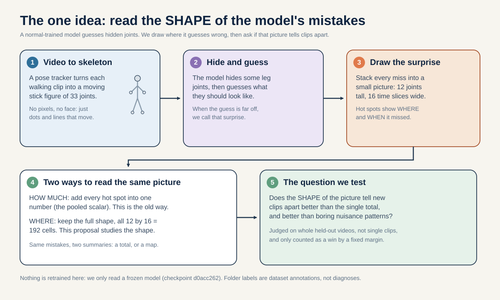
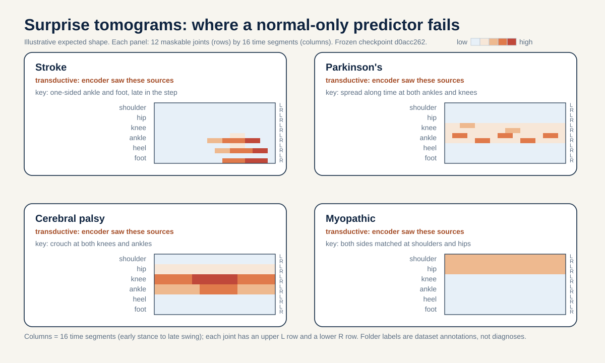
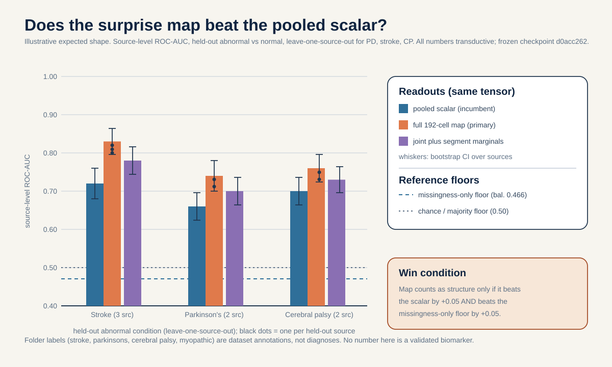
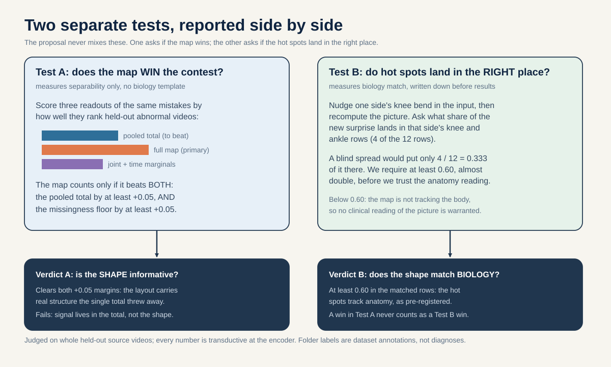

# Prediction-error tomography: is the *pattern* of masked-token surprise, not its pooled size, what carries condition structure?

> Within the same frozen normal-only prediction-error tensor, does the [12 joints x 16 segments] surprise-image structure separate held-out abnormal sources from normal by a pre-registered margin over the single pooled surprise scalar, without merely reproducing the missingness-only and provenance-only error maps?

In plain words: we build a small picture of where a normal-trained model guesses wrong on a body (12 joints across 16 time slices). The question is whether the shape of that picture tells apart new abnormal clips from normal clips better, by a fixed amount we set in advance, than just adding up all the error into one number. And we require that the picture is not just re-drawing two boring effects: joints the tracker lost, or the way the clip was extracted. Each hard term in the sentence above is defined below: held-out sources (the split section), pre-registered margin (+0.05, defined under the endpoint), pooled surprise scalar (the single average, defined next), and the missingness-only and provenance-only maps (defined under the baselines). There is also a plain-words Glossary near the end of this page if you want a single place to look terms up.

**Portfolio role:** world-model / predictive direction, rank 2
**Three-week endpoint:** 5 September 2026
**Estimated effort:** 8 to 12 researcher-days, almost entirely CPU: no encoder is retrained.

## The question in plain words

A JEPA (Joint Embedding Predictive Architecture) is a model that learns by hiding part of its input and trying to predict the hidden part. It does not predict raw pixels or raw coordinates. It predicts in its own internal feature space. In this project the input is a short skeleton clip: a stick figure of 33 body joints tracked across time. The model hides some joints, encodes the rest, and a small network called the predictor guesses what the hidden joints' features should be. When the guess is far from the truth, we say the model was *surprised*. The size of that mismatch is the prediction error.

The obvious way to use surprise for screening is to add it all up. Take one clip. Hide the leg joints. Measure how badly the predictor missed at every hidden spot. Average those numbers into a single scalar. Then call a clip abnormal when that scalar is large. This is the "how much surprise" idea. It is what the existing plan proposal 01 does: it pools masked-prediction error into one number.

This proposal asks a different question, and we argue a more informative one: not *how much* the model was surprised, but *where*. Every prediction target is a specific joint at a specific moment. There are 12 maskable joints (the shoulders, hips, knees, ankles, heels, and foot indices) and 16 time positions in a clip. So the errors form a small grid with 12 rows and 16 columns. We call that grid the **surprise image**, or tomogram, because it is a 2-D picture of where in the body and when in the gait cycle the normal-trained model fails to predict. The claim under test is that a stroke clip and a Parkinson's clip leave *different-shaped* surprise images even when their total surprise is similar, and that this shape carries condition structure that the single pooled number throws away.

Two words recur below. **Transductive** means the encoder was trained on the very clips we later evaluate. So a good evaluation number can reflect memorization rather than true generalization. A **source-video-disjoint split** means that when we hold out clips for testing, we hold out *whole YouTube source videos*, and never mix clips from one video across the train and test sides. We do this because clips from one video are not independent of each other. Both ideas govern every number in this proposal.

## Why this matters

A positive result confirms a specific belief about world models: that a predictor trained only on normal motion holds a *structured* expectation of the body. If that is true, its failures are patterned by anatomy and by time, and that pattern is a richer, cheaper anomaly signal than error size alone. If the surprise image separates held-out abnormal from normal by a real margin over the pooled scalar, then future skeleton screening pipelines should read *the map*, not the mean, and should compare it against nuisance maps before trusting it. That is a reusable evaluation lesson beyond this repository.

A null result is equally informative and rules out a plausible belief. If the full 12-by-16 map does no better than the single pooled number, then whatever condition signal survives normal-only prediction lives in the total amount of surprise, not its layout, and the extra spatial-temporal detail is just noise at this cohort size. If instead the map *does* separate conditions but its pattern matches the missingness-only map (where the pose tracker simply loses joints) or the provenance-only map (where the extraction pathway differs), then the structure is an acquisition artifact, not gait, and we must not claim it as a world-model property. Either null protects the field from over-reading a pretty heatmap.

## Conference-level augmentation

This section lifts the surprise image from an internal audit into a neuroscience-grounded, generalizable study. The core move is to stop treating the 12-joint x 16-segment map as an undifferentiated picture and to PRE-REGISTER, from the clinical literature and before looking at any result, exactly WHERE each condition's error mass should land. If lesion mechanism organizes prediction error in space and time, the topography is predictable in advance, and predicting it in advance is what turns a heatmap into a falsifiable hypothesis.

### The neuroscience chain: source, mechanism, skeleton-measurable feature

Each condition below is written as a chain: the neurological SOURCE (what is damaged), the MECHANISM (how that damage changes walking), and the SKELETON-MEASURABLE FEATURE (which cells of the 12 x 16 grid should carry the error mass). The 12 maskable landmarks are the left and right shoulder (11, 12), hip (23, 24), knee (25, 26), ankle (27, 28), heel (29, 30), and foot index (31, 32), each read over 16 time positions.

- LATERALIZED cells (error mass concentrated on one side, mostly at the distal knee and ankle landmarks). "Distal" just means far from the body's center, so knees and ankles down the leg, as opposed to "proximal" joints like hips and shoulders that sit closer to the center. STROKE: the source is a one-hemisphere corticospinal lesion (damage to the main movement-command wiring on one side of the brain). Because the pyramidal tract decussates (that word just means the tract crosses to the other side), a lesion on one side of the brain drives a deficit on the opposite side of the body. In plain words, damage on the left of the brain shows up on the right of the body, and vice versa. So the deficit is one-sided by construction (Natali/Javed StatPearls, PMID 30571044, PMID 30521239). The mechanism is stiff-knee gait with reduced swing-phase knee flexion, circumduction, hip-hiking, and a shortened paretic single-support phase (Chen, Patten, Kothari, Zajac 2005, PMID 15996592). The validated skeleton-recoverable readout is the step-length, swing-time, and stance-time Symmetry Ratio (Patterson 2010, PMID 19932621). HEMIPLEGIC CEREBRAL PALSY: the source is a one-sided early white-matter injury to the nerve fibers that serve the legs (the clinical name is periventricular leukomalacia, which just means damage to the white matter around the fluid spaces deep in the brain) (Volpe 2009, PMID 19081519; Back 2007, PMID 17261726), and the mechanism includes crouch, defined as minimum stance-phase knee flexion of at least 30 degrees (de Morais Filho 2010, PMID 20300011). EARLY PARKINSON'S also loads this lateralized axis because the symptoms usually start on the opposite side of the body from the brain region that is more worn down (the nigrostriatal side is a dopamine-making pathway deep in the brain; "contralateral" means opposite side) (Riederer and Sian-Hulsmann 2012, PMID 22367437).

- RHYTHM and VARIABILITY cells (error mass temporally dispersed along the 16 time positions at bilateral ankles and knees, rather than concentrated on one side). PARKINSON'S: the source is dopaminergic loss in the basal ganglia leading to a loss of automaticity (Redgrave 2010, PMID 20944662; Wu 2015, PMID 26102020). The mechanism is elevated stride-time variability (Hausdorff 1998, PMID 9613733), with a concrete anchor of stride-time coefficient of variation 8.8 percent in fallers versus 4.2 percent in non-fallers (Schaafsma 2003, PMID 12809998).

- SYMMETRIC-PROXIMAL cells (error mass bilaterally matched at the proximal hip and shoulder landmarks, with the temporal spread preserved rather than dispersed). A note on the grid: the underlying weakness is around the pelvis, but the pelvis is NOT one of the 12 maskable joint rows (the rows are shoulder, hip, knee, ankle, heel, and foot index). On this grid the pelvic-tilt signal can only show up at the nearest rows the grid actually has, which are the hip and shoulder rows, so that is where we pre-register the myopathy error mass. MYOPATHY: the source is primary muscle disease, which produces symmetric proximal weakness (Barohn 2014, PMID 25037080), showing NO significant left-right spatiotemporal asymmetry (Xiong 2023, PMID 37525241) and anterior pelvic tilt of 16.4 degrees versus 11.6 degrees with PRESERVED cadence, 2.25 versus 2.21 steps per second and not significant (Vandekerckhove 2022, PMID 35721358).

Skeleton validity for reading these cells at all: Stenum 2021 reports markerless temporal mean absolute error of 0.02 seconds per step and sagittal hip, knee, and ankle mean absolute errors of 4.0, 5.6, and 7.4 degrees (PMID 33891585). One boundary must be stated because the grid is a normalized 64-frame time base (16 positions), not seconds: the Parkinson's signature here is a WITHIN-WINDOW temporal-spread pattern across the 16 positions, not a cadence-in-hertz claim.

**Reading the math (why these numbers pin the topography).** These clinical anchors are what make the pre-registered map falsifiable rather than decorative.
- The crouch cutoff of 30 degrees (minimum stance knee flexion) and the stroke asymmetry pattern both say the error mass should be one-sided and distal (knee and ankle rows), not spread evenly.
- The Parkinson's coefficient of variation, 8.8 percent for fallers versus 4.2 percent for non-fallers, is roughly a two-fold gap; it says the Parkinson's signature is a spread ALONG the 16 time columns, not a single hot cell.
- The myopathy anchors, 16.4 versus 11.6 degrees of pelvic tilt with cadence 2.25 versus 2.21 steps per second (not significant), say the map should be left-right SYMMETRIC and proximal, landing on the hip and shoulder rows (the grid has no pelvis row, so the pelvic signal surfaces at the nearest available rows), with the temporal layout intact.
- Because each condition names DIFFERENT rows or a different axis of the same grid, a wrong prediction is visible: if the stroke mass were bilateral, or the myopathy mass were one-sided, the pre-registered template would fail.

To make the prediction bite, we add a synthetic-injection sanity check with a pre-registered numeric pass criterion, so the mechanism-alignment test is falsifiable in the same way as the primary endpoint. We amplify one-sided knee flexion in the input coordinates, recompute the surprise image, and measure the INDUCED error mass (perturbed image minus baseline image, clipped to the increase). The pre-registered pass rule is: at least 0.60 of the total induced error mass must land in the four target cells' rows, that is the perturbed side's knee and ankle landmarks (25 or 26 and 27 or 28) across their 16 time positions, versus the 4-of-12 = 0.333 share those rows would receive if the induced mass were spread uniformly across joints. Falling below 0.60 fails the test: the topography is not tracking anatomy and no clinical reading is warranted. This 0.60 threshold is set now, before any injection is run.
  - Reading the math (the 0.60 injection threshold):
    - "Induced error mass" is how much extra prediction error the one-sided perturbation created, summed over cells; we ask what fraction of it lands where anatomy says it should.
    - The perturbed side's knee and ankle occupy 4 of the 12 joint rows, so a blind, anatomy-blind spread would put only 4/12 = 0.333 of the mass there.
    - Requiring at least 0.60 means the matched rows must capture almost twice the uniform share before we call the topography anatomically aligned.
    - A fraction runs from 0 to 1; if we set the bar at 0.333 it would only match chance placement, so 0.60 is a deliberate margin above the uniform baseline.

### The generalizable claim (what transfers beyond gavd5)

The transferable principle is this: masked-prediction error in a skeleton world model is spatially organized by lesion mechanism, so the TOPOGRAPHY (which joint-time cells carry the error mass), not its magnitude, is the discriminative object, and a synthetic one-sided perturbation must move at least 0.60 of the induced error mass to the anatomically matching cells. Note the principle has two separable parts: the discriminative-object claim is what the map-versus-scalar AUC contest tests (undifferentiated separability), while the mechanism-organization claim is what the injection threshold and the reading key test (template alignment). This is a claim about how to READ any masked skeleton predictor, not a number tied to these 96 sequences. It reframes the existing plan-01 pooled scalar as the wrong summary statistic: pooling to one number discards exactly the mechanism-organized layout that the neuroscience predicts should be present. The claim generalizes to any JEPA-style masked predictor over anatomically labeled tokens, and it is testable by anyone who can build the same error grid and pre-register the same mechanism templates.

### External-cohort note (honest scope)

No participant-disjoint public SKELETON cohort exists for stroke, cerebral palsy, or myopathy gait, so cross-cohort transfer of the topography itself is an explicit honest limitation, not a claim. Any within-repo topography result stays transductive on the 18 canonical source videos, and the folder labels remain GAVD annotations, not diagnoses. The one available external anchor is a LABEL-LEVEL, cross-modal confirmation of the Parkinson's rhythm and variability arm only: PhysioNet Gait-in-PD (gaitpdb, reported by the dataset as 93 Parkinson's plus 73 controls, Hausdorff, DOI 10.13026/C24H3N) can corroborate that stride-time variability separates Parkinson's from controls. (Those participant counts come from the external PhysioNet dataset itself, not from our shared-facts file, so treat them as the dataset's own numbers.) That cohort is force and inertial-sensor data, not skeleton, so it confirms the biomarker DIRECTION (variability separates the groups), not the joint-time-cell topography this proposal measures. It cannot confirm the lateralized stroke or cerebral palsy cells or the symmetric myopathy cells, and we do not claim it does.

### Feasibility delta versus the original

The core of this augmentation is cheaper than it looks because it is still a test-time read of the frozen `d0acc262` checkpoint with NO encoder retraining. Core: about 2 to 3 weeks, matching the original 8-to-12-researcher-day, CPU-only estimate. The added work over the original is (a) writing down the four mechanism templates BEFORE looking, and (b) the synthetic-injection sanity check (amplify one-sided knee flexion, verify at least 0.60 of the induced error mass moves to the matching knee and ankle rows), plus the existing untrained-encoder and random-encoder floors. Data needs are unchanged: the cached tokens, the condition, source, and provenance columns, and a single fingerprint binding. Reach (adds weeks, still no retrain): the label-level PhysioNet Gait-in-PD cross-modal confirmation of the variability arm, which requires ingesting a second, non-skeleton dataset and computing stride-time variability there. There is no retrain-scale cost in either tier: the checkpoint is read, never fit.

## Background and related work

The machinery, built from scratch:

- **Tokens.** A clip is resized to 64 frames. Then 4 adjacent frames are grouped into one time patch, giving 16 time positions. Each of the 33 BlazePose joints at each of the 16 positions is one *token*, so there are 33 x 16 = 528 possible joint-time tokens. Each token starts as a 4-frame x 3-coordinate = 12-number vector, which a linear layer maps to an embedding of dimension 64. BlazePose is the pose tracker (Grishchenko et al., arXiv:2206.11678); it emits a monocular x, y, and a relative z per joint.
- **Encoder.** A small Transformer (depth 2, 4 heads) that turns tokens into features. There are two copies. The **online (view) encoder** sees only the visible tokens and is trained by gradient descent. The **target encoder** sees all 528 tokens and is *not* trained by backprop. Its weights are an **exponential moving average (EMA)** of the online encoder, which is a slowly trailing running average. An EMA teacher is like a slow-moving average of a stock price that ignores day-to-day noise. Its momentum follows a cosine schedule from 0.999 toward 1.0.
  - Reading the math (the EMA momentum range 0.999 to 1.0):
    - Momentum is the fraction of the old teacher weights kept at each step; the rest comes from the current online weights.
    - It is a fraction between 0 and 1. At 0.999 the teacher keeps 99.9 percent of its old value and mixes in 0.1 percent new. As it rises toward 1.0 the teacher moves even more slowly and becomes almost frozen.
    - If momentum were 0, the teacher would just copy the online encoder every step and give no stable target, which is the collapse the EMA is designed to prevent.
  The EMA teacher gives a stable prediction target and is the standard anti-shortcut trick in I-JEPA and V-JEPA (Assran et al., arXiv:2301.08243; Bardes et al., arXiv:2404.08471).
- **Predictor.** A 2-layer Transformer with a learned mask token. Given the visible tokens and the positions of the hidden ones, it outputs predicted features *only at the masked positions*. The training loss L_JEPA is a latent cross-entropy. Here is what that means step by step: the teacher's target features are first centered (a running EMA center with beta 0.9), then sharpened at temperature 0.06, then detached (**stop-gradient**, meaning no gradient flows back through the teacher). The prediction side uses temperature 0.10.
  - Reading the math (the two temperatures and the center):
    - A temperature scales how peaked or flat a set of scores is before comparison. A small temperature like 0.06 makes the teacher's target sharp, so it points confidently at a few features.
    - The prediction temperature 0.10 is slightly larger, which keeps the student's guess a little softer than the sharp target it is chasing.
    - beta 0.9 is the fraction of the old running center kept each step (90 percent old, 10 percent new); the center subtracts the average feature so no single direction dominates.
    - Both temperatures are positive numbers; smaller means sharper. If the teacher temperature were raised toward 1, the target would flatten and the training signal would weaken.
  This masked latent feature-prediction design follows V-JEPA (Bardes et al., arXiv:2404.08471), and the skeleton instantiation follows S-JEPA (Abdelfattah and Alahi, ECCV 2024, DOI 10.1007/978-3-031-73411-3_21).
- **Masking here is restricted.** Only 12 landmarks are maskable targets: left/right shoulder (11,12), hip (23,24), knee (25,26), ankle (27,28), heel (29,30), foot index (31,32). Face and arm joints are always-visible context, and are never predicted. The largest possible global mask fraction is therefore 12/33 = 0.364, well below V-JEPA's 75 to 90 percent.
  - Reading the math (the fraction 12/33 = 0.364):
    - This says at most 12 of the 33 joints can ever be hidden, so the biggest share of the skeleton that can be masked is 12 divided by 33.
    - 12 is the number of maskable leg-and-shoulder joints; 33 is the total joint count.
    - A fraction is between 0 and 1; 0.364 means about 36 percent, which is small compared with V-JEPA's 75 to 90 percent range.
    - If more joints were maskable, this fraction would rise; the low value is why the surprise image is only 12 rows tall.
  The configured target masks 0.60 of eligible tokens; the realized mean eligible fraction drifted from 0.551 to 0.423 across training. The sampler never reads joint size, velocity, or a learned motion score. Every prediction target in this proposal lives on exactly this 12-joint x 16-segment grid, which is why the surprise image has that shape.
- **Anti-collapse.** The total training loss is `L = L_JEPA + 0.05 * L_VICReg + 0.25 * L_group`.
  - Reading the math (the total loss):
    - This says the total training loss is a weighted sum of three parts that are added together.
    - L is the total loss the optimizer tries to make small; smaller is better.
    - L_JEPA is the main prediction loss (student guess versus teacher target); it has an implied weight of 1, so it dominates.
    - L_VICReg is the anti-collapse loss; the `*` means its value is multiplied by 0.05, a small weight, so it only nudges features apart without overpowering prediction.
    - L_group is the label-aware condition-centroid loss; the `*` means its value is multiplied by 0.25, a larger weight than VICReg but still below the main term.
    - The `+` signs just add the three weighted parts into one number.
    - The subscripts name each part: JEPA is prediction, VICReg is variance and covariance, group is the label-aware centroid term.
    - If the VICReg weight were set to 0, features could collapse toward a constant; if the group weight were set to 0, Stages 1 to 4 would stop being label-aware and become pure self-supervision.
  VICReg (Bardes, Ponce, LeCun, ICLR 2022, arXiv:2105.04906) adds a variance floor and a covariance penalty so features do not collapse to a constant. L_group is a label-aware condition-centroid term active only in Stages 1 to 4, which makes those stages supervised fine-tuning, not pure self-supervision. We do not touch these weights; we read a frozen model.
- **Leakage framing.** Kapoor and Narayanan (arXiv:2207.07048) catalog how "no independent test set" and train-test contamination inflate ML-for-science results. GAVD is the source dataset (Ranjan et al., IEEE Access 2025, DOI 10.1109/ACCESS.2025.3545787). Because the released checkpoint saw every clip, every number we quote is transductive unless the source video was held out.
- **Two extraction pathways, in plain words.** Clips were pulled from the YouTube videos in two ways. The **canonical** pathway is the plain, direct extraction; every abnormal clip (stroke, Parkinson's, cerebral palsy, myopathic) comes through it. The **augmented** pathway is an extra way of cutting extra normal windows out of video to add more normal examples; most normal clips come through it. So the words "canonical" and "augmented" name *how the clip was made*, not the person or the condition. This matters because a model could learn to tell apart the two extraction styles instead of learning gait, which is exactly the provenance confound we control for below. "Augmented-normal" just means a normal clip that came through the augmented pathway.

## Method

Nothing here retrains an encoder. We reuse the frozen curriculum-final checkpoint and the cached 528-token tensors.

1. **Bind to one fingerprint.** Use the curriculum-final checkpoint whose fingerprint prefix is `d0acc262`. A second lineage prefix `dba24a` has been seen locally; we ignore it and state the single fingerprint on every figure. This removes the lineage confound before any fitting.
2. **Build the frozen surprise tensor.** For each clip, run the standard normal-only masked-prediction pass and record the per-target prediction error at every masked [joint, segment] cell. To get a value in all 12 x 16 = 192 cells despite the batch-safe sampler leaving some cells unmasked in any single pass, average over repeated mask draws with a fixed seed until every cell has a matched number of masked observations (see repairs). The output per clip is a dense 12-by-16 surprise image plus its pooled scalar (the mean over cells).
   - Reading the math (192 cells): 12 x 16 = 192 says the grid has 12 joint rows times 16 time columns, so 192 error values per clip; the pooled scalar is the single average of those 192 numbers.
3. **Reuse the cached artifacts.** Token tensors, validity masks, and the cached missingness features already exist per clip; we join on clip id after verifying the provenance column is present. No new extraction. (The number 96 counts the clips in our main cohort, so "all-96 missingness-only" just means the visibility-only readout was scored across all 96 of those clips. The 0.466 balanced-accuracy score reported later is that visibility-only input read across all 96 clips.)
4. **Three readouts from the identical tensor.** From each clip's surprise image compute (a) the **pooled scalar**, (b) the **full 192-cell map** flattened, and (c) the **two marginals** (12 per-joint means and 16 per-segment means, so 28 numbers). All three come from the same error tensor with encoder, loss, and mask fixed, so any difference is a readout difference, not a model difference.
5. **Freeze the joint-to-condition prior list before results.** Taken verbatim from the prose in `notes/02_paper_draft.md` and locked now: stroke -> unilateral, paretic-side reduced hip/knee/ankle range of motion, foot drop at ankle/heel/foot-index, stance-swing asymmetry; Parkinson's -> asymmetric early onset, postural sway, reduced cadence, so shoulder/hip asymmetry and cadence-linked segment structure; cerebral palsy -> crouch gait, abnormal ankle positioning, reduced hip extension, limb asymmetry at knee/ankle/hip; myopathic -> bilateral symmetric proximal hip and knee involvement, near-normal step-to-step variability. This list is a qualitative reading key for the heatmaps only; it is not fitted and drives no numeric endpoint.

### Worked example (illustrative numbers only)

The numbers here are made up to show the arithmetic. They are not grounded facts; only the +0.05 margin is real.

Suppose we score sources by two readouts and get these source-level ROC-AUC values (illustrative):

- Full 192-cell map: AUC = 0.82
- Pooled scalar: AUC = 0.74
- Missingness-only map: AUC = 0.75

Now check the two pre-registered conditions:

- Map minus scalar = 0.82 - 0.74 = 0.08. This is at least +0.05, so condition (i) passes.
- Map minus missingness-only = 0.82 - 0.75 = 0.07. This is at least +0.05, so condition (ii) passes.

Both hold, so in this illustrative case we would score the map as carrying real structure. If instead the map had scored 0.78, then 0.78 - 0.74 = 0.04, which is below +0.05, so condition (i) fails and we score a null. Read against the pre-registered margin: the map only wins when it beats the scalar by +0.05 AND beats the missingness floor by +0.05.

### Code sketch: the source-video-disjoint split and the readout contest

```python
import numpy as np

# surprise_images[i] is one clip's 12-joint x 16-segment error grid (192 cells).
# source_id[i] is the YouTube video the clip came from (the independent unit).
# label[i] is 1 for abnormal, 0 for normal.

def pooled_scalar(image):
    # "how much" surprise: the mean over all 192 cells
    return image.mean()

def full_map(image):
    # "where" the surprise is: flatten the 12x16 grid into a 192-vector
    return image.reshape(-1)

# Leave-one-SOURCE-out: hold out whole videos, never single clips,
# because clips from one video are not independent of each other.
def leave_one_source_out(source_id):
    for held_out in np.unique(source_id):
        train_mask = source_id != held_out   # clips from other videos
        test_mask = source_id == held_out     # clips from this video only
        yield train_mask, test_mask

# For each readout we fit on train clips, score test clips, and later
# turn per-clip scores into a source-level ROC-AUC across held-out sources.
# The contest: does full_map out-rank pooled_scalar by at least +0.05?
```

## The decisive experiment

**Split, stated before any fitting.** Source-video-disjoint holdouts. The independent unit is the source video, not the clip. Per-condition source counts are tiny and fixed: normal 1, Parkinson's 2, stroke 3, myopathic 10, cerebral palsy 2. Because there is exactly one normal source (all 12 normal sequences come from video `3KnFt8bH3tE`), we cannot do a normal-source holdout, so the **primary comparison is a within-tensor readout contest**, not an absolute detector: for each abnormal condition we ask whether the full map beats the pooled scalar at ranking held-out abnormal sources above normal, using leave-one-source-out for Parkinson's, stroke, and cerebral palsy and reporting every source as its own dot. The metric is source-level ROC-AUC with bootstrap confidence intervals over sources and a source-level permutation null.

- Reading the math (ROC-AUC): this is the probability that a randomly chosen abnormal source is ranked above a randomly chosen normal one; it runs from 0 to 1, where 0.5 is chance and 1.0 is perfect, so higher is better.

**Restrict to one extraction pathway** for the primary contrast where possible. Recall that "canonical" means the plain, direct extraction and "augmented" means the extra way of cutting more normal windows. Every abnormal clip came through the canonical way, so we compare the abnormal maps against each other, and against normal, using canonical clips only. The augmented-normal clips (normal clips made the augmented way) are kept separate and labeled, so that a difference in extraction style cannot masquerade as a difference in gait.

**Primary endpoint.** Source-level ROC-AUC of the full 192-cell map readout minus the same metric for the pooled scalar, macro-averaged over held-out abnormal sources.

**What the primary endpoint does and does NOT test.** This headline number measures undifferentiated 192-cell separability: whether the flattened error map, treated as one 192-dimensional feature vector with no per-condition template attached, ranks held-out abnormal sources above normal better than a single pooled number does. It does NOT test whether the error mass lands in the specific cells the mechanism templates predict. A map that separates conditions by loading entirely the "wrong" cells (or by loading a nuisance pattern) could still win this contest. Therefore an AUC win here must not be read as confirming the pre-registered per-condition templates (stroke lateralized-distal, Parkinson's temporally dispersed, myopathy symmetric-proximal). The mechanism-topography prediction is tested by two OTHER instruments: (1) the synthetic one-sided knee-flexion injection with its pre-registered 0.60 mass-in-matched-rows threshold, and (2) the qualitative reading key over the source-averaged heatmaps. The AUC contest and the template-match test are reported as separate results and never conflated.

- Reading the math (the endpoint difference and macro-average):
  - The endpoint is one AUC minus another AUC: full-map AUC minus pooled-scalar AUC. A positive value means the map ranks sources better than the scalar.
  - The difference ranges from -1 to +1; near 0 means the two readouts tie.
  - "Macro-averaged" means we compute the difference per condition and then take a plain average across conditions, so a condition with many sources does not swamp one with few.

Confound caveat, restated here so it is not lost in the split paragraph above: the "abnormal vs normal" ranking has exactly one normal source (all 12 normal sequences come from video `3KnFt8bH3tE`), so the normal comparator is fully source-confounded. The endpoint is therefore a within-tensor readout contest (does the map out-rank the scalar on the identical error tensor), not a claim that the map is an absolute abnormal-vs-normal detector. Any absolute AUC against the single normal source is reported only as context, never as a discrimination claim.

**Pre-registered margin** (mirrors plan proposal 01). The map is judged to carry structure only if BOTH hold: (i) full-map AUC exceeds pooled-scalar AUC by at least +0.05, AND (ii) full-map AUC exceeds the missingness-only map AUC by at least +0.05.

- Reading the math (the +0.05 margin):
  - +0.05 is the smallest AUC lead the map must show to count as a real win. It is on the same 0-to-1 scale as AUC, so it is a five-hundredths jump.
  - Condition (i) guards against the map merely re-describing the pooled scalar; condition (ii) guards against the map merely re-describing missing joints.
  - If we set the margin to 0, any tiny random lead would count as a win, which is exactly the over-reading this rule prevents.

In plain words: the map must beat the pooled scalar by +0.05 and must also beat the missingness-only control by +0.05. If the map's advantage over the scalar is matched by the missingness-only or provenance-only map, we score a null and attribute the structure to a nuisance, not to gait. One wording note: an earlier saved to-do for this proposal wrote condition (ii) as the map "not beating missingness-only by the same margin." We take that to mean the clear, correct version: the map must beat the missingness-only floor by +0.05. That is the version used here and in Figure 2's win-condition box.

**Simple non-neural / nuisance baselines.** Three reference lines, all from non-neural inputs: the **missingness-only** map (per [joint, segment] visibility, no gait coordinates; the all-96 missingness-only readout already scores balanced accuracy 0.466), the **provenance-only** map (augmented-vs-canonical pathway indicator), and the **majority-class floor**.

- Reading the math (balanced accuracy 0.466): balanced accuracy is the average of the per-class hit rates, so it runs from 0 to 1 and does not reward simply guessing the biggest class; 0.466 is near the low end, which is why the missingness-only map is a weak nuisance floor.

Note on a raw-coordinate ceiling. Sibling proposal 05 uses a raw-coordinate spatial probe as a ceiling to decide whether the learned representation adds anything over the input. That ceiling is not directly applicable here, because the object under test is a prediction-error tensor produced BY the frozen predictor, not a coordinate readout; there is no raw-coordinate analogue of "where the model was surprised" without a model. The role a raw-coordinate ceiling would play (guarding against the map merely re-encoding trivial input structure) is instead covered by the missingness-only floor (visibility, no coordinates) and the provenance-only floor (extraction pathway). We state this so reviewers do not read the absence of a raw-coordinate ceiling as an oversight.

| Readout / baseline | Input | Endpoint | Pre-registered role |
|---|---|---|---|
| Pooled surprise scalar | 1 number from the error tensor | source-level AUC | incumbent to beat by +0.05 |
| Full surprise map (192 cells) | same error tensor | source-level AUC | primary; must beat scalar AND missingness-only by +0.05 |
| Joint + segment marginals (28) | same error tensor | source-level AUC | exploratory: is 2-D layout needed, or do 1-D marginals suffice? |
| Missingness-only map | visibility only, no coordinates | source-level AUC | nuisance floor (ref: balanced 0.466 transductive) |
| Provenance-only map | extraction-pathway indicator | source-level AUC | nuisance floor |
| Majority class | none | source-level AUC | chance floor |

## Controls and incorporated repairs

This proposal came with a saved list of fixes to fold in (an earlier review left them as to-do notes). Each one is listed below with how it is addressed:

- **Reframe as a within-tensor readout comparison, not an absolute detector AUC.** The headline endpoint is full-map minus pooled-scalar AUC on the *same* frozen error tensor with encoder, loss, and mask fixed. We never claim a deployable detector.
- **Pre-register a numeric margin mirroring plan-01.** Locked above: +0.05 over the scalar AND must beat missingness-only by +0.05. A within-noise or nuisance-matched delta is scored as a null. The earlier to-do wording ("not beating missingness-only by the same margin") is read as the requirement that the map must clear the missingness-only floor by +0.05; that is the self-consistent, scientifically correct form and matches Figure 2's win-condition box.
- **Add a provenance-only error-map control alongside missingness-only, and restrict to one pathway.** Both nuisance maps appear as reference lines; the primary contrast runs within the canonical pathway, with augmented-normal flagged.
- **Replace the binomial sign test with a protocol that equalizes masked-token count per cell.** We do not use a per-cell binomial sign test. Instead we average repeated fixed-seed mask draws until every [joint, segment] cell has a matched number of masked observations, so no cell is advantaged by being masked more often. Comparisons are source-level AUC with bootstrap CIs, not per-cell binomials.
- **Freeze the joint-to-condition prior list from `notes/02_paper_draft.md` prose before results, since no pd-features.csv / stroke-features.csv exists.** Done and locked in Method step 5; it is a qualitative reading key only, never a fitted endpoint.
- **Show the representation is not saturated using grounded health numbers only.** The frozen checkpoint's feature geometry is not at ceiling and is not collapsed: the final feature standard deviation is 0.413745 (not total collapse) and the mean pairwise cosine is 0.609342, while the normal-anchor cosine drifted from 0.954 (after Stage 1) to 0.594 (after Stage 4). Because the features are neither collapsed to a constant nor pinned at perfect alignment, there is room for the prediction error to carry usable structure rather than sitting at a trivial floor or ceiling. We rely only on these source-of-truth health numbers; we do not quote any masked-token prediction cosine, because none is recorded in the shared facts. One honest bookkeeping note: an earlier repair list suggested citing a masked-token cosine of 0.572 plus or minus 0.116 from a 4-sequence spot check. We deliberately do NOT cite that number, because it does not appear in the shared-facts file and a 4-sequence spot check is too thin to lean on. We flag this as a conscious departure from that one repair, made to keep every quoted number grounded in the source-of-truth file.
  - Reading the math (why these numbers show room for structure):
    - A standard deviation measures spread; 0.413745 is comfortably above zero, so features are not all crushed to one point (which would be collapse and would leave no error structure to read).
    - A cosine measures alignment between two feature vectors; it runs from -1 (opposite) to 1 (identical), with 0 meaning unrelated. Mean pairwise cosine 0.609342 says clips are related but far from identical, so the space still separates examples.
    - The normal-anchor cosine falling from 0.954 to 0.594 across stages shows the representation moved substantially rather than freezing, another sign it is not at a saturated ceiling.
- **Report per-source dots, leave-one-source-out for PD/stroke/CP, source-level permutation, and encoder-exposure labels next to every number.** Every figure shows one dot per source, uses leave-one-source-out for the three conditions with 2 to 3 sources, runs a source-level permutation null, and prints "transductive (encoder saw this source)" beside any number where the held-out source nonetheless trained the encoder. Because the released checkpoint saw all clips, we state plainly that even a held-out *probe* split is transductive at the encoder level; the source holdout controls the *readout*, and we label it as such.

Responsible-use reminder threaded through the controls: folder labels are dataset annotations, not diagnoses.

## How this differs from the existing plan

The nearest neighbor is **plan proposal 01, honest video-disjoint anomaly screening**, which pools masked-prediction error into a single scalar and checks only coverage shortcuts. This proposal keeps plan-01's endpoint as the incumbent and makes the 2-D error *image* the object of study. It adds two separate tests: a structure-versus-scalar contest (the primary AUC endpoint, which measures undifferentiated 192-cell separability, not template match) and a mechanism-alignment test (the pre-registered injection threshold plus the qualitative reading key, which is what actually checks whether the map matches the frozen anatomical prior and avoids matching the missingness-only and provenance-only maps). Plan-01 asks whether pooled surprise screens; we ask whether *where* the model is surprised beats *how much*, and separately whether that *where* matches the mechanism-predicted anatomy.

## Three-week timeline

**Week 1 (16 to 22 August 2026).** Bind to fingerprint `d0acc262`; verify the cached parquet carries a provenance column before any join; build the dense 12-by-16 surprise tensor with matched masked-count-per-cell over fixed-seed repeated mask draws; reproduce the pooled scalar as a sanity check; freeze the joint-to-condition prior list and the +0.05 margin in writing.

**Day-5 gate (20 August 2026):** continue only if every cell has a matched masked-observation count, the pooled scalar reproduces plan-01's number under one fingerprint, the provenance column is confirmed present, and the frozen feature-health numbers reproduce (feature standard deviation 0.413745, mean pairwise cosine 0.609342), confirming the representation is neither collapsed nor saturated before we read its error structure.

**Week 2 (23 to 29 August 2026).** Compute source-level AUC for pooled scalar, full map, marginals, missingness-only, and provenance-only; run leave-one-source-out for PD, stroke, and CP; bootstrap over sources; run the source-level permutation null; run the synthetic one-sided knee-flexion injection and record the fraction of induced error mass landing in the matched knee and ankle rows against the pre-registered 0.60 threshold; draft both figures with per-source dots and exposure labels.

**Day-14 gate (29 August 2026):** continue to confirmation only if the full-map-minus-scalar delta either clears +0.05 while also beating missingness-only by +0.05, or clearly fails, so the null is decisive rather than ambiguous. The injection-alignment result (matched-row mass fraction versus 0.60) is recorded as a separate readout at this gate, not folded into the AUC decision, so a strong or weak template match does not silently change the primary contest.

**Week 3 (30 August to 5 September 2026).** Lock the source-averaged per-condition heatmaps; finalize the AUC bar chart with bootstrap CIs and the missingness-only and majority floors; package the surprise-tensor builder, split manifest, frozen prior list, and per-source results; write the structure-vs-scalar verdict with all nuisance controls.

## Figures


Figure 1 (the plain-words overview): a five-step picture from a walking clip to a surprise map. How to read this picture: read it left to right along the arrows. A video becomes a stick figure, the model hides some joints and guesses them, we draw where it guessed wrong as a small 12-by-16 picture, and then the last two boxes show the two ways to read that picture (one total number versus the full shape) and the fair test we run.


Figure 2: per-condition [12 joints x 16 segments] source-averaged surprise heatmap, with encoder-exposure labels on each panel. How to read this picture: each of the four panels is one condition; rows are the 12 maskable joints and columns are the 16 time slices; hotter (redder) cells are where the normal-trained model was more surprised. These are the illustrative expected shapes, not measured results. The label on each panel reminds you the encoder saw these sources, so this is a transductive view.


Figure 3: bar chart of source-level ROC-AUC for the pooled scalar versus the full map versus the marginals, with bootstrap confidence intervals over sources and the missingness-only and majority-class floors drawn as reference lines. How to read this picture: taller bars rank held-out sources better; the orange map bar must clear both the blue scalar bar and the dashed missingness-only floor by at least +0.05 to count as a win; each black dot is one held-out source.


Figure 4: how to read the result, showing the two tests kept separate. How to read this picture: the left card (Test A) is the map-versus-scalar contest that measures raw separability with no biology attached; the right card (Test B) is the synthetic-injection check that asks whether the hot spots land where anatomy predicts (at least 0.60 of the induced error in the matched knee and ankle rows). The two dark verdict cards at the bottom spell out that a win on one test never counts as a win on the other.

## Responsible use

The condition folder names (stroke, parkinsons, cerebral palsy, myopathic, normal) are dataset annotations inherited from GAVD, not diagnoses made by this project. A surprise image that separates two folders is a statement about a small, transductive, source-confounded skeleton cohort, not a clinical screening tool. No number here is a validated biomarker, and none should inform any decision about a person.

## Glossary

Quick definitions for the terms this proposal leans on, in plain words. If you get lost scanning the text above, come back here.

- Token: the smallest chunk the model reads, here one joint at one time patch. There are 33 x 16 = 528 possible tokens per clip.
- JEPA (Joint-Embedding Predictive Architecture): a model that hides part of its input and predicts the hidden part in feature space (a short summary vector), not raw coordinates.
- Encoder: the small Transformer that turns tokens into features. The online copy sees only visible tokens and is trained; the EMA (exponential moving average) target copy sees all tokens and is a slowly trailing average used as a stable target.
- Predictor: the small network that, given the visible tokens, guesses the features at the hidden positions. How wrong that guess is, is the prediction error.
- Masking: hiding some tokens so the model has to predict them, like covering part of a photo with your hand and guessing what is behind it.
- Surprise image (tomogram): the 12-joint by 16-time-slice grid of prediction errors for one clip. Its total, the mean over 192 cells, is the pooled scalar.
- Pooled scalar: the single average of all 192 error cells, the "how much surprise" number.
- Marginals: the row-only and column-only summaries of the grid, that is the 12 per-joint means plus the 16 per-segment means (28 numbers), a middle ground between the full map and the single pooled number.
- Missingness-only: a readout built from joint visibility alone (which joints the tracker found), with no gait coordinates. A nuisance floor.
- Provenance: how the clip was cut from video (canonical direct extraction versus augmented extra windows), not the person or the condition.
- Transductive: the model was trained on the very clips you later test. A high transductive score can just mean memorization, not generalization.
- Source-video-disjoint: holding out whole YouTube videos, never single clips, because clips from one video are not independent of each other.
- Lateralized: concentrated on one side of the body (left or right).
- Proximal versus distal: proximal joints sit closer to the body's center (hips, shoulders); distal joints sit farther out along the limb (knees, ankles, heels, feet).
- Contralateral: on the opposite side. Brain damage on one side tends to show up on the opposite side of the body.
- Nigrostriatal: a dopamine-making pathway deep in the brain that Parkinson's disease wears down; its wear is usually worse on one side, which is why early Parkinson's often starts one-sided.
- ROC-AUC: the chance that a randomly chosen abnormal source ranks above a randomly chosen normal one, on a 0-to-1 scale where 0.5 is chance and 1.0 is perfect.
- Balanced accuracy: the average of the per-class hit rates, on a 0-to-1 scale, so it does not reward simply guessing the biggest class.

## References

- Abdelfattah and Alahi, S-JEPA, ECCV 2024, DOI 10.1007/978-3-031-73411-3_21.
- Assran et al., I-JEPA, CVPR 2023, arXiv:2301.08243.
- Bardes et al., Revisiting Feature Prediction for Learning Visual Representations from Video (V-JEPA), 2024, arXiv:2404.08471.
- Bardes, Ponce, LeCun, VICReg, ICLR 2022, arXiv:2105.04906.
- Grishchenko et al., BlazePose GHUM, 2022, arXiv:2206.11678.
- Ranjan et al., GAVD, IEEE Access 2025, DOI 10.1109/ACCESS.2025.3545787.
- Kapoor and Narayanan, Leakage and the Reproducibility Crisis in ML-based Science, 2022, arXiv:2207.07048.
- Natali and Javed, StatPearls, corticospinal tract anatomy (pyramidal decussation to contralateral control), PMID 30571044.
- Javed, Reddy et al., StatPearls, corticospinal tract, PMID 30521239.
- Chen, Patten, Kothari, Zajac, Gait Posture 2005 (reduced swing knee flexion, circumduction, hip-hiking, shortened paretic single-support), PMID 15996592.
- Patterson, Gage, Brooks, Black, McIlroy, Gait Posture 2010 (canonical Symmetry Ratio on step length, swing time, stance time), PMID 19932621.
- Volpe, Lancet Neurology 2009 (periventricular leukomalacia, leg-corticospinal fibers), PMID 19081519.
- Back et al., Stroke 2007 (periventricular white-matter injury), PMID 17261726.
- de Morais Filho et al., J Pediatr Orthop B 2010 (crouch = minimum stance knee flexion >= 30 degrees), PMID 20300011.
- Riederer and Sian-Hulsmann, J Neural Transm 2012 (asymmetric onset = contralateral nigrostriatal degeneration), PMID 22367437.
- Redgrave et al., Nat Rev Neurosci 2010 (posterior-putamen dopamine loss and loss of automaticity), PMID 20944662.
- Wu, Hallett, Chan, Neurobiol Dis 2015 (loss of automaticity in Parkinson's gait), PMID 26102020.
- Hausdorff et al., Mov Disord 1998 (Parkinson's gait-timing variability), PMID 9613733.
- Schaafsma et al., J Neurol Sci 2003 (stride-time CV 8.8% fallers vs 4.2% non-fallers), PMID 12809998.
- Barohn et al., Neurol Clin 2014 (symmetric proximal weakness as the characteristic myopathy distribution), PMID 25037080.
- Xiong et al., Biomed Eng Online 2023 (DMD shows no significant left-right spatiotemporal asymmetry), PMID 37525241.
- Vandekerckhove et al., Front Hum Neurosci 2022 (anterior pelvic tilt 16.4 vs 11.6 deg, preserved cadence 2.25 vs 2.21 steps/s NS), PMID 35721358.
- Stenum et al., PLoS Comput Biol 2021 (markerless temporal MAE 0.02 s/step, sagittal hip/knee/ankle MAE 4.0/5.6/7.4 deg), PMID 33891585.
- Goldberger et al., PhysioNet Gait in Parkinson's Disease (gaitpdb, 93 PD + 73 controls, Hausdorff), DOI 10.13026/C24H3N.
- Garrido et al., Intuitive physics understanding emerges from self-supervised pretraining on natural videos (violation-of-expectation with V-JEPA), 2025, arXiv:2502.11831.
