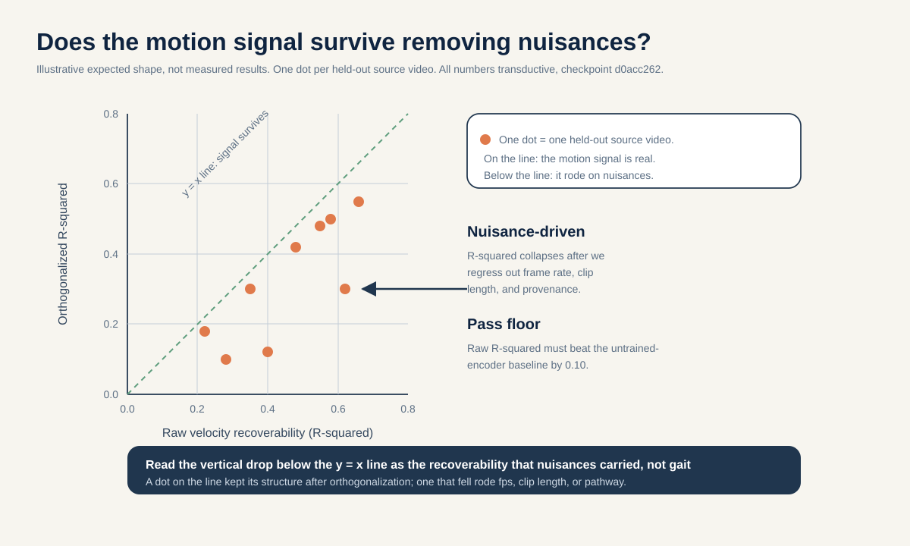
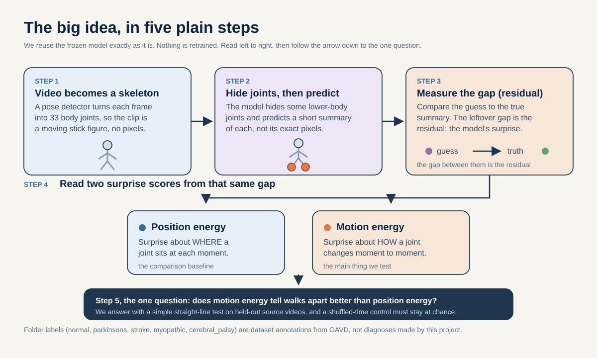

# How to actually do this: does the frozen model already know motion, or only pose?

This is the plain-language, roll-up-your-sleeves guide to Idea 3. The full proposal narrative lives in
[`README.md`](./README.md). Every number here is grounded line for line in
[`../_shared_facts.md`](../_shared_facts.md) (the single source of truth for numbers) and
[`../_neuro_facts.md`](../_neuro_facts.md) (the biology). Nothing here may contradict those files.

A note before we start. The folder labels (normal, parkinsons, stroke, myopathic, cerebral_palsy) are
just tags that came attached to the GAVD videos. They are not diagnoses made by this project, and nothing
below is a medical test of any real person. Every result is a statement about a computer model's features,
not about anybody's health.

## The big idea in plain words

Imagine you trained a friend to guess *where* a walker's foot is by covering part of a photo of a stick
figure and asking "what is behind my hand?" You never once asked your friend to guess *how fast* the foot
was moving. Now you wonder: while learning to guess position, did your friend secretly pick up a sense of
speed too, as a free bonus? If yes, you get motion knowledge without paying to teach it. If no, then anyone
who wants motion has to train for it on purpose, which is expensive.

That is this whole project in a sentence. We have a finished, frozen model. We do not change it at all. We
just poke it two different ways at test time: once to score how surprised it is about *where* joints sit
(position), and once to score how surprised it is about *how joints change from moment to moment* (motion).
Then we ask which of those two scores does a better job telling walking conditions apart.

## 1. The question in one sentence

Using a single new read-out of the frozen model over all 16 time slots, with zero new training: can a
simple linear tool recover velocity (motion) structure from the model's prediction leftovers, and does a
motion-based score separate held-out source videos better than a position-based score, after we prove the
motion score is really about motion and not just about size?

## 2. Why this idea, in plain words

The model was trained on a goal that is basically about position. For a hidden joint at one moment, it
learns to guess a short summary of that joint (a feature vector, explained below). It was never directly
asked "how fast is this joint moving?" But speed of change, called velocity, is exactly what clinicians
watch when they judge a walk. A person with Parkinson's and a person recovering from a stroke differ less
in where a foot sits and more in how it speeds up, hesitates, and returns.

Here is the biology that makes this sharp, from [`../_neuro_facts.md`](../_neuro_facts.md). Parkinson's
disease starts with the death of dopamine-making cells in a small midbrain area. Losing that dopamine
breaks the brain's "autopilot" for well-practiced movement (Redgrave et al. 2010, PMID 20944662; Wu,
Hallett, Chan 2015, PMID 26102020). When walking is no longer on autopilot, it stops being metronome-steady.
The hallmark is timing that wobbles from one stride to the next, about twice as much as in healthy walkers,
and that wobble tracks how severe the disease is (Hausdorff et al. 1998, PMID 9613733). A concrete anchor:
stride-time coefficient of variation (the timing spread divided by the average timing, written as a percent)
was 8.8 percent in Parkinson's fallers versus 4.2 percent in non-fallers (Schaafsma et al. 2003,
PMID 12809998). What this number means: higher percent equals a less regular, more wobbly rhythm.

Now the clean contrast. Myopathy is a primary muscle disease. The muscles are weak, but the brain's rhythm
autopilot is fine. So myopathic walking keeps a steady, regular cadence (in Duchenne muscular dystrophy,
2.25 versus 2.21 steps per second, not a real difference; Vandekerckhove et al. 2022, PMID 35721358) and
shows no real left-right asymmetry (Xiong et al. 2023, PMID 37525241). So Parkinson's and myopathy sit at
opposite ends of one axis: Parkinson's is irregular from a broken autopilot, myopathy is regular with the
timing intact. That opposition is the target we ask the frozen model to see.

Honest boundary, and it is important. This idea CANNOT recover absolute cadence (steps per minute) or
walking speed. Every clip is squeezed or stretched to exactly 64 frames before the model sees it, which
erases the true clock (this is Idea 4's territory). So we can only test the *shape* of the timing wobble
inside one already-stretched clip: more regular versus less regular. We call that within-window relative
rhythm regularity. We do not claim to recover the stride-time CV number itself.

A positive result would show something non-obvious: a goal stated only about position can still build a
representation from which motion is readable with a simple linear tool, at this small scale. That echoes
the V-JEPA finding that feature-prediction models must be judged on motion-sensitive tasks, not just
appearance (Bardes et al., arXiv:2404.08471). A null result is just as useful: it would tell everyone that
motion has to be trained in on purpose, and it sets an honest floor before anyone spends money retraining.

## 3. What data you need

**The internal work (the real study).** The gavd5 GAVD cohort (Ranjan et al., IEEE Access 2025,
DOI 10.1109/ACCESS.2025.3545787). What this is, in plain terms: 96 short walking clips taken from 18
different YouTube source videos. The per-condition source-video counts are tiny and uneven: normal 1,
Parkinson's 2, stroke 3, myopathic 10, cerebral palsy 2. All 12 normal clips come from a single video
(id `3KnFt8bH3tE`), so for normal the label is almost the same thing as the video identity.

What shape does the data take? Not video pixels. Each clip is turned into a moving stick figure of 33 body
joints over time (a skeleton). A pose detector called MediaPipe BlazePose (Grishchenko et al.,
arXiv:2206.11678) finds those joints in each frame. Each clip is resized to 64 frames, then every 4
next-door frames are grouped into one time patch, giving 16 time positions. With 33 joints that is
33 x 16 = 528 joint-time tokens. What "token" means: the smallest chunk the model reads, one joint at one
moment.

How would a real team get and clean this? You do not re-extract anything. The project already ran the pose
detector and cached the results as 528-token tensors on disk. You reuse those. The one extra thing you
recover is the per-source frame rate (frames per second), because you need it to attach a real time step
(dt) to the slot-to-slot differences. The GAVD spreadsheets do not store frame rate, so the project probes
it from the MP4 files (measured around 30 fps, some 23.976 or 29.97).

**The external reach step (optional, no retraining, marked reach-tier).** For a label-level cross-check of
the Parkinson's rhythm-variability direction only, there is PhysioNet Gait-in-PD (gaitpdb: 93 Parkinson's
plus 73 controls; DOI 10.13026/C24H3N). Be honest about its limits: gaitpdb is force and IMU data (sensors
under the feet), NOT skeletons. So it can confirm that the Parkinson's-versus-control variability axis is
real and points the way the biology says, but it CANNOT confirm skeleton-level recovery, it cannot confirm
within-window recovery, and it has no myopathy group at all. No public skeleton cohort exists that pairs
Parkinson's rhythm variability against symmetric myopathy, so skeleton-level clinical transfer stays out of
reach. The other verified non-clinical multi-view cohorts in [`../_shared_facts.md`](../_shared_facts.md)
(CASIA-B, OU-MVLP-Pose, GREW, Gait3D, Human3.6M) are non-clinical and reach-tier; this particular idea does
not need them.

## 4. Step by step, how to do it

This whole recipe is zero-retrain. No encoder weights ever change. You are running the finished model at
test time and reading numbers out of it.

1. **Load the one frozen model and check its fingerprint.** Load the encoder, the target encoder, and the
   predictor from the curriculum-final checkpoint whose fingerprint prefix is `d0acc262`. A second lineage
   prefix `dba24a` exists locally; refuse it, because mixing lineages would be a confound. (Zero-retrain.)

2. **Reuse the cached tensors and recover frame rate.** Load the cached 528-token tensors. Recover the
   per-source frame rate and confirm the time step dt is sensible and actually varies across sources.
   (Zero-retrain.)

3. **Build the one dense read-out estimator.** This is the only genuinely new piece, and we say so plainly:
   it is a new inference-time read-out, not the trained masked scoring. Run the predictor densely over all
   16 time slots for the 12 maskable lower-body joints. That gives a predicted feature at every joint-time
   slot. Get the matching teacher targets from the frozen target encoder over the same slots. From this one
   dense output you compute BOTH energies against the SAME dense target, so they never come from two
   conflicting procedures. (Zero-retrain, but new read-out code.)
   - **Position energy:** the per-slot gap (residual) between predicted and target features. How surprised
     the model is about *where* each joint sits.
   - **Motion energy:** first take the slot-to-slot change of the features, then compare those changes. How
     surprised the model is about *how* each joint moves. Because dt is known, these changes carry a real
     time step.

4. **Build the source-video-disjoint split and the non-neural baseline.** Assign every clip from a given
   video wholly to train or wholly to holdout, never split a video across both. Also build the handcrafted
   coordinate-speed baseline: per-joint speed computed straight from the raw joint coordinates, no network
   at all. (Zero-retrain.)

5. **Fit the linear velocity-recoverability probe.** Fit a plain linear tool with a smoothing penalty (a
   ridge probe) that maps the dense prediction residuals to a held-out velocity target built from the
   target-encoder features. Pick the smoothing penalty using training sources only, never the held-out one.
   Report R-squared (the share of the velocity variation the probe explains, from 0 to 1, higher is better).
   Run the exact same probe on a matched untrained-encoder (random weights, same pipeline) to fix the floor.
   (Zero-retrain of the study model; the probe itself is a tiny linear fit.)

6. **Score energy as a separator, one held-out source at a time.** For each held-out source video, compute
   a position-scored energy and a motion-scored energy per clip, and measure how well each separates the
   condition contrast using ROC-AUC (0.5 is a coin flip, 1.0 is perfect). Compare motion versus position
   versus a fixed blend. (Zero-retrain.)

7. **Run the two guards: shuffled-motion control and orthogonality test.** Scramble the time order of the
   16 slots before computing the motion change; this destroys real velocity but keeps per-slot sizes. The
   scrambled motion energy must sit at chance as a separator. Also regress each energy on three boring side
   variables (frame rate, clip length, provenance path), subtract the predicted part, and re-score the
   leftover as a residual AUC. (Zero-retrain.)

8. **Package everything bound to `d0acc262`.** Save the estimator code, the split manifest, the per-source
   tables, and the seed-level results. (Zero-retrain.)

## 5. The decision rule, decided in advance

We write down what counts as a win before we look at any result, so we cannot move the goalposts. There are
two separate verdicts.

**Verdict A, the recoverability floor (the ridge probe).** The trained-model probe counts as recovering
velocity only if its per-source-holdout R-squared beats the untrained-encoder baseline by at least 0.10 in
the median across held-out sources, with the sign consistent on a majority of sources. What this means in
plain words: the real model must explain meaningfully more velocity than a random-weight version of the
exact same pipeline, and it must do so on more than half the sources, not just on average. If it does not
clear that gap, velocity is not linearly recoverable beyond what raw coordinates already give, and that is
a clean, reportable null.

**Verdict B, the energy separator (the primary contrast).** The primary contrast is Parkinson's (2 source
videos, the irregular end) versus canonical-path myopathic (10 source videos, the regular end). Both use
the same extraction path, so the pathway cannot pretend to be the signal. We hold out one source at a time,
giving 2 Parkinson's folds and 10 myopathic folds, so 12 held-out sources with an estimable AUC each. The
decisive rule: motion-energy AUC beats position-energy AUC on a MAJORITY (at least 7 of 12) of these
held-out sources with the sign consistent, AND the sign holds on BOTH Parkinson's folds. The both-Parkinson's
requirement matters because with only 2 Parkinson's sources, a rule that ignored them could pass on
myopathic folds alone and miss the actual axis. On top of that, the shuffled-motion control must stay at
chance, and motion energy must beat the handcrafted coordinate-speed baseline, or the model adds nothing.

The pooled Parkinson's-plus-stroke versus myopathic-plus-cerebral-palsy contrast is secondary and
exploratory only, because it mixes mechanisms. The normal contrast is also secondary and flagged as
confounded, because all normal clips come from one video and mostly use a different extraction path.

**Worked example (illustrative numbers only, not measured facts).** Suppose we hold out one myopathic
source and look at two clips from it.
- Motion-energy separation on this source: AUC = 0.72. (AUC runs 0 to 1; 0.5 is a coin flip, 1.0 is
  perfect.)
- Position-energy separation on the same source: AUC = 0.61.
- Per-source delta = 0.72 minus 0.61 = 0.11, which is positive, so motion won on this source.
- Now the probe. Trained-encoder velocity R-squared = 0.34. Untrained-encoder baseline R-squared = 0.20.
- Recoverability margin = 0.34 minus 0.20 = 0.14.
- How to read it: the floor asks for at least 0.10 in median across sources. Here 0.14 clears 0.10 on this
  one source, and the positive AUC delta agrees, so this source counts toward the majority rule. One source
  is never the verdict; the verdict is the majority across sources with a consistent sign (and both
  Parkinson's folds agreeing).

## 6. Controls that keep us honest

- **Missingness-only baseline.** The simplest cheat to rule out. A model can look smart by reading which
  joints the detector found or missed rather than how the person moved. Across the five conditions the full
  model scores 0.793 accuracy, the missingness-only control (visibility pattern only, no coordinates)
  scores 0.448, and pure guessing across five classes is 0.20. So some apparent signal really is just holes,
  and a real finding must beat this.
- **Untrained-encoder floor.** Run the exact same read-out on a random-weight model. This fixes how much
  "velocity" you would recover from raw coordinate structure alone, before any learning.
- **Raw-coordinate ceiling (the handcrafted coordinate-speed baseline).** Per-joint speed computed straight
  from raw coordinates, no network. If the model's motion energy cannot beat this, the model adds nothing on
  this axis.
- **Source-video-disjoint splits.** Every clip from one video lands wholly on one side of the split, so the
  model cannot win by recognizing the video instead of the gait. The independent unit is the source video,
  not the clip.
- **Shuffled-motion control.** Scramble the time order before computing the motion change. This kills real
  velocity but keeps per-slot sizes. If the motion energy still separates conditions, it was reading size,
  not motion, and the finding is void.
- **Orthogonality test.** Subtract off any part of each energy that a boring side variable (frame rate, clip
  length, provenance path) can explain, then re-score the leftover as a residual AUC. An energy that only
  works because it tracks frame rate loses its separation here.
- **One-fingerprint binding.** Bind every number to the single checkpoint `d0acc262` and refuse the `dba24a`
  lineage, so we never compare across two different models by accident.

## 7. What could happen, and what each outcome would mean

- **Motion wins cleanly.** Motion energy beats position energy on at least 7 of 12 held-out sources with
  consistent sign and on both Parkinson's folds, the probe clears the 0.10 floor, the shuffle stays at
  chance, and motion beats the handcrafted baseline. Licensed claim: the frozen position-trained model
  already carries a within-window relative rhythm-regularity axis that separates the loss-of-automaticity
  end (Parkinson's) from the symmetric-myopathy end, readable with a simple linear tool at zero retraining.
  It does NOT mean we recovered the stride-time CV number or absolute cadence.
- **Clean null.** Motion does not beat position, and does not beat the handcrafted baseline, and the probe
  does not clear the floor. Licensed claim: the frozen model does not carry linearly reachable velocity
  structure on this axis, so motion must be built into the training target, not squeezed out afterward.
  This is a real, publishable result under the ICLR/ICML framing that values informative nulls.
- **Motion wins but the shuffle also fires.** Then the motion score was reading size or scale, not real
  motion. The motion finding is void, and you report why.
- **Motion wins but the orthogonality test kills it.** Then the energy was really tracking frame rate, clip
  length, or extraction path. You report the residual AUC and withdraw the motion claim.

Either of the first two is decisive and reportable. The point of the design is that every outcome maps to a
pre-registered claim.

## 8. What this cannot tell us

- **Everything is transductive.** The frozen encoder saw every evaluation clip during training. So no number
  here is an out-of-sample estimate; they are diagnostics on a frozen model. A truly held-out estimate would
  need retraining the whole curriculum inside each split, which this study does not do.
- **Tiny, unequal sample.** With as few as 2 Parkinson's sources, the per-source-holdout table and
  source-as-a-point plotting are the only honest read-outs. Big confident single numbers would be
  misleading.
- **Provenance confound.** Most normal rows use the augmented extraction path while abnormal rows use the
  canonical path, and normal is a single video. That is why the normal contrast is secondary and flagged,
  and why the primary contrast is acquisition-path matched.
- **Monocular capture.** gavd5 is single-view video, so nothing here speaks to multi-view robustness.
- **Absolute cadence and speed are erased.** The fixed-64-frame resize warps every clip to the same length,
  so steps per minute and walking speed are gone by construction. The claim is strictly within-window
  relative regularity, an ordering (more regular versus less regular), never a calibrated rate or the
  stride-time CV.
- **Skeleton limits.** Skeletons cannot recover kinetics, EMG, spasticity, transverse-plane rotation, or an
  etiologic muscle diagnosis. No clinical-accuracy claim is made at any outcome.

## 9. How to make it reproducible

- **Fix all seeds.** Any random step (bootstrap CIs, the shuffle control, the ridge fits) uses a fixed seed
  so a rerun lands in the same place.
- **One checkpoint only.** Bind every number to fingerprint `d0acc262`, verify it on load, and refuse the
  `dba24a` lineage. State the fingerprint next to every result.
- **Save the split manifest.** Write out exactly which source videos went to train and which to holdout, so
  anyone can confirm no video's clips leaked across the split. Every read-out file records source, checkpoint
  hash, fold, and encoder-exposure label (all transductive here).
- **Save the results and code.** Package the dense-readout estimator code, the per-source AUC tables, the
  R-squared-versus-floor numbers, the shuffled-motion and orthogonality lanes, and the seed-level outputs.
- **Import, do not re-run, the resize-erasure boundary.** The fact that the 64-frame resize erases absolute
  cadence comes from Idea 4 and is stated here as a boundary, not re-derived.

## Figures

*Figure 1: a 3 (target: position, motion, mix) by 4 grid of source-level AUC. The leftmost group is the
primary Parkinson's-versus-canonical-myopathic contrast; the other three are secondary exploratory lanes.*
How to read this picture: each dot is one held-out source video. Look at whether the motion row sits higher
than the position row in the leftmost (primary) group, and check that the shuffled-motion control lane does
not climb up with them.

*Figure 2: scatter of raw residual-velocity recoverability R-squared versus the leftover after regressing out
frame rate, clip length, and provenance, per held-out source.* How to read this picture: each dot is a
source. A dot that falls well below the diagonal (the y = x line) lost most of its apparent recoverability to
those boring side variables, which is a warning sign.

*Figure 3: how one dense pass over the 16 time slots yields both the position energy (per-slot gap) and the
motion energy (gap in the slot-to-slot change), plus the shuffled-motion control.* How to read this picture:
follow the single dense output splitting into the two scores; the shuffle branch scrambles time order and
must land at chance, showing the motion score is really about motion and not about size.

## Glossary

- **Token:** the smallest chunk the model reads, one joint at one time position. There are 33 x 16 = 528 of
  them per clip.
- **Feature vector (embedding):** a short list of numbers that summarizes a joint, like a fingerprint of
  numbers, instead of raw pixels.
- **JEPA / S-JEPA:** Joint Embedding Predictive Architecture. Hide part of the input and predict the hidden
  part as a feature vector, not as pixels. The S is for skeleton (Abdelfattah and Alahi, ECCV 2024).
- **Encoder / target encoder (EMA teacher):** the encoder reads the visible tokens; the target encoder is a
  slow-moving copy (an exponential moving average, a running blend of past weights) that provides stable
  targets and is never trained by gradients.
- **Predictor:** a small network that, given the visible tokens, guesses the teacher's features at the
  hidden positions.
- **Residual:** the gap between a prediction and its target. Position energy is the per-slot residual;
  motion energy is the residual of the slot-to-slot change.
- **Velocity:** how fast a joint changes from one time slot to the next. The motion score is about velocity.
- **Ridge probe:** a plain linear tool with a smoothing penalty, used to test how much of something a linear
  read-out can recover.
- **R-squared:** the share of a target's variation a probe explains, from 0 to 1; higher means more
  structure recovered.
- **AUC (ROC-AUC):** a separation score from 0 to 1; 0.5 is a coin flip, 1.0 is perfect.
- **Transductive:** the model was trained on the very clips you later test it on, so a high score can just
  mean memorizing.
- **Source-video-disjoint:** every clip from one video lands wholly on one side of the train/test split.
- **Missingness-only:** a baseline that uses only which joints were found or missing, throwing away all
  coordinates.

## References

- Abdelfattah and Alahi, S-JEPA, ECCV 2024, DOI 10.1007/978-3-031-73411-3_21.
- Assran et al., I-JEPA, CVPR 2023, arXiv:2301.08243.
- Bardes et al., V-JEPA, 2024, arXiv:2404.08471.
- Bardes, Ponce, LeCun, VICReg, ICLR 2022, arXiv:2105.04906.
- Assran et al., V-JEPA 2, 2025, arXiv:2506.09985.
- Grishchenko et al., BlazePose GHUM, 2022, arXiv:2206.11678.
- Ranjan et al., GAVD, IEEE Access 2025, DOI 10.1109/ACCESS.2025.3545787.
- Kapoor and Narayanan, arXiv:2207.07048 (leakage taxonomy; source video as the independent unit).
- Varoquaux, NeuroImage 2018 (small-sample error bars).
- Redgrave et al. 2010, PMID 20944662; Wu, Hallett, Chan 2015, PMID 26102020 (loss of automaticity in PD).
- Hausdorff et al. 1998, PMID 9613733; Schaafsma et al. 2003, PMID 12809998 (stride-time variability;
  8.8 vs 4.2 percent).
- Vandekerckhove et al. 2022, PMID 35721358 (preserved cadence in myopathy).
- Xiong et al. 2023, PMID 37525241 (no significant left-right asymmetry in Duchenne muscular dystrophy).
- Stenum et al. 2021, PMID 33891585 (skeleton timing validity, temporal MAE 0.02 s/step).
- Goldberger et al., PhysioNet Gait in Parkinson's Disease Database (gaitpdb), DOI 10.13026/C24H3N.
