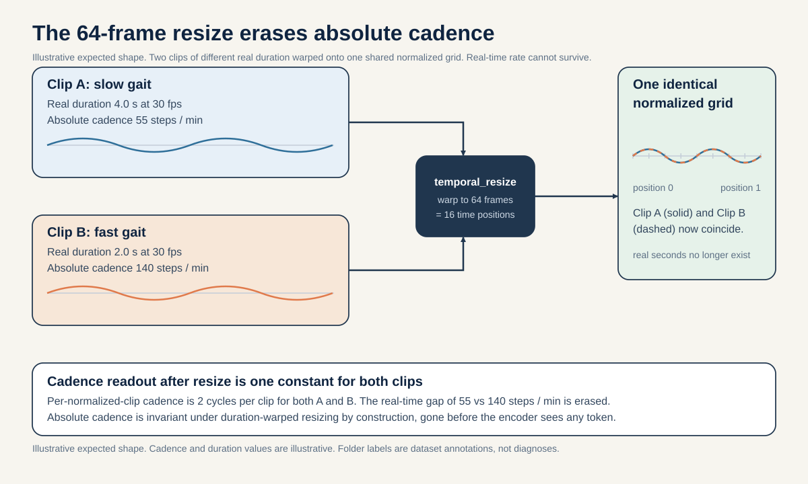
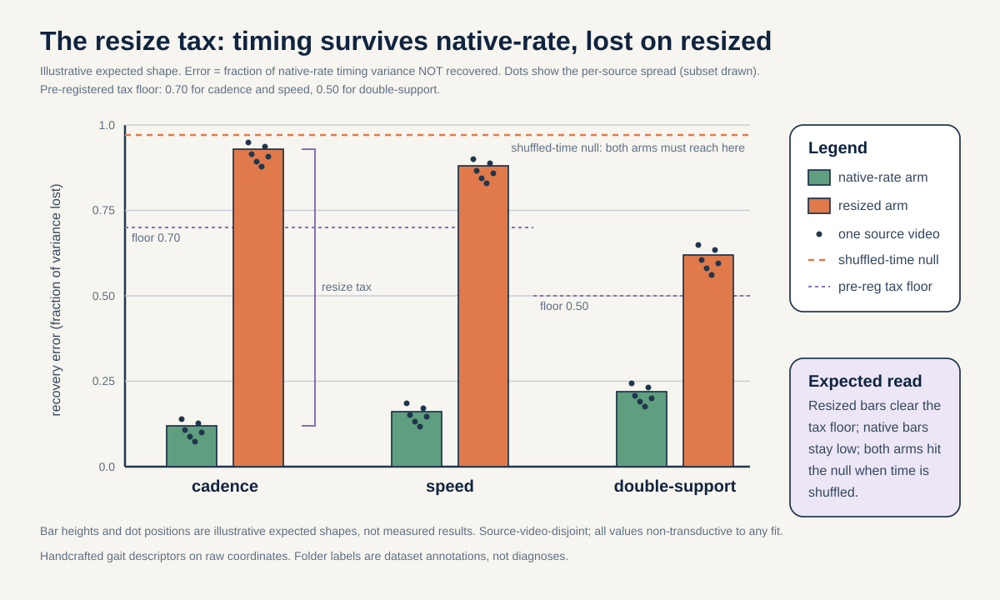
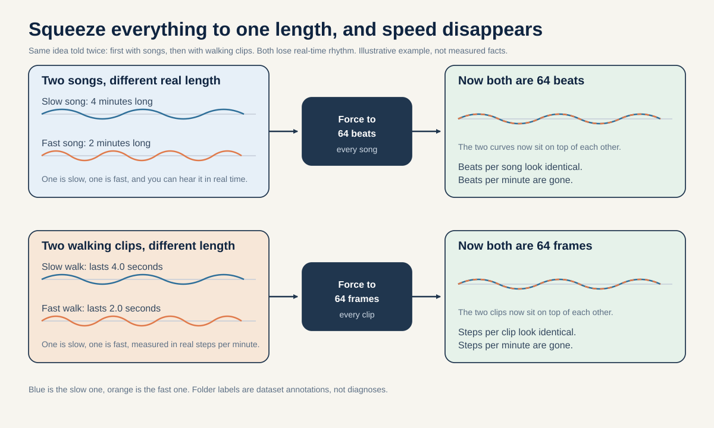
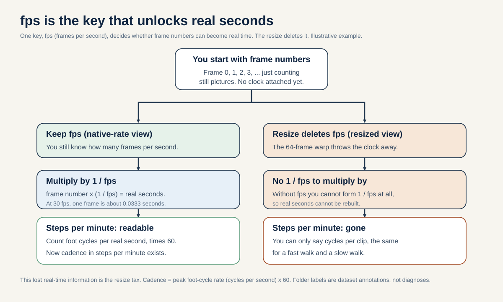

# The 64-frame resize tax: quantifying how much cadence and speed the mandatory temporal_resize erases

**Portfolio role:** evaluation-validity / preprocessing, rank 4
**Three-week endpoint:** 5 September 2026
**Estimated effort:** 6 to 9 researcher-days, almost entirely CPU. No encoder training.

> By how much does the mandatory fixed-64-frame temporal_resize destroy recoverable absolute cadence and walking-speed information? We measure this as the fraction of clinically relevant timing variance lost. We use two tools only: handcrafted kinematics computed on raw coordinates, and an algebraic proof that the information cannot survive.

*If you want to actually run this, see [METHODOLOGY.md](./METHODOLOGY.md).*

## The question in plain words

### The big idea in plain words

Before any walking clip reaches this project's model, the clip gets stretched or squeezed in time so that every clip is exactly 64 frames long. Picture two songs: one slow song that lasts 4 minutes and one fast song that lasts 2 minutes. Now imagine a machine that forces both songs to play in exactly 64 beats, no matter how long they really were. After that, you can count 64 beats in each song, but you can no longer tell which song was fast and which was slow in real time. The beats-per-song look the same, even though the beats-per-minute were very different.

That is exactly what the 64-frame step does to walking clips. The number of real steps per minute (how fast someone actually walks) gets flattened away. This proposal asks one simple thing: how much of that real-time walking-rhythm information is destroyed by the 64-frame step? We answer it with a short piece of math (a proof that the information cannot survive) plus a hands-on measurement on the raw skeleton data (showing how much really is lost).

### Words you will need

- **Skeleton.** A stick figure traced over a person. A pose detector finds 33 body joints in each video frame, so a clip of a walking person becomes a moving stick figure. That is smaller than video and it hides the person's face and clothing.
- **Frame.** One still picture in a video. A video is just many frames shown quickly, one after another.
- **fps (frames per second).** How many frames the camera recorded each second, around 30 here. If you know fps, you can turn a frame number into real seconds. If you throw fps away, you cannot.
- **temporal_resize.** The mandatory step that stretches or squeezes any clip to exactly 64 frames. "Temporal" just means "in time". It is not optional: the model was built with 64 input frames wired in, so every clip must be forced to that length.
- **Cadence.** How many steps a person takes per minute of real time (steps per minute). It is a wall-clock quantity: it only means something once you know how much real time passed.
- **Walking speed.** How far a person moves per second of real time. Also a wall-clock quantity.
- **Double support.** The short moments in walking when both feet touch the ground at once. Its real-time duration (in seconds) is partly a wall-clock quantity too.
- **Invariant.** A quantity that does not change when you apply some operation. If resizing cannot change a number, that number is invariant under the resize. (Below we show cadence is the opposite: it does change, so it cannot be read back from the resized clip.)
- **R-squared (written R^2).** A score from 0 to 1 that says how much of the real spread in a quantity you can explain from another quantity. 1 means "explains everything", 0 means "explains nothing".
- **Source-video-disjoint.** A fair-testing rule: never tune anything on a video and then also test on clips from that same video. Two clips from one video are not independent evidence, the same way two frames of one movie are not two different movies.

### The question, spelled out

Absolute cadence is how many steps a person takes per minute of real time. Walking speed is how fast they move per second of real time. Both are wall-clock quantities: they only mean something if you know how much real time passed. The moment you resize every clip to the same 64 frames, you throw away how long the clip actually lasted. Two people walking at very different real speeds can end up looking identical on the 64-frame grid.

This matters clinically because cadence is one of the sharpest separators between the folder labels in this cohort. A person in the stroke folder may walk near 50 to 65 steps per minute (the grounded stroke cadence band). A person in the Parkinson's folder can compensate for short strides by raising their step rate well above that reduced stroke cadence (compensatory or festinating gait raises the step rate; Morris et al. 1994/1996, PMID 7953597, PMID 8800948). So the two folders can sit at very different real-time step rates. If the resize collapses that difference, then any downstream claim that the model "tells conditions apart by their walking rhythm" is at risk of being an artifact of what survived preprocessing, not of what the model learned.

This proposal does not study the neural network. It studies the preprocessing step itself. The deliverable is two things: (1) a short algebraic proof that absolute cadence is invariant, meaning mathematically unchanged, under duration-warped resizing, so it cannot survive by construction; and (2) an empirical measurement, on the raw skeleton coordinates before resizing, of exactly how much cadence, speed, and double-support timing variance is lost when you switch from real-time coordinates to resized coordinates. We call the lost fraction the resize tax.

## Why this matters

A positive result (a large measured tax, matching the proof) confirms a specific belief: that any timing-based separation this model appears to achieve cannot be coming from absolute cadence or walking speed, because that information was algebraically removed before the model ever saw a token. In plain words, it tells every future reader of this repository, and every builder of small geometry-warped skeleton pipelines, that "the model distinguishes fast from slow gait" is not a defensible claim under fixed-length resizing. It turns a hidden preprocessing choice into an explicit, quantified warning label.

A null result would be surprising and equally informative. If the handcrafted cadence and speed features were still recoverable at similar accuracy from resized coordinates as from native-rate (real-time) coordinates, that would mean the resize is not actually warping durations in this cohort. The most likely reason would be that the clips already have near-identical real durations, so resizing barely changes anything. Ruling that in or out is itself a useful fact about the dataset, and it is a hard, falsifiable prediction: the algebraic proof says absolute cadence must be lost, so a null forces us to go back and check whether the fps estimates were broken.

## Conference-level augmentation

This section lifts the resize-tax measurement into a named preprocessing-invariance result and grounds it in the two gait biomarkers that are literally counted in steps per minute. The upgrade is: name the 64-frame resize a cadence-erasing group action, prove that absolute temporal biomarkers cannot be identified by construction, and then show, with the clinical literature, exactly which two clinically decisive quantities get erased and why they are real.

**The neuroscience chain: source, mechanism, skeleton-measurable feature.** Two conditions in this cohort separate along an ABSOLUTE-TIME axis, and both of their signatures live in wall-clock quantities (cadence in steps per minute, stride time in seconds). Both are erased by the resize.

1. Stroke (slowing plus reduced cadence). The corticospinal tract, the main wiring from the movement part of the brain down to the muscles, crosses to the other side of the body low in the brainstem (this crossing is called the pyramidal decussation). Because it crosses, a lesion in one half of the brain produces weakness on the opposite side of the body, the one-sided weakness (hemiparesis) that defines stroke gait (Natali and Javed StatPearls corticospinal anatomy, PMID 30571044). What a camera can see from this is a slower walk with a reduced number of steps per minute. Patterson et al. 2008 (PMID 18226655) report that a majority of community stroke survivors carry a temporal (timing) gait asymmetry, and, importantly for this proposal, that this timing asymmetry tracks walking speed and motor recovery. Speed, cadence, and stride time are absolute-time quantities: they only mean something once you know how much real time elapsed.

2. Parkinson's disease (reduced stride length with compensatory cadence). Loss of dopamine-making cells in a brain region called the substantia nigra leads to a loss of automaticity in the basal ganglia. Automaticity is the "run it in the background" control of well-learned movement, like walking without thinking about it (Redgrave et al. 2010, PMID 20944662; Wu, Hallett, Chan 2015, PMID 26102020). Morris et al. 1994 (PMID 7953597) and 1996 (PMID 8800948) show the core problem is a shortened stride length, that a higher step rate shows up as a compensation for the short strides, and that external cues (like a beat to walk to) restore stride length. So the Parkinson's signature is a specific pairing: short strides plus a raised step rate. Both halves of that pairing are absolute-time quantities.

3. The skeleton-measurable feature and where the resize kills it. Cadence (steps per minute) and stride time (seconds) can be measured from pose timing when elapsed time is kept: Stenum et al. 2021 (PMID 33891585) report a timing error of only about 0.02 seconds per step for markerless pose against lab motion capture, which is what makes these timing biomarkers measurable from a skeleton in principle. The words in principle are load-bearing. The S-JEPA pipeline resizes every sequence to a fixed 64-frame token grid, 16 time positions after 4-frame patching, per source video (shared facts lines 22, 131). That resize is a per-clip duration-warping operation: it maps any true cadence onto the same 64-frame support, dividing out absolute time and keeping only within-clip timing ratios. A concrete way to see it: the grounded stroke band near 50 to 65 steps per minute and a Parkinson's compensatory step rate raised well above it (Morris et al. 1994/1996, PMID 7953597, PMID 8800948) both land on 64 frames after the warp, so whatever real-time gap separated them is gone. As a result cadence and stride time cannot be identified from the resized grid by construction, and the two literally-steps-per-minute biomarkers above are unrecoverable no matter how good the encoder is. This fits the observed fact that stride_time_cv is not decodable from roughly 2-second windows, and that the mean-and-standard-deviation pooling already throws away temporal order (shared facts lines 62 to 68).

Reading the chain (why "group action" is the right phrase):
- A group action here just means a whole family of transformations (all the duration stretches by any positive factor k) that you can apply to a clip, that combine and undo like ordinary arithmetic, and that the resize simply does not notice. Stretch a clip's duration by k, then by 1/k, and you are back where you started.
- The resize is INVARIANT under this family: `resize(clip) = resize(stretch(clip, k))` for every k. So whatever survives the resize cannot depend on k.
- Absolute cadence is EQUIVARIANT under the family, not invariant. Equivariant means it changes in step with the transformation: `native_cadence(stretch(clip, k)) = native_cadence(clip) / k`. It changes by exactly the factor k.
- Something that changes with k cannot be read back from something that ignores k. That one sentence is the proof that the quantity cannot be identified: cadence, stride time, and walking speed cannot be recovered from the resized grid.

**The generalizable claim (what transfers beyond gavd5).** The transferable result is a method-level theorem, not a gavd5 number: duration-warping a skeleton sequence onto a fixed-frame token grid is a cadence-erasing group action, so any absolute temporal biomarker (cadence, stride time, walking speed) cannot be identified by construction in ANY fixed-frame skeleton pipeline. This includes V-JEPA-style tube-length normalization, where clips are normalized to a fixed number of frames per tube before tokenization (Bardes et al., V-JEPA, arXiv:2404.08471). The claim does not depend on the encoder, the dataset, or the checkpoint; it depends only on the fact that a fixed-frame preprocessing step discards elapsed time. Any pipeline that wants to keep absolute timing must carry an explicit duration or fps channel alongside the warped tokens, or it gives up every wall-clock biomarker before training even begins.

**Biomarker-specific external-cohort note (honest scope).** PhysioNet Gait-in-PD (gaitpdb: 93 Parkinson's plus 73 controls, Hausdorff, DOI 10.13026/C24H3N) provides a LABEL-LEVEL cross-modal confirmation only. Its force and body-sensor stride-time series carry the very absolute-time biomarkers (stride-time CV, cadence) that the fixed-64-frame resize provably discards, so it shows in a separate cohort that the erased quantity is clinically real. Concrete anchors for that reality: stride-time CV separates people who fall from those who do not at 8.8 percent versus 4.2 percent (Schaafsma et al. 2003, PMID 12809998), and Parkinson's gait-timing variability runs about twice that of controls (Hausdorff et al. 1998, PMID 9613733). Honest limitation: gaitpdb is a different kind of recording (force and body sensors, not skeleton), and no participant-disjoint SKELETON cohort recovers absolute cadence for stroke or Parkinson's. So this is a label-level cross-modal check that the biomarker exists and matters, NOT a skeleton-level clinical-transfer claim. All in-repo results remain transductive (n=18 sources; shared facts lines 9 to 14, 70 to 80), and the folder labels stay dataset annotations, not diagnoses.

**Honest feasibility delta versus the original.** The original plan is 6 to 9 researcher-days, almost entirely CPU, no encoder training. The augmentation does not change that budget for the core work.
- Core (in scope, about 1 to 2 weeks, NO retrain): the resize is a preprocessing measurement on the frozen `d0acc262` checkpoint. We measure information loss by comparing how well absolute-time biomarkers can be decoded before versus after the 64-frame warp on the same source videos. The added neuroscience framing and the named-theorem write-up are analysis and explanation, not new compute.
- Week-1 kill-gate (unchanged and now load-bearing): the fps-regeneration audit for the hard-coded 29.97 fallback contamination risk (shared facts line 87). Some sources are 23.976 fps and some are 29.97 fps, so a wrongly-assigned fps would corrupt any absolute-time recovery before the resize argument even applies. If the fallback pinned every clip to 29.97, we abort and re-extract.
- Reach (plus weeks, new data, label-level only): the PhysioNet gaitpdb cross-modal confirmation of the stride-time and cadence biomarker. This is extra data handling in a new recording modality, so it is scoped as a reach tier and framed as label-level only, never as skeleton clinical transfer.

## Background and related work

This is a preprocessing-validity study, so the JEPA machinery is context rather than the object. The reader still needs the vocabulary, so here it is from first principles.

**What a token is.** The model does not read raw video. It reads a skeleton: 33 body landmarks per frame, produced by a pose detector called BlazePose (Grishchenko et al., 2022, arXiv:2206.11678), each landmark with an x, a y, and a relative z coordinate (its position). Each sequence is resized to 64 frames, and 4 neighboring frames are grouped into one time patch, giving 16 time positions. One landmark at one time position is a token, so there are 33 landmarks times 16 time positions = 528 possible joint-time tokens. Think of a token as the smallest chunk the model reads, like one word in a sentence. Each token is a 4-frame-by-3-coordinate = 12-number vector pushed through a linear layer into an embedding (a short list of numbers that acts like a fingerprint of that chunk).

Reading the math (the token counts):
- `33 x 16 = 528` says: the number of joint-time tokens equals landmarks multiplied by time positions.
- `33` is the number of body landmarks per frame.
- `16` is the number of time positions after grouping (see next line).
- `x` here means ordinary multiplication.
- `4 adjacent frames -> 1 time patch`, and `64 / 4 = 16`, says: the 64 resized frames split into groups of 4 give 16 patches. `64` is the fixed frame count, `4` is the patch size, and `16` is the result.
- `4 x 3 = 12` says: one token holds 4 frames times 3 coordinates, which is 12 numbers. `3` is the count of coordinates per landmark (x, y, relative z).

**Encoder, EMA teacher, predictor, masking.** In a Joint Embedding Predictive Architecture (JEPA), an online encoder sees only the visible tokens, a target encoder sees all 528 tokens, and a predictor tries to guess the target encoder's features at hidden positions. Masking-and-predicting is like covering part of a photo with your hand and guessing what is behind it, except here the guess is made in feature space (a short summary), not pixel by pixel. The target encoder is an EMA teacher: its weights are an exponential moving average (a slowly-updated running copy, like a slow-moving average that ignores day-to-day noise) of the online encoder, and it is not updated by the usual training step (this is called stop-gradient). This design comes from I-JEPA (Assran et al., CVPR 2023, arXiv:2301.08243) and V-JEPA (Bardes et al., 2024, arXiv:2404.08471), and the skeleton-specific variant is S-JEPA (Abdelfattah and Alahi, ECCV 2024, DOI 10.1007/978-3-031-73411-3_21). Collapse (all features shrinking to one point and becoming useless) is held off partly by VICReg (Bardes, Ponce, LeCun, ICLR 2022, arXiv:2105.04906), whose variance term keeps features spread out. V-JEPA is directly relevant here because it argues video representations must be tested on motion-sensitive tasks, not just appearance; the temporal resize is exactly the operation that can silence a motion-sensitive signal upstream of the encoder.

**Why we do not touch the encoder.** The frozen encoder is hard-wired to 64 frames. If we tried to feed it native-rate clips of varying length, the input distribution would shift and we could not tell the resize effect apart from an out-of-distribution encoder effect (the encoder acting oddly just because it got input shaped unlike its training data). So the honest move, and the one this proposal takes, is to measure information loss on the coordinates directly, with handcrafted kinematics, never asking the encoder to judge native-rate input.

**Leakage and evaluation validity.** Kapoor and Narayanan ("Leakage and the Reproducibility Crisis in ML-based Science", 2022, arXiv:2207.07048) catalog how a preprocessing or splitting choice can silently create or destroy signal. A fixed-length resize that erases wall-clock timing is a preprocessing choice that destroys a clinically decisive signal, which is exactly the kind of quiet distortion their taxonomy warns about. Because the cohort is tiny, Varoquaux ("Cross-validation failure", NeuroImage 2018) reminds us that error bars are large at these sample sizes, so we report per-source effects rather than a single pooled number.

**The unit of independence.** The GAVD dataset (Ranjan et al., IEEE Access 2025, DOI 10.1109/ACCESS.2025.3545787) supplies clips, but the independent unit is the SOURCE VIDEO, not the clip. A source-video-disjoint split means no clip from a video used to fit anything may also appear in the evaluation of that fit. This matters even for a handcrafted feature: if we tune a threshold on one video's clips and test on other clips from the same video, we have leaked.

## Method

Everything here operates on coordinates. No optimizer runs.

**Artifacts and fingerprints.** The frozen curriculum-final checkpoint has fingerprint prefix `d0acc262`. This proposal does not run that checkpoint, but it names it because Week 3 optionally overlays the pooled masked-prediction behavior as context, and any such overlay must be tied to `d0acc262` and never mixed with the locally observed `dba24a` lineage. All coordinate work uses the canonical cohort: 96 sequences from 18 unique source videos. The per-condition sequence counts are normal 12, Parkinson's 9, stroke 12, myopathic 47, cerebral palsy 16. The per-condition source-video counts are much smaller: normal 1, Parkinson's 2, stroke 3, myopathic 10, cerebral palsy 2. Because the independent unit is the source video, those source-video counts, not the larger sequence counts, set how many independent points we can put on a plot.

**Step 1: Regenerate a coordinate cache WITH real frames-per-second.** The GAVD CSVs do NOT store fps. Notebook 02 probes it from the MP4 via `cv2.CAP_PROP_FPS` with a hard-coded 29.97 fallback (a default value used when the real fps cannot be read). So the very first task is to re-extract the per-clip skeleton NPZ cache from the source videos and record, for each clip, the measured fps and the real duration in seconds. Source resolution is 1280x720; measured fps clusters around 30 with real variation (some 23.976, some 29.97). Absolute `frame_num` is 1-based. We keep failed-pose rows on the timeline with zero visibility to preserve gait timing, exactly as extraction does, because dropping them would itself distort cadence.

**Step 2: Build the native-rate arm and the resized arm from the SAME clips.** For each clip we hold two coordinate views. The native-rate view keeps the real time axis: frame index times (1 / fps) gives seconds. The resized view is the project's mandatory 64-frame temporal_resize, which maps the clip's frames onto a fixed 0-to-1 normalized grid. The two views come from identical raw poses, so any difference in recoverable timing is due to the resize alone.

Reading the math (turning a frame index into real seconds):
- `t_seconds = frame_index * (1 / fps)` says: the real time of a frame equals its position number times the length of one frame.
- `frame_index` is which frame we are on, counting from 0.
- `fps` is frames per second, the number of frames the camera recorded each second (around 30 here).
- `1 / fps` is the length of a single frame in seconds. At 30 fps that is about 0.0333 seconds per frame.
- `*` is multiplication.
- Units: the result is in seconds. If you delete `fps` (as the resize does), you can no longer form `1 / fps`, so real seconds cannot be reconstructed. That deletion is the whole point of the study.

**Step 3: Compute handcrafted kinematic targets on the native-rate view.** Using only raw coordinates and validity masks, we compute, per clip:
1. absolute cadence in steps per minute, from the dominant frequency of the ankle vertical-separation signal converted to real time via fps;
2. walking speed proxy in body-heights per second, from horizontal hip displacement per real second;
3. double-support fraction and its real-time duration, from the intervals when both feet are near the ground.

Reading the math (from a repeating signal to steps per minute):
- `cadence = peak_frequency_hz * 60` says: cadence in steps per minute equals the step rhythm in cycles per second times 60.
- `peak_frequency_hz` is the dominant frequency, in cycles per second (hertz), of the up-and-down ankle-separation wiggle. In plain words: how many times per second the feet cycle.
- `60` converts per-second to per-minute (60 seconds in a minute).
- Units: cadence comes out in steps per minute. The grounded stroke band 50 to 65, and a Parkinson's compensatory step rate raised above it, are in these same units.
- To get `peak_frequency_hz` you must know real time, and real time needs `fps`; without it you only get cycles-per-normalized-clip, which is a different, wall-clock-free quantity.

These are the clinically relevant timing quantities. They are computed once, deterministically, and frozen before any comparison. They are gait scalars, not diagnoses.

**Step 4: Attempt to recover the same targets from the resized view.** From the 64-frame resized coordinates alone (no fps available, by construction), attempt to recover each target. Cadence and speed on the resized grid can only be expressed in per-normalized-clip units, not per-real-second. The gap between what the native-rate view yields and what the resized view yields is the resize tax.

**Step 5: Quantify the fraction of timing variance lost.** For each target, the resize tax is 1 minus the fraction of the native-rate quantity's spread (variance) that the resized-recovered quantity can explain, measured across source-disjoint clips.

    tax = 1 - R^2

Reading the math (the resize tax):
- `tax = 1 - R^2` says: the tax is the share of the true timing spread that the resized view CANNOT reproduce.
- `R^2` (the coefficient of determination) is the fraction of the native-rate target's variance that is explained when we try to predict it from the resized-recovered value. It runs from 0 (explains nothing) to 1 (explains everything).
- `variance` is a spread measure: how much the true cadence (or speed, or double-support) differs from clip to clip.
- `1 -` flips "how much survived" into "how much was lost".
- Range: because `R^2` is between 0 and 1, `tax` is also between 0 and 1. A tax near 1 means the information is gone; a tax near 0 means it survived.
- If the resized view perfectly recovered the target, `R^2` would be 1 and `tax` would be 0. The proof predicts the opposite: `R^2` near 0, so `tax` near 1.

**Worked example (illustrative numbers only, not measured facts).** Suppose we have 5 source videos with these true native-rate cadences: 55, 60, 95, 130, 150 steps per minute. Now suppose the resized view, which lost fps, can only report a near-constant per-normalized-clip readout that maps back to predictions of 92, 94, 96, 95, 93 steps per minute (the true across-clip differences got flattened).

- Mean of the true values: `(55 + 60 + 95 + 130 + 150) / 5 = 490 / 5 = 98`.
- Total spread (sum of squared gaps from the mean): `(55-98)^2 + (60-98)^2 + (95-98)^2 + (130-98)^2 + (150-98)^2 = 1849 + 1444 + 9 + 1024 + 2704 = 7030`.
- Leftover error (sum of squared gaps between true and resized prediction): `(55-92)^2 + (60-94)^2 + (95-96)^2 + (130-95)^2 + (150-93)^2 = 1369 + 1156 + 1 + 1225 + 3249 = 7000`.
- `R^2 = 1 - (leftover error / total spread) = 1 - (7000 / 7030) = 1 - 0.9957 = 0.0043` (about 0.00).
- `tax = 1 - R^2 = 1 - 0.0043 = 0.9957` (about 1.00).

How to read it: a tax of about 1.00 clears the pre-registered cadence margin of at least 0.70 easily, matching the proof that absolute cadence cannot survive the resize. These five numbers are made up to show the arithmetic; the real values come from Week 2. (Illustrative numbers only, not measured facts.)

**Illustrative code (shows the core resize-tax check; not tied to real files):**

```python
import numpy as np

# Two clips, SAME walking pose, different real durations.
# One ankle-separation signal sampled at real fps for each clip.
fps_slow, fps_fast = 30.0, 30.0        # same camera fps
dur_slow, dur_fast = 4.0, 2.0          # real seconds: slow clip lasts twice as long

# Native-rate time axes (real seconds): frame_index * (1 / fps)
t_slow = np.arange(int(dur_slow * fps_slow)) / fps_slow
t_fast = np.arange(int(dur_fast * fps_fast)) / fps_fast

# Same number of real steps, so the FAST clip packs them into less time.
steps = 6
sig_slow = np.sin(2 * np.pi * (steps / dur_slow) * t_slow)  # slower rhythm in hertz
sig_fast = np.sin(2 * np.pi * (steps / dur_fast) * t_fast)  # faster rhythm in hertz

# The mandatory resize: force BOTH signals onto a fixed 0 to 1 grid of 64 frames.
def temporal_resize(sig, n=64):
    grid = np.linspace(0.0, 1.0, n)
    return np.interp(grid, np.linspace(0.0, 1.0, len(sig)), sig)

resized_slow = temporal_resize(sig_slow)
resized_fast = temporal_resize(sig_fast)

# After resize the two clips look the same (cadence-per-minute info is gone).
print("max difference after resize:", np.max(np.abs(resized_slow - resized_fast)))  # near 0
```

**Reuse.** The 528-token tensors and the encoder are reused only as optional context in Week 3. The handcrafted feature code overlaps proposal 01's coordinate loaders and the notebook-02 extraction path; we reuse those loaders and the extraction harness rather than rewriting them.

## The decisive experiment

**Split stated before any fitting.** The comparison is source-video-disjoint. We list every source video and, for the paired native-vs-resized contrast, we never fit any threshold or scale on a clip whose source video also supplies an evaluated clip. Because several conditions have very few source videos (normal 1, Parkinson's 2, cerebral palsy 2, stroke 3), we do not report per-class held-out R-squared on single-source classes; we pool across conditions and show every source as a dot.

**Primary endpoint.** The mean resize tax across the three handcrafted timing targets (cadence, speed, double-support), macro-averaged over source videos, where tax = fraction of native-rate timing variance not recoverable from resized coordinates. Macro-averaged over source videos means: compute the tax per source video, then average those per-video numbers so each video counts equally, no matter how many clips it contributed. This keeps a video with many clips from dominating the result.

**Pre-registered margin.** The algebraic proof predicts that absolute cadence and absolute speed are strictly invariant under duration-warped resizing, so their tax should be effectively total. We pre-register: cadence tax and speed tax each at least 0.70 (at least 70 percent of native-rate variance lost), and double-support real-time-duration tax at least 0.50. The 0.70 floor is set below the near-total loss the proof predicts precisely so it does not depend on a large real-duration spread: as long as Step 1 confirms real clip durations genuinely vary across sources (the Day-5 gate), the warp divides out that variation and the bulk of native-rate cadence and speed spread cannot survive, so a floor of 0.70 is a conservative pass bar rather than a knife-edge one. If measured tax falls below these values, we must explain it by broken fps (Step 1 gate), not claim survival.

Reading the math (the margins):
- `cadence tax >= 0.70` and `speed tax >= 0.70` say: at least 70 percent of the real-time cadence and speed spread must be gone.
- `double-support tax >= 0.50` says: at least 50 percent of the double-support real-time-duration spread must be gone.
- `0.70` and `0.50` are fractions between 0 and 1; `0.70` means 70 percent, `0.50` means 50 percent.
- `>=` means "at least this large".
- The cadence and speed thresholds are higher (0.70) because the proof says these are strictly invariant, so almost nothing should survive. The double-support threshold is lower (0.50) because its real-time DURATION is only partly wall-clock dependent, so we demand less.

**Nuisance / non-neural baseline.** The whole study is already non-neural. The nuisance baseline that anchors the claim is the algebraic identity itself: on a duration-warped 64-frame grid, two clips of different real duration map to identical token time-grids, so any per-normalized-clip cadence readout is a fixed transform of the shape and carries zero real-time-rate information. We verify this numerically: take one clip, synthetically stretch its real duration by a factor, resize both, and confirm the resized coordinates are (up to interpolation rounding) identical while the native-rate cadence differs by exactly that factor.

Reading the math (the duration-stretch identity):
- `resize(clip) = resize(stretch(clip, k))` says: stretching a clip's real duration by any factor and then resizing gives back the same 64-frame grid.
- `k` is the stretch factor, a positive number (for example, 2 means "twice as long in real time").
- `stretch(clip, k)` lengthens (or shortens) the real time axis by `k` without changing the pose shapes.
- Meanwhile `native_cadence(stretch(clip, k)) = native_cadence(clip) / k` says: the real-time cadence changes by exactly the same factor. If you double the duration, cadence halves.
- Together these say the resized view is blind to `k` while the native-rate view is not, which is the tax made exact.

**Shuffled-time control.** As a null that must fail, we randomly scramble the real-time frame order within each clip before computing native-rate targets. Under this control, cadence and speed must become unrecoverable in BOTH arms, confirming our estimators read genuine temporal structure and not a static artifact. (If a "cadence" number survived after we scrambled the order of time, it would mean our estimator was reading something other than real rhythm, and we could not trust it.)

| Arm | Time axis | Real fps used | Cadence in real steps/min recoverable? | Role |
|---|---|---|---|---|
| Native-rate | real seconds (frame / fps) | yes | yes | ground-truth reference |
| Resized (project mandatory) | 64-frame normalized 0 to 1 | no (erased) | no, by proof | treatment under test |
| Duration-stretch identity check | both, synthetic | yes | native yes, resized no | algebraic verification |
| Shuffled-time null | scrambled real seconds | yes | no (must fail) | estimator sanity control |

## Controls and incorporated repairs

Every repair listed for this slug in `_selection.json` is addressed:

- **Drop the JEPA / representation framing; reframe as preprocessing validity.** The object of study is the temporal_resize operation, measured on coordinates. The frozen encoder is hard-wired to 64 frames, so we never build a native-rate encoder arm, avoiding the encoder-input-distribution-shift confound. The encoder appears only as optional labeled context in Week 3.
- **Deliverable is an algebraic proof PLUS an empirical demonstration.** The proof (a duration-warped 64-frame grid maps clips of different real duration onto identical token time-grids, so absolute cadence is invariant by construction) is the headline; the handcrafted cadence/speed/double-support measurement quantifies the fraction of timing variance lost.
- **Fix the reuse plan: regenerate the NPZ cache WITH fps.** Week 1 explicitly re-extracts the coordinate cache from source videos reading `cv2.CAP_PROP_FPS`, because the CSVs do NOT store fps and notebook 02 uses a hard-coded 29.97 fallback. We verify per-video fps is non-degenerate and genuinely varies; if the fallback path contaminated the sample (all clips pinned to 29.97), we abort before comparing, because the whole study depends on real duration variation being present.
- **Source-level paired analysis, not seed-only CIs.** We list every feasible held-out source and report paired native-vs-resized differences per source as dots. We do not attach seed-based error bars to a study that has no training seeds; the variation that matters is across source videos.
- **Separate any injected dt/fps scalar from the tokenization.** If any arm adds an fps or dt scalar to the coordinates, we run a control that predicts the recovered target from that scalar alone, so a "win" cannot come from sneaking fps in through a side door rather than from genuine kinematics.
- **Shuffled-time control that must fail.** Included as the estimator sanity null above; targets must become unrecoverable when real-time order is scrambled.

Additional standing controls: all numbers are labeled with encoder-exposure status even though the encoder is not the object. We also state plainly that no fit here ever peeks at the clips it is later tested on. In machine learning this peeking is called transductive evaluation: it happens when the thing being fit has already seen the exact data used to judge it, which can quietly inflate a result. Because every threshold or scale in this study is fit only on clips whose source video is held out of the test, none of our comparisons are transductive. Folder labels are treated as dataset annotations throughout.

## How this differs from the existing plan

The nearest neighbors in the existing `plan/` portfolio are plan/04 (motion-vs-position TARGET ablation) and plan/05 (temporal READOUT diagnostic). Plan/04 restores dt only to build new training targets and retrains encoders; plan/05 varies the downstream readout on a frozen encoder. Neither makes the fixed-64-frame resize itself the object of study. As stated in `_shared_facts.md`, ideas/04 makes the fixed-64-frame resize the object as a preprocessing-validity measurement, which no existing plan item does. It also never touches normalized-time-only representation claims: it deliberately studies the absolute, wall-clock quantities that the resize erases.

## Three-week timeline

### Week 1 (16 to 22 August 2026)
- Re-extract the per-clip coordinate NPZ cache from source videos, recording measured fps and real duration per clip via `cv2.CAP_PROP_FPS`.
- Verify per-video fps is non-degenerate and varies; plot the fps and real-duration distributions across the 18 source videos.
- Write and unit-test the three handcrafted timing estimators (cadence, speed, double-support) and freeze their definitions.
- Prove and numerically verify the duration-stretch identity check.

**Day 5 gate (20 August 2026):** continue only if measured per-video fps is genuinely non-degenerate (not all pinned to the 29.97 fallback) and real clip durations vary across sources. If the fallback contaminated the sample, abort or re-extract before any comparison.

### Week 2 (23 to 29 August 2026)
- Build the native-rate and resized coordinate views from identical raw poses.
- Compute native-rate ground-truth targets; attempt resized-view recovery; compute per-target resize tax.
- Run the source-disjoint paired analysis, one dot per source video.
- Run the shuffled-time null and the fps-side-channel regression control.

**Day 14 gate (29 August 2026):** continue to confirmation only if the cadence and speed tax each clear the pre-registered 0.70 margin OR the sub-threshold result is fully explained by measured fps degeneracy, and the shuffled-time null has failed as required.

### Week 3 (30 August to 5 September 2026)
- Finalize the algebraic-proof figure and the per-source resize-tax figure.
- Optionally overlay, as labeled context bound to checkpoint `d0acc262`, how the pooled model behaves on resized input, clearly marked as non-primary.
- Package the extraction script, fps manifest, frozen target definitions, and per-source results.

## Figures



**Fig 1.** Algebraic schematic showing two clips of different real duration collapsing onto the same 64-frame token time-grid, with the resulting identical cadence readout annotated.
How to read this picture: follow one slow clip and one fast clip from the left. They start at different real lengths, but both get pulled onto the same 64-frame ruler on the right, and the cadence readout printed under each ends up the same. That "same readout for different real speeds" is the resize tax in one image.



**Fig 2.** Grouped bar chart of handcrafted cadence, speed, and double-support recovery error under resized versus native-rate coordinates, with per-source dots and the shuffled-time null overlaid.
How to read this picture: each group of bars is one timing target. The native-rate bar (real time kept) should be low error, the resized bar (real time thrown away) should be high error, and the gap between them is the tax. Each dot is one source video, so you can see the effect is not driven by a single video.



**Fig 3.** Beginner concept diagram: a slow 4-minute song and a fast 2-minute song both forced into exactly 64 beats, so you can no longer tell which was fast, next to two walking clips forced to 64 frames.
How to read this picture: the top row is the song analogy, the bottom row is the real walking version, and they line up step by step. The point of the picture is that both rows lose the same thing, real-time rhythm, once everything is squeezed to the same fixed length.



**Fig 4.** Beginner diagram showing a frame count turning into real seconds only when fps is known, and the same frame count staying rhythm-blind once fps is deleted by the resize.
How to read this picture: on the left, a frame number times (1 / fps) becomes real seconds, so cadence in steps per minute is readable. On the right, the resize has deleted fps, so the same frames give only "cycles per clip" with no clock attached. The picture shows fps as the missing key that the resize throws away.

## Responsible use

The folder labels (stroke, parkinsons, myopathic, cerebral palsy, normal) are dataset annotations that came with GAVD, not diagnoses made by this project. The cadence, speed, and double-support quantities are handcrafted gait descriptors used to measure preprocessing information loss; they are not validated clinical biomarkers and must not be read as such. The grounded stroke cadence band (roughly 50 to 65 steps per minute) and the qualitative point that Parkinson's compensatory or festinating gait raises the step rate above that reduced stroke cadence (Morris et al. 1994/1996, PMID 7953597, PMID 8800948) are motivating context for why absolute timing matters, not per-person clinical claims about this cohort. We do not attach a specific festinating steps-per-minute figure, because no cited source in our fact base supports one.

## References

- Abdelfattah and Alahi, S-JEPA, ECCV 2024, DOI 10.1007/978-3-031-73411-3_21.
- Assran et al., I-JEPA, CVPR 2023, arXiv:2301.08243.
- Bardes et al., Revisiting Feature Prediction for Learning Visual Representations from Video (V-JEPA), 2024, arXiv:2404.08471.
- Bardes, Ponce, LeCun, VICReg, ICLR 2022, arXiv:2105.04906.
- Grishchenko et al., BlazePose GHUM, 2022, arXiv:2206.11678.
- Ranjan et al., GAVD, IEEE Access 2025, DOI 10.1109/ACCESS.2025.3545787.
- Kapoor and Narayanan, Leakage and the Reproducibility Crisis in ML-based Science, 2022, arXiv:2207.07048.
- Varoquaux, Cross-validation failure: small sample sizes lead to large error bars, NeuroImage 2018.
- Natali and Javed, Corticospinal tract anatomy, StatPearls, PMID 30571044 (pyramidal decussation, contralateral control).
- Patterson et al., Gait asymmetry in community-ambulating stroke survivors, Arch Phys Med Rehabil 2008, PMID 18226655.
- Redgrave et al., Goal-directed and habitual control in the basal ganglia in Parkinson's disease, Nat Rev Neurosci 2010, PMID 20944662.
- Wu, Hallett, Chan, Motor automaticity in Parkinson's disease, Neurobiol Dis 2015, PMID 26102020.
- Morris et al., Ability to modulate walking cadence remains intact in Parkinson's disease, Brain 1994, PMID 7953597.
- Morris et al., Stride length regulation in Parkinson's disease, Brain 1996, PMID 8800948.
- Hausdorff et al., Gait variability and basal ganglia disorders, Mov Disord 1998, PMID 9613733.
- Schaafsma et al., Gait dynamics in Parkinson's disease: stride-time variability in fallers, J Neurol Sci 2003, PMID 12809998.
- Stenum et al., Two-dimensional video-based analysis of human gait using pose estimation, PLoS Comput Biol 2021, PMID 33891585.
- Hausdorff et al., Physionet Gait in Parkinson's Disease (gaitpdb), 93 PD and 73 controls, DOI 10.13026/C24H3N.

