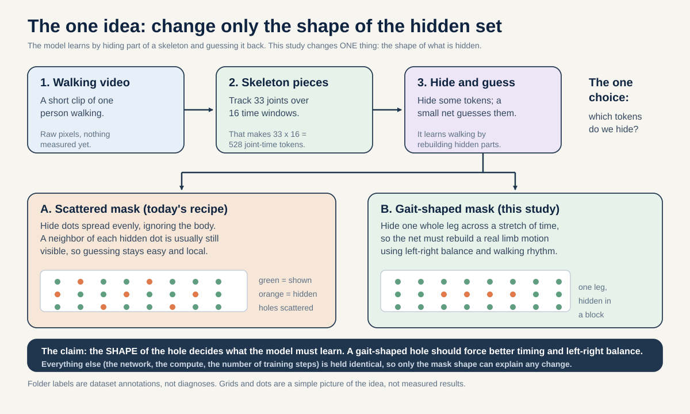
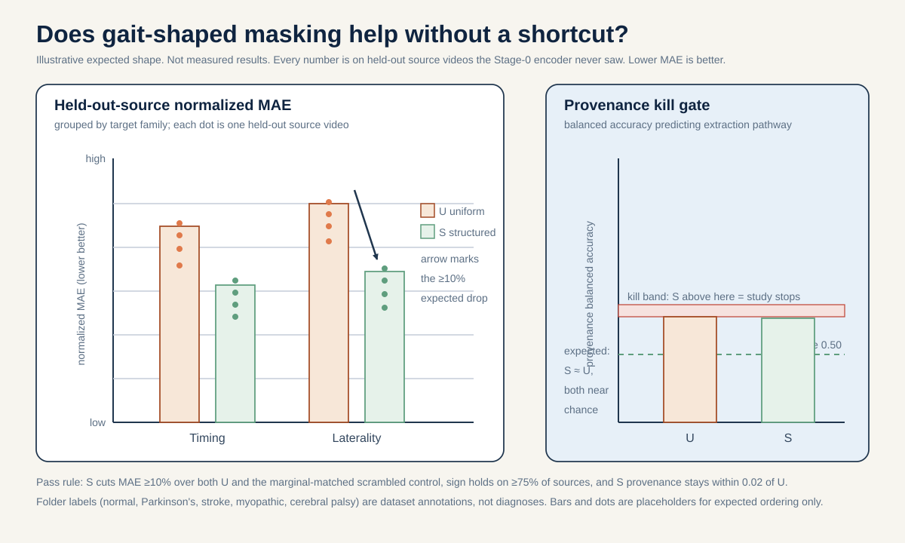
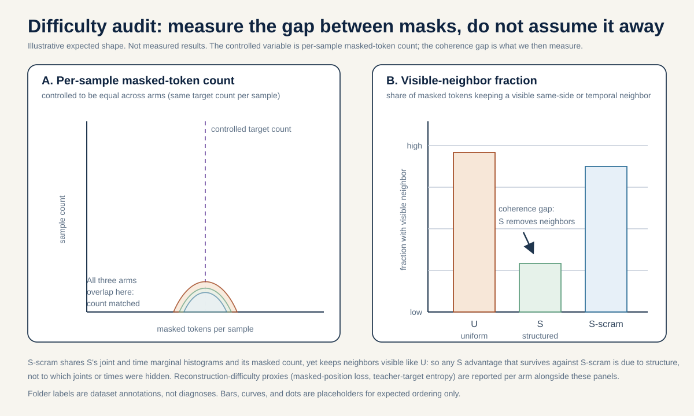
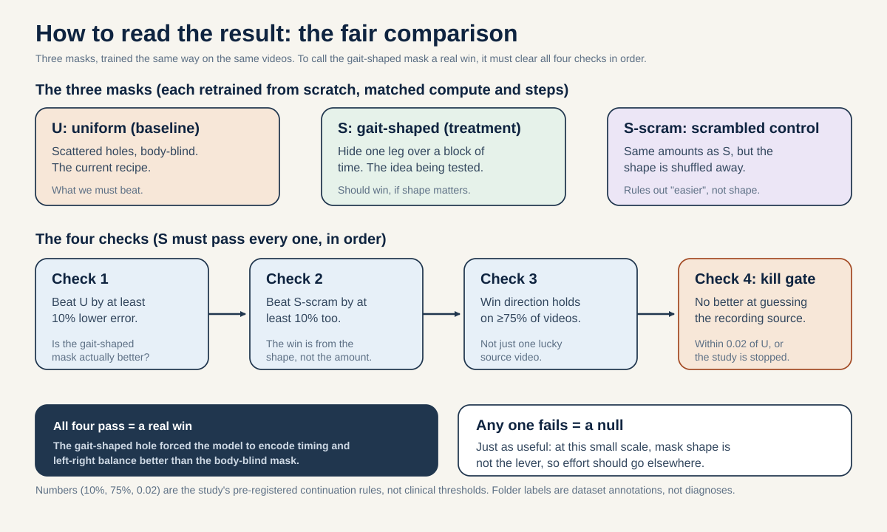

# Mask geometry as the object: does anatomically structured masking make timing and asymmetry more recoverable than the uniform 12-joint mask?

**Portfolio role:** mechanism / design, rank 6
**Three-week endpoint:** 5 September 2026
**Estimated effort:** 12 to 16 researcher-days, front-loaded on building and verifying a fold-local Stage-0 retrain harness

> Holding encoder, compute, and steps fixed, does replacing the uniform-over-12-joints Stage-0 mask with a single best-motivated structured mask increase held-out-source decodability of pre-registered timing/asymmetry targets over the uniform baseline, with the difficulty gap measured rather than assumed away, and without raising provenance decodability?

## The question in plain words

This model learns by hiding part of a skeleton and asking a small network to guess the hidden part. The skeleton is a set of body joints tracked over a short clip. We split the clip into 16 short time windows and track 33 joints, so there are 33 x 16 = 528 possible "joint-time tokens", one number-bundle per joint per time window. A "token" here is just the model's smallest input unit: a 4-frame slice of one joint's motion, turned into a short vector. "Masking" means we pick some of those tokens, hide them from one copy of the model, and train the model to predict the hidden ones from the ones it can still see.

Which tokens we hide is a design choice. The current recipe hides tokens with a rule that does not look at the body at all. It treats the 12 leg-and-shoulder joints that are allowed to be hidden as one big bag and draws from that bag roughly evenly. It never checks whether a hidden token sits next to its own left-right partner, or next to the same joint one time step earlier. So the learning signal is "guess this scattered set of dots" rather than "rebuild a whole piece of walking".

An everyday analogy: think of covering part of a photo with your hand and guessing what is behind your hand. If you always cover a random pixel here and a random pixel there, you can usually guess from the pixels right next to your hand and never really understand the picture. If instead you cover a whole face, you have to actually know what a face looks like to fill it back in. Hiding a whole leg across a few time steps is like covering the whole face: it forces real understanding. Hiding scattered dots is like covering scattered pixels: easy to fake.

(If you want the step-by-step recipe for running this study rather than the science behind it, see the companion how-to guide in [METHODOLOGY.md](./METHODOLOGY.md).)

Gait, the pattern of walking, is not scattered. It is left-right alternation (one leg swings while the other supports) and rhythm over time (a repeating cycle). If the guessing task never forces the model to reason about left-versus-right or before-versus-after, the model may never need to encode timing or asymmetry well. That would explain a known weakness: asymmetry is the hardest gait quantity to read back out of these features (R-squared about 0.154, versus about 0.719 for step amplitude).

**Reading the math (the two R-squared numbers).**
- This says how well a simple linear probe can predict a gait quantity from the learned features.
- R-squared is a "fraction of variance explained": 0 means the features tell you nothing beyond the average, and 1 means they predict the quantity perfectly.
- R-squared runs from 0 to 1 here (higher is better). Values can dip below 0 for a bad model, but these do not.
- 0.154 for asymmetry means the features explain only about 15 percent of the spread in asymmetry. 0.719 for step amplitude means they explain about 72 percent. Asymmetry is much weaker.
- If the features carried no timing or asymmetry information at all, this number would sit near 0.

So the question is simple and concrete. If we change only the shape of the mask, keeping everything else identical, do the features become better at giving back the two gait quantities that gait-shaped masking should most affect: timing and left-right asymmetry? And do they do so for real, on walking videos the model never trained on, rather than by making the guessing task trivially easier or by leaning on a recording artifact?

## Why this matters

A positive result confirms a specific belief about self-supervised learning: that for small, structured cohorts, the shape of the pretext task decides what the representation is forced to encode, and that a gait-aware mask injects a useful hint (an "inductive bias") that a body-blind uniform mask does not. That is a reusable design lesson for anyone pretraining skeleton or pose models on small clinical datasets, well beyond this repository.

A null result is just as useful, and rules out a tempting belief. If a well-motivated structured mask does not beat the uniform mask on held-out sources once the reconstruction-difficulty gap is controlled, then at this scale (96 sequences from 18 source videos, an embedding width of 64, a two-layer encoder) mask geometry is not the lever. The bottleneck would then be more likely the data scale, the token geometry, or the label-aware fine-tuning, which would redirect effort away from mask engineering. Given that the sampler is already known to be degraded (the realized eligible-token fraction drifted from 0.551 at the end of Stage 0 to 0.423 at the end of Stage 4), knowing whether mask structure even matters here is worth establishing before anyone tunes it.

**Reading the math (the two eligible-token fractions).**
- This says what share of the tokens that are allowed to be hidden were actually available to be masked at each stage.
- The eligible-token fraction is a fraction, so it runs from 0 to 1.
- 0.551 means about 55 percent were available at the end of Stage 0; 0.423 means about 42 percent by the end of Stage 4.
- The drop from 0.551 to 0.423 means the sampler slowly lost usable targets over training, which is why the current masking is called degraded.

## Conference-level augmentation

This section lifts the study from a one-dataset question ("does one structured mask beat the uniform mask on gavd5") to a transferable principle: at matched difficulty, the GEOMETRY of a gait-shaped mask decides which clinical axis a skeleton-JEPA is forced to encode. It does three things. It ties three pre-registered mask families to the neuroscience that defines their targets. It states the claim that travels beyond gavd5. And it is honest about which family can be checked out of cohort and which cannot. Nothing here loosens the equal-coverage difficulty control or the provenance-probe hard kill gate from the Method; those stay exactly as written.

The upgrade to the primary design is small and stated plainly. The confirmation still compares Arm U (uniform) against ONE structured Arm S at a time, with its matched-difficulty scrambled control (Arm S-scram) and the provenance kill gate. What changes is that Arm S is now drawn from a pre-registered SET of three mechanism-defined mask families rather than a single unmotivated choice, and each family predicts a different recoverable axis. Each family is run as its own two-arm contrast, so the difficulty control and the kill gate apply unchanged within every family.

### Three pre-registered mechanism-defined mask families

Each family follows one chain: a neurological source, the mechanism it produces, the skeleton-measurable feature that mechanism leaves in the joints, and the validated biomarker that anchors the feature. The mask is shaped to force the predictor to infill exactly that feature. The picture below, fig3.svg, lays the three families out side by side so you can see the map from biology to mask shape before reading the dense prose.



**How to read this picture.** fig3.svg lines up the three gait-shaped mask families in three rows. Each row shows a neurological source on the left, the walking feature it changes in the middle, and the mask shape built to force the model to rebuild that feature on the right: hide one side's lower limb (asymmetry, for one-sided conditions), hide a contiguous half of the walking cycle in time (rhythm, for Parkinson's), and hide the hip-and-thigh region on both sides at once (symmetric posture, for myopathy).

Before the details, three medical terms in plain words:
- **Corticospinal tract:** the main nerve highway that carries movement commands from the brain down to the body. It crosses over from one side to the other on its way down, so the left brain mostly controls the right side of the body and vice versa.
- **Nigrostriatal degeneration:** the slow loss of a specific set of brain cells (in a region that helps run smooth, automatic movement) that is the core damage in Parkinson's. Early on it is often worse on one side of the brain, so it shows up worse on one side of the body.
- **Periventricular leg-corticospinal lesion:** an early-life injury to the part of the brain's wiring that serves the legs (the fibers sit near the fluid-filled spaces deep in the brain). When it hits only one side, it produces a one-sided (hemiplegic) form of cerebral palsy.

- **Contralateral-pair masking (forces asymmetry infill -> lateralized conditions).** "Contralateral" just means "the opposite side of the body." Hide one side's lower-limb tokens while leaving the opposite side visible, so the predictor must infill the hidden side from its opposite-side partner and can only do so well if the representation carries left-versus-right structure. Source and mechanism: the corticospinal tract crosses over (at a spot called the pyramidal decussation), so damage to one side of the brain gives a one-sided (opposite-side) deficit in stroke (Natali and Javed, StatPearls corticospinal anatomy, PMID 30571044); the Parkinson's brain-cell loss is worse on one side at onset (Riederer and Sian-Hulsmann 2012, J Neural Transm, PMID 22367437); a one-sided early-life leg-wiring injury gives hemiplegic (one-sided) cerebral palsy (Volpe 2009, Lancet Neurol, PMID 19081519). Skeleton-measurable feature: the signed left-minus-right excursion difference (how much more one side moves than the other, keeping track of which side). Validated biomarker: the clinical Symmetry Ratio on step length, swing time, and stance time (Patterson et al. 2010, Gait Posture, PMID 19932621). This family targets the axis the current readout is worst at (asymmetry R-squared about 0.154).
- **Half-cycle / future-phase masking (forces rhythm infill -> Parkinson's).** Hide a contiguous half of the gait cycle in time (or the later time windows given the earlier ones), so the predictor must infill the missing phase from the temporal rhythm rather than from a neighboring dot. Source and mechanism: posterior-putamen dopamine loss removes habitual, automatic motor control, degrading the internal rhythm generator in Parkinson's (Redgrave et al. 2010, Nat Rev Neurosci, PMID 20944662; Wu, Hallett, Chan 2015, Neurobiol Dis, PMID 26102020). Skeleton-measurable feature: cycle-to-cycle timing variability. Validated biomarker: stride-time coefficient of variation, with concrete anchors of 8.8 percent in fallers versus 4.2 percent in non-fallers (Schaafsma et al. 2003, J Neurol Sci, PMID 12809998; Hausdorff et al. 1998, Mov Disord, PMID 9613733).

  **Reading the math (the 8.8 percent versus 4.2 percent stride-time CV).**
  - This says how much stride timing wobbles from step to step, as a percentage of the average stride time.
  - The coefficient of variation is a spread divided by a mean, expressed as a percent; it is 0 or larger, and larger means more irregular timing.
  - 8.8 percent is the value reported for fallers and 4.2 percent for non-fallers, so the faller value is about twice as large.
  - A doubling of this number is the rhythm signature this mask family is meant to make recoverable; a mask that only hides scattered dots never forces the model to encode it.
- **Proximal-segment masking (forces symmetric proximal infill -> myopathy).** Hide the proximal lower-limb tokens (hips, and the proximal thigh chain) on BOTH sides together, so the predictor must infill a symmetric proximal pattern rather than a one-sided one. Source and mechanism: primary muscle disease produces diffuse, symmetric, proximal (limb-girdle) weakness, and symmetry is the characteristic distribution that separates it from a one-sided upper-motor-neuron lesion (Barohn et al. 2014, Neurol Clin, PMID 25037080). Skeleton-measurable feature: bilateral proximal posture with LOW left-right asymmetry and preserved cadence. Validated biomarker: anterior pelvic tilt of 16.4 degrees versus 11.6 degrees in controls with preserved cadence, alongside the absence of significant left-right asymmetry in Duchenne muscular dystrophy (Vandekerckhove et al. 2022, Front Hum Neurosci, PMID 35721358; Xiong et al. 2023, Biomed Eng Online, PMID 37525241).

  **Reading the math (anterior pelvic tilt 16.4 versus 11.6 degrees).**
  - This says how far forward the pelvis tips, in degrees, in the myopathy group versus controls.
  - Both are angles in degrees; a larger number means the pelvis is tilted further forward.
  - 16.4 degrees is the myopathy value and 11.6 degrees is the control value, a difference of about 5 degrees.
  - This is a SYMMETRIC postural sign (it appears on both sides at once), which is why the mask that targets it hides proximal tokens bilaterally rather than one side.

Skeleton recoverability bounds every family. Markerless sagittal pose recovers the ingredients well: temporal mean absolute error 0.02 s/step and sagittal hip, knee, ankle angle errors of 4.0, 5.6, and 7.4 degrees against marker-based capture (Stenum et al. 2021, PLoS Comput Biol, PMID 33891585). The timing error of 0.02 s/step is far smaller than the stride-time-variability differences the rhythm family targets, and the angle errors are well below the roughly 5-degree pelvic-tilt gap the proximal family targets, so these features are honestly readable in the plane the skeleton sees. Skeletons still cannot recover kinetics or propulsion, EMG or spasticity, transverse-plane rotation, or an etiologic diagnosis, so no mask family here upgrades a folder label into a clinical finding.

### The generalizable claim (what transfers beyond gavd5)

The transferable contribution is a principle about pretext design, not a gavd5 number. Stated plainly: for a skeleton-JEPA, gait-specific mask geometry, held at matched reconstruction difficulty, shapes which clinical axis becomes linearly recoverable from the frozen features. Contralateral-pair geometry should raise recoverability of the asymmetry axis, half-cycle or future-phase geometry the rhythm axis, and bilateral proximal geometry the symmetric-proximal axis, each above its uniform-mask and marginal-matched-scramble control. This is a claim about the coupling between mask shape and encoded mechanism that any skeleton-JEPA on any cohort can test with the same equal-coverage difficulty control and the same provenance kill gate. The specific margins and R-squared values on gavd5 are illustrations of the principle in use, not the contribution itself.

### Biomarker-specific external-cohort note (honest scope)

None of the three families has an external SKELETON cohort inside this project's sanctioned facts, and I state that plainly rather than papering over it. No participant-disjoint skeleton cohort with the matching signed-laterality, stride-time-variability, or myopathy-posture labels is available to this study, so cross-cohort confirmation of any of the three axes at the skeleton level is out of scope here.

One honest wrinkle, stated deliberately rather than dropped. The augmentation record for this idea notes that the rhythm (Parkinson's) family alone has a cross-modal, label-level anchor: PhysioNet gaitpdb (DOI 10.13026/C24H3N), a public dataset of Parkinson's gait with a stride-time-variability label. "Cross-modal" means it comes from a different sensor: gaitpdb is recorded with force-sensitive insoles worn in the shoes, not from video skeletons. That matters. It is a wearable-sensor cohort, not a skeleton cohort, it is not part of this project's shared facts, and its labels are not the frozen-latent targets read out here. So it can confirm that the stride-time-variability axis is a real, labeled thing in an independent group of people, but it cannot confirm that THIS video-skeleton encoder recovers that axis. I therefore treat gaitpdb as an axis-level anchor for the rhythm family only, never as a skeleton-level generalization test, and I keep the conservative conclusion: cross-cohort confirmation at the skeleton level stays out of scope for all three families here.

Each family's biomarker is otherwise anchored only by the verified clinical literature cited above (the Symmetry Ratio for asymmetry, stride-time CV for rhythm, and anterior pelvic tilt with low left-right asymmetry for the symmetric-proximal family), which establishes that the axis and its biomarker are real in the clinic but says nothing about generalization of this encoder. As everywhere in this portfolio, any clinical-accuracy reading is external-cohort reach-tier only; the n=18 source videos here cannot be upgraded into a clinical claim, and the neuroscience defines the target and the falsifiable prediction, never a clinical-accuracy statement.

### Feasibility delta versus the original

This augmentation is more expensive than the signed-laterality probe because, unlike a test-time-only read, every arm here retrains Stage 0 fold-locally. The original single-mask plan already budgeted that fold-local retrain harness. Expanding from one structured mask to three pre-registered families multiplies the retrain count (each family is its own U-versus-S-versus-S-scram contrast at matched steps), so the honest core estimate grows from the original three-week single-mask study to roughly 4 to 6 weeks of core work: build and verify the fold-local Stage-0 retrain harness once, then run the three families through the same difficulty control and provenance kill gate. Feasibility is therefore medium, not fast: the cost is retrain compute and harness verification, not new data. Marked honestly: medium feasibility, 4 to 6 weeks core, fold-local retrain per family.

## Background and related work

The machinery, from scratch:

- **Encoder.** A neural network that turns each visible joint-time token into a feature vector (a list of numbers that summarizes the input). Here it is a small Transformer: embedding dimension 64, depth 2, and 4 attention heads (a Transformer reads all tokens at once and lets each token pay attention to the others; "4 attention heads" means it does this looking-around in 4 parallel ways and combines them). GELU is the smooth on-off curve each neuron uses to decide how strongly to fire. "Pre-norm" means the numbers are rescaled to a steady range just before each layer, which keeps training stable. Each token starts as a 4-frame x 3-coordinate = 12-number vector (the coordinates are monocular BlazePose x, y, and a relative z) and is projected to the 64-dimensional space by one linear layer.

- **Two encoders and the EMA teacher.** There are two copies. The online (student) encoder sees only the visible tokens. The target (teacher) encoder sees all 528 tokens and is never updated by the usual gradient step (backpropagation). Instead its weights are a slow running average of the student's, an "exponential moving average" (EMA): each step the teacher moves a tiny fraction toward the student. An EMA teacher is like a slow-moving average that ignores day-to-day noise. The momentum follows a cosine schedule from about 0.999 toward 1.0.

  **Reading the math (the EMA momentum 0.999 to 1.0).**
  - This says how much of the old teacher is kept each step versus how much of the student is mixed in.
  - The momentum is a fraction between 0 and 1. At 0.999 the teacher keeps 99.9 percent of its old weights and takes 0.1 percent from the student each step, so it changes very slowly.
  - "Cosine schedule" just means the number rises smoothly along a cosine curve as training goes on.
  - As it approaches 1.0 the teacher stops moving almost entirely, giving stable prediction targets and helping prevent collapse (the failure where every input maps to the same vector).
  - If the momentum were 0, the teacher would equal the student every step, the targets would chase the student, and collapse would be likely.

- **Predictor.** A separate small network (a 2-layer Transformer with a learned "mask token" placeholder) that takes the student's visible features plus placeholders at the hidden positions and predicts the teacher's features at exactly those hidden positions. This "predict hidden features, not hidden pixels" recipe is JEPA, the Joint-Embedding Predictive Architecture (Assran et al., I-JEPA, CVPR 2023, arXiv:2301.08243; Bardes et al., V-JEPA, 2024, arXiv:2404.08471). It is applied to skeletons here following Abdelfattah and Alahi, S-JEPA, ECCV 2024, DOI 10.1007/978-3-031-73411-3_21.

- **Masking.** In V-JEPA the mask covers 75 to 90 percent of a video. Here it cannot. Only 12 landmarks are eligible to be hidden: left and right shoulder, hip, knee, ankle, heel, and foot index. Face and arm joints are always-visible context, never targets. So the maximum global mask fraction is 12/33 = 0.364. The configured target hides about 0.60 of the eligible tokens.

  **Reading the math (12/33 = 0.364 and the 0.60 target).**
  - The first says the largest share of all joints that could ever be hidden.
  - 12 is the number of maskable joints; 33 is the total number of joints; "/" is division; 0.364 is the resulting fraction (about 36 percent).
  - Both numbers are fractions between 0 and 1.
  - The 0.60 target is the share of the eligible tokens (not all tokens) that the sampler aims to hide, so about 60 percent of the leg-and-shoulder tokens.
  - If face and arm joints were allowed as targets, the 0.364 ceiling would rise toward the V-JEPA range; the ceiling is low here precisely because those joints are locked as context.

  Crucially, the current sampler never reads joint size, displacement, velocity, acceleration, or any learned motion score; motion-aware sampling (MAMP) and motion-topology masking (MTM) are explicitly forbidden. The sampler is body-blind by design, which is exactly the assumption this proposal probes.

- **The loss and anti-collapse.** Total loss is:

  `L = L_JEPA + 0.05 * L_VICReg + 0.25 * L_group`

  **Reading the math (the total loss).**
  - This says the total training loss is a weighted sum of three parts that the model tries to make small.
  - `L` is the total loss (the single number training pushes down).
  - `L_JEPA` is the main term: how far the predictor's guesses are from the teacher's features at the hidden positions.
  - `L_VICReg` is an anti-collapse term (variance floor plus covariance penalty) that keeps features spread out and non-redundant.
  - `L_group` is a label-aware term that pulls features of the same condition toward a shared center; it is only on in Stages 1 to 4.
  - `*` means multiply and `+` means add, so each part is scaled by its weight and then summed.
  - `0.05` is a small weight on VICReg and `0.25` is a larger weight on the group term; they are small versus the implied weight of 1.0 on `L_JEPA`, so prediction stays the dominant goal while VICReg only gently prevents collapse.
  - If the `0.05 * L_VICReg` term were set to zero, nothing would stop the features from collapsing to one vector; if `0.25 * L_group` were zero (as it is in Stage 0), training would be purely self-supervised with no label pull.

  L_JEPA is a latent cross-entropy: the teacher target is centered (running EMA center, beta 0.9), sharpened at temperature 0.06, and detached (stop-gradient), while the prediction uses temperature 0.10. VICReg (Bardes, Ponce, LeCun, ICLR 2022, arXiv:2105.04906) adds a variance floor and a covariance penalty so features keep spread and do not collapse. L_group is a label-aware term that uses the condition labels: it pulls each clip's features toward the average feature (the "centroid", meaning the center point) of all clips with the same condition label. It is active only in Stages 1 to 4. Because those stages use the labels to steer the features, they are supervised fine-tuning, meaning the labels do part of the teaching rather than the model learning purely on its own. This proposal changes ONLY the Stage-0 mask, where L_group is off, so the treatment is clean self-supervised pretext geometry.

  **Reading the math (the temperatures 0.06 and 0.10 and the center beta 0.9).**
  - This says how sharp the teacher target is versus the student prediction, and how the target is re-centered over time.
  - A temperature scales how peaked a soft distribution is: a smaller temperature makes it sharper (more confident), a larger one makes it flatter.
  - 0.06 is the teacher temperature (sharper); 0.10 is the student temperature (a little softer). Both are positive numbers.
  - "Sharpened and detached" means the target is made confident and then frozen so no gradient flows back into the teacher (stop-gradient).
  - beta 0.9 is the smoothing weight of the running EMA center: it keeps 90 percent of the old center and adds 10 percent of the new batch mean each step, which stops one part of the feature space from dominating.
  - If the teacher temperature were as high as the student's, the target would be too soft and less informative, weakening the training signal.

- **Why source-video-disjoint splits matter.** The independent unit is the source video, not the clip, because clips from one video share a camera, a person, and an extraction path (Kapoor and Narayanan, arXiv:2207.07048, catalog how a non-independent test set inflates results). A "source-video-disjoint split" means every clip from a given YouTube video lands entirely in train or entirely in test, never both. "Generalization" means working on data the model never saw during training, which is the only honest test of whether it truly learned the pattern. "Transductive" is the opposite situation: the encoder was trained on the very clips it is later graded on. Any score where the encoder already saw the test video is transductive, so it tells you the model can repeat what it memorized, not that it generalizes to new videos.

Skeleton and pose facts: joints come from BlazePose GHUM (Grishchenko et al., 2022, arXiv:2206.11678); the cohort is drawn from GAVD (Ranjan et al., IEEE Access 2025, DOI 10.1109/ACCESS.2025.3545787). Small-sample error bars are large (Varoquaux, NeuroImage 2018), so we report every source as a dot rather than one pooled number. Silhouette separation is a score that says how well the groups (here, condition labels) form tight, well-separated clusters: for each clip it compares how close that clip sits to its own group versus the nearest other group, so a high score means clips of the same condition huddle together and sit far from other conditions, and a near-zero score means the groups overlap and blur into each other. It is measured per Rousseeuw (1987, DOI 10.1016/0377-0427(87)90125-7).

## Method

Everything below reuses the existing token geometry (528 joint-time tokens, 33 joints x 16 time positions, embed_dim 64) and the existing loss, EMA, and VICReg configuration. The only deliberate change is the Stage-0 mask sampler.

### 1. Fix one lineage and one budget

Bind the study to a single fingerprint, but bind only what is portable. The curriculum-final checkpoint prefix is `d0acc262`, whose Stage 0 is the normal-only run, and per the shared facts nearly all of those normal rows come through the AUGMENTED extraction path from the single normal video `3KnFt8bH3tE`. A canonical (non-augmented) lineage prefix `dba24a` also exists locally. Because this proposal retrains Stage 0 from scratch fold-locally on a provenance-harmonized subset, we do NOT reuse the shipped Stage-0 data composition, and we do NOT claim to reproduce the normal-only augmented Stage-0 lineage row-for-row. What every arm inherits from `d0acc262` is only the portable recipe: the exact architecture (embed_dim 64, depth 2, 4 heads), the optimizer, the number of optimizer updates, and the default uniform-mask sampler. The DATA the harmonized Stage 0 trains on is the canonical single-pathway subset defined below (the same pathway as the `dba24a` canonical lineage), because the held-out generalization sources are canonical-path abnormal videos and provenance must be held constant to keep the kill gate honest. Concretely: the augmented normal video cannot enter the harmonized Stage-0 subset and cannot be a held-out source (it is single-source and off-pathway), so binding the recipe to `d0acc262` while running the data on the canonical pathway is the only internally consistent equal-budget binding. Both structured and uniform arms then run the same number of optimizer updates on the same canonical-pathway folds with the same seeds.

### 2. Two arms only (a third is exploratory)

- **Arm U (uniform):** the current body-blind sampler over the 12 eligible joints. This is the baseline.
- **Arm S (structured):** a SINGLE best-motivated anatomically structured mask. The pre-registered choice is a **same-side lower-limb temporal block**: when a token is hidden, preferentially hide the same joint at adjacent time windows and its same-side chain neighbor (for example, hide right knee and right ankle across two consecutive time windows together), forcing the predictor to infill a coherent limb trajectory rather than scattered dots. This is the one mask motivated directly by gait structure (alternation plus rhythm).

Any other structured mask (for example a cross-side mirror mask) is exploratory only and never enters the primary confirmation.

### 3. Control the single coverage variable and MEASURE difficulty

We do NOT attempt to match both the eligible-token fraction and the exact masked count. The mask audit only reports ratios, and a fixed anatomical set cannot equal a batch-minimum count. Instead we pre-register ONE controlled coverage variable: the per-sample masked-token count, held to the same target as Arm U's batch-safe sampler (mask the count derived from the least-visible sample, same count for every sample, always leaving at least one eligible token visible). Then we MEASURE and report the difficulty gap explicitly for each arm:

- per-sample masked-token count distribution;
- count of masked tokens that still have a visible same-side or temporal neighbor (structured masking removes neighbors, so this is expected lower for Arm S; reporting it prevents pretending the tasks are equally hard);
- reconstruction-difficulty proxies, meaning stand-in measures of how hard the guessing task is. The first is the mean "sharpened entropy" of the teacher's target at the hidden spots: entropy measures how spread out and uncertain a target is (low entropy means one clear answer, high entropy means many plausible answers), and "sharpened" means the target was first made more confident by the low teacher temperature, so this proxy captures how peaked the answer is. The second is the masked-position prediction loss "at convergence", meaning the leftover prediction error once training has settled and stopped improving.

**Worked example (illustrative numbers, not grounded facts).** Suppose a fold gives these small made-up figures for the primary endpoint (mean held-out-source normalized MAE, where lower is better):

- Arm U mean normalized MAE = 0.400 (illustrative).
- Arm S mean normalized MAE = 0.340 (illustrative).
- Arm S-scram mean normalized MAE = 0.395 (illustrative, the mean of the per-source array used in the Python block below, so the two illustrations are one consistent dataset).

Step 1, Arm S versus Arm U: improvement = (0.400 - 0.340) / 0.400 = 0.060 / 0.400 = 0.15, that is 15 percent lower error.
Step 2, Arm S versus Arm S-scram: improvement = (0.395 - 0.340) / 0.395 = 0.055 / 0.395 = 0.139, that is about 14 percent lower error.
Step 3, read against the pre-registered margin: the rule requires at least a 10 percent reduction over BOTH controls. Here 15 percent and 14 percent both clear 10 percent, so (if the sign also holds on at least 75 percent of held-out sources and the provenance gate stays within 0.02) this fold would count toward a pass, not a null.

```python
import numpy as np

# Illustrative per-held-out-source normalized MAE (lower is better).
# One number per held-out source video. These are made-up, not grounded facts.
arm_u       = np.array([0.42, 0.39, 0.41, 0.38])  # uniform baseline
arm_s       = np.array([0.35, 0.33, 0.36, 0.32])  # structured mask (treatment)
arm_s_scram = np.array([0.41, 0.38, 0.40, 0.39])  # marginal-matched, structure destroyed

# Macro-average across held-out sources (each source counts equally).
mean_u, mean_s, mean_scram = arm_u.mean(), arm_s.mean(), arm_s_scram.mean()

# Relative reduction of Arm S versus each control. Positive means S is better.
def relative_reduction(control_mean, treatment_mean):
    return (control_mean - treatment_mean) / control_mean

drop_vs_u     = relative_reduction(mean_u, mean_s)      # must be >= 0.10
drop_vs_scram = relative_reduction(mean_scram, mean_s)  # must also be >= 0.10

# Sign must hold on at least 75 percent of held-out sources.
sign_hold_fraction = np.mean(arm_s < arm_u)

passes = (drop_vs_u >= 0.10) and (drop_vs_scram >= 0.10) and (sign_hold_fraction >= 0.75)
print(drop_vs_u, drop_vs_scram, sign_hold_fraction, passes)
```

### 4. Matched-difficulty scrambled control (Arm S-scram)

For the structured mask, generate a control mask with identical per-sample masked-token count AND identical joint-marginal and time-marginal histograms, but with the joint-time pairing scrambled so the same-side and temporal coherence is destroyed. Any advantage of Arm S over Arm U that survives against Arm S-scram is attributable to structure, not to which joints or times were hidden on average.

### 5. Read out the frozen features on pre-registered targets

Freeze each trained target-encoder and, without retraining it, extract features for held-out sources. Fit a ridge probe (a simple straight-line predictor with a "regularizer", meaning a built-in brake that stops the line from bending too hard to fit noise) to predict two pre-registered target families. The strength of that brake is called the penalty: a bigger penalty forces a simpler, flatter fit. We pick the penalty using only the training-source data, never peeking at the held-out sources, so the choice cannot be tuned to the test. defined by a single frozen deterministic function of the cached raw coordinates and validity masks:

1. **Timing:** normalized-time targets only (no seconds, no cadence, because the 64-frame resize destroys absolute duration), such as the signed left-right ankle phase lag in normalized clip time. Phase lag means how far apart in the walking cycle the two ankles are: if the left ankle reaches the front of its swing a bit before the right, that timing offset is the phase lag, and "signed" means we keep track of which side leads (positive versus negative).
2. **Asymmetry:** a signed left-minus-right laterality scalar over the lower limb. A laterality scalar is one number that captures how different the left side is from the right (for example left range of motion minus right range of motion); "signed" again keeps which side is larger, and a value near zero means the two sides move almost the same.

Report normalized mean absolute error (MAE) and R-squared per held-out source.

**Reading the math (normalized MAE and R-squared).**
- Normalized MAE says, on average, how far the probe's prediction is from the truth, scaled so targets of different sizes are comparable.
- MAE is 0 or larger; 0 is perfect and lower is better. "Normalized" means it is divided by a scale of the target so it is unitless.
- R-squared is the fraction of the target's spread the probe explains, from 0 to 1, higher is better.
- If the features carried no signal, normalized MAE would be about the size of just predicting the average, and R-squared would be near 0.

### 6. Provenance kill gate and permutation sanity check

- **Provenance-harmonized Stage-0 subset (named explicitly).** Every arm's Stage 0 trains on ONE extraction pathway: the CANONICAL (non-augmented) pathway, the same pathway as the `dba24a` lineage. This subset is the canonical abnormal cohort only, that is the 84 canonical non-normal sequences from the 17 abnormal source videos (per-condition source counts: Parkinson's 2, stroke 3, myopathic 10, cerebral palsy 2; per-condition sequence counts Parkinson's 9, stroke 12, myopathic 47, cerebral palsy 16). The augmented normal video `3KnFt8bH3tE` is EXCLUDED from the harmonized Stage-0 subset because it is off-pathway (augmented), single-source, and would reintroduce the exact provenance split the gate is meant to close. This is why the harmonized Stage 0 does not and cannot reproduce the shipped normal-only augmented Stage-0 data; it inherits only the `d0acc262` recipe, not its rows.
- **Provenance probe (HARD KILL GATE):** with the subset harmonized to one pathway there is no train-time pathway label to decode, so the residual gate is fit within each fold on any remaining acquisition covariate that survives harmonization (for example source-video identity). Fit the same linear probe to predict that covariate from each arm's features. If Arm S raises its decodability by more than the pre-registered 0.02 balanced-accuracy ceiling over Arm U, the study is killed regardless of the gait result, because a "better" mask that mostly encodes an acquisition artifact is not a gait improvement.
- **Permutation sanity check (operationally defined).** This is a READOUT-TIME test on the already-trained encoder; it does NOT retrain anything, which is what distinguishes it from Arm S-scram (Arm S-scram scrambles the mask during Stage-0 training and produces a different encoder, whereas this check leaves the trained encoder and its masking untouched). Take the frozen Arm S encoder, run the trained structured mask so the predictor infills the hidden positions, then randomly permute the infilled feature tokens across their joint-time positions before the ridge probe reads them, and refit only the ridge probe on the permuted features. Confirm the gait decodability collapses toward the non-neural coordinate floor. If it does not collapse, the probe was not reading the infilled structure the mask was supposed to shape, and the geometry claim is not supported.

## The decisive experiment

**The split, stated before any fitting.** Source-video-disjoint outer folds over the provenance-harmonized canonical subset defined in Method step 6: the 84 canonical non-normal sequences from the 17 abnormal source videos (per-condition source counts: Parkinson's 2, stroke 3, myopathic 10, cerebral palsy 2). The single augmented normal video `3KnFt8bH3tE` is excluded from both Stage-0 training and the held-out folds, so normal is not a held-out generalization source (it is single-source and off-pathway anyway). Held-out folds are therefore drawn only from the canonical abnormal conditions with at least 2 sources, and we pool the two gait targets across those conditions rather than claiming per-class held-out R-squared on any single-source slice. Every number is labeled with encoder exposure; all readouts here are on held-out sources the Stage-0 encoder did not see.

**Primary endpoint.** Mean held-out-source normalized MAE across the two pre-registered target families, macro-averaged over held-out source videos (macro-averaged means we score each held-out source video on its own and then average those scores so every video counts equally, and a video with many clips cannot dominate a video with few), evaluated as Arm S minus Arm U AND, jointly, as Arm S minus Arm S-scram. Both contrasts must favor Arm S (see the pass rule below); the endpoint is the paired improvement of the structured mask over BOTH controls, not a uniform-only comparison.

**Pre-registered margin.** Arm S must reduce the primary endpoint by at least 10 percent relative to Arm U, the sign of the improvement must hold on at least 75 percent of held-out sources, the advantage must survive against Arm S-scram (not merely against Arm U), and Arm S provenance balanced accuracy must not exceed Arm U's by more than 0.02. Balanced accuracy is accuracy averaged across the classes rather than across the rows, so a rare class counts as much as a common one; it stops a probe from looking good just by always guessing the majority class. Failing any clause is scored as a null.

**Reading the math (the pass rule: 10 percent, 75 percent, 0.02).**
- This says three tests Arm S must all pass to count as a real win rather than a fluke.
- The 10 percent is a relative reduction in error: Arm S's mean normalized MAE must be at least 10 percent below each control's. It is computed as (control minus treatment) divided by control.
- The 75 percent is the share of held-out source videos where Arm S must beat the control in the right direction; it runs from 0 to 1, here at least 0.75.
- The 0.02 is the largest allowed rise in provenance balanced accuracy (Arm S minus Arm U); balanced accuracy runs from 0 to 1, so 0.02 is a tight ceiling that blocks Arm S from winning by encoding an acquisition artifact.
- If any single clause fails, the result is scored as a null.

**Simple non-neural baseline.** Handcrafted timing and laterality features computed directly from raw coordinates (no encoder), fit with the same ridge probe. This bounds how much of the target is trivially readable from coordinates and tells us whether any neural arm is even necessary.

| Arm / baseline | Stage-0 mask | Steps | Encoder retrained | Role |
|---|---|---:|---|---|
| Baseline (coordinates) | none | 0 | no | Non-neural floor: what raw coords already give |
| U (uniform) | body-blind over 12 joints | matched | yes, fold-local | Primary baseline |
| S (structured) | same-side lower-limb temporal block | matched | yes, fold-local | Primary treatment |
| S-scram | marginal-matched, structure scrambled | matched | yes, fold-local | Isolates structure from marginals |
| Transductive ref | shipped `d0acc262` | as shipped | no (labeled transductive) | Context only, never the endpoint |

## Controls and incorporated repairs

Every repair listed for this slug in `_selection.json`, and how it is addressed:

1. **Drop the impossible "match eligible-fraction AND masked count" requirement.** Addressed in Method step 3: we pre-register exactly ONE controlled coverage variable (per-sample masked-token count) and explicitly acknowledge the mask audit only reports ratios, so a fixed anatomical set cannot equal a batch-minimum count.

2. **Measure the difficulty gap explicitly.** Method step 3 reports per-sample masked-count distributions, the count of masked tokens with a visible same-side or temporal neighbor, and reconstruction-difficulty proxies for each arm. We never assume the two masks are equally hard; we measure and report the gap.

3. **In-space matched-difficulty control.** Arm S-scram (Method step 4) uses identical masked count and identical joint and time marginal histograms with scrambled structure, so any surviving Arm S advantage is attributable to structure and not to which joints or times were hidden.

4. **Restrict the primary confirmation to two arms.** The decisive experiment confirms only Arm U versus Arm S. Any additional structured mask (for example a cross-side mirror) is exploratory and excluded from the primary endpoint.

5. **Provenance harmonization and hard kill gate.** Method step 6 and the lineage-binding section: Stage 0 runs on ONE extraction pathway, the canonical (non-augmented) subset of the 84 abnormal sequences from 17 source videos, with the augmented normal video excluded, so the augmented-versus-canonical split is closed by construction rather than merely controlled. The residual provenance probe (on any surviving acquisition covariate such as source identity) is a HARD KILL GATE. This is why the arms inherit only the `d0acc262` recipe and not its normal-only augmented Stage-0 rows.

6. **Permutation sanity check that the readout depends on infilled structure.** Method step 6 defines this as a readout-time permutation of the infilled feature tokens on the frozen encoder with only the ridge probe refit (no retrain); gait decodability must collapse toward the coordinate floor. It is distinct from Arm S-scram, which scrambles the mask during training and yields a different encoder.

7. **Verify the fold-local Stage-0 retrain harness exists as reusable code (only a README was found) and budget building it.** Week 1 begins by auditing whether the Stage-0 fold-local retrain harness exists as runnable code. If only its README is present, building and unit-testing it is the first budgeted task, and the Day-5 gate blocks all training until it reproduces the shipped uniform-mask Stage-0 behavior (matched on the portable recipe, run on the harmonized canonical subset).

Additional standing controls: source is the unit before all fitting; seed variation is not treated as source variation (seeds control noise only); every number carries an encoder-exposure label; the non-neural coordinate baseline is mandatory; a feature-collapse check (feature standard deviation, reference value 0.413745 on the shipped run; mean pairwise cosine 0.609342) is run on both arms and a collapsed arm is rejected.

**Reading the math (the collapse-check reference values 0.413745 and 0.609342).**
- These say how spread out and how similar the shipped run's features were, giving a yardstick each arm must not fall below or above.
- The feature standard deviation 0.413745 measures how much the features vary; a value near 0 would mean the features barely change across inputs, a sign of collapse.
- The mean pairwise cosine 0.609342 measures how aligned features are on average; a cosine runs from -1 to 1, and a value near 1 would mean nearly all features point the same way, another sign of collapse.
- If an arm's standard deviation fell far below 0.413745 or its mean cosine rose far toward 1.0, that arm is rejected as collapsed.

## How this differs from the existing plan

The nearest neighbors in the existing `plan/` portfolio are plan/01 (honest video-disjoint anomaly screening), which sweeps masks only as a robustness knob to check that a pooled anomaly score is not a masking artifact, and plan/04 (motion-vs-position target ablation), which FIXES the mask and varies the prediction TARGET across retrained encoders. This proposal is the only one that makes mask GEOMETRY the primary experimental treatment: it holds the target and everything else fixed and changes only the shape of what is hidden during Stage-0 pretraining, then measures whether gait-aware structure changes what the representation encodes.

## Three-week timeline

### Week 1 (16 to 22 August 2026)

- Audit whether the fold-local Stage-0 retrain harness exists as runnable code; if only a README exists, build and unit-test it.
- Implement Arm S (same-side lower-limb temporal block sampler) and Arm S-scram (marginal-matched, scrambled) beside the existing uniform sampler; unit-test that masked counts match and that Arm S-scram reproduces Arm S's joint and time marginals.
- Freeze the two target functions (normalized-time timing, signed laterality) as one deterministic function of raw coordinates; measure their reliability under small coordinate noise.
- Build the provenance-harmonized single-pathway subset and confirm folds hold provenance constant.

**Day-5 gate (20 August 2026):** proceed only if (a) the harness reproduces the shipped uniform-mask Stage-0 behavior on a smoke fold, (b) Arm S and Arm S-scram pass their marginal and count unit tests, (c) target reliability is acceptable, and (d) no held-out source is present in any training fold. Otherwise stop and report the harness gap as the result.

### Week 2 (23 to 29 August 2026)

- Run Arm U, Arm S, and Arm S-scram Stage-0 retrains fold-locally with matched steps and three screening seeds.
- Extract frozen held-out-source features; fit ridge probes for both target families and the provenance probe.
- Produce the difficulty-audit numbers (masked-count distributions, visible-neighbor counts, reconstruction proxies) and the collapse check for every arm.

**Day-14 gate (29 August 2026):** continue to confirmation only if the provenance kill gate is clear (Arm S provenance balanced accuracy is within 0.02 of Arm U) and either Arm S crosses the 10 percent margin over both Arm U and Arm S-scram, or the failure pattern cleanly separates a geometry explanation from a difficulty or provenance explanation.

### Week 3 (30 August to 5 September 2026)

- Run five fresh confirmation seeds on the two-arm primary contrast plus Arm S-scram.
- Run the permutation sanity check.
- Produce per-source paired plots, the twin provenance panel, and the difficulty-audit panel.
- Package the samplers, the split manifest, target definitions, seed-level results, and the single bound fingerprint.

## Figures



**fig1.svg** Grouped bar chart of held-out-source normalized MAE on the timing and laterality targets for the uniform versus the structured mask, with per-source paired dots, alongside a twin panel of provenance balanced accuracy that must not rise.



**fig2.svg** Difficulty-audit panel showing the per-sample masked-count distribution and the fraction of masked tokens that retain a visible same-side or temporal neighbor, for the uniform mask, the structured mask, and the marginal-matched scrambled control.


**fig3.svg** The beginner concept diagram: it lines up the three mechanism-defined mask families and shows how each one hides a different part of the skeleton, so you can see at a glance what "mask geometry" means before any numbers appear.



**fig4.svg** The fair-comparison explainer: the three masks are trained under identical settings, then run through four checks (difficulty match, provenance kill gate, scrambled control, and the 75 percent sign rule) that must all pass before a difference counts as a real win rather than an artifact.

## Responsible use

The folder labels used here (normal, Parkinson's, stroke, myopathic, cerebral palsy) are dataset annotations attached to public GAVD source videos. They are not diagnoses made by this project and must not be read as clinical findings about any individual. All targets are normalized-time representation diagnostics, not validated clinical biomarkers, and all reported margins are project continuation rules, not clinical thresholds.

## References

- Abdelfattah and Alahi, S-JEPA, ECCV 2024, DOI 10.1007/978-3-031-73411-3_21.
- Assran et al., I-JEPA, CVPR 2023, arXiv:2301.08243.
- Bardes et al., Revisiting Feature Prediction for Learning Visual Representations from Video (V-JEPA), 2024, arXiv:2404.08471.
- Bardes, Ponce, LeCun, VICReg, ICLR 2022, arXiv:2105.04906.
- Grishchenko et al., BlazePose GHUM, 2022, arXiv:2206.11678.
- Ranjan et al., GAVD, IEEE Access 2025, DOI 10.1109/ACCESS.2025.3545787.
- Kapoor and Narayanan, Leakage and the Reproducibility Crisis in ML-based Science, 2022, arXiv:2207.07048.
- Varoquaux, Cross-validation failure: small sample sizes lead to large error bars, NeuroImage 2018.
- Rousseeuw, Silhouettes, 1987, DOI 10.1016/0377-0427(87)90125-7.
- Natali and Javed, StatPearls, Neuroanatomy, Corticospinal Cord Tract (pyramidal decussation, contralateral control), PMID 30571044.
- Riederer and Sian-Hulsmann, The significance of neuronal lateralisation in Parkinson's disease (asymmetric nigrostriatal onset), J Neural Transm 2012, PMID 22367437.
- Volpe, Brain injury in premature infants (periventricular leukomalacia, leg corticospinal fibers), Lancet Neurol 2009, PMID 19081519.
- Patterson, Gage, Brooks, Black, McIlroy, Evaluation of gait symmetry after stroke (Symmetry Ratio methods), Gait Posture 2010, PMID 19932621.
- Redgrave et al., Goal-directed and habitual control in the basal ganglia (loss of automaticity in Parkinson's), Nat Rev Neurosci 2010, PMID 20944662.
- Wu, Hallett, Chan, Motor automaticity in Parkinson's disease, Neurobiol Dis 2015, PMID 26102020.
- Hausdorff et al., Gait variability and basal ganglia disorders (stride-time variability in Parkinson's), Mov Disord 1998, PMID 9613733.
- Schaafsma et al., Gait dynamics in Parkinson's disease (stride-time CV 8.8 percent fallers vs 4.2 percent non-fallers), J Neurol Sci 2003, PMID 12809998.
- Barohn et al., Approach to peripheral neuropathy and myopathy (symmetric proximal weakness distribution), Neurol Clin 2014, PMID 25037080.
- Vandekerckhove et al., Gait in Duchenne muscular dystrophy (anterior pelvic tilt 16.4 vs 11.6 degrees, preserved cadence), Front Hum Neurosci 2022, PMID 35721358.
- Xiong et al., gait analysis in Duchenne muscular dystrophy (no significant left-right asymmetry vs controls), Biomed Eng Online 2023, PMID 37525241.
- Stenum et al., Two-dimensional video-based analysis of human gait using pose estimation, PLoS Comput Biol 2021, PMID 33891585.
