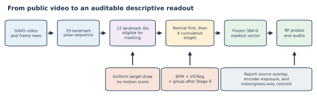
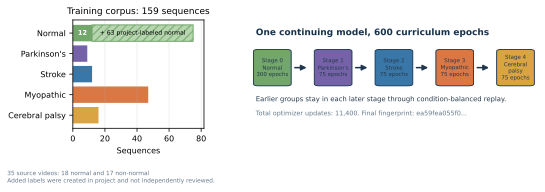
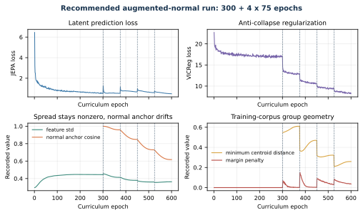
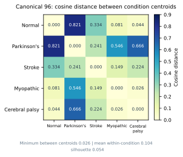
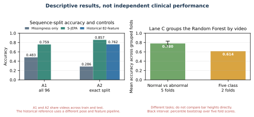

# GAVD S-JEPA gait tutorials

This folder is an executable course on learning motion features from gait video. It starts with a source video, extracts a 33-landmark skeleton, hides selected joint-time tokens, and asks a Skeleton Joint-Embedding Predictive Architecture, or S-JEPA, to predict their latent features. Training begins with normal gait and then continues through four cumulative condition stages.

The completed real run used 159 sequences from 35 source videos. Its features retained nonzero spread, and normal-anchor cosine moved to 0.617. Those checks support a narrow claim that training completed without total collapse, not a claim that the features cleanly separated conditions. On the canonical 96-sequence audit, the five-condition silhouette was only 0.054 and the closest condition centroids were 0.026 apart. All reported readouts are transductive, which means the encoder trained on the rows later used for evaluation. They are descriptions of this known corpus, not estimates for a new patient, video, camera, or clinic.


## The question

A gait video contains the motion of interest, but it also contains camera angle, clothing, background, crop quality, and pose-detector failures. This project asks whether a compact latent representation can retain useful motion structure while making every data and evaluation choice visible.

The implementation follows the main learning graph in S-JEPA, but it is a paper-aligned reimplementation rather than official code. The main changes are:

- monocular MediaPipe landmarks replace calibrated 3D laboratory skeletons;
- prediction targets come from one fixed 12-landmark whitelist;
- targets are sampled uniformly, without a motion score;
- a normal-first five-stage curriculum replaces one pooled training run;
- VICReg applies label-free invariance, variance-hinge, and covariance regularization to projected student features;
- a label-aware group term is active after Stage 0;
- every readout reports video overlap and prior encoder exposure.



## Data layers

The project keeps two data layers separate.

|Layer|Sequences|Videos|Purpose|
|---|---:|---:|---|
|Canonical GAVD experiment|96|18|The fixed five-condition inspection and comparison cohort|
|Added normal candidates|64|17|Self-annotated windows from additional YouTube videos|
|Accepted added normal|63|17|Candidates with neurologic-landmark coverage at least 0.45|
|Stage 0 normal total|75|18|12 canonical plus 63 accepted added normal sequences|
|Full curriculum|159|35|75 normal plus 84 canonical non-normal sequences|

The canonical class counts are 12 normal, 9 Parkinson's, 12 stroke, 47 myopathic, and 16 cerebral palsy sequences. The source video is the independent unit of evidence, not each sequence window. Folder labels are dataset annotations rather than diagnoses. The added normal windows use self-annotated time spans and automatic MediaPipe bounding boxes. They are not canonical GAVD annotations and were not independently clinically verified. One of 64 candidate windows had neurologic-landmark coverage of 0.027 and was rejected. Notebook 04 now reads the extraction report as an explicit selection contract, so the accepted cohort does not depend on which pose files happen to be present.

This provenance difference matters. Most normal rows use the added extraction path, while every abnormal row uses the canonical path. A normal-versus-abnormal classifier could learn acquisition or extraction differences as well as gait differences.



## Model in plain language

Each sequence is resized to 64 frames. Four adjacent frames form one time patch, which gives 16 time positions. With 33 joints, the encoder receives 528 possible joint-time tokens.

The view encoder sees a partly hidden sequence. The target encoder sees the complete sequence. The predictor uses the visible view features to predict the hidden target features. The target encoder is not updated by backpropagation. It follows the view encoder through an exponential moving average, or EMA.

The loss has three jobs:

\[
L = L_{\mathrm{JEPA}} + 0.05L_{\mathrm{VICReg}} + 0.25L_{\mathrm{group}}.
\]

- JEPA trains latent prediction.
- VICReg is only the label-free invariance, variance-hinge, and covariance regularizer on projected student features.
- The separate label-aware group loss adds same-label compactness and a centroid margin after Stage 0.

The group term uses condition labels. Stages 1 through 4 are therefore label-informed representation fine-tuning, not purely self-supervised learning.

### What VICReg, `group`, and `std` mean in the training log

A line such as

```text
JEPA 0.4585  VICReg 12.8508  group 0.0005  std 0.4297
```

mixes losses with one diagnostic, so its short labels need care:

|Printed field|Exact meaning|How to read it|
|---|---|---|
|`JEPA`|Epoch-mean masked latent-prediction loss|Lower means the predictor better matches teacher features at hidden authorized tokens.|
|`VICReg`|Epoch-mean inner value `25 * invariance + 25 * variance + covariance`, before the outer weight 0.05|It aligns two views and resists constant or redundant projected features. It does not use condition labels.|
|`group`|Only the epoch-mean **centroid-separation penalty**|Near zero means batch condition centroids usually met, or nearly met, the margin. It is not the complete group loss.|
|`std`|Mean per-dimension standard deviation of unprojected EMA-teacher embeddings over the entire active corpus after the epoch|A value away from zero is evidence against total collapse. It is not a loss and has no target value of 1.|

VICReg receives two independently transformed views of each sequence. The trainable view encoder processes both, valid tokens from the 12 authorized landmark identities are pooled, and a separate projector maps each sequence to a feature vector. VICReg then applies three terms:

1. **Invariance:** mean squared error between the two projected vectors for the same sequence. It asks two views of one walk to agree.
2. **Variance:** for each projected feature dimension and each view, a hinge penalty `max(0, 1 - standard_deviation)`. It acts only when a dimension has less than the requested spread.
3. **Covariance:** squared off-diagonal covariance. It discourages multiple dimensions from carrying the same changing signal.

The separate group objective uses condition labels and the **unprojected** pooled student representation. It normalizes every sequence vector, averages vectors with the same condition label to form a centroid, and normalizes that centroid. For centroid distance `d` and margin 1.0, the separation penalty is:

\[
\left[\max(0,1-d)\right]^2.
\]

A distance of 1.2 contributes 0; 0.9 contributes 0.01; and 0.5 contributes 0.25. Because unit vectors have distances from 0 to 2, margin 1.0 is equivalent to requiring at least a 60-degree angle, or cosine similarity at most 0.5, between centroid directions. The reported value is averaged across condition pairs and balanced batches, so `group 0.0005` cannot be converted into one exact centroid distance.

The optimized group loss is actually `compactness + separation`: compactness pulls examples toward their own condition centroid, while separation pushes different centroids apart. With the default weights, optimization uses

```text
total = JEPA + 0.05 * VICReg + 0.25 * (compactness + separation)
```

Therefore the printed `group` field understates the complete group contribution. Neither a small group penalty nor nonzero `std` proves clean clinical clusters or unseen-video generalization; they are training-health signals only.

## The 12 landmark identities eligible for prediction masking

The whitelist is expanded and de-duplicated from `experiments/multiple-sclerosis/mapping-data/ms-pd-mapping.md`.

|Indices|Landmarks|
|---|---|
|11, 12|left and right shoulder|
|23, 24|left and right hip|
|25, 26|left and right knee|
|27, 28|left and right ankle|
|29, 30|left and right heel|
|31, 32|left and right foot index|

This is a project whitelist, not a validated neurologic biomarker. All 33 joints may provide context. Only the 12 listed joints may become hidden prediction targets.

The configured mask target is 0.60, but the code uses a batch-safe rule. It takes 60% of the smallest valid eligible-token count in the batch, rounds down, and masks that same count in every sample. It always leaves at least one eligible token visible. Averaged across all logged epochs, the realized eligible-token fraction was 0.549 during Stage 0 and 0.421 during Stage 4. These are stage averages, not final-epoch values; the final Stage 4 epoch was 0.427. The sampler never reads coordinate size, displacement, velocity, acceleration, or a learned motion score.


## Training curriculum

One model continued through all five stages. Earlier groups remained available through condition-balanced replay.

|Stage|New group|Active sequences|Epochs|Final normal-anchor cosine|
|---:|---|---:|---:|---:|
|0|Normal|75|300|reference|
|1|Parkinson's|84|75|0.959|
|2|Stroke|96|75|0.849|
|3|Myopathic|143|75|0.729|
|4|Cerebral palsy|159|75|0.617|

The completed run used 600 curriculum epochs and 11,400 optimizer updates. Its final checkpoint is:

```text
cache/artifacts/real/sjepa_curriculum_final_augmented.pt
experiment fingerprint:
ea59fea055f0230bcf236deb1d1e8bbf08033766e7cd95a98f28210b3042c4e4
```

The fingerprint identifies the stored experiment and data payload. It is not the byte-level checksum of the checkpoint file.

## What the completed run found

### Training health

The final feature standard deviation was 0.363, and mean pairwise cosine similarity was 0.660 rather than nearly 1. These observations support the claim that the representation did not shrink to one constant vector. They do not show that its variation represents gait rather than video, person, extraction, or detector effects. Normal-anchor cosine fell from 0.959 after Stage 1 to 0.617 after Stage 4, so balanced replay did not preserve the original normal representation. The next test should vary replay and loss weights while measuring both non-collapse and normal-anchor retention on the same fixed cohort.



### Canonical five-condition geometry

Notebook 05 pooled each canonical sequence into a 384-dimensional vector. On the 96 canonical rows:

- cosine silhouette: 0.054;
- minimum centroid distance: 0.026;
- mean centroid distance: 0.313;
- mean within-condition distance: 0.104;
- closest centroids: myopathic and cerebral palsy.

A silhouette near zero means that many samples sit near class boundaries. The closest centroids were about four times closer than the average spread within a condition. These values support the specific conclusion that the canonical rows do not form five clean clusters. They do not show that no label-related signal exists, because a nonlinear classifier can still use local boundaries or nuisance information. The next geometry test should use a genuinely held-out encoder and more independent videos per condition.



### Descriptive classifier readouts

|Readout|Accuracy|Balanced accuracy|Macro-F1|Main limitation|
|---|---:|---:|---:|---|
|All-96 stratified S-JEPA|0.759|0.849|0.803|All 16 test videos overlap training; all 29 test rows trained the encoder|
|All-96 missingness-only|0.483|0.507|0.477|Uses visibility only, with no gait coordinates|
|Exact exp5 S-JEPA|0.857|0.891|0.881|All 9 test videos overlap; all 21 test rows trained the encoder|
|Historical 82-feature exp5|0.762|not saved|0.728|Different pose and feature system; same video-confounded split|
|Lane C binary fold mean|0.780|0.804|0.749|Random Forest folds group videos, but the encoder saw all 159 rows|
|Lane C five-class fold mean|0.614|0.615|0.615|Two stratified video-group folds; encoder saw all 159 rows|

The exact exp5 values are 0.857 accuracy, 0.891 balanced accuracy, and 0.881 macro-F1. They show that a Random Forest can recover many folder labels on this fixed 47/21 assignment. They do not estimate generalization because all 9 test videos overlap classifier training and all 21 test rows trained the label-aware encoder.

The corrected five-class Lane C two-fold means are 0.614 accuracy, 0.615 balanced accuracy, and 0.615 macro-F1. Pooled out-of-fold values are 0.616 accuracy, 0.613 balanced accuracy, and 0.610 macro-F1. Lane C separates source videos only when fitting and testing the Random Forest. The encoder still saw all 159 rows. These numbers are descriptive stress tests, not unseen-video or clinical performance. The next valid test must split source videos before representation training and retrain the complete encoder inside each outer fold.

The binary Lane C intervals are percentile bootstrap ranges over only five fold scores. They are not population confidence intervals. The corrected five-class lane uses two stratified video-group folds because Parkinson's and cerebral palsy have only two videos each. Every training and test fold contains all five labels, and macro-F1 uses the same label list. Two folds are too few for a stable performance claim.



## What “all-96 stratified” means

The split starts with all 96 canonical sequence rows. It keeps about 70% of each class for Random Forest training and 30% for testing. The exact counts are:

|Condition|All|Train|Test|
|---|---:|---:|---:|
|Normal|12|8|4|
|Parkinson's|9|6|3|
|Stroke|12|9|3|
|Myopathic|47|33|14|
|Cerebral palsy|16|11|5|
|Total|96|67|29|

Stratification keeps rare groups on both sides and makes the class mix more stable. It does not make the rows independent. Sequences from the same source video can appear on both sides, and the encoder learned from all 96 rows before this classifier split was made. This lane asks whether a shallow classifier can recover labels from frozen features inside a known corpus. It cannot estimate unseen-video or unseen-patient performance.


## What a valid generalization test requires

The outer source-video split must happen first. Pose preprocessing rules, all five representation-learning stages, and the Random Forest must then be fitted using only the outer-training videos. The held-out videos can be opened only after the complete pipeline is frozen. Grouping only the Random Forest is not enough.


## Three reflection-symmetry experiments, three different verdicts

These experiments ask whether the representation encodes signed left-minus-right gait asymmetry. All use the canonical 96 sequences from 18 source videos. All are transductive because the encoder saw every sequence during training. The source video is the independent unit, and the folder labels are dataset annotations rather than diagnoses.

### Idea 5: informative null

Idea 5 froze the trained encoder and used five source-video-disjoint folds to read out a signed laterality target. The trained lane scored R-squared -0.602, while the untrained-encoder floor scored -0.156. The raw-coordinate control scored 1.000, which shows that the target and scoring pipeline could recover the quantity when it was present.

This is an informative null. The measurement was valid, and it answered no: this linear readout did not recover signed laterality from the frozen representation above its untrained floor. It does not prove that no side information exists anywhere in the representation, because nonlinear readouts were not tested. The next step was to close that readout-shape escape route with a head designed to change sign under a left-right swap.

### Idea 9 arm 1: artifact, not a null

Arm 1 kept the encoder frozen but used an antisymmetric head. Its wiring was verified at a swap slope of -1.000. The antisymmetric treatment scored R-squared -0.206, while side-blind lane E scored -0.066. Lane E is mirror-symmetrized and cannot tell left from right, yet it outscored the treatment by 0.140.

This is an artifact verdict. The side-blind control makes the treatment inadmissible as evidence about sides, so the claim is withdrawn rather than answered. That is weaker than Idea 5's informative null. It is not evidence that an antisymmetric readout recovered laterality. The next experiment therefore changed the encoder itself instead of changing the readout again.

Arm 1 also found the binding data limit. Only 7.5 percent of the signed-laterality target variance lay between source videos, against a preregistered 30 percent requirement. With only 18 source videos, source-disjoint folds hold out nearly all usable between-source target variation. This supports collecting more independent videos that differ in laterality. It does not support a claim about clinical laterality or unseen-video performance.

### Idea 9 arm 2: a real endpoint effect with no credit

Arm 2 trained a label-free mirror-equivariance term into the encoder. Its endpoint is rho, a normalized mirror residual where 0 is mirror equivariant and 4 is mirror blind. Mean rho fell from 0.462 in the control to 0.059 with the term active. All 18 of 18 source videos improved. The effect was larger than the control's seed variation, but 3 seeds ran against 5 registered.

The preregistered rule still gave no credit. Feature spread fell from 0.400 to 0.371, while the control seed spread was only 0.008. The decrease was therefore too large to dismiss as ordinary seed variation. Because a mirror-consistency term can lower rho by removing variation, the feature-spread guardrail supplies a competing explanation: the encoder may have learned mirror structure, or it may simply have retained less variation. Rho is not accuracy, condition separation, or clinical value.

The next experiment is a sweep over the equivariance weight that measures rho and feature spread together. It also needs a task with an interpretable endpoint and enough independent source videos. Across all three experiments, the controls carry the conclusions: Idea 5's untrained floor, arm 1's side-blind lane E, and arm 2's feature-spread guardrail. Each experiment closed one escape route left by the previous one, but none supports a clinical or unseen-video claim.

## Notebook order

|Notebook|Main output|
|---|---|
|`00_sjepa_from_first_principles.ipynb`|A small S-JEPA learning graph built from first principles|
|`01_gavd_manifest_and_youtube.ipynb`|A traceable manifest and one cached copy of each source video|
|`02_extract_and_watch_skeletons.ipynb`|Versioned 33-landmark pose sequences and alignment checks|
|`03_neurologic_keypoint_masking.ipynb`|The whitelist parser, uniform sampler, and forbidden-target assertions|
|`04_pretrain_sjepa_on_normal.ipynb`|The complete five-stage checkpoint lineage and training history|
|`05_inspect_latent_motion.ipynb`|Prediction, collapse, drift, retrieval, and condition-geometry audits|
|`06_capstone_health_condition_classifiers.ipynb`|Three leakage-aware readout lanes and missingness controls|

Each notebook repeats the code it needs. Later notebooks reject missing, incomplete, wrong-mode, or wrong-cohort artifacts instead of silently falling back.

## Local setup

Run from this folder:

```bash
uv sync
uv run python -m ipykernel install --user --name gavd6-sjepa --display-name "GAVD6 S-JEPA"
uv run jupyter lab
```

Copy `.env.example` to `.env`. The completed augmented real path uses:

```dotenv
GAVD_MODE=real
GAVD_CACHE_DIR=/absolute/path/to/gavd6/cache
GAVD_ARTIFACT_DIR=/absolute/path/to/gavd6/work/artifacts
SJEPA_INCLUDE_AUGMENTED_NORMAL=1
SJEPA_RUN_PROFILE=recommended
```

Leave `SJEPA_INSPECT_CHECKPOINT` and `SJEPA_CLASSIFIER_CHECKPOINT` unset unless you intend to select a specific artifact. With augmentation enabled, notebooks 05 and 06 select `sjepa_curriculum_final_augmented.pt`. Restart the kernel after changing `.env`.

The recommended profile uses 300 Stage 0 epochs, four 75-epoch continuation stages, a 0.999 starting target-encoder EMA, AdamW, gradient clipping, VICReg weight 0.05, group weight 0.25, and group margin 1.0. The quick profile only checks that the data and checkpoint path work.

All artifact-producing code resolves paths from the same settings: `GAVD_CACHE_DIR` holds runtime
cache such as the MediaPipe model, while `GAVD_ARTIFACT_DIR` is the sole root for generated
experiment artifacts. Real artifacts therefore live under `GAVD_ARTIFACT_DIR/real`; smoke artifacts
live under `GAVD_ARTIFACT_DIR/smoke` and have no clinical meaning. Restart the kernel after changing
these settings.

### Augmented-normal pose workflow and legacy migration

With `SJEPA_INCLUDE_AUGMENTED_NORMAL=1`, notebook 04 requires both of these files below the **same**
active real artifact root:

```text
$GAVD_ARTIFACT_DIR/real/poses_augmented/normal/*.npz
$GAVD_ARTIFACT_DIR/real/augmented_pose_extraction_report.csv
```

For a new extraction, first create the matching augmentation CSV/video pair with
`notes/annotate_normal_clips.py`, then run:

```bash
uv run python notes/extract_augmented_poses.py
```

The extractor loads `gavd6-pm/.env` and honours `GAVD_MODE`, `GAVD_CACHE_DIR`, and
`GAVD_ARTIFACT_DIR`. It runs only in `GAVD_MODE=real` and performs all input checks before writing a
report or pose archive. In particular, the augmentation videos must be the exact clips used to create
the CSVs; renaming a full YouTube video to a clip ID is invalid because its frame numbers and crops do
not match the CSV contract.

Older versions wrote valid augmentation artifacts under experiment-local legacy roots such as
`gavd4-vicreg/cache/artifacts/real` and `gavd5/cache/artifacts/real`. The migrator automatically
selects the first complete known cohort, or uses `GAVD_LEGACY_REAL_ARTIFACT_DIR` when set. Migrate
without re-extracting poses:

```bash
# Inspection only: validates the report, all 63 eligible archives, and destination compatibility.
uv run python notes/migrate_augmented_pose_artifacts.py

# Copies only after the dry run succeeds. It never overwrites different files or deletes anything.
uv run python notes/migrate_augmented_pose_artifacts.py --apply
```

The migration utility requires `GAVD_MODE=real`, expects exactly 63 report-eligible archives by
default, validates every archive against notebook 04's input contract, and compares SHA-256 hashes
after copying. Use `--source-root`, `--destination-root`, or `--expected-count` only when deliberately
migrating a different known cohort. After a successful migration, restart the kernel and rerun notebook
04 from its first cell.

## Main saved artifacts

- `manifest.csv`, `source_video_census.csv`, and download audits
- `poses/<condition>/<sequence_id>.npz` and pose-coverage reports
- `augmented_pose_extraction_report.csv` and `poses_augmented/normal/*.npz`
- five `_augmented.pt` stage checkpoints and the final alias
- `curriculum_training_history_augmented.csv` and stage summary
- canonical and augmented frozen sequence embeddings
- geometry tables, confusion matrices, error tables, and missingness controls
- `classifier_contract.json`, which binds downstream results to the final fingerprint
- `lane_c_video_disjoint_metrics.csv`, which records representation exposure

## Papers, tutorial, figures, and slides

- [Staged paper](docs/staged_sjepa_gait.md)
- [Long tutorial](docs/staged_details.md)
- [S-JEPA methodology evolution tutorial](docs/staged_evolution.md)
- [Progressive training guide](docs/progressive_training.md)
- [S-JEPA class and tensor-flow guide](docs/tutorials/sjepa_model_internals.md)
- [Maintainer evolution notes](notes/10_sjepa_evolution_tutorial.md)
- [Research notes index](notes/README.md)
- [Documentation build guide](docs/README.md)
- [Presentation source and deck](slides/README.md)

## Authoritative sources

- Ranjan et al., GAVD, *IEEE Access* 2025, [DOI 10.1109/ACCESS.2025.3545787](https://doi.org/10.1109/ACCESS.2025.3545787)
- Abdelfattah and Alahi, S-JEPA, ECCV 2024, [DOI 10.1007/978-3-031-73411-3_21](https://doi.org/10.1007/978-3-031-73411-3_21)
- Assran et al., I-JEPA, CVPR 2023, [DOI 10.1109/CVPR52729.2023.01499](https://doi.org/10.1109/CVPR52729.2023.01499)
- Bardes, Ponce, and LeCun, VICReg, ICLR 2022, [OpenReview](https://openreview.net/forum?id=xm6YD62D1Ub)
- Grishchenko et al., BlazePose GHUM, 2022, [arXiv:2206.11678](https://arxiv.org/abs/2206.11678)
- Google AI Edge, [Pose Landmarker documentation](https://ai.google.dev/edge/mediapipe/solutions/vision/pose_landmarker)
- Breiman, Random Forests, 2001, [DOI 10.1023/A:1010933404324](https://doi.org/10.1023/A:1010933404324)
- Roberts et al., grouped validation for structured data, 2017, [DOI 10.1111/ecog.02881](https://doi.org/10.1111/ecog.02881)
- Rousseeuw, silhouettes, 1987, [DOI 10.1016/0377-0427(87)90125-7](https://doi.org/10.1016/0377-0427(87)90125-7)

## Responsible use

Folder conditions and `gait_pat` values are dataset annotations, not diagnoses made by these notebooks. Every current result is transductive, and the source video is the independent unit of evidence. A low loss, nonzero feature spread, lower rho, or high in-corpus classifier score does not prove clinical usefulness or unseen-video performance.

The evidence supports four narrow conclusions. Training avoided total collapse, but normal-anchor cosine moved to 0.617. Canonical five-condition geometry remained weak at silhouette 0.054 and minimum centroid distance 0.026. Classifier scores describe an exposed corpus, including exact exp5 at 0.857 accuracy and corrected Lane C at 0.614 mean accuracy. The symmetry experiments produced an informative null, a withdrawn artifact, and an uncredited endpoint effect, each carried by a different control.

The evidence does not establish diagnosis, clinical value, clean condition separation, or generalization to a new video. The next required changes are more independent source videos, fold-local encoder training, and an equivariance-weight sweep that can separate mirror structure from lost feature spread. Always report the checkpoint fingerprint, source-video support, class support, extraction provenance, representation exposure, missingness control, confusion pattern, and the control that licenses each conclusion.
