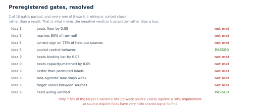
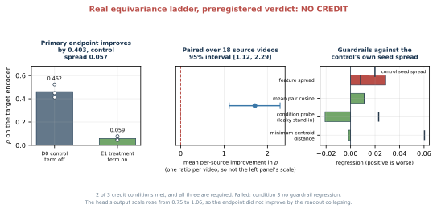

# S-JEPA gait paper package

This folder now reflects the completed augmented-normal real run. The paper, long tutorial, generated figures, and PDFs use the same final checkpoint and the same leakage-aware interpretation.

## Loss and logging terminology

All maintained documents use the following meanings:

- **VICReg** is only the label-free invariance, variance-hinge, and covariance regularizer computed on projected student features.
- **Group loss** is a separate label-aware term equal to within-condition compactness plus a centroid-margin penalty in Stages 1 through 4.
- The notebook's abbreviated `group` log field is only the centroid-margin penalty, not the complete group loss.
- The abbreviated `std` field is the mean feature standard deviation of unprojected EMA-teacher embeddings over the active corpus. It is a diagnostic, not a VICReg component and not a loss.

The plain-language loss derivation and numerical examples are in the root `README.md`, `progressive_training.md`, Section 8 of `staged_details.md`, Section 8 of `staged_evolution.md`, and Section 10 of `tutorials/sjepa_model_internals.md`. The three reflection-symmetry experiments and their distinct verdicts are taught step by step in Section 15 of `staged_details.md`.

Final checkpoint: `sjepa_curriculum_final_augmented.pt`

Experiment fingerprint:

```text
ea59fea055f0230bcf236deb1d1e8bbf08033766e7cd95a98f28210b3042c4e4
```

## Current files

- `staged_sjepa_gait.tex`: canonical IEEE-style staged manuscript
- `staged_sjepa_gait.pdf`: current 5-page compiled paper
- `staged_sjepa_gait.md`: readable paper with the same claims and results
- `staged_details.md`: illustrated step-by-step tutorial
- `staged_details.pdf`: compiled 27-page tutorial
- `staged_evolution.md`: extensive legacy-to-current methodology and result tutorial
- `tutorials/sjepa_model_internals.md`: illustrated class and tensor-flow reference for the S-JEPA implementation
- `progressive_training.md`: detailed training and checkpoint contract
- `result_history.csv`: machine-readable previous and current result ledger for the classifier lanes
- `symmetry_verdicts.csv`: machine-readable companion ledger carrying the three preregistered reflection-symmetry verdicts
- `refresh_result_history.py`: regenerates both ledgers from the artifact bundles, with a `--check` mode for continuous integration
- `references.bib`: authoritative primary and methods references
- `figures/`: current PDF, SVG, and PNG figures
- `make_figures.py`: artifact-bound figure generator
- `make_evolution_figures.py`: artifact-bound generator for 12 evolution figure sets
- `make_symmetry_figures.py`: artifact-bound generator for the Idea 5, Idea 9 arm 1, and Idea 9 arm 2 figures
- `paper_pdf_layout.lua`: table layout rules for the tutorial PDF

## Latest-change ledger

This table preserves the earlier results and explains what each revision changed.

|Revision|What changed|Impact on the S-JEPA model|Previous result|Current result|
|---|---|---|---|---|
|Legacy to completed curriculum|The normal-only experiment with 10 eligible landmark identities was replaced by the five-stage model with 12 eligible landmark identities, augmented normal data, VICReg, balanced replay, and post-Stage-0 group loss.|This is a different trained model. The current checkpoint has a new architecture contract, training corpus, objective, and fingerprint.|Exact exp5: 0.619 accuracy and 0.613 macro-F1.|Exact exp5: 0.857 accuracy, 0.891 balanced accuracy, and 0.881 macro-F1. The split remains video-confounded and encoder-exposed.|
|First Lane C to corrected Lane C|The five-class grouped readout changed from five ordinary group folds to two stratified group folds with all five labels on both sides and a fixed macro-F1 label list.|No model change. The final checkpoint and all 384-dimensional embeddings are identical. Only the downstream evaluation changed.|Five-fold mean: 0.604 accuracy, 0.595 balanced accuracy, and 0.407 macro-F1. One training fold had no cerebral-palsy example.|Two-fold mean: 0.614 accuracy, 0.615 balanced accuracy, and 0.615 macro-F1. Pooled OOF: 0.616, 0.613, and 0.610.|
|Augmented-normal selection contract|Notebooks 04 and 06 now accept candidates from the extraction report when neurologic-landmark coverage is at least 0.45.|No change to the saved checkpoint. The completed run already used the same 63 accepted rows. Future reruns are now reproducible instead of depending on files present in a folder.|64 candidates were recorded, but the reason for using 63 was not consistently enforced by every consumer.|64 candidates are audited, 63 are accepted, and one 0.027-coverage candidate is rejected by an explicit shared rule.|
|Mask explanation correction|Documentation now states that 0.60 is applied to the smallest eligible-token count in each batch.|No code or weight change. This documents the rule the trained model already used.|Earlier prose could be read as exactly 60% per sample.|Realized mean eligible fractions are reported as 0.549 at Stage 0 and 0.421 at Stage 4.|
|Interpretation update|The paper now separates non-collapse evidence from class-separation evidence.|No model change.|Earlier surfaces treated a successful run or classifier score as the main outcome.|The current conclusion records nonzero feature spread, normal-anchor drift to 0.617, and weak canonical silhouette 0.054 together.|

Read the previous and current columns as lineage history, not as an improvement ledger. The current row values come from the `ea59fea0` checkpoint; the previous values come from the superseded `d0acc262` checkpoint, which used the same configuration on a differently extracted pose cache.


## What the package says

The completed run used 159 sequences from 35 videos, trained for 600 epochs and 11,400 updates, and retained nonzero feature spread. Normal-anchor cosine fell to 0.617. The canonical 96-sequence cosine silhouette was 0.054, so the paper does not claim clean five-condition geometry.

All classifier results are labeled as descriptive. The all-96 and exact-exp5 lanes split sequences while sharing videos and prior encoder exposure. Lane C separates videos only at the Random Forest. Its corrected five-class audit uses two stratified group folds because Parkinson's disease and cerebral palsy each have two source videos. The encoder still saw all 159 rows.

## Core result figures

### Training health

Feature spread remained nonzero, while the normal reference moved substantially during later stages.


### Canonical representation geometry

The canonical five-condition silhouette is 0.054, and the closest centroids are only 0.026 apart.


### Classifier readouts

The chart summarizes sequence-split readouts and grouped Random Forest stress tests. The black interval applies only to the five-fold binary task. The corrected two-fold five-class task intentionally has no interval.


### Claim boundary

The final diagram records which overlap remains in each evaluation lane.


### Reflection-symmetry investigations

Three experiments asked whether the representation encodes signed left-minus-right gait asymmetry. They returned three different preregistered verdicts, and the three verdicts do not mean the same thing:

|Experiment|What it changes|Endpoint|Preregistered verdict|
|---|---|---|---|
|Idea 5, `nb_05a`|nothing; reads out of the frozen encoder|ridge R-squared on a signed target|informative null|
|Idea 9 arm 1, `nb_09a`|the readout's shape only; the encoder stays frozen|ridge R-squared on a signed target|artifact, because a side-agnostic nuisance control fired|
|Idea 9 arm 2, `new_nb_09_00` through `new_nb_09_03`|the encoder itself, during the full curriculum|label-free mirror residual rho, where 0 is mirror equivariant and 4 is mirror blind|no credit|

**Idea 5's informative null** means the measurement was valid and the answer was no: the treatment lane scored -0.602 against an untrained-encoder floor of -0.156, so a signed laterality axis is not linearly decodable out of the frozen vector on this cohort.

**Idea 9 arm 1's artifact** means the measurement is not admissible evidence about sides at all, which is a weaker epistemic state than a null rather than a stronger one. A lane that is mathematically blind to left and right scored -0.066 against the antisymmetric treatment's -0.206, and the head's wiring was verified at a swap slope of -1.000, so this is not an implementation bug.


The most useful result of those two is a fact about the cohort rather than the encoder, and it was measured by Idea 9 arm 1 in `nb_09a`: only 7.5 percent of the signed-laterality target's variance lies between source videos, against a preregistered 30 percent, so source-disjoint folds over 18 videos hold out nearly all of the usable signal by construction. That single measurement explains Idea 5's null and arm 1's artifact at once, and it is why arm 2 abandoned R-squared for a label-free endpoint.



**Idea 9 arm 2's no credit** means the effect is real but uncredited. A label-free equivariance term cut rho from 0.462 to 0.059, about seven times the control's seed spread, with 18 of 18 source videos improving and the measured mirror slope moving from -0.648 to -0.937; the head's output scale grew rather than shrinking, which rules out the degenerate solution its own synthetic fixtures had exposed. The preregistered rule required all three of its conditions, and feature spread fell by more than three times the control's seed spread. That failure is not independent of the effect, because a term asking the encoder to respond identically to a body and its reflection is also a term that removes variance, so variance loss is a competing explanation for the endpoint gain. The ladder ran 3 seeds against 5 registered, and the grouped five-class guardrail was not evaluable.



In all three the informative element is a control rather than the treatment, which is why each is reported with its full ladder. None of the three licenses a clinical claim, a statement about unseen videos, or an equation of rho with performance; every score in this family is transductive. The three verdicts and their decisive controls are also carried machine-readably in `symmetry_verdicts.csv`, and Section 16b of `staged_evolution.md` works through what each verdict does and does not license.

## Rebuild figures

From the repository root:

```sh
MPLCONFIGDIR=cache/matplotlib .venv/bin/python docs/make_figures.py
MPLCONFIGDIR=cache/matplotlib .venv/bin/python docs/make_evolution_figures.py
MPLCONFIGDIR=cache/matplotlib .venv/bin/python docs/make_symmetry_figures.py
```

The generators read `classifier_contract.json`, resolve the matching checkpoint variant, and refuse an incomplete or mixed-fingerprint curriculum. They write each figure as PDF, SVG, and PNG. The evolution generator also validates the five checkpoint stages, class reports, result ledger, and saved geometry. The symmetry generator additionally refuses any probe bundle whose fingerprint does not match the current contract, and it draws only those equivariance rungs that completed the full 11,400-update curriculum.

## Refresh the result ledgers

```sh
MPLCONFIGDIR=cache/matplotlib .venv/bin/python docs/refresh_result_history.py
MPLCONFIGDIR=cache/matplotlib .venv/bin/python docs/refresh_result_history.py --check
```

The first form rewrites the current rows of `result_history.csv` and regenerates all three rows of `symmetry_verdicts.csv` from the artifact bundles, leaving every superseded row untouched. The second form writes nothing and exits nonzero if either file has drifted from the artifacts.

The symmetry verdicts live in a companion file rather than in `result_history.csv` because that ledger's three numeric columns are classifier accuracy, balanced accuracy, and macro-F1, while a symmetry result is a preregistered verdict over a ridge R-squared or a mirror residual. Recording an R-squared of -0.602 in a column named accuracy would corrupt every consumer that reads it.

## Build the paper

From `docs/`:

```sh
tectonic staged_sjepa_gait.tex
```

The current result is five US-letter pages. The source uses the IEEE conference class and current vector figures.

## Build the tutorial PDF

From `docs/`:

```sh
pandoc staged_details.md --from=markdown --standalone --toc \
  --resource-path=.:.. \
  --lua-filter=paper_pdf_layout.lua --pdf-engine=tectonic \
  -V papersize=letter -V geometry:margin=0.65in -V fontsize=10pt \
  -M title="Detailed tutorial: normal-first S-JEPA for gait" \
  -o staged_details.pdf
```

## Checks completed

- paper compiles to 5 pages, at the five-page maximum;
- tutorial compiles to 27 pages with vector illustrations, the expanded VICReg, group-loss, and feature-spread explanation, and the new step-by-step treatment of all three reflection-symmetry experiments;
- the three symmetry investigations report their three distinct preregistered verdicts, including the guardrail that was not evaluable, the one that failed, and the 3 seeds run against 5 registered, and every symmetry number in the prose is drawn from the bundles the figures read;
- `refresh_result_history.py --check` reports that `result_history.csv` and `symmetry_verdicts.csv` both agree with the artifact bundles;
- every image referenced by the documentation and the slides resolves to a file in the tree;
- citations resolve in the TeX paper;
- the paper and tutorial contain the corrected Lane C values;
- the legacy 10-keypoint and first Lane C values are preserved only in the change ledger and are not presented as current results;
- all current S-JEPA readouts disclose source overlap and encoder exposure;
- no em dash characters remain in the maintained documentation and notebook sources.

## Checks still requiring the authors

1. Confirm author names, order, affiliation, email, student eligibility, and mentor role.
2. Confirm funding, acknowledgments, and data-use statements.
3. Inspect the final PDF at print size.
4. Confirm the current publication template and submission rules before uploading.
5. Do not describe any current classifier score as clinical validation or unseen-video performance.
