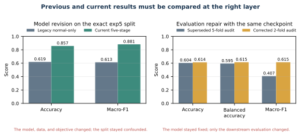
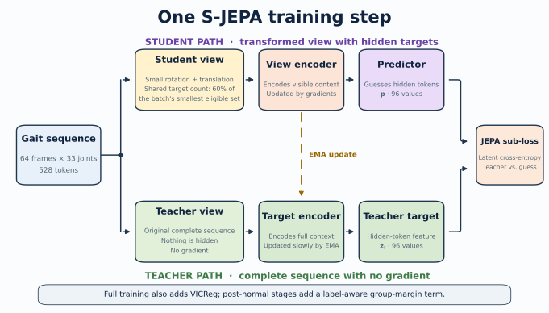
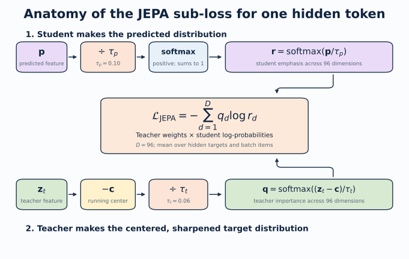

# Detailed tutorial: normal-first S-JEPA for gait

This tutorial explains the complete experiment in simple terms. It follows the saved real outputs from notebooks 01 through 06, and then the three reflection-symmetry follow-up experiments in Section 15. It also explains the limits that matter when reading the results.

The main finding is balanced. The completed representation did not totally collapse, and a shallow classifier can recover substantial label structure inside the known corpus. However, the canonical five-condition geometry is weak, normal features drift during later stages, and no current score measures performance on unseen videos or patients.

## 0. What changed, and what did not

Several recent changes affect different layers of the project. Some changed the trained model. Others changed only the evaluation, reproducibility contract, or explanation. Keeping those layers separate prevents an evaluation repair from looking like a model improvement.

### Change timeline

|Version|Model or evaluation state|Accuracy|Balanced accuracy|Macro-F1|What the number means|
|---|---|---:|---:|---:|---|
|Legacy S-JEPA|Normal-only, 10 eligible targets, exact exp5 split|0.619|not saved|0.613|Obsolete model on a video-confounded split|
|Current staged S-JEPA, Lane A2|Five-stage model with 12 eligible landmark identities, same exact exp5 split|0.857|0.891|0.881|Current model on the same confounded comparison lane|
|Current staged S-JEPA, Lane A1|All 96 canonical rows, stratified 67/29 sequence split|0.759|0.849|0.803|Current model inside an already-seen, video-confounded corpus|
|Lane C version 1|Five ordinary video-grouped Random Forest folds|0.604 mean|0.595 mean|0.407 mean|Superseded evaluation; one training fold lacked cerebral palsy and fold label sets differed|
|Lane C version 2|Two stratified video-grouped Random Forest folds|0.614 mean|0.615 mean|0.615 mean|Corrected classifier-level grouped stress test with all five labels in every fold|
|Lane C version 2 pooled OOF|All predictions from the two corrected folds pooled once|0.616|0.613|0.610|Corrected pooled stress-test summary; encoder exposure is still 159 of 159|

{width=96%}

Every number in that table comes from the current `ea59fea0` lineage. An earlier lineage, fingerprint `d0acc262`, reported different values for the same lanes and is preserved as superseded rows in `result_history.csv`.

### Impact on the trained model

The move from the legacy normal-only experiment to the current five-stage curriculum changed the model itself. The current run permits target tokens only from 12 landmark identities and uses 159 training sequences, VICReg, balanced replay, and a label-aware group term after Stage 0. Its final experiment fingerprint is `ea59fea055f0230bcf236deb1d1e8bbf08033766e7cd95a98f28210b3042c4e4`.

### The re-run that produced the current lineage

The `d0acc262` and `ea59fea0` contracts were compared field by field. The cohort is identical: the same 67/29 and 47/21 sequence identifiers, the same 12-landmark target whitelist, the same five-stage ladder with the same epoch and update counts, and the same loss settings. Two things did change. The pose cache was re-extracted rather than reused from the earlier working directory, which moved frame coverage on 4 of 96 sequences and neurologic-landmark coverage on 25 of 96, by 0.003 on average and by as much as 0.18 on one sequence. The curriculum was then retrained from scratch, producing new weights and new embeddings.

That combination matters for how the table should be read. Because no deliberate design change separates the two lineages, the metric movement between them is a re-run effect. It did not move in one direction: Lane A2 accuracy rose from 0.714 to 0.857, while Lane A1 fell from 0.793 to 0.759, grouped normal-versus-abnormal fell from 0.849 to 0.780, and the grouped five-class mean fell from 0.653 to 0.614. Test folds here hold 21 to 29 sequences, so a single reclassified sequence shifts accuracy by three to five points. Mixed-direction swings of this size under an unchanged configuration are the expected behavior of a small cohort, and they set a floor on how precisely any of these scores can be quoted. Differences smaller than roughly five points between two lanes or two lineages should not be read as evidence about the method.

The latest Lane C correction did **not** retrain S-JEPA. It used the same final checkpoint and the same saved 384-dimensional embeddings. The higher corrected macro-F1 does not show that the model improved. It shows that the evaluation now keeps all five labels in every fold and calculates macro-F1 over one fixed label list.

The new augmented-normal selection rule also did not change the saved model. The completed run already used the same 63 pose files. The rule now explains and reproduces that choice: one of 64 candidates is rejected because its neurologic-landmark coverage is 0.027, below the 0.45 threshold.

The mask-ratio wording correction did not change the code or weights. It records the batch-minimum rule that training already used. The realized mean eligible fractions were 0.549 at Stage 0 and 0.421 at Stage 4, not a guaranteed 0.60 for every sample.

## 1. Start with the research question

Walking changes over time. A useful motion representation should summarize that change without merely memorizing the background, camera, crop, person, or pose-detector failures.

The experiment asks:

> Can a small Skeleton Joint-Embedding Predictive Architecture first learn from normal walking, then continue through four condition stages while retaining a useful, non-collapsed representation?

It does not ask whether the system can diagnose a health condition. The folder labels are dataset annotations. The added normal clips are not independently clinically verified.

## 2. What is a representation?

A representation is a list of numbers that summarizes an input. A raw video has millions of pixel values. A pose sequence is smaller, but 64 frames times 33 joints times 3 coordinates is still a large object. The encoder turns that object into features that a later task can use.

Good features should change when meaningful motion changes. They should be less sensitive to irrelevant changes. In a small video dataset, this goal is hard because nuisance signals can be easier to learn than gait.

{width=96%}

## 3. What JEPA changes

Many reconstruction models predict pixels or coordinates. A Joint-Embedding Predictive Architecture, or JEPA, predicts a hidden feature in latent space instead. The target is contextual. It can describe how a hidden joint-time token fits the complete motion rather than reproducing every raw measurement.

This experiment follows the S-JEPA idea from Abdelfattah and Alahi [1]. It has three main parts:

1. The **view encoder** sees only the visible tokens.
2. The **predictor** receives visible features plus learned mask tokens and estimates hidden features.
3. The **target encoder** sees the complete sequence and supplies the target features.

The target encoder receives no gradient. After each optimizer update, it moves a small step toward the view encoder through an exponential moving average, or EMA. This slowly changing teacher is a standard JEPA design idea [1, 2].

{width=96%}

## 4. Turn a pose sequence into tokens

MediaPipe Pose Landmarker estimates 33 landmarks per frame [3, 4]. Each saved pose row contains `x`, `y`, relative `z`, and visibility. Relative monocular depth is not calibrated 3D ground truth.

Notebook 04 prepares each sequence in six steps:

1. A joint is valid when visibility is at least 0.45.
2. Internal coordinate gaps of at most four frames are interpolated.
3. The original validity mask is retained, even when coordinates are interpolated.
4. Coordinates are centered at the pelvis and divided by a shoulder-and-hip width scale.
5. The sequence is resized to 64 frames.
6. Four adjacent frames from one joint form one token.

There are 16 time patches and 33 joints, so one sequence has 528 possible joint-time tokens.

## 5. Restrict which tokens may be hidden

The original S-JEPA paper uses motion-aware masking [1]. This project intentionally does not. It uses one fixed whitelist:

```python
MASK_KEYPOINTS = [11, 12, 23, 24, 25, 26, 27, 28, 29, 30, 31, 32]
```

These indices are the left and right shoulders, hips, knees, ankles, heels, and foot indices. They were expanded and de-duplicated from the project mapping file. This whitelist is a design rule, not a validated medical biomarker.

All 33 joints may remain visible context. Only the 12 listed joints may become hidden JEPA targets.

{width=78%}

### The exact 0.60 mask rule

It would be inaccurate to say that every sample hides exactly 60% of its valid eligible tokens. The code needs the same number of targets for every sample in a batch, so it uses this rule:

1. Count valid eligible tokens in every sample.
2. Find the smallest count in the batch.
3. Multiply that minimum by 0.60 and round down.
4. Leave at least one eligible token visible.
5. Draw that common count uniformly without replacement for every sample.

A sample with more valid tokens therefore hides less than 60% of its own eligible set. The realized mean eligible fraction was 0.551 at the end of Stage 0 and 0.423 at the end of Stage 4. The sampler never uses position, displacement, velocity, acceleration, or any learned motion score.

## 6. Understand the two data layers

The canonical experiment is a fixed 96-sequence subset of GAVD [5]. Notebook 01 traces each sequence to its source video.

|Canonical condition|Sequences|Source videos|
|---|---:|---:|
|Normal|12|1|
|Parkinson's|9|2|
|Stroke|12|3|
|Myopathic|47|10|
|Cerebral palsy|16|2|
|Total|96|18|

Normal gait has only one canonical source video. To reduce this extreme source concentration during training, the project added self-annotated normal windows from 17 other YouTube videos. Automatic MediaPipe bounding boxes were used for these windows.

|Training layer|Sequences|Videos|
|---|---:|---:|
|Canonical GAVD|96|18|
|Added normal candidates|64|17|
|Accepted added normal|63|17|
|Complete training corpus|159|35|

One candidate had neurologic-landmark coverage of 0.027 and failed the minimum threshold of 0.45. The 63 accepted rows have their own provenance and extraction path. They must not be described as canonical GAVD rows.

<div class="pdf-page-break"></div>

{width=96%}

### Why provenance can become a shortcut

Sixty-three of 75 normal training rows use the added extraction path. All 84 abnormal rows use the canonical path. A classifier can therefore associate bounding-box style, camera style, or detector behavior with the normal-versus-abnormal label. The missingness control and provenance audit help expose this risk, but they cannot remove it.

## 7. Train normal first

Stage 0 starts with fresh weights. It uses 75 normal sequences from 18 videos: 12 canonical rows plus 63 accepted added rows. The group loss is zero because there is only one active label.

After 300 epochs and 5,700 optimizer updates, the notebook saves `sjepa_normal_augmented.pt`. This state becomes the normal anchor.

The later stages continue the same model:

|Stage|New condition|Active sequences|Epochs|Updates|
|---:|---|---:|---:|---:|
|0|Normal|75|300|5,700|
|1|Parkinson's|84|75|1,425|
|2|Stroke|96|75|1,425|
|3|Myopathic|143|75|1,425|
|4|Cerebral palsy|159|75|1,425|

Each later batch draws equally from the active conditions. This is balanced replay. It keeps earlier groups in the optimizer stream, but it does not guarantee that their representation will remain unchanged.

The final artifact is `sjepa_curriculum_final_augmented.pt`. Its experiment fingerprint is:

```text
ea59fea055f0230bcf236deb1d1e8bbf08033766e7cd95a98f28210b3042c4e4
```

## 8. Give each loss one job

The total objective is

$$
L = L_{JEPA} + 0.05L_{VICReg} + 0.25L_{group}.
$$

### 8.1 JEPA latent prediction

At an allowed hidden position, the centered and sharpened teacher distribution is (q), and the predictor distribution is (r). The latent cross-entropy is:

$$
L_{JEPA} = -\sum_d q_d \log r_d.
$$

Only valid, authorized hidden positions contribute.

{width=96%}

### 8.2 VICReg anti-collapse terms

Two geometric views of the same sequence pass through the view encoder. Valid authorized features are pooled and projected. VICReg then applies three ideas [6]:

- **Invariance:** paired views of the same sequence should agree. The implementation uses mean squared error between the two projected vectors.
- **Variance:** each projected feature dimension should keep enough spread. For each view, the implementation measures population standard deviation across the batch and applies `max(0, 1 - standard deviation)`. A dimension at or above 1 has no variance penalty; a dimension with standard deviation 0.7 contributes a shortfall of 0.3.
- **Covariance:** different projected dimensions should avoid repeating the same changing signal. The implementation centers each view, constructs its feature covariance matrix, squares the off-diagonal entries, and averages them. The covariance diagonal is excluded because it describes a feature's own variance rather than redundancy between different features.

The implemented inner expression is:

$$
L_{VICReg}=25L_{inv}+25L_{var}+L_{cov}.
$$

The logged `VICReg` number is this inner expression averaged across the epoch. The optimizer then multiplies it by the outer weight 0.05. VICReg uses projected features from two trainable-student views. It can resist a constant or highly redundant representation, but it does not read folder labels and does not directly ask health-condition groups to separate.

The commonly printed `std` value is not the VICReg variance term. After an epoch, the code runs the whole active corpus through the EMA target encoder, pools valid authorized tokens without the VICReg projector, computes the population standard deviation of each feature dimension, and averages those standard deviations. This is a read-only representation-health diagnostic. A nonzero value is evidence against total collapse; it has no required target of 1 and cannot establish that the variation represents gait rather than nuisance information.

### 8.3 Label-aware group pressure

After Stage 0, the model also receives condition labels. This calculation uses the unprojected pooled student vector from the first geometric view. Each sequence vector is scaled to unit length. Vectors with the same condition label are averaged to form a condition centroid, and that centroid is normalized again.

The group objective has two parts. Compactness is the mean squared distance from a normalized sequence vector to its own normalized condition centroid. Separation considers every centroid pair. For pair distance $d_{ij}$ and margin 1.0, it applies:

$$
L_{sep}
=
\operatorname{mean}_{i<j}
\left[\max(0,1-d_{ij})\right]^2.
$$

A pair at distance 1.2 contributes 0, 0.9 contributes 0.01, and 0.5 contributes 0.25. Since unit-vector distances range from 0 to 2, margin 1.0 corresponds to at least a 60-degree angle, or cosine similarity no greater than 0.5, between centroid directions. The complete optimized term is:

$$
L_{group}=L_{compact}+L_{sep}.
$$

The abbreviated training printout is potentially confusing: `group` reports only $L_{sep}$, not $L_{group}$. The printed value is averaged across condition pairs and balanced batches, so it cannot be inverted into one exact centroid distance. A small number means batch centroid pairs usually met or nearly met the margin. It does not mean every sequence is well classified.

This is supervised information. It is correct to call the first stage label-free representation learning. It is not correct to call the complete five-stage curriculum label-free.

### 8.4 Read one abbreviated training line

For

```text
JEPA 0.5337  VICReg 13.0367  group 0.0008  std 0.4134
```

- `JEPA` and `VICReg` are epoch means of optimizer-batch losses before their outer combination.
- `group 0.0008` is the epoch-mean centroid separation penalty only. Optimization also includes compactness and multiplies their sum by 0.25.
- `std 0.4134` is one post-epoch whole-corpus EMA-teacher diagnostic. It is neither a loss nor a VICReg projector statistic.

These values have different definitions and scales. They should be trended against their own histories, not compared to one another as if the smallest number were automatically the least important term.

### 8.5 An optional fourth term, added by a later experiment

The three terms above are the complete objective of the checkpoint this tutorial reports. One later experiment, Idea 9 arm 2, added a fourth, label-free term that asks the encoder to respect the **anatomical mirror**, meaning the operation that reflects the body horizontally and swaps every left landmark identity with its right counterpart. Three facts belong here in the loss inventory. The full walkthrough, including the flaw the first version of this term contained, its repair, and its preregistered verdict, is Section 15.

1. **The term is not in this lineage.** The `ea59fea0` checkpoint optimizes JEPA plus 0.05 VICReg plus 0.25 group and nothing else. No other number in this tutorial is affected by the fourth term.
2. **The term is label-free, like VICReg and unlike the group loss.** It compares a sequence with a mirrored copy of itself, so it needs no folder label. It is nevertheless not a VICReg component: VICReg asks two ordinary geometric views of a sequence to agree, whereas this term asks a mirrored view to produce the *negated* readout.
3. **Its only weight ever used on real data was 0.02**, added on top of the same three terms, and the same experiment re-ran the identical curriculum at weight 0.0 as its own control. Section 15.7 gives both rungs.

## 9. Read training health without overclaiming

The endpoint table is:

|Stage|JEPA|VICReg|Feature std|Pair cosine|Minimum training centroid distance|Normal anchor|
|---:|---:|---:|---:|---:|---:|---:|
|0|0.526|16.990|0.445|0.417|not applicable|reference|
|1|0.534|13.037|0.413|0.509|0.610|0.959|
|2|0.673|10.584|0.379|0.632|0.470|0.849|
|3|0.597|9.472|0.360|0.678|0.323|0.729|
|4|0.487|8.312|0.363|0.660|0.259|0.617|

{width=96%}

These values support three conclusions:

1. Training stayed finite and all stages completed.
2. Feature spread remained nonzero, which is evidence against total collapse.
3. Normal-anchor cosine fell to 0.617, which shows substantial drift.

The final centroid-margin penalty was not zero, so the requested margin was not fully satisfied. A finite loss and a non-collapsed vector are necessary checks. They are not proof of clinical structure.

## 10. Inspect the frozen representation before classifying

Notebook 05 performs a four-sequence hidden-token spot check. It found mean target-prediction cosine 0.553 with standard deviation 0.109 across 114 masked tokens per sequence. This is a small diagnostic sample, not a whole-corpus performance estimate.

For every canonical sequence, notebook 05 creates a 384-dimensional pooled vector:

- 96 global means;
- 96 global standard deviations;
- 96 authorized-landmark means;
- 96 authorized-landmark standard deviations.

It then compares within-condition distances, centroid distances, and the silhouette coefficient. The silhouette compares how close a sample is to its own group with how close it is to the nearest other group [7]. A value near one suggests clear separation. A value near zero suggests overlapping boundaries. A negative value suggests that many samples are closer to another group.

The canonical-96 results are:

|Geometry measure|Value|
|---|---:|
|Cosine silhouette|0.054398|
|Minimum centroid distance|0.025675|
|Mean centroid distance|0.313160|
|Mean within-condition distance|0.104404|

The closest centroids are myopathic and cerebral palsy. Their distance, 0.0257, is much smaller than the mean within-condition distance, 0.1044. This is weak group geometry.

{width=84%}

The Stage 4 training centroid distance and the notebook 05 centroid distance are not the same statistic. The first is a Euclidean training diagnostic over the 159 active sequences. The second is a cosine audit over 384-dimensional pooled vectors from the canonical 96. They should not be compared numerically.

## 11. Learn what a Random Forest readout does

A readout asks whether information is accessible in frozen features. Notebook 06 standardizes the embedding and fits a Random Forest with 100 trees, maximum depth 5, square-root feature sampling, balanced class weights, and seed 42 [8, 9].

The classifier does not update the encoder. That makes it a frozen-feature probe. However, the encoder already learned from the evaluated rows and, after Stage 0, their condition labels. Freezing now does not undo that exposure.

### Three metrics

- **Accuracy** is the fraction of all test rows predicted correctly.
- **Balanced accuracy** calculates recall for each class and gives every class equal weight [10].
- **Macro-F1** calculates one F1 score per class and averages them equally. It reflects both missed examples and false alarms.

Always inspect the confusion matrix and class support beside these summaries.

## 12. “All-96 stratified” step by step

The artifact name is `all_96_stratified_video_confounded`. Each word carries information.

### Step 1: all 96 canonical rows enter the split

A row is one annotated sequence, not one frame, one whole source video, or necessarily one independent person.

### Step 2: stratification preserves class proportions

The code requests a reproducible 70/30 sequence split with `random_state=42`. Stratification asks the split to keep every condition in both subsets and to preserve the class fractions as closely as integer counts allow.

|Condition|All|Classifier train|Classifier test|
|---|---:|---:|---:|
|Normal|12|8|4|
|Parkinson's|9|6|3|
|Stroke|12|9|3|
|Myopathic|47|33|14|
|Cerebral palsy|16|11|5|
|Total|96|67|29|

Why do this? A plain random draw could place too few of the nine Parkinson's rows in the test set. Then the score could change mainly because the class mix changed. Stratification reduces that particular problem.

### Step 3: fit only the classifier on 67 rows

The scaler estimates its mean and standard deviation from the 67 classifier-training embeddings. The Random Forest also fits on those 67 rows. It predicts the other 29 rows.

### Step 4: compare with a missingness-only control

The control sees 33 per-joint and 64 per-frame visibility fractions, for 97 features. It receives no gait coordinates. If this control performs well, pose-detector success and failure carry label information.

### Step 5: audit two kinds of exposure

The split is sequence-level, not video-level. All 16 source videos in the classifier test set also occur in classifier training. In addition, all 29 classifier test rows were used during representation training.

{width=98%}

### Step 6: read the score at the correct scope

|All-96 readout|Accuracy|Balanced accuracy|Macro-F1|
|---|---:|---:|---:|
|S-JEPA frozen vector|0.759|0.849|0.803|
|Missingness only|0.483|0.507|0.477|

The S-JEPA result is above the visibility-only control. This means the frozen vector contains label-related structure beyond the saved visibility fractions on this split. It does not tell us whether that structure is gait, person identity, source-video style, extraction style, or a mixture.

The result can answer:

> Can a shallow classifier recover dataset labels from the final features inside this already-seen corpus?

It cannot answer:

> How accurate is the system on a new video or patient?

Stratification fixes class-balance sampling. It does not fix dependence.

## 13. The exact exp5 comparison

Lane A2 reproduces a historical 68-sequence subset and its fixed 47/21 split.

|System|Accuracy|Balanced accuracy|Macro-F1|
|---|---:|---:|---:|
|Staged S-JEPA|0.857|0.891|0.881|
|Historical 82-feature Random Forest|0.762|not saved|0.728|
|Missingness only|0.286|0.270|0.277|

The S-JEPA result is above the historical feature system on both accuracy and macro-F1, by about ten and fifteen points. Two cautions apply. The lane holds 21 test sequences, so that gap is roughly two or three reclassified sequences, and the same recipe re-run on a re-extracted pose cache previously scored 0.714 here. This is a system comparison, not a controlled representation ablation. The pose extraction and features differ. All 9 test videos overlap classifier training, and all 21 test rows trained the encoder.

## 14. Lane C: useful stress test, not generalization

Lane C combines the canonical and added normal embeddings. The binary task uses five GroupKFold splits. The corrected five-class task uses two StratifiedGroupKFold splits. In both cases, one source video cannot appear in both classifier training and testing within a fold [11].

The encoder was still trained once on all 159 sequences. Every held-out classifier row had already influenced the representation. The correct description is **classifier-video-disjoint, encoder-transductive**.

|Lane C task|Mean accuracy|Mean balanced accuracy|Mean macro-F1|Mean ROC AUC|
|---|---:|---:|---:|---:|
|Normal versus abnormal|0.780|0.804|0.749|0.915|
|Five classes, two-fold mean|0.614|0.615|0.615|not applicable|

For the five-fold binary task only, notebook 06 shows percentile bootstrap ranges over the five fold scores. Five related fold scores do not justify a strong population confidence claim [12]. The corrected five-class task has only two folds and intentionally reports no interval.

The binary task may also benefit from provenance differences between the added normal rows and canonical abnormal rows.

An audit found that the earlier five-fold version was invalid as a stable five-class summary. One training fold had no cerebral palsy example, and macro-F1 used different label sets across folds. Notebook 06 now uses two stratified video-group folds, the largest possible count when Parkinson's and cerebral palsy each have two videos. Every train and test fold contains all five labels, and macro-F1 uses a fixed label order. The pooled out-of-fold accuracy is 0.616, balanced accuracy is 0.613, and macro-F1 is 0.610. This repairs the metric definition, but two folds and full encoder exposure still make it a stress test rather than a generalization estimate.

{width=96%}

{width=96%}

<div class="pdf-page-break"></div>

## 15. Reflection symmetry: three experiments, three verdicts

Sections 10 through 14 asked what a classifier can recover from the frozen representation. Three follow-up experiments asked a narrower question about the same checkpoint, and they deserve a full walkthrough because they returned three *different* negative verdicts whose meanings are not interchangeable. Collapsing them into one flat "it did not work" throws away almost all of the information they produced.

All three share the evaluation cohort used everywhere else in this tutorial: the 96 canonical sequences from 18 source videos, with 16 cerebral palsy, 47 myopathic, 12 normal, 9 Parkinson's, and 12 stroke sequences. All three read the same checkpoint, fingerprint `ea59fea0`. Every score below is transductive, because the encoder saw every evaluated sequence during training. The source video, not the sequence, is the independent unit of evidence.

### 15.1 Step 0: define the question, then define the three verdict words

**What we ask.** Does the learned representation encode signed left-minus-right gait asymmetry, and can that be demonstrated rather than assumed?

**Define the vocabulary before using it.**

- **Laterality**, here, is a *signed* left-minus-right quantity. Its sign says which side is affected, and zero means the two sides behave alike. A signed quantity is strictly harder to recover than the *unsigned* magnitude of asymmetry, because a readout that reports "this walk is asymmetric" without saying which side is asymmetric is side-blind and satisfies nothing we are asking for.
- The **anatomical mirror**, written $M$, reflects the body horizontally and swaps every left landmark identity with its right counterpart. Under $M$ a left-side deficit becomes the same deficit on the right. Any honest signed laterality readout must therefore change sign when its input is mirrored.
- A **source-disjoint fold** puts every sequence from one source video entirely on one side of the split, so no video contributes rows to both the fitting and scoring halves of a fold.
- $R^2$ is the fraction of target variance explained. A value of 1 is exact recovery, 0 means no better than predicting the fold mean, and a *negative* value means worse than predicting the fold mean.
- A **preregistered gate** is a pass or fail threshold fixed in writing before the numbers were seen. A **guardrail** is a registered side check that can withhold credit even when the headline endpoint moves in the desired direction.

**Why this matters procedurally.** Fixing gates in advance is what makes a negative result reportable. Without them, any of the three experiments below could have been rewritten after the fact into a positive story by choosing a different comparison.

**Define the three verdict words.** This is the single most important paragraph in Section 15, because the three experiments returned three different verdicts and the words are not synonyms.

|Verdict word|What actually happened|What you may say afterwards|
|---|---|---|
|**Informative null**|The measurement was valid, every control behaved, and the answer was no.|"We asked, and on this cohort under these gates the answer is no." The question is answered in the negative.|
|**Artifact**|The measurement is not admissible evidence about the quantity at all, because a control that *cannot see* the quantity scored higher than the treatment.|"We withdraw this lane. It does not answer the question either way." The question is *not* answered.|
|**No credit**|The effect is real, large, and consistent, but a preregistered guardrail failed, and that failure supplies a competing explanation for the effect.|"Something moved, and we cannot yet say it was the thing we wanted." The effect is measured but not attributed.|

Read the ordering carefully, because it is counterintuitive: **an artifact verdict is a weaker epistemic state than a null, not a stronger one.** A null tells you the answer. An artifact tells you that this particular instrument produced a number you must not interpret. And a no credit verdict is different from both: nothing there is broken, and the endpoint genuinely moved, but a rule written in advance says the movement has more than one available explanation, so it earns no claim.

|Experiment|What it changes|Endpoint|Verdict|
|---|---|---|---|
|Idea 5, `nb_05a`|nothing; reads out of the frozen encoder|ridge $R^2$ on a signed target|informative null|
|Idea 9 arm 1, `nb_09a`|the readout's shape only; encoder still frozen|ridge $R^2$ on a signed target|artifact, side-agnostic control fired|
|Idea 9 arm 2, `new_nb_09_00` to `new_nb_09_03`|the encoder itself, during the full curriculum|label-free mirror residual rho|no credit|

### 15.2 Step 1: read the quantity out of the frozen encoder (Idea 5, `nb_05a`)

**What we do.**

1. Freeze the trained encoder. Nothing is retrained in this step.
2. Build a signed left-minus-right laterality target. The target is a function of the pose coordinates themselves, which matters for the interpretation of lane B below.
3. Split the 96 sequences into 5 source-disjoint folds.
4. Fit ridge regression from the frozen token tensor to the target on the fitting half of each fold, and score $R^2$ on the held-out sources.
5. Separately, feed mirrored inputs through the same pipeline and regress the decoded scalar on its unmirrored value. The mirror counts as flipping the sign only if that slope lands in $[-1.25, -0.8]$.

**Why each lane exists.** Define every lane before reading any number, because in all three experiments the informative element turns out to be a control rather than the treatment.

- **Lane B, the raw-coordinate null.** Fit the same ridge from raw coordinates instead of features. Because the target is built from coordinates, lane B is a sanity check on the target and the pipeline, not a competitor. If lane B were low, the experiment would be broken and no other lane could be read.
- **Lane A, the treatment.** The frozen trained encoder's features. This is the only lane whose success would support the claim.
- **Lane C, the untrained-encoder floor.** The same architecture with untrained weights. Random projections of pose data carry some structure, so lane C is the score that training must beat before "the representation learned it" means anything.
- **Lane D, the side-agnostic pooled nuisance.** Only pooled mean and standard deviation features, which describe overall movement magnitude and carry no side identity. Lane D catches the failure mode where a score comes from "how much this person moves" rather than "which side".

**What we observe.**

|Lane|Role|$R^2$|MAE|
|---|---|---:|---:|
|B raw null|coordinate ceiling, pipeline check|1.000|0.00006|
|**A learned**|**treatment, frozen trained encoder**|**-0.602**|**2.473**|
|C floor|untrained-encoder floor|-0.156|2.019|
|D pooled|side-agnostic magnitude nuisance|-0.131|1.977|

Lane B is 0.9999999989 to ten digits, so the target is recoverable and the pipeline is sound. All three preregistered gates then fail:

1. **Beat the floor by at least 0.05 $R^2$.** Observed $A - C = -0.446$, and the gate needed at least $+0.05$. Not met.
2. **Reach at least 80 percent of the raw-coordinate null.** That threshold is 0.800 and lane A is negative. Not met.
3. **Decode the correct sign on at least 75 percent of held-out sources.** Observed sign consistency is 0.444, that is 44.4 percent, which is worse than a coin flip. Not met.

Two safeguards resolve as follows. The anatomical mirror slope is $-0.741$, which is outside $[-1.25, -0.8]$, so the decoded scalar does not flip cleanly. The lane D nuisance check passes, because that check asks only that the side-agnostic lane stay well below the raw-coordinate null, and lane D at $-0.131$ does. Passing that check is not reassurance about lane A, though: both controls outscored the treatment, lane C by 0.446 and lane D by 0.471.

**What we may conclude.** The verdict is an **informative null**. On this cohort and under these gates, the frozen representation does not make a signed laterality axis *linearly* available above a raw-coordinate baseline, and does not even reach an untrained-encoder floor. The measurement was valid and the answer was no.

**What we may not conclude.** This does not show that no side information exists anywhere in the representation, because only linear readouts were tested. It is not a clinical statement of any kind.

{width=96%}

**A note on Idea 5's second notebook.** `nb_05b_reflection_reach_and_futures` produces **no new empirical verdict about the checkpoint**. It is exactly two things: a possible-futures simulator that walks hypothetical numbers through the decision margins above, and an external multi-view reach scaffold for CASIA-B and OU-MVLP-Pose whose real loaders are still marked TODO. Its fixture is 18 synthetic clips, 6 subjects by 3 views, with a planted view-stability correlation near +1. Neither the simulated futures nor that planted correlation is a result, and neither may be quoted as one.

### 15.3 Step 2: fix the readout's shape (Idea 9 arm 1, `nb_09a`)

**The escape route this step closes.** Idea 5 could have failed for an uninteresting reason: perhaps a plain ridge is simply the wrong *shape* of readout for a signed quantity. A signed quantity ought to be read by a head that is antisymmetric by construction, so that swapping left and right landmark identities *necessarily* negates its output rather than merely being encouraged to.

**What we do.**

1. Keep the same frozen encoder and the same 5 source-disjoint folds. There is zero retraining here as well.
2. Replace the ridge with an antisymmetric-by-construction head of output dimension 4.
3. Verify the wiring before reading any score, by swapping the head's left and right inputs and regressing its output on the unswapped output. The slope must be exactly $-1$.
4. Add three more control lanes, and harden the gates.

**Why the gates change.** Arm 1's gates supersede Idea 5's 80-percent and 75-percent gates, because arm 1 knows more than Idea 5 did. Each gate exists to close one specific alternative explanation:

1. **Binding bar**, $A' - \max(D, C) \ge 0.05$. The treatment must beat its *strongest* control, not a control of its choosing.
2. **Beat floor**, $A' - C \ge 0.05$. As in Idea 5.
3. **Attribution**, $A' - A_c \ge 0.05$, where $A_c$ has the same capacity but no antisymmetry constraint. This isolates the antisymmetry itself from the extra capacity that came with it.
4. **Permutation null**, $p < 0.05$. Shuffle the targets and refit many times. If the real score sits inside the shuffled distribution, it is not evidence.
5. **Absolute nuisance**, $|E| < 0.05$, where lane E is mirror-symmetrized and therefore mathematically blind to left and right. If a side-blind lane scores well, the score is not about sides.
6. **Target quality**, between-source variance fraction of the target at least 0.30. Discussed as its own step in Section 15.4, because it turned out to be the most valuable measurement in the family.
7. **Wiring identity**, swap slope exactly $-1$. This separates a real negative result from an implementation bug.

**What we observe.**

|Lane|Role|$R^2$|MAE|
|---|---|---:|---:|
|B raw null|coordinate ceiling, pipeline check|1.000|0.00006|
|**A' antisymmetric**|**treatment, antisymmetric by construction**|**-0.206**|**2.054**|
|Ac capacity matched|same capacity, unconstrained|-0.184|2.006|
|C floor|untrained-encoder floor|-0.027|1.860|
|D standard|Idea 5 lane A, carried forward|-0.602|2.473|
|**E pooled**|**mirror-symmetrized, side-blind**|**-0.066**|**1.900**|

Gate by gate: the binding bar is $\max(D, C) = -0.027$, which is lane C, so gates 1 and 2 coincide here and both fail with a delta of $-0.179$. Gate 3's attribution delta $A' - A_c$ is $-0.022$, so removing the antisymmetry constraint made the lane slightly *better*, and that gate fails too. The permutation test over 200 shuffles gives $p = 0.970$ with null mean $-0.108$ and null 95th percentile $-0.025$, so the real score is deep inside the shuffled distribution and gate 4 fails. Lane E has $|E| = 0.066$, which is not below 0.05, so gate 5 fails. The target-quality gate fails, as Section 15.4 explains. The wiring identity **passes**, with swap slope $-1.0000000000000002$, and the anatomical mirror slope is $-0.223$, which does not flip.

**The decisive number.** The side-blind lane E outscored the antisymmetric treatment $A'$ by **0.140**. A lane that cannot tell left from right did better than the lane built specifically to read left from right.

**What we may conclude.** The verdict is **artifact, side-agnostic nuisance control fired**. The readout-shape objection is answered and rejected: constraining the head to be antisymmetric did not rescue the null. More importantly, the resulting score cannot be attributed to side information at all, because a control blind to sides scored higher. The wiring slope of exactly $-1$ proves the head really was antisymmetric, so this is not an implementation bug.

Notice what kind of statement that is. Unlike Idea 5, arm 1 does **not** answer the question in the negative. It withdraws its own lane as inadmissible. That is a weaker position than Idea 5's clean null, and the two must never be reported as the same outcome.

{width=96%}

### 15.4 Step 3: measure the cohort, which explains both earlier outcomes at once

**What we do.** Before blaming the encoder or the head, measure the target. Decompose the signed laterality target's variance into a part that differs between source videos and a part that differs within them. This is arm 1's gate 6, and it is measured in `nb_09a`.

**Why we do it.** Source-disjoint folds score on *held-out sources*. A model can only transfer what varies between sources. If almost all of the target's variance is within videos rather than between them, then source-disjoint folds hold out nearly all of the usable signal by construction, and the held-out $R^2$ is bounded low no matter how good the encoder or the readout is.

**What we observe.** The between-source variance fraction is **0.075**, that is 7.5 percent, against a preregistered requirement of **0.30**, that is 30 percent. The remaining roughly 92.5 percent of the target's variance lies within source videos.

**What we may conclude.** This single measurement explains Idea 5's null and arm 1's artifact simultaneously, and it does so without appealing to any property of the model. On this cohort and this target, a held-out-source $R^2$ cannot support a positive laterality claim. The binding constraint is the number of independent source videos, which is 18, and not the encoder and not the readout. It is also the reason the third experiment abandons $R^2$ as a primary endpoint and moves to a label-free one.

### 15.5 Step 4: train the symmetry in, and first define its endpoint (Idea 9 arm 2)

**The escape route this step closes.** Arm 1 could have failed because the encoder was never *asked* to respect the mirror. So arm 2 changes two things at once: it adds a label-free equivariance term to the encoder's own training, and it replaces $R^2$ with a label-free endpoint that sidesteps the failed target-quality gate entirely.

**What we do first, and why.** Define and calibrate the endpoint *before* training anything with it. The endpoint is a mirror residual, written **rho**:

$$
\rho = \frac{\operatorname{mean}_{seq}\left\|T(\text{enc}(Mx)) + T(\text{enc}(x))\right\|^2}{\operatorname{mean}_{seq}\tfrac{1}{2}\left(\left\|T(\text{enc}(x))\right\|^2 + \left\|T(\text{enc}(Mx))\right\|^2\right)}.
$$

Here $M$ is the anatomical mirror defined in Section 15.1 and $T$ is a fixed antisymmetric contraction with an identity feature map. Because $T$ has no fitted parameters and the expression uses no labels, rho can be measured on any encoder without training a probe first.

**Read the scale.** Rho runs from 0 to 4. **0 means an exact sign flip, that is perfect mirror equivariance, and is the best value. 2 means the two branches are unrelated. 4 means fully mirror-symmetric, that is completely mirror-blind, and is the worst value.** The one-half in the denominator is what places a fully symmetric encoder at 4 rather than at 2.

**Why the denominator is there at all.** It makes rho scale-invariant. Multiplying every feature by a constant leaves rho unchanged. Section 15.6 shows why that property is not a nicety but the difference between a working objective and a broken one.

**What we observe in calibration.** These readings come from encoders built to have known answers, so they are construction checks rather than gait results. An equivariant-by-construction encoder reads exactly **0.0**. A blind-by-construction encoder reads exactly **4.0**. A randomly initialised real encoder reads **3.858**, so an untrained real encoder starts near the mirror-blind end. Applying the mirror twice returns the original, with an involution gap of **0.0**.

**What we may conclude.** Rho behaves as designed at both endpoints, so a rho movement can be interpreted without reference to any label or target. Note carefully what rho is not: it is a symmetry property of the representation, not accuracy, not class separation, and not clinical value.

### 15.6 Step 5: validate the mechanism on fixtures, and discover the loss was broken

Everything in this step comes from **30 synthetic sequences over 30 epochs at weight 0.02**. These are **synthetic fixtures, not gait results**, and they must never be quoted as findings about the cohort. Their job is to test the machinery before spending the real training budget.

**Check 1: write down the no-op and prove it is a no-op.** The naive way to implement mirror equivariance is to swap the head's own tokens and penalize the result. For a head that is already antisymmetric, that quantity is identically zero by construction, so it trains nothing at all. We check it rather than assume it: wiring slope $-1.0000000000000007$, loss value **0.0**, gradient into the head **0.0**. Recording this is worthwhile because the no-op version looks entirely reasonable in code review and would have produced a silent null.

**Check 2: confirm the surviving forms actually reach the encoder.** A penalty that only moves head weights cannot teach the encoder anything. Gradient norms into the encoder are 0.522 for the absolute form, 6.120 for the normalized form, and 1.873 for the parameter-free form. The parameter-free form has gradient into the head of exactly 0 by construction, since it has no head parameters.

**Check 3 in this walkthrough is the bakeoff, and it is where the original loss fails.** The first implementation wrote the requirement literally, with a *trainable* readout $s$:

$$
L_{equiv}^{abs} = \operatorname{mean}\left[\left(s(\text{enc}(Mx)) + s(\text{enc}(x))\right)^2\right].
$$

**Why we distrusted it.** Because $s$ is trainable, the objective has a degenerate solution: shrink $\|s\|$ toward zero and the penalty falls without the encoder changing at all. To detect that, run each candidate form against a control at weight 0, and watch three quantities together: the term's own value, the head's output scale, and rho. The gate for "the term did something real" is 3 times the control's late-epoch standard deviation of rho, that is 3 times 0.0164, which gives **0.0492**.

|Rung|rho final|rho gain|Beats gate|Term fold cut|Head fold shrink|
|---|---:|---:|---|---:|---:|
|D0 control, weight 0|3.932|0.0|no|1.03|2.82|
|E1 absolute|3.922|**0.0096**|**no**|**184.16**|**4.77**|
|E1 normalized|3.848|0.084|yes|94.73|1.08|
|**E1 parameter-free**|**1.898**|**2.034**|**yes**|1.65|3.81|

**What we observe.** The absolute form cut its own loss by a factor of **184.16** while shrinking the head's output scale by a factor of **4.77**, and moved rho by only **0.0096** against a gate of **0.0492**. It satisfied itself by shrinking the readout instead of changing the encoder. This is the degenerate solution, caught on fixtures before it could waste a real training run.

**The repair.** Divide the residual by the mean squared norm of the two branches, which makes the term scale-invariant, so shrinking the head scales numerator and denominator together and buys nothing:

$$
L_{equiv} = \frac{\left\|s(\text{enc}(Mx)) + s(\text{enc}(x))\right\|^2}{\tfrac{1}{2}\left(\left\|s(\text{enc}(x))\right\|^2 + \left\|s(\text{enc}(Mx))\right\|^2\right) + \varepsilon}.
$$

The **parameter-free** variant is that same ratio with the trainable $s$ replaced by the fixed antisymmetric contraction $T$, so it has no head parameters left to shrink. It moved rho furthest on fixtures, the mechanism gate passed, and it is the variant carried into the real ladder.

**A limit on how far fixtures may be read.** The fixtures sit near rho 3.9, whereas the real control encoder later lands near 0.462. A toy encoder is mirror-blind by construction; the real encoder, trained on the actual curriculum with no equivariance term at all, already begins most of the way toward mirror-honest. Fixture magnitudes calibrate the metric. They do **not** forecast real effect sizes, and the mechanism notebook explicitly retracts any such reading.

{width=96%}

### 15.7 Step 6: run the real ladder on the full curriculum

**What we do.** Re-run the exact curriculum contract of Section 7 twice per seed, changing one number only.

1. **Rung D0** is the control, with equivariance weight 0.0.
2. **Rung E1** is the treatment, with equivariance weight 0.02, using the parameter-free variant selected in Section 15.6.
3. Each rung runs the full five-stage curriculum: width 96, depth 4, 300 epochs at Stage 0 plus 75 epochs at each of Stages 1 through 4, giving **600 epochs** and per-stage updates $[5700, 1425, 1425, 1425, 1425]$, which sum to **11,400 optimizer updates**. Device mps.
4. Repeat for seeds 0, 1, and 2. **3 seeds were run against 5 registered**, for the reason recorded in Section 15.8.

**Why a control rung at weight 0 rather than reusing the main checkpoint.** Because seed-to-seed variation is the yardstick the credit rule measures against. A single reference run cannot supply a spread, so the control has to be run at the same seeds under the same contract.

**What we observe.** Values are the evaluation-time recomputation, which is what the credit rule reads.

|Rung|Seed|rho target|rho view|Mirror slope|Head scale|Feature std|
|---|---:|---:|---:|---:|---:|---:|
|D0|0|0.413|0.572|-0.627|0.677|0.405|
|D0|1|0.449|0.513|-0.657|0.812|0.403|
|D0|2|0.524|0.601|-0.662|0.756|0.390|
|E1|0|0.053|0.090|-0.945|1.368|0.378|
|E1|1|0.045|0.068|-0.883|0.722|0.372|
|E1|2|0.078|0.087|-0.983|1.085|0.362|

The training-log finals and the evaluation recomputation agree exactly on the target-encoder rho for all six rungs, with absolute difference 0.0. A few guardrail values differ slightly between the in-training monitor and the evaluation recomputation; the **evaluation recomputation is authoritative**, because that is the number the credit rule consumes.

### 15.8 Step 7: apply the preregistered credit rule

**What the rule says.** Credit requires **all three** conditions. Any other outcome is no credit.

1. **Condition 1, exceeds seed spread.** The improvement in rho must exceed the control rung's own seed-to-seed spread. This asks whether the effect is larger than the noise the pipeline generates by itself.
2. **Condition 2, paired bootstrap.** A paired-by-source bootstrap interval for the improvement must exclude zero. This asks whether the effect is carried by the cohort broadly rather than by a few videos, using the source video as the unit.
3. **Condition 3, no guardrail regression.** No registered guardrail may fall by more than the control's seed spread. This asks whether the improvement was bought at a price. The registered guardrails are feature standard deviation, mean pairwise cosine, and source-grouped five-class balanced accuracy.

**Condition 1 passes.** Control mean rho is **0.462** with a seed spread of **0.0568**, treated mean rho is **0.0588**, and the improvement is **0.403**. That is about **7.1 times** the control's own seed spread.

**Condition 2 passes.** The paired-by-source bootstrap uses 18 source videos and 4,000 draws. The per-source improvement ratio has mean 1.709 and median 1.824, with a 95 percent interval of **[1.118, 2.291]**, which excludes zero, and **18 of 18** source videos improved. One caution, which the result bundle itself carries: this per-source ratio is not on the same scale as the cohort-level improvement of 0.403, because condition 1 uses cohort means of summed terms while condition 2 averages per-source ratios. The two numbers must not be compared to each other.

**Condition 3 fails.**

|Guardrail|Safer direction|Control mean|Control spread|Treated mean|Change|Outcome|
|---|---|---:|---:|---:|---:|---|
|**feature std**|higher|0.400|**0.00818**|0.371|**-0.02877**|**FAIL**|
|mean pair cosine|lower|0.6364|0.01143|0.6475|+0.01111|narrow pass|
|grouped five-class accuracy|higher|not evaluable|not evaluable|not evaluable|not evaluable|**not evaluable**|
|leaky condition probe, substitute|higher|0.796|0.0229|0.817|+0.021|improved|
|minimum centroid distance|higher|0.246|0.0604|0.247|+0.0017|improved|

The change column is treated mean minus control mean, so whether a given movement is good or bad depends on the safer-direction column beside it. Read the failing row precisely: feature standard deviation fell by 0.02877 against a control seed spread of 0.00818, which is about **3.51 times** the spread, so the treated representation is mildly more collapsed than the control. Two other rows need their status stated exactly. The mean pair cosine row passes by a hair and nothing more: its regression of 0.01111 sits just under a spread of 0.01143, so it should be described as a narrow pass rather than as a clean one. The grouped five-class guardrail was **not evaluable**, which is not the same as failed. Its reason is structural: the source videos per condition are normal 1, Parkinson's 2, stroke 3, myopathic 10, and cerebral palsy 2, and a condition with a single video leaves a source-grouped fold with nothing to learn that condition from. Condition 3 was therefore decided on the remaining guardrails, and the substitute leaky probe supports no condition claim because it leaks video identity. The last row, minimum centroid distance, was not a registered guardrail at all and is reported as an extra, so it could not have rescued condition 3 even though it moved the safe way.

**The verdict is therefore `NO CREDIT`**, because all three conditions were required and condition 3 failed on feature standard deviation.

**A check that is not part of the rule.** The head's output scale grew from **0.748** to **1.059**. The fixture failure mode of Section 15.6, where the objective is satisfied by shrinking the readout, is therefore ruled out on real data. This is reported as a diagnostic and it does not enter the credit decision.

**Secondary endpoints.** Rho on the student view fell from 0.562 to 0.082, and the gap between the student view and the EMA teacher narrowed from -0.0999 to -0.0231. The measured anatomical mirror slope moved from **-0.648** toward the ideal -1, reaching **-0.937**. The antisymmetric readout lane did not improve, going from $R^2$ -0.0272 to -0.0300, so there is no downstream gain to report.

**Protocol deviations, both recorded in the result bundle.**

1. Registered seeds were $[0, 1, 2, 3, 4]$ and actual seeds were $[0, 1, 2]$, that is **3 seeds run against 5 registered**. The reason is that measured per-rung cost on mps exceeded the estimate the wall-clock budget was approved against. The effect on inference is that the control seed spread used as condition 1's yardstick is estimated from fewer samples, so a marginal effect could not have been adjudicated. This effect was not marginal.
2. The source-grouped five-class guardrail was **not evaluable**, for the structural reason given above.

{width=96%}

**What we may conclude, and why it is still no credit.** The guardrail failure is **not independent of the effect**. A term that asks the encoder to respond identically to a body and its reflection is also a term that removes variance. Variance loss is therefore a live competing explanation for the endpoint gain, and this experiment cannot separate "the encoder learned mirror structure" from "the encoder lost variance in a way that happens to reduce rho". That is precisely why the guardrail was registered in advance rather than added afterwards. The next steps named by the notebooks are a weight sweep on the equivariance weight, to separate variance removal from genuine mirror structure, and a task with an interpretable endpoint and enough independent sources.

### 15.9 The joint conclusion

Five statements summarize the family. They are the passage to carry away from Section 15.

1. **Three verdicts, three distinct meanings.** Idea 5's informative null means the measurement was valid and the answer was no. Arm 1's artifact means the measurement was not admissible evidence about sides at all, because a side-blind control outscored it, so the claim is withdrawn rather than answered, which is a *weaker* state than a null. Arm 2's no credit means the effect is real, large, and consistent across every source video, but a preregistered guardrail failed and its failure supplies a competing explanation, so the effect is not credited.
2. **Each experiment closes a specific escape route from the previous one.** Idea 5 could have failed because the readout was the wrong shape; arm 1 built an antisymmetric-by-construction head, verified its wiring at exactly -1, and the null survived. Arm 1 could have failed because the encoder was never asked to respect the mirror; arm 2 asked it directly and drove rho to 0.0588, so incapacity was never the explanation.
3. **The binding constraint is the cohort, not the model and not the readout.** There are 18 independent source videos, and only 7.5 percent of the labelled target's variance lies between them against a preregistered 30 percent. Source-disjoint folds hold out nearly all of the usable signal by construction. Arm 2's label-free rho sidesteps that limit for the symmetry property, but nothing in this package sidesteps it for a labelled clinical target.
4. **What none of the three licenses.** No clinical claim. No statement about unseen videos. No equating of rho with performance or with condition separation. Every score in this family is transductive, exactly like the readouts in Sections 12 through 14.
5. **The controls carry the findings.** In all three experiments the informative element is a control rather than the treatment: the untrained floor in Idea 5, the side-blind lane E in arm 1, and the feature-spread guardrail in arm 2. Report the ladders, not the headlines.

## 16. What the next valid evaluation must do

A valid unseen-video estimate needs nested, fold-local training:

1. Group complete source videos into outer training and test sets.
2. Choose and freeze preprocessing rules using only outer-training videos.
3. Train a fresh Stage 0 encoder using only outer-training normal videos.
4. Continue all four later stages using only outer-training videos.
5. Freeze that fold-local encoder.
6. Fit the Random Forest using outer-training vectors.
7. Open the sealed outer-test videos once and report the score.

The smallest classes also need more independent source videos. With only two Parkinson's videos and two cerebral palsy videos, a stable five-class estimate is not currently possible.

{width=98%}

## 17. Reproduce and audit the run

The main artifacts are under the directory `GAVD_ARTIFACT_DIR` points at. For this lineage that directory is:

```text
experiments/sjepa/gavd6/work/artifacts/real
```

It holds:

- `sjepa_curriculum_final_augmented.pt`
- `curriculum_training_history_augmented.csv`
- `curriculum_stage_summary_augmented.csv`
- `curriculum_representation_geometry.csv`
- `curriculum_centroid_distances.csv`
- `sequence_embeddings.parquet`
- `augmented_normal_embeddings.parquet`
- `classifier_contract.json`
- `classifier_metrics.csv`
- `missingness_only_classifier_metrics.csv`
- `leakage_audit.csv`
- `lane_c_video_disjoint_metrics.csv`

The three symmetry investigations of Section 15 write beside them: `idea5_signed_laterality_result.json` for Idea 5, `idea9_antisymmetric_readout_result.json` for Idea 9 arm 1, and the whole `idea9_arm2/` subdirectory for Idea 9 arm 2, which holds the preregistered contract, the mechanism validation, one checkpoint and one JSON per ladder rung, and the final evaluation bundle. The `idea9_arm2/` checkpoints are separate from `sjepa_curriculum_final_augmented.pt` and must not be confused with it.

The classifier contract binds downstream outputs to the final fingerprint. Notebook 05 and notebook 06 reject a wrong stage order, an incomplete curriculum, the wrong whitelist, or a cohort mismatch.

## 18. Plain-language glossary

|Term|Meaning in this project|
|---|---|
|Canonical cohort|The fixed 96-sequence GAVD experiment set|
|Added normal cohort|Self-annotated normal windows from 17 additional videos|
|Token|One joint over one four-frame time patch|
|View encoder|Trainable Transformer that sees the partly hidden sequence|
|Target encoder|Complete-input EMA teacher with no gradient|
|Predictor|Transformer that estimates hidden target features|
|Collapse|A failure where many inputs receive nearly the same feature|
|VICReg|Invariance, variance, and covariance regularization used against collapse|
|Balanced replay|Equal per-condition sampling within each active stage|
|Normal anchor|Stage 0 normal features used to measure later drift|
|Stratification|A split that preserves class proportions|
|Video confounding|The same source video contributes rows to both classifier sides|
|Representation exposure|A test row influenced encoder training before classifier evaluation|
|Missingness-only control|A classifier that sees detector visibility but no coordinates|
|Grouped stress test|Classifier folds separate videos, but another part of the pipeline may still have exposure|
|Nested evaluation|The complete representation and classifier pipeline is retrained inside every outer fold|
|Transductive|The encoder already trained on the rows a later score is measured on|
|Anatomical mirror|Reflecting the body horizontally and swapping every left landmark identity with its right counterpart|
|Signed laterality|A left-minus-right quantity whose sign says which side is affected|
|rho|Label-free mirror residual of a representation, where 0 is mirror equivariant and 4 is mirror blind|
|Preregistered gate|A pass or fail threshold fixed in writing before the numbers were seen|
|Guardrail|A registered side check that can withhold credit even when the headline endpoint moves|
|Informative null|A valid measurement whose answer was no|
|Artifact verdict|A measurement withdrawn as inadmissible, because a control blind to the quantity scored higher|
|No credit|A real effect that failed a preregistered guardrail, leaving a competing explanation open|

## References

1. Abdelfattah and Alahi, “S-JEPA: A Joint Embedding Predictive Architecture for Skeletal Action Recognition,” ECCV 2024. [DOI 10.1007/978-3-031-73411-3_21](https://doi.org/10.1007/978-3-031-73411-3_21)
2. Assran et al., “Self-Supervised Learning from Images with a Joint-Embedding Predictive Architecture,” CVPR 2023. [DOI 10.1109/CVPR52729.2023.01499](https://doi.org/10.1109/CVPR52729.2023.01499)
3. Grishchenko et al., “BlazePose GHUM Holistic: Real-time 3D Human Landmarks and Pose Estimation,” 2022. [arXiv:2206.11678](https://arxiv.org/abs/2206.11678)
4. Google AI Edge, “Pose Landmarker.” [Official documentation](https://ai.google.dev/edge/mediapipe/solutions/vision/pose_landmarker)
5. Ranjan et al., “Computer Vision for Clinical Gait Analysis: A Gait Abnormality Video Dataset,” *IEEE Access*, 2025. [DOI 10.1109/ACCESS.2025.3545787](https://doi.org/10.1109/ACCESS.2025.3545787)
6. Bardes, Ponce, and LeCun, “VICReg: Variance-Invariance-Covariance Regularization for Self-Supervised Learning,” ICLR 2022. [OpenReview](https://openreview.net/forum?id=xm6YD62D1Ub)
7. Rousseeuw, “Silhouettes: A Graphical Aid to the Interpretation and Validation of Cluster Analysis,” 1987. [DOI 10.1016/0377-0427(87)90125-7](https://doi.org/10.1016/0377-0427(87)90125-7)
8. Breiman, “Random Forests,” *Machine Learning*, 2001. [DOI 10.1023/A:1010933404324](https://doi.org/10.1023/A:1010933404324)
9. Pedregosa et al., “Scikit-learn: Machine Learning in Python,” *JMLR*, 2011. [Official paper](https://jmlr.org/papers/v12/pedregosa11a.html)
10. Brodersen et al., “The Balanced Accuracy and Its Posterior Distribution,” ICPR 2010. [DOI 10.1109/ICPR.2010.764](https://doi.org/10.1109/ICPR.2010.764)
11. Roberts et al., “Cross-validation Strategies for Data with Temporal, Spatial, Hierarchical, or Phylogenetic Structure,” *Ecography*, 2017. [DOI 10.1111/ecog.02881](https://doi.org/10.1111/ecog.02881)
12. Bengio and Grandvalet, “No Unbiased Estimator of the Variance of K-Fold Cross-Validation,” *JMLR*, 2004. [Official paper](https://www.jmlr.org/papers/v5/grandvalet04a.html)
