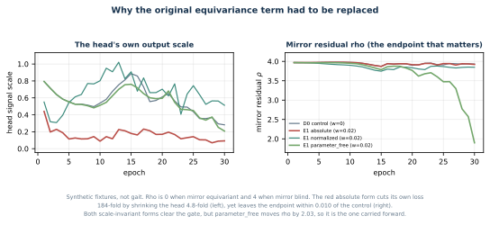

# How the GAVD3 S-JEPA approach evolved into GAVD6

This tutorial explains how the S-JEPA work in this folder changed from a small normal-only prototype into the current five-stage, fingerprinted experiment. It explains what was changed, why it was changed, what the saved results show, and which ideas are still only proposals.

The central lesson is that three kinds of improvement must remain separate:

1. A **model improvement** changes data, masking, losses, architecture, or training.
2. An **evaluation improvement** changes how an existing representation is measured.
3. A **reporting improvement** makes provenance, exposure, and limitations more visible.

All three matter. They do not support the same claim.


## 1. How to read this tutorial

Every method in this document has one of three statuses.

|Status|Meaning|
|---|---|
|Implemented and measured|The current notebooks or saved artifacts contain the method and its outputs.|
|Superseded|The method or result was used earlier and is retained only to explain the evolution.|
|Proposed|The idea appears in the improvement notes, but the current checkpoint does not implement it.|

This distinction is especially important for the [archived improvement plan](../notes/04_improvement_plan.md) and [archived execution prompt](../notes/05_improvement_instr.md). They contain useful research hypotheses, but they predate the completed five-stage run. They must not be read as a list of current features.


The current source of truth is:

- the executable notebooks 00 through 06, which live in `experiments/sjepa/gavd6-pm`;
- the real artifacts under `experiments/sjepa/gavd6/work/artifacts/real`, the directory `GAVD_ARTIFACT_DIR` points at;
- [classifier_contract.json](../../gavd6/work/artifacts/real/classifier_contract.json);
- [result_history.csv](result_history.csv) for the classifier lanes, and [symmetry_verdicts.csv](symmetry_verdicts.csv) for the three reflection-symmetry verdicts of Section 16b;
- the completed checkpoint sjepa_curriculum_final_augmented.pt;
- experiment fingerprint ea59fea055f0230bcf236deb1d1e8bbf08033766e7cd95a98f28210b3042c4e4.

The fingerprint identifies the saved experiment payload and lineage. It is not a byte checksum of the checkpoint file.

## 2. The research question stayed stable

The project has always asked a representation-learning question:

> Can a compact skeleton representation retain useful gait structure when it first learns from normal gait and then continues through several condition groups?

The project does not establish diagnosis. GAVD folder names are dataset annotations. The added normal clips were created by this project and were not independently clinically reviewed.

The core JEPA idea also stayed stable. A view encoder receives visible joint-time tokens. A predictor estimates the latent features of selected hidden tokens. A slowly updated target encoder sees the complete sequence and supplies the target representation. S-JEPA applies this predictive idea to skeleton sequences [1]. The current implementation is paper-aligned, but it is not the authors' official S-JEPA code.

The large changes happened around that core:

- more normal source videos;
- two additional eligible landmark identities;
- an active anti-collapse term;
- a five-stage continuing curriculum;
- a supervised group term after Stage 0;
- stronger artifact contracts;
- explicit missingness, video-overlap, and encoder-exposure audits.


## 3. Generation 1: the legacy normal-only prototype

### 3.1 Data support

The first completed real study trained the representation on 12 normal sequences from one YouTube source video. These were separate annotated windows, but they shared the same source.

This was enough to test the end-to-end code path. It was not enough to teach broad normal gait variation. The encoder could learn person identity, camera style, clothing, crop behavior, or detector behavior that was specific to that one source.

### 3.2 Ten eligible landmark identities

The legacy whitelist contained:

~~~text
11, 12, 23, 24, 25, 26, 27, 28, 31, 32
~~~

These are the left and right shoulders, hips, knees, ankles, and foot indices. Heels 29 and 30 were absent.

Only these identities could become hidden prediction targets. All 33 BlazePose identities could still provide visible context.

### 3.3 Prediction-only objective

The legacy training objective was centered and sharpened latent cross-entropy:

$$
L_{\mathrm{legacy}} = L_{\mathrm{JEPA}}.
$$

Collapse diagnostics were measured after or during training, but no active variance or covariance regularizer pushed the feature dimensions away from a constant solution.

### 3.4 Training and readout

The legacy model used the same main Transformer dimensions as the current model:

|Component|Value|
|---|---:|
|Input frames|64|
|Joints|33|
|Frames per patch|4|
|Time patches|16|
|Embedding width|96|
|Encoder layers|4|
|Predictor layers|2|
|Attention heads|4|

The 64 by 33 sequence produced 528 possible joint-time tokens. Four pooled 96-dimensional summaries produced the same 384-dimensional downstream vector that is still used today.

The legacy normal-only run used 300 epochs and roughly 900 optimizer updates. Its main preserved result on the exact historical 47/21 exp5 split was:

|Legacy exact-exp5 result|Value|
|---|---:|
|Accuracy|0.619|
|Macro-F1|0.613|

These rounded values are historical ledger entries. The repository does not retain the legacy fold predictions needed to recompute them from first principles.

## 4. The failure audit changed the direction of the project

The first result was useful because it revealed several limitations.

### 4.1 One source video was not a normal-gait distribution

Twelve windows from one source are correlated. More windows increase the number of rows, but they do not create more independent camera, person, or acquisition settings.

### 4.2 A sequence split was not a source-video split

The exact exp5 test rows shared all nine of their source videos with classifier training. The all-96 split shared all 16 test videos. The representation encoder had also already trained on the evaluated rows.

The result therefore answered:

> Can a shallow classifier recover labels from features inside this already-seen corpus?

It did not answer:

> How well does the complete pipeline work on a new source video or person?

### 4.3 Pose-detector missingness was predictive

The project introduced a control that uses no gait coordinates. It contains:

- 33 per-joint observed fractions;
- 64 per-frame observed fractions;
- 97 visibility-only features in total.

The missingness-only Random Forest reached:

|Lane|Accuracy|Balanced accuracy|Macro-F1|
|---|---:|---:|---:|
|All-96|0.483|0.507|0.477|
|Exact exp5|0.286|0.270|0.277|

This showed that detector success and failure were related to the labels. Any learned representation result had to be read against this shortcut floor.

### 4.4 Temporal information was compressed

Every sequence was resized to 64 frames. The downstream vector then averaged over time. This removes native duration and makes temporal order inaccessible to the Random Forest.

The representation may still encode motion context inside each token. The final pooling cannot tell the classifier when an event occurred or directly preserve native walking rate.

### 4.5 The audit produced a research plan, not an automatic implementation

The archived plan proposed temporal pooling, raw-rate features, explicit visibility channels, smoothing, width sweeps, block masks, motion targets, hybrid features, and fold-local representation training.

Only part of that plan was adopted. The current method kept the project's fixed, non-motion-aware target rule. It prioritized more normal videos, two restored heel identities, VICReg, progressive condition training, reproducibility contracts, and stronger evaluation warnings.

## 5. Generation 2: broaden the normal data without mixing provenance

### 5.1 Canonical data remained locked

The canonical experiment stayed fixed at 96 GAVD sequences from 18 videos:

|Condition|Sequences|Source videos|
|---|---:|---:|
|Normal|12|1|
|Parkinson's|9|2|
|Stroke|12|3|
|Myopathic|47|10|
|Cerebral palsy|16|2|
|Total|96|18|

This preserved comparability with the earlier analysis.

### 5.2 Added normal videos used a separate pipeline

The project created normal walking windows from 17 additional YouTube videos. These rows were never relabeled as canonical GAVD data.


The added-normal preparation worked step by step:

1. Inspect up to three pose candidates.
2. Select a walker using visible-body area, pose confidence, and temporal continuity.
3. Pad, fill, smooth, and clamp the automatic bounding-box track.
4. Estimate a walking cycle from ankle-separation autocorrelation.
5. Create windows of about two cycles with 50 percent overlap.
6. Require at least 24 frames and cap a clip at eight windows.
7. Extract MediaPipe landmarks into a separate poses_augmented directory.
8. Accept only candidates with authorized-landmark coverage of at least 0.45.

The report contained 64 candidate windows. Sixty-three passed. One 44-frame candidate, aug-MN4vnaNwIsA-w05, had coverage 0.027 and was rejected.

Notebook 04 and notebook 06 now use the extraction report as the selection contract. A rejected file cannot enter merely because it remains in the pose directory.

### 5.3 What improved

Stage 0 expanded from 12 sequences and one video to 75 sequences and 18 videos:

$$
12\ \text{canonical normal} + 63\ \text{added normal} = 75.
$$

This is a large improvement in source breadth.


### 5.4 What new risk appeared

Sixty-three of 75 normal training rows came through the added extraction path. Every abnormal row came through the canonical path.

A model can therefore associate the normal label with:

- a different bounding-box process;
- different camera styles;
- different video quality;
- different crop behavior;
- different detector missingness.

The scientific unit of diversity is 17 added source videos, not 63 independent people. Several windows overlap within the same video.

## 6. Pose preprocessing became an explicit contract

Each raw pose array has shape:

$$
[T, 33, 4],
$$

where the final dimension is x, y, relative z, and visibility.

Notebook 04 prepares a sequence in this order:

1. A landmark is valid when visibility is at least 0.45 and all three coordinates are finite.
2. Internal coordinate gaps of at most four frames are linearly filled.
3. The original validity mask is retained. A filled coordinate may provide context, but the originally invalid position cannot become a target.
4. Coordinates are centered at the pelvis.
5. Coordinates are divided by a robust shoulder-or-hip width scale.
6. Remaining missing coordinates become zero.
7. Coordinates and validity are resized to 64 frames.
8. A four-frame patch is target-valid only when all four validity values are true.

This separation between coordinates and validity matters. Zero is still used as the coordinate sentinel, so invalid tokens can influence attention as context. The validity mask prevents those tokens from becoming targets and excludes them from downstream pooling, but it does not make the sentinel invisible to every Transformer layer.

## 7. The target whitelist expanded from 10 to 12 identities

The current set is:

|BlazePose index|Landmark|
|---:|---|
|11|Left shoulder|
|12|Right shoulder|
|23|Left hip|
|24|Right hip|
|25|Left knee|
|26|Right knee|
|27|Left ankle|
|28|Right ankle|
|29|Left heel|
|30|Right heel|
|31|Left foot index|
|32|Right foot index|

The two added identities are the heels. This corrected the earlier ten-identity description and made the executable mapping agree with the de-duplicated project mapping.

The whitelist is a project rule. It is not a clinically validated biomarker for all five conditions.

### 7.1 A landmark identity is not one hidden token

Each identity appears at 16 time patches. The maximum authorized target grid therefore contains:

$$
16 \times 12 = 192
$$

positions. The complete sequence contains:

$$
16 \times 33 = 528
$$

possible positions.

### 7.2 The 0.60 rule is batch-safe

For sample $b$, let $\mathcal E_b$ be its valid eligible positions. The common target count is:

$$
n_{\mathrm{mask}}
=
\min\left(
\left\lfloor 0.60\min_b|\mathcal E_b|\right\rfloor,
\min_b|\mathcal E_b|-1
\right).
$$

Every sample in the batch receives this same target count. A sample with more valid eligible tokens therefore realizes a fraction below 0.60.


For example, suppose four samples contain 180, 160, 150, and 175 valid eligible positions. The smallest count is 150:

$$
\lfloor 0.60 \times 150 \rfloor = 90.
$$

Every sample receives 90 targets. Their realized fractions are 0.500, 0.5625, 0.600, and about 0.514.

The completed run recorded a mean eligible fraction of 0.551 at the Stage 0 endpoint and 0.423 at the Stage 4 endpoint.

The sampler does not read coordinate magnitude, displacement, velocity, acceleration, topology weight, or a learned motion score.

## 8. The learning objective gained two additional jobs

The current objective is:

$$
L
=
L_{\mathrm{JEPA}}
+0.05L_{\mathrm{VICReg}}
+0.25L_{\mathrm{group}}.
$$


### 8.1 JEPA latent prediction

The target encoder sees the complete sequence. The view encoder sees only non-target tokens. The predictor inserts learned mask tokens into the full positional layout and estimates target features.

For target features $R_t$, predictor features $R_p$, target center $c$, teacher temperature 0.06, and predictor temperature 0.10:

$$
q = \operatorname{softmax}((R_t-c)/0.06),
$$

$$
\log p = \operatorname{logsoftmax}(R_p/0.10),
$$

$$
L_{\mathrm{JEPA}}
=
-\frac{1}{M}\sum_m q_m^\top\log p_m.
$$

The target center uses momentum 0.9. The target encoder follows the view encoder through an exponential moving average that starts at 0.999 and approaches 1.0 within each stage.

### 8.2 VICReg anti-collapse pressure

Two transformed views of a sequence pass through the view encoder. Valid authorized features are pooled and projected through a 96 to 96 to 96 projector.

The inner VICReg expression is [2]:

$$
L_{\mathrm{VICReg}}
=
25L_{\mathrm{inv}}
+25L_{\mathrm{var}}
+L_{\mathrm{cov}}.
$$

- Invariance brings paired views together.
- Variance penalizes dimensions whose spread falls below the target.
- Covariance reduces redundant dimensions.

More exactly, invariance is mean squared error between paired projected vectors. Variance measures the population standard deviation of each projected dimension in each view and applies a hinge `max(0, 1 - standard deviation)`. Covariance centers each projected batch, squares the off-diagonal entries of its feature covariance matrix, and averages them. The diagonal is excluded because it measures a feature's own variance rather than dependence between different features.

The logged `VICReg` number is the inner expression above, averaged over optimizer batches; its contribution to total loss is 0.05 times that value. VICReg is active during every stage, uses no condition label, and should not be credited with the label-centroid separation performed by the group term.

### 8.3 Label-aware group pressure

The group term is zero during Stage 0 because only normal data are active. In Stages 1 through 4, condition labels are used.

Compactness reduces squared distance to the condition centroid. Separation penalizes centroid pairs closer than margin 1.0:

$$
L_{\mathrm{sep}}
=
\frac{1}{P}\sum_{i<j}
\left[\max(0,1-\|c_i-c_j\|_2)\right]^2.
$$

The input sequence vectors and their condition centroids are L2-normalized. Thus distances lie between 0 and 2; margin 1.0 corresponds to a 60-degree angle, or cosine similarity 0.5, between centroid directions. A distance of 1.2 has no penalty, 0.9 contributes 0.01, and 0.5 contributes 0.25. The full optimized group term is compactness plus separation.

The epoch line abbreviates these quantities in a way that can be misread. The example below is the Stage 1 endpoint line, not the final one, so do not read its numbers as the run's final diagnostics; Section 11 carries those.

```text
JEPA 0.5337  VICReg 13.0367  group 0.0008  std 0.4134
```

Here `group` is only the mean separation penalty, not compactness plus separation. It is averaged across centroid pairs and balanced batches, so it is not one centroid distance. `std` is not a VICReg term at all: after the epoch, the unprojected EMA-teacher vectors for the whole active corpus are measured dimension by dimension, and their population standard deviations are averaged. Nonzero `std` argues against every row mapping to one constant vector, but it cannot show that the variation is clinically meaningful.

This means the complete five-stage method is not fully self-supervised. Stage 0 is label-free representation learning. Stages 1 through 4 are label-informed representation fine-tuning.

## 9. Generation 3: one model continued through five curriculum stages

The current curriculum is cumulative:

|Stage|New condition|Active sequences|Videos|Epochs|Updates|
|---:|---|---:|---:|---:|---:|
|0|Normal|75|18|300|5,700|
|1|Parkinson's|84|20|75|1,425|
|2|Stroke|96|23|75|1,425|
|3|Myopathic|143|33|75|1,425|
|4|Cerebral palsy|159|35|75|1,425|

Total training was 600 curriculum epochs and 11,400 optimizer updates.


### 9.1 What continues

The following state continues from one stage to the next:

- view-encoder weights;
- predictor weights;
- EMA target-encoder weights;
- target center;
- VICReg projector weights;
- normal anchor used for drift monitoring.

### 9.2 What restarts

Each stage creates a fresh AdamW optimizer and learning-rate scheduler. The following state restarts:

- optimizer moments;
- scheduler warmup;
- scheduler position;
- EMA schedule position.

Model parameters are not reinitialized.

Stage 0 begins at learning rate 0.001. Later stages begin at 0.0003. AdamW uses betas 0.9 and 0.95, weight decay 0.05, and gradient clipping at 1.0.

### 9.3 Balanced replay

Every active condition contributes four samples to a batch. The largest active condition has 75 rows, so each stage uses:

$$
\left\lceil \frac{75}{4} \right\rceil = 19
$$

batches per epoch. Smaller conditions are replayed through repeated random permutations.

The batch size grows with the number of active conditions:

|Stage|Active conditions|Batch size|
|---:|---:|---:|
|0|1|4|
|1|2|8|
|2|3|12|
|3|4|16|
|4|5|20|

Balanced replay keeps earlier conditions in the optimization stream. It does not guarantee that their representation remains fixed.

## 10. Reproducibility became part of the methodology

The current checkpoint lineage is:

|Stage|Fingerprint prefix|Parent prefix|
|---:|---|---|
|0|07fb855a26b4|none|
|1|2feef215510a|07fb855a26b4|
|2|a7f24edf9627|2feef215510a|
|3|269c400ef0f1|a7f24edf9627|
|4|ea59fea055f0|269c400ef0f1|

Each checkpoint records:

- mode and stage;
- ordered conditions;
- completed epoch and update counts;
- parent fingerprint;
- sequence, video, and cohort membership;
- data-content and validity hashes;
- mapping path and mapping hash;
- the 12-identity whitelist;
- model and loss configuration;
- model, teacher, predictor, target-center, and VICReg projector state;
- complete training history.

Optimizer and scheduler state are deliberately not saved because a fresh optimizer and schedule begin at every stage.


Notebook 05 and notebook 06 reject:

- an incomplete curriculum;
- the wrong condition order;
- the wrong run mode;
- a different target whitelist;
- embeddings with a different fingerprint;
- unexpected canonical or augmented row counts.

The augmented flag selects sjepa_curriculum_final_augmented.pt. The notebooks no longer silently substitute a different final checkpoint when the requested variant is absent. This directly resolves the earlier failure where a consumer looked for sjepa_curriculum_final.pt even though the completed run had produced only the augmented final alias.

## 11. What training health actually showed

The endpoint diagnostics are:

|Stage|JEPA|VICReg|Feature std|Pair cosine|Minimum training centroid distance|Normal anchor|
|---:|---:|---:|---:|---:|---:|---:|
|0|0.526|16.990|0.445|0.417|not applicable|reference|
|1|0.534|13.037|0.413|0.509|0.610|0.959|
|2|0.673|10.584|0.379|0.632|0.470|0.849|
|3|0.597|9.472|0.360|0.678|0.323|0.729|
|4|0.487|8.312|0.363|0.660|0.259|0.617|


These values support limited conclusions. It helps to separate what we can see from what we can infer from it.

**Concrete evidence.** Training ran to the end of all five stages and every number stayed finite. At the Stage 4 endpoint the feature standard deviation was 0.363, the mean pair cosine was 0.660, the normal-anchor cosine had fallen to 0.617, and the group-margin penalty was still above zero.

**Supported inference.** The representation did not collapse. If every sequence had been mapped to one and the same vector, the feature standard deviation would sit near zero and the pair cosine would sit near one. Neither happened. The normal-anchor cosine started at 1.000 by definition and ended at 0.617, so the normal features moved a long way while the four condition stages were added. The group-margin penalty never reached zero, so the training objective did not fully achieve the centroid separation it was asking for.

**Unsupported inference.** None of this says the representation learned gait structure that means anything clinically. A representation can avoid collapse and still be encoding camera style, clothing, crop behavior, or detector quirks. Feature spread is a health check on the training run. It is not a measure of what the features are about.

**Next valid experiment.** Run the same five stages while holding out complete source videos, then measure these same diagnostics on videos the encoder never trained on. Drift measured only on training data cannot tell useful adaptation apart from forgetting, because both look like the anchor moving.

## 12. Frozen representation inspection stayed separate from classification

Notebook 05 first ran a small hidden-token check. Across four sequences and 114 masked tokens per sequence, mean prediction cosine was 0.553 with standard deviation 0.109.

This is a spot check. It is not a corpus-level accuracy measure.

### 12.1 The 384-dimensional vector

The complete, unmasked EMA target encoder produces a 96-dimensional feature for each valid token. Four summaries are concatenated:

1. global valid-token mean, 96 values;
2. global valid-token standard deviation, 96 values;
3. valid 12-landmark mean, 96 values;
4. valid 12-landmark standard deviation, 96 values.

The result is:

$$
96 + 96 + 96 + 96 = 384.
$$


This pooling is intentionally simple and has no trainable sequence head. It is suitable for a small frozen-feature probe. It cannot retain the order of the 16 time patches or native walking duration.

The planned per-segment, left-right, and raw-rate extensions shown in the figure are not implemented current results.

### 12.2 Canonical geometry was weak

For the canonical 96 sequences:

|Geometry measure|Value|
|---|---:|
|Cosine silhouette|0.054398|
|Minimum centroid distance|0.025675|
|Mean centroid distance|0.313160|
|Mean within-condition distance|0.104404|

The closest centroids were myopathic and cerebral palsy.


A silhouette near zero indicates overlapping group boundaries. The minimum centroid distance was also much smaller than the average within-condition distance.

This can coexist with a high in-corpus Random Forest score. A nonlinear classifier can exploit local boundaries, source identity, acquisition style, detector artifacts, and label-informed exposure even when global centroids overlap.

## 13. Classifier readouts improved, but their scope stayed descriptive

The readout uses:

- StandardScaler fitted on classifier-training embeddings;
- Random Forest with 100 trees;
- maximum depth 5;
- square-root feature sampling;
- bootstrap sampling;
- balanced class weights;
- random seed 42.

The classifier does not update the encoder. However, the encoder already trained on the evaluated sequences and, after Stage 0, their condition labels.

### 13.1 Same-split model comparison

On the exact historical 47/21 exp5 assignment:

|Version|Accuracy|Balanced accuracy|Macro-F1|
|---|---:|---:|---:|
|Legacy normal-only S-JEPA|0.619|not saved|0.613|
|Current five-stage S-JEPA|0.857|0.891|0.881|

The change is +0.238 accuracy and +0.268 macro-F1.


**Concrete evidence.** The test portion of this split holds 21 sequences. The legacy model labeled 13 of them correctly, which is 0.619. The current model labeled 18 of them correctly, which is 0.857. So accuracy rose by 0.238 and macro-F1 rose by 0.268, and in plain counting terms the current model got five more sequences right.

**Supported inference.** The current pipeline recovers these labels better than the legacy pipeline did on exactly the same 21 rows. That is a real difference between two complete systems, measured the same way twice.

**Unsupported inference.** Nothing here says which change produced the gain, because everything moved at once:

- normal data breadth;
- target whitelist;
- number of updates;
- VICReg;
- progressive condition exposure;
- balanced replay;
- label-aware group pressure;
- artifact and preprocessing contracts.

This is not a component ablation, so the score change cannot be assigned to any one of those components. It is also not a performance estimate. All nine test videos also appear in classifier training, and the encoder had already trained on all 21 test rows, so the number says how well labels can be recovered inside a corpus the system has already seen. Five sequences is a small margin as well, and on 21 rows a single reassigned sequence moves accuracy by about 0.048.

**Next valid experiment.** Turn one component off at a time, retrain, and score each variant on the same folds, so each number belongs to one change. Then repeat the whole comparison inside outer source-video folds, so the result is about new videos rather than about this corpus.

### 13.2 The historical handcrafted comparison

On the same exact 47/21 assignment:

|System|Accuracy|Macro-F1|
|---|---:|---:|
|Current S-JEPA readout|0.857|0.881|
|Historical 82-feature Random Forest|0.762|0.728|

**Concrete evidence.** The S-JEPA readout scored higher than the handcrafted system on both measures: 0.857 against 0.762 on accuracy, and 0.881 against 0.728 on macro-F1. That is +0.095 accuracy and +0.153 macro-F1. On the 21 test sequences it means the handcrafted system labeled 16 correctly and the S-JEPA readout labeled 18 correctly, a difference of two sequences.

**Supported inference.** On this one fixed 47/21 assignment, the learned representation fed into a Random Forest got more of these test sequences right than the historical 82-feature Random Forest did.

**Unsupported inference.** This does not show that learned features are better than handcrafted features. The two systems used different pose pipelines and different feature pipelines, so this is a comparison of two whole systems and not a clean representation ablation: the S-JEPA side changed the features and the pose extraction at the same time. The split is confounded in the same way as everywhere else on this lane, since classifier training and testing share all nine source videos and the encoder saw every test row. And a two-sequence lead on 21 rows is small enough that one differently assigned sequence would cut it in half.

**Next valid experiment.** Compute both feature sets from the same pose cache and score them through the same source-video-disjoint folds. That way the features are the only thing that differs, and the comparison can support a claim about representations rather than about pipelines.

### 13.3 All-96 and exact-split controls

|Readout|Accuracy|Balanced accuracy|Macro-F1|
|---|---:|---:|---:|
|A1 all-96 S-JEPA|0.759|0.849|0.803|
|A1 missingness only|0.483|0.507|0.477|
|A2 exact exp5 S-JEPA|0.857|0.891|0.881|
|A2 missingness only|0.286|0.270|0.277|


The learned vector exceeded the visibility-only control on these splits. This shows label-related structure beyond the 97 saved visibility fractions. It does not isolate gait from person, video, crop, or extraction style.

### 13.4 Additional historical readout changes

The expanded result ledger also preserves the legacy all-96 and one-versus-normal readouts recovered from commit cc6e6de:

|Readout|Legacy accuracy|Current accuracy|Legacy macro-F1|Current macro-F1|
|---|---:|---:|---:|---:|
|All-96 five class|0.621|0.759|0.594|0.803|
|Parkinson's versus normal|0.714|1.000|0.708|1.000|
|Stroke versus normal|0.857|1.000|0.857|1.000|
|Myopathic versus normal|0.778|1.000|0.679|1.000|
|Cerebral palsy versus normal|0.889|1.000|0.883|1.000|

These binary test sets contain only 7 to 18 rows. They remain sequence-level, video-confounded, and encoder-exposed. Their apparent gains are useful regression checks, not independent estimates.

## 14. Class-level examples explain why one aggregate number is insufficient


The A2 macro-F1 was 0.881, but that average hides an uneven distribution. Cerebral palsy was the weakest class at 0.750, because only 3 of its 5 sequences were recovered. The exact-split confusion pattern was:

|True condition|Correct / support|
|---|---:|
|Cerebral palsy|3 / 5|
|Myopathic|6 / 7|
|Normal|3 / 3|
|Parkinson's|3 / 3|
|Stroke|3 / 3|

All three errors in this lane were confusions with myopathic gait:

- two cerebral-palsy sequences from video DlPDuHBAP7A were predicted as myopathic;
- one myopathic sequence from 05oyBOE_0UE was predicted as stroke.

Stroke recall was perfect here, but its precision was 0.75 because of that one myopathic sequence, so its F1 was 0.857. Reading only the macro average would hide both the cerebral-palsy shortfall and the fact that the whole error budget is three sequences. On the wider all-96 lane the same weakness is larger: cerebral-palsy F1 falls to 0.545 and myopathic to 0.720, and the myopathic and cerebral-palsy centroids are the closest pair in the canonical geometry audit. The confusion pattern and the geometry point at the same weak boundary.

Repeated errors from the same source video are one reason that sequence rows should not be treated as independent people.

## 15. Generation 4: Lane C repaired classifier grouping

Lane C pools 96 canonical embeddings with 63 added-normal embeddings.

### 15.1 Binary task

The binary normal-versus-abnormal task uses five source-video-grouped Random Forest folds:

|Metric|Five-fold mean|
|---|---:|
|Accuracy|0.780|
|Balanced accuracy|0.804|
|Macro-F1|0.749|
|ROC AUC|0.915|

The accuracy percentile range over five fold scores was 0.731 to 0.830. This is not a population confidence interval. Five related fold values provide only a rough stability summary.

### 15.2 Why the first five-class grouping was superseded

The first five-class attempt used five ordinary GroupKFold folds:

|Superseded five-class Lane C|Value|
|---|---:|
|Mean accuracy|0.604|
|Mean balanced accuracy|0.595|
|Mean macro-F1|0.407|

One training fold contained no cerebral-palsy rows. Macro-F1 label sets also differed across folds. The means therefore did not summarize the same five-class task in every fold.

### 15.3 Corrected two-fold evaluation

Parkinson's and cerebral palsy each have only two source videos. Two StratifiedGroupKFold folds are the largest feasible design that keeps every class in both training and test portions.


|Corrected five-class Lane C|Value|
|---|---:|
|Mean accuracy|0.614|
|Mean balanced accuracy|0.615|
|Mean macro-F1|0.615|
|Pooled out-of-fold accuracy|0.616|
|Pooled out-of-fold macro-F1|0.610|

The checkpoint and embeddings did not change. The macro-F1 increase from 0.407 to 0.615 is an evaluation repair, not a model gain.

Do not read the legacy 0.619 accuracy and the corrected pooled Lane C macro-F1 of 0.610 as the same kind of number. They come from different models, different lanes, and different metrics.

### 15.4 Lane C is still encoder-transductive

Every one of the 159 Lane C rows had already influenced representation training. Grouping the Random Forest by source video does not undo that exposure.

The correct description is:

> classifier-video-disjoint, encoder-transductive.

The actual five-class majority in the 159-row Lane C corpus is normal:

$$
75/159 \approx 0.472.
$$

This differs from the canonical-96 majority of 47/96, or 0.490.

## 16. The three current lanes answer different questions

|Lane|Rows and split|Classifier video overlap|Encoder exposure|Valid interpretation|
|---|---|---|---|---|
|A1|96 rows; stratified 67/29|16 of 16 test videos overlap|29 of 29 test rows seen|Can labels be recovered inside the full known canonical corpus?|
|A2|68 rows; exact 47/21|9 of 9 test videos overlap|21 of 21 test rows seen|How does the current system compare on the historical assignment?|
|Lane C|159 rows; grouped RF folds|No overlap inside each classifier fold|159 of 159 fold-test rows seen|How stable is a grouped classifier on one fixed, exposed encoder?|


None is an independent estimate for a new patient, camera, clinic, or complete video pipeline.

## 16b. Generation 5: three symmetry investigations, and what a negative result is worth

The readout lanes above all ask the same kind of question: can a classifier recover a folder label? A different question is whether the representation encodes a specific, physically meaningful property. Several gait conditions affect the two sides of the body unequally. Stroke commonly produces side-to-side differences in timing and step length. That makes signed left-minus-right asymmetry a good test case, because it is defined by anatomy rather than by a dataset annotation.

Three experiments pursued it, in an order that was not planned in advance but reads as one argument in hindsight, and each one returned a different preregistered verdict:

1. **Idea 5**, notebook `nb_05a`, tried to read the axis out of the frozen representation. Verdict: **informative null**.
2. **Idea 9 arm 1**, notebook `nb_09a`, asked whether the readout had merely been the wrong shape. Verdict: **artifact**, because a side-agnostic nuisance control fired.
3. **Idea 9 arm 2**, notebooks `new_nb_09_00` through `new_nb_09_03`, stopped reading and started training, using a label-free reformulation that sidesteps the cohort limit both earlier experiments ran into. Verdict: **no credit**.

None of the three produced a positive claim, but the three words above are not three ways of saying the same thing, and Section 16b.6 sets out what each one does and does not license. All three are reported here in full, because in each case the controls are what make the result worth reading.

### 16b.1 Idea 5 read signed laterality out of the frozen vector

Idea 5, in notebook `nb_05a`, fits a regression from the frozen 384-value representation to a signed left-minus-right quantity, using five source-disjoint folds so that no video appears in both training and testing. Nothing is retrained; the encoder is read, not changed.

Four lanes ran, and it is worth saying what each one is for before quoting any number:

1. **Lane B**, the raw-coordinate null, exists to prove the experiment is capable of a positive. If the target cannot be recovered even from the coordinates it was computed from, then the target definition, the fold machinery, or the scoring is broken and no other lane means anything.
2. **Lane A**, the treatment, is the only lane that uses the learned representation.
3. **Lane C**, the untrained-encoder floor, repeats lane A through an encoder of the same shape whose weights were never trained. Note what this lane is and is not. It is not a lane with no side information in it, because a random untrained network still projects the coordinates, and those projections can carry some left-versus-right structure by accident. That is exactly what makes it the right control: it tests whether lane A's score can be attributed to representation training, rather than to the shape of the network and the coordinates it was handed. A trained encoder has to beat its own untrained twin before training gets any credit.
4. **Lane D**, the pooled nuisance control, uses side-agnostic summary statistics. It exists because a score that a side-blind feature can also reach is not evidence about sides.

|Lane|What it uses|R-squared|Mean absolute error|
|---|---|---:|---:|
|B raw null|The raw coordinates, as a sanity anchor|1.000|0.0001|
|A learned|The frozen S-JEPA vector|-0.602|2.473|
|C floor|Untrained-encoder floor, same shape, never trained|-0.156|2.019|
|D pooled|A pooled nuisance control|-0.131|1.977|

An R-squared of 0 means a model does no better than predicting each fold's mean. Lane B is the essential check: the target is recoverable from raw coordinates almost perfectly, so the target definition, the fold machinery, and the scoring are all sound. Lane A, the learned representation, then scores well below zero, and both controls outscore it: the untrained floor by 0.446 and the side-agnostic pooled lane by 0.471. The preregistered verdict is **informative null**. The mirror slope was -0.741, which is negative but does not reach the clean sign inversion that a genuinely antisymmetric representation would show. Only 44 percent of held-out source videos had the correct left-versus-right direction, against a required 75 percent, and a value near half is what an unstable direction looks like.

### 16b.2 Idea 9 arm 1 gave the readout the right shape

One reasonable objection to Idea 5 is that the readout was the wrong shape. A plain regression has no reason to respect the antisymmetry of the target. Idea 9 arm 1, in notebook `nb_09a`, therefore replaced it with an antisymmetric head that is constrained to negate its output when left and right landmarks are swapped. The encoder is still frozen and still the same one Idea 5 read, so only the shape of the readout changed. Arm 1 also added the controls that such a claim needs, including two new ones: a capacity-matched lane that has the same width and aggregation but no antisymmetry constraint, which exists so that extra capacity cannot be mistaken for antisymmetry, and a mirror-symmetrized lane that is mathematically blind to left and right, which exists so that a score reachable without side information cannot be read as side information.

|Lane|What it tests|R-squared|
|---|---|---:|
|B raw null|Sanity anchor from coordinates|1.000|
|A' antisymmetric head|The treatment lane|-0.206|
|Ac capacity matched|Same width and aggregation, symmetric path added|-0.184|
|C floor|Untrained-encoder floor, same shape, never trained|-0.027|
|D standard readout|The Idea 5 learned lane, repeated|-0.602|
|E side-agnostic|Symmetrized so it cannot see any side|-0.066|

The head's wiring was verified exactly: swapping its input tokens flips its output with a slope of -1.000, so the constraint is real rather than nominal and the result is not an implementation bug. The antisymmetric shape did help relative to the plain readout, moving from -0.602 to -0.206. It did not help enough. Lane A' at -0.206 is still below the untrained floor, which sits at -0.027, and the capacity-matched control at -0.184 shows that nearly all of the improvement came from the extra width and aggregation rather than from antisymmetry itself; the isolated contribution of the antisymmetry constraint is -0.022.

Lane E settles it. Lane E is symmetrized so that a skeleton and its mirror produce identical features, which makes it mathematically incapable of representing which side is which. It scored -0.066, better than the antisymmetric lane built to read sides. A side-blind control beating a side-reading treatment cannot be evidence of side information. The preregistered verdict is **artifact**. A permutation test agrees: lane A' is worse than 97 percent of runs on shuffled labels.


### 16b.3 The most useful finding is about the cohort, not the model, and Idea 9 arm 1 is what measured it

Stopping at "the features do not encode laterality" would be the wrong lesson, because one of arm 1's own preregistered gates explains both earlier results at once. This gate is measured in `nb_09a`, not in Idea 5 and not in Idea 5's second notebook `nb_05b`, which produces no empirical verdict about the checkpoint at all.

Take it in three steps.

1. **Why the gate exists.** The folds are source-disjoint, so every fold holds out whole videos. If the target barely varies from one source video to another, then holding out videos holds out the very variation a held-out score would have to recover, and the score becomes uninterpretable before any encoder is involved. Arm 1 therefore registered a minimum in advance: at least 30 percent of the signed-laterality target's variance must lie between source videos rather than within them.
2. **What we observed.** The measured value is 7.5 percent, on a cohort of 18 source videos. About 92.5 percent of the target's variation lies within a single video, across windows of the same walker.
3. **What we may conclude.** Source-disjoint folds hold out entire videos, so on this cohort and with this target they hold out almost all of the usable signal by construction, and no readout could have scored well no matter how good the encoder or the head. The binding constraint is the data, and specifically the fact that 18 source videos are too few to differ in asymmetry. This is more actionable than a verdict about the encoder would have been: it says to collect more source videos, not to build a better head.


### 16b.4 Idea 9 arm 2 trained symmetry in rather than reading it out

If the cohort cannot support a labeled laterality target, a label-free formulation avoids the problem. Arm 2 shows each skeleton and its anatomical mirror to the encoder during training and adds a term asking the representation to respond consistently to that reflection. The endpoint is a normalized mirror residual, written rho, which reads 0 for a perfectly mirror-equivariant encoder and 4 for a mirror-blind one. Because rho needs no labels, the between-source variance problem does not apply.

Arm 2's first useful result was a bug in its own method. The original loss form summed the squared mirror residual of a trainable head's output. That objective has a degenerate solution: the head can shrink its own output toward zero and drive the loss down without changing the encoder at all. On the synthetic fixtures of notebook `new_nb_09_01`, which are 30 generated sequences and not gait data, this is exactly what happened. The reported loss fell about 184-fold, from 0.550 to 0.003, while the head's output scale shrank about 4.8-fold, from 0.440 to 0.092, and rho stayed at 3.922 against the control's 3.932, a gap of 0.010 against a gate of 0.049. Anyone watching only the loss curve would have recorded a success.

The repair is to normalize the residual by the signal's own magnitude, so shrinking the output scales numerator and denominator together and gains nothing. Three variants were compared on synthetic fixtures with a known answer. The original absolute form failed the gate at +0.010. A normalized form that keeps the trainable head passed at +0.084. A parameter-free form, which replaces the head with an identity readout so no trainable weight can influence the objective at all, passed by far the widest margin at +2.034, and it was the form selected for the real run.



Two practices caught this, and both are worth reusing. First, the endpoint is a quantity the loss cannot trivially game, measured separately from the loss. Second, the metric was calibrated on fixtures whose answer was known in advance, which is how we could tell that rho reads 0 and 4 at the two extremes and therefore means what the contract says.

### 16b.5 On the real cohort the endpoint moves decisively, and the term still earns no credit

The repaired recipe then ran on the real cohort with the full 11,400-update curriculum per rung, 3 seeds run against 5 registered, comparing a control with the term switched off against a treatment with it on. The rule for crediting the term had been fixed beforehand and required three things: an improvement larger than the control's own seed-to-seed spread, a paired bootstrap over source videos that excludes zero, and no guardrail regressing beyond that same seed spread.

The reason only three of the five registered seeds ran is recorded in the result bundle alongside the numbers. Measured per-rung cost on this machine came in above the estimate the time budget had been approved against, so the ladder was cut rather than run past its budget. Fewer seeds makes the control's spread a noisier yardstick, which is what condition 1 compares against, so a marginal effect could not have been adjudicated honestly on three seeds. The effect measured here is about seven times that spread, so the verdict does not rest on the missing two.

|Measure|D0 control, term off|E1 treatment, term on|Control seed spread|
|---|---:|---:|---:|
|Mirror residual rho, target encoder|0.462|0.059|0.057|
|Mirror residual rho, view encoder|0.562|0.082|-|
|Measured anatomical-mirror slope|-0.648|-0.937|-|
|Head signal scale|0.748|1.059|-|
|Feature standard deviation|0.400|0.371|0.008|
|Mean pairwise cosine|0.636|0.648|0.011|
|Minimum centroid distance|0.246|0.247|0.060|

The first two conditions pass without argument, and their two numbers must be kept apart, because they are not two views of one quantity and the result bundle itself carries that warning.

1. **Condition 1 works at the cohort level.** It takes the mean rho of each rung across seeds and subtracts them: 0.462 for the control against 0.059 for the treatment, an improvement of 0.403, which is about seven times the control's seed spread of 0.057. Read as a ratio, the residual falls by roughly a factor of eight.
2. **Condition 2 works one source video at a time.** It forms a separate improvement ratio for each of the 18 source videos and bootstraps those 18 ratios, 4000 draws, paired by source. The 95 percent interval is 1.118 to 2.291, which excludes zero, and 18 of 18 videos improve.

The cohort-level 0.403 is a difference of means of summed terms; the interval 1.118 to 2.291 is an average of per-source ratios. They are computed from different quantities on different scales, so the interval is not a confidence interval for 0.403 and neither number may be substituted for the other.

Two secondary observations support the same reading. The measured anatomical-mirror slope moves from -0.648 to -0.937, close to the exact sign inversion a mirror-equivariant representation would show, and well past the -0.741 that Idea 5 measured on the frozen baseline encoder in `nb_05a`. The head's own output scale grows rather than shrinking, which rules out the degenerate solution the synthetic fixtures exposed: the residual fell because the encoder changed, not because the readout collapsed.

The third condition fails. Feature standard deviation drops by 0.0288 against a control seed spread of 0.0082, about 3.5 times the spread. Mean pairwise cosine moves the same way but stays inside its own spread by a hair, 0.0111 against 0.0114. Both say the treated representation is mildly more collapsed. Because the rule required all three, the preregistered verdict is **no credit**.


It is worth being explicit about why this is not reported as a win with a footnote, because from inside the result that framing feels reasonable. The endpoint effect is large and consistent, the failing guardrail moves by a modest amount, condition geometry is untouched at 0.246 against 0.247, and a stand-in condition probe even improves slightly. Every ingredient for "it works, with a minor caveat" is present.

What defeats that framing is that the caveat is not independent of the effect. A term that pushes the encoder toward responding identically to a body and its reflection is, mechanically, a term that removes variance. Losing feature spread is not an unrelated side effect; it is a competing explanation for the endpoint improvement itself. Telling "the encoder learned mirror structure" apart from "the encoder has less left to be inconsistent about" needs a weight sweep that this ladder does not contain, and the guardrail failure is exactly the signal that the distinction matters here.

One registered guardrail, the source-grouped five-class balanced accuracy, was **not evaluable**. It did not fail; it could not be computed. A source-grouped five-class probe needs at least two source videos per condition, and all twelve canonical normal sequences come from one video. The cause is therefore the same cohort limitation that made arm 1 uninterpretable, namely too few source videos. The stand-in is a stratified probe that leaks video identity, adequate for noticing destruction and worthless as evidence about conditions.

A boundary must stay explicit. Rho is a symmetry property of the representation. It is not accuracy, not separation, and not clinical value. Arm 2 shows the reflection constraint can be installed, verified, and priced. It does not show that installing it makes the representation better for any downstream gait task.

Note finally that the real magnitudes and the fixture magnitudes are not comparable, and the fixtures invited a wrong prediction. The synthetic fixtures sit near 3.9, close to the mirror-blind extreme of 4, because their toy encoder is mirror-blind by construction, which made it tempting to expect real encoders to start there too. Real control rungs land at 0.462 with no equivariance term at all, most of the way to mirror-honest. Fixture values calibrate the metric's scale; they say nothing about where real data will fall on it.

### 16b.6 What the three verdicts do and do not license

The three experiments are easy to blur together, and they do not say the same thing. This subsection sets the conclusions down in five steps. Each step states what was done, why it was done that way, what was observed, and what may be concluded from it. Anyone quoting one of these results in a paper or a talk should be able to answer all four for the sentence they are writing.

#### Step 1. Read three verdicts as three different epistemic states, not as three failures

*What we did.* We ran three preregistered experiments against one question and recorded the verdict each experiment's own rule produced: `nb_05a` returned **informative null**, `nb_09a` returned **artifact**, and `new_nb_09_00` through `new_nb_09_03` returned **no credit**.

*Why we did it that way.* Fixing the decision rule before seeing the number is what stops a negative from being reinterpreted afterwards. It is also what makes these three words mean three different things, since each was defined in advance by a different rule.

*What we observed.* An **informative null** means the measurement was valid and the answer was no: no signed laterality axis is linearly decodable above a raw-coordinate baseline, and the treatment does not even reach an untrained-encoder floor. An **artifact** means the measurement is not admissible evidence about sides at all, because a control blind to left and right outscored the treatment; the claim is withdrawn rather than answered. **No credit** means the effect is real, large, and present on every one of the 18 source videos, but a preregistered guardrail failed and its failure supplies a competing explanation for the effect itself.

*What we may conclude.* An artifact is a weaker epistemic state than a null, not a stronger one, because a null at least tells you the answer. No credit is not the same as no effect. Collapsing all three into "it did not work" throws away the difference between a valid negative, a withdrawn measurement, and an uncredited effect, and those three differences are most of the value in this section.

#### Step 2. Read the three as a chain, in which each experiment closes one escape route left open by the previous one

*What we did.* After each verdict we named the strongest remaining alternative explanation and built the next experiment to test it directly.

*Why we did it that way.* A single negative result never settles anything on its own, because there is always a way to say the experiment was built wrong. The only way to remove that objection is to build the experiment the objection asks for and see whether the result changes.

*What we observed.* Idea 5 could have failed because the readout was the wrong shape for a signed quantity. Arm 1 built an antisymmetric-by-construction head, verified its wiring at a swap slope of exactly -1.000, and the null survived. Arm 1 could have failed because the encoder was never asked to respect the mirror in the first place. Arm 2 asked it directly, and rho fell from 0.462 to 0.059.

*What we may conclude.* Two named alternatives are now closed. Readout shape was not the explanation, because fixing the shape did not rescue the score. Encoder incapacity was not the explanation either, because the encoder can be driven to rho 0.059 when a term asks it to be. What survives all three experiments is not a claim about the model at all, which is the subject of Step 3.

#### Step 3. Identify the binding constraint before blaming the model or the readout

*What we did.* Arm 1 registered a data-quality gate alongside its score gates and measured it in `nb_09a`: what fraction of the signed-laterality target's variance lies between source videos rather than within them, against a preregistered minimum of 30 percent.

*Why we did it that way.* This control exists because every fold in these experiments is source-disjoint. If the target barely varies from one source video to the next, holding out whole videos holds out the variation a held-out score would have to recover, and the score is uninterpretable before any encoder is involved. The threshold had to be registered in advance, because after a disappointing result it is always tempting to discover a data limitation.

*What we observed.* 7.5 percent against the preregistered 30 percent, on a cohort of 18 source videos. About 92.5 percent of the target's variance lies within single videos.

*What we may conclude.* The binding constraint is the cohort, not the model and not the readout. On this cohort and this target, a held-out-source R-squared cannot support a positive laterality claim regardless of how good the encoder or the head is, so Idea 5's null and arm 1's artifact have one shared explanation. Arm 2's label-free rho sidesteps this limit for the symmetry property specifically, because rho needs no labels and no folds. Nothing in this package sidesteps it for a labeled clinical target. The actionable consequence is to collect more source videos that differ in asymmetry, not to build a better head.

#### Step 4. State what none of the three licenses

*What we did.* We listed, in advance of writing any summary, the claims that these results would not support even if read generously.

*Why we did it that way.* Negative results invite over-reading in both directions: as proof that the representation contains nothing, or as a near miss that a little more tuning would convert into a win.

*What we observed.* Every score in this family is transductive, because the encoder saw every evaluation sequence during training. Rho is a symmetry property of the representation, and arm 2's own downstream check confirms that moving it bought nothing: the antisymmetric lane R-squared went from -0.027 to -0.030.

*What we may conclude.* No clinical claim follows from any of the three. No statement about unseen videos, patients, cameras, or clinics follows either. Rho may not be equated with accuracy, with condition separation, or with clinical value, so a representation can be perfectly mirror-consistent and still useless. And Idea 5's null does not show that no side information exists anywhere in the representation, only that a linear readout cannot recover this target across held-out videos here; nonlinear readouts were not tested.

#### Step 5. Report the ladders, because in all three the informative element is a control rather than the treatment

*What we did.* Each experiment reported a full ladder of lanes or rungs, not a single headline number, and each ladder included at least one control whose only job was to give the treatment a way to fail.

*Why we did it that way.* A treatment number alone cannot be interpreted. Minus 0.206 is not obviously good or bad until something else has been scored on the same target with the same machinery.

*What we observed.* In Idea 5, the untrained-encoder floor at -0.156 outscored the trained treatment at -0.602 by 0.446. In arm 1, the mirror-symmetrized lane at -0.066, which is mathematically incapable of telling left from right, outscored the antisymmetric treatment at -0.206 by 0.140. In arm 2, the endpoint moved as hoped and it was the feature-spread guardrail that decided the verdict, falling by 0.0288 against a control seed spread of 0.0082, about 3.5 times the spread.

*What we may conclude.* In every one of the three experiments the sentence that changed the conclusion was written by a control, not by the treatment. That is the practical reason to report ladders rather than headlines, and it is the reason the three verdicts above are worth more than a single line saying the representation does not encode laterality.

## 17. The next valid methodology

A truly held-out estimate must split source videos before any data-dependent fitting.


For each outer fold:

1. Hold out complete source videos.
2. Choose all preprocessing and selection rules using outer-training videos only.
3. Start S-JEPA from fresh weights.
4. Train Stage 0 using only outer-training normal videos.
5. Continue Stages 1 through 4 using only outer-training videos and labels.
6. Freeze the complete representation pipeline.
7. Create embeddings for outer-training data and fit the classifier.
8. Open the held-out videos once for final prediction.
9. Save fold-level predictions, confusion matrices, provenance, and exposure audits.
10. Aggregate metrics across genuinely independent outer folds.

### 17.1 High-priority proposed ablations

These are useful next experiments, not current results:

|Proposed experiment|Question|
|---|---|
|Per-segment temporal summaries|Does retaining the 16-step profile improve classification?|
|Left-right trajectory differences|Does timing of asymmetry add information beyond pooled magnitude?|
|Raw duration, FPS, cadence, or autocorrelation|Does restoring the native rate axis help?|
|Same-pose handcrafted, embedding, and fused features|What is the learned representation's marginal contribution?|
|Explicit visibility input and provenance controls|How much of the score depends on detector and acquisition behavior?|
|Source-balanced normal and abnormal acquisition|Does reducing path-label correlation change the result?|
|Width and objective ablations|Which model component, if any, causes the observed change?|

Any trainable readout, width sweep, or new masking geometry must be evaluated inside the same outer-fold discipline.

## 18. Practical reproduction map

Run notebooks in order:

|Notebook|Evolution role|
|---|---|
|00|Explains JEPA theory and the current learning graph.|
|01|Locks the canonical manifest, source-video provenance, and embedded/cached video viewing.|
|02|Creates time-aligned 33-landmark pose caches.|
|03|Builds and tests the 12-identity uniform target sampler.|
|04|Trains the five-stage checkpoint lineage.|
|05|Checks prediction, collapse, drift, and canonical geometry.|
|06|Fits A1, A2, and Lane C readouts with controls and exposure audits.|

The Section 16b symmetry work runs after notebook 06, because it reads the finished checkpoint:

|Notebook|Evolution role|
|---|---|
|`nb_05a_signed_laterality_probe`|Idea 5. Reads the signed axis out of the frozen vector. Produces the informative null.|
|`nb_05b_reflection_reach_and_futures`|Idea 5's possible-futures simulator and external-dataset reach scaffold. Produces no empirical verdict about the checkpoint, and its synthetic fixture numbers must never be quoted as results.|
|`nb_09a_antisymmetric_readout_probe`|Idea 9 arm 1. Repeats the readout with an antisymmetric head plus a capacity-matched and a side-blind control. Produces the artifact verdict and the 7.5 percent between-source variance measurement.|
|`new_nb_09_00` through `new_nb_09_03`|Idea 9 arm 2. Contract, synthetic-fixture mechanism validation, real multi-seed ladder, and the no-credit verdict.|

Two notebooks in this family must not be quoted as current results. `nb_09b_equivariant_retrain` wrote a bundle labeled real while training under a smoke configuration, and the arm 2 contract explicitly supersedes it. `nb_09c_futures_and_reach`, like `nb_05b`, is a futures and reach scaffold rather than a measurement.

The current real configuration requires:

~~~dotenv
GAVD_MODE=real
SJEPA_INCLUDE_AUGMENTED_NORMAL=1
SJEPA_RUN_PROFILE=recommended
~~~

Leave SJEPA_INSPECT_CHECKPOINT and SJEPA_CLASSIFIER_CHECKPOINT unset unless selecting an artifact deliberately.

Rebuild all publication figures:

~~~bash
MPLCONFIGDIR=cache/matplotlib .venv/bin/python docs/make_figures.py
MPLCONFIGDIR=cache/matplotlib .venv/bin/python docs/make_evolution_figures.py
MPLCONFIGDIR=cache/matplotlib .venv/bin/python docs/make_symmetry_figures.py
~~~

The evolution generator validates the completed checkpoint, fingerprint, five-stage lineage, row counts, reports, and result ledger before writing SVG, PDF, and PNG variants. The symmetry generator draws the Idea 5, Idea 9 arm 1, and Idea 9 arm 2 figures of Section 16b; it refuses any probe bundle whose fingerprint does not match the current contract, and it draws only those equivariance rungs that completed the full 11,400-update curriculum.

Refresh the machine-readable result ledger from the same artifacts:

~~~bash
MPLCONFIGDIR=cache/matplotlib .venv/bin/python docs/refresh_result_history.py
MPLCONFIGDIR=cache/matplotlib .venv/bin/python docs/refresh_result_history.py --check
~~~

The first form rewrites the current rows of [result_history.csv](result_history.csv) and regenerates the three verdict rows of [symmetry_verdicts.csv](symmetry_verdicts.csv). The second form changes nothing and returns a nonzero exit status if either file has drifted from the artifacts, which is the form to run in continuous integration.

## 19. A compact interpretation checklist

Before quoting a result, ask:

- Which checkpoint and fingerprint produced it?
- Did the model change, or did only evaluation change?
- Which rows and videos were used?
- Did classifier train and test share source videos?
- Did the representation encoder already see the test rows?
- Did representation training use condition labels?
- What did the missingness-only control score?
- Are the compared tasks and metrics the same?
- If it is a symmetry result, which of the three verdicts is it, and which control decided it?
- What does the confusion matrix show for small classes?
- Were added labels and bounding boxes independently reviewed?
- Is the statement about a known corpus or a new source?

If these questions are unanswered, the score is not ready to stand alone.

## 20. Bottom line

The current system is a meaningful engineering improvement over the legacy prototype:

- Stage 0 grew from one normal video to 18 normal videos.
- The whitelist expanded from 10 to 12 landmark identities.
- VICReg added active anti-collapse pressure.
- Four condition stages and balanced replay were added.
- The exact-split readout moved from 0.619 accuracy and 0.613 macro-F1 to 0.857 and 0.881.
- Checkpoint, cohort, and metric lineage became explicit.
- Lane C's five-class fold design was repaired without pretending that the model improved.

The saved representation did not totally collapse. It also did not form clean five-condition clusters. Normal features drifted substantially, and all current readout lanes remain encoder-exposed.

Three of the package's headline findings are not classifier scores at all. They come from the reflection-symmetry investigations of Section 16b, and each carries a different preregistered verdict with a different meaning:

- **Idea 5, notebook `nb_05a`: informative null.** A signed left-minus-right laterality axis is not linearly decodable out of the frozen representation on this cohort. The treatment lane scored -0.602 against an untrained-encoder floor of -0.156, so the measurement was valid and the answer was no.
- **Idea 9 arm 1, notebook `nb_09a`: artifact.** Constraining the readout head to be antisymmetric, with its wiring verified at a swap slope of -1.000, did not rescue the score, and a lane that is mathematically blind to left and right outscored it, -0.066 against -0.206. The claim is withdrawn rather than answered, which is a weaker epistemic state than a null.
- **Idea 9 arm 2, notebooks `new_nb_09_00` through `new_nb_09_03`: no credit.** Training a label-free equivariance term into the encoder cut the mirror residual rho, where 0 is mirror equivariant and 4 is mirror blind, from 0.462 to 0.059, about seven times the control's seed spread, with 18 of 18 source videos improving. The preregistered feature-spread guardrail nonetheless failed, and because a term that asks the encoder to respond identically to a body and its reflection is also a term that removes variance, that failure is a competing explanation for the endpoint gain rather than an unrelated side effect.

The most actionable number in the package comes from the same family, and it is a fact about the cohort rather than about the model: only 7.5 percent of the signed-laterality target's variance lies between source videos, against a preregistered 30 percent, measured in `nb_09a`. With 18 source videos and source-disjoint folds, almost all of the usable signal is held out by construction.

In all three, the informative element was a control rather than the treatment, and none of the three licenses a clinical claim or a statement about unseen videos.

The next important improvement is not another in-corpus score. It is a complete outer source-video experiment that retrains all five representation stages without access to the held-out videos. For the laterality question specifically, it is a cohort with enough independent source videos to make a held-out score interpretable at all, and a weight sweep on the equivariance term that can separate learned mirror structure from lost variance.

## References

1. Abdelfattah and Alahi, “S-JEPA: A Joint Embedding Predictive Architecture for Skeletal Action Recognition,” ECCV 2024. [DOI 10.1007/978-3-031-73411-3_21](https://doi.org/10.1007/978-3-031-73411-3_21)
2. Bardes, Ponce, and LeCun, “VICReg: Variance-Invariance-Covariance Regularization for Self-Supervised Learning,” ICLR 2022. [OpenReview](https://openreview.net/forum?id=xm6YD62D1Ub)
3. Assran et al., “Self-Supervised Learning from Images with a Joint-Embedding Predictive Architecture,” CVPR 2023. [DOI 10.1109/CVPR52729.2023.01499](https://doi.org/10.1109/CVPR52729.2023.01499)
4. Ranjan et al., “Computer Vision for Clinical Gait Analysis: A Gait Abnormality Video Dataset,” IEEE Access, 2025. [DOI 10.1109/ACCESS.2025.3545787](https://doi.org/10.1109/ACCESS.2025.3545787)
5. Grishchenko et al., “BlazePose GHUM Holistic,” 2022. [DOI 10.48550/arXiv.2206.11678](https://doi.org/10.48550/arXiv.2206.11678)
6. Google AI Edge, “Pose Landmark Detection Guide.” [Official documentation](https://ai.google.dev/edge/mediapipe/solutions/vision/pose_landmarker)
7. Roberts et al., “Cross-Validation Strategies for Data with Temporal, Spatial, Hierarchical, or Phylogenetic Structure,” Ecography, 2017. [DOI 10.1111/ecog.02881](https://doi.org/10.1111/ecog.02881)
8. Bengio and Grandvalet, “No Unbiased Estimator of the Variance of K-Fold Cross-Validation,” JMLR, 2004. [JMLR](https://www.jmlr.org/papers/v5/grandvalet04a.html)
9. Rousseeuw, “Silhouettes: A Graphical Aid to the Interpretation and Validation of Cluster Analysis,” 1987. [DOI 10.1016/0377-0427(87)90125-7](https://doi.org/10.1016/0377-0427(87)90125-7)
10. Breiman, “Random Forests,” Machine Learning, 2001. [DOI 10.1023/A:1010933404324](https://doi.org/10.1023/A:1010933404324)
11. Hui et al., “Skeleton Motion Topology-Masked Prediction and Contrastive Learning for Self-Supervised Human Action Recognition,” Scientific Reports, 2026. [DOI 10.1038/s41598-026-39330-9](https://doi.org/10.1038/s41598-026-39330-9)
