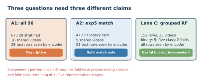
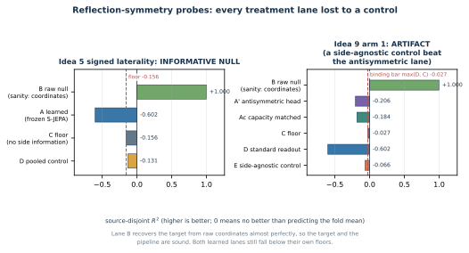

# Beyond Accuracy: Building and Auditing Gait Representations with JEPA

**Theodore Mui, Alex Mui, and Phil Mui**

## Abstract

We trained and audited a skeletal Joint-Embedding Predictive Architecture, or S-JEPA, for monocular gait video. The completed curriculum used 159 pose sequences from 35 source videos. It began with 75 normal sequences, then added Parkinson's disease, stroke, myopathic gait, and cerebral palsy in four cumulative stages. The final training diagnostics retained nonzero feature spread, but the normal reference representation drifted as new groups entered. On the canonical 96-sequence GAVD cohort, the minimum cosine distance between condition centroids was 0.026, mean within-condition distance was 0.104, and cosine silhouette was 0.054. These values do not show clean five-group geometry. A stratified sequence split produced 0.759 five-class accuracy, but every test video also appeared in classifier training and every test sequence had already been seen by the label-aware encoder. Classifier-video-grouped folds produced mean accuracy of 0.780 for normal versus abnormal and 0.614 for five classes, but the encoder still saw all evaluation sequences. Three preregistered probes of signed left-right asymmetry returned three distinct verdicts: an informative null, an artifact once a side-blind control outscored the lane built to read sides, and no credit for a decisive but variance-costing reflection term. The run shows that the full curriculum executes without complete representation collapse. It does not establish generalization to unseen videos, patients, or clinics.

**Index Terms:** gait analysis, joint-embedding predictive architecture, S-JEPA, VICReg, pose estimation, curriculum learning, representation audit

## 1. Introduction

Walking depends on the nervous system, muscles, joints, balance, and the surrounding environment. Parkinson's disease can alter speed, stride, cadence, and double-support time [1]. Stroke can create side-to-side timing and distance differences [2]. Cerebral palsy can produce crouch gait [3]. Late-onset Pompe disease, one type of myopathy, can reduce motor function [4]. These examples motivate gait research, but a gait video alone cannot establish a diagnosis.

A Joint-Embedding Predictive Architecture, or JEPA, learns by predicting hidden content in representation space instead of reconstructing every input value [5]. This idea has been studied in images [5], video [6], and skeleton sequences [7]. A second problem is representation collapse, where many inputs map to nearly the same vector. VICReg discourages this failure by preserving variation and reducing redundant feature dimensions [8].

Our question was concrete: can one model first learn normal gait, continue through four broader gait groups, and retain a useful, nonconstant representation? We answer that question with a completed run, geometry measurements, missingness controls, and explicit exposure audits. We do not treat a classifier score as clinical validation when source videos or representation-training rows overlap evaluation.

The main contributions are:

1. a reproducible 12-landmark prediction-target rule with executable checks;
2. a completed five-stage, normal-first curriculum over 159 sequences;
3. separate measurements of collapse, normal-reference drift, and five-group geometry; and
4. three downstream evaluation lanes whose source-video overlap and representation exposure are reported with each score.

## 2. Related work

I-JEPA introduced prediction in image representation space [5], and V-JEPA extended feature prediction to video [6]. S-JEPA applies a related teacher and predictor design to skeleton action recognition [7]. MAMP predicts motion and uses motion-aware target selection [12], while Skeleton2vec uses contextualized targets [13]. This project uses neither method's target selector. It draws prediction targets uniformly from a fixed anatomical whitelist.

GaitForeMer uses self-supervised motion forecasting for gait impairment estimation [14]. Our narrower aim is not diagnosis or severity prediction. We study a small, auditable representation-learning workflow and show where its present evidence stops.

## 3. Materials and methods

### 3.1 Data and provenance

The canonical cohort contains 96 sequences from 18 GAVD source videos [9]. The completed training run also uses 63 normal sequences cut from 17 user-supplied videos. Those added clips were selected and labeled as normal within this project. Automatic MediaPipe detections supplied their person boxes. They are not part of GAVD and did not receive an independent clinical label review.

|Training group|Sequences|Source videos|Provenance|
|---|---:|---:|---|
|Canonical normal|12|1|GAVD|
|Added normal|63|17|Project-supplied and self-annotated|
|Parkinson's disease|9|2|GAVD|
|Stroke|12|3|GAVD|
|Myopathic|47|10|GAVD|
|Cerebral palsy|16|2|GAVD|
|**Total**|**159**|**35**|Mixed sources|

GAVD boxes isolate the intended walker. MediaPipe estimates 33 landmarks and their visibility [10], [11]. The pipeline uses image-relative pose estimates. Monocular depth is a model estimate, not calibrated clinical motion capture. Internal low-visibility gaps of at most four frames are interpolated. Longer gaps and gaps at a sequence end stay missing. Every sequence is pelvis-centered, body-scale normalized, and resized to 64 frames. Missing coordinates become zero sentinels and cannot become prediction targets.

### 3.2 Fixed prediction targets

The target rule comes only from `experiments/multiple-sclerosis/mapping-data/ms-pd-mapping.md`. It expands ranges, removes duplicates, and produces the landmark indices

$$
\{11,12,23,24,25,26,27,28,29,30,31,32\}.
$$

These are the left and right shoulders, hips, knees, ankles, heels, and foot indices. The source mapping was written for multiple-sclerosis and Parkinson's feature families. Reusing its whitelist across all five folders is a project rule, not a claim that these landmarks diagnose the five conditions.

A token holds one landmark over four adjacent frames. A 64-frame, 33-landmark sequence therefore contains 528 tokens. The configured 0.60 fraction is applied to the smallest valid eligible-token count in each batch, and that common number is sampled uniformly without replacement in every sample. Samples with more valid tokens therefore realize a lower fraction. The sampler never reads displacement, velocity, acceleration, or a learned motion score. Invalid allowed tokens are skipped, and a forbidden landmark is never substituted. The target encoder can still use all 33 landmarks as context.

### 3.3 Model and objective

The view encoder processes a masked pose sequence. The target encoder processes the complete pose and is updated by an exponential moving average of the view encoder. The predictor estimates the target encoder's latent vectors at hidden locations. The masked prediction loss is

$$
\mathcal L_{\mathrm{JEPA}}=-\sum_d q_d\log r_d,
$$

where $q$ is the centered and sharpened target distribution and $r$ is the predictor distribution. The complete loss is

$$
\mathcal L=\mathcal L_{\mathrm{JEPA}}
+0.05\mathcal L_{\mathrm{VICReg}}
+0.25\mathcal L_{\mathrm{group}}.
$$

VICReg compares projected student features from two geometric views. Its invariance term is their mean squared error, its variance hinge penalizes projected dimensions with batch standard deviation below 1, and its covariance term penalizes squared off-diagonal feature covariance [8]. The logged VICReg value is `25 * invariance + 25 * variance + covariance`; the outer objective multiplies it by 0.05. VICReg does not use condition labels.

The group loss is separate and label-aware. It normalizes unprojected pooled student vectors, forms one normalized centroid per condition, and combines within-condition compactness with $[\max(0,1-d)]^2$ for centroid distances $d$ below margin 1.0. On unit vectors that margin corresponds to a 60-degree angle, or cosine similarity 0.5. It is zero during normal-only Stage 0.

The abbreviated epoch log requires a further distinction. Its `group` field reports only the centroid-separation penalty, not compactness plus separation. Its `std` field is not a loss or a VICReg term: it is the mean per-feature standard deviation of unprojected EMA-target embeddings over the full active corpus after the epoch. Nonzero `std` is evidence against total collapse, but neither it nor a small centroid penalty demonstrates clinically meaningful or generalizable clusters.

### 3.4 Continuing curriculum

One model continues through every stage. The view encoder, predictor, moving-average target encoder, target center, and VICReg projector are never reinitialized. Later batches contain equal counts from every active condition, so earlier groups remain in training.

|Stage|New data|Active sequences|Epochs|Optimizer updates|
|---:|---|---:|---:|---:|
|0|75 normal|75|300|5,700|
|1|9 Parkinson's|84|75|1,425|
|2|12 stroke|96|75|1,425|
|3|47 myopathic|143|75|1,425|
|4|16 cerebral palsy|159|75|1,425|
|**Total**|||**600**|**11,400**|

The final checkpoint is `sjepa_curriculum_final_augmented.pt`. Its SHA-256 fingerprint begins `ea59fea055f0230b` and its contract records all 159 sequence identifiers, all 35 video identifiers, stage lineage, loss settings, target-mask hash, and optimizer counts.

### 3.5 Three levels of evaluation

The audits ask three different questions.

1. **Training health:** Did feature spread remain nonzero? Did pairwise similarity approach one? How far did the normal reference move?
2. **Canonical geometry:** Do the frozen target-encoder representations of the canonical 96 rows form five compact, separated groups?
3. **Downstream readout:** Can a Random Forest [15], implemented with scikit-learn [16], read folder labels from frozen representations?

The all-96 lane uses a fixed stratified sequence split. Stratification preserves class proportions: normal is split 8/4, Parkinson's 6/3, stroke 9/3, myopathic 33/14, and cerebral palsy 11/5, for 67 train and 29 test sequences. It does not separate source videos. Balanced accuracy averages recall over classes [17], while macro F1 gives each class equal weight.

The exact-47/21 lane reproduces the sequence IDs used by a historical 82-feature Random Forest. Lane C uses five GroupKFold splits for the binary task and two StratifiedGroupKFold splits for the five-class task. Two is the largest fold count that can keep every label on both sides because Parkinson's disease and cerebral palsy each have only two videos. A source video cannot appear in both the Random Forest training and test portions of one fold. Grouped validation is important when samples share a source [18]. In every lane, however, the encoder was first trained on the full corpus. Lane C therefore separates videos only for the downstream Random Forest, not for representation learning.

## 4. Results

### 4.1 Training completed without total collapse, but normal gait drifted

The recommended run completed 600 epochs and 11,400 optimizer updates. Feature standard deviation ended at 0.363 and mean pairwise cosine similarity ended at 0.660. These values provide evidence against the extreme case in which every sequence maps to one identical vector. They do not prove that every feature is useful.

|Stage end|JEPA loss|VICReg loss|Feature standard deviation|Mean pair cosine|Minimum centroid distance|Normal-anchor cosine|
|---:|---:|---:|---:|---:|---:|---:|
|0|0.526|16.990|0.445|0.417|Not defined|Not defined|
|1|0.534|13.037|0.413|0.509|0.610|0.959|
|2|0.673|10.584|0.379|0.632|0.470|0.849|
|3|0.597|9.472|0.360|0.678|0.323|0.729|
|4|0.487|8.312|0.363|0.660|0.259|0.617|

Normal-anchor cosine fell from 0.959 after Stage 1 to 0.617 after Stage 4. The model retained nonzero spread, but its normal reference changed substantially as broader groups entered. The nonzero margin penalty at Stage 4 also shows that the requested training-corpus margin was not fully satisfied.

### 4.2 Canonical five-group geometry was weak

Notebook 05 pooled the final target encoder into a 96 by 384 embedding matrix for the canonical GAVD rows. Mean within-condition cosine distance was 0.104. Mean distance between condition centroids was 0.313, but the smallest centroid distance was only 0.026, between myopathic and cerebral-palsy rows. Cosine silhouette was 0.054, close to the point where within-group and nearest-other-group distances balance. The weak pair is four times closer than the average spread inside a condition, so the canonical rows do not form five clean clusters.

The Stage 4 minimum centroid value of 0.259 in the previous table is not a contradiction. It is a training-time measurement over the active 159-row corpus. The 0.026 value is a separate frozen target-encoder audit over the canonical 96 rows. Corpus, pooling context, and measurement time all matter.

### 4.3 Downstream scores were descriptive, not independent

|Lane and task|Accuracy|Balanced accuracy|Macro F1|Key exposure|
|---|---:|---:|---:|---|
|All-96 missingness control|0.483|0.507|0.477|16 shared test videos|
|All-96 S-JEPA readout|0.759|0.849|0.803|16 shared test videos; 29 of 29 test rows seen by encoder|
|Exact-47/21 missingness control|0.286|0.270|0.277|9 shared test videos|
|Exact-47/21 S-JEPA readout|0.857|0.891|0.881|9 shared test videos; 21 of 21 test rows seen by encoder|
|Exact-47/21 historical 82-feature reference|0.762|Not recorded|0.728|Same video-confounded split|
|Lane C normal versus abnormal|0.780|0.804|0.749|Grouped RF; all 159 rows seen by encoder|
|Lane C five class|0.614|0.615|0.615|Two grouped RF folds; all 159 rows seen by encoder|

The all-96 S-JEPA readout exceeded the missingness-only control, but both used the same confounded sequence split. Every one of the 16 test videos was also present in classifier training. In addition, all 29 test rows had already participated in label-aware representation training. The score is useful for describing the fitted representation, not for estimating unseen-video performance.

For Lane C normal versus abnormal, the mean ROC AUC was 0.915. Accuracy ranged from 0.731 to 0.830 in a percentile bootstrap over the five fold scores. This is a descriptive summary of five dependent folds, not a strong population confidence interval. The corrected five-class lane uses only two folds and therefore reports no interval. Its pooled out-of-fold accuracy was 0.616 and pooled macro-F1 was 0.610. There is no generally unbiased variance estimate for ordinary K-fold cross-validation [19].

### 4.4 Three probes of left-right asymmetry, and three different verdicts

Label recovery does not say which physical property a representation encodes. Because several gait conditions affect the two sides of the body unequally [2], we probed one anatomically defined quantity directly: signed left-minus-right asymmetry. Three preregistered experiments asked about it in turn, and each one closed a specific escape route that the previous one had left open. Their three verdicts are three **different epistemic states**, and collapsing them into a single "it did not work" would misstate all three.

|Experiment|What it changed|Endpoint|Verdict|What that verdict means|
|---|---|---|---|---|
|Idea 5, `nb_05a`|Nothing; read out of the frozen encoder|Ridge R-squared on a signed target|**Informative null**|The measurement was valid and the answer was no|
|Idea 9 arm 1, `nb_09a`|The readout's shape only; encoder still frozen|Ridge R-squared on a signed target|**Artifact**|The lane is not admissible evidence about sides at all, so the claim is withdrawn rather than answered. This is a **weaker** epistemic state than a null, not a stronger one|
|Idea 9 arm 2, `new_nb_09_00` through `new_nb_09_03`|The encoder itself, during the full curriculum|Label-free mirror residual rho|**No credit**|The effect is real, large, and consistent on 18 of 18 source videos, but a preregistered guardrail failed and its failure supplies a competing explanation, so the effect is not credited|

Idea 5 and arm 1 read the same frozen checkpoint, whose fingerprint also identifies arm 2's baseline reference row, and all three use the same 96-sequence, 18-source-video cohort. All three are transductive: the encoder saw every evaluation sequence during training, and the source video is the unit of evidence. Idea 5 and arm 1 used five source-disjoint folds, so no video contributed to both fitting and scoring; arm 2 replaced folds with a label-free endpoint and a paired-by-source bootstrap.

**Idea 5 asked whether the frozen representation already carries the axis.** It fit a ridge readout from the frozen 384-value vector to the signed target. The readout scored -0.602, below its own untrained-encoder floor of -0.156. The decoded sign pointed the right way on only 44 percent of held-out videos, against a preregistered 75 percent, and a value near half is what an unstable direction looks like. The measured anatomical-mirror slope was -0.741, negative but short of the clean sign inversion a genuinely antisymmetric representation would give. Two controls outscored the treatment: the untrained floor by 0.446 and a side-agnostic pooled nuisance lane by 0.471.

The preregistered verdict was an **informative null**, and the emphasis belongs on *informative*. The measurement was valid and the answer was no: on this cohort, and under these gates, no signed laterality axis is linearly available above a raw-coordinate baseline or even above an untrained-encoder floor. It does not show that no side information exists anywhere in the representation, because nonlinear readouts were not tested, and it is not a clinical statement.

**Idea 9 arm 1 asked whether the readout was simply the wrong shape.** That was the escape route Idea 5 left open: a plain ridge has no reason to respect the antisymmetry of the target. Arm 1 replaced it with a head that is constrained to negate its output when left and right landmarks are swapped, and it added the controls that such a claim requires. The head read a frozen encoder, so nothing was retrained, and the swap slope was verified at exactly -1, which proves the head really was antisymmetric and rules out an implementation bug as the explanation.

|Lane|What it uses|R-squared|
|---|---|---:|
|Raw-coordinate anchor|The pose coordinates|1.000|
|Frozen S-JEPA readout|The 384-value vector, repeated from Idea 5|-0.602|
|Antisymmetric head|A head constrained to negate under a left-right swap|-0.206|
|Capacity-matched control|Same width and aggregation, symmetric path added|-0.184|
|Untrained floor|The same head on an untrained encoder|-0.027|
|Side-agnostic control|Symmetrized, cannot represent side at all|-0.066|

The raw-coordinate anchor recovers the target almost exactly, which establishes that the target definition, the folds, and the scoring are all sound. Every learned lane then falls below the untrained floor. The antisymmetric shape did help against the plain readout, moving from -0.602 to -0.206, but the capacity-matched control reached -0.184, so the isolated contribution of antisymmetry is only -0.022 and nearly all of the apparent gain came from added width and aggregation. The decisive lane is the side-agnostic control, which is symmetrized so that a skeleton and its mirror produce identical features and side cannot be represented at all. It scored -0.066, beating the antisymmetric treatment by 0.140. A lane that is mathematically blind to left and right outscoring a lane built specifically to read them cannot be evidence of laterality encoding. A permutation test agrees, placing the antisymmetric lane below 97 percent of shuffled-label runs.

The preregistered verdict was **artifact**, and it is important that this is a *withdrawal* rather than an answer. "Artifact" means the lane is not admissible evidence about sides at all, so the claim is taken off the table instead of being resolved. That is a different and weaker epistemic state than Idea 5's clean null, not a stronger one.

**The binding constraint is the cohort, not the model and not the readout.** Arm 1's most valuable output is not a fact about the encoder but a fact about the data, measured by its preregistered y-quality gate: only 7.5 percent of the signed target's variance lies between source videos, against a required 30 percent. The other 92.5 percent lies within videos, across windows of a single walker. Source-disjoint folds hold out whole videos, so with 18 independent source videos they withhold nearly all of the usable between-source signal by construction. On this cohort, with this target, a held-out-source R-squared cannot support a positive laterality claim no matter how good the encoder or the head is. This single measurement explains Idea 5's null and arm 1's artifact at the same time, and it is why arm 2 abandoned R-squared as a primary endpoint. Arm 2's label-free endpoint escapes the limit for a symmetry property; nothing in this package escapes it for a labeled clinical target.

**Idea 9 arm 2 removed the labels and trained the symmetry in.** The escape route still open after arm 1 was that the encoder had never been asked to respect the mirror. Arm 2 shows the encoder each skeleton and its anatomical mirror during training and adds a label-free, scale-invariant term asking the representation to respond consistently to that reflection. The endpoint is a normalized mirror residual, written rho, on a scale where **0 is mirror equivariant** (a mirrored body maps to the exact sign flip of the original) and **4 is mirror blind** (the encoder cannot tell a body from its reflection). Both ends were verified empirically rather than asserted: an equivariant-by-construction encoder reads 0.0 and a blind-by-construction encoder reads 4.0. Because rho needs no labels, the between-source variance problem does not apply to it.

|Measure|Control, term off|Treatment, term on|Control seed spread|
|---|---:|---:|---:|
|Mirror residual rho, EMA teacher|0.462|0.059|0.057|
|Measured anatomical-mirror slope|-0.648|-0.937|not applicable|
|Head output scale|0.748|1.059|not applicable|
|Feature standard deviation|0.400|0.371|0.008|

The endpoint moved decisively. Over the full curriculum, at 3 seeds per rung against 5 registered, rho fell from 0.462 to 0.059, a cohort-level improvement of 0.403 and roughly a factor of eight, which is about seven times the control's own 0.057 seed spread. The measured mirror slope moved from -0.648 to -0.937, close to exact sign inversion and well past the -0.741 Idea 5 measured on the baseline. The head's output scale grew from 0.748 to 1.059 rather than shrinking, which is the control that matters here: an earlier form of this term could be satisfied by shrinking the head instead of changing the encoder, and on synthetic fixtures that form drove its own loss down by a factor of about 184 while moving rho by only 0.010 against a gate of 0.049. Those fixture numbers come from 30 synthetic sequences and are not gait results. The three-against-five seed deviation was taken to stay inside the approved compute budget and is recorded with the result; it leaves the control spread estimated from fewer samples, which would matter for a marginal effect but not for one this size.

A separate paired-by-source bootstrap over the 18 source videos, 4000 draws, put the per-source improvement **ratio** between 1.118 and 2.291, an interval that excludes zero, with **18 of 18** source videos improving. That ratio interval is not comparable with the 0.403 cohort-level improvement, because the cohort figure is a difference of means of summed terms while the bootstrap averages per-source ratios. The result bundle carries this warning and we repeat it here.

The term was still **not credited**, because the preregistered rule required all three conditions and the third one failed.

|Guardrail|Direction|Control mean|Control seed spread|Treatment mean|Outcome|
|---|---|---:|---:|---:|---|
|Feature standard deviation|Higher is safer|0.400|0.008|0.371|**Regressed** by 0.029, about 3.5 times the spread|
|Mean pair cosine|Lower is safer|0.6364|0.0114|0.6475|Passed by a hair, 0.0111 against 0.0114|
|Source-grouped five-class balanced accuracy|Higher is safer|not evaluable|not evaluable|not evaluable|**Not evaluable**: one condition has a single source video, so a source-grouped fold has nothing to learn it from|
|Leaky probe balanced accuracy, substitute only|Higher is safer|0.796|0.023|0.817|Improved, but it leaks video identity and so supports no condition claim|

**No credit** therefore means something quite specific, and it is neither a null nor an artifact. The effect is real, large, and present on every one of the 18 source videos, and the degenerate shrink-the-head solution is ruled out on real data. What withholds credit is that the guardrail failure is not independent of the effect: a term asking the encoder to respond identically to a body and its reflection is also a term that removes variance, so variance loss is a live competing explanation for the endpoint gain rather than a separate cost. That is exactly why the guardrail was registered in advance. Separating the two needs a weight sweep on the equivariance weight that this ladder does not contain, plus a task with an interpretable endpoint and enough independent sources.

Taken together, the three verdicts license a narrow and consistent reading. Each experiment closed a specific escape route from the one before: Idea 5 could have failed because the readout was the wrong shape, and arm 1 built an antisymmetric-by-construction head, verified its wiring at exactly -1, and the null survived; arm 1 could have failed because the encoder was never asked to respect the mirror, and arm 2 asked it directly and drove rho to 0.059, so incapacity was never the explanation. The binding constraint is the cohort, not the model and not the readout. And in all three the informative element is a control rather than the treatment: the untrained floor in Idea 5, the side-blind lane in arm 1, the feature-spread guardrail in arm 2. Rho is a symmetry property of the representation. It is not accuracy, not condition separation, and not clinical value, and a rho improvement is not evidence of downstream benefit: arm 2's own antisymmetric-lane R-squared did not improve, moving from -0.027 to -0.030.

## 5. Discussion

The completed run answers the implementation question. The same model state continued through all five stages, every checkpoint preserved its lineage, the target whitelist remained intact, and feature spread did not vanish. The results also reveal three important weaknesses.

First, normal gait was not fully preserved. A final normal-anchor cosine of 0.617 indicates substantial movement from the Stage 0 reference. Balanced replay reduced the risk of forgetting but did not remove it.

Second, the canonical five-class structure was weak. A silhouette of 0.054 and a minimum centroid distance below mean within-condition spread do not support a claim of five well-separated gait categories. A Random Forest can still draw nonlinear boundaries, especially when video identity, pose-detector behavior, or label-aware representation training provides extra signals. The missingness-only control reaching 0.483 accuracy shows that detector behavior alone carries condition-related information, although it does not explain the entire S-JEPA score.

Third, no probe produced a creditable signed-asymmetry finding, but the three verdicts are not interchangeable: a valid null, a withdrawn claim, and a real but uncredited effect. The cohort explains the first two. With only 7.5 percent of that target's variance lying between source videos, a figure measured by arm 1's y-quality gate rather than by Idea 5, a source-disjoint design withholds nearly all of the signal, so Idea 5's informative null and Idea 9 arm 1's artifact verdict are both statements about what this cohort can measure rather than about what the encoder contains. That is the more actionable finding, because it says to collect more source videos rather than to build a better head. The controls are what make it safe to say so: without a side-agnostic lane and a capacity-matched lane, the antisymmetric head's improvement over a plain readout could have been written up as evidence of laterality encoding. Idea 9 arm 2 then changed the encoder rather than the readout and did move its label-free endpoint, but it was not credited because it also cost feature spread, and that cost is a competing explanation for the change rather than a separate footnote.

The data structure limits stronger conclusions. All 12 canonical normal sequences come from one video. Parkinson's disease and cerebral palsy each have only two videos. This limits the corrected five-class grouped audit to two folds, which is too little support for a stable performance claim, and it is the same scarcity that left arm 2's source-grouped five-class guardrail not evaluable. The 63 added normal sequences improve normal-video variety, but their labels were produced inside this project and were not independently reviewed.

An independent estimate requires a nested experiment. Each outer source-video fold must choose and freeze preprocessing rules, train all five representation stages, and fit the Random Forest using only that fold's training videos. The held-out videos must remain unseen until final scoring. Even then, two source videos for some conditions are too few for a stable clinical claim. More independent people, recording sites, camera setups, and label review are needed.

## 6. Conclusion

The full normal-first S-JEPA curriculum trained successfully on 159 sequences and avoided complete representation collapse. It did not preserve the normal reference well, and the canonical 96 rows did not form clean five-condition geometry. Current classifier results are descriptive because source videos, representation-training rows, or both overlap evaluation. On signed left-right asymmetry the record is no positive claim, but it is three different states rather than one. Idea 5 returned an informative null, meaning a valid measurement whose answer was no. Idea 9 arm 1 returned an artifact verdict once a side-blind control outscored the lane built to read sides, which withdraws the claim rather than answering it and is a weaker epistemic state than the null. Idea 9 arm 2 moved a label-free symmetry endpoint decisively, improving on 18 of 18 source videos, but earned no credit because the same term also reduced feature spread and that loss is a competing explanation for the gain. The cause of the first two lies in the cohort's source-video composition rather than in the encoder or the readout. The strongest supported conclusion is therefore methodological: the workflow is auditable and its weaknesses are measurable. It is not yet evidence of clinical usefulness or unseen-video generalization.

## References

[1] A. P. J. Zanardi et al., “Gait parameters of Parkinson's disease compared with healthy controls: a systematic review and meta-analysis,” *Scientific Reports*, vol. 11, 752, 2021. https://doi.org/10.1038/s41598-020-80768-2

[2] S. Lauzière, M. Betschart, R. Aissaoui, and S. Nadeau, “Understanding spatial and temporal gait asymmetries in individuals post stroke,” *International Journal of Physical Medicine and Rehabilitation*, vol. 2, no. 3, 201, 2014. https://doi.org/10.4172/2329-9096.1000201

[3] R. A. Pandey, A. N. Johari, and T. Shetty, “Crouch gait in cerebral palsy: current concepts review,” *Indian Journal of Orthopaedics*, vol. 57, pp. 1913-1926, 2023. https://doi.org/10.1007/s43465-023-01002-5

[4] T. Maulet et al., “Motor function characteristics of adults with late-onset Pompe disease,” *Neurology*, vol. 100, no. 1, pp. e72-e83, 2023. https://doi.org/10.1212/WNL.0000000000201333

[5] M. Assran et al., “Self-supervised learning from images with a joint-embedding predictive architecture,” *CVPR*, pp. 15619-15629, 2023. https://doi.org/10.1109/CVPR52729.2023.01499

[6] A. Bardes et al., “Revisiting feature prediction for learning visual representations from video,” *Transactions on Machine Learning Research*, 2024. https://openreview.net/forum?id=QaCCuDfBk2

[7] M. Abdelfattah and A. Alahi, “S-JEPA: a joint embedding predictive architecture for skeletal action recognition,” *ECCV*, pp. 367-384, 2024. https://doi.org/10.1007/978-3-031-73411-3_21

[8] A. Bardes, J. Ponce, and Y. LeCun, “VICReg: variance-invariance-covariance regularization for self-supervised learning,” *ICLR*, 2022. https://openreview.net/forum?id=xm6YD62D1Ub

[9] R. Ranjan, D. Ahmedt-Aristizabal, M. A. Armin, and J. Kim, “Computer vision for clinical gait analysis: a gait abnormality video dataset,” *IEEE Access*, vol. 13, pp. 45321-45339, 2025. https://doi.org/10.1109/ACCESS.2025.3545787

[10] I. Grishchenko et al., “BlazePose GHUM Holistic: real-time 3D human landmarks and pose estimation,” arXiv:2206.11678, 2022. https://doi.org/10.48550/arXiv.2206.11678

[11] Google, “Pose landmark detection guide,” *MediaPipe Tasks*. https://ai.google.dev/edge/mediapipe/solutions/vision/pose_landmarker

[12] Y. Mao et al., “Masked motion predictors are strong 3D action representation learners,” *ICCV*, 2023. https://doi.org/10.1109/ICCV51070.2023.00934

[13] R. Xu et al., “Skeleton2vec: a self-supervised learning framework with contextualized target representations for skeleton sequence,” arXiv:2401.00921, 2024. https://doi.org/10.48550/arXiv.2401.00921

[14] M. Endo et al., “GaitForeMer: self-supervised pre-training of transformers via human motion forecasting for few-shot gait impairment severity estimation,” *MICCAI*, pp. 130-139, 2022. https://doi.org/10.1007/978-3-031-16452-1_13

[15] L. Breiman, “Random forests,” *Machine Learning*, vol. 45, pp. 5-32, 2001. https://doi.org/10.1023/A:1010933404324

[16] F. Pedregosa et al., “Scikit-learn: machine learning in Python,” *Journal of Machine Learning Research*, vol. 12, pp. 2825-2830, 2011. https://jmlr.org/papers/v12/pedregosa11a.html

[17] K. H. Brodersen, C. S. Ong, K. E. Stephan, and J. M. Buhmann, “The balanced accuracy and its posterior distribution,” *ICPR*, pp. 3121-3124, 2010. https://doi.org/10.1109/ICPR.2010.764

[18] D. R. Roberts et al., “Cross-validation strategies for data with temporal, spatial, hierarchical, or phylogenetic structure,” *Ecography*, vol. 40, no. 8, pp. 913-929, 2017. https://doi.org/10.1111/ecog.02881

[19] Y. Bengio and Y. Grandvalet, “No unbiased estimator of the variance of K-fold cross-validation,” *Journal of Machine Learning Research*, vol. 5, pp. 1089-1105, 2004. https://www.jmlr.org/papers/v5/grandvalet04a.html
