# S-JEPA evolution notebook for maintainers

This note is the implementation companion to [docs/staged_evolution.md](../docs/staged_evolution.md). It explains how to trace each methodology change through the notebooks, artifacts, and historical notes.

Use this file when:

- checking whether an old note still describes the current model;
- adding a new experiment without mixing it with the completed run;
- investigating why a checkpoint or result is missing;
- deciding whether a change improved the model or only changed evaluation;
- preparing a result table, chart, paper, or presentation.

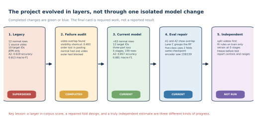

## 1. Start with the source hierarchy

Not every file in notes describes the current system.

Read evidence in this order:

1. Executable notebook code.
2. Fingerprinted real artifacts, from the resolved artifact root and from nowhere else.
3. classifier_contract.json, result_history.csv, and symmetry_verdicts.csv.
4. Current README and docs tutorials.
5. Historical notes and archived plans.

The current final experiment is:

~~~text
artifact root (resolved by docs/artifact_paths.py from GAVD_ARTIFACT_DIR in .env):
experiments/sjepa/gavd6/work/artifacts/real

checkpoint:
sjepa_curriculum_final_augmented.pt

fingerprint:
ea59fea055f0230bcf236deb1d1e8bbf08033766e7cd95a98f28210b3042c4e4

corpus:
159 sequences from 35 source videos
(96 canonical from 18 videos, plus 63 added-normal windows from 17 videos)
~~~

### 1.1 Two in-tree artifact directories are DECOYS. Do not read numbers out of them.

This is the single most expensive mistake available in this repository, and this note itself fell into it,
so work through it carefully.

WHAT EXISTS. Three directories can look like an artifact root:

|Path|Fingerprint it carries|Status|
|---|---|---|
|`experiments/sjepa/gavd6/work/artifacts/real`|`ea59fea0`|AUTHORITATIVE. This is what `GAVD_ARTIFACT_DIR` points at.|
|`gavd6-pm/work/artifacts/real`|`d0acc262`|SUPERSEDED leftover. Complete enough to look real.|
|`gavd6-pm/cache/artifacts/real`|legacy `dabf5dc2` normal-only checkpoint only|Historical. Keep for the legacy baseline, quote nothing else from it.|

WHY THE TRAP WORKS. `resolve_artifacts()` in `docs/artifact_paths.py` tries the configured root FIRST, then
the in-tree `work` directory, then the in-tree `cache` directory, and accepts the first candidate that
holds a `classifier_contract.json`. Since the configured root wins, every tool reads `ea59fea0`. But a
human opening `gavd6-pm/work/artifacts/real/classifier_metrics.csv` by hand gets the `d0acc262` numbers
with no warning at all, because that file is a valid, complete, internally consistent bundle. It is simply
the previous run.

WHAT WE OBSERVED. Every stale figure that this note used to carry, feature standard deviation 0.414, pair
cosine 0.609, the normal-anchor chain ending at 0.594, silhouette 0.009, all-96 accuracy 0.793, exact-split
0.714 and 0.742, stroke F1 0.333, and the Lane C pair 0.653 and 0.625, traces to that one superseded
in-tree bundle.

WHAT TO DO INSTEAD. Confirm the root before reading anything:

~~~bash
MPLCONFIGDIR=cache/matplotlib .venv/bin/python -c \
  "import sys; sys.path.insert(0, 'docs'); import artifact_paths; print(artifact_paths.resolve_artifacts())"
~~~

Then check that the fingerprint in the file you are about to quote starts with `ea59fea0`. If it starts
with `d0acc262`, you are holding the previous run and the number is superseded. Do not delete either
in-tree directory; they are the record of how the project got here.

The two archived planning files begin with explicit warnings:

- [04_improvement_plan.md](04_improvement_plan.md)
- [05_improvement_instr.md](05_improvement_instr.md)

They contain ideas that were considered, not a record of everything that was implemented.

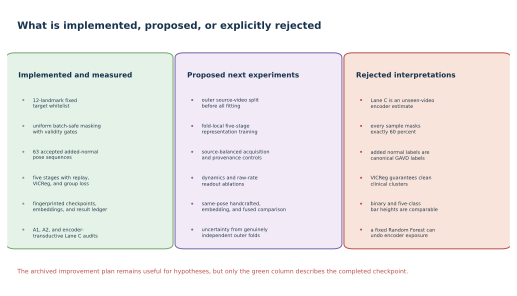

## 2. Map the notes directory to the project history

|File|Historical role|How to use it now|
|---|---|---|
|01_train_sjepa.md|Original tutorial and research brief|Explains the stable normal-first and fixed-whitelist goals.|
|02_paper_draft.md|Early paper framing|Preserves the 82-feature motivation and condition background.|
|03_nextstep_improvements.md|Request for a systematic improvement plan|Explains why the audit began.|
|04_improvement_plan.md|Failure analysis and experiment proposals|Use for hypotheses only. Verify every idea against current code.|
|05_improvement_instr.md|Archived execution prompt|Do not treat its success criteria as completed results.|
|06_literature_findings.md|Citation verification log|Use to avoid known citation errors and to find primary sources.|
|07_adding_diversity.md|Method pivot instruction|Introduces the five-stage curriculum, VICReg, and fixed mapping-based targets.|
|08_codex_review_log.md|Late adversarial review record|Useful but incomplete. It starts after the core training changes.|
|09_diagram_design_system.md|Vector-graphic rules|Use when adding or revising tutorial SVGs.|
|10_sjepa_evolution_tutorial.md|Current evolution map|Use as the maintainer entry point.|
|11_class_docs.md|Task prompt for class documentation|A prompt, not a result. Do not read its criteria as completed work.|
|20_idea_expansion.md, 21_idea_expansion_claude.md|Task prompts that commissioned the twelve proposals|Prompts, not results.|
|22_idea5_signed_laterality.md|Task prompt that commissioned Idea 5|A prompt. The measured Idea 5 outcome lives in `ideas-claude/`, not here.|
|23_scorecard_explanation.md|Task prompt for the scorecard explainer|A prompt, not a result.|
|ideas-claude/|Twelve graded proposals, two of which have since RUN|`SCORECARD.md` holds proposal-quality design scores, never outcomes. The measured Idea 5 and Idea 9 verdicts are in `ideas-claude/09-reflection-equivariant-symmetry-axis/IMPLEMENTATION.md`.|

## 3. Generation 1: reconstruct the legacy baseline

The legacy result was not simply a smaller version of the current training run. It represented a different methodology layer.

### Legacy training facts

|Item|Legacy state|
|---|---|
|Normal sequences|12|
|Normal source videos|1|
|Eligible landmark identities|10|
|Representation stages|1 normal-only stage|
|Objective|Centered and sharpened JEPA cross-entropy|
|Active anti-collapse regularizer|None|
|Downstream vector|384-dimensional global and authorized mean/std|
|Main exact-exp5 result|0.619 accuracy, 0.596 balanced accuracy, 0.613 macro-F1|

Every value in that table is LEGACY and is retained only to explain the evolution. None of it describes the
current model.

The retained file `sjepa_normal.pt` contains a normal-only real checkpoint for 12 sequences and one video.
Two things about it need care. First, its stored dataset fingerprint begins `dabf5dc2`, and the payload
confirms the legacy identity: exactly 12 sequences and the 10-identity whitelist
`[11, 12, 23, 24, 25, 26, 27, 28, 31, 32]`, with no heels. Second, the file does NOT live in the current
artifact root. It survives only in the old in-tree `gavd6-pm/cache/artifacts/real`, which is the third and
last candidate `resolve_artifacts()` would ever consider. That is the correct place for a historical
artifact, but it means the legacy checkpoint and the current checkpoint are never siblings on disk, so
never compare their neighbouring files as if they came from one run.

The historical 0.619, 0.596, and 0.613 values are rounded ledger records recovered from commit `cc6e6de`,
not values recomputed from a live artifact. Treat them as a recorded baseline rather than as a
reproducible measurement.

### Why the baseline was still useful

It established that:

- the video-to-pose-to-token path ran end to end;
- a target encoder and predictor could be trained on real skeleton data;
- a frozen 384-dimensional readout could feed the same style of Random Forest used in the comparison;
- the main weaknesses could be measured rather than guessed.

### What not to say

Do not say that the legacy 61.9 percent result measured unseen-video performance. Every exact-split test video overlapped classifier training, and the dataset was too small to support an independent five-class pipeline test.

The same prohibition applies to every CURRENT number in this note, and for the same reason. The current
exact-split 0.857 accuracy, the current all-96 0.759, and even the grouped Lane C scores are all
transductive: the encoder trained on every row it is later scored on. They are descriptive readouts of a
known corpus. None of them is a statement about a new video, a new person, or a diagnosis. GAVD folder names
are dataset annotations, and the added normal clips were produced by this project and were not independently
clinically reviewed.

## 4. The six-part audit that motivated the redesign

The archived improvement plan identified six root causes. The current repository addresses some, but not all, of them.

|Audit finding|Evidence|Current response|Remaining issue|
|---|---|---|---|
|Normal pretraining used one source video|12 rows, one video|Added 17 normal videos and accepted 63 windows|Added-normal acquisition differs from abnormal acquisition|
|Only ten landmark identities were eligible|Legacy whitelist|Restored heels 29 and 30 for a 12-identity whitelist|Whitelist is still a project rule|
|No active anti-collapse term|JEPA-only objective|Added VICReg|VICReg prevented total collapse, final feature standard deviation 0.363, but it did not create clean five-class geometry, cosine silhouette 0.054|
|Only normal data shaped the representation|Normal-only checkpoint|Added four cumulative condition stages|Later stages use labels and are not pure SSL|
|Sequence splits reused source videos|Leakage audit|Added explicit A1/A2 warnings and grouped-RF Lane C|Encoder still saw all evaluated rows|
|Mean/std pooling removed temporal order|384-D readout|Documented clearly|Dynamics-preserving pooling is still proposed|

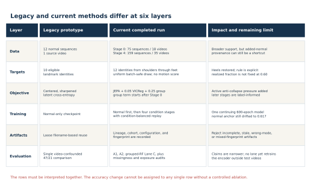

## 5. Generation 2: understand the added-normal pipeline

The added cohort was not produced by copying arbitrary pose files into a folder. It used a separate annotation, tracking, windowing, extraction, and coverage path.

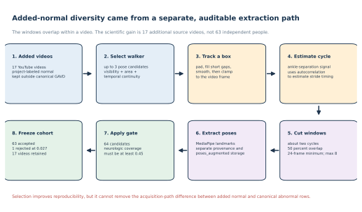

### 5.1 Subject selection

The annotation script can inspect up to three pose candidates. It scores:

- visible body area;
- landmark confidence;
- continuity with the previously selected location.

The continuity term reduces identity switches when more than one person appears.

### 5.2 Bounding-box construction

The selected pose creates a box that is:

1. padded;
2. filled across short gaps;
3. smoothed over time;
4. clamped to valid frame coordinates.

These are automatic project boxes. They are not human-authored GAVD boxes.

### 5.3 Cycle-based windowing

The script uses ankle-separation autocorrelation to estimate periodic motion. It searches a plausible step-period region, converts that to a stride estimate, and cuts windows of about two cycles.

Windows overlap by 50 percent. A clip must contain at least 24 frames, and no clip contributes more than eight windows.

This means:

> 63 accepted windows are not 63 independent people.

The defensible diversity statement is:

> The Stage 0 training set contains normal windows from 18 source videos, including 17 added videos.

### 5.4 Coverage selection

The extraction report is the cohort contract:

~~~python
accepted = neuro_observed >= 0.45
~~~

The current report holds 64 extracted candidate windows. 63 cleared the 0.45 bar and were accepted. The one
rejection had 0.027 neurologic-landmark coverage, so effectively none of the joints the method is allowed to
predict were visible. Notebook 04 and notebook 06 both resolve accepted sequence IDs from the report and
require their pose files to exist, which is why the accepted count of 63 also appears in the contract as
`augmented_normal_sequences`.

### 5.5 Provenance caution

Sixty-three of 75 normal Stage 0 rows use this added path. All abnormal rows use the canonical path.

The path-label association can create a shortcut even when source videos are grouped at the classifier.

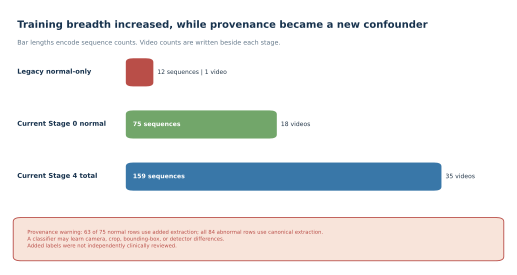

## 6. Generation 2: trace the 10-to-12 target change

The executable whitelist is:

~~~python
MASK_KEYPOINTS = [
    11, 12,
    23, 24,
    25, 26,
    27, 28,
    29, 30,
    31, 32,
]
~~~

The new identities are:

|Index|Landmark|
|---:|---|
|29|Left heel|
|30|Right heel|

The current set therefore covers shoulders, hips, knees, ankles, heels, and foot indices.

All 33 identities may remain visible. Only the 12 listed identities may become hidden prediction targets.

### 6.1 Verify the invariant

Notebook 03 checks:

~~~python
forbidden = sorted(set(range(33)) - set(MASK_KEYPOINTS))
assert not mask[:, :, forbidden].any()
~~~

If this assertion fails, the method has changed. That change needs a new fingerprint and a new experiment name.

### 6.2 Understand the common-count rule

Suppose a batch has valid eligible counts:

~~~text
180, 160, 150, 175
~~~

The mask count is:

~~~text
floor(0.60 x 150) = 90
~~~

Every sample receives 90 targets. Only the sample with 150 eligible positions realizes 0.60.

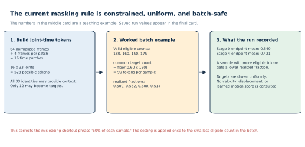

Read from the current training history at the resolved artifact root, the final Stage 0 epoch recorded
0.550 mean eligible masking and the final Stage 4 epoch recorded 0.427. Both sit well below the configured
0.60, which is the expected consequence of the common-count rule rather than a defect.

Do not write “the method hides 60 percent of every sample.” Write:

> The configured fraction is applied to the smallest valid eligible count in the batch, and the resulting common target count is used for every sample.

## 7. Generation 3: trace the three-part objective

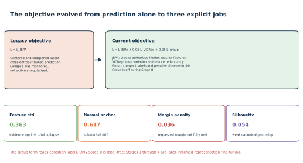

The total current loss is:

$$
L = L_{\mathrm{JEPA}} + 0.05L_{\mathrm{VICReg}} + 0.25L_{\mathrm{group}}.
$$

### JEPA job

Predict the target encoder's latent distribution at valid authorized hidden positions.

### VICReg job

Use two transformed views to:

- align representations of the same sequence;
- keep each projected dimension variable;
- reduce off-diagonal covariance.

### Group job

After Stage 0:

- pull each sample toward its condition centroid;
- penalize centroid pairs closer than margin 1.0.

The group term reads condition labels. Use the following language:

- Stage 0: label-free normal-gait representation learning.
- Stages 1 to 4: label-informed representation fine-tuning.

Do not describe the complete curriculum as purely self-supervised.

## 8. Generation 3: trace what continues and what restarts

The model lineage is continuous. The optimizer lineage is not.

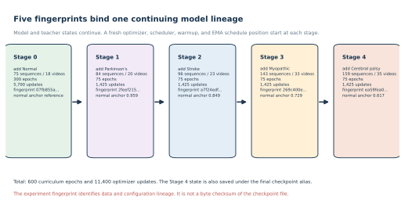

### State that continues

- view encoder;
- predictor;
- EMA target encoder;
- target center;
- VICReg projector;
- normal anchor for drift measurement.

### State that restarts at each stage

- AdamW optimizer;
- optimizer moments;
- learning-rate scheduler;
- warmup position;
- EMA schedule position.

Notebook 04 makes this explicit in train_stage:

~~~python
optimizer = torch.optim.AdamW(...)
scheduler = ...
~~~

These objects are created for each stage. The checkpoint does not store optimizer or scheduler state.

### Why restart deliberately

Stage 0 uses learning rate 0.001. Later stages use 0.0003. Restarting gives each new condition stage a fresh lower-rate schedule without discarding the learned model parameters.

### Balanced replay example

At Stage 4, five conditions are active and each contributes four rows per batch:

~~~text
5 conditions x 4 rows = batch size 20
~~~

The largest group has 75 rows:

~~~text
ceil(75 / 4) = 19 batches per epoch
~~~

Smaller groups cycle through repeated permutations. This balances condition contribution per batch, not the number of unique rows in storage.

## 9. Follow the checkpoint contract instead of filenames alone

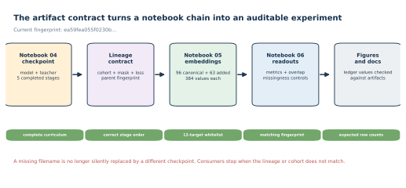

The current Stage 4 fingerprint chain, read stage by stage out of the five checkpoints at the resolved
artifact root, is:

~~~text
07fb855a... normal              (75 rows)
    -> 2feef215... add Parkinson's   (84 rows)
    -> a7f24edf... add stroke        (96 rows)
    -> 269c400e... add myopathic     (143 rows)
    -> ea59fea0... add cerebral palsy (159 rows)
~~~

Each checkpoint stores its own `dataset_fingerprint` and the `parent_fingerprint` of the stage before it,
so the chain is verifiable rather than asserted. The contract's `checkpoint_parent_fingerprint` is
`269c400e`, which is exactly the Stage 3 fingerprint above, and that is the cheapest single check that the
lineage in front of you is the current one.

An older chain beginning `0a14fe12` and ending `d0acc262` appears in superseded material. That chain is the
previous run. If you see it, you are reading history.

The final alias and the Stage 4 checkpoint contain the same final model state:

~~~text
sjepa_stage_04_cerebralpalsy_augmented.pt
sjepa_curriculum_final_augmented.pt
~~~

### 9.1 Why the old FileNotFoundError happened

The completed run used the augmented cohort, so notebook 04 produced the augmented final alias. A later notebook asked for the canonical alias:

~~~text
sjepa_curriculum_final.pt
~~~

That file represented a different cohort contract and did not exist.

The current selection rule is:

~~~text
SJEPA_INCLUDE_AUGMENTED_NORMAL=1
    -> sjepa_curriculum_final_augmented.pt
~~~

Notebook 05 and notebook 06 list available final files and fail clearly when the requested cohort variant is missing. They do not silently fall back to a different run.

### 9.2 What consumers verify

- run mode;
- five completed stages;
- condition order;
- 12-identity whitelist;
- sequence and video counts;
- checkpoint fingerprint;
- embedding fingerprint;
- accepted augmented cohort;
- exact split identifiers.

## 10. Read training health as a set of tests

Ask one question at a time. For each one, separate what we OBSERVED from what the observation does and does
not support. Every number below was read from `curriculum_stage_summary_augmented.csv` and
`curriculum_training_history_augmented.csv` at the resolved artifact root, on the `ea59fea0` lineage.

### Did training finish?

OBSERVED. All five stages completed, 600 curriculum epochs and 11,400 optimizer updates, and all planned
checkpoint aliases were written.

SUPPORTED. The run is complete, so its outputs are eligible to be quoted at all.

NOT SUPPORTED. Completion says nothing about quality. A finished run can still have collapsed.

### Did every feature become constant?

OBSERVED. The final feature standard deviation was 0.363, which is not near zero. The mean pairwise cosine
was 0.660, which is not near one.

SUPPORTED. Total representation collapse did not happen. Something survived training.

NOT SUPPORTED. This does not mean the representation is good, only that it is not degenerate. Note the
direction of each number across the curriculum: standard deviation fell from 0.413 after Stage 1 to 0.363
after Stage 4, and pairwise cosine ROSE from 0.509 to 0.660. Features became somewhat less spread out and
somewhat more alike as conditions were added. That is partial concentration, not collapse, and it is worth
watching in any future run.

NEXT VALID STEP. Track both quantities per stage in any new run, and treat a standard deviation trending
toward zero together with a cosine trending toward one as a stop condition.

### Did the normal representation remain stable?

OBSERVED. Normal-anchor cosine, which compares the current normal representation against the frozen Stage 0
anchor, fell monotonically:

~~~text
Stage 1: 0.959
Stage 2: 0.849
Stage 3: 0.729
Stage 4: 0.617
~~~

SUPPORTED. Balanced replay slowed but did not prevent substantial drift. By the end of the curriculum the
normal representation is meaningfully different from the one Stage 0 produced.

NOT SUPPORTED. Drift is not by itself evidence of forgetting a useful property, because nothing here
measures normal-gait quality directly. It is a warning flag, not a verdict.

NEXT VALID STEP. If normal stability matters for a downstream claim, measure that property directly at each
stage rather than inferring it from anchor cosine.

### Did the group term produce clean clusters?

OBSERVED. No. The final centroid-margin penalty remained positive at 0.036, meaning at least one centroid
pair was still closer than the margin of 1.0 when training ended. Independently, notebook 05 measured a
canonical cosine silhouette of 0.054.

SUPPORTED. The label-aware group term did not succeed in separating five conditions into clean global
clusters, even though it read the labels. Both the training-time diagnostic and the post-hoc geometry audit
agree, which matters because they are computed differently.

NOT SUPPORTED. A silhouette near zero does not mean the features are useless, as section 12 explains at
length. It means one compact global group per condition is not the shape of this representation.

### Why not compare all centroid numbers directly?

The Stage 4 training diagnostic uses Euclidean distance over the active training representations, and
records a minimum centroid distance of 0.259 and a mean of 0.891. Notebook 05 uses cosine distance over
384-dimensional canonical pooled vectors, and records 0.026 and 0.313. They use different vectors, different
corpora, and different metrics, so the pairs are not comparable and must never be placed in one table.

## 11. Understand the 384-D bottleneck

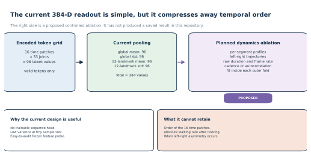

The current vector is:

~~~text
global valid mean          96
global valid std           96
authorized valid mean      96
authorized valid std       96
-----------------------------
total                     384
~~~

This design is:

- parameter-free;
- easy to audit;
- relatively stable for a tiny classifier sample.

It does not preserve:

- the order of the 16 time patches;
- native duration after resizing;
- native frame rate;
- when left-right asymmetry occurs.

The dynamics-preserving readout on the right side of the figure is proposed, not implemented.

FORWARD POINTER on the last item in that list. Whether the encoder holds a readable signed left-minus-right
asymmetry has since been MEASURED three separate ways, so it is not an open question. The short version is
that the pooled readout is not the bottleneck: a differently shaped readout and then a fully retrained
encoder were both tried, and neither earned the claim. The three verdicts and what each one licenses are
summarized in section 13.4 of this note and treated in full in
[ideas-claude/09-reflection-equivariant-symmetry-axis/IMPLEMENTATION.md](./ideas-claude/09-reflection-equivariant-symmetry-axis/IMPLEMENTATION.md),
sections 9a and 9b.

## 12. Explain why geometry and Random Forest accuracy can disagree

Canonical geometry on the current `ea59fea0` checkpoint, from
`curriculum_representation_geometry.csv`, is:

~~~text
cosine silhouette                  0.054398
minimum centroid distance          0.025675
mean centroid distance             0.313160
mean within-condition distance     0.104404
~~~

The all-96 Random Forest scored 0.759 accuracy, 0.849 balanced accuracy, and 0.803 macro-F1 on the same
checkpoint.

Work through why those two paragraphs are not a contradiction.

OBSERVED. The silhouette is 0.054, which is close to zero on a scale where 1.0 would be perfectly separated
clusters. The closest two centroids sit 0.026 apart while the average distance WITHIN a condition is 0.104,
which is four times larger. So the nearest two conditions are far closer to each other than a typical pair
of clips from the same condition. Meanwhile a Random Forest on the same vectors classifies 22 of 29 held-out
rows correctly.

SUPPORTED. Both are true because they ask different questions. A centroid audit asks whether each condition
forms ONE compact global blob. A Random Forest never needs a global blob; it carves feature space into many
small local regions with nonlinear splits, and a handful of tight local pockets is enough for it. The
closest centroid pair is myopathic and cerebral palsy at 0.026, and those are exactly the two classes the
confusion matrix in section 14 confuses, so the geometry audit correctly predicted where the classifier
would struggle.

NOT SUPPORTED. A strong exposed-corpus score does not imply clean or generalizable geometry, because the
forest can also lean on things that have nothing to do with gait:

- source-video identity;
- person appearance expressed through pose;
- crop style;
- missingness;
- extraction provenance;
- condition labels already used during encoder training.

NEXT VALID STEP. Read the geometry audit as a map of which class pairs are genuinely close, then check
whether the classifier's errors land on those same pairs. When they do, as they do here, the score is
resting on local structure rather than on a clean condition axis.

## 13. Trace result evolution at the correct layer

Every current value in this section was read from `result_history.csv` and cross-checked against
`classifier_metrics.csv`, `exp5_comparison.csv`, and `lane_c_video_disjoint_metrics.csv` at the resolved
artifact root. Every current row carries the `ea59fea0` fingerprint.

### 13.1 Model revision on the same exact split

|Metric|Legacy (superseded)|Current `ea59fea0`|Change|
|---|---:|---:|---:|
|Accuracy|0.619|0.857|+0.238|
|Balanced accuracy|0.596|0.891|+0.295|
|Macro-F1|0.613|0.881|+0.268|

OBSERVED. On the identical exact 47/21 exp5 assignment, the current model scores far higher than the legacy
normal-only prototype on all three metrics.

SUPPORTED. The engineering rebuild moved this readout a lot. As a directional regression check, the rebuild
did not break anything on the lane the project has tracked longest.

NOT SUPPORTED. This is not an ablation and it attributes nothing. Data, eligible targets, objective,
curriculum, and training exposure all changed together, so the change cannot be assigned to any one of them.
It is also not a generalization result: `leakage_audit.csv` records that all 9 test videos also appear in
classifier training and all 21 test rows trained the representation, so the number is descriptive and
transductive.

NEXT VALID STEP. If attribution matters, change one layer at a time against this same split, and keep the
exposure audit attached to every score.

### 13.2 Evaluation repair, which changes no model at all

The Lane C five-class fold DESIGN was repaired. Read the repair as a design lesson rather than as a delta,
because the two rows below were also produced on different lineages.

|Lane C five class|Design|Accuracy|Balanced accuracy|Macro-F1|Lineage|
|---|---|---:|---:|---:|---|
|Superseded|5 ordinary GroupKFold folds|0.604|0.595|0.407|`d0acc262`, superseded|
|Current|2 StratifiedGroupKFold folds, mean|0.614|0.615|0.615|`ea59fea0`|
|Current|2 StratifiedGroupKFold folds, pooled out-of-fold|0.616|0.613|0.610|`ea59fea0`|

OBSERVED. The superseded design put no cerebral-palsy rows in one training fold, and its macro-F1 averaged
across folds whose label sets differed. Its macro-F1 of 0.407 is therefore not a five-class score at all. The
current design guarantees all five labels in both portions of both folds, and reports macro-F1 near 0.615.

SUPPORTED. Averaging a macro metric over folds with different label sets produces a number that answers no
single question. Fixing the fold design fixed the metric. Parkinson's and cerebral palsy each have only two
source videos, so two stratified group folds are the largest design that can keep every class on both sides
of every split.

NOT SUPPORTED. The gap between 0.407 and 0.615 is NOT a model improvement, and it is also not a clean
same-lineage repair delta, because the superseded audit was run on the earlier `d0acc262` lineage while the
corrected numbers are on `ea59fea0`. The ledger keeps the same-lineage repair pair under its
`_d0acc262`-suffixed rows for anyone who needs the isolated design effect. Do not subtract across the two
lineages and call the difference anything.

NEXT VALID STEP. Fix the fold design before quoting any grouped macro metric, and record the lineage on
every row so a later reader can tell a design repair from a re-run.

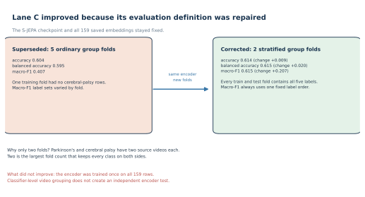

### 13.3 Additional historical regression checks

The result ledger preserves these legacy-to-current accuracy changes:

|Readout|Legacy (superseded)|Current `ea59fea0`|
|---|---:|---:|
|All-96 five class|0.621|0.759|
|Parkinson's versus normal|0.714|1.000|
|Stroke versus normal|0.857|1.000|
|Myopathic versus normal|0.778|1.000|
|Cerebral palsy versus normal|0.889|1.000|

OBSERVED. All four one-versus-normal binaries now score a perfect 1.000, and the five-class all-96 lane rose
from 0.621 to 0.759.

SUPPORTED. Nothing regressed. As regression checks these pass.

NOT SUPPORTED. A perfect score on four separate tests is a warning, not a triumph. The binary tests have
only 7 to 18 test rows each, every test video also appears in classifier training, and the encoder already
saw every row. A ceiling reached on tests that small and that exposed is what an easy, confounded task looks
like. These four 1.000 values must never be quoted as accuracy of the method.

NEXT VALID STEP. Retire the binaries as headline numbers. They are useful only to detect breakage, and a
score that cannot go higher can no longer detect improvement either.

### 13.4 Three results in this package are not classifier scores

The reflection-symmetry investigations produced the project's most informative findings, and they are graded
on preregistered verdicts rather than on accuracy. All three are evaluated on the same 96-sequence,
18-source-video cohort, and all three are transductive. Idea 5 and Idea 9 Arm 1 read out of this exact frozen
`ea59fea0` checkpoint. Idea 9 Arm 2 retrains the encoder from scratch per seed and per rung, so for that arm
the `ea59fea0` fingerprint names only the baseline reference row rather than the rungs themselves.

|Experiment|What it changed|Verdict|What that word means|
|---|---|---|---|
|Idea 5, `nb_05a`|nothing; read out of the frozen encoder|**INFORMATIVE NULL**|the measurement was valid and the answer was no|
|Idea 9 Arm 1, `nb_09a`|the readout's shape only|**ARTIFACT (side-agnostic nuisance control fired)**|the claim is WITHDRAWN rather than answered, a weaker state than a null|
|Idea 9 Arm 2, `new_nb_09_00..03`|the encoder itself|**NO CREDIT**|the effect is real and large, but a preregistered guardrail failed and supplies a competing explanation|

Two things to carry away without needing the full treatment. First, in all three the informative element was
a CONTROL rather than the treatment: an untrained floor, then a side-blind lane, then a feature-spread
guardrail. Second, the binding constraint is the COHORT rather than the model or the readout, because only
7.5 percent of the labelled target's variance lies between the 18 source videos against a preregistered 30
percent, a fact measured in `nb_09a` and nowhere else.

The machine-readable record is `docs/symmetry_verdicts.csv`, which carries one row per verdict with the
treatment lane, the deciding control lane, and the fingerprint. The full comparison, the numbers, and the
register of superseded claims are in
[ideas-claude/09-reflection-equivariant-symmetry-axis/IMPLEMENTATION.md](./ideas-claude/09-reflection-equivariant-symmetry-axis/IMPLEMENTATION.md),
sections 9a and 9b. Do not restate those numbers here; quote that file or the ledger.

## 14. Use class-level examples

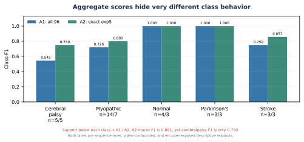

A macro average hides which class is actually failing, so always open the per-class report. Both tables below
are the current `ea59fea0` values, from `five_class_classification_report.csv` (the A2 exact-exp5 lane) and
`all_sequences_classification_report.csv` (the A1 all-96 lane).

|Condition|A1 all-96 F1|A1 support|A2 exact-exp5 F1|A2 support|
|---|---:|---:|---:|---:|
|normal|1.000|4|1.000|3|
|parkinsons|1.000|3|1.000|3|
|stroke|0.750|3|0.857|3|
|myopathic|0.720|14|0.800|7|
|cerebralpalsy|**0.545**|5|**0.750**|5|
|macro average|0.803|29|0.881|21|

OBSERVED. On both lanes the weakest class is cerebral palsy, and on both lanes its failure mode is the same:
recall 0.600, meaning 2 of its 5 test rows were called myopathic. Normal and Parkinson's are perfect on both
lanes. A1's macro-F1 of 0.803 sits well above its weakest class F1 of 0.545, which is exactly the gap a macro
average conceals.

SUPPORTED. Cerebral palsy and myopathic are the hard pair for this representation. That agrees with the
geometry audit in section 12, where those two centroids are the closest of all pairs at 0.026 apart. Two
independent measurements pointing at the same pair is stronger evidence than either alone.

NOT SUPPORTED. The perfect normal and Parkinson's scores are not evidence that those conditions are easy in
general. Normal has 4 test rows from a single source video and Parkinson's has 3 from two videos, so a
perfect score there is a small-sample result on an exposed split.

Now look at where the errors physically come from. The A2 exact-exp5 lane made 3 errors on 21 rows:

~~~text
DlPDuHBAP7A:
  2 cerebral-palsy rows -> myopathic

05oyBOE_0UE:
  1 myopathic row -> stroke
~~~

The A1 all-96 lane made 7 errors on 29 rows:

~~~text
8PPLTf0fZsY:
  2 myopathic rows -> cerebral palsy
  1 myopathic row  -> stroke

DlPDuHBAP7A:
  2 cerebral-palsy rows -> myopathic

R8LRCiTvUz8:
  1 myopathic row -> cerebral palsy

05oyBOE_0UE:
  1 myopathic row -> stroke
~~~

OBSERVED. Of A2's 3 errors, 2 come from one video. Of A1's 7 errors, 3 come from one video.

SUPPORTED. Those clustered errors are not independent failures. Windows from one video share a person, a
camera, a crop style, and a detector behaviour, so if the representation misreads that person it will
usually misread every window from them. Counting them as separate mistakes overstates how many distinct
things went wrong, and it also overstates the precision of any confidence interval built from row counts.

NEXT VALID STEP. Keep `video_id` in every error table, and count errors by source video as well as by row.
That is why the artifact writes the column at all.

## 15. Keep the three evaluation lanes separate

A score only means something once you know which lane produced it. Always quote the lane, its control, and
its exposure in the same breath as the number. Every value below is the current `ea59fea0` reading, with
exposure taken from `leakage_audit.csv` and controls from `missingness_only_classifier_metrics.csv`.

### A1

- 96 canonical rows;
- stratified 67/29 sequence split;
- all 16 test videos overlap classifier training;
- all 29 test rows trained the representation;
- current score 0.759 accuracy, 0.849 balanced accuracy, 0.803 macro-F1;
- controls on the same split: majority 0.483, missingness-only 0.483.

The controls matter more than the score. A missingness-only classifier, which sees nothing but which
landmarks were absent, reaches 0.483 here, so only the margin above 0.483 can possibly be about gait.

### A2

- historical 68-row subset;
- exact 47/21 assignment;
- all nine test videos overlap classifier training;
- all 21 test rows trained the representation;
- current score 0.857 accuracy, 0.891 balanced accuracy, 0.881 macro-F1;
- controls on the same split: majority 0.333, missingness-only 0.286.

### Lane C

- 159 rows;
- classifier folds group source videos;
- the representation encoder trained once on all 159 rows;
- binary normal versus abnormal, five grouped folds: 0.780 accuracy, 0.804 balanced accuracy, 0.749 macro-F1,
  0.915 ROC AUC, against a majority baseline of 0.528;
- five class, two stratified grouped folds: 0.614 accuracy, 0.615 balanced accuracy, 0.615 macro-F1, against
  a majority baseline of 0.472.

The binary fold accuracies span 0.731 to 0.830. That is a spread over five related fold scores, not a
population confidence interval, so do not report it as one.

The correct Lane C phrase is:

> classifier-video-disjoint, encoder-transductive.

Each lane also has its own majority class, so the same score means different things on different lanes. The
five-class Lane C majority is:

~~~text
normal = 75 / 159 = 0.472
~~~

The canonical-96 majority is different:

~~~text
myopathic = 47 / 96 = 0.490
~~~

Lane C is the strictest lane in the package, and it is still not a new-video estimate, because grouping the
Random Forest does nothing about the encoder having already seen all 159 rows. Section 16 describes the
experiment that would fix that.

## 16. The still-required outer-fold experiment

For a valid new-video estimate:

1. Split source videos first.
2. Fit every data-dependent rule on outer-training videos only.
3. Initialize a fresh S-JEPA model.
4. Train all five stages using outer-training rows only.
5. Freeze the representation pipeline.
6. Fit the readout on outer-training embeddings.
7. Evaluate once on held-out source videos.
8. Save fold-level predictions and exposure audits.

Grouping only the Random Forest is not sufficient.

## 17. Proposed work that remains unimplemented

The following items are still experiments:

- per-segment temporal pooling;
- raw frame rate, duration, cadence, or autocorrelation features;
- explicit visibility as an encoder input channel;
- MediaPipe FULL;
- One-Euro or Savitzky-Golay smoothing in the canonical path;
- linear or SVM probes;
- logit adjustment;
- handcrafted plus embedding fusion;
- all-joint block or tube masking;
- motion or velocity targets;
- width sweep over 96, 128, 192, and 256;
- EMA capped below 1.0;
- topology bias;
- attentive pooling;
- fold-local five-stage representation training.

Some conflict with the project's fixed-whitelist rule. If tested, they need a separate experiment name and must not silently replace the current baseline.

## 18. Maintainer checklist for the next change

Before editing:

- Write the exact hypothesis.
- Label the change as data, preprocessing, model, objective, readout, evaluation, or reporting.
- Decide whether the current fingerprint must change.
- Decide which current result is the comparison anchor.

During implementation:

- Keep canonical and added cohorts separate.
- Preserve sequence_id and video_id.
- Add an assertion for the intended invariant.
- Save fold predictions, not only aggregate metrics.
- Record encoder exposure.
- Keep smoke and real outputs separate.

After implementation:

- Re-run notebook syntax checks.
- Confirm the final checkpoint exists.
- Confirm the fingerprint in embeddings and metrics.
- Compare against majority and missingness controls.
- Inspect confusion and error tables by source video.
- Update result_history.csv, and symmetry_verdicts.csv if a symmetry verdict changed.
- Mark the old result superseded instead of deleting it, and record its fingerprint on the row.
- Rebuild vector figures from artifacts.
- Update both docs/staged_evolution.md and this note.
- Re-read every current number in this note against the resolved artifact root, not against whichever
  artifact directory happens to be open. Section 1.1 explains why that step is not optional.

## 19. Useful audit commands

Run all of these from the `experiments/sjepa/gavd6-pm` root.

First resolve the artifact root once, and reuse it, so no command can silently read a superseded bundle:

~~~bash
export A=$(MPLCONFIGDIR=cache/matplotlib .venv/bin/python -c \
  "import sys; sys.path.insert(0, 'docs'); import artifact_paths; print(artifact_paths.resolve_artifacts())")
echo "$A"
~~~

Rebuild the figures:

~~~bash
MPLCONFIGDIR=cache/matplotlib .venv/bin/python docs/make_figures.py
MPLCONFIGDIR=cache/matplotlib .venv/bin/python docs/make_evolution_figures.py
MPLCONFIGDIR=cache/matplotlib .venv/bin/python docs/make_symmetry_figures.py
~~~

Check the current contract:

~~~bash
jq '{
  encoder_checkpoint,
  checkpoint_fingerprint,
  checkpoint_parent_fingerprint,
  curriculum_complete,
  conditions_seen,
  mask_keypoints,
  feature_count
}' "$A/classifier_contract.json"
~~~

The fingerprint that command prints must begin `ea59fea0`. If it begins `d0acc262`, stop and re-read
section 1.1.

Inspect the current result ledgers:

~~~bash
column -s, -t < docs/result_history.csv
column -s, -t < docs/symmetry_verdicts.csv
~~~

Refresh the ledgers from the artifacts, or check them without writing:

~~~bash
MPLCONFIGDIR=cache/matplotlib .venv/bin/python docs/refresh_result_history.py
MPLCONFIGDIR=cache/matplotlib .venv/bin/python docs/refresh_result_history.py --check
~~~

The `--check` form writes nothing and exits nonzero if either ledger has drifted from the artifacts, which is
the form to run before quoting any number from this note.

Inspect leakage:

~~~bash
column -s, -t < "$A/leakage_audit.csv"
~~~

Check SVG structure:

~~~bash
find docs/figures images -name '*.svg' -print0 |
  xargs -0 -n1 xmllint --noout
~~~

## 20. Final maintainer summary

The current checkpoint is fingerprint `ea59fea0`, and it represents real engineering progress:

- 18 normal source videos instead of one;
- 12 eligible landmark identities instead of ten;
- active VICReg pressure, with no total collapse: final feature standard deviation 0.363 and mean pairwise
  cosine 0.660;
- one five-stage model lineage, verifiable stage by stage through the parent-fingerprint chain;
- balanced condition replay;
- explicit label-aware group pressure;
- 11,400 optimizer updates;
- fingerprinted embeddings and results, plus two machine-readable ledgers;
- stronger controls and a corrected grouped evaluation.

The current evidence also remains limited, and these are the numbers that limit it:

- normal features drifted to anchor cosine 0.617, down from 0.959 after Stage 1;
- canonical cosine silhouette is 0.054, so there is no clean five-condition cluster structure, and the
  closest centroid pair, myopathic and cerebral palsy at 0.026, is exactly the pair the classifier confuses;
- provenance differs by label, since 63 of 75 normal Stage 0 rows come from the added path while every
  abnormal row comes from the canonical path;
- every current readout lane is encoder-exposed, so all of them are transductive and descriptive;
- the strongest exposed lanes sit close to their own controls in places, for example the all-96 lane at 0.759
  against a missingness-only control of 0.483;
- four one-versus-normal binaries are saturated at 1.000 on 7 to 18 exposed rows, so they can no longer
  detect improvement;
- no complete fold-local representation test exists.

Three findings in this package are not classifier scores at all, and they are the most informative results
here. Idea 5 returned an INFORMATIVE NULL, Idea 9 Arm 1 returned ARTIFACT (side-agnostic nuisance control
fired), and Idea 9 Arm 2 returned NO CREDIT. Those three words mean three different things, they must never
be collapsed into "it did not work", and in all three the informative element was a control rather than the
treatment. Section 13.4 summarizes them and `docs/symmetry_verdicts.csv` records them.

The next milestone should be defined by independence of the evaluation pipeline, not by the largest in-corpus
score. On this cohort the binding constraint is the number of independent source videos, which is 18, and no
change to the model or the readout can move that.
