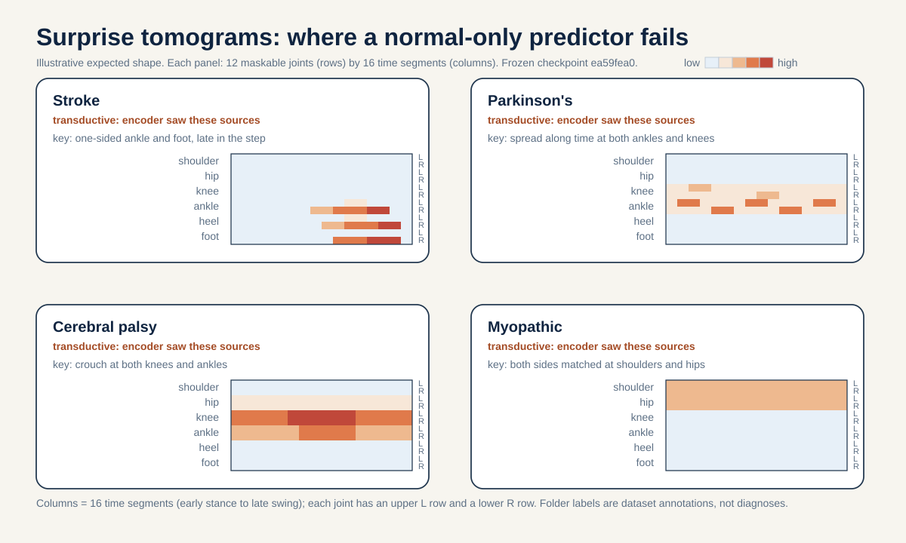
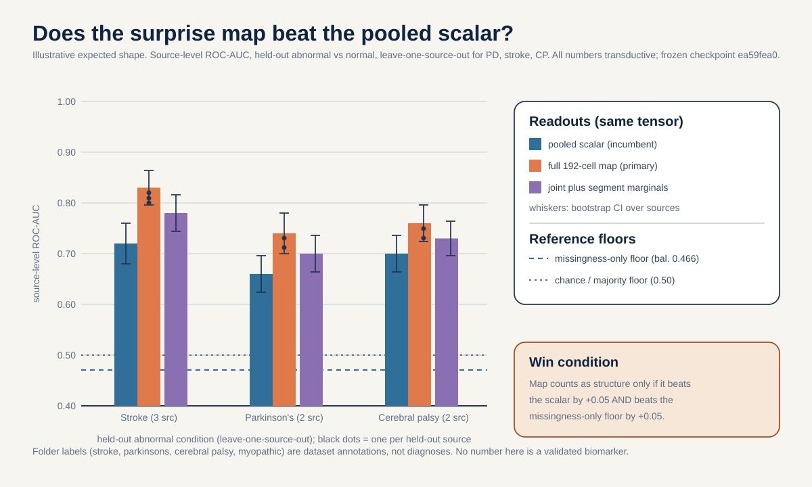
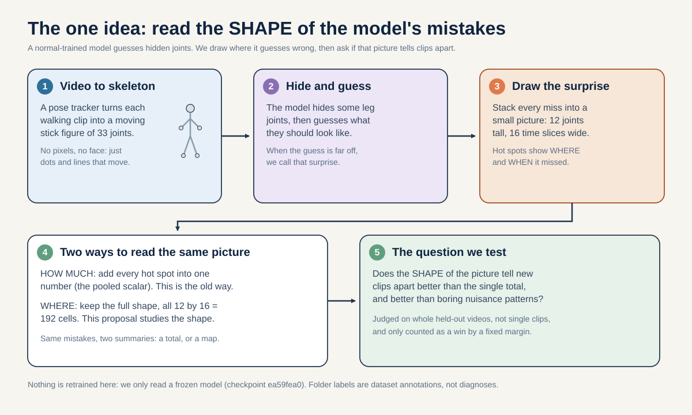

# Idea 2 methodology: how to actually run prediction-error tomography

This document is the plain-language, roll-up-your-sleeves guide to running Idea 2 on real data. It tells you what the question is, why it is worth asking, what data you need, the exact recipe to follow, the decision rule we lock in before we look, the controls that keep us honest, what each possible result would mean, what the study cannot tell us, and how to make it reproducible.

It is grounded, line by line, in the numbers in [`../_shared_facts.md`](../_shared_facts.md) and the biology in [`../_neuro_facts.md`](../_neuro_facts.md). The longer story lives in [`./README.md`](./README.md). Nothing here invents a number. Any worked arithmetic that uses made-up values is clearly labeled "illustrative numbers only". Folder labels (normal, parkinsons, stroke, myopathic, cerebral_palsy) are dataset annotations from GAVD, not diagnoses made by this project, and every result we get on this data is transductive (defined below).

## The big idea in plain words

Imagine you train a model on only healthy walking, so it learns what a normal step should look like. Then you cover up some of the joints in a new clip and ask the model to guess where they are. When the model guesses wrong, we say it was surprised. The usual trick is to add up all the surprise into one number and call a clip "abnormal" when that number is big.

This project asks a sharper question: not how much the model was surprised, but where. Every guess is about one joint at one moment. So all the mistakes together form a little picture, a grid of 12 joints by 16 time slices. We call that picture the surprise image. The claim under test is that the shape of that picture tells conditions apart better than the single total number does, and that the shape is really about walking and not about a boring camera or tracking glitch.

A quick everyday analogy. Suppose you cover part of a friend's face with your hand and guess what is behind it. Sometimes you are a little off, sometimes very off. If you kept track of where you tend to be wrong (always the left eyebrow, say), that map of your mistakes tells you something specific. Adding up your total wrongness into one score throws that map away.

## 1. The question in one sentence

Within the same frozen normal-only surprise tensor, does the shape of the 12-joints-by-16-time-slices surprise image separate held-out abnormal walking from normal walking by a fixed margin we set in advance, beating both the single pooled surprise number and two boring nuisance maps (which joints the tracker lost, and how the clip was cut from video)?

Two endpoints are kept separate on purpose, exactly as the README does. The primary endpoint is the plain "shape beats the single number" contest: can the flattened 192-cell map out-rank the pooled scalar, treated as one big feature vector with no biology attached. The mechanism endpoint is different: does the surprise actually land in the specific cells the biology predicts. A map can win the first contest by loading the "wrong" cells, so we never let a win on one stand in for the other.

## 2. Why this idea, in plain words

The motivation is a real belief about world models. A model trained only on normal motion holds a structured expectation of the body. If that is true, its mistakes are not random. They should cluster by anatomy (which joints) and by timing (when in the step), and that clustering is a richer, cheaper signal than the total amount of error.

The biology (from [`../_neuro_facts.md`](../_neuro_facts.md)) tells us exactly where each condition should push the error, and that is what turns a pretty heatmap into a real, falsifiable prediction. In plain words:

- Stroke is a one-sided problem. A stroke is damage on one side of the brain, and the nerve tract that carries the movement command crosses over to the opposite side of the body (Natali/Javed StatPearls, PMID 30571044, PMID 30521239). So the deficit is one-sided by design. The walking sign is a stiff knee with reduced swing-phase knee bend, plus circumduction and hip-hiking (Chen, Patten, Kothari, Zajac 2005, PMID 15996592). Prediction: the error should pile up on one side, mostly at the knee and ankle rows. Hemiplegic cerebral palsy is the same one-sided story from a one-sided white-matter injury (Volpe 2009, PMID 19081519; Back 2007, PMID 17261726), with crouch defined as at least 30 degrees of minimum stance-phase knee flexion (de Morais Filho 2010, PMID 20300011).
- Parkinson's is a broken-clock problem. Loss of dopamine in the basal ganglia costs the automatic rhythm of walking (Redgrave 2010, PMID 20944662; Wu 2015, PMID 26102020). The hallmark is a jittery stride timing: stride-time variability roughly doubles, with a concrete anchor of stride-time coefficient of variation 8.8 percent in fallers versus 4.2 percent in non-fallers (Schaafsma 2003, PMID 12809998). Prediction: the error should spread along the 16 time columns at both ankles and knees, not sit in one hot cell.
- Myopathy is a both-sides, muscle problem. Primary muscle disease gives symmetric proximal weakness (Barohn 2014, PMID 25037080) with no significant left-right asymmetry (Xiong 2023, PMID 37525241) and an anterior pelvic tilt of 16.4 degrees versus 11.6 degrees, while cadence is preserved (2.25 versus 2.21 steps per second, not significant; Vandekerckhove 2022, PMID 35721358). Prediction: the error should be left-right symmetric and sit in the proximal rows, with the timing spread left intact. One grid note: the weakness is around the pelvis, but the 12-joint grid has no pelvis row (its rows are shoulder, hip, knee, ankle, heel, and foot index), so the pelvic-tilt signal can only surface at the nearest rows the grid has, the hip and shoulder rows. That is where we pre-register the myopathy mass.

The point is that each condition names different rows or a different axis of the same grid. That is what makes a wrong guess visible: if stroke's error were bilateral, or myopathy's were one-sided, the prediction would fail. Skeletons can actually read these cells: markerless capture recovers step timing to about 0.02 seconds per step and sagittal hip, knee, and ankle angles to about 4.0, 5.6, and 7.4 degrees (Stenum 2021, PMID 33891585).

One honest boundary: the grid uses a normalized 64-frame time base (16 positions), not seconds, so the Parkinson's signature here is a within-window spread across the 16 columns, not a cadence-in-hertz claim.

## 3. What data you need

### Internal work: the gavd5 GAVD cohort

The whole primary study runs on data the project already has: the canonical GAVD cohort (Ranjan et al., IEEE Access 2025, DOI 10.1109/ACCESS.2025.3545787). That is 96 sequences from 18 unique YouTube source videos. The per-condition source-video counts are tiny and fixed: normal 1, Parkinson's 2, stroke 3, myopathic 10, cerebral palsy 2. All 12 normal sequences come from a single video (`3KnFt8bH3tE`), which is why "normal" is nearly the same thing as "that one video" and why we cannot do a normal-source holdout.

What shape does the data take? Each clip is a moving stick figure, a skeleton of 33 body joints tracked over time (BlazePose, Grishchenko et al., arXiv:2206.11678). The clip is stretched or squeezed to 64 frames, then 4 frames in a row are grouped into one time patch, giving 16 time positions. With 33 joints that is 33 x 16 = 528 possible joint-time tokens (a token is the smallest chunk the model reads). Only 12 of the 33 joints can ever be hidden as prediction targets: left and right shoulder, hip, knee, ankle, heel, and foot index. So the surprise image is exactly 12 rows (joints) by 16 columns (time), and the biggest fraction of the skeleton that can be masked is 12/33 = 0.364 (about 36 percent, far below the 75 to 90 percent that image and video JEPAs hide).

How a real team obtains and cleans it: this is done already in the project. Clips were pulled from YouTube videos in two ways. The canonical pathway is the plain, direct extraction, and every abnormal clip comes through it. The augmented pathway is an extra way of cutting more normal windows out of video, and most normal clips come through it. Pose is extracted with MediaPipe pose_landmarker_lite in video mode, confidence 0.45, and failed pose rows are kept on the timeline with zero visibility so gait timing is preserved. For this study you do not re-extract anything. You reuse the cached 528-token tensors and their validity masks.

### External reach step: label-level confirmation only

There is no participant-disjoint public skeleton cohort for stroke, cerebral palsy, or myopathy gait, so cross-cohort transfer of the topography itself is an honest limitation, not a claim. The one external anchor is PhysioNet Gait-in-PD (gaitpdb, reported by the dataset as 93 Parkinson's plus 73 controls, DOI 10.13026/C24H3N; those participant counts are the external dataset's own numbers, not from our shared-facts file). It is force and inertial-sensor data, not skeleton, so it can only corroborate the direction of the Parkinson's rhythm-and-variability arm (that stride-time variability separates the groups), not the joint-time-cell topography this proposal measures. It cannot confirm the lateralized stroke or cerebral palsy cells or the symmetric myopathy cells, and we do not claim it does.

The non-clinical multi-view pose cohorts named in the shared facts (CASIA-B, OU-MVLP-Pose, GREW, Gait3D, Human3.6M) are non-clinical and reach-tier. They are not needed for the core of this idea; they are listed for completeness as the only verified external skeleton resources, and none carries a clinical label.

## 4. Step by step, how to do it

Nothing here retrains an encoder. Every step is a test-time read of the frozen `ea59fea0` checkpoint and the cached tensors, so it is CPU-friendly. The whole thing is about 8 to 12 researcher-days, matching the 2-to-3-week core estimate.

1. Bind to one fingerprint (zero-retrain). Use the curriculum-final checkpoint whose fingerprint prefix is `ea59fea0`. A second lineage prefix `dba24a` has been seen locally; ignore it and print the single fingerprint on every figure. This kills the lineage confound before any fitting.
2. Check the representation is neither dead nor perfect (zero-retrain). Confirm the frozen feature-health numbers: final feature standard deviation 0.362567 (not collapsed to a single point) and mean pairwise cosine 0.659870 (clips are related but not identical). What this means: features have real spread and real separation, so there is room for the prediction error to carry usable structure rather than sitting at a trivial floor or ceiling.
3. Build the frozen surprise tensor (zero-retrain, test-time pass). For each clip, run the standard normal-only masked-prediction pass and record the per-target error at every masked joint-time cell. Because the batch-safe sampler leaves some cells unmasked in any single pass, average over repeated fixed-seed mask draws until every one of the 12 x 16 = 192 cells has a matched number of masked observations. The output per clip is a dense 12-by-16 surprise image plus its pooled scalar (the plain mean of those 192 numbers). What 192 means: 12 joint rows times 16 time columns, so 192 error values per clip.
4. Reuse the cached artifacts (zero-retrain). Token tensors, validity masks, and cached missingness features already exist per clip. Join them on clip id, but first verify the provenance column (canonical versus augmented) is present. No new extraction.
5. Compute three readouts from the identical tensor (zero-retrain). From each clip's surprise image compute (a) the pooled scalar (one number), (b) the full 192-cell map (flattened into a 192-length vector), and (c) the two marginals (12 per-joint means and 16 per-segment means, so 28 numbers). All three come from the same error tensor with encoder, loss, and mask fixed, so any difference between them is a readout difference, not a model difference.
6. Freeze the biology reading key before you look at any result. Lock the joint-to-condition prior list now, taken verbatim from `notes/02_paper_draft.md`: stroke gives one-sided reduced hip/knee/ankle range and foot drop at ankle/heel/foot-index; Parkinson's gives asymmetric onset plus cadence-linked timing structure; cerebral palsy gives crouch and knee/ankle/hip asymmetry; myopathy gives bilateral symmetric proximal hip and knee involvement with near-normal step-to-step variability. This is a qualitative reading key for the heatmaps only. It is never fitted and drives no numeric endpoint.
7. Run the source-video-disjoint readout contest (zero-retrain). Hold out whole source videos, never single clips, because clips from one video are not independent. Use leave-one-source-out for Parkinson's, stroke, and cerebral palsy (the conditions with 2 to 3 sources), plot every source as its own dot, and score each readout with source-level ROC-AUC, bootstrap confidence intervals over sources, and a source-level permutation null.
8. Run the synthetic-injection sanity check (zero-retrain). Amplify one-sided knee flexion in the input coordinates, recompute the surprise image, and measure the induced error mass (perturbed image minus baseline, keeping the increase). This tests whether the surprise actually follows the anatomy you perturbed. See the decision rule for its pre-registered 0.60 threshold.
9. Draw the figures and write the verdict. Lock the per-condition heatmaps (fig1), the AUC bar chart with floors (fig2), and the injection-alignment picture (fig3), each with per-source dots and encoder-exposure labels.

## 5. The decision rule, decided in advance

We set every bar before looking, so a pretty result cannot talk us into a claim after the fact.

Primary endpoint: source-level ROC-AUC of the full 192-cell map, minus the same metric for the pooled scalar, macro-averaged over held-out abnormal sources. ROC-AUC in plain words: the chance that a randomly chosen abnormal source is ranked above a randomly chosen normal one; it runs 0 to 1, where 0.5 is a coin flip and 1.0 is perfect. Macro-averaged means we average per condition so a condition with many sources does not swamp one with few.

Pre-registered margin (mirroring plan-01). The map is judged to carry real structure only if both hold:

- (i) full-map AUC beats pooled-scalar AUC by at least +0.05, and
- (ii) full-map AUC beats the missingness-only map AUC by at least +0.05.

What +0.05 means: it is the smallest AUC lead the map must show to count. Condition (i) stops the map from just re-describing the total number. Condition (ii) stops the map from just re-describing which joints the tracker lost. If we set the bar at 0, any random lead would "win", which is exactly the over-reading this rule prevents.

Because there is exactly one normal source, the "abnormal versus normal" comparison is fully source-confounded. So the headline is a within-tensor readout contest (does the map out-rank the scalar on the identical error tensor), not a claim that the map is a deployable abnormal-versus-normal detector. Any absolute AUC against the single normal source is reported only as context.

Separate mechanism gate: the synthetic injection. This is not folded into the AUC decision. We amplify one-sided knee flexion and ask what fraction of the induced error mass lands in the four target cells' rows (the perturbed side's knee and ankle, joints 25 or 26 and 27 or 28, across their 16 time positions). The pre-registered pass rule: at least 0.60 of the induced mass must land there. If the mass were spread blindly across all 12 joints, only 4/12 = 0.333 would land there, so 0.60 is almost twice the blind share. Falling below 0.60 fails: the topography is not tracking anatomy and no clinical reading is warranted.

### Worked example (illustrative numbers only, not measured facts)

The values below are made up to show the arithmetic. Only the +0.05 margin is real.

Suppose we score sources and get these source-level ROC-AUC values:

- Full 192-cell map: AUC = 0.82
- Pooled scalar: AUC = 0.74
- Missingness-only map: AUC = 0.75

Now check both pre-registered conditions:

- Map minus scalar = 0.82 - 0.74 = 0.08. This is at least +0.05, so condition (i) passes.
- Map minus missingness-only = 0.82 - 0.75 = 0.07. This is at least +0.05, so condition (ii) passes.

Both hold, so in this illustrative case we would score the map as carrying real structure. If instead the map had scored 0.78, then 0.78 - 0.74 = 0.04, which is below +0.05, so condition (i) fails and we score a null.

## 6. Controls that keep us honest

- Missingness-only floor. A map built from visibility alone (which joints were found), with no gait coordinates. The all-96 missingness-only readout already scores balanced accuracy 0.466, which is near the low end, so it is a weak nuisance floor the map must clear by +0.05.
- Provenance-only floor. A map built from the extraction-pathway indicator (augmented versus canonical). This catches a map that is really reading how the clip was cut, not the walking. We also restrict the primary contrast to the canonical pathway (every abnormal clip came that way) and keep augmented-normal clips separate and labeled.
- Untrained-encoder floor and random-encoder floor. Run the same pipeline with a random-init encoder of the identical shape. Its surprise structure is the near-chance baseline; the trained model must beat it.
- Note on a raw-coordinate ceiling. Sibling proposal 05 uses a raw-coordinate probe as a ceiling. That does not apply here, because the object under test is a prediction-error tensor made by the frozen predictor, and there is no "where the model was surprised" without a model. The role that ceiling would play (guarding against re-encoding trivial input structure) is instead covered by the missingness-only floor (visibility, no coordinates) and the provenance-only floor (pathway). We state this so the absence is not read as an oversight.
- Source-video-disjoint splits. Hold out whole videos, use leave-one-source-out for PD, stroke, and CP, plot one dot per source, and run a source-level permutation null.
- One-fingerprint binding. Every number is tied to the single `ea59fea0` checkpoint, printed on every figure, so no lineage confound leaks in.
- Matched masked-count per cell (not a per-cell sign test). We average repeated fixed-seed mask draws until every cell has the same number of masked observations, so no cell is advantaged by being masked more often. Comparisons are source-level AUC with bootstrap CIs.
- Encoder-exposure labels. Because the released checkpoint saw all clips, we print "transductive (encoder saw this source)" next to any number where the held-out source still trained the encoder. The source holdout controls the readout, not the encoder, and we say so.

Responsible-use reminder threaded through: folder labels are dataset annotations, not diagnoses.

## 7. What could happen, and what each outcome would mean

- Map wins on the AUC contest (clears +0.05 over both the scalar and the missingness-only floor). This licenses the claim that where the model is surprised carries condition structure that the single pooled number throws away. Future skeleton screening pipelines should read the map, not just the mean, and check it against nuisance maps first. This is still a within-tensor readout claim, not a deployable detector.
- Map ties the scalar (fails +0.05). Informative null: whatever condition signal survives normal-only prediction lives in the total amount of surprise, not its layout, and the extra spatial-temporal detail is just noise at this cohort size. This rules out a plausible belief and is publishable under the ICLR/ICML framing that values informative negatives.
- Map wins the AUC contest but matches the missingness-only or provenance-only map. Then the structure is an acquisition artifact (lost joints or extraction style), not gait, and we must not claim it as a world-model property. The +0.05-over-missingness condition is designed to catch exactly this.
- Injection sanity check passes (at least 0.60 of induced mass in the matched knee/ankle rows). This separately supports the mechanism-organization claim: the surprise really does follow the anatomy you perturb. Reported next to, never merged into, the AUC verdict.
- Injection sanity check fails (below 0.60). Then the topography is not tracking anatomy, and no clinical or mechanism reading of the heatmaps is warranted, even if the AUC contest was won.

## 8. What this cannot tell us

- Transductive. The released checkpoint saw every evaluation clip, so no number here is an out-of-sample performance estimate. These are representation diagnostics on a frozen encoder. A truly held-out estimate would need retraining the whole curriculum inside each source split, which this study does not do.
- Tiny, unequal sample. Sources are as few as one per condition (normal 1). Source-as-a-dot plotting and pooled endpoints are the only defensible readouts; any per-class number would be a single point dressed up as a distribution.
- Provenance confound. Normal is one video on a mostly-augmented path while abnormal is canonical, so a naive normal-versus-abnormal signal can be an extraction difference. The canonical-only contrast and the provenance-only floor mitigate but cannot fully remove this at n = 18 sources.
- Monocular capture. gavd5 is single-view BlazePose (x, y, and a relative z), so out-of-plane motion and true depth are weak, and the cross-view and genuine-mirror questions belong to the external multi-view cohorts, not here.
- Skeleton limits. Skeletons cannot recover kinetics or propulsion (force plates), EMG, spasticity or coactivation, transverse-plane rotation, or an etiologic muscle diagnosis. No clinical-accuracy claim is made on gavd5 at any outcome.

## 9. How to make it reproducible

- One checkpoint. Bind to `ea59fea0` and print the fingerprint on every figure and in the results file. Never mix in the `dba24a` lineage.
- Fixed seeds. All mask draws use a fixed seed, and repeat until every cell has a matched masked-observation count, so the surprise tensor is deterministic.
- Save the split manifest. Write out which source video each clip belongs to and which fold held it out, so the leave-one-source-out splits can be re-run exactly.
- Save the frozen prior list. Store the joint-to-condition reading key as a file dated before results, so it is provably pre-registered.
- Save the results. Store per-source AUC dots, bootstrap confidence intervals, the permutation-null distribution, the missingness-only and provenance-only floors, and the injection mass fraction versus 0.60, all in one machine-readable results file bound to the fingerprint.
- Day-5 gate. Continue only if every cell has a matched masked-observation count, the pooled scalar reproduces plan-01's number under one fingerprint, the provenance column is confirmed present, and the feature-health numbers reproduce (standard deviation 0.362567, mean pairwise cosine 0.659870).
- Day-14 gate. Continue to confirmation only if the full-map-minus-scalar delta either clears +0.05 while also beating missingness-only by +0.05, or clearly fails, so the null is decisive. Record the injection mass fraction versus 0.60 as a separate readout, never folded into the AUC decision.

## Glossary

- Token: the smallest chunk the model reads, here one joint at one time patch. There are 33 x 16 = 528 possible tokens per clip.
- JEPA (Joint Embedding Predictive Architecture): a model that hides part of its input and predicts the hidden part in feature space (a summary vector), not raw coordinates.
- Encoder: the small Transformer that turns tokens into features. The online copy sees visible tokens and is trained; the EMA (exponential moving average) target copy sees all tokens and is a slowly trailing average, used as a stable target.
- Predictor: the small network that, given the visible tokens, guesses the features at the hidden positions. How wrong it is, is the prediction error.
- Masking: hiding some tokens so the model has to predict them. Like covering part of a photo with your hand and guessing what is behind it.
- Surprise image (tomogram): the 12-joint by 16-time-slice grid of prediction errors for one clip. Its total (the mean over 192 cells) is the pooled scalar.
- Pooled scalar: the single average of all 192 error cells, the "how much surprise" number.
- Missingness-only: a readout built from joint visibility alone (which joints were found), with no gait coordinates. A nuisance floor.
- Provenance: how the clip was cut from video (canonical direct extraction versus augmented extra windows), not the person or condition.
- Transductive: the model was trained on the very clips you later test. A high transductive score can just mean memorization, not generalization.
- Source-video-disjoint: holding out whole YouTube videos, never single clips, because clips from one video are not independent.
- ROC-AUC: the chance a random abnormal source ranks above a random normal one, 0 to 1, with 0.5 being chance.
- Balanced accuracy: the average of the per-class hit rates, 0 to 1, so it does not reward guessing the biggest class.

## Figures

Figure 1: per-condition 12-joints-by-16-segments source-averaged surprise heatmap, with encoder-exposure labels on each panel. How to read this picture: each panel is one condition; rows are the 12 maskable joints and columns are the 16 time slices; brighter cells are where the normal-trained model was more surprised. The label on each panel reminds you the encoder saw these sources, so this is a transductive view.

Figure 2: bar chart of source-level ROC-AUC for the pooled scalar versus the full map versus the marginals, with bootstrap confidence intervals over sources and the missingness-only and majority-class floors drawn as reference lines. How to read this picture: taller bars rank sources better; the map bar must clear the scalar bar and the missingness-only line by +0.05 to count as a win; each dot is one source.

Figure 3: the synthetic one-sided knee-flexion injection result, showing what fraction of the induced error mass lands in the matched knee and ankle rows against the pre-registered 0.60 threshold and the 0.333 blind-spread baseline. How to read this picture: the bar must reach the 0.60 line for the topography to count as anatomically aligned; the lower 0.333 line is what a blind, anatomy-ignoring spread would give.

## References

- Abdelfattah and Alahi, S-JEPA, ECCV 2024, DOI 10.1007/978-3-031-73411-3_21.
- Assran et al., I-JEPA, CVPR 2023, arXiv:2301.08243.
- Bardes et al., V-JEPA, 2024, arXiv:2404.08471.
- Bardes, Ponce, LeCun, VICReg, ICLR 2022, arXiv:2105.04906.
- Grishchenko et al., BlazePose GHUM, 2022, arXiv:2206.11678.
- Ranjan et al., GAVD, IEEE Access 2025, DOI 10.1109/ACCESS.2025.3545787.
- Kapoor and Narayanan, Leakage and the Reproducibility Crisis in ML-based Science, 2022, arXiv:2207.07048.
- Natali and Javed, StatPearls, corticospinal tract anatomy, PMID 30571044.
- Javed, Reddy et al., StatPearls, corticospinal tract, PMID 30521239.
- Chen, Patten, Kothari, Zajac, Gait Posture 2005, PMID 15996592.
- Patterson et al., Gait Posture 2010 (Symmetry Ratio), PMID 19932621.
- Volpe, Lancet Neurology 2009, PMID 19081519.
- Back et al., Stroke 2007, PMID 17261726.
- de Morais Filho et al., J Pediatr Orthop B 2010 (crouch >= 30 degrees), PMID 20300011.
- Riederer and Sian-Hulsmann, J Neural Transm 2012, PMID 22367437.
- Redgrave et al., Nat Rev Neurosci 2010, PMID 20944662.
- Wu, Hallett, Chan, Neurobiol Dis 2015, PMID 26102020.
- Hausdorff et al., Mov Disord 1998, PMID 9613733.
- Schaafsma et al., J Neurol Sci 2003 (stride-time CV 8.8% vs 4.2%), PMID 12809998.
- Barohn et al., Neurol Clin 2014, PMID 25037080.
- Xiong et al., Biomed Eng Online 2023 (no significant left-right asymmetry), PMID 37525241.
- Vandekerckhove et al., Front Hum Neurosci 2022 (anterior pelvic tilt 16.4 vs 11.6 deg, cadence 2.25 vs 2.21 NS), PMID 35721358.
- Stenum et al., PLoS Comput Biol 2021 (temporal MAE 0.02 s/step, sagittal hip/knee/ankle MAE 4.0/5.6/7.4 deg), PMID 33891585.
- Goldberger et al., PhysioNet Gait in Parkinson's Disease (gaitpdb), DOI 10.13026/C24H3N.
