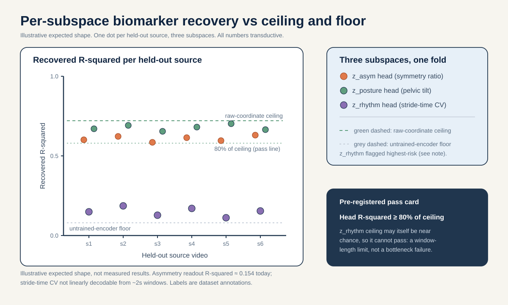
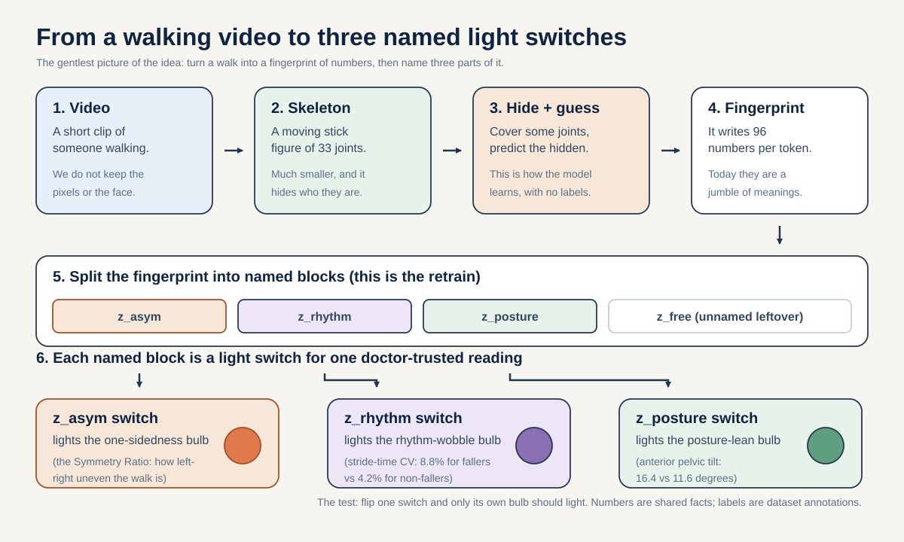
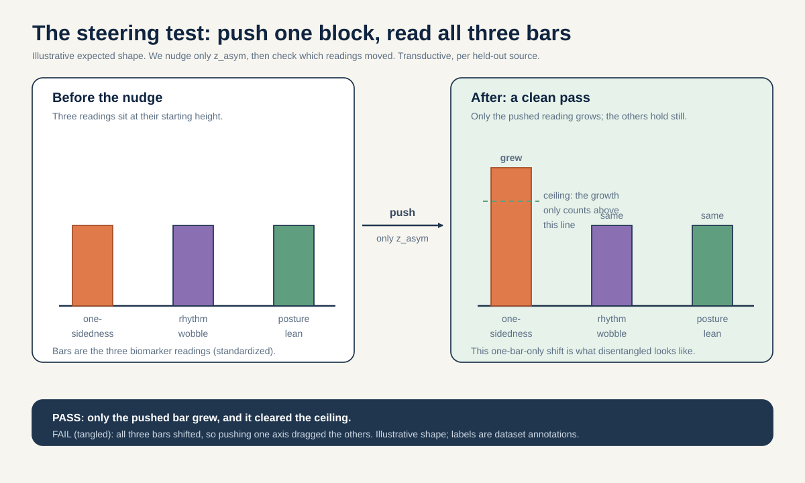

# Concept-bottleneck disentangled S-JEPA: named z_asym / z_rhythm / z_posture subspaces tied to validated biomarkers

> After a full curriculum retrain with three biomarker-supervised latent subspaces, does intervening on one named subspace move only its mechanism-linked biomarker (symmetry ratio, stride-time CV, or anterior pelvic tilt) and leave the other two biomarkers unmoved, by a pre-registered margin, and only where that steerability beats a raw-coordinate probe ceiling?

If you want to actually run this, see METHODOLOGY.md.

## The question in plain words

The big idea in plain words: this project taught a computer to describe how a person walks, using a long list of numbers. Right now that list is a jumble: every number mixes together many different things about the walk. We want to retrain the model so that three small, clearly labeled chunks of that number list each stand for exactly one real, doctor-trusted measurement of walking. Then we test the model like a set of light switches: flip the "one-sidedness" switch and see if only the one-sidedness reading changes, while the "rhythm" and "posture" readings stay put. If the switches are clean, we have a walking-description you can both read and steer, one meaning at a time.

Here is the science this rests on. Different walking problems break walking in different ways, and doctors already have a separate, trusted number for each way.

- Some problems are LATERALIZED, meaning they hurt one side of the body more than the other. A stroke is damage on one side of the brain, and because the nerve wires cross over on their way down (a crossing point called the pyramidal decussation), damage on one side of the brain weakens the opposite side of the body (PMID 30571044). One kind of cerebral palsy comes from a one-sided brain injury early in life that hits the leg wiring (PMID 19081519). Early Parkinson's often starts on one side too, because the brain chemical loss starts on one side (PMID 22367437). The trusted way to measure "how one-sided is this walk" is the Symmetry Ratio, computed from step length, swing time, and stance time (Patterson 2010, PMID 19932621).
- Parkinson's has a second, different fingerprint: the walking rhythm gets shaky. A brain region called the basal ganglia loses its grip on automatic, habitual movement (PMID 20944662, PMID 26102020), so the time between steps wobbles from one step to the next. The trusted way to measure that wobble is the stride-time coefficient of variation (stride-time CV, a "how bumpy is the timing" percentage). People who fall sit near 8.8 percent; people who do not fall sit near 4.2 percent (Schaafsma 2003, PMID 12809998; Hausdorff 1998, PMID 9613733).
- Myopathy is different again. It is a muscle disease that weakens both sides equally, mostly the muscles close to the body's center (PMID 25037080). It does NOT make walking one-sided (PMID 37525241) and it does NOT wreck the rhythm; the step rate stays roughly normal. What it does is tip the posture: weak hip muscles let the pelvis tilt forward, so the anterior pelvic tilt (the forward lean of the pelvis, in degrees) goes up (16.4 versus 11.6 degrees in Duchenne muscular dystrophy, PMID 35721358; weak hip extensors drive that forward tilt, PMID 41034979). A related crouched-knee posture in cerebral palsy is defined as a minimum stance knee flexion of at least 30 degrees (PMID 20300011).

So there are three separate ways walking breaks: one-sidedness (asymmetry), rhythm wobble (variability), and posture. This project trained a self-supervised skeleton model called S-JEPA that learned by covering up part of its own input and guessing what was hidden, with no human labels involved. The problem is that the features it learned mash all three of those things into one undifferentiated list of 96 numbers. An earlier notebook (05) could read one thing (step size) back out pretty well (R-squared about 0.719, meaning the model's readout tracks the real value well), but read one-sidedness back poorly (R-squared about 0.154, a weak match), and the rhythm wobble could not be read out at all from the short (roughly 2-second) clips.

This proposal asks: can we retrain the model so that three clearly NAMED slices of its number list each carry exactly one of those three trusted measurements, and can we then STEER the model by nudging one slice and watching only its own measurement move?

**Reading the math (a latent subspace).** A latent is just one of the numbers the model uses to describe an input. A subspace is a named group of those numbers.
- The full description is 96 numbers per token (a token is one small chunk of the input; more on that below). We set aside three named blocks inside those 96: `z_asym`, `z_rhythm`, and `z_posture`.
- "Intervening on a subspace" means changing the numbers in one block while leaving the others alone, then reading all three measurements to see what moved.
- If the split worked, pushing on `z_asym` changes only the one-sidedness reading, not the rhythm reading or the posture reading.
- If the split failed, pushing on `z_asym` also drags the other two readings around, which means the three meanings are still tangled together.

### Words you will need

A tiny glossary of the terms this proposal actually uses. Each is defined in plain words the first time it matters, but here they are in one place.

- Skeleton: a moving stick figure traced over a walking person. The model never sees the pixels or the face, only the stick figure's joint positions.
- Token: the smallest chunk the model reads. Here it is one joint watched over a short slice of time.
- Embedding: a short "fingerprint of numbers" the model uses to describe an input. Here it is 96 numbers per token.
- Latent / subspace: a latent is one number in that fingerprint; a subspace is a named group of them (our blocks `z_asym`, `z_rhythm`, `z_posture`).
- Bottleneck: a deliberately narrow passage the information has to squeeze through. Think of a funnel: by forcing the walk's meaning through a small, structured set of named blocks, we push the model to pack each real mechanism into its own block instead of smearing it everywhere. "Concept-bottleneck" means that narrow passage is organized into human-named concepts (one-sidedness, rhythm, posture).
- JEPA: Joint-Embedding Predictive Architecture. A model that learns by hiding part of its input and predicting the hidden part as a fingerprint of numbers, not as exact pixels.
- Masking: hiding some tokens from the model and asking it to guess what was there. Like covering part of a photo with your hand and guessing what is behind it.
- Encoder: the part of the model that turns raw input into the number fingerprint.
- EMA teacher: a slow, steady copy of the encoder. EMA means "exponential moving average," a running average that changes slowly. It provides the answer key the main encoder tries to match, and it is not trained by the usual learning step.
- Predictor: a small part of the model that guesses the hidden tokens' fingerprints.
- Head / probe: a tiny simple readout attached on top of the fingerprint to predict one specific number (here, one biomarker).
- Biomarker: a measurable body signal a doctor trusts. Our three are the Symmetry Ratio, stride-time CV, and anterior pelvic tilt.
- Steering / intervention: nudging one named block of numbers and watching what changes.
- Disentangled: the good outcome where each named block carries one meaning only, so nudging one does not move the others.
- R-squared: a score from 0 to 1 for how well a readout tracks the true value. 1 is perfect, 0 is no better than guessing the average.
- Raw-coordinate ceiling: how well you can predict a biomarker straight from the plain joint positions, with no neural network. The learned block has to beat this to earn credit.
- Transductive: the model was trained on the very clips you later test it on, so a good score can just mean it memorized those clips.
- Source-video-disjoint: splitting the data so that whole source videos are held out, never just some clips from a video the model already saw.

## Why this matters

A positive result would give us a walking-description you can both read AND steer one mechanism at a time, with each mechanism tied to a number a doctor already trusts. That is a much stronger thing than a black-box list of numbers: it is a description whose named parts have outside, validated meaning.

Now the honest catch, which is a proven fact, not just an opinion. Locatello et al. 2019 (ICML) proved that you cannot get cleanly separated meanings for free from unsupervised learning alone. You have to add either a built-in bias or some supervision (some form of answer key). That is exactly why we bolt on the biomarker readouts and the biased masking: they supply that needed push. We say this up front so no reviewer thinks we expect the clean split to fall out of self-supervision by magic.

A clear "no" result is also useful, because it rules out specific beliefs. If, after the retrain, nudging `z_asym` still moves the rhythm reading or the posture reading just as much as it moves the one-sidedness reading, that rules out the belief that biomarker readouts plus VICReg (an anti-collapse tool, explained below) plus biased masking are enough to separate these three walking mechanisms in a small skeleton JEPA. If the steered blocks never beat the raw-coordinate ceiling, that rules out the belief that the learned description adds any steerable structure beyond what the plain joint positions already give you for free. Both of these "no" results are worth publishing (ICLR, ICML, and NeurIPS 2026 reward informative negative results that change understanding), because they tell the next builder that the bottleneck design, not the idea of named axes, is what needs to change.

One boundary, stated clearly: the neuroscience DEFINES the three targets and the falsifiable steering prediction. It does NOT turn an 18-source-video study into a clinical-accuracy claim. Any clinical-accuracy statement here is reach-tier and external-cohort only, and is labeled as such.

## Background and related work

Here is where this sits, built up from scratch.

S-JEPA is a Joint-Embedding Predictive Architecture for skeletons (Abdelfattah and Alahi, S-JEPA, ECCV 2024, DOI 10.1007/978-3-031-73411-3_21). It is a descendant of JEPAs for images and video (Assran et al., I-JEPA, CVPR 2023, arXiv:2301.08243; Bardes et al., V-JEPA, 2024, arXiv:2404.08471). V-JEPA is the world-model anchor here: it learns by hiding parts of a video and predicting the hidden parts as fingerprints of numbers, using a slow steady teacher copy of itself (the EMA teacher) and a "do not send learning signal back through the teacher" rule (a stop-gradient), then reading out with a simple frozen probe. We keep that machine and add named structure to its fingerprint.

Here are the moving parts, one at a time. A TOKEN is the model's smallest input chunk: one BlazePose joint (Grishchenko et al., BlazePose GHUM, 2022, arXiv:2206.11678) watched over a short 4-frame window of time. Each walking clip is first stretched or squeezed to exactly 64 frames, then every 4 frames in a row are grouped into one time patch, giving 16 time positions. With 33 joints, that makes 33 x 16 = 528 possible joint-time tokens.

**Reading the math (token count).** This just says the total number of joint-time tokens is joints times time positions.
- 33 is the number of BlazePose joints.
- 16 is the number of time positions (64 frames split into groups of 4).
- "x" means multiply. 33 x 16 = 528, so there are 528 tokens.

Each token turns a small 4-frame by 3-coordinate (x, y, and a relative z depth) 12-number vector into a 96-number embedding through a simple linear layer. MASKING means hiding some tokens from one encoder and asking the model to predict what a second encoder computed for the hidden spots. Think of covering part of a photo with your hand and guessing what is behind it. There are two encoders: the VIEW (online) encoder sees only the visible tokens and is the one that learns; the TARGET encoder sees all 528 tokens, does not learn by the usual step, and its weights are a slow running average (EMA) of the view encoder (a schedule from 0.999 creeping toward 1.0). A PREDICTOR, a small 2-layer network with a learned placeholder for hidden spots, guesses the target encoder's hidden fingerprints and reports answers only at the hidden spots.

Two facts limit what any named block can possibly carry. Only 12 lower-body-and-shoulder landmarks are ever allowed to be hidden as prediction targets (left and right shoulder, hip, knee, ankle, heel, and foot index); the face and arm joints are always-visible context, never targets. So the most you can ever hide at once is 12 out of 33 = 0.364, or about 36 percent, far below the 75 to 90 percent that image and video JEPAs hide. Laterality FLIP (mirroring left and right) is turned OFF by default (flip_probability 0.0) because left-versus-right identity matters for stroke; keeping it off is essential for `z_asym`.

The training loss already has three parts (a loss is a score of how wrong the model is; smaller is better):

`L = L_JEPA + 0.05 * L_VICReg + 0.25 * L_group`

**Reading the math (the existing training loss).** This says the total score is a weighted sum of three parts.
- `L_JEPA` is the main prediction error: how badly the predictor guessed the hidden fingerprints. Its weight is 1.
- `L_VICReg` is an anti-collapse penalty (it stops the model from cheating by making every fingerprint the same); its weight is `0.05`.
- `L_group` is a label-aware term that pulls same-condition examples together; its weight is `0.25`.
- `*` means multiply a part by its weight; `+` means add.
- Because `L_group` uses labels in Stages 1 to 4, those stages are already supervised fine-tuning, not pure self-supervised learning.

VICReg (Bardes, Ponce, LeCun, VICReg, ICLR 2022, arXiv:2105.04906) adds a rule that keeps each number spread out (a variance floor) and a rule that keeps different numbers from copying each other (a covariance penalty). Together these stop all tokens from collapsing into one identical vector and keep the description spread across many independent directions. That covariance rule is exactly the tool we will reuse to keep our three named blocks from leaking into each other.

The concept-bottleneck idea comes from the disentanglement research area. Locatello et al. 2019 (ICML) showed you cannot separate meanings without a built-in bias or supervision; that is the honest reason we attach biomarker readouts. The biomarker anchors are all doctor-validated and skeleton-recoverable: the Symmetry Ratio for one-sidedness (Patterson 2010, PMID 19932621), stride-time CV for rhythm (Hausdorff 1998, PMID 9613733; Schaafsma 2003 fallers 8.8 versus non-fallers 4.2 percent, PMID 12809998), and anterior pelvic tilt plus crouch for posture (Vandekerckhove 2022 DMD 16.4 versus 11.6 degrees, PMID 35721358; hip-extensor weakness drives anterior pelvic tilt, PMID 41034979; de Morais Filho 2010 crouch minimum stance knee flexion at least 30 degrees, PMID 20300011). Myopathy's LOW one-sidedness (Xiong 2023, PMID 37525241) and preserved step rate are what let `z_asym` and `z_rhythm` tell it apart from the lateralized and rhythm conditions. Skeletons can recover these particular biomarkers well enough: markerless pose tracks timing events to a mean error of 0.02 seconds per step and side-view hip, knee, and ankle angles to within 4 to 7 degrees (Stenum 2021, PMID 33891585). What skeletons CANNOT recover, and we say so in limitations, are forces and push-off (Bowden 2006), muscle-electrical activity and spasticity (Ropars 2016), twisting rotation, and any underlying muscle-disease diagnosis.

Earlier in-project work sets the stage. Notebook 05 pooled tokens into a 384-number mean-and-standard-deviation summary (which, because it is just an average and a spread, throws away the order of time) and found step size readable (R-squared about 0.719), one-sidedness the weakest scalar (R-squared about 0.154), and rhythm wobble not readable at all from roughly 2-second windows. Notebook 06 established that all readouts are transductive and that a missingness-only control (a classifier given only which joints were found, no positions) still reaches accuracy 0.448. Leakage discipline follows Kapoor and Narayanan 2022 (arXiv:2207.07048) and Varoquaux 2018 (NeuroImage): the source video is the independent unit.

## Method

This is a RETRAIN, not just a read of a frozen model. We keep the S-JEPA shape the same (33 joints x 16 time positions, embed_dim 96, encoder depth 4, 4 heads) and the same five-stage training curriculum, and we add three small extra readouts (one per named block) plus a term that pushes the blocks apart. Everything else reuses the existing code and data.

1. Split the fingerprint into named blocks. Set aside three back-to-back slices of the 96-number per-token (and pooled per-clip) fingerprint as `z_asym`, `z_rhythm`, and `z_posture`, plus a fourth unnamed leftover block `z_free` that soaks up everything else, so the named blocks are not forced to explain all the variation. The slice boundaries are fixed and written down before training.

2. Fix three biomarker "answer key" functions from the raw joint positions BEFORE training. Each answer key is a fixed recipe computed from the cached BlazePose positions in the standard 64-frame time base. It is a measurement, never a diagnosis.
   - `y_asym`: the signed Symmetry Ratio style contrast on left-versus-right step length and swing/stance timing (Patterson 2010, PMID 19932621), using the exact `LEFT_RIGHT_PAIRS` anatomy.
   - `y_rhythm`: a step-to-step timing-wobble stand-in in the standard time base (the stride-time CV idea of Hausdorff 1998, PMID 9613733). We flag up front, per `_shared_facts.md`, that stride-time CV is not readable from roughly 2-second windows, so `z_rhythm` is the riskiest block and its raw-coordinate ceiling may itself be low.
   - `y_posture`: side-view anterior pelvic tilt / trunk-lean angle and minimum stance knee flexion (Vandekerckhove 2022, PMID 35721358; de Morais Filho 2010, PMID 20300011).

3. Attach a small linear readout on each named block. The `z_asym` readout predicts `y_asym`; likewise for rhythm and posture. Each readout is deliberately simple (linear), so the demand is "the biomarker must show up in this block in a plain, straight-line way," which is the exact claim we can test.

4. Add block supervision and a "keep the blocks apart" term to the loss. We extend the existing three-part loss with a prediction term per block and a between-block covariance penalty (the same VICReg covariance rule from arXiv:2105.04906, now applied BETWEEN blocks) so the blocks stay uncorrelated:

`L = L_JEPA + 0.05 * L_VICReg + 0.25 * L_group + a * (L_asym + L_rhythm + L_posture) + b * L_decorr`

**Reading the math (the augmented loss).** This says we add two new pieces to the existing three-part loss.
- `L_asym`, `L_rhythm`, `L_posture` are how wrong each named readout is at predicting its own biomarker; smaller means the biomarker is well carried by its block.
- `L_decorr` punishes overlap BETWEEN the three named blocks; smaller means the blocks share less information, which is what "disentangled" means.
- `a` is the weight on the biomarker readouts and `b` is the weight on the keep-apart term. Both are new knobs, chosen ONLY using the training videos.
- If `a` is 0, the blocks are not named at all and we are back to the original model. If `b` is 0, the blocks can freely overlap, so steering one will drag the others.
- We do NOT let the new terms overpower `L_JEPA`; the prediction task stays the main goal, so `a` and `b` are set ahead of time to keep the sum of new terms below the `L_JEPA` size on the training videos.

5. Bias the masking toward each block's landmarks per stage, WITHOUT ever reading motion. The safe sampler still hides a fixed count of tokens and never looks at coordinate size, displacement, velocity, acceleration, or any learned motion score (the motion-aware tricks called MAMP and MTM stay forbidden). The only allowed bias is anatomical: over-weight the left/right paired joints when the asymmetry readout is active, ankle timing tokens for rhythm, and pelvis/knee side-view tokens for posture. The global hide cap stays 12/33 = 0.364, and at least one allowed token always stays visible.

Here is the core operation, splitting into blocks plus the steering intervention, in short readable pseudo-code:

```python
import numpy as np

# Fixed block layout inside the 96-dim embedding (indices logged before training).
BLOCKS = {"asym": slice(0, 12), "rhythm": slice(12, 24),
          "posture": slice(24, 36), "free": slice(36, 96)}

def decode_biomarkers(z, heads):
    # heads[name] is the trained linear head for that named block.
    return {name: heads[name] @ z[BLOCKS[name]] for name in ("asym", "rhythm", "posture")}

def intervene(z, target_block, delta, heads):
    # Push ONLY the target block along its head direction, hold the rest fixed.
    z_new = z.copy()
    z_new[BLOCKS[target_block]] = z[BLOCKS[target_block]] + delta
    before = decode_biomarkers(z, heads)
    after = decode_biomarkers(z_new, heads)
    # Disentangled iff only the target biomarker moved.
    return {name: after[name] - before[name] for name in before}

# A clean split: intervene("asym", ...) moves 'asym' a lot, 'rhythm'/'posture' near zero.
```

**Reading the math (the steerability ratio).** For each nudge we measure how much the OWN biomarker moved versus how much the OTHER two moved.
- Let d_own be the change in the biomarker of the block we pushed, and d_other be the biggest change among the two blocks we did NOT push.
- The steerability ratio is d_own divided by the size of d_other (both measured in each biomarker's own standardized units, meaning rescaled so they are comparable).
- A big ratio (own moves, others do not) means the axes are cleanly separated. A ratio near 1 means pushing one axis drags the others, which is tangling.

### A fully worked example (illustrative numbers only, not measured facts)

Suppose we push the `z_asym` block and, after rescaling into standardized units, we see these changes:

- one-sidedness reading (own) changes by 1.0
- rhythm reading changes by 0.15
- posture reading changes by 0.10

Step 1: d_own = 1.0. Step 2: d_other = the bigger of the two other changes = 0.15. Step 3: steerability ratio = d_own / d_other = 1.0 / 0.15 = about 6.7. Step 4: the biggest leak into another axis is 0.15 per unit of own change.

Now check the three pre-registered thresholds (defined in the next section). The ratio 6.7 is above the required 3, good. The biggest leak 0.15 is below the required 0.2, good. If, in addition, the `z_asym` readout reaches at least 80 percent of the raw-coordinate ceiling for one-sidedness, then `z_asym` PASSES as a clean, steerable axis. If instead the rhythm reading had changed by 0.5, the ratio would be 1.0 / 0.5 = 2.0, which is below 3, and the leak 0.5 is above 0.2, so `z_asym` would FAIL and be scored as an informative null. (These are illustrative numbers only, not measured facts.)

## The decisive experiment

The split is stated before any fitting. Folds are SOURCE-VIDEO-DISJOINT: we hold out whole YouTube source videos, never single clips, because the independent unit is the source video, and a held-out clip from a video the model already saw is still transductive (it can just be memorized). Per-condition source counts are tiny (normal 1, Parkinson's 2, stroke 3, myopathic 10, cerebral palsy 2), so we do NOT report per-class leave-one-source-out numbers on a single held-out source; the steering endpoint is pooled across conditions with every source video shown as its own dot. The comparison runs on a PROVENANCE-MATCHED (canonical-path) subset so a decoded axis cannot secretly be an "augmented-versus-canonical processing" artifact (most normal rows use the augmented path; every abnormal row uses the canonical path).

Primary endpoint: the steerability ratio for each named block, measured on held-out source videos, and credited ONLY where that block's biomarker readout beats a RAW-COORDINATE PROBE CEILING for that biomarker. The ceiling is a simple ridge readout on handcrafted coordinate features for the same biomarker, with no neural network. (A "ridge" readout is just ordinary line-fitting with a small brake added, so it does not chase noise; you can picture it as drawing the steadiest straight-line relationship between the joint positions and the biomarker.) Steering that does not clear the ceiling gets no credit, because the plain joint positions already carry the biomarker for free.

Pre-registered margin: for a block to count as disentangled and steerable, all three of these must hold on held-out sources.
1. Its readout must recover its own biomarker with held-out-source R-squared at least 80 percent of that biomarker's raw-coordinate ceiling.
2. Its steerability ratio (own change over biggest other change) must be at least 3.
3. The biggest cross-biomarker leak must be no more than 0.2 in standardized units per unit of own-biomarker change.

Any block missing any one of the three is scored as an informative null for that block: the biomarker readouts plus VICReg plus biased masking did not separate that axis.

**Reading the math (the three margin numbers).** This says a block passes only if all three thresholds hold at the same time.
- 80 percent (a fraction of 0.80, between 0 and 1) is the share of the raw-coordinate ceiling the readout must reach, so the learned block is at least as good as plain input.
- 3 is the smallest steerability ratio that counts as "mostly the own axis moved": the own biomarker must move at least three times as much as the worst-case other biomarker.
- 0.2 (standardized units of leak per unit of own change) caps the spillover; above it, pushing one axis meaningfully moves another.
- Missing any one threshold scores that block as an informative null, not a positive.

Simple non-neural and nuisance baselines. The raw-coordinate probe ceiling above is the non-neural baseline for each biomarker. The mean/std-pooled negative control is the nuisance baseline: an average-and-spread pooling of tokens throws away time order and side identity, so it must NOT recover a signed one-sidedness axis; if it does, the `z_asym` claim is an artifact. A shuffled-label control (biomarker answers scrambled across sources) must knock every readout back down to its raw-coordinate ceiling floor.

| Lane | Feature source | Retrain? | Role | Expected outcome |
|---|---|---|---|---|
| A Named-subspace heads | Retrained `z_asym`/`z_rhythm`/`z_posture` blocks | Yes | Primary | Each head >= 80% of its biomarker ceiling; steerability ratio >= 3; leak <= 0.2 |
| B Raw-coordinate ceiling | Handcrafted per-biomarker coordinate features | No | Non-neural ceiling | Reference target per biomarker |
| C Untrained-encoder floor | Random-init encoder, same block layout | No | Floor | Near chance |
| D Mean/std-pooled control | Permutation-invariant pooled tokens | No | Nuisance | Must NOT recover signed asymmetry |
| E Original ea59fea0 (no named heads) | Frozen curriculum-final features | No | Ablation | Entangled: steering one axis drags others |

## Controls and incorporated repairs

- Bind to ONE fingerprint. The new run gets its own written-down fingerprint; the original curriculum-final checkpoint prefix `ea59fea0` (and the observed canonical lineage prefix `dba24a`) are used only as the Lane E ablation, and every number is tied to one fingerprint before any comparison.
- Provenance-matched primary. Run the primary comparison on the canonical-path subset so the axes cannot be an augmented-versus-canonical processing artifact.
- Transductive labeling on every number. All readouts are transductive; a held-out probe split is still transductive if the encoder saw that video's clips. Where the fold-local encoder was trained without a fold's videos, mark the number as transductive only for that fold; otherwise mark it fully transductive.
- Mean/std-pooled negative control (Lane D) must fail to recover a signed one-sidedness axis, since pooling throws away token order and side identity.
- Shuffled-biomarker control: scrambling each biomarker answer across sources must drop every readout to its raw-coordinate floor, confirming the readouts learn the biomarker and not the source's identity.
- Ablate the keep-apart term. Train once with `b > 0` and once with `b = 0`; the separation (steerability ratio) must improve with `b > 0`, otherwise the keep-apart term is not doing the work we claim.
- No per-class leave-one-source-out margins on a single held-out source. Steering is pooled across conditions, every source is a dot, and source-level permutation is used only where meaningful.
- `z_rhythm` honesty control. Because stride-time CV is not readable from roughly 2-second windows, the `z_rhythm` raw-coordinate ceiling is reported first; if that ceiling is near chance, `z_rhythm` cannot pass and we report it as a limit of the short window length, not a failure of the bottleneck idea.
- Responsible use: folder labels (stroke, parkinsons) are dataset annotations, not diagnoses.

## How this differs from the existing plan

The existing plan items are: 01 honest video-disjoint anomaly screening; 02 clinical threshold audit; 03 SIGReg effective-rank audit; 04 motion-vs-position target ablation; 05 temporal readout diagnostic; 06 missingness/visibility confound control; 07 viewpoint/selective-invariance stress test. The nearest neighbors in this ideas portfolio are ideas/05 (signed one-sidedness as a decodable axis) and ideas/03 (effective-rank health). This proposal is clearly distinct on every count.

- Plan/04 retrains encoders but changes what the model tries to predict (raw versus motion). This proposal keeps the JEPA target and adds NAMED, biomarker-supervised blocks plus a keep-blocks-apart term; the goal is separation and steering, not what to predict.
- Ideas/05 tests whether ONE axis (signed one-sidedness) can be read from the frozen encoder and whether a mirror flips its sign. This proposal RETRAINS to build THREE named axes at once and tests causal steering (nudge one, watch the other two), which ideas/05 never does. We reuse ideas/05's signed one-sidedness answer only as the `z_asym` biomarker, and we do not re-derive its mirror arm.
- Ideas/03 and plan/03 measure representation health (effective rank) across the whole model. (Effective rank is a plain health check on the fingerprint: it counts how many of the 96 numbers are really pulling their own weight instead of just copying each other. A high number means the fingerprint uses its full range; a low number is a warning sign that the model has quietly collapsed to a few repeated values.) This proposal uses the VICReg covariance rule BETWEEN named blocks as a design constraint, not as a whole-model health readout.
- No existing plan or ideas item builds named, causally steerable, biomarker-anchored blocks. That is the new object.

## Feasibility-tiered timeline

This is a HIGH-effort, reach-tier item: a full five-stage curriculum retrain plus three new readouts and a keep-apart term, roughly 6 to 8 weeks. The core arm needs no new video data and runs entirely on the canonical 96-sequence / 18-source cohort (transductive, source video is the unit). Only the reach arm needs a download.

Core tier (weeks 1 to 6).

Week 1 (16 to 22 Aug 2026): fix the three biomarker answer-key functions from raw coordinates, log the fixed block layout, verify the canonical parquet carries source, condition, and provenance columns, assemble the provenance-matched canonical subset, and build the source-video-disjoint fold manifest. Compute the raw-coordinate ceiling (Lane B) for all three biomarkers FIRST.

Day-5 gate (20 Aug 2026): continue only if the three answer-key functions pass a small-noise reliability check, the fold manifest has no clip leakage across sources, and the `z_rhythm` raw-coordinate ceiling is high enough to be worth chasing; if that ceiling is near chance, freeze `z_rhythm` scope to a reported window-length limit and proceed with `z_asym` and `z_posture`.

Weeks 2 to 4 (23 Aug to 12 Sep 2026): run the augmented five-stage curriculum retrain with the new readouts and keep-apart term, plus the `b = 0` ablation and the shuffled-biomarker control. Log the new fingerprint and health metrics (per-dim spread, effective rank, between-block covariance).

Day-14 gate (29 Aug 2026): continue only if the retrain is stable (no collapse: feature spread clearly above zero, effective rank not degenerate) and at least one named readout clears 80 percent of its raw-coordinate ceiling on training sources; otherwise stop and report the training-stability null.

Weeks 5 to 6 (13 to 26 Sep 2026): run steering interventions on held-out sources, compute the three margin checks per block against the raw-coordinate ceiling, run Lanes C, D, and E, assemble per-source dots, and write transductive caveats next to every number.

Reach tier (weeks 7 to 8, honestly marked).

Week 7 (27 Sep to 3 Oct 2026): download PhysioNet Gait-in-PD (gaitpdb, 93 PD plus 73 controls, Hausdorff, DOI 10.13026/C24H3N) and confirm the `z_rhythm` stride-time-CV biomarker at the LABEL level only. gaitpdb is force/IMU data, not skeleton, so this is a cross-modal check that the wobble biomarker separates PD from controls, NOT a claim of skeleton-level clinical transfer of `z_rhythm`.

Week 8 (4 to 10 Oct 2026): write the honest limitation that no participant-disjoint public SKELETON cohort exists for CP crouch or myopathy anterior pelvic tilt, so `z_posture` cannot be externally confirmed at the skeleton level, and finalize.

## Figures


Fig 1: the steerability matrix. Rows are the block we nudge (z_asym, z_rhythm, z_posture); columns are the change seen in each biomarker (symmetry ratio, stride-time CV, anterior pelvic tilt). Diagonal cells sit above the raw-coordinate ceiling (a block moves its own biomarker), off-diagonal cells fall below the pre-registered leak bound (it leaves the other two unmoved), which is the falsifiable signature of steerable separation. How to read this picture: look at the diagonal (top-left to bottom-right) for strong color and the off-diagonal for near-blank cells; a clean grid that lights up only on the diagonal is the "yes" result, and a grid that lights up all over is the "no" result.



Fig 2: per-block biomarker recovery R-squared, one dot per held-out source, with the raw-coordinate probe ceiling (Lane B) and the untrained-encoder floor (Lane C) overlaid, and z_rhythm flagged as the riskiest block because stride-time CV is not readable from roughly two-second windows. How to read this picture: each dot is one held-out video; a block "wins" when its dots sit above the ceiling line, and dots stuck near the floor line mean the learned block adds nothing over plain input.



Fig 3 (beginner concept diagram): the plain picture of the whole idea. The 96-number fingerprint is drawn as a row of boxes, with three of them colored and labeled `z_asym`, `z_rhythm`, `z_posture` (and a gray leftover `z_free`), each wired to one light switch that controls one biomarker. How to read this picture: imagine flipping the `z_asym` switch and watching only the "one-sidedness" bulb brighten while the other two stay off; that clean one-switch-one-bulb wiring is exactly what we are testing for.



Fig 4 (beginner analogy diagram): the steering test as a before-and-after. On the left, the three biomarker readings before we nudge; on the right, the readings after we push only the `z_asym` block. How to read this picture: if only the one-sidedness bar changed and the other two bars stayed the same height, the axes are separated (a pass); if all three bars shifted, the axes are tangled (a fail), and the small "ceiling" tick reminds you the change only counts if it also beats plain input.

## Responsible use

The condition folder labels (normal, parkinsons, stroke, myopathic, cerebral_palsy) are dataset annotations from GAVD (Ranjan et al., IEEE Access 2025, DOI 10.1109/ACCESS.2025.3545787), not diagnoses made by this project. The three biomarkers are representation diagnostics computed from cached skeleton coordinates; they are not validated clinical measurements of any individual and must not be read as such. All core results are transductive and small-sample, with the source video as the independent unit. The gaitpdb reach arm confirms the wobble biomarker's clinical signal at the label level in a force/IMU cohort; it does NOT establish skeleton-level clinical transfer, and no public skeleton cohort exists to externally confirm `z_posture`. Skeletons cannot recover forces or push-off, muscle-electrical activity or spasticity, twisting rotation, or an underlying muscle-disease diagnosis, so no claim here depends on those.

## References

- Abdelfattah and Alahi, S-JEPA, ECCV 2024, DOI 10.1007/978-3-031-73411-3_21.
- Assran et al., I-JEPA, CVPR 2023, arXiv:2301.08243.
- Bardes et al., V-JEPA "Revisiting Feature Prediction for Learning Visual Representations from Video", 2024, arXiv:2404.08471.
- Bardes, Ponce, LeCun, VICReg, ICLR 2022, arXiv:2105.04906.
- Grishchenko et al., BlazePose GHUM, 2022, arXiv:2206.11678.
- Locatello et al., "Challenging Common Assumptions in the Unsupervised Learning of Disentangled Representations", ICML 2019.
- Ranjan et al., GAVD, IEEE Access 2025, DOI 10.1109/ACCESS.2025.3545787.
- Kapoor and Narayanan, "Leakage and the Reproducibility Crisis in ML-based Science", 2022, arXiv:2207.07048.
- Varoquaux, "Cross-validation failure: small sample sizes lead to large error bars", NeuroImage 2018.
- Patterson et al., symmetry-index methods (Symmetry Ratio), Gait Posture 2010, PMID 19932621.
- Hausdorff et al., gait-timing variability in Parkinson's, Mov Disord 1998, PMID 9613733.
- Schaafsma et al., stride-time CV fallers vs non-fallers, J Neurol Sci 2003, PMID 12809998.
- Vandekerckhove et al., DMD anterior pelvic tilt vs typically developing, Front Hum Neurosci 2022, PMID 35721358.
- Vandekerckhove et al., hip-extensor weakness and anterior pelvic tilt, J Neuroeng Rehabil 2025, PMID 41034979.
- de Morais Filho et al., crouch min stance knee flexion at least 30 degrees, J Pediatr Orthop B 2010, PMID 20300011.
- Xiong et al., DMD shows no significant left-right spatiotemporal asymmetry, Biomed Eng Online 2023, PMID 37525241.
- Barohn et al., symmetric proximal distribution characteristic of myopathy, Neurol Clin 2014, PMID 25037080.
- Natali/Javed, corticospinal-tract anatomy and pyramidal decussation, StatPearls, PMID 30571044.
- Volpe, periventricular leukomalacia and leg-corticospinal fibers in cerebral palsy, Lancet Neurol 2009, PMID 19081519.
- Riederer and Sian-Hulsmann, asymmetric nigrostriatal degeneration in Parkinson's, J Neural Transm 2012, PMID 22367437.
- Redgrave et al., posterior-putamen dopamine loss and loss of automatic control, Nat Rev Neurosci 2010, PMID 20944662.
- Wu, Hallett, Chan, loss of automaticity in Parkinson's, Neurobiol Dis 2015, PMID 26102020.
- Stenum et al., markerless skeleton validity (temporal MAE 0.02 s/step, sagittal joints 4 to 7 degrees), PLoS Comput Biol 2021, PMID 33891585.
- PhysioNet Gait-in-PD (gaitpdb), Hausdorff, DOI 10.13026/C24H3N.
