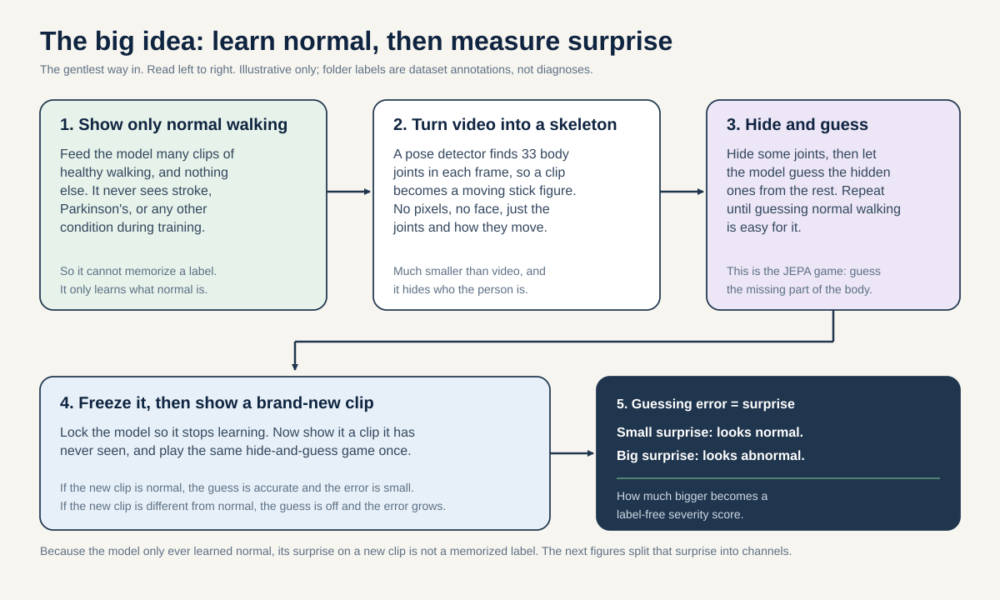
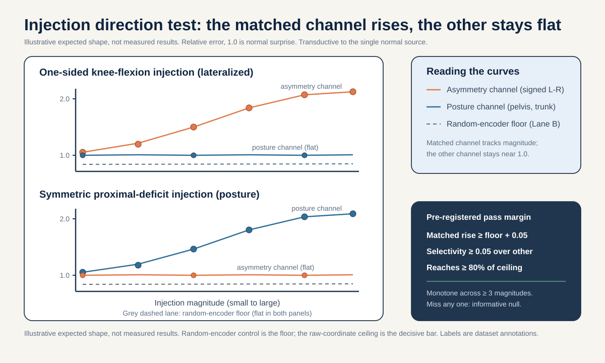
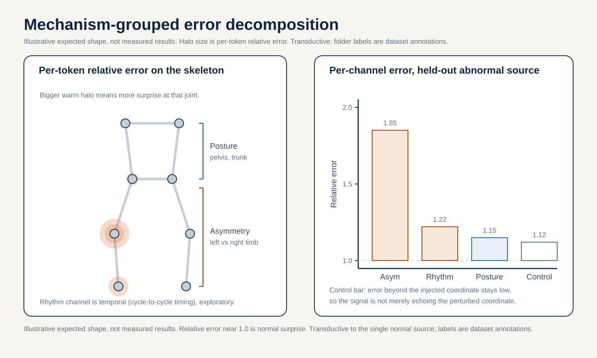
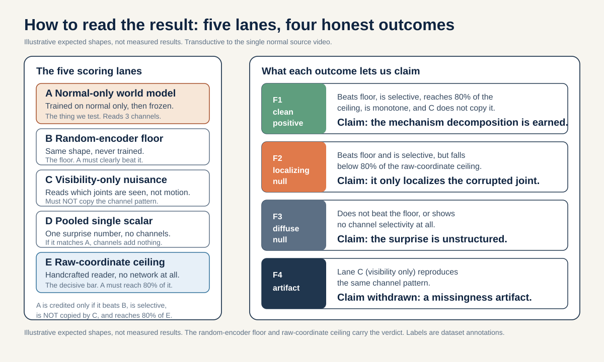

# Prediction-error-as-severity: a normal-only gait world model with mechanism-grouped error decomposition

> When a JEPA world model is trained ONLY on normal gait and its relative masked-prediction error is read as a continuous severity score, does a controlled one-sided knee-flexion injection raise error specifically in the asymmetry channel (and track its magnitude), while a symmetric proximal-deficit injection raises error specifically in the posture channel, each by a pre-registered margin over a random-encoder control?

## The question in plain words

Healthy walking is highly predictable. The two legs trade off in a steady rhythm, the pelvis stays close to level, and one stride looks a lot like the next. If you show a model many clips of normal walking and ask it to hide part of the body and guess the hidden part, it will get good at that guess. The interesting move is what happens next. Take that same model, freeze it, and show it a NEW clip it was never trained on. If the new clip is also normal, the model's guess is accurate and its prediction error is small. If the new clip departs from normal, the model is SURPRISED and its prediction error grows. That growing surprise is the severity signal we want to read.

This is the "world model" idea. A world model learns what is expected, and then measures how much reality violates that expectation. In video, V-JEPA 2 (Assran et al., 2025, arXiv:2506.09985) and the intuitive-physics work of Garrido et al. (2025, arXiv:2502.11831) both use exactly this "violation of expectation" logic: a model trained on ordinary scenes reports higher prediction error on physically impossible ones. We borrow that logic for gait. A model trained only on normal walking should report higher error on abnormal walking, and how much higher becomes a graded, label-free severity axis.

The clever part, and the reason this proposal exists, is what the model NEVER sees. It never sees a stroke clip, a Parkinson's clip, a myopathy clip, or a cerebral-palsy clip during training. It only sees normal. So the severity score cannot be a memorized "this folder is stroke" shortcut. There is no abnormal label anywhere in training. This side-steps a problem that haunts the rest of this project: condition label is nearly collinear with which YouTube source video a clip came from, so an ordinary classifier can cheat by recognizing the video rather than the gait. A normal-only world model cannot cheat that way, because it has no abnormal videos to memorize.

But a single "total surprise" number is blunt. Two very different conditions could produce the same total error for different reasons. So we do not stop at one number. We split the error into three MECHANISM CHANNELS, each tied to a body region and to a clinically validated biomarker.

- The ASYMMETRY channel reads error on the left-right leg joints (knees 25/26, ankles 27/28, hips 23/24). Its biomarker is the Symmetry Ratio on step, swing, and stance summaries (Patterson et al. 2010, PMID 19932621). Lateralized conditions load here: stroke (the corticospinal tract crosses sides, so a one-sided brain lesion weakens the opposite side of the body, PMID 30571044), hemiplegic cerebral palsy (a one-sided injury to leg motor fibers, PMID 19081519), and early Parkinson's (one-sided nigrostriatal loss, PMID 22367437).
- The RHYTHM channel reads error in cycle-to-cycle timing. Its biomarker is stride-time variability (stride-time CV): Parkinson's basal-ganglia loss of automaticity raises timing variability (Redgrave et al. 2010, PMID 20944662; Wu et al. 2015, PMID 26102020), and Schaafsma et al. 2003 (PMID 12809998) reported stride-time CV of 8.8 percent in fallers versus 4.2 percent in non-fallers.
- The POSTURE channel reads error on the pelvis and trunk. Its biomarker is anterior pelvic tilt: myopathy is a primary muscle disease with symmetric proximal weakness (Barohn et al. 2014, PMID 25037080), which at the skeleton shows LOW left-right asymmetry (Xiong et al. 2023, PMID 37525241) but hip-extensor weakness that drives an anterior pelvic tilt of 16.4 degrees versus 11.6 degrees in typically developing controls (Vandekerckhove et al. 2022, PMID 35721358; mechanism in Vandekerckhove et al. 2025, PMID 41034979).

Here is a homey analogy for the whole idea. Imagine a music teacher who has only ever heard one song, played perfectly, thousands of times. Play it correctly and the teacher notices nothing. Play a wrong note in the left hand and the teacher flinches at the left hand. Play the whole piece too slowly and unevenly and the teacher flinches at the timing. The flinch is the surprise, and WHERE the teacher flinches tells you what went wrong. Our three channels are just three places to watch for the flinch: the left-versus-right legs (asymmetry), the timing of the strides (rhythm), and the pelvis and trunk (posture).

The falsifiable test is a DIRECTION test with synthetic injections. We take a held-out normal clip and deliberately corrupt it in a known way. If we bend one knee more than the other (a one-sided, lateralized deficit), the asymmetry-channel error should rise and the posture-channel error should stay quiet, and the rise should grow as we bend harder. If instead we apply a symmetric proximal deficit that tilts the pelvis forward on both sides, the posture-channel error should rise and the asymmetry channel should stay quiet. If the channels do not respond to the matched injection, the decomposition is not measuring what we claim.

## Why this matters

A positive result would establish something reusable well beyond this repository: that a world model trained only on normal motion yields a mechanism-decomposable prediction-error field whose channel-specific rises track the direction and magnitude of an injected deficit. That is a label-free, biomarker-aligned severity axis. It is attractive precisely because it never trains on an abnormal label, so it cannot inherit the label-versus-source collinearity that limits every supervised readout in this cohort (normal 1 source, Parkinson's 2, stroke 3, myopathic 10, cerebral palsy 2; all 12 normal sequences come from one video, id 3KnFt8bH3tE). The generalizable claim is a method claim about how to read gait world models, not a clinical-accuracy claim.

An informative null rules out equally specific beliefs. If a one-sided knee-flexion injection does NOT raise the asymmetry channel above the random-encoder floor by the pre-registered margin, then the normal-only world model has not learned a spatially structured expectation of gait: its surprise is diffuse and unlocalized, and the mechanism-channel framing adds nothing over a single pooled scalar. A second, subtler null is equally informative: if the world model beats the floor and shows selectivity but cannot reach 80 percent of the raw-coordinate ceiling, then it is merely echoing the perturbed coordinate rather than adding a learned normal expectation, and the mechanism-decomposition claim is not earned (per _neuro_facts.md lever 4). If the channels respond but respond to the WRONG injection (posture injection lights up the asymmetry channel), then the channel-to-biomarker mapping is wrong and must not be claimed. Either null is publishable and changes understanding: reviewers at ICLR/ICML/NeurIPS 2026 value a well-motivated study that contributes new knowledge, including a careful negative result.

There is a hard honesty boundary. The neuroscience DEFINES the target (which channel should move for which mechanism) and the falsifiable prediction (direction and monotonicity). It does NOT license a clinical-accuracy claim. This cohort is n=18 canonical source videos and normal is a single video, so any normal-only baseline is transductive to that one source and cannot separate "the normal world model" from "that one source's provenance." Every number here is a within-cohort, transductive, synthetic-injection direction test, not a diagnosis and not external clinical validation.

## Background and related work

The moving parts, from scratch. If any word below is new to you, the companion [`METHODOLOGY.md`](./METHODOLOGY.md) has a plain-language mini-glossary (skeleton, token, embedding, JEPA, world model, masking, encoder, predictor, relative error, transductive, floor, ceiling) that you can keep open while you read.

A JEPA (Joint-Embedding Predictive Architecture) learns by hiding part of its input and predicting the hidden part in its own internal feature space, not in raw coordinates (Assran et al., I-JEPA, CVPR 2023, arXiv:2301.08243; Bardes et al., V-JEPA, 2024, arXiv:2404.08471). The skeleton version is S-JEPA (Abdelfattah and Alahi, ECCV 2024, DOI 10.1007/978-3-031-73411-3_21).

A TOKEN is the smallest input unit. Here a token is one BlazePose joint (Grishchenko et al., BlazePose GHUM, 2022, arXiv:2206.11678) watched over a short 4-frame window. Each sequence is resized to 64 frames, and 4 adjacent frames form one time patch, giving 16 time positions. With 33 joints that is 33 x 16 tokens.

**Reading the math (token count).** This says the total number of joint-time tokens is joints times time positions.
- 33 is the number of BlazePose joints.
- 16 is the number of time positions (64 frames split into groups of 4).
- "x" means multiply. 33 x 16 = 528, so there are 528 possible joint-time tokens.
- If you grouped fewer frames per patch you would get more time positions and more tokens.

Each token turns a 4-frame by 3-coordinate (x, y, relative z) 12-vector into a 96-number embedding through a linear layer. A "12-vector" is a list of 12 numbers (4 frames times 3 coordinates). The embedding dimension is 96; the encoder is a small Transformer of depth 4 with 4 heads, and the predictor is a small Transformer of depth 2.

MASKING hides some tokens from one encoder and asks the model to predict what a second encoder computed for those hidden positions. The VIEW (online) encoder sees only the visible tokens and is trained by gradient descent. The TARGET encoder sees all 528 tokens and is NOT updated by backpropagation; its weights are an exponential moving average (EMA) of the view encoder, a slowly trailing running average that gives stable prediction targets (momentum on a cosine schedule from 0.999 toward 1.0). A PREDICTOR, a 2-layer Transformer with a learned mask token, takes the visible features and predicts the target encoder's hidden features, returning outputs only at the masked positions.

Only 12 landmarks are ever maskable prediction targets: left/right shoulder (11,12), hip (23,24), knee (25,26), ankle (27,28), heel (29,30), foot index (31,32). Face and arm joints are visible context but never targets. Because masking a face or arm joint is forbidden, the maximum possible global mask fraction is 12/33 = 0.364, far below the 75 to 90 percent used in image/video JEPAs. The configured target masks 0.60 of the eligible tokens with a batch-safe sampler that always leaves at least one eligible token visible.

**Reading the math (the 0.364 mask cap).** This says the biggest fraction of the whole skeleton we can ever hide.
- 12 is the number of maskable joints, 33 is the total number of joints.
- 12 / 33 = 0.364, so at most about 36 percent of tokens can be hidden.
- It is a fraction between 0 and 1. If face and arm joints were maskable this cap would be higher, closer to the JEPA norm.

The training loss combines three parts:

`L = L_JEPA + 0.05 * L_VICReg + 0.25 * L_group`

**Reading the math (total training loss).** This says the total training loss is a weighted sum of three parts. "Loss" is the error training tries to make small.
- `L` is the total loss the optimizer minimizes (smaller is better).
- `L_JEPA` is the main prediction error: how badly the predictor guessed the hidden target features. Its weight is 1.
- `L_VICReg` is an anti-collapse penalty (variance floor plus covariance term); its weight is `0.05`.
- `L_group` is a LABEL-AWARE term; its weight is `0.25`.
- `*` means multiply (scale by weight) and `+` means add.
- Crucially for THIS proposal, we train a normal-only world model, so there are no condition labels to group. We therefore drop `L_group` entirely (weight 0) and keep only `L_JEPA + 0.05 * L_VICReg`. This is what makes our training purely self-supervised, unlike the project's Stages 1 to 4, which are supervised fine-tuning because `L_group` is active there.

VICReg (Bardes, Ponce, LeCun, ICLR 2022, arXiv:2105.04906) adds a variance floor and a covariance penalty that keep the features spread across many independent directions instead of collapsing to one vector.

TRANSDUCTIVE means the encoder saw the evaluation rows during training. In this project all readout numbers are transductive; even a held-out probe split is still transductive if the encoder saw that video's clips (Kapoor and Narayanan, leakage taxonomy, 2022, arXiv:2207.07048; Varoquaux, NeuroImage 2018, on why small samples give large error bars). SOURCE-VIDEO-DISJOINT means no clip from a held-out YouTube source video appears in the fold used to fit anything. The independent unit is the source video, not the clip.

Skeleton validity anchors the biomarker chain. Stenum et al. 2021 (PMID 33891585) reported markerless temporal mean absolute error of 0.02 s/step and sagittal hip/knee/ankle joint errors of 4 to 7 degrees against mocap, and Human3.6M (Ionescu et al. 2014, DOI 10.1109/tpami.2013.248) is the mocap reference for pose validity. That temporal accuracy is why stride-time CV is in principle recoverable. What skeletons CANNOT recover, and we say so in limitations, includes kinetics and propulsion (force plates), EMG and spasticity (needle EMG), transverse-plane rotation, and any etiologic muscle diagnosis (biopsy, CK, genetics).

The dataset is GAVD (Ranjan et al., IEEE Access 2025, DOI 10.1109/ACCESS.2025.3545787). Condition folder labels are dataset annotations, not diagnoses.

## Method

We train a NEW normal-only world model from scratch at the existing project scale, then read its relative prediction error with a deterministic mechanism decomposition, then run the synthetic-injection direction test. No abnormal label ever enters training.

1. Assemble the normal-only training set. Use the 12 canonical normal sequences (all from source video 3KnFt8bH3tE) plus up to 63 accepted augmented-normal windows (one of 64 candidates was rejected at neurologic coverage 0.027). This is the only normal available. State the severe data bound up front: normal is a single source video, so the world model is transductive to that one source and cannot be separated from that source's provenance.

2. Train the world model at project scale. Reuse the existing 33-joint BlazePose tokenization, 528 joint-time tokens, embed_dim 96, encoder depth 4, 4 heads, and the same masking pipeline (configured target 0.60 of eligible tokens, global cap 0.364, laterality flip OFF). Train with `L = L_JEPA + 0.05 * L_VICReg` (no `L_group`) for roughly the Stage-0 budget of 300 epochs, not the full 600-epoch curriculum. Bind the resulting checkpoint to its own fingerprint; keep it strictly separate from the project's `ea59fea0` curriculum checkpoint, which this proposal does NOT reuse for scoring (that reuse is item 02's job).

3. Define relative masked-prediction error per token. For a held-out clip, run the frozen normal-only view encoder on the visible tokens, run the predictor, and compare each masked-position prediction to the target encoder's feature at that position. The per-token error is the mismatch between predicted and target features. Relative error normalizes each token's error by that token's typical error on held-out NORMAL clips, so a value near 1 means "as surprising as normal" and a value well above 1 means "more surprising than normal."

**Reading the math (relative error).** This says how we turn raw surprise into a normalized severity signal.
- Raw error at a token is how far the prediction sits from the target feature (bigger is more surprising).
- Relative error divides that raw error by the average raw error the same token shows on held-out normal clips.
- It is a ratio, so it is unitless. About 1.0 means "normal amount of surprise," 2.0 means "twice the normal surprise," and below 1.0 means "less surprising than normal."
- Normalizing per token matters because some joints (heels, the visibility weak link at about 0.67 to 0.70 visibility) are harder to predict even when normal, and we do not want that baseline difficulty to masquerade as severity.

4. Group tokens into three mechanism channels (deterministic, frozen before results).
   - ASYMMETRY channel: the SIGNED left-minus-right relative error on the paired leg joints (knees 25/26, ankles 27/28, hips 23/24). A one-sided deficit should make one side more surprising than the other.
   - RHYTHM channel: relative error read across the 16 time positions instead of across joints. In plain words, we look at WHEN in the walking cycle the surprise happens, not WHERE on the body. If the strides come at uneven times, the surprise clusters at the off-beat moments and the pattern across the 16 time slots gets jumpy. That jumpiness is the skeleton proxy for stride-time variability (how much the time between steps bounces around). Note the documented limit that stride-time CV is not linearly decodable from roughly 2-second windows, so the rhythm channel is the weakest and we pre-register it as exploratory, not confirmatory. It is exercised in-cohort by the exploratory timing-jitter injection (step 5) and corroborated at the reach tier by the label-level gaitpdb cross-modal check; the primary verdict does not depend on it.
   - POSTURE channel: relative error on pelvis and trunk region tokens (hips 23/24 as the pelvis anchor, shoulders 11/12 as the trunk anchor), the skeleton proxy for anterior pelvic tilt and trunk lean.

5. Build the synthetic-injection generator (parametric, on held-out NORMAL clips only).
   - One-sided knee flexion: bend one knee joint trajectory by a magnitude parameter, leaving the other side untouched. This is a lateralized, asymmetry-loading corruption.
   - Symmetric proximal deficit: tilt the pelvis forward and reduce hip extension bilaterally by a magnitude parameter, keeping left and right matched. This is a symmetric, posture-loading corruption that preserves left-right symmetry (Xiong 2023, PMID 37525241) and cadence.
   - Timing/variability perturbation (exploratory): jitter the cycle-to-cycle timing within the normalized 64-frame base by a magnitude parameter (stretch and compress alternate sub-cycles so cadence mean is held but cycle-to-cycle regularity drops), the skeleton proxy for elevated stride-time variability. This is included so the RHYTHM channel is falsifiably exercised in-cohort at the exploratory level, not only via the reach-tier gaitpdb check. We pre-register this as exploratory (not confirmatory) because stride-time CV is not linearly decodable from roughly 2-second windows (_shared_facts.md: cycle-to-cycle variability is not linearly decodable from ~2s windows), so we expect the rhythm channel to be the weakest responder and do not gate the primary verdict on it.

6. Score. For each injection type and each magnitude, run the corrupted clip through the frozen normal-only world model (Lane A), the random-encoder floor (Lane B), and the non-neural raw-coordinate ceiling (Lane E), compute per-channel relative error (or the handcrafted channel detector for Lane E), and record the channel response as a function of magnitude. Lane A earns the mechanism-decomposition claim only if it reaches at least 80 percent of the Lane E ceiling effect on the matched channel, on top of beating the Lane B floor and showing selectivity.

Here is the core scoring loop in short readable pseudo-code:

```python
# Frozen normal-only world model: view encoder, target encoder (EMA), predictor.
# baseline_err[t] = mean raw error at token t over held-out NORMAL clips.

ASYM = [(25, 26), (27, 28), (23, 24)]   # left-right leg pairs
POSTURE = [23, 24, 11, 12]              # pelvis (hips) + trunk (shoulders)

def channel_errors(clip):
    visible, masked = mask_pipeline(clip)          # same 0.60 eligible target
    feats = view_encoder(visible)
    pred = predictor(feats, masked_positions)      # only at masked positions
    tgt = target_encoder(clip)                     # sees all 528 tokens
    raw = feature_mismatch(pred, tgt[masked])      # per-token raw error
    rel = raw / baseline_err[masked]               # relative error, ~1 is normal

    asym = 0.0
    for left, right in ASYM:                       # SIGNED left minus right
        asym += rel_at(rel, left) - rel_at(rel, right)
    posture = sum(rel_at(rel, j) for j in POSTURE)
    rhythm = temporal_variability(rel)             # exploratory channel
    return asym, rhythm, posture

# Direction test: does the matched channel move with injection magnitude?
for m in magnitudes:
    a_knee = channel_errors(inject_one_sided_knee(normal_clip, m))
    a_prox = channel_errors(inject_symmetric_proximal(normal_clip, m))
    a_time = channel_errors(inject_timing_jitter(normal_clip, m))   # exploratory
    # expect a_knee.asym rises with m, a_knee.posture stays flat;
    # expect a_prox.posture rises with m, a_prox.asym stays flat;
    # exploratory: expect a_time.rhythm rises with m (weak, not gated).
```

## The decisive experiment

The split is stated BEFORE any fitting. Injections are applied only to HELD-OUT normal clips, meaning clips (or augmented-normal windows) that were NOT in the world model's training set. Because normal comes from a single source video, we cannot achieve source-video-disjoint holdout for normal in the strict sense; we therefore hold out whole augmented-normal windows and label every number transductive to source 3KnFt8bH3tE. This is the severe data bound, stated plainly and not hidden.

Primary endpoint: the DIRECTION test on the two CONFIRMATORY injections. As one-sided knee-flexion magnitude increases, the asymmetry-channel relative error must rise MONOTONICALLY and the posture-channel error must stay flat; as symmetric proximal-deficit magnitude increases, the posture-channel error must rise monotonically and the asymmetry channel must stay flat. The timing-jitter injection exercises the rhythm channel at the EXPLORATORY level only (rhythm channel expected to rise weakly); it is reported but does not gate the primary verdict, because stride-time CV is not linearly decodable from roughly 2-second windows.

Pre-registered numeric margin: at the largest injected magnitude, the matched channel's relative error must (1) exceed the random-encoder FLOOR's matched-channel relative error by at least 0.05 (on the ratio scale, i.e. at least 5 percent more surprise than a random encoder produces on the same corrupted input), (2) rise by at least 0.05 more than the UNMATCHED channel rises under the same injection (channel selectivity), (3) reach at least 80 percent of the RAW-COORDINATE CEILING's channel-detection effect size on the SAME injection (competitiveness with the non-neural ceiling, i.e. the trained model must do about as well as, or better than, a handcrafted reader of the corrupted coordinates), and (4) be monotone non-decreasing across at least 3 of the injected magnitudes. Falling short on any of these is scored as an informative null. In particular, if the world model clears the floor and shows selectivity but falls below 80 percent of the raw-coordinate ceiling, we report that the decomposition adds nothing over reading the coordinates directly, which is itself an informative null about the representation.

**Reading the math (the four margin numbers).** This says a positive result needs all four at once.
- 0.05 over the random-encoder FLOOR is the smallest excess relative error that counts as the trained world model doing something an untrained encoder does not. This is only a floor, not proof of usefulness.
- 0.05 selectivity is the smallest gap between the matched channel's rise and the unmatched channel's rise; below it the decomposition is not specific to the injected mechanism.
- 80 percent of the RAW-COORDINATE CEILING (a fraction of 0.80, between 0 and 1) is the share of the non-neural handcrafted detector's effect the world model must reach to count as competitive with simply reading the corrupted coordinates. This is the decisive bar per _neuro_facts.md lever 4: beating a random encoder is trivial, matching a raw-coordinate detector is not.
- Monotone across at least 3 magnitudes means bigger deficit yields at least as much surprise, never less, so the score tracks magnitude and is not a threshold accident.
- Miss any one of the four and the run is an informative null, not a positive.

**A worked example (illustrative numbers only, not measured facts).** Say we run the one-sided knee-flexion injection at its largest magnitude and read the ASYMMETRY channel (the matched channel). Suppose the numbers come out like this: Lane A (trained model) relative error 1.60, Lane B (random-encoder floor) 1.10, the posture channel under the same injection rises to 1.20 (a rise of 0.20 above its own baseline of 1.00), and Lane E (raw-coordinate ceiling) shows a matched-channel effect of 0.75 above 1.0. Walk the four checks:
- Beat the floor by at least 0.05: Lane A minus Lane B = 1.60 minus 1.10 = 0.50, far above 0.05. Pass.
- Selectivity at least 0.05: the asymmetry channel rose 0.60 above its baseline (1.60 minus 1.00), the posture channel rose 0.20, so the gap is 0.60 minus 0.20 = 0.40, above 0.05. Pass.
- Reach at least 80 percent of the ceiling: 80 percent of the ceiling effect 0.75 is 0.80 times 0.75 = 0.60. The model's matched rise above 1.0 is 0.60, which meets 0.60. Pass.
- Monotone across at least 3 magnitudes: suppose the asymmetry channel read 1.15, then 1.35, then 1.60 across three growing magnitudes, which never goes down. Pass.

All four pass, so this illustrative run would support the claim. But flip one number: if Lane A's matched rise had been only 0.45 above 1.0, it would be below the 0.60 the ceiling check needs, so the whole run is scored an informative null (the model is only localizing the corruption, not adding a learned expectation). That single number decides it, which is exactly why we fix the bar in advance. The full step-by-step version lives in [`METHODOLOGY.md`](./METHODOLOGY.md), section 5.

**Construct validity of the falsifier (a limitation we state plainly).** The injections are synthetic parametric corruptions applied to the SAME coordinates whose target features the world model predicts. A one-sided knee-flexion injection at joints 25/26 raises error at exactly those tokens, and the asymmetry channel reads exactly those tokens, so "error rises where the input was corrupted" is close to TAUTOLOGICAL for any non-degenerate encoder. The random-encoder floor (Lane B) and the selectivity margin only PARTIALLY guard against this: they rule out a dead encoder and a diffuse response, but not a trained encoder that is merely echoing the perturbed coordinate. This is precisely why the raw-coordinate ceiling (Lane E) is the decisive bar. The world model earns the mechanism-decomposition claim only if it does MORE than localize the perturbed token, and "more" is defined concretely as all of: (1) reaching at least 80 percent of the Lane E raw-coordinate detector's effect on the matched channel (it is competitive with a handcrafted reader that has no learned normal expectation), (2) the CORRECT SIGN (a left-knee injection and a right-knee injection move the signed asymmetry channel in opposite directions), (3) MONOTONICITY across at least 3 magnitudes rather than a single-threshold jump, and (4) NO reproduction of the selectivity by the visibility-only Lane C (the response is coordinate-driven, not a visibility artifact). If Lane A only clears the floor and shows selectivity but cannot match Lane E, the honest reading is that the world model is localizing the corruption, not adding a learned expectation, and we report that as a null. We do not claim the direction test alone proves a spatially structured normal expectation; the ceiling, sign, monotonicity, and visibility controls together are what carry that claim.

Simple non-neural / nuisance baselines. The RANDOM-ENCODER control (Lane B) is a world model of identical architecture with randomly initialized (untrained) weights, scored the same way; it is a FLOOR, and a trained world model must beat it, otherwise the "learned normal expectation" claim is empty. The RAW-COORDINATE CEILING (Lane E) is a non-neural handcrafted channel detector read directly from the (possibly corrupted) coordinates, with NO encoder: a signed left-minus-right knee-angle-and-hip-angle asymmetry number for the asymmetry channel and a pelvic-tilt (hip-to-shoulder line) angle for the posture channel, computed on the same held-out clips at the same injection magnitudes. This is the CEILING the trained world model must approach or beat before the mechanism-decomposition claim earns credit (per _neuro_facts.md lever 4: only credit the representation if it beats, or is competitive with, a raw-coordinate probe). Beating only the random-encoder floor is not enough, because a trivial reader of the injected coordinate change would also beat that floor. The MISSINGNESS/PROVENANCE nuisance check: because heels are the visibility weak link (about 0.67 to 0.70 visibility) and normal rows mostly use the augmented extraction path, we verify the channel responses are not explained by injected-region visibility changes alone (an injection must not merely zero out or hide a joint). We also confirm the injection direction test survives when the injection is applied without changing any joint's visibility flag.

| Lane | World model | Trained on | Scoring | Expected on direction test |
|---|---|---|---|---|
| A Normal-only WM | From-scratch, `L_JEPA + 0.05 L_VICReg`, 300 epochs | Normal only (1 source) | Per-channel relative error | Matched channel rises with magnitude, beats floor by >= 0.05, selectivity >= 0.05, reaches >= 80 percent of the raw-coordinate ceiling |
| B Random-encoder floor | Untrained, identical architecture | Nothing | Same per-channel relative error | Near-flat, no channel selectivity |
| C Visibility-only nuisance | Normal-only WM | Normal only | Relative error from visibility flags only, no coordinate change | Must NOT reproduce the channel selectivity |
| D Pooled-scalar control | Normal-only WM | Normal only | Single pooled relative error, no channels | Cannot distinguish knee injection from proximal injection |
| E Raw-coordinate ceiling | None (handcrafted detector) | Nothing | Signed L-R knee/hip-angle number and pelvic-tilt angle read directly from the corrupted coordinates, no encoder | Rises with matched injection; Lane A must approach or beat this to earn credit |

Lane D is the "is the decomposition worth it" control: if a single pooled surprise number separates the two injection types as well as the three channels do, the mechanism decomposition adds nothing and we say so. Lane E is the "does the world model beat trivially reading the coordinates" ceiling: because a one-sided knee injection changes the very coordinates the asymmetry detector reads, a non-neural handcrafted detector will also respond, so Lane A must reach at least 80 percent of Lane E's channel-detection effect (not merely beat the Lane B floor) before we credit the trained world model with anything beyond localizing the perturbed coordinate.

## Controls

- RANDOM-ENCODER control (Lane B): identical architecture, untrained weights, scored identically. This is the FLOOR; beating it is necessary but not sufficient.
- RAW-COORDINATE CEILING (Lane E): a non-neural handcrafted detector (signed left-minus-right knee/hip angle for the asymmetry channel, hip-to-shoulder pelvic-tilt angle for the posture channel) read directly from the corrupted coordinates with no encoder. This is the decisive CEILING per _neuro_facts.md lever 4: the trained world model must reach at least 80 percent of this detector's channel-detection effect on the matched injection before the mechanism-decomposition claim earns credit. If it cannot, the world model is only localizing the perturbed coordinate and adds nothing over reading the coordinates directly.
- VISIBILITY / missingness nuisance (Lane C): confirm channel selectivity is not an artifact of the injection changing joint visibility; re-run injections that preserve every visibility flag.
- PROVENANCE control: the normal-only training set mixes canonical and augmented-normal windows; report whether relative-error baselines differ by extraction path and, if so, compute the baseline per path so a path difference is not read as severity.
- POOLED-SCALAR control (Lane D): the single pooled relative error must NOT match the three-channel selectivity, otherwise the decomposition is unnecessary.
- SIGN control for the asymmetry channel: the signed left-minus-right construction means a left-knee injection and a right-knee injection should move the asymmetry channel in OPPOSITE directions; verify this, because a magnitude-only response would be side-agnostic and weaker than claimed.
- MONOTONICITY control: verify the magnitude response is monotone non-decreasing rather than a single-threshold jump.
- FINGERPRINT hygiene: bind every number to the new normal-only checkpoint's own fingerprint, kept separate from `ea59fea0` and the observed `dba24a` lineage.
- Responsible use: folder labels (normal, parkinsons, stroke, myopathic, cerebralpalsy) are dataset annotations, not diagnoses.

## How this differs from the existing plan

The nearest neighbors are ideas/02 (surprise tomography) and the plan's world-model direction. Item 02 is a FROZEN-ENCODER readout comparison on the EXISTING `ea59fea0` checkpoint: it asks whether the pattern of the existing model's surprise image beats its pooled scalar. This proposal (item 10) does something different in kind: it TRAINS A NEW world model FROM SCRATCH on normal only, with `L_group` removed, and reads relative prediction error against a normal-only expectation as a continuous severity axis. Item 02 never retrains; item 10 is defined by retraining on normal only. Item 02 uses a checkpoint that saw all conditions; item 10's model has never seen an abnormal clip, which is the whole point, because it side-steps the label-versus-source collinearity that item 02's checkpoint inherits.

It is also distinct from plan/01 (honest video-disjoint anomaly screening, which pools error into one scalar): item 10 decomposes error into three biomarker-aligned channels and validates them with a synthetic-injection DIRECTION test, not just an anomaly-versus-normal separation. It is distinct from plan/04 (motion-vs-position target ablation) because it changes neither the prediction target nor the mask family; it changes the TRAINING DISTRIBUTION to normal-only and adds the injection-direction falsifier. No existing plan or ideas item trains a normal-only severity world model and tests channel-specific injection direction.

## Timeline (feasibility-tiered, ambition-first)

This is medium-high effort because it retrains a world model from scratch. The core tier can exceed three weeks; the reach tier is marked honestly.

Core tier, Week 1 (16 to 22 Aug 2026): assemble the normal-only training set (12 canonical + up to 63 augmented-normal windows) from cached skeletons; confirm no abnormal row enters training; wire the training loss to `L_JEPA + 0.05 * L_VICReg` with `L_group` removed; verify the masking pipeline and token geometry match project scale; begin the 300-epoch normal-only train.

Day-5 gate (20 Aug 2026): continue only if the normal-only train is healthy (feature standard deviation not collapsed, effective rank not degenerate), the checkpoint has its own bound fingerprint separate from `ea59fea0`, and held-out-normal relative error baselines are stable per token. If the model collapses on such a small normal set, pivot to reporting that as the finding (a single-source normal set is insufficient to train a stable world model).

Core tier, Week 2 (23 to 29 Aug 2026): finish training; freeze the deterministic three-channel decomposition and the per-token normal baselines; build the parametric injection generator (one-sided knee flexion, symmetric proximal deficit, and the exploratory timing-jitter perturbation); implement the non-neural raw-coordinate ceiling detector (Lane E); run the random-encoder floor (Lane B), the raw-coordinate ceiling (Lane E), and the visibility-only nuisance (Lane C).

Day-14 gate (29 Aug 2026): continue to confirmation only if the direction test has a clean verdict (matched channel rises with magnitude, beats the Lane B floor, AND reaches at least 80 percent of the Lane E raw-coordinate ceiling, OR an interpretable null against that ceiling), Lane C fails to reproduce selectivity, and Lane D (pooled scalar) is computed for comparison.

Core tier, Week 3 (30 Aug to 5 Sep 2026): run the full magnitude sweep for all injections (the two confirmatory injections plus the exploratory timing jitter); compute selectivity, monotonicity, and the 80-percent-of-ceiling comparison against Lane E; run the sign control (left vs right knee injection); assemble per-injection response curves; write transductive caveats next to every number; package the checkpoint, decomposition function, injection generator, raw-coordinate ceiling detector, and results.

Reach tier (beyond Week 3, honestly marked): PhysioNet Gait-in-PD (gaitpdb, 93 PD + 73 controls, Hausdorff, DOI 10.13026/C24H3N) as a LABEL-LEVEL cross-modal check of the RHYTHM channel only. gaitpdb is force/IMU, not skeleton, so it can corroborate the stride-time-CV biomarker at the label level but cannot confirm skeleton-level clinical transfer. This needs the external dataset and a separate variability pipeline, so it is a reach, not core.

## Figures

If any label in these pictures is unfamiliar, the consolidated plain-language glossary in [`METHODOLOGY.md`](./METHODOLOGY.md) defines every term in one place.



Fig 3 (start here): the five-step concept flow. Show the model only normal walking, turn each clip into a moving stick skeleton, play a hide-and-guess game until normal is easy, freeze the model, then show it a brand-new clip and read the guessing error as surprise. How to read this picture: follow the cards left to right along the arrows; a small surprise means the new clip looks normal, a big surprise means it looks different from normal, and how much bigger becomes the label-free severity score.



Fig 1: the synthetic-injection direction test. Two stacked sub-panels share an injection-magnitude x axis. Under the one-sided knee-flexion injection the asymmetry-channel relative error (warm) rises steeply while the posture channel (blue) stays flat; under the symmetric proximal-deficit injection the posture channel rises while asymmetry stays flat. A grey dashed random-encoder control lane stays flat in both panels, and a dark card lists the pre-registered margins over that control (matched rise at least 0.05 over the floor, selectivity at least 0.05 over the other channel, at least 80 percent of the raw-coordinate ceiling, monotone across at least 3 magnitudes). How to read this picture: left to right is a bigger injected deficit; the line that climbs is the channel that noticed, and the line that stays near 1.0 is the channel that (correctly) did not.



Fig 2: the mechanism-channel error decomposition. The left card shows a desaturated lower-body stick skeleton with warm halos whose size marks per-token relative error, bracketed into the posture (pelvis, trunk) and asymmetry (left vs right limb) channels, with the rhythm channel noted as temporal and exploratory. The right card is a bar chart of per-channel relative error on a held-out abnormal source, with a near-tautology control bar (error beyond the injected coordinate) held low to show the signal is not merely echoing the perturbed coordinate. How to read this picture: bigger halos mean more surprise at that joint; the brackets show which joints feed which channel, and the low control bar on the right is the check that the model saw more than just the exact joint we bent.



Fig 4: the five scoring lanes and the four honest outcomes side by side. The left column lists the five lanes (A the trained model, B the random-encoder floor, C the visibility-only nuisance, D the pooled single scalar, E the raw-coordinate ceiling), and the right column is a ladder of the four possible verdicts with the one claim each allows. How to read this picture: read the lanes top to bottom to see what each control tests, then read the outcome ladder; green F1 is the clean positive, orange F2 is the "only localizing" null, grey F3 is the "unstructured surprise" null, and dark F4 is the "visibility artifact, claim withdrawn" outcome.

## Responsible use

The condition folder labels (normal, parkinsons, stroke, myopathic, cerebralpalsy) are dataset annotations from GAVD, not diagnoses made by this project. The relative prediction error and its three mechanism channels are representation diagnostics computed from cached skeleton coordinates and synthetic injections; they are not validated clinical biomarkers and must not be read as a measurement of any individual's health or severity. The neuroscience literature defines the target and the falsifiable direction of each channel; it does NOT upgrade this n=18-source, single-source-normal, transductive study into a clinical-accuracy claim. Participant-disjoint public SKELETON cohorts for cerebral palsy and myopathy do not exist, so the asymmetry and posture channels have no external skeleton confirmation and rest on the within-cohort synthetic-injection direction test plus the biomarker literature; that injection test is a controlled internal falsifier, not external validation. The PhysioNet gaitpdb reach check is a label-level cross-modal corroboration of the rhythm biomarker only. Skeletons cannot recover kinetics or propulsion, EMG or spasticity, transverse-plane rotation, or an etiologic muscle diagnosis, and none of those is claimed here.

## References

- Assran et al., V-JEPA 2, 2025, arXiv:2506.09985.
- Garrido et al., intuitive physics from V-JEPA (violation of expectation), 2025, arXiv:2502.11831.
- Bardes et al., V-JEPA "Revisiting Feature Prediction for Learning Visual Representations from Video", 2024, arXiv:2404.08471.
- Bardes, Ponce, LeCun, VICReg, ICLR 2022, arXiv:2105.04906.
- Assran et al., I-JEPA, CVPR 2023, arXiv:2301.08243.
- Abdelfattah and Alahi, S-JEPA, ECCV 2024, DOI 10.1007/978-3-031-73411-3_21.
- Grishchenko et al., BlazePose GHUM, 2022, arXiv:2206.11678.
- Ranjan et al., GAVD, IEEE Access 2025, DOI 10.1109/ACCESS.2025.3545787.
- Kapoor and Narayanan, "Leakage and the Reproducibility Crisis in ML-based Science", 2022, arXiv:2207.07048.
- Varoquaux, "Cross-validation failure: small sample sizes lead to large error bars", NeuroImage 2018.
- Patterson et al., symmetry-index methods (Symmetry Ratio), Gait Posture 2010, PMID 19932621.
- Schaafsma et al., stride-time CV fallers 8.8 percent vs non-fallers 4.2 percent, J Neurol Sci 2003, PMID 12809998.
- Hausdorff et al., PD gait-timing variability, Mov Disord 1998, PMID 9613733.
- Redgrave et al., posterior-putamen dopamine loss and loss of automaticity, Nat Rev Neurosci 2010, PMID 20944662.
- Wu, Hallett, Chan, loss of automaticity in PD, Neurobiol Dis 2015, PMID 26102020.
- Riederer and Sian-Hulsmann, asymmetric nigrostriatal onset in PD, J Neural Transm 2012, PMID 22367437.
- Natali/Javed StatPearls, corticospinal-tract pyramidal decussation, PMID 30571044.
- Volpe, periventricular leukomalacia and CP, Lancet Neurol 2009, PMID 19081519.
- Barohn et al., symmetric proximal weakness in myopathy, Neurol Clin 2014, PMID 25037080.
- Xiong et al., DMD shows no significant left-right spatiotemporal asymmetry, Biomed Eng Online 2023, PMID 37525241.
- Vandekerckhove et al., anterior pelvic tilt 16.4 vs 11.6 deg in DMD, Front Hum Neurosci 2022, PMID 35721358.
- Vandekerckhove et al., hip-extensor weakness drives anterior pelvic tilt, J Neuroeng Rehabil 2025, PMID 41034979.
- Stenum et al., markerless gait validity (temporal MAE 0.02 s/step, sagittal joints 4 to 7 deg), PLoS Comput Biol 2021, PMID 33891585.
- Ionescu et al., Human3.6M, IEEE TPAMI 2014, DOI 10.1109/tpami.2013.248.
- Goldberger et al., PhysioNet Gait-in-PD (gaitpdb), DOI 10.13026/C24H3N.
