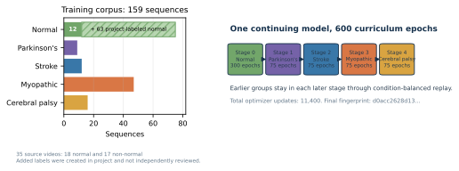
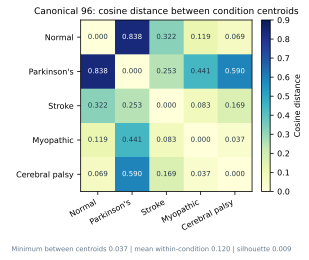

# GAVD6 S-JEPA gait tutorials

> **Documentation status:** the original augmented-normal five-stage GAVD
> tutorial below is preserved historical context, not the active research
> contract. Start with the [current documentation](docs/), especially the
> [Latent Laterality study](docs/studies/latent-laterality/) and its
> [validation-only swap probe](docs/studies/latent-laterality/swap-probe.md).
> The prior manuscript, figures, and result ledger now live in
> [docs/history/urtc-2026/](docs/history/urtc-2026/).

This folder is an executable course on learning motion features from gait video. It starts with a source video, extracts a 33-landmark skeleton, hides selected joint-time tokens, and asks a Skeleton Joint-Embedding Predictive Architecture, or S-JEPA, to predict their latent features. Training begins with normal gait and then continues through four cumulative condition stages.

The completed real run used 159 sequences from 35 source videos. It stayed numerically stable and did not totally collapse. It did not produce clean five-condition clusters. The classifier results are useful engineering diagnostics inside this known corpus. They are not estimates for a new patient, video, camera, or clinic.


## The question

A gait video contains the motion of interest, but it also contains camera angle, clothing, background, crop quality, and pose-detector failures. This project asks whether a compact latent representation can retain useful motion structure while making every data and evaluation choice visible.

The implementation follows the main learning graph in S-JEPA, but it is a paper-aligned reimplementation rather than official code. The main changes are:

- monocular MediaPipe landmarks replace calibrated 3D laboratory skeletons;
- prediction targets come from one fixed 12-landmark whitelist;
- targets are sampled uniformly, without a motion score;
- a normal-first five-stage curriculum replaces one pooled training run;
- VICReg resists collapse;
- a label-aware group term is active after Stage 0;
- every readout reports video overlap and prior encoder exposure.


## Data layers

The project keeps two data layers separate.

|Layer|Sequences|Videos|Purpose|
|---|---:|---:|---|
|Canonical GAVD experiment|96|18|The fixed five-condition inspection and comparison cohort|
|Added normal candidates|64|17|Self-annotated windows from additional YouTube videos|
|Accepted added normal|63|17|Candidates with neurologic-landmark coverage at least 0.45|
|Stage 0 normal total|75|18|12 canonical plus 63 accepted added normal sequences|
|Full curriculum|159|35|75 normal plus 84 canonical non-normal sequences|

The canonical class counts are 12 normal, 9 Parkinson's, 12 stroke, 47 myopathic, and 16 cerebral palsy sequences. The added normal windows use self-annotated time spans and automatic MediaPipe bounding boxes. They are not canonical GAVD annotations and were not independently clinically verified. One of 64 candidate windows had neurologic-landmark coverage of 0.027 and was rejected. Notebook 04 now reads the extraction report as an explicit selection contract, so the accepted cohort does not depend on which pose files happen to be present.

This provenance difference matters. Most normal rows use the added extraction path, while every abnormal row uses the canonical path. A normal-versus-abnormal classifier could learn acquisition or extraction differences as well as gait differences.



## Model in plain language

Each sequence is resized to 64 frames. Four adjacent frames form one time patch, which gives 16 time positions. With 33 joints, the encoder receives 528 possible joint-time tokens.

The view encoder sees a partly hidden sequence. The target encoder sees the complete sequence. The predictor uses the visible view features to predict the hidden target features. The target encoder is not updated by backpropagation. It follows the view encoder through an exponential moving average, or EMA.

The loss has three jobs:

\[
L = L_{\mathrm{JEPA}} + 0.05L_{\mathrm{VICReg}} + 0.25L_{\mathrm{group}}.
\]

- JEPA trains latent prediction.
- VICReg keeps dimensions variable and reduces redundant covariance, which helps resist collapse.
- The group term encourages same-label compactness and a centroid margin after Stage 0.

The group term uses condition labels. Stages 1 through 4 are therefore label-informed representation fine-tuning, not purely self-supervised learning.

## The 12 landmark identities eligible for prediction masking

The whitelist is expanded and de-duplicated from `experiments/multiple-sclerosis/mapping-data/ms-pd-mapping.md`.

|Indices|Landmarks|
|---|---|
|11, 12|left and right shoulder|
|23, 24|left and right hip|
|25, 26|left and right knee|
|27, 28|left and right ankle|
|29, 30|left and right heel|
|31, 32|left and right foot index|

This is a project whitelist, not a validated neurologic biomarker. All 33 joints may provide context. Only the 12 listed joints may become hidden prediction targets.

The configured mask target is 0.60, but the code uses a batch-safe rule. It takes 60% of the smallest valid eligible-token count in the batch, rounds down, and masks that same count in every sample. It always leaves at least one eligible token visible. The realized mean eligible-token fraction was 0.551 at the end of Stage 0 and 0.423 at the end of Stage 4. The sampler never reads coordinate size, displacement, velocity, acceleration, or a learned motion score.


## Training curriculum

One model continued through all five stages. Earlier groups remained available through condition-balanced replay.

|Stage|New group|Active sequences|Epochs|Final normal-anchor cosine|
|---:|---|---:|---:|---:|
|0|Normal|75|300|reference|
|1|Parkinson's|84|75|0.954|
|2|Stroke|96|75|0.839|
|3|Myopathic|143|75|0.707|
|4|Cerebral palsy|159|75|0.594|

Each rerun writes an explicit `training_manifest.json` beneath
`GAVD_ARTIFACT_DIR/<mode>/cohorts/<cohort>/checkpoints/<model-state-sha256>/runs/<run-id>/`.
Notebooks 05 and 06 require that manifest, re-hash the loaded tensor state, and put their
own outputs in an analysis-run directory below the same state hash. A data/config
fingerprint is retained for lineage, but it is not a model-weight checksum.

## What the completed run found

### Training health

The final feature standard deviation was 0.414, so the representation did not shrink to one constant vector. The mean pairwise cosine similarity was 0.609. However, the normal-anchor cosine fell to 0.594. This is substantial drift, so the run does not show strong retention of the original normal representation.


### Canonical five-condition geometry

Notebook 05 currently pools each canonical sequence into a 256-dimensional vector. Any
numerical geometry result must be read from the state-hash-bound report produced by the
current run; legacy displayed values below are no longer a current result.

- cosine silhouette: 0.009;
- minimum centroid distance: 0.0367;
- mean centroid distance: 0.2921;
- mean within-condition distance: 0.1195;
- closest centroids: myopathic and cerebral palsy.

A silhouette near zero means that many samples sit near class boundaries. The minimum centroid distance is also smaller than the mean within-condition spread. These values do not support a claim of clean five-class clustering.



### Descriptive classifier readouts

|Readout|Accuracy|Balanced accuracy|Macro-F1|Main limitation|
|---|---:|---:|---:|---|
|All-96 stratified S-JEPA|rerun required|rerun required|rerun required|Label-aware after Stage 0; transductive encoder exposure|
|All-96 full-pattern validity control|rerun required|rerun required|rerun required|Uses only the full joint-by-time validity tensor; not an attribution test|
|Exact exp5 S-JEPA|rerun required|rerun required|rerun required|Label-aware after Stage 0; transductive encoder exposure|
|Historical 82-feature exp5|0.762|not saved|0.728|Different pose and feature system; same video-confounded split|
|Lane C binary fold mean|rerun required|rerun required|rerun required|Label-aware after Stage 0; transductive encoder exposure remains|
|Lane C five-class fold mean|rerun required|rerun required|rerun required|Label-aware after Stage 0; transductive encoder exposure remains|

Lane C reports must be regenerated after the state-hash namespace and full-pattern
missingness repair. If run, they remain label-aware after Stage 0 and transductive:
grouping only the Random Forest does not remove the encoder's exposure to those rows.


## What “all-96 stratified” means

The split starts with all 96 canonical sequence rows. It keeps about 70% of each class for Random Forest training and 30% for testing. The exact counts are:

|Condition|All|Train|Test|
|---|---:|---:|---:|
|Normal|12|8|4|
|Parkinson's|9|6|3|
|Stroke|12|9|3|
|Myopathic|47|33|14|
|Cerebral palsy|16|11|5|
|Total|96|67|29|

Stratification keeps rare groups on both sides and makes the class mix more stable. It does not make the rows independent. Sequences from the same source video can appear on both sides, and the encoder learned from all 96 rows before this classifier split was made. This lane asks whether a shallow classifier can recover labels from frozen features inside a known corpus. It cannot estimate unseen-video or unseen-patient performance.


## What a valid generalization test requires

The outer source-video split must happen first. Pose preprocessing rules, all five representation-learning stages, and the Random Forest must then be fitted using only the outer-training videos. The held-out videos can be opened only after the complete pipeline is frozen. Grouping only the Random Forest is not enough.


## Notebook order

|Notebook|Main output|
|---|---|
|[`foundations/00`](notebooks/foundations/00_sjepa_from_first_principles.ipynb)|A small S-JEPA learning graph built from first principles|
|[`foundations/01`](notebooks/foundations/01_gavd_manifest_and_youtube.ipynb)|A traceable manifest and one cached copy of each source video|
|[`foundations/02`](notebooks/foundations/02_extract_and_watch_skeletons.ipynb)|Versioned 33-landmark pose sequences and alignment checks|
|[`foundations/03`](notebooks/foundations/03_neurologic_keypoint_masking.ipynb)|The whitelist parser, uniform sampler, and forbidden-target assertions|
|[`foundations/04`](notebooks/foundations/04_pretrain_sjepa_on_normal.ipynb)|The complete five-stage checkpoint lineage and training history|
|[`foundations/05`](notebooks/foundations/05_inspect_latent_motion.ipynb)|Prediction, collapse, drift, retrieval, and condition-geometry audits|
|[`foundations/06`](notebooks/foundations/06_capstone_health_condition_classifiers.ipynb)|Three leakage-aware readout lanes and missingness controls|
|[`idea09/01`](notebooks/experiments/idea09_reflection_equivariance/01_encoder_contract.ipynb)|The reflection-equivariant encoder contract and smoke-mode matched comparison|
|[`idea09/02`](notebooks/experiments/idea09_reflection_equivariance/02_futures_and_reach.ipynb)|Pre-registered futures, decision tables, and non-clinical reach scaffolds|
|[`idea09/03`](notebooks/experiments/idea09_reflection_equivariance/03_gavd_contract.ipynb)|The frozen full-GAVD cohort, objective, health gates, and matching ledger|
|[`idea09/04`](notebooks/experiments/idea09_reflection_equivariance/04_gavd_training.ipynb)|Fresh paired-seed standard, paired-unconstrained, and reflection-equivariant JEPA training|
|[`idea09/05`](notebooks/experiments/idea09_reflection_equivariance/05_gavd_audit.ipynb)|Checkpoint health and reflection-geometry audits for the matched GAVD run|
|[`idea09/06`](notebooks/experiments/idea09_reflection_equivariance/06_cpu_replication.ipynb)|Opt-in, three-seed full-96 CPU replication under exposure and compute matching|
|[`idea09/07`](notebooks/experiments/idea09_reflection_equivariance/07_gpu_replication.ipynb)|Opt-in, three-seed full-96 CUDA replication under exposure and compute matching|

Each notebook repeats the code it needs. Later notebooks reject missing, incomplete, wrong-mode, or wrong-cohort artifacts instead of silently falling back.
See the [complete notebook index](notebooks/README.md) for the AMASS utility,
Idea 05 notebooks, builder ownership, and batch-execution conventions.

## Local setup

Run from this folder:

```bash
uv sync
uv run python -m ipykernel install --user --name python3 --display-name "GAVD6 S-JEPA"
uv run jupyter lab
```

The shared implementation uses a conventional `src` package and one command:

- [`scripts/navigation_guide.md`](scripts/navigation_guide.md) maps user goals to commands;
- [`source_module_guide.md`](src/gavd6_sjepa/source_module_guide.md) maps scientific responsibilities to modules;
- `uv run gavd6 --help` lists every supported data, training, evaluation, and maintenance command.

Legacy launchers and import adapters now live under explicit `archive/`
directories. They remain available for reproducing completed experiments but do
not duplicate scientific logic or define active import paths.

Copy `.env.example` to `.env`. The completed augmented real path uses:

```dotenv
GAVD_MODE=real
GAVD_CACHE_DIR=/absolute/path/to/gavd6/work/cache
GAVD_ARTIFACT_DIR=/absolute/path/to/gavd6/work/artifacts
SJEPA_INCLUDE_AUGMENTED_NORMAL=1
SJEPA_RUN_PROFILE=recommended
```

Set explicit run IDs (`GAVD_EXTRACTION_RUN_ID`, `SJEPA_TRAINING_RUN_ID`, and
`SJEPA_ANALYSIS_RUN_ID`) for real work. After notebook 04, set
`SJEPA_TRAINING_MANIFEST` to its saved manifest before running notebooks 05 or 06.
They intentionally do not guess a latest checkpoint. Restart the kernel after changing `.env`.

The recommended profile uses 300 Stage 0 epochs, four 75-epoch continuation stages, a 0.999 starting target-encoder EMA, AdamW, gradient clipping, VICReg weight 0.05, group weight 0.25, and group margin 1.0. The quick profile only checks that the data and checkpoint path work.

Extraction artifacts are written under `GAVD_ARTIFACT_DIR/<mode>/cohorts/<cohort>/runs/<extraction-run>`.
Checkpoint-bound artifacts add `/checkpoints/<model-state-sha256>/runs/<run-id>`.
Smoke artifacts have no clinical meaning.

The augmentation extractor uses the same `GAVD_CACHE_DIR`, `GAVD_ARTIFACT_DIR`,
and `GAVD_MODE` settings as notebooks 02–06. If you have a legacy cohort under
`cache/artifacts/real` from an earlier checkout, validate and migrate it once:

```bash
uv run gavd6 gavd migrate-augmented
```

Then restart the notebook kernel and rerun notebook 04 from the configuration
cell. Do not create an empty `poses_augmented/normal` directory: the report and
its selected pose files are a single reproducibility contract.

## Main saved artifacts

- `manifest.csv`, `source_video_census.csv`, and download audits
- `poses/<condition>/<sequence_id>.npz` and pose-coverage reports
- `augmented_pose_extraction_report.csv` and `poses_augmented/normal/*.npz`
- stage checkpoints, a final checkpoint, and an explicit `training_manifest.json`
- training history and stage summary beside the exact checkpoint state
- canonical and augmented frozen sequence embeddings
- geometry tables, confusion matrices, error tables, and missingness controls
- `classifier_contract.json`, which binds downstream results to the verified model-state hash
- `lane_c_video_disjoint_metrics.csv`, which records representation exposure

## Papers, tutorial, figures, and slides

- [Current documentation](docs/)
- [Latent Laterality study](docs/studies/latent-laterality/)
- [Fixed-reflection baseline contract](docs/studies/fixed-reflection-baselines/)
- [Historical staged paper](docs/history/urtc-2026/staged_sjepa_gait.md)
- [Historical long tutorial](docs/history/urtc-2026/staged_details.md)
- [Historical methodology evolution tutorial](docs/history/urtc-2026/staged_evolution.md)
- [S-JEPA class and tensor-flow guide](docs/tutorials/sjepa_model_internals.md)
- [Research notes index](notes/README.md)
- Presentation sources and decks are not included in this checkout.

## Authoritative sources

- Ranjan et al., GAVD, *IEEE Access* 2025, [DOI 10.1109/ACCESS.2025.3545787](https://doi.org/10.1109/ACCESS.2025.3545787)
- Abdelfattah and Alahi, S-JEPA, ECCV 2024, [DOI 10.1007/978-3-031-73411-3_21](https://doi.org/10.1007/978-3-031-73411-3_21)
- Assran et al., I-JEPA, CVPR 2023, [DOI 10.1109/CVPR52729.2023.01499](https://doi.org/10.1109/CVPR52729.2023.01499)
- Bardes, Ponce, and LeCun, VICReg, ICLR 2022, [OpenReview](https://openreview.net/forum?id=xm6YD62D1Ub)
- Grishchenko et al., BlazePose GHUM, 2022, [arXiv:2206.11678](https://arxiv.org/abs/2206.11678)
- Google AI Edge, [Pose Landmarker documentation](https://ai.google.dev/edge/mediapipe/solutions/vision/pose_landmarker)
- Breiman, Random Forests, 2001, [DOI 10.1023/A:1010933404324](https://doi.org/10.1023/A:1010933404324)
- Roberts et al., grouped validation for structured data, 2017, [DOI 10.1111/ecog.02881](https://doi.org/10.1111/ecog.02881)
- Rousseeuw, silhouettes, 1987, [DOI 10.1016/0377-0427(87)90125-7](https://doi.org/10.1016/0377-0427(87)90125-7)

## Responsible use

Folder conditions and `gait_pat` values are dataset annotations, not diagnoses made by these notebooks. A low loss or high in-corpus classifier score does not prove clinical usefulness. Always report the checkpoint fingerprint, source-video support, class support, extraction provenance, representation exposure, missingness control, and confusion pattern. Treat every current classifier as a descriptive research tool, not a diagnostic system.
