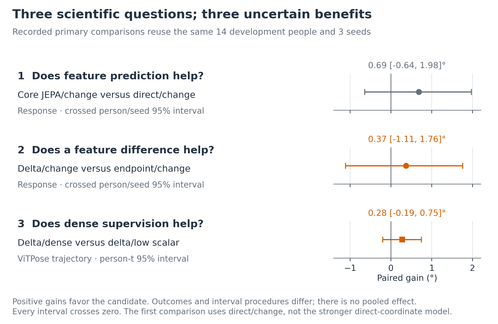
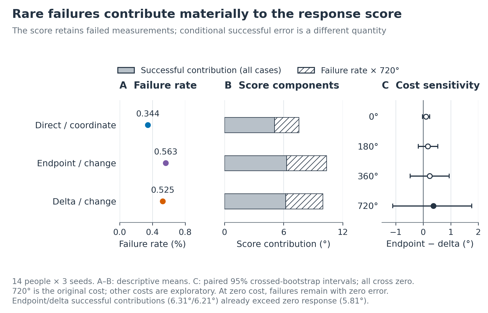
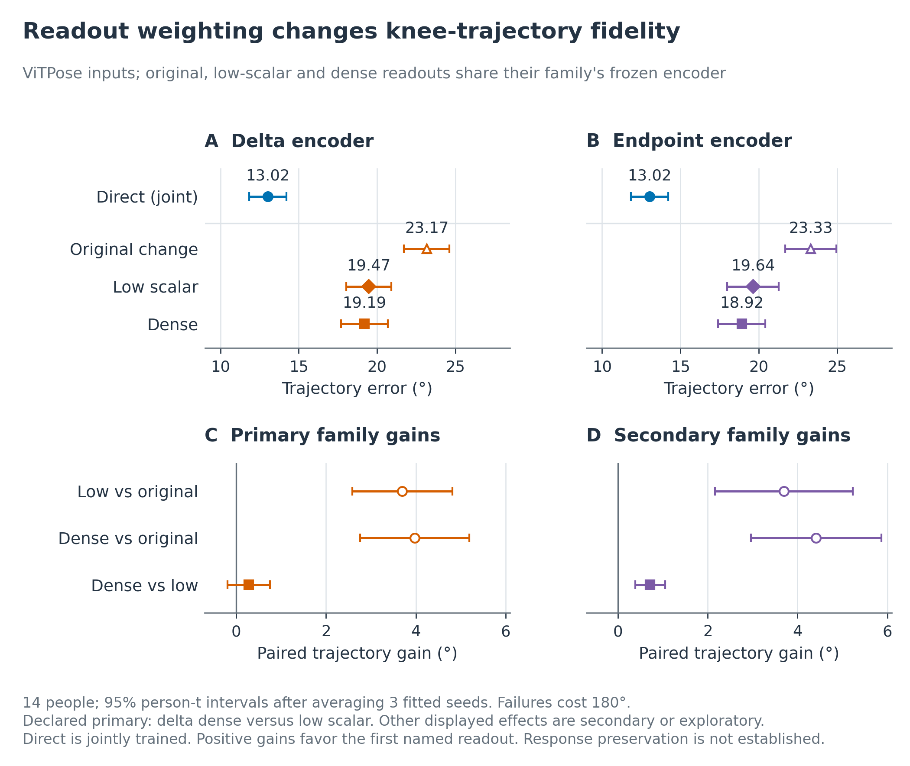
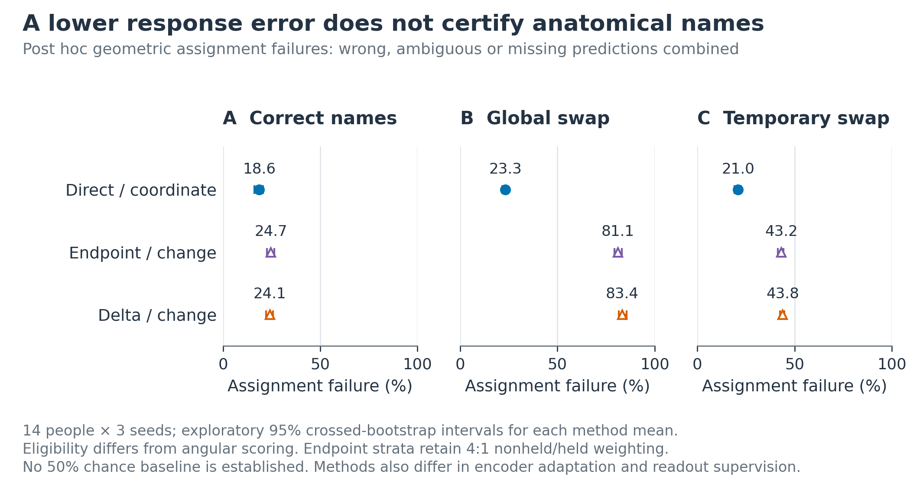
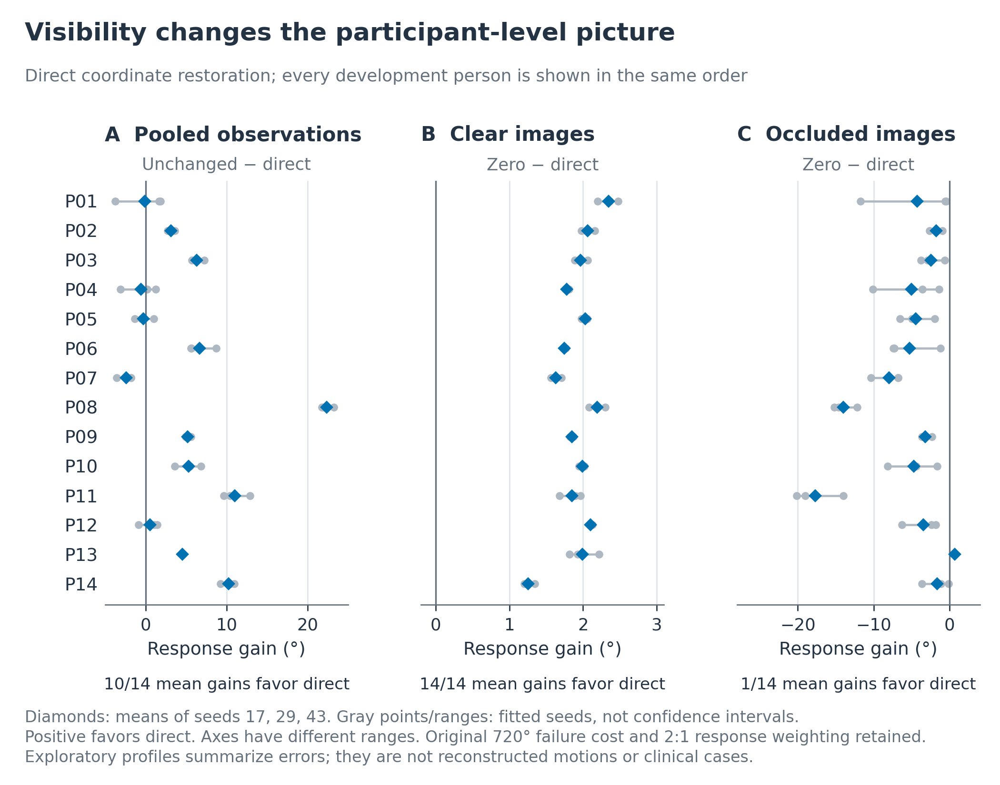

# Figures for the JEPA gait writeup

Eight rebuilt figures accompany the [writing and research plan](PLAN.md). Six use the paper's retained numerical exports. The workflow and future architecture are conceptual diagrams. No models were trained and no new confidence intervals were estimated. The [provenance record](figures/provenance.json) identifies inputs and checks; [plotted values](figures/plotted-values.csv) preserve every empirical mark.

The [PDF atlas](output/pdf/jepa-gait-figure-atlas.pdf) provides one figure per page. Individual SVGs retain editable text, individual PDFs contain vector line art and embedded fonts, and PNGs are available at 300 dpi. All empirical results concern the same 14 development people and three fitted seeds; repeated conditions do not increase the participant count.

## 1. From recorded movement to a measured change


**Caption.** Completed experimental workflow, redrawn from paper Figures 1 and 6 and Equation 1. Person identity determines the split before variants are constructed. A synthetic knee edit precedes optional physical mirroring; a fixed camera projects each pair. Estimated poses provide student inputs and clean projected references provide teacher/readout training targets. Endpoint and delta auxiliaries are alternatives in separate fits. Frozen encoders support the focal readout procedures; direct fitting jointly trains encoder and readout. Each development window is restored independently, then paired outputs and references determine response error. The arithmetic example is illustrative, not participant data. The diagram omits several controls for clarity; Figure 2 retains them.

**Use in the writeup:** introduce the measurement, explain the data pipeline, and distinguish training references from evaluation references. The development cohort is reused across all completed studies.

## 2. Restoration is not response recovery


**Caption.** Redrawn from paper Figure 2 using the unchanged restoration means and effects. A and B show hierarchical means over 14 development people and three seeds, pooled over estimators. Circles denote coordinate supervision; open triangles add scalar-response and geometry terms. Direct fitting updates its encoder; other encoders remain frozen during readout fitting. The zero-response baseline predicts no scalar change and appears only in A. C shows original-change minus coordinate-only trajectory error with existing exploratory crossed-person/seed 95% intervals from 2,000 bootstrap draws. Positive effects mean deterioration. Response and waveform failures retain costs of 720° and 180°. Marginal means in A-B have no displayed uncertainty; C supplies paired effect intervals.

**Use:** explain why improving coordinates and improving an asymmetry-change estimate are distinct objectives. The uncertainty and comparison boundaries remain essential to that interpretation.

## 3. Three scientific questions, three uncertain benefits



**Caption.** The three recorded primary comparisons, promoted from paper Appendix Figure 7. Positive gains are comparator error minus candidate error. The first two compare pooled asymmetry-change errors with paired crossed-person/seed bootstrap intervals; the third compares ViTPose waveform errors with a person-t interval after averaging seeds within people. Gains are 0.69° [−0.64, 1.98], 0.37° [−1.11, 1.76], and 0.28° [−0.19, 0.75]. The same 14 development people and three fitted seeds recur throughout. Different outcomes and uncertainty procedures are not pooled. All intervals include zero. The first comparison's direct/change comparator differs from direct coordinate fitting; “recorded primary” does not imply preregistration.

**Use:** put the uncertain incremental benefits in the main narrative rather than relying on a favorable secondary result.

## 4. Reliability changes the score



**Caption.** Reliability accounting, redrawn from paper Figure 3. A shows descriptive person-balanced response-failure percentages. B decomposes the mean score into successful-error contributions weighted over the whole eligible population and the weighted failure fraction multiplied by 720°. These are additive components, not error conditional on successful output. C retains every examined fixed failure cost, with the original 720° estimate filled and exploratory costs open. At zero cost, failed cases remain in the denominator with zero error. Paired endpoint-minus-delta 95% intervals use the existing crossed-person/seed bootstrap and all include zero. The endpoint and delta successful contributions already exceed the 5.81° zero-response score, so no nonnegative failure cost makes those fixed predictions beat zero under these weights.

**Use:** explain rare failures and score denominators in the technical companion. The cost decomposition describes arithmetic, not a causal failure mechanism.

## 5. What readout repair changed



**Caption.** ViTPose readout-repair results, redrawn from paper Figure 4. A-B show waveform means and person-t 95% intervals after averaging three seeds within each of 14 people. Direct-coordinate fitting jointly updates its encoder; original, low-scalar, and dense readouts use the same frozen encoder within each family. C-D show paired comparator-minus-candidate gains using the same person-t procedure. Dense versus low scalar for delta is the recorded primary; endpoint is secondary. Other displayed contrasts are exploratory and unadjusted. All waveform scores include 180° failures. Positive paired gains favor the first named readout. Marginal interval overlap is not a paired test. Reduced trajectory error does not establish preserved response accuracy, and the intervals condition on the fitted seeds.

**Use:** show why the next question arose from the prior result and why loss weighting, rather than a clear dense-supervision benefit, is the defensible lesson.

## 6. Geometry needs anatomical names



**Caption.** Post hoc geometric assignment, redrawn from paper Figure 5. Each point is a method's failure mean and each interval is its existing exploratory crossed-person/seed 95% interval over 14 people and three seeds. Wrong, ambiguous, and missing predictions are combined on eligible bilateral hip/knee/ankle pairs. These eligibility rules differ from angular scoring. All estimators, cameras, physical orientations, and observation conditions are pooled; endpoint strata retain the executed 4:1 nonheld/held weighting. Direct uses coordinate supervision and joint fitting; endpoint and delta use frozen encoders with the original change readout. The full 0-100% scale carries no asserted chance level. These intervals describe individual means, not pairwise contrasts.

**Use:** establish anatomical naming as a separate validation task. Do not describe the combined outcome as solely wrong-leg predictions.

## 7. Every development participant



**Caption.** Participant profiles redrawn from paper Appendix Figure 8 using its audited person and seed tables. A shows unchanged-minus-direct response error pooled over observation conditions. B and C show zero-minus-direct error under clear and occluded observations. Positive values favor direct coordinate restoration. Diamonds average seeds 17, 29, and 43; gray points and horizontal ranges show those fitted values, not confidence intervals. Every one of the 14 development people appears in the same order. Axis ranges differ and include every seed value. The original 720° failure cost, hierarchical aggregation, and 2:1 nonheld/held response weighting are retained. These exploratory profiles are summaries of errors, not reconstructed poses or clinical examples.

**Use:** expose heterogeneity without cherry-picking impressive cases. Keep the clear-versus-occluded distinction visible.

## 8. A testable route toward physical grounding


**Caption.** Proposed research architecture; none of its new components or benefits has been established by this study. Calibrated image/scale evidence, body reconstruction, and object/contact observations support a shared metric state with anatomical identity and uncertainty. The existing JEPA embedding is a candidate prior, not a source of uniquely identifiable metric depth. Measurement validity must be established against references outside the tool pipeline. Physics-derived supervision is conditional on body, force, and contact assumptions. After validation, separate experiments can test causal prediction, human-object generation, and cost-aware tool routing. Tool actions differ from physical control actions. This diagram is an organizing proposal, not an implemented agent, a trained generator, or evidence of clinical risk prediction.

**Use:** give the discussion a concrete destination while preserving the distinction between completed evidence and proposed research.

## Rebuild and inspect

From the repository workspace, run:

```sh
/Users/theodoremui/dev/alexpose/.venv/bin/python docs/ambient-jepa-writeup/scripts/build_figures.py
/Users/theodoremui/dev/alexpose/.venv/bin/python docs/ambient-jepa-writeup/scripts/build_documents.py
```

These exact workspace commands use Python 3.12.9. On another machine, substitute a configured interpreter rather than relying on the repository's inherited bare `python` selection. The plotting environment needs NumPy, pandas, Matplotlib, and Pillow; the document builder needs Pandoc and Poppler. Version numbers used for plotting are recorded in the provenance JSON. The builders use the current v08 numerical exports and assert cardinality, key score identities, primary intervals, participant counts, and bounds. No source-paper assets are modified. Color and grayscale contact sheets are inspection intermediates; the full-resolution figures are the delivery assets.
