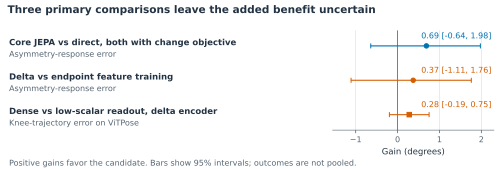

# Preserving gait measurements in ambient mobility assessment

Theodore Mui · Research overview · September 2026

A possible application for older adults in Stanford HAI's Sequoias study is an ambient mobility tool that distinguishes changes in walking from changes in how well a sensor observes them. Consider a camera view in which a chair briefly hides one leg. A pose estimator may place the knee incorrectly or exchange the left and right joint labels. A model that repairs these estimates could make the reconstructed walk look smoother while removing a real difference between the legs. If that reconstruction informed a mobility report, the resident and the person reviewing it could receive a misleading account of what changed.

*Evaluating JEPA-Inspired Motion Representations Through Geometry and Gait Asymmetry* examines this measurement problem before attempting a downstream assessment. [1] It asks whether learned motion features can restore noisy two-dimensional poses while preserving a controlled change in knee-motion asymmetry. The potential benefit is more dependable observation of a person's movement across imperfect recordings, which could eventually support everyday mobility monitoring or comparison between biomechanics assessment sessions. The experiments use synthetic observations derived from motion capture; they do not evaluate Sequoias residents, balance outcomes, or fall prediction.

An unusual movement may be meaningful for the person being assessed. Making a reconstruction more symmetric could obscure a difference that an assessor needs to track. Biomechanics research has shown that more symmetric step lengths can coexist with asymmetric joint mechanics. [2] Preserving the relevant measurement, including its anatomical side, is therefore important before interpreting its implications for mobility.

## Separating movement changes from observation errors

The study starts with walking candidates from AMASS, a motion-capture archive. Each approximately five-second window is paired with a version containing a synthetic right-knee edit. Fixed cameras project both motions into images, and three pose estimators produce the noisy joint observations. The experiment varies viewpoint and occlusion and deliberately exchanges input joint names. Clean projected joints remain available as references. This construction lets the researchers distinguish a change in movement from an error introduced while observing it, a distinction that would be difficult to establish from an uncalibrated home recording alone.

Training uses 1,645 windows from 112 people; evaluation uses 155 windows from fourteen different people. Each person's edited, mirrored, and corrupted variants stay in the same split, reducing the risk that familiarity with an individual's motion inflates performance. One pose estimator and the largest knee edit are withheld from fitting to probe transfer beyond the training inputs. These choices approximate parts of the variation an ambient system would encounter, while the synthetic setting leaves everyday clothing, walking aids, and clinical movement differences for later validation.

The target is a change in projected knee-motion asymmetry. For each leg, knee excursion is the ninety-fifth-percentile angle minus the fifth-percentile angle over a window. Asymmetry is right excursion minus left excursion; the response is how that difference changes between the original and edited motions. The reference is recomputed after projection because a three-dimensional knee edit need not produce the same angular change in the image. This outcome provides a controlled test of measurement preservation, although its clinical meaning has not been established.

<!-- PAGEBREAK -->

## Learning a representation that supports measurement

A joint-embedding predictive architecture, or JEPA, learns features by predicting a target's numerical representation. Here, a student transformer receives noisy joint sequences with some joint-time regions masked, while a slowly updated teacher receives clean projected references during training. Matching the teacher's features is intended to capture motion structure that helps recover obscured observations. The clean references provide privileged supervision, so the results concern this specific adaptation of JEPA to pose restoration.

The transformer uses the full observed window. A coordinate readout converts the resulting features back into joint positions. Each evaluation window is restored independently, so the completed task concerns recovering observed movement rather than forecasting it. Two additional training objectives compare matching each motion's features separately with matching the feature difference between paired motions. The latter targets the change relevant to a repeated assessment, but shared errors can cancel across a pair while leaving either reconstructed movement inaccurate.

Controls compare unchanged poses, direct training on reference coordinates, and always predicting no asymmetry change. Feature-based readouts generally freeze their encoders; direct training updates both encoder and readout. The evaluation checks response error alongside knee-angle trajectories and anatomical naming because a single summary can hide incorrect timing or side assignment. Failed predictions remain in the scores, with fixed costs of 720° for response and 180° for trajectories. Results average within each person before combining people and training seeds, so extra rendered views do not count as extra participants.

## What the comparisons showed

Direct coordinate training improves the noisy observations: mean knee-trajectory error falls from 18.57° to 12.07°, and asymmetry-response error falls from 12.69° to 7.54°. Yet always predicting no change scores 5.81°, below every one of the sixteen trained variants on the pooled response measure. Direct restoration beats that baseline in clear images but loses under occlusion. For a future Sequoias mobility report, this would make visibility a relevant condition for interpreting a measurement, even when processing returns a complete-looking skeleton.

**Figure 1. Uncertain benefits in the three primary comparisons.** Gains are comparator-minus-candidate errors. The first two concern response error and resample people and seeds; the third concerns ViTPose trajectories and uses a person-t interval after seed averaging. All reuse fourteen development people and three seeds. The core comparison uses the change objective for both methods, unlike the direct-coordinate result in the text.

<!-- PAGEBREAK -->

The three primary comparisons leave the incremental benefits uncertain (Figure 1). Unequal initial gradient influence and the different adaptation permitted by frozen and jointly trained encoders further limit attribution to the learned representation.

Adding scalar-response and short-segment geometry penalties increases knee-trajectory error in every model family. Reducing the scalar penalty lowers this error from 23.17° to 19.47° for the delta model on the withheld pose estimator; supervising angular changes throughout the sequence yields a further, uncertain 0.28° improvement. For balance-assessment research, this supports inspecting trajectories alongside the reported summary, because agreement on an excursion change can conceal errors in how the knee moved through time.

Anatomical naming introduces a further concern for side-specific interpretation. When input leg names are globally exchanged, the combined rate of wrong, ambiguous, or missing assignments is approximately 81-83% for the endpoint and delta feature models, compared with 23% for direct coordinate training. These geometric checks use different eligibility rules from angular scoring. They show why a plausible reconstruction cannot by itself establish which leg changed, a distinction that matters when an assessor compares sides or discusses a change with a participant.

## Implications for Sequoias and balance assessment

The paper's contribution is an evaluation that exposes where pose restoration can misrepresent a movement measurement. A future mobility interface could attach visibility information to an estimate and let an assessor inspect the relevant recording. It would also need to distinguish an unsupported measurement from an unchanged gait. Whether these choices improve understanding or reduce unnecessary concern would require evaluation with residents and assessors.

A practical next study would fix the comparisons before evaluating new people, then test natural recordings against independent three-dimensional motion references. It should separate repeated views of the same movement with added occlusion from paired trials in which movement genuinely changes. Each leg's trajectory and excursion change would need checking so that improved reconstruction does not erase an individual difference. Including walking aids and atypical gait would help determine when the method is useful to the intended participants. The current evidence comes from one repeatedly used development cohort and cannot establish performance in those settings.

For Sequoias, measurement validation would need to accompany resident control over sensing and a clear account of how estimates are used. A separate Stanford HCI participatory study with older adults in the Tenderloin documents concerns about surveillance and stigma. [3] A follow-up could examine how residents understand missing or uncertain measurements, and how assessors use that information when deciding whether to review a recording or repeat an assessment. This would connect the technical evaluation to decisions people make while living with and using an ambient system.

### Sources

1. *Evaluating JEPA-Inspired Motion Representations Through Geometry and Gait Asymmetry.* [Version 08 manuscript and evidence](../../iclr/versions/v08/paper-v08.pdf), 2026. All experimental results above come from this paper.
2. Padmanabhan et al. *Persons post-stroke improve step length symmetry by walking asymmetrically.* [Journal of NeuroEngineering and Rehabilitation](https://doi.org/10.1186/s12984-020-00732-z), 2020.
3. So et al. *“They Make Us Old Before We're Old”: Designing Ethical Health Technology with and for Older Adults.* [CSCW](https://doi.org/10.1145/3687017), 2024. This was a separate participatory study, not the Sequoias evaluation.
