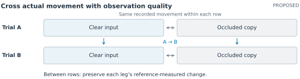

# Recommended continuation: determining when a gait change can be measured

Proposed research · Literature checked 28 September 2026

The strongest continuation is to study whether a change in each leg's movement remains measurable when visibility deteriorates. A future Sequoias mobility report might compare recordings taken days apart, with one leg partly hidden in the later recording. The useful output would include an estimate of change and evidence that the comparison is supported. An unsupported comparison should remain distinguishable from an unchanged movement, especially when an assessor is deciding whether another observation would justify the burden of repeating an assessment.

The asymmetry study gives this question a concrete starting point. Direct coordinate supervision improves reconstruction, yet an always-zero response performs better on the pooled change measure. The exploratory visibility analysis locates an important failure under occlusion, while anatomical naming errors undermine side-specific interpretation. These findings motivate testing the reliability of a reported change. They provide limited support for choosing JEPA as the preferred architecture, so its contribution should remain an experimental question.

## What would distinguish this study from existing work?

Several close precedents substantially narrow the opportunity. Stenum et al. already validate within-person, speed-related gait changes against motion capture in stroke and Parkinson's disease. [4] DeepGaitLab evaluates baseline-adjusted step-length asymmetry during split-belt walking. [5] Cotton and Sinz reconstruct biomechanical trajectories with uncertainty, including asymmetric stroke gait and occlusion; their calibration uses detected keypoints because independent reference poses are unavailable. [6] Pace et al. evaluate uncertainty-based retention of reconstructed anatomical landmarks. [7] Repeatability and minimal detectable change are also established topics in smartphone biomechanics. [8]

The September 2026 SynthGait-19K preprint is especially relevant. Its GaitXFormer uses V-JEPA2 initialization, and its evaluations include controlled occlusion and within-patient directional changes associated with clinical scores. [9] Consequently, JEPA-based gait estimation, sensitivity to occlusion, and detecting movement change each have substantial precedent. OpenCap Monocular also already combines WHAM, pose refinement, and biomechanical modeling. [10]

The proposed contribution would be a method and evaluation for **preserving independently measured changes in each leg while identifying comparisons that admit conflicting explanations under occlusion**. The evaluation would test real movement changes and observation-only changes together. A new technical component would search for alternative trajectories that fit the landmark observations but imply a different knee-excursion change. Its value would depend on detecting misleading comparisons better than existing uncertainty estimates or simple visibility rules.

This is a plausible, bounded originality claim. The search found close work on every component, but did not identify a study demonstrating this complete measurement-specific test. That finding supports investigating the direction; it cannot establish that the idea has never appeared elsewhere. The independent novelty audit records the closest overlaps and the limits of this assessment.

<!-- PAGEBREAK -->

## An experiment that separates movement from visibility

Begin with synchronized video and an independent marker-based motion reference. For each person, select two prespecified walking trials, A and B, and derive each leg's change from the reference measurements. The target is the observed difference between these trials; an instruction to walk differently does not establish its magnitude or a causal treatment effect. Knee excursion would retain the percentile definition used in v08, now applied to explicitly defined anatomical 3D flexion angles. This would be a new outcome, requiring its own repeatability assessment.

**Figure 2. Proposed experiment; no results are shown.** Digital masks change the target camera's evidence while leaving the recorded movement and independent reference unchanged. Every clear/occluded combination of the two trials tests the same reference-defined change. A separate natural-occlusion evaluation would assess transfer beyond this controlled manipulation.

For the observation-only test, compare a recording with an occluded copy of itself. Any reconstructed change is an observation error. For the movement test, compare A with B under each visibility combination. A method that always returns zero can pass the first test while failing the second. Each leg must be scored separately because errors can cancel in a right-minus-left asymmetry summary. The full knee trajectories and anatomical assignment remain necessary checks.

Keep all variants from one person together, with separate people for fitting, calibration, and final evaluation. Fix trial support, pairing, camera conventions, and failure handling before testing. Occlusion should vary in duration and gait phase, including the period of greatest knee flexion. The reference cameras must remain unaffected by the digital masks. Marker placement, soft-tissue motion, and the reference body model introduce their own errors, so reference agreement must be interpreted alongside repeatability and model sensitivity.

Start with a small public-data pilot, verifying access to synchronized RGB, calibration, participant identifiers, and pairs with reference-resolvable knee changes. Public OpenCap data from ten healthy adults offer a starting point, although trunk-sway trials may provide insufficient knee variation. Its monocular refinement was tuned using these data, so final comparative claims require independent data. [10] Prespecify the balance of null and changed pairs and the change magnitudes evaluated. Later testing would need actual atypical gait and assistance, with natural occlusion held out from development; this pilot cannot establish performance for Sequoias residents.

<!-- PAGEBREAK -->

## Searching for a conflicting explanation

The method would start from a reconstruction and search for alternative lower-limb trajectories that agree with visible 2D landmark detections within calibrated tolerances, while increasing or decreasing each leg's excursion change. Estimated hidden landmarks would remain unobserved. These alternatives test ambiguity under the landmark model; silhouettes might rule them out. The tolerances and smallest resolvable change would be fixed from a separate pilot and reference repeatability, without assuming a clinical threshold.

This search should begin offline with short sequences, known cameras, and independently calibrated body dimensions. It would retain consistent dimensions across trials while allowing session-specific camera parameters where appropriate. Joint limits and continuity would constrain the alternatives without requiring symmetric walking or similarity to a healthy gait template. These conditions establish limited kinematic admissibility. Claims about balance, joint loading, or muscle forces would require additional measurements and assumptions.

A local search explores only part of the possible movement space. A found alternative can demonstrate ambiguity under the stated constraints; an unsuccessful search cannot establish that the reported change is identifiable. Every candidate must pass an independent constraint check, and the exact percentile outcome must be recomputed if optimization uses a smooth approximation. Tests should record whether the reference trajectory is excluded by the assumptions, as well as sensitivity to initialization, camera uncertainty, and computation budget. Rigid-object methods such as CLOSURE and SLUE provide precedent for pose uncertainty sets and clarify the distinction between explored solutions and outer bounds. [11,12]

A small temporal refiner could combine a fixed 3D initialization with 2D pose features. Both versions would share a compatible 2D encoder and 3D readout, varying JEPA pretraining before identical supervised adaptation; pretraining data and compute would be reported separately. Supervision would cover each leg's trajectory and excursion change, with occluded copies providing consistency examples. Geometry and ambiguity search would be separate ablations. The v08 loss results make matched loss-weight selection and checks for erased changes essential.

The reporting rule would retain or decline an entire trial pair; removing uncertain frames could erase peak flexion. Intervals would be calibrated jointly for both legs on independent people, accounting for repeated pairs and following task-level uncertainty methods. [13] An interval wholly beyond the resolution band around zero supports a change; one wholly inside supports a change smaller than that resolution. Other cases remain inconclusive. Coverage must be checked after selection and within gait and visibility groups, without a guarantee for each resident.

On all reference-eligible pairs, first test noninferiority on per-leg change error against the locked baseline using the pilot-derived margin, then test trajectory superiority. Include failures under a prespecified rule and retain zero-response and interpolation controls. Separately compare search flags with visibility thresholds, calibrated intervals, and ensemble disagreement at matched retention: the proportion of complete comparisons reported. Count false changes, missed changes, and wrong-side reports, and audit retention across difficult cases. Confidence intervals would resample people with all their pairs. A simple rule performing equally well would remove the case for the extra search cost.

<!-- PAGEBREAK -->

## Feasibility, scientific value, and later extensions

The first deliverable should be a locked evaluation protocol and baseline audit, followed by a limited feasibility test of the ambiguity search. The v08 checkpoints and full prediction artifacts would need recovery or regeneration before claiming a direct replication. Existing reconstruction tools and a small refiner keep the new study within reach without training a foundation model. The main dependencies are suitable reference data and a biomechanics collaborator to establish measurement conventions. Sample size should follow pilot estimates of between-person variation and the chosen preservation margin.

Among the directions in the plan, calibrated 3D observation and transparent biomechanical constraints most directly support this experiment. Depth or an additional view could then be evaluated by whether it resolves an ambiguous comparison. OpenSim-derived training losses deserve a later ablation once their assumptions can be checked independently. Robot dynamics, full movement generation, and joint human-object generation add substantial modeling requirements before the present measurement problem is resolved. A Qwen agent trained with reinforcement learning would be justified in this project after a fixed tool pipeline demonstrates which additional observations improve the comparison and what they cost the participant.

The scientific value would come from establishing when restoration preserves a meaningful individual difference and when the available evidence is insufficient. A well-controlled negative result could identify failure conditions and provide a reusable test for future representations. For HCI, a subsequent study could examine how residents and assessors interpret a qualified measurement, an unavailable comparison, or a request for another observation, while respecting residents' control over sensing. Those studies would determine whether the technical gains improve decisions or reduce unnecessary effort; the proposed knee measurements alone would not establish fall risk or clinical benefit.

### Sources for the proposed direction

4. Stenum et al. *Clinical gait analysis using video-based pose estimation: Multiple perspectives, clinical populations, and measuring change.* [PLOS Digital Health](https://doi.org/10.1371/journal.pdig.0000467), 2024.
5. Shin et al. *DeepGaitLab: Accurate and Flexible Markerless Motion Tracking Powered by Synthetic Data.* [Research Square preprint](https://doi.org/10.21203/rs.3.rs-8998239/v1), July 2026.
6. Cotton and Sinz. *Biomechanical Reconstruction with Confidence Intervals from Multiview Markerless Motion Capture.* [EMBC](https://pmc.ncbi.nlm.nih.gov/articles/PMC13188178/), 2025.
7. Pace et al. *Uncertainty-Aware Mapping from 3D Keypoints to Anatomical Landmarks for Markerless Biomechanics.* [arXiv preprint](https://arxiv.org/abs/2603.26844), March 2026.
8. Horsak, Kainz, and Dumphart. *Repeatability and minimal detectable change including clothing effects for smartphone-based 3D markerless motion capture.* [Journal of Biomechanics](https://doi.org/10.1016/j.jbiomech.2024.112281), 2024.
9. Mehraban et al. *SynthGait-19K: A Physically Grounded Synthetic Video Dataset for Gait Parameter Estimation.* [arXiv preprint, including Appendices E.2 and F.4](https://arxiv.org/pdf/2609.08108), September 2026.
10. Gilon, Miller, and Uhlrich. *OpenCap Monocular: 3D Human Kinematics and Musculoskeletal Dynamics from a Single Smartphone Video.* [arXiv preprint](https://arxiv.org/abs/2603.24733), March 2026.
11. Gao et al. *CLOSURE: Fast Quantification of Pose Uncertainty Sets.* [Robotics: Science and Systems](https://www.roboticsproceedings.org/rss20/p072.pdf), 2024.
12. Shaikewitz, Georgiou, and Carlone. *Uncertainty Quantification for Visual Object Pose Estimation: S-Lemma Ellipsoidal Bounds.* [IEEE Transactions on Robotics](https://doi.org/10.1109/TRO.2026.3717258), 2026.
13. Wen, Ahmad, and Schniter. *Task-Driven Uncertainty Quantification in Inverse Problems via Conformal Prediction.* [ECCV](https://arxiv.org/abs/2405.18527), 2024.

The supporting [independent novelty audit](../reviews/research-direction-novelty-audit.md) and [search record](../reviews/RESEARCH-SEARCH.md) document additional precedents, design objections, and source-access limits. All experiments in this section are proposed.
