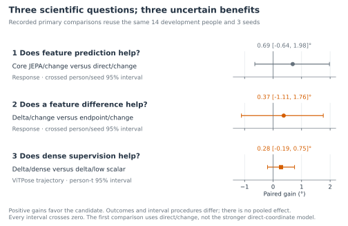
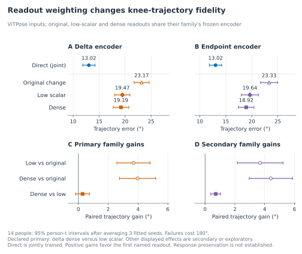
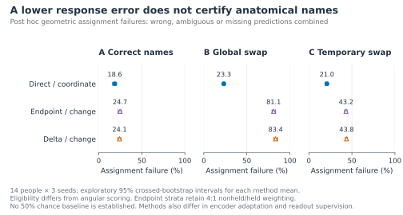
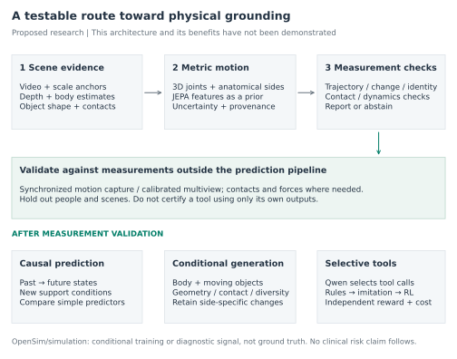
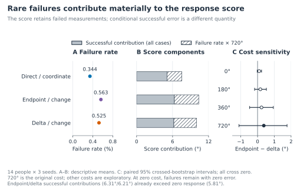

# Can a motion model preserve how someone walks?

*JEPA, gait asymmetry, and the path toward ambient biomechanics*

Theodore Mui · September 2026

## Overview

In my earlier work on ambient intelligence, I explored how pose estimates and video context could help a vision-language model interpret mobility. Pose estimates describe where a person's joints appear, while video also shows surroundings such as chairs and walking aids. Combining these sources seemed a useful direction for fall-risk research. The limitations of those early experiments raised a more basic question: how much can we trust the movement information that reaches a downstream model? [2]

The study described here examines that question through controlled gait restoration. It evaluates whether representations inspired by a joint-embedding predictive architecture, or JEPA, preserve a change in knee-motion asymmetry when repairing noisy two-dimensional poses. Direct coordinate training improves the noisy observations. However, all sixteen trained variants have higher pooled asymmetry-change error than a baseline that always predicts no change, and the incremental benefits in the three primary comparisons remain uncertain. The clearest contribution is a demonstration that coordinate accuracy, movement-change accuracy, and anatomical naming require separate checks. [1]

Consider a hypothetical camera observing someone walking through a rehabilitation space. A chair briefly hides one leg, and the pose estimator produces unstable joints or exchanges the leg labels. A restoration model returns a smoother skeleton. That output may look reassuring, yet it could have erased a real difference between the legs or assigned it to the wrong side. The practical objective is to recover the person's movement well enough to support a measurement, including recognizing when the recording cannot support one.

This matters for ambient intelligence because everyday spaces offer repeated observations of movement outside a laboratory. Such observations could eventually help track mobility within a person, but they also introduce occlusion, changing viewpoints, and interactions with objects. Ambient healthcare research identifies both this opportunity and the need for rigorous validation. [3] Biomechanics adds a further lesson: symmetry is not automatically evidence of healthier movement. In a study of nine people after stroke, more symmetric step lengths coexisted with asymmetric joint mechanics. [4]

The present experiment does not estimate fall risk. It investigates an upstream requirement for that broader goal: preserving the evidence from which a movement assessment would be made. A synthetic asymmetry measure, a gait classification, and a prediction of future falls are different outcomes, each needing its own references and validation.

## What the experiment measures

We begin with the angle at the knee in a two-dimensional image, formed by the knee-to-hip and knee-to-ankle segments. As the person walks, that angle changes over time. For each leg, the study summarizes its excursion by subtracting the fifth-percentile angle from the ninety-fifth-percentile angle. This captures the range of most of the observed knee motion without relying on a single extreme frame.

Call the excursion of a leg *q*. The asymmetry *A* is the right excursion minus the left excursion. For an original motion *a* and its edited counterpart *b*, the response ΔA is the difference between their asymmetries:

$$
q_{i,\ell}=P_{95}(\theta_{i,\ell})-P_5(\theta_{i,\ell}),\qquad
A_i=q_{i,R}-q_{i,L},\qquad \Delta A=A_b-A_a.
$$

An illustrative example makes the arithmetic concrete. Suppose the original left and right excursions are 40° and 50°, giving an asymmetry of 10°. If the edited excursions are 40° and 55°, asymmetry becomes 15° and the response is 5°. These are teaching numbers, not participant measurements. Response error is the absolute difference between the model's estimated response and the reference response.

This measurement has useful limits. The same response can arise from different changes in the two legs. Excursion also discards temporal order: two trajectories can span the same angle range while differing substantially from frame to frame. Walking involves alternating legs, so symmetry does not mean that their instantaneous angles must match. The study therefore also evaluates knee-angle trajectories and anatomical left-right assignment.

All these angles are measured after projection into an image. They are not calibrated three-dimensional anatomical knee angles. A nominal 10° edit to the body model need not produce a 10° response in the projected measurement. References must be recomputed after projection, rather than treating the edit magnitude as the answer.

## Building a controlled movement experiment

The experiment uses walking candidates drawn from AMASS, an archive of motion capture represented through body models. [5] Candidates are screened using filenames and projected geometry, rather than clinical diagnoses. Each motion is resampled to 25 Hz and divided into nonoverlapping windows of 128 samples, spanning 5.08 seconds from the first sample to the last.

Person identity determines the split before variants are generated. Fitting uses 112 people, 692 motions, and 1,645 windows. Evaluation uses 14 different development people and 155 windows. Every edit, camera view, mirrored version, and corrupted observation inherits its source person's split; known duplicate motion hashes cannot cross splits. These fourteen development people are unrelated to the earlier project's count of fourteen Toronto videos. The completed studies repeatedly use the same development cohort; no independent confirmation evaluation was completed.

For each original window, the pipeline creates a paired version with a nominal right-knee edit of 0°, 5°, 10°, or 15°. The edit uses an ankle-height proxy to determine when it acts and tapers at window boundaries. It provides a controlled movement difference, not a simulation of disease or treatment. Zero edits support a no-change diagnostic; nonzero response scoring excludes them.

Optional physical mirroring follows the edit. Fixed oblique and side cameras, at 45° and 90°, project each pair to clean reference joints. Rendered images then supply the observations from which RTMPose-M, HRNet-W32, and ViTPose-base estimate poses. The design crosses clear and occluded images with correct, globally exchanged, or temporarily exchanged input joint names. Reference anatomical names remain fixed. Rendering-derived person boxes remove person-detector uncertainty, an additional challenge that real deployment would need to address.

Each window retains 128 frames, twelve joint slots, and two coordinates per joint, accompanied by confidence, availability, and timestamps. Missing joints keep their slots. Naming swaps move the observations, confidence, and availability together. ViTPose inputs and the 15° edit are excluded from optimization and loss calibration, although their evaluation still uses the same development people.

Figure 1 separates preparation, fitting, and evaluation. Physical mirroring and naming corruption test different problems. Exchanging already measured left and right excursions reverses the sign of asymmetry; mirroring a three-dimensional body before projection need not produce that exact exchange. The model must correct observation errors without assuming that a meaningful movement change should disappear.

**Figure 1. From recorded movement to a measured change.** Person identity fixes the split before variants are created. The teacher and readout receive projected reference targets during training. Endpoint and delta auxiliaries are fitted in separate runs; the focal readout procedures freeze their encoders, while direct fitting updates encoder and readout together. Each development window is restored independently, and the pair is used afterward to score the change. The cohort is reused across studies. The arithmetic example is illustrative and shows no participant reconstruction.

## What the model learns

JEPA offers a way to learn a useful numerical description of an observation by predicting features of a target. An encoder converts input into feature vectors; a predictor learns relationships between those vectors. S-JEPA applies this idea to masked skeletal sequences and evaluates action recognition. [6] The current study adapts the idea to a different question: whether features support faithful restoration of gait measurements.

A student encoder receives noisy estimated joints. A teacher encoder receives clean projected references during training and is updated gradually from the student. At selected masked joint and time locations, a predictor tries to match the teacher's features. The references give privileged training information, so this is a JEPA-inspired procedure with paired synthetic supervision. It is not a purely label-free experiment or a reproduction of the published S-JEPA benchmark. This adaptation uses the student downstream; published S-JEPA uses its target encoder.

Four consecutive frames of one joint form a token, producing 384 tokens per window. Graph-time masks hide connected joint regions and time intervals while preserving slot identities. The transformer can use the full observed window to infer missing or noisy coordinates. Consequently, the completed task is restoration, not forecasting. The base learning objective uses a DINO-style teacher-student comparison and VICReg regularization to discourage constant or redundant features. [7, 8]

The representation experiments then ask whether the training objective should emphasize each motion or the difference between paired motions. The **endpoint objective** matches predicted and reference features separately for the original and edited windows. The **delta objective** matches their feature differences. A shared error in both endpoints can cancel in a difference, so success at predicting a difference does not establish that either endpoint is accurate. Neither feature difference has a calibrated physical unit.

A small decoder, called the readout, translates features into joint coordinates. It predicts corrections where joints are observed and absolute positions where they are missing. Most comparisons freeze the encoder while fitting the readout. Direct coordinate training instead updates encoder and readout together. At evaluation, each window is restored independently; the model does not receive both development windows together to reconstruct either one.

Readout supervision introduces another choice. Coordinate-only training minimizes joint-position error. The original change package adds penalties for asymmetry-response error and very short predicted segments. The follow-up keeps coordinates and geometry fixed while either reducing the scalar response weight or supervising paired angular changes at every supported leg and time. It asks whether a better output objective can improve the use of an already learned representation.

The control models clarify what the comparison can tell us. Initialized features test what a trained readout can recover without encoder pretraining. Shuffled JEPA uses reference windows from the same person with correspondence disrupted. Coordinate pretraining learns to reconstruct positions; coordinate-delta pretraining also targets paired coordinate differences. Core JEPA uses the base feature objective, while endpoint and delta add their respective feature penalties. Together with direct joint fitting, these form the eight families in Figure 2. Each has coordinate-only and original-change readouts, giving sixteen variants within one experiment.

### How success is evaluated

The principal response score measures error in ΔA. A separate trajectory score measures mean absolute knee-angle error across both legs and eligible timestamps. Normalized location error measures joint distance relative to the rendered person-box diagonal. A later geometric check compares left-right assignments. A baseline that always predicts ΔA = 0 tests whether a model's response estimates improve on predicting no change; it supplies no restored trajectory.

Failed predictions remain in the eligible population, with fixed costs of 720° for response and 180° for trajectory error. Results average conditions within windows, windows within motions, motions within people, then seeds. Extra views therefore do not create extra people. The first two primary comparisons use paired bootstrap intervals that resample people and seeds separately. Readout repair uses a t interval over fourteen seed-averaged person effects. Three training seeds capture only limited training variation, and neither interval accounts for repeated development-driven choices. The technical companion gives the exact support and weighting rules.

## What the experiments found

### Better coordinates can still give the wrong movement response

Direct coordinate training provides a useful starting point. Compared with unchanged pose estimates, mean response error falls from 12.69° to 7.54°, knee-trajectory error from 18.57° to 12.07°, and normalized location error from 0.0718 to 0.0298. The paired response improvement is 5.14° with a 95% interval of [2.15°, 8.65°]. Restoration clearly improves these observations under the study's conditions. Figure 2 places that result alongside the other model families and output objectives.

**Figure 2. Restoration is not response recovery.** A-B show hierarchical means over fourteen development people and three seeds, pooled over estimators. Circles denote coordinate supervision; triangles add response and geometry terms. Direct fitting updates its encoder; other readouts use frozen encoders. C shows change-minus-coordinate trajectory error with exploratory crossed-person/seed 95% intervals. Positive values indicate deterioration. Failures retain costs of 720° for response and 180° for trajectories. The zero-response baseline has no trajectory output. Means in A-B have no displayed intervals; C gives paired uncertainty.

However, the zero-response baseline scores 5.81°. It outperforms all sixteen trained variants in the pooled response comparison, including direct coordinate restoration. This is a demanding warning: a model can improve a noisy skeleton while still estimating the movement change less accurately than simply predicting no change. Zero response is not a useful skeleton reconstruction; it is a necessary check on the scalar claim.

This pooled result does not imply that the models contain no response information. Small reference changes favor zero, and occasional invalid reconstructions increase model scores. Direct coordinates beat zero in both clear-image nominal-edit groups, but lose in both occluded groups. Endpoint and delta with the original change readout lose in all four groups. The distinction is relevant to ambient monitoring, where the most difficult observations may be exactly those for which an apparently complete reconstruction is least trustworthy.

The original change readout also increases trajectory error in all eight model families, by 4.39° to 7.21° (Figure 2). For core JEPA, response error falls from 10.69° to 10.07° while trajectory error rises from 17.45° to 22.55°. Improving the excursion summary can therefore accompany deterioration in the underlying angular motion. Because the original package adds both scalar-response and geometry terms, this contrast cannot isolate the effect of the scalar term alone.

### The primary incremental benefits remain uncertain

Figure 3 places the three recorded primary comparisons together. Core JEPA improves response error over direct training under the original change objective by 0.69°, but its interval includes zero. The delta feature objective improves over endpoint matching by 0.37°, also uncertain. Under coordinate-only readouts, their point ordering reverses; the interaction is uncertain as well. The data therefore do not establish a generally better feature objective.

The third primary comparison, dense versus low-scalar readout supervision, improves the delta model's ViTPose trajectory score by 0.28°, with an interval of [-0.19°, 0.75°]. These outcomes and interval methods differ, so the three estimates should not be pooled. Nor does calling them recorded primary comparisons imply preregistration. The same small development cohort informed successive experiments.

The optimization setup also limits interpretation. A shared coefficient gives endpoint and delta very different initial gradient magnitudes, and almost every update clips the combined gradient. Equal coefficients therefore did not make these objectives equally influential. This observation is a reason to test matched controls, not a demonstrated explanation of the final ranking. The uncertainty concerns these fitted procedures; it does not settle the value of JEPA for movement understanding in general.

**Figure 3. Three questions, three uncertain benefits.** Positive gains are comparator error minus candidate error. The first comparison uses direct training with the change objective, which differs from the stronger direct coordinate baseline. The first two intervals resample fourteen people and three seeds; the third conditions on those fitted seeds after averaging within people. No interval excludes zero. Repeated use of the development cohort and adaptive research choices are outside these uncertainty estimates.

### Loss balance matters more clearly than dense supervision

The readout follow-up holds each encoder fixed. For delta features on ViTPose inputs, lowering the scalar weight reduces trajectory error from 23.17° to 19.47°. Dense supervision lowers it further to 19.19°. The first step accounts for about 93% of the total decrease in these means. Its paired improvement is 3.70° [2.58°, 4.81°]; the additional dense benefit is uncertain.

The endpoint model shows a favorable secondary dense-versus-low-scalar gain of 0.72° [0.39°, 1.05°], without adjustment for exploratory comparisons. Neither repaired feature model approaches the direct coordinate ViTPose mean of 13.02°. Moreover, the delta response contrast is too imprecise to establish that dense supervision preserves response accuracy. Figure 4 supports a practical lesson about balancing output objectives, rather than a demonstrated solution to measurement preservation.

**Figure 4. What readout repair changed.** Results use ViTPose inputs, fourteen people, and three fitted seeds averaged within each person. Intervals are person-t 95% intervals. A-B show means; C-D show paired gains. Encoders remain frozen within each feature family, while direct coordinate training updates its encoder. Delta dense versus low scalar is primary; endpoint is secondary, and other contrasts are exploratory. All trajectory scores include 180° failures. Overlap of marginal intervals is not a paired test, and a trajectory gain does not prove preserved asymmetry response.

### Anatomical identity is a separate failure mode

Under globally exchanged input names, combined assignment failure is 23.29% for direct coordinate fitting, 81.12% for endpoint features, and 83.40% for delta features. This outcome includes wrong, ambiguous, and missing assignments, using support rules different from angular scoring. It has no asserted 50% chance level. A geometrically plausible skeleton can consequently remain unsuitable for a side-specific assessment. Reliability and participant profiles in the technical companion show further limits, especially under occlusion.

**Figure 5. Geometry needs anatomical names.** Points show combined wrong, ambiguous, and missing assignment on eligible bilateral hip, knee, and ankle pairs. Bars are exploratory crossed-person/seed 95% intervals for individual means, not pairwise effects. All estimators, views, physical orientations, and observation conditions are pooled with the executed 4:1 nonheld/held endpoint weighting. Direct uses joint coordinate fitting; endpoint and delta use frozen features with the original change readout. The full percentage scale avoids implying an unsupported chance threshold.

## Toward movement understanding grounded in evidence

The research direction emerging from these results is to make learned motion features accountable to measurements. In a rehabilitation setting, the useful question would be whether an apparent within-person change survives camera noise, occlusion, and reconstruction. A system should preserve valid atypical movement, identify anatomical sides, and express uncertainty when those requirements cannot be met. The present findings establish why those checks matter, while leaving their achievement open.

**Teaching a vision model physics.** A useful operational test is whether the model predicts what happens next when viewpoint, contact, load, or motion changes. Physion and V-JEPA 2 illustrate different approaches to physical prediction and action-conditioned learning. [9, 10] For gait, a first experiment should compare future motion and contact predictions against persistence, coordinate-based temporal models, and the same model without pretraining. The full pipeline must see only the observed prefix. Full-window restoration cannot establish forecasting ability, and changing a software tool is different from applying a physical action to the world.

**Estimating physical grounding.** A single plausible-looking score is insufficient. An evidence profile should separately report anatomical identity, metric geometry, kinematic consistency, contact with the scene, and dynamic feasibility under stated assumptions. Deliberately corrupted examples can test sensitivity, but independent measurements must test correctness. Evaluation should measure acceptance of impossible movement and rejection of physically valid atypical movement. Uncertainty and abstention belong alongside accuracy.

**Using S-JEPA features for recognition and generation.** Begin with frozen-feature heads for externally validated movement measures, compared with coordinates, simple gait features, random features, and matched fine-tuning. Generation requires an additional decoder and an objective that represents multiple possible motions. A conditional diffusion model is one candidate, building on prior motion-generation research. [11] Compare conditioning on JEPA features with conditioning directly on coordinates. SMPL joint positions are derived outputs, distinct from body-pose, shape, and global-translation parameters. [12] Evaluate the intended per-leg changes, contact, anatomical identity, and diversity; smoothness alone cannot establish success.

**Adding biomechanics or simulation during training.** Start with offline analyses before using a physics-derived loss. OpenSim inverse kinematics estimates pose from observations; inverse dynamics additionally requires inertial properties and external-force assumptions or measurements. [13] Robot simulation can test contact feasibility, but its actuators do not automatically represent human muscle function. OpenCap connects video to biomechanical analysis. [14] The 2026 OpenCap Monocular preprint refines WHAM estimates through optimization, then estimates biomechanical quantities using constrained models, simulation, and learning. [15] A useful contribution here would be independently demonstrated preservation of movement changes and calibrated uncertainty. Compare coordinate, geometric, and dynamic supervision under matched training budgets, and test whether gains survive changes in body and force assumptions. Physics-guided motion generation also has prior work. [16]

**Recovering depth.** Normalized two-dimensional features cannot uniquely determine metric depth. Add image evidence, camera information, and an independent scale anchor. WHAM and Depth Anything V2 are candidate components, each requiring validation in the intended setting. [17, 18] Compare the tool alone with frozen and adapted JEPA-assisted versions. Measure global depth, foot clearance, and contact against independent references; alignment-based pose scores can hide scale and translation errors.

**Building a Qwen tool agent.** Qwen can provide a vision-language interface, while tools supply masks, depth, and body motion. [19, 20] First compare a fixed pipeline, simple routing rules, and supervised routing. Only then test reinforcement learning under matched tool budgets. Reward independently measured accuracy, penalize unsupported confident claims and unnecessary latency, and score abstention by both coverage and retained accuracy. Agreement among tools is not ground truth. Segment Anything masks do not by themselves identify three-dimensional contact.

**Generating people and objects together.** Begin with a fixed chair and contact-conditioned human movement, then progress to joint human-object generation such as carrying a rigid box. The second stage must generate both the person's motion and the object's trajectory. A shared rigid transform should keep object keypoints geometrically consistent. Compare with uncoupled generation and simple trajectory baselines on unseen object shapes and paths, building on CHOIS and InterDiff. [21, 22] Test contact timing, collision, object stability, and whether the requested gait change survives interaction.

**Figure 6. A testable route toward physical grounding.** This is a proposed architecture, not a completed system. Independent scale and visual evidence support a metric state with anatomical identity and uncertainty. JEPA features are a candidate prior. Measurement validity is checked against references outside the tool pipeline before claims about prediction, human-object generation, or tool routing. Physics-derived supervision remains conditional on body, force, and contact assumptions. No component here has demonstrated clinical risk prediction in the present study.

The next study should first confirm the two-dimensional findings on untouched people with matched training and simpler temporal baselines. It should then test paired changes using independent three-dimensional references, distinguishing unchanged movement under observation corruption from genuinely different movement trials. Preservation of a measured per-leg change should be established before claiming an improvement in trajectories. This sequence would connect representation learning to a specific ambient task: monitoring mobility changes without quietly replacing a person's movement with a more typical one.

## Technical companion

The following details make the narrative auditable and define what the proposed next studies would need to establish. Completed settings and new proposals are identified separately. No GAVD or natural-video evaluation was completed. The retained evidence packet supports numerical and figure checks but lacks the complete reconstructed trajectories and checkpoints needed to repeat the full pipeline.

### A. Completed representation and readout training

**Inputs and normalization.** Each input has shape 128 × 12 × 2 for coordinates, with matching joint confidence and availability plus frame timestamps. Translation and scale use available, unmasked observations; references use the same normalization. Four-frame joint patches flatten five channels per frame into twenty input channels. The encoder has width 96, four transformer layers, and four attention heads. The predictor has two layers. The 32 temporal patches across twelve joints yield 384 tokens.

**Base objective.** Teacher features are centered with momentum 0.9; teacher weights follow a student exponential moving average whose momentum rises from 0.99 to 0.999. DINO-style cross-entropy uses teacher and student temperatures 0.06 and 0.1. The total base loss adds 0.05 times VICReg, whose invariance, variance, and covariance weights are 25, 25, and 1. Each of its two views receives a sampled two-dimensional translation, whose x and y components are uniform in [-0.02, 0.02] normalized units. This choice is a representation regularizer, not a physical transformation model.

**Paired feature auxiliaries.** Let *p* be predicted student logits, *t* teacher logits, *c* the teacher center, and *H* centering across the *D* logit channels. The stop-gradient operation, written sg, blocks optimization through the target. For a common masked query in original window *a* and edited window *b*:

$$
e_i=H[p_i/0.1-\operatorname{sg}((t_i-c)/0.06)].
$$

$$
L_{E,k}=(\|e_a\|^2+\|e_b\|^2)/(2D),\qquad
L_{\Delta,k}=\|e_b-e_a\|^2/(2D).
$$

Queries require all four reference frames to be valid in both windows. Losses average queries within each pair and then weight pairs equally. A shared endpoint error cancels algebraically in the delta term. Cancellation is a property of the objective, not evidence of a discovered causal mechanism.

The auxiliary coefficient 0.0126468 is calibrated on 32 training batches at initialization with seed 17. Endpoint gradient RMS is approximately 10% of the base term at that point; delta is approximately 0.0013037%. These unequal initial influences complicate attribution to the form of the objective. They do not describe influence throughout training. Gradient clipping activates on 11,999 of 12,000 updates across the six endpoint/delta feature fits.

**Readout objectives.** A LayerNorm and 96-to-96-to-8 multilayer perceptron with GELU predicts four frames of coordinates for each token. Its final layer starts at zero. Predictions are residual corrections for observed joints and absolute coordinates for missing joints. Write coordinate loss as Lx, scalar-response loss as Ls, geometric loss as Lg, and dense angular-change loss as Ld. The compared packages are:

- Coordinate only: Lx.
- Original change: Lx + Ls + Lg.
- Low scalar: Lx + 0.1 Ls + Lg.
- Dense change: Lx + λd Ld + Lg.

Ls is squared asymmetry-response error divided by 180². Ld is squared paired angular-change error at each supported leg and timestamp, also divided by 180². Lg penalizes segments shorter than two pixels. Dense weighting matches the low-scalar gradient RMS on 32 training batches at initialization. It does not match gradient directions or later optimization behavior. Coordinate-only versus original-change comparisons change two loss components; low-scalar versus dense comparisons keep Lx and Lg fixed.

**Fitting budget.** The study uses seeds 17, 29, and 43, batch size 16, and sampling that selects person, motion, window, then pair uniformly at each level. Feature fitting lasts 2,000 steps and frozen readout fitting another 2,000. Direct joint fitting lasts 4,000 steps. AdamW uses learning rate 3 × 10^-4^, 5% warm-up, cosine decay, weight decay 0.01, and gradient clipping at 1. Equal step totals do not give frozen and jointly adapted encoders the same optimization opportunity. The original six feature fits, frozen readouts, and direct baselines should therefore be described as executed procedures, rather than as a clean isolated test of representation quality. Alternate masks and fitted PoseBERT, MotionBERT, and SmoothNet comparisons remain uncompleted follow-ups.

### B. Completed evaluation, failures, and participant variation

**Support.** Angular references require finite geometry, segments at least two pixels long, at least sixteen valid frames, and 80% coverage. Reference support is shared across variants of a source window; a failed prediction cannot remove itself from evaluation. Nonfinite predictions or predicted segments shorter than two pixels count as failures. Response failures receive 720°, trajectory failures 180°. The response maximum cost reflects errors in a difference of two signed excursion differences; it is a scoring convention, not a measured movement amplitude.

**Aggregation and uncertainty.** Scores average conditions within windows, windows within motions, motions within people, and seeds. Nonheld and held strata receive 2:1 weighting for responses and 4:1 for endpoints, as executed. For bootstrap contrasts, 2,000 paired draws independently resample people and seeds with RNG seed 731. Repair intervals use t statistics over fourteen person effects after seed averaging. Neither method turns many correlated frames into independent participants. Repair's main interval conditions on three fitted seeds; a crossed-person/seed sensitivity interval for the delta dense benefit is [-0.44°, 0.86°], also spanning zero.

**Failure accounting.** If *f* is the weighted failure fraction and *U* the successful-error contribution over the entire eligible population, the score at failure cost *C* is:

$$
S(C)=U+C f.
$$

U is not error conditional on success; that conditional value is U/(1-f). Endpoint and delta response-failure rates are 0.563% and 0.525%, contributing 4.055° and 3.778° at C = 720°. The successful contributions are about 6.306° and 6.210°. Roughly 74% of the small endpoint-minus-delta score gap comes from the difference in failure-cost contributions. This does not mean that 74% of predictions fail, nor explain why failures occur. Figure A1 retains the examined costs of 0°, 180°, 360°, and 720°; every paired interval spans zero. Since both successful contributions already exceed 5.81°, no nonnegative failure cost makes these fixed feature predictions beat zero response under the same weighting.

**Figure A1. Reliability changes the score.** A shows person-balanced failure percentages; B separates successful-error and failure-cost contributions over the whole eligible population. C retains the exploratory cost choices and original 720° cost with crossed-person/seed 95% intervals. At zero cost, failures remain in the denominator with zero error. The decomposition describes score arithmetic and does not identify a causal failure mechanism. All results use the same fourteen people and three seeds.

**Anatomical assignment.** Post hoc assignment requires eligible bilateral hip, knee, and ankle pairs separated by at least four pixels. If exchanging output names improves geometric distance by more than two pixels, the assignment is wrong; differences within two pixels are ambiguous. Missing or nonfinite predictions are included in the combined failure measure. These support rules differ from angular eligibility, so assignment rates and angular failures cannot share an assumed denominator. In pooled naming analysis, endpoint and delta failure means are 49.69% and 50.46%; their exploratory difference is 0.77 percentage points [0.17, 1.53]. This does not contradict the much larger global-swap-specific rates in Figure 5.

**Person profiles.** Direct coordinates improve pooled response error over unchanged observations for ten of fourteen people, and improve mean waveform and location errors for all fourteen. Against zero response, direct wins for all fourteen people on clear observations but only one under occlusion (Figure A2). These are averages over the three fitted seeds, not fourteen independent replications of every view. Clear/occluded results indicate a relevant boundary for ambient use without establishing which mechanism caused it. Nominal edit strata are not strata of actual projected response; the compact evidence packet cannot reconstruct every per-pair response distribution. Retained tables also do not supply original reconstructed sequences for trustworthy example-pose panels.

**Figure A2. Every development participant.** Diamonds average seeds 17, 29, and 43; gray marks and ranges show the individual fitted seed values, not confidence intervals. Positive values favor direct coordinate restoration. All fourteen people appear in a fixed order, with panel-specific axes that include every mark. Response scores retain the 720° failure cost and 2:1 nonheld/held weighting. These exploratory error profiles are neither reconstructed poses nor clinical case studies.

### C. Proposed confirmation and physical-grounding studies

**First, lock the two-dimensional claim.** Recover the required assets or perform a transparently documented rerun. Freeze preprocessing, splits, hyperparameters, metrics, and comparisons before evaluating new people. Match adaptation opportunity and test gradient-scale controls when comparing feature objectives. Include zero response, unchanged observations, direct coordinates, simple temporal smoothing, and an external pose refiner fitted only on permitted training data. Report fidelity and failure rates together. This stage can confirm the measurement problem before introducing metric reconstruction and additional tools.

**Then, acquire independently measured paired movement.** A three-dimensional study should separate two contrasts. In an observation contrast, digitally occlude the same recording while holding reference movement fixed. In a movement contrast, compare prespecified within-person trials or sessions with independently measured per-leg changes. A requested amplitude is not the reference outcome, and nonrandomized trial differences do not establish a causal treatment effect. Fix anatomical knee-angle conventions, phase or window matching, coordinate frames, and assistance conditions before scoring.

The proposed primary outcome is the average absolute error in left and right excursion changes separately. It avoids cancellations possible in a single right-minus-left summary. Set a preservation margin from pilot repeatability and the intended measurement use, then test noninferiority of change preservation before trajectory superiority in a fixed hierarchy. Report asymmetry response, temporal angles, naming, and failures as complementary outcomes. Use person-level inference, with multiple training seeds and a prespecified policy for unsupported windows. Sample-size planning must use new pilot variance and the chosen margin; the present fourteen-person cohort cannot justify an invented power calculation.

**Define a grounded state and its assumptions.** Store metric positions, anatomical identity, camera/world transforms, timestamps, confidence, body shape, object geometry, and contact hypotheses. A dynamics residual compares inertia and gravity with joint actuation and external contact forces. If torques and forces can take arbitrary values, a small residual alone proves little. Check unactuated root equations, plausible actuation bounds, external-force agreement where measured, and sensitivity to mass and contact assumptions. Musculoskeletal optimization and simulation produce conditional estimates, not new independent ground truth. Validate with references outside the training loss, and explicitly retain physically feasible asymmetric motion.

**Prevent information leakage and circular rewards.** Forecasting must restrict pose estimation, smoothing, normalization, camera estimation, SLAM, and every downstream tool to the observed prefix. To audit leakage, hold the observed prefix fixed, then alter or remove every future frame. All inputs available at forecast time, and the resulting forecast, must remain unchanged, with random states fixed for stochastic processing. Tool outputs should carry units, coordinate frames, anatomical conventions, timestamps, confidence, and provenance. Fit, tune thresholds and rewards, and evaluate on separate people and scenes. Keep a final evaluation untouched until the complete pipeline is frozen, or obtain fresh confirmation data for later stages. Routing rewards and grounding scores must be checked against independent references; using the same simulator or pose model for supervision and final judgment would overstate validation.

**Advance only when the added component earns its place.** Depth should improve independently measured metric accuracy; physics losses should improve feasibility while preserving measured movement; a generator should retain instructed changes and human-object consistency; routing should improve the error-cost tradeoff over simpler policies. None of those tests establishes fall-risk prediction. That would require a separate prospective study with actual outcomes, appropriate population coverage, and assessment of calibration and decision value.

## References and source notes

All completed results and training settings above come from the version 08 manuscript and its retained evidence exports. Figures were rebuilt from those exports, with no new model fitting or confidence-interval estimation. Figure assets, plotted values, source hashes, and review records accompany this document. References below establish context and prior methods; proposed extensions are research designs, not reported outcomes of this study.

1. *Evaluating JEPA-Inspired Motion Representations Through Geometry and Gait Asymmetry.* Version 08 anonymous manuscript and evidence packet, 2026. [Local paper](../../iclr/versions/v08/paper-v08.pdf).
2. Mui, T. *HAI Internship Summer 2025.* Supplied three-page project writeup, 2025. Used as narrative background and a style reference.
3. Haque, A., Milstein, A., and Fei-Fei, L. *Illuminating the dark spaces of healthcare with ambient intelligence.* Nature, 2020. [Article](https://www.nature.com/articles/s41586-020-2669-y).
4. Padmanabhan, P., et al. *Persons post-stroke improve step length symmetry by walking asymmetrically.* Journal of NeuroEngineering and Rehabilitation, 2020. [Article](https://pmc.ncbi.nlm.nih.gov/articles/PMC7397591/).
5. Mahmood, N., et al. *AMASS: Archive of Motion Capture as Surface Shapes.* ICCV, 2019. [Paper](https://openaccess.thecvf.com/content_ICCV_2019/html/Mahmood_AMASS_Archive_of_Motion_Capture_As_Surface_Shapes_ICCV_2019_paper.html).
6. Abdelfattah, M., and Alahi, A. *S-JEPA: A Joint Embedding Predictive Architecture for Skeletal Action Recognition.* ECCV, 2024. [Paper](https://www.ecva.net/papers/eccv_2024/papers_ECCV/html/4755_ECCV_2024_paper.php).
7. Caron, M., et al. *Emerging Properties in Self-Supervised Vision Transformers.* ICCV, 2021. [Paper](https://openaccess.thecvf.com/content/ICCV2021/html/Caron_Emerging_Properties_in_Self-Supervised_Vision_Transformers_ICCV_2021_paper.html).
8. Bardes, A., Ponce, J., and LeCun, Y. *VICReg: Variance-Invariance-Covariance Regularization for Self-Supervised Learning.* ICLR, 2022. [Paper](https://openreview.net/forum?id=iWpcWZ8phD).
9. Bear, D. M., et al. *Physion: Evaluating Physical Prediction from Vision in Humans and Machines.* 2021. [Paper](https://arxiv.org/abs/2106.08261).
10. Assran, M., et al. *V-JEPA 2: Self-Supervised Video Models Enable Understanding, Prediction and Planning.* 2025. [Paper](https://arxiv.org/abs/2506.09985).
11. Tevet, G., et al. *Human Motion Diffusion Model.* ICLR, 2023; preprint 2022. [Paper](https://arxiv.org/abs/2209.14916).
12. Loper, M., et al. *SMPL: A Skinned Multi-Person Linear Model.* ACM Transactions on Graphics, 2015. [Project and paper](https://smpl.is.tue.mpg.de/).
13. OpenSim documentation. *Inverse Dynamics.* Describes required model, kinematics, and external-load inputs. [Documentation](https://opensimconfluence.atlassian.net/wiki/spaces/OpenSim/pages/53090063).
14. Uhlrich, S. D., et al. *OpenCap: Human movement dynamics from smartphone videos.* PLOS Computational Biology, 2023. [Article](https://journals.plos.org/ploscompbiol/article?id=10.1371/journal.pcbi.1011462).
15. Gilon, S., Miller, E. Y., and Uhlrich, S. D. *OpenCap Monocular: 3D Human Kinematics and Musculoskeletal Dynamics from a Single Smartphone Video.* Version 1 preprint, March 2026. [Paper](https://arxiv.org/abs/2603.24733v1).
16. Yuan, Y., et al. *PhysDiff: Physics-Guided Human Motion Diffusion Model.* ICCV, 2023. [Paper](https://arxiv.org/abs/2212.02500).
17. Shin, S., Kim, J., Halilaj, E., and Black, M. J. *WHAM: Reconstructing World-grounded Humans with Accurate 3D Motion.* CVPR, 2024. [Paper](https://arxiv.org/abs/2312.07531).
18. Yang, L., et al. *Depth Anything V2.* 2024. [Paper](https://arxiv.org/abs/2406.09414).
19. Qwen Team. *Qwen2.5-VL.* Official model introduction, 2025. This is a concrete candidate interface; a future experiment must pin the exact checkpoint. [Technical overview](https://qwenlm.github.io/blog/qwen2.5-vl/).
20. Ravi, N., et al. *SAM 2: Segment Anything in Images and Videos.* 2024. [Paper](https://arxiv.org/abs/2408.00714).
21. Li, J., et al. *Controllable Human-Object Interaction Synthesis.* ECCV, 2024; preprint 2023. [Paper](https://arxiv.org/abs/2312.03913).
22. Xu, S., et al. *InterDiff: Generating 3D Human-Object Interactions with Physics-Informed Diffusion.* ICCV, 2023. [Paper](https://arxiv.org/abs/2308.16905).
