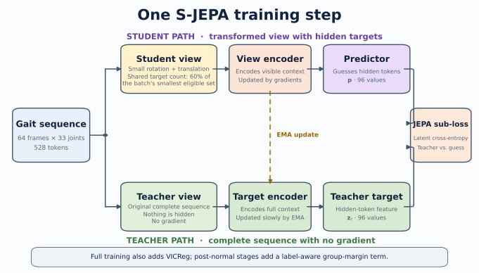
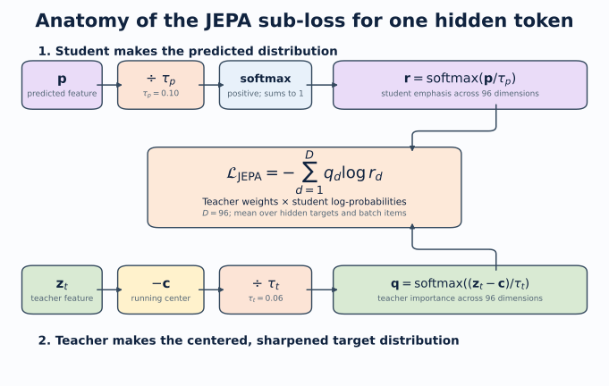

# Detailed tutorial: normal-first S-JEPA for gait

> **Historical record.** This tutorial describes the pre-repair five-stage
> GAVD run. Its referenced `cache/artifacts/real` contract is absent from this
> checkout; use the [current study index](../../studies/) for executable
> guidance.

This tutorial explains the complete experiment in simple terms. It follows the saved real outputs from notebooks 01 through 06. It also explains the limits that matter when reading the results.

The main finding is balanced. The completed representation did not totally collapse, and a shallow classifier can recover substantial label structure inside the known corpus. However, the canonical five-condition geometry is weak, normal features drift during later stages, and no current score measures performance on unseen videos or patients.

## 0. What changed, and what did not

Several recent changes affect different layers of the project. Some changed the trained model. Others changed only the evaluation, reproducibility contract, or explanation. Keeping those layers separate prevents an evaluation repair from looking like a model improvement.

### Change timeline

|Version|Model or evaluation state|Accuracy|Balanced accuracy|Macro-F1|What the number means|
|---|---|---:|---:|---:|---|
|Legacy S-JEPA|Normal-only, 10 eligible targets, exact exp5 split|0.619|not saved|0.613|Obsolete model on a video-confounded split|
|Current staged S-JEPA, Lane A2|Five-stage model with 12 eligible landmark identities, same exact exp5 split|0.714|0.730|0.742|Current model on the same confounded comparison lane|
|Current staged S-JEPA, Lane A1|All 96 canonical rows, stratified 67/29 sequence split|0.793|0.889|0.821|Current model inside an already-seen, video-confounded corpus|
|Lane C version 1|Five ordinary video-grouped Random Forest folds|0.604 mean|0.595 mean|0.407 mean|Superseded evaluation; one training fold lacked cerebral palsy and fold label sets differed|
|Lane C version 2|Two stratified video-grouped Random Forest folds|0.653 mean|0.603 mean|0.625 mean|Corrected classifier-level grouped stress test with all five labels in every fold|
|Lane C version 2 pooled OOF|All predictions from the two corrected folds pooled once|0.654|0.600|0.619|Corrected pooled stress-test summary; encoder exposure is still 159 of 159|

{width=96%}

The legacy 0.619 is **accuracy**. The corrected Lane C pooled 0.619 is **macro-F1**. They round to the same number but are not the same result.

### Impact on the trained model

The move from the legacy normal-only experiment to the current five-stage curriculum changed the model itself. The current run permits target tokens only from 12 landmark identities and uses 159 training sequences, VICReg, balanced replay, and a label-aware group term after Stage 0. Its final experiment fingerprint is `d0acc2628d134959d8b91e96d5112fc3bed560fe8feb9569e5b13b11a8b614d1`.

The latest Lane C correction did **not** retrain S-JEPA. It used the same final checkpoint and the same saved 384-dimensional embeddings. The higher corrected macro-F1 does not show that the model improved. It shows that the evaluation now keeps all five labels in every fold and calculates macro-F1 over one fixed label list.

The new augmented-normal selection rule also did not change the saved model. The completed run already used the same 63 pose files. The rule now explains and reproduces that choice: one of 64 candidates is rejected because its neurologic-landmark coverage is 0.027, below the 0.45 threshold.

The mask-ratio wording correction did not change the code or weights. It records the batch-minimum rule that training already used. The realized mean eligible fractions were 0.551 at Stage 0 and 0.423 at Stage 4, not a guaranteed 0.60 for every sample.

## 1. Start with the research question

Walking changes over time. A useful motion representation should summarize that change without merely memorizing the background, camera, crop, person, or pose-detector failures.

The experiment asks:

> Can a small Skeleton Joint-Embedding Predictive Architecture first learn from normal walking, then continue through four condition stages while retaining a useful, non-collapsed representation?

It does not ask whether the system can diagnose a health condition. The folder labels are dataset annotations. The added normal clips are not independently clinically verified.

## 2. What is a representation?

A representation is a list of numbers that summarizes an input. A raw video has millions of pixel values. A pose sequence is smaller, but 64 frames times 33 joints times 3 coordinates is still a large object. The encoder turns that object into features that a later task can use.

Good features should change when meaningful motion changes. They should be less sensitive to irrelevant changes. In a small video dataset, this goal is hard because nuisance signals can be easier to learn than gait.

{width=96%}

## 3. What JEPA changes

Many reconstruction models predict pixels or coordinates. A Joint-Embedding Predictive Architecture, or JEPA, predicts a hidden feature in latent space instead. The target is contextual. It can describe how a hidden joint-time token fits the complete motion rather than reproducing every raw measurement.

This experiment follows the S-JEPA idea from Abdelfattah and Alahi [1]. It has three main parts:

1. The **view encoder** sees only the visible tokens.
2. The **predictor** receives visible features plus learned mask tokens and estimates hidden features.
3. The **target encoder** sees the complete sequence and supplies the target features.

The target encoder receives no gradient. After each optimizer update, it moves a small step toward the view encoder through an exponential moving average, or EMA. This slowly changing teacher is a standard JEPA design idea [1, 2].

{width=96%}

## 4. Turn a pose sequence into tokens

MediaPipe Pose Landmarker estimates 33 landmarks per frame [3, 4]. Each saved pose row contains `x`, `y`, relative `z`, and visibility. Relative monocular depth is not calibrated 3D ground truth.

Notebook 04 prepares each sequence in six steps:

1. A joint is valid when visibility is at least 0.45.
2. Internal coordinate gaps of at most four frames are interpolated.
3. The original validity mask is retained, even when coordinates are interpolated.
4. Coordinates are centered at the pelvis and divided by a shoulder-and-hip width scale.
5. The sequence is resized to 64 frames.
6. Four adjacent frames from one joint form one token.

There are 16 time patches and 33 joints, so one sequence has 528 possible joint-time tokens.

## 5. Restrict which tokens may be hidden

The original S-JEPA paper uses motion-aware masking [1]. This project intentionally does not. It uses one fixed whitelist:

```python
MASK_KEYPOINTS = [11, 12, 23, 24, 25, 26, 27, 28, 29, 30, 31, 32]
```

These indices are the left and right shoulders, hips, knees, ankles, heels, and foot indices. They were expanded and de-duplicated from the project mapping file. This whitelist is a design rule, not a validated medical biomarker.

All 33 joints may remain visible context. Only the 12 listed joints may become hidden JEPA targets.

{width=78%}

### The exact 0.60 mask rule

It would be inaccurate to say that every sample hides exactly 60% of its valid eligible tokens. The code needs the same number of targets for every sample in a batch, so it uses this rule:

1. Count valid eligible tokens in every sample.
2. Find the smallest count in the batch.
3. Multiply that minimum by 0.60 and round down.
4. Leave at least one eligible token visible.
5. Draw that common count uniformly without replacement for every sample.

A sample with more valid tokens therefore hides less than 60% of its own eligible set. The realized mean eligible fraction was 0.551 at the end of Stage 0 and 0.423 at the end of Stage 4. The sampler never uses position, displacement, velocity, acceleration, or any learned motion score.

## 6. Understand the two data layers

The canonical experiment is a fixed 96-sequence subset of GAVD [5]. Notebook 01 traces each sequence to its source video.

|Canonical condition|Sequences|Source videos|
|---|---:|---:|
|Normal|12|1|
|Parkinson's|9|2|
|Stroke|12|3|
|Myopathic|47|10|
|Cerebral palsy|16|2|
|Total|96|18|

Normal gait has only one canonical source video. To reduce this extreme source concentration during training, the project added self-annotated normal windows from 17 other YouTube videos. Automatic MediaPipe bounding boxes were used for these windows.

|Training layer|Sequences|Videos|
|---|---:|---:|
|Canonical GAVD|96|18|
|Added normal candidates|64|17|
|Accepted added normal|63|17|
|Complete training corpus|159|35|

One candidate had neurologic-landmark coverage of 0.027 and failed the minimum threshold of 0.45. The 63 accepted rows have their own provenance and extraction path. They must not be described as canonical GAVD rows.

<div class="pdf-page-break"></div>

{width=96%}

### Why provenance can become a shortcut

Sixty-three of 75 normal training rows use the added extraction path. All 84 abnormal rows use the canonical path. A classifier can therefore associate bounding-box style, camera style, or detector behavior with the normal-versus-abnormal label. The missingness control and provenance audit help expose this risk, but they cannot remove it.

## 7. Train normal first

Stage 0 starts with fresh weights. It uses 75 normal sequences from 18 videos: 12 canonical rows plus 63 accepted added rows. The group loss is zero because there is only one active label.

After 300 epochs and 5,700 optimizer updates, the notebook saves `sjepa_normal_augmented.pt`. This state becomes the normal anchor.

The later stages continue the same model:

|Stage|New condition|Active sequences|Epochs|Updates|
|---:|---|---:|---:|---:|
|0|Normal|75|300|5,700|
|1|Parkinson's|84|75|1,425|
|2|Stroke|96|75|1,425|
|3|Myopathic|143|75|1,425|
|4|Cerebral palsy|159|75|1,425|

Each later batch draws equally from the active conditions. This is balanced replay. It keeps earlier groups in the optimizer stream, but it does not guarantee that their representation will remain unchanged.

The final artifact is `sjepa_curriculum_final_augmented.pt`. Its experiment fingerprint is:

```text
d0acc2628d134959d8b91e96d5112fc3bed560fe8feb9569e5b13b11a8b614d1
```

## 8. Give each loss one job

The total objective is

$$
L = L_{JEPA} + 0.05L_{VICReg} + 0.25L_{group}.
$$

### 8.1 JEPA latent prediction

At an allowed hidden position, the centered and sharpened teacher distribution is (q), and the predictor distribution is (r). The latent cross-entropy is:

$$
L_{JEPA} = -\sum_d q_d \log r_d.
$$

Only valid, authorized hidden positions contribute.

{width=96%}

### 8.2 VICReg anti-collapse terms

Two geometric views of the same sequence pass through the view encoder. Valid authorized features are pooled and projected. VICReg then applies three ideas [6]:

- **Invariance:** paired views of the same sequence should agree.
- **Variance:** each feature dimension should keep enough spread.
- **Covariance:** different feature dimensions should avoid repeating the same signal.

The implemented inner expression is:

$$
L_{VICReg}=25L_{inv}+25L_{var}+L_{cov}.
$$

VICReg can resist a constant representation. It does not know that two folder labels should form different groups.

### 8.3 Label-aware group pressure

After Stage 0, the model also receives condition labels. The group term pulls normalized examples toward their label centroid and penalizes centroid pairs that are closer than margin 1.0.

This is supervised information. It is correct to call the first stage label-free representation learning. It is not correct to call the complete five-stage curriculum label-free.

## 9. Read training health without overclaiming

The endpoint table is:

|Stage|JEPA|VICReg|Feature std|Pair cosine|Minimum training centroid distance|Normal anchor|
|---:|---:|---:|---:|---:|---:|---:|
|0|0.569|16.997|0.466|0.359|not applicable|reference|
|1|0.449|12.989|0.430|0.492|0.740|0.954|
|2|0.613|10.474|0.399|0.624|0.527|0.839|
|3|0.611|9.368|0.406|0.628|0.336|0.707|
|4|0.478|8.418|0.414|0.609|0.364|0.594|

{width=96%}

These values support three conclusions:

1. Training stayed finite and all stages completed.
2. Feature spread remained nonzero, which is evidence against total collapse.
3. Normal-anchor cosine fell to 0.594, which shows substantial drift.

The final centroid-margin penalty was not zero, so the requested margin was not fully satisfied. A finite loss and a non-collapsed vector are necessary checks. They are not proof of clinical structure.

## 10. Inspect the frozen representation before classifying

Notebook 05 performs a four-sequence hidden-token spot check. It found mean target-prediction cosine 0.572 with standard deviation 0.116 across 108 masked tokens per sequence. This is a small diagnostic sample, not a whole-corpus performance estimate.

For every canonical sequence, notebook 05 creates a 384-dimensional pooled vector:

- 96 global means;
- 96 global standard deviations;
- 96 authorized-landmark means;
- 96 authorized-landmark standard deviations.

It then compares within-condition distances, centroid distances, and the silhouette coefficient. The silhouette compares how close a sample is to its own group with how close it is to the nearest other group [7]. A value near one suggests clear separation. A value near zero suggests overlapping boundaries. A negative value suggests that many samples are closer to another group.

The canonical-96 results are:

|Geometry measure|Value|
|---|---:|
|Cosine silhouette|0.008975|
|Minimum centroid distance|0.036718|
|Mean centroid distance|0.292119|
|Mean within-condition distance|0.119521|

The closest centroids are myopathic and cerebral palsy. Their distance, 0.0367, is much smaller than the mean within-condition distance, 0.1195. This is weak group geometry.

{width=84%}

The Stage 4 training centroid distance and the notebook 05 centroid distance are not the same statistic. The first is a Euclidean training diagnostic over the 159 active sequences. The second is a cosine audit over 384-dimensional pooled vectors from the canonical 96. They should not be compared numerically.

## 11. Learn what a Random Forest readout does

A readout asks whether information is accessible in frozen features. Notebook 06 standardizes the embedding and fits a Random Forest with 100 trees, maximum depth 5, square-root feature sampling, balanced class weights, and seed 42 [8, 9].

The classifier does not update the encoder. That makes it a frozen-feature probe. However, the encoder already learned from the evaluated rows and, after Stage 0, their condition labels. Freezing now does not undo that exposure.

### Three metrics

- **Accuracy** is the fraction of all test rows predicted correctly.
- **Balanced accuracy** calculates recall for each class and gives every class equal weight [10].
- **Macro-F1** calculates one F1 score per class and averages them equally. It reflects both missed examples and false alarms.

Always inspect the confusion matrix and class support beside these summaries.

## 12. “All-96 stratified” step by step

The artifact name is `all_96_stratified_video_confounded`. Each word carries information.

### Step 1: all 96 canonical rows enter the split

A row is one annotated sequence, not one frame, one whole source video, or necessarily one independent person.

### Step 2: stratification preserves class proportions

The code requests a reproducible 70/30 sequence split with `random_state=42`. Stratification asks the split to keep every condition in both subsets and to preserve the class fractions as closely as integer counts allow.

|Condition|All|Classifier train|Classifier test|
|---|---:|---:|---:|
|Normal|12|8|4|
|Parkinson's|9|6|3|
|Stroke|12|9|3|
|Myopathic|47|33|14|
|Cerebral palsy|16|11|5|
|Total|96|67|29|

Why do this? A plain random draw could place too few of the nine Parkinson's rows in the test set. Then the score could change mainly because the class mix changed. Stratification reduces that particular problem.

### Step 3: fit only the classifier on 67 rows

The scaler estimates its mean and standard deviation from the 67 classifier-training embeddings. The Random Forest also fits on those 67 rows. It predicts the other 29 rows.

### Step 4: compare with a missingness-only control

The control sees 33 per-joint and 64 per-frame visibility fractions, for 97 features. It receives no gait coordinates. If this control performs well, pose-detector success and failure carry label information.

### Step 5: audit two kinds of exposure

The split is sequence-level, not video-level. All 16 source videos in the classifier test set also occur in classifier training. In addition, all 29 classifier test rows were used during representation training.

{width=98%}

### Step 6: read the score at the correct scope

|All-96 readout|Accuracy|Balanced accuracy|Macro-F1|
|---|---:|---:|---:|
|S-JEPA frozen vector|0.793|0.889|0.821|
|Missingness only|0.448|0.466|0.429|

The S-JEPA result is above the visibility-only control. This means the frozen vector contains label-related structure beyond the saved visibility fractions on this split. It does not tell us whether that structure is gait, person identity, source-video style, extraction style, or a mixture.

The result can answer:

> Can a shallow classifier recover dataset labels from the final features inside this already-seen corpus?

It cannot answer:

> How accurate is the system on a new video or patient?

Stratification fixes class-balance sampling. It does not fix dependence.

## 13. The exact exp5 comparison

Lane A2 reproduces a historical 68-sequence subset and its fixed 47/21 split.

|System|Accuracy|Balanced accuracy|Macro-F1|
|---|---:|---:|---:|
|Staged S-JEPA|0.714|0.730|0.742|
|Historical 82-feature Random Forest|0.762|not saved|0.728|
|Missingness only|0.333|0.364|0.336|

The S-JEPA result has lower accuracy and slightly higher macro-F1 than the historical feature system. This is a system comparison, not a controlled representation ablation. The pose extraction and features differ. All 9 test videos overlap classifier training, and all 21 test rows trained the encoder.

## 14. Lane C: useful stress test, not generalization

Lane C combines the canonical and added normal embeddings. The binary task uses five GroupKFold splits. The corrected five-class task uses two StratifiedGroupKFold splits. In both cases, one source video cannot appear in both classifier training and testing within a fold [11].

The encoder was still trained once on all 159 sequences. Every held-out classifier row had already influenced the representation. The correct description is **classifier-video-disjoint, encoder-transductive**.

|Lane C task|Mean accuracy|Mean balanced accuracy|Mean macro-F1|Mean ROC AUC|
|---|---:|---:|---:|---:|
|Normal versus abnormal|0.849|0.874|0.826|0.966|
|Five classes, two-fold mean|0.653|0.603|0.625|not applicable|

For the five-fold binary task only, notebook 06 shows percentile bootstrap ranges over the five fold scores. Five related fold scores do not justify a strong population confidence claim [12]. The corrected five-class task has only two folds and intentionally reports no interval.

The binary task may also benefit from provenance differences between the added normal rows and canonical abnormal rows.

An audit found that the earlier five-fold version was invalid as a stable five-class summary. One training fold had no cerebral palsy example, and macro-F1 used different label sets across folds. Notebook 06 now uses two stratified video-group folds, the largest possible count when Parkinson's and cerebral palsy each have two videos. Every train and test fold contains all five labels, and macro-F1 uses a fixed label order. The pooled out-of-fold accuracy is 0.654, balanced accuracy is 0.600, and macro-F1 is 0.619. This repairs the metric definition, but two folds and full encoder exposure still make it a stress test rather than a generalization estimate.

{width=96%}

{width=96%}

## 15. What the next valid evaluation must do

A valid unseen-video estimate needs nested, fold-local training:

1. Group complete source videos into outer training and test sets.
2. Choose and freeze preprocessing rules using only outer-training videos.
3. Train a fresh Stage 0 encoder using only outer-training normal videos.
4. Continue all four later stages using only outer-training videos.
5. Freeze that fold-local encoder.
6. Fit the Random Forest using outer-training vectors.
7. Open the sealed outer-test videos once and report the score.

The smallest classes also need more independent source videos. With only two Parkinson's videos and two cerebral palsy videos, a stable five-class estimate is not currently possible.

{width=98%}

## 16. Reproduce and audit the run

The main artifacts are under `cache/artifacts/real`:

- `sjepa_curriculum_final_augmented.pt`
- `curriculum_training_history_augmented.csv`
- `curriculum_stage_summary_augmented.csv`
- `curriculum_representation_geometry.csv`
- `curriculum_centroid_distances.csv`
- `sequence_embeddings.parquet`
- `augmented_normal_embeddings.parquet`
- `classifier_contract.json`
- `classifier_metrics.csv`
- `missingness_only_classifier_metrics.csv`
- `leakage_audit.csv`
- `lane_c_video_disjoint_metrics.csv`

The classifier contract binds downstream outputs to the final fingerprint. Notebook 05 and notebook 06 reject a wrong stage order, an incomplete curriculum, the wrong whitelist, or a cohort mismatch.

## 17. Plain-language glossary

|Term|Meaning in this project|
|---|---|
|Canonical cohort|The fixed 96-sequence GAVD experiment set|
|Added normal cohort|Self-annotated normal windows from 17 additional videos|
|Token|One joint over one four-frame time patch|
|View encoder|Trainable Transformer that sees the partly hidden sequence|
|Target encoder|Complete-input EMA teacher with no gradient|
|Predictor|Transformer that estimates hidden target features|
|Collapse|A failure where many inputs receive nearly the same feature|
|VICReg|Invariance, variance, and covariance regularization used against collapse|
|Balanced replay|Equal per-condition sampling within each active stage|
|Normal anchor|Stage 0 normal features used to measure later drift|
|Stratification|A split that preserves class proportions|
|Video confounding|The same source video contributes rows to both classifier sides|
|Representation exposure|A test row influenced encoder training before classifier evaluation|
|Missingness-only control|A classifier that sees detector visibility but no coordinates|
|Grouped stress test|Classifier folds separate videos, but another part of the pipeline may still have exposure|
|Nested evaluation|The complete representation and classifier pipeline is retrained inside every outer fold|

## References

1. Abdelfattah and Alahi, “S-JEPA: A Joint Embedding Predictive Architecture for Skeletal Action Recognition,” ECCV 2024. [DOI 10.1007/978-3-031-73411-3_21](https://doi.org/10.1007/978-3-031-73411-3_21)
2. Assran et al., “Self-Supervised Learning from Images with a Joint-Embedding Predictive Architecture,” CVPR 2023. [DOI 10.1109/CVPR52729.2023.01499](https://doi.org/10.1109/CVPR52729.2023.01499)
3. Grishchenko et al., “BlazePose GHUM Holistic: Real-time 3D Human Landmarks and Pose Estimation,” 2022. [arXiv:2206.11678](https://arxiv.org/abs/2206.11678)
4. Google AI Edge, “Pose Landmarker.” [Official documentation](https://ai.google.dev/edge/mediapipe/solutions/vision/pose_landmarker)
5. Ranjan et al., “Computer Vision for Clinical Gait Analysis: A Gait Abnormality Video Dataset,” *IEEE Access*, 2025. [DOI 10.1109/ACCESS.2025.3545787](https://doi.org/10.1109/ACCESS.2025.3545787)
6. Bardes, Ponce, and LeCun, “VICReg: Variance-Invariance-Covariance Regularization for Self-Supervised Learning,” ICLR 2022. [OpenReview](https://openreview.net/forum?id=xm6YD62D1Ub)
7. Rousseeuw, “Silhouettes: A Graphical Aid to the Interpretation and Validation of Cluster Analysis,” 1987. [DOI 10.1016/0377-0427(87)90125-7](https://doi.org/10.1016/0377-0427(87)90125-7)
8. Breiman, “Random Forests,” *Machine Learning*, 2001. [DOI 10.1023/A:1010933404324](https://doi.org/10.1023/A:1010933404324)
9. Pedregosa et al., “Scikit-learn: Machine Learning in Python,” *JMLR*, 2011. [Official paper](https://jmlr.org/papers/v12/pedregosa11a.html)
10. Brodersen et al., “The Balanced Accuracy and Its Posterior Distribution,” ICPR 2010. [DOI 10.1109/ICPR.2010.764](https://doi.org/10.1109/ICPR.2010.764)
11. Roberts et al., “Cross-validation Strategies for Data with Temporal, Spatial, Hierarchical, or Phylogenetic Structure,” *Ecography*, 2017. [DOI 10.1111/ecog.02881](https://doi.org/10.1111/ecog.02881)
12. Bengio and Grandvalet, “No Unbiased Estimator of the Variance of K-Fold Cross-Validation,” *JMLR*, 2004. [Official paper](https://www.jmlr.org/papers/v5/grandvalet04a.html)
