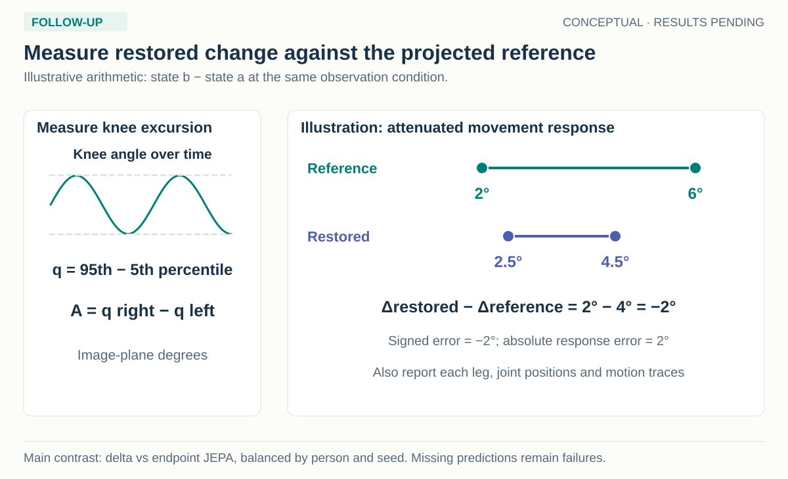
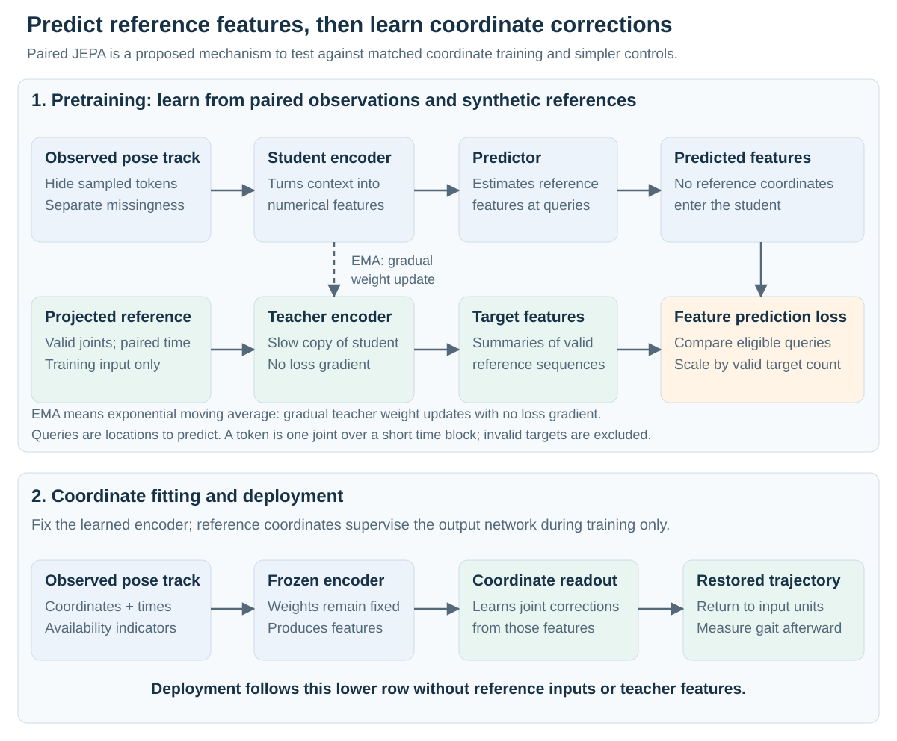
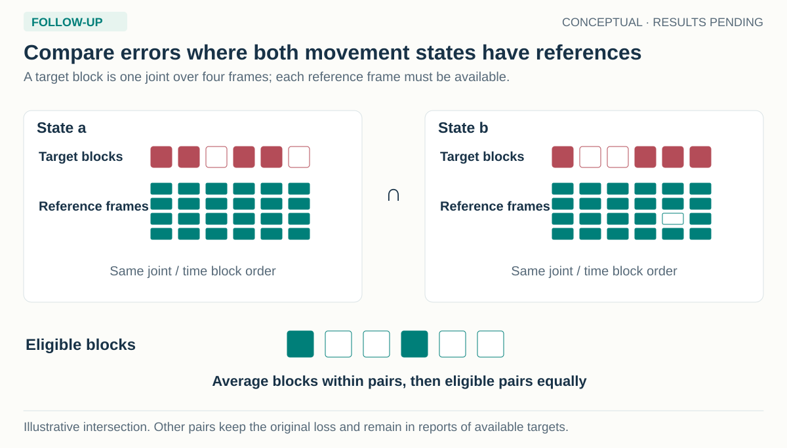

# Gait Fidelity

## Preserving bilateral movement through pose restoration

**Research proposal and implementation · 22 September 2026 · HAIC results pending**

[Read the interactive paper](proposal.html) · [Inspect the data](data/README.md) · [Browse local videos](data/video-gallery.html) · [Open the figure gallery](images/gallery.html)

**Run the study:** the [HAIC guide](../../../slurm/gait-fidelity/README.md) and [notebook tutorials](../../../notebooks/gait_fidelity/README.md) use one saved configuration and the same experiment runner. The [implementation guide](methods/running.md) explains the five experiment groups, reference checks and retained outputs. The implemented source study remains a development comparison on the existing 24 training and eight inspected development people; a fresh confirmation population and independent clinical references are still separate admission requirements.

The [implementation validation record](records/implementation-validation-20260922.json) and [independent reviews](reviews/README.md) document local software checks and tutorial execution. CUDA rendering, pose extraction and measured throughput for the expanded dataset still require the HAIC run.

**Execution plan:** eight H100 GPUs, with experiment setup assumed to take at most one hour. The [parallel execution plan](methods/execution.md) schedules both masking and change supervision with their controls: 34 recipe cells, three seeds and 102 final model fits. Its dated midnight-to-Thursday-noon example provides 480 H100-hours, split into 360 planned hours and 120 reserved for recovery. This is planned capacity, not measured runtime or completed experiments.

This page presents the scientific argument and planned experiments. The linked protocols retain implementation detail; completed source audits and earlier drafts are organized separately so that they do not interrupt the proposal.

| Reading goal | Start here |
| --- | --- |
| Understand the question and method | Read Sections 1–5 below, or use the illustrated [interactive paper](proposal.html). |
| Know exactly which data will be used | Read [Data and references](data/README.md), then inspect the [local footage](data/video-gallery.html). |
| Prepare or review an experiment | Use the [method protocols](methods/README.md), [source evidence](evidence/README.md), and [reproduction instructions](scripts/README.md). |
| Execute and inspect the experiments | Start with the [HAIC commands](../../../slurm/gait-fidelity/README.md), then follow the [notebooks](../../../notebooks/gait_fidelity/README.md). |
| Schedule the study before the ICLR deadline | Use the [eight-H100 execution plan](methods/execution.md) for the exact matrix, resource forecast, dependencies and paper milestones. |

**Contents:** [Abstract](#abstract) · [1. Motivation](#1-motivation) · [2. Research question](#2-research-question-and-proposed-contribution) · [3. Data](#3-data-and-reference-measurements) · [4. Experimental design](#4-experimental-design) · [5. Method](#5-method) · [6. Evaluation](#6-evaluation-and-statistical-analysis) · [7. Reproducibility](#7-reproducibility-and-execution) · [8. References](#8-related-work-and-references) · [File guide](#file-guide)

## Abstract

Video-based gait measurements depend on pose estimators that locate a person's joints in each frame. Restoration models can correct these estimates, but they may also alter differences between the legs or changes in movement that the measurement is intended to capture. Gait Fidelity studies whether restoration can reduce observation errors while preserving the size and direction of bilateral movement changes. We propose a controlled experiment that crosses reference-verified changes in motion with changes in image quality or estimated joint assignment. The initial outcome is a signed difference in projected knee excursion, supported by the existing hip, knee and ankle representation. Synthetic motion and rendered images supply matched inputs and references; independently annotated real videos provide a separate observation-recovery test. We compare direct coordinate training with a joint-embedding predictive architecture that learns to predict reference motion features, and evaluate stochastic anatomical masking as a distinct training intervention. A proposed paired-change constraint penalizes distortion of the reference movement change. Evaluation combines response error with observation-error and position-accuracy requirements, retaining missing predictions and unsupported references in coverage reports. Clinical measurements form a later, conditional stage requiring independent events, anatomical side labels and adequate synchronization. The study is designed to determine which training choices preserve useful movement information and where the available observations cannot support recovery.

## 1. Motivation

### 1.1 Why position accuracy is not enough

A pose estimator converts a video into a trajectory: the position of each joint as it changes over time. Those trajectories can then be used to measure movement, such as the amount a knee bends or the interval between steps. Errors arise when a limb is obscured, a person becomes small in the image, or the estimator exchanges the names of the left and right joints. A restoration model uses the surrounding observations to correct the estimated trajectory.

The difficulty is that genuine movement can resemble an estimation error. Reduced excursion of one knee, a brief hesitation or a difference between the legs may be meaningful features of the recording. A model trained to produce common, smooth walking patterns could weaken those features while improving its average joint-position score. Conversely, a model that preserves every irregularity may also preserve tracking noise. A useful evaluation must measure both tendencies on the same reference population.


*Figure 1. The desired response depends on what changed. Genuine movement should remain measurable; observation error should decrease; unresolved anatomical assignment should remain explicit.*

### 1.2 Why laterality matters

**Laterality** means identifying the anatomical left and right sides. It determines the sign of a bilateral measurement: “right minus left” reverses if joint names are exchanged. Anatomical side, movement asymmetry and the clinically affected side are separate quantities. A larger excursion on the right does not, by itself, identify which side is impaired.

Reliable bilateral measurements could help clinicians describe a person's movement and follow changes over time. That motivation requires accurate measurement rather than a preference for symmetry. Symmetric step lengths can coexist with asymmetric mechanics, and neurological gait patterns vary across people. Independent clinical studies already measure gait from video and assess within-person changes; the proposed contribution concerns whether restoration preserves those changes under difficult observations. [Clinical video validation](https://journals.plos.org/digitalhealth/article?id=10.1371/journal.pdig.0000467), [asymmetry and walking mechanics](https://pmc.ncbi.nlm.nih.gov/articles/PMC5243179/).

The predecessor [synthetic-training study](../synthetic-training-v2/writeups/README.md) motivates a closer examination of movement fidelity and strong controls for feature pretraining. The earlier [laterality evidence audit](../synthetic-training-v2/manuscript/abstract-laterality-audit-20260919-v01.md) explains why those experiments must remain distinct. This proposal makes neither a clinical efficacy claim nor an assumption that JEPA will be the best method.

## 2. Research question and proposed contribution

**Can pose restoration reduce errors caused by observation and tracking while preserving the size and direction of reference-verified changes in bilateral movement?**

The main hypothesis is that explicitly supervising movement change can reduce distortion of that change while retaining useful resistance to observation errors. The reference supplies the actual change, including any legitimate effects on other joints. The model is not asked to make every movement symmetric or to make every image-plane quantity invariant to the camera.

The intended contribution has three connected parts:

1. A controlled evaluation that separates a real movement change from a change in how the same movement is observed.
2. A matched test of direct coordinate learning, paired feature prediction and anatomical masking, showing which component contributes any improvement.
3. A reference-based account of the conditions under which restoration preserves a useful measurement, together with a clearly bounded real-video validation.

Each part is prospective. Graph masking, synthetic gait and feature prediction have substantial prior art. The scientific value must come from a consequential, reproducible preservation finding and an interpretable remedy or failure boundary, assessed against credible alternatives. The [novelty audit](literature/novelty.md) retains the detailed comparisons and secondary ideas.

This question determines the next dependency: the study needs data that distinguish motion from observation and a measurement that the available references can actually support.

## 3. Data and reference measurements

### 3.1 Which data will be used

**Already in your HAIC setup:** AMASS motion files, GAVD videos, COCO images/annotations and the previous synthetic-training assets. The 91 MS/PD/Normal clips are verified on your Mac; their HAIC copy has not been established. Stroke motion capture, LIVE-GaitNeuroKids and the full MoVi video/reference release are **optional additions that have not yet been acquired for this study**. Their acquisition does not block synthetic development with the existing HAIC assets.

The [availability inventory](data/availability.md) records the exact paths and the evidence for these statuses. It distinguishes your reported HAIC setup and completed runs from a fresh remote file audit, which was not performed here. The roles below depend on reference quality as well as file availability.

| Data source | What will enter the experiment | Role and readiness |
| --- | --- | --- |
| **AMASS-derived synthetic pairs — existing on HAIC** | Reviewed motion, rendered RGB, fixed pose-estimator outputs and projected body-model joints | Primary controlled development and training. Reuse the existing AMASS/rendering assets and verify the selected files; new intervention pairs are pending. |
| **Local MS/PD/Normal videos — available on Mac** | 91 clips from 41 filename-derived sources; new physical-time pose extraction and independent visible-joint/side annotations | Real-image development and controlled observation-recovery testing. HAIC copy is unconfirmed; the new cache and annotations are pending. |
| **GAVD — existing on HAIC** | Selected videos with checked source reservations and independent annotations for the chosen endpoint | Optional real-image evaluation pool. Prior exposure and overlap with the local collection must be resolved. Existing labels do not supply the required motion references. |
| **Stroke motion-capture release — optional; not acquired** | Raw time-indexed trajectories, with compatible side and event metadata where available | Additional source of recorded asymmetric movement. Retargeting must preserve the source measurements; public synchronized RGB is unverified. |
| **LIVE-GaitNeuroKids — optional; not acquired** | Same-trial video, wearable references and participant/visit records | Clinical evaluation candidate. Access, video alignment, reference accuracy and usable sample size remain admission gates. |
| **MoVi video/reference release — optional; not acquired** | Compatible calibrated video/motion-capture trials | Healthy-reference evaluation fallback if identity separation can be established. AMASS motion from BMLmovi does not supply this full video release. |

COCO is available for an optional image-adaptation comparison; its still-image annotations do not provide temporal gait references. The focused pose-trajectory experiment can proceed without that branch.


*Figure 2. The synthetic branch reuses HAIC assets, the audited local-video branch starts on your Mac, and new clinical data remain optional acquisitions. Inputs, references and supported claims remain linked; a diagnostic label does not supply a joint trajectory or an independently measured movement change.*

The [data specification](data/README.md) explains acquisition, representation, inclusion checks and the exact role of each source. The current synthetic study uses normal treadmill walking from 24 training people and eight already inspected development people. These identities are useful for implementation and development; a new confirmation roster is still to be allocated. The existing four 64-frame windows per person are a starting point for mask checks, without assuming that their duration or frontal view is adequate for the new measurement.

The local real-video collection also remains development material. Twenty-eight of its 41 source IDs occur in GAVD manifests, covering 61 clips; source IDs are not verified independent people. Existing pose caches omit original timestamps and imputation flags and therefore need replacement for physical-time measurement. The [local-video audit](data/local-videos.md) records these issues and the source overlap. All clips can be inspected in the [local gallery](data/video-gallery.html).

### 3.2 The first measurement

The initial engineering endpoint is the **signed projected knee-excursion difference**. For each leg, compute the image-plane angle formed by hip, knee and ankle across one fixed reviewed interval. Define its excursion as the 95th percentile minus the 5th percentile of that angle, then subtract the left excursion from the right:

```text
theta(t) = angle(hip(t) − knee(t), ankle(t) − knee(t))
q = P95(theta) − P5(theta)
A = q_right − q_left
```

`A` is measured in image-plane degrees. Its sign identifies which leg has greater projected angular excursion. It does not identify an affected limb, anatomical three-dimensional range of motion, or clinical impairment. The percentile definition limits the influence of isolated extremes, while deliberately discounting brief genuine extremes; full waveforms and a prespecified full-range sensitivity analysis remain necessary.

For the first synthetic comparison, use a common physical-time grid and the same reference-defined eligible frames across the paired movement/observation cells, both limbs and every method. Require sufficient support for the complete contrast so that differing phase coverage cannot masquerade as movement change. Specify the percentile interpolation rule, interval duration, minimum projected segment length and completeness thresholds before comparing models. Compute angles in the original image geometry or after a shared isotropic transform: resizing horizontal and vertical coordinates by different factors changes an angle. Missing or degenerate predictions count as failures rather than changing the eligible reference population. The [evaluation protocol](methods/evaluation.md) gives the complete contract.

### 3.3 What real videos add

On the local videos, the first reference task is independent annotation of originally visible joint positions and resolvable anatomical side. Add blur or obstruction to those same frames, re-run pose extraction and evaluate restoration against the retained original annotations. This creates a known observation change on real imagery. It does not reveal joints that were already hidden in the original video.

Clinical step-time asymmetry is a subsequent endpoint, conditional on independently side-labelled initial contacts, appropriate temporal resolution and valid event coverage. Contact labels must be used for evaluation rather than supplied to a deployed timing estimator. The [clinical-candidate audit](data/clinical-candidates.md) distinguishes these requirements from the references presently available.

## 4. Experimental design

### 4.1 Cross movement with observation

For each source family, construct two movement states and two observation conditions. A movement pair changes the reference trajectory; an observation pair changes image degradation or estimated joint naming while retaining the relevant physical motion. Keep camera, appearance and random nuisance realization matched within the appropriate comparison.


*Figure 3. Compare motion A with motion B under each observation condition, then compare observation conditions within each motion. Every output has its own valid projected reference.*

A physical reflection is useful for testing sign and transformation rules. A graded response experiment additionally needs recorded or reference-verified movement changes beyond reflection, including a zero-change control and changes in both directions. Constrained edits without dynamic validation are kinematic stress tests; they are not simulated patient counterfactuals. The reference must retain legitimate coupled changes in other joints.

The compact sign-control panel crosses two mirror states, three estimated-naming states, two occlusion states and two cameras. It produces 24 track conditions from eight RGB renderings per source window when naming errors are applied after extraction. These repeated conditions remain one source family. The graded-response panel is additional work.

### 4.2 Measure the error in a change

Let `A_an` denote the reference measurement for movement state `a` and observation condition `n`, and let `Ahat_an` denote the restored measurement. The **response error** is the difference between the predicted movement change and the reference movement change:

```text
R(n) = (Ahat_1n − Ahat_0n) − (A_1n − A_0n)
```

The **observation-induced error change** asks how the measurement error changes when the observation changes:

```text
N(a) = (Ahat_a1 − Ahat_a0) − (A_a1 − A_a0)
```

For image blur at a fixed camera, the reference change in the second expression is zero. For a camera change, a projected reference may legitimately change, so retain that term. The interaction `I = R(1) − R(0)` measures whether the observation condition changes sensitivity to the real movement change.



*Figure 4. These are teaching values, not measured results. The [interactive paper](proposal.html#response-explorer) lets the reader vary movement change and observation distortion and inspect the paired contrasts.*

<!-- INTERACTIVE:response -->

Response error alone permits a constant measurement offset, and a single excursion value can agree despite an incorrect waveform. This is why the evaluation also requires position/level accuracy, observation-error control and trajectory measures.

## 5. Method

### 5.1 Restore coordinates from observed trajectories

All deployed restoration arms receive estimated joint coordinates, confidence, detection availability and timestamps under a declared anatomical convention. Independent reference coordinates are available only for permitted training and evaluation. The first shared representation is body12: paired shoulders, elbows, wrists, hips, knees and ankles. Heel or toe measurements require an explicitly validated schema extension.

A direct model learns corrected coordinates from the estimated tracks. Temporal context allows it to use neighboring observations. The inherited recipe uses a coordinate loss; the movement metrics separately test whether those corrections preserve displacement and bilateral measurements. The proposed change-supervision term is an explicit additional objective. Calibration and temporal filters provide simpler comparisons. Their preprocessing, tuning population and missing-output treatment must be documented alongside the neural models.

### 5.2 Predict reference features with paired JEPA

A joint-embedding predictive architecture, or **JEPA**, learns to predict numerical features rather than predicting every target coordinate during pretraining. Here an encoder turns an imperfect pose sequence into features that summarize joint motion, and a predictor estimates the features of corresponding reference poses at hidden positions. “Paired” means that estimated and reference poses describe the same source movement at aligned times.



*Figure 5. The inherited recipe uses a reference teacher whose weights are an exponential moving average of the encoder weights: a slowly changing copy, updated without back-propagating the target loss through it. A separate readout then learns coordinates while the encoder is fixed.*

The rationale is that predicting reference motion features may help an encoder use temporal and anatomical context when observations are incomplete. A learned prior may also weaken uncommon but genuine movements. The experiment therefore compares the final restored trajectories, with aligned, shuffled-reference and untrained-encoder controls. Low feature-prediction loss does not establish movement fidelity.

### 5.3 Vary which joints provide context

**Stochastic graph-time masking** selects a connected anatomical region, such as hip–knee–ankle, and hides it for a sampled time span. Another draw can expose that region and hide a different one. A token is one joint over a short block of frames; the graph specifies anatomical connections, without requiring a graph neural-network encoder.



*Figure 6. Joint connectivity and temporal persistence are separate factors. Artificial hiding is distinct from a detector's missing observation and from reference validity.*

The existing synthetic pipeline already varies its masks and often hides whole-body time blocks on complete input. The proposed study compares that policy with uniform joint-time masking and connected-region masking. Match achieved mask budgets and audit context/target coverage at every joint-time slot. The MS notebook's BlazePose-33 groups require a named-joint adapter for body12. The [masking protocol](methods/masking.md) retains coverage, preprocessing-information and gradient checks.

### 5.4 Preserve a supervised movement change

The proposed added constraint penalizes the mismatch between a predicted change in `A` and its reference change on a matched pair. Apply it to restored coordinates during the same frozen-encoder readout stage for both JEPA and coordinate-pretrained models; initialized and shuffled-feature controls receive the same selected readout objective. Direct end-to-end models with and without the constraint provide a separate practical comparison using the same labels. Keep the coordinate and trajectory objectives alongside it. The new constraint has not been implemented or validated in the predecessor training path.

Quantile differences can concentrate gradients on a few order statistics, and nearly degenerate projected limbs make angle derivatives unstable. Before training, test the exact implementation or an explicitly declared differentiable surrogate on tied angles, nearly straight knees, small segment lengths and missing data. Do not infer a trainable, stable loss merely because the evaluation quantity has a formula. A direct model given per-example `A` labels is an additional control for the information supplied by the paired constraint.

### 5.5 Attribute each improvement

Run the complete registered comparisons, sharing reviewed data and identical pretraining where permitted. Eight H100s allow independent jobs to proceed together once their prerequisites are ready; the scientific comparisons remain separate so that a change in data, mask policy or objective can be interpreted.

| Stage | Comparison | Question answered |
| --- | --- | --- |
| Establish practical headroom | Unchanged input, affine calibration, temporal filtering, static and learned temporal refiners, direct coordinate training | Is there a meaningful restoration problem beyond simple controls? |
| Compare masking policies | Coordinate pretraining and paired JEPA × time blocks, uniform tokens and graph-time regions × base or paired-change readout | How do mask policy, feature prediction and change supervision interact? |
| Isolate anatomical structure | Shuffled-topology and matched-duration random-joint controls under both objectives and both readout losses | Does connectivity contribute beyond mask amount and gap length? |
| Test change supervision | Coordinate-pretrained and JEPA frozen-readout arms, each with and without the term; separate direct end-to-end ±term comparison | Does the constraint help within each training stage, and does feature prediction contribute under matched trainable parameters? |
| Check pretraining information | Initialized and shuffled-reference controls with and without the term, using the graph policy fixed in advance | Does aligned feature learning explain the difference under that policy? |
| Check the extra supervision | Coordinate-pretrained, JEPA and direct models with per-example measurement or valid re-paired-change supervision | Does the pairing contribute beyond additional labels and endpoint exposure? |

Coordinate pretraining is the stage-matched comparator for JEPA; direct end-to-end training is a separate practical comparator. Share source windows, query locations, target eligibility, mask receipts, readout protocol and downstream labels where applicable. Contextual feature targets and raw-coordinate targets differ by design. Report both update counts and compute, with equal development tuning allowances.

Direct training with versus without the term tests its practical contribution. JEPA versus coordinate pretraining under the same frozen readout and constraint tests the representation choice more closely. JEPA versus end-to-end direct training assesses overall utility; an interaction between those differently trainable recipes cannot by itself isolate feature prediction.

The [execution matrix](methods/execution.md#3-run-the-complete-matched-matrix) contains 102 final fits across seeds 17, 29 and 43. Run its controls regardless of whether an early graph or JEPA result is favorable. Development selects any declared tuning choices and the primary comparator before confirmation; it does not authorize dropping unfavorable registered cells. If measured cost exceeds capacity, choose a lower common update budget before ranking outputs and retain the complete comparison matrix.

A broad refinement claim requires a credible contemporary refiner with compatible joints and a verified implementation; an adapted SmoothNet-style model must be labelled as an adaptation. The inherited direct trainer uses coordinate MSE. Any added motion term must be explicit and shared by matched controls, rather than inferred from a motion evaluation metric. The [methods index](methods/README.md) points to the full attribution and measurement protocols.

## 6. Evaluation and statistical analysis

### 6.1 Define success before confirmation

The primary contrast is person-level absolute response error against the strongest prespecified, equally supervised direct control. A preservation claim also requires acceptable observation-induced error and clean-input position accuracy on the same population. Select meaningful margins from reference precision, repeatability and intended use before opening confirmation outputs. A smaller p-value cannot substitute for a useful effect size.

Retain signed bias, the two limb measurements, full angle waveforms, coordinate/displacement error and at least one prespecified outcome excluded from the training constraint. Report comparisons by camera, corruption and reference support without selecting only favorable cells. Fixed reference eligibility determines the attempted population. Before ranking models, choose an all-attempted failure score or a joint coverage-and-error rule with explicit confidence criteria; a mean that silently drops missing predictions cannot determine success. Missing predictions, failed event detection and unsupported references remain visible in failure and coverage accounting.

Some occlusions leave enough temporal or appearance evidence for recovery; others admit different true movements with identical supplied inputs. Evaluate the latter with calibrated uncertainty or abstention rather than requiring a deterministic answer to distinguish indistinguishable inputs. A verified limb label can resolve side assignment while leaving hidden motion unknown. The [uncertainty analysis](methods/evaluation.md#a-falsifiable-mechanism-uncertainty-can-appear-as-symmetry) explains the measurement consequences of retaining several hypotheses.

### 6.2 Match uncertainty to the independent units

Keep all windows, cameras, mirrored motions and corruption siblings from a person in one partition. Where person identity is unverified, report source-group analyses and the unresolved cross-source dependence. Model seeds are crossed with people: one fitted model is evaluated on every person. Confidence intervals must reflect the declared target population and training variation rather than treating frames or rendered conditions as independent samples.

Use development data to estimate variance for the new paired endpoint, determine a justified sample/resource bound and freeze the primary comparison, margins, exclusions and analysis. The existing eight development people and inspected local videos remain development. Repartitioning familiar recordings cannot create untouched confirmation. Do not add seeds or participants until significance appears, and do not interpret an inconclusive difference as proof of equivalence.

Clinical validation requires agreement against independent measurements, including reference uncertainty, repeatability, event coverage and anatomical side. Following movement changes accurately would support measurement validity; a claim about rehabilitation benefit would require a separate clinical study.

## 7. Reproducibility and execution

### 7.1 Use eight H100s for the complete synthetic comparison

The current plan assumes setup within one hour and eight continuously available H100s. The dated schedule starts GPU work on **September 22 at 00:00 PDT** and freezes results on **September 24 at 12:00 PDT**, giving **60 hours × eight GPUs = 480 H100-hours**. Allocate 360 hours to preparation, training, evaluation and reconstruction, with 120 hours reserved for recovery. Recalculate these numbers if the start changes. Historical short-run receipts are not H100 throughput measurements.


*Figure 7. Eight GPUs support concurrent independent jobs. Shared data and checkpoints are reused only when their complete specifications match; job dependencies still determine when work can start.*

The [execution guide](methods/execution.md) specifies all 34 recipes, the 102 final fits, and the 135 optimization phases after valid checkpoint reuse. It also separates measured cost from resource allowances and describes unique run directories with study-wide accounting. The existing launcher does not acquire this parallel behavior merely by requesting eight GPUs; the assumed setup includes the coordinator and validated configuration changes.

### 7.2 Retain the scientific admission requirements

| Gate | Deliverable before advancing |
| --- | --- |
| Data and reference admission | Verified source/identity roster, timing and anatomy checks, intended-use records, exclusions and reviewed example segments |
| Measurement and masking checks | Frozen excursion calculation, mask coverage bank, input/target isolation, tested missingness and gradient behavior |
| Development comparison | Complete matched matrix, practical baselines, retained predictions and source-level reports |
| Independent confirmation | Frozen method, endpoint, margins, seed set and fresh reference population admitted before evaluation |

The [scripts guide](scripts/README.md) reproduces the documentation and existing source audits. The [evidence folder](evidence/README.md) contains measured sampler/video metadata; it supplies preparation evidence, without implying completed restoration experiments. The [review index](reviews/README.md) separates scientific and visual review from historical receipts.

Use a synchronized review display linking original frames, input/reference/restored skeletons and bilateral traces on one physical time axis. The current [video gallery](data/video-gallery.html) provides raw-video playback and exportable notes; reference overlays and model traces remain implementation work. Select ordinary examples by metadata or a frozen random sample before viewing method rankings, and independently review a fixed share plus all flagged cases.

### 7.3 Write while the experiments run

Prepare the manuscript and fixed result-table structure during setup; complete the methods while shared data and training jobs run. Write from verified outputs on September 23, freeze the numerical results Thursday at noon, and reserve Thursday afternoon and Friday for independent review and submission. The internal upload target is **September 25 at 18:00 PDT**. Optional clinical data remain conditional on acquisition and independent references, so the synthetic schedule has no dependency on those downloads. The [dated timeline](methods/execution.md#6-run-experiments-and-write-in-parallel) links each compute milestone to a paper deliverable.

## 8. Related work and references

The proposal builds on four bodies of work. Synthetic musculoskeletal gait and clinical representation learning are established by [Yamada et al. (2025)](https://www.nature.com/articles/s41467-025-61292-1), while [Stenum et al. (2024)](https://journals.plos.org/digitalhealth/article?id=10.1371/journal.pdig.0000467) provide direct precedent for video-based clinical measurements and within-person change. Their scope makes an additional accuracy table insufficient motivation for this study.

[S-JEPA (ECCV 2024)](https://www.ecva.net/papers/eccv_2024/papers_ECCV/papers/04755.pdf), [MAMP (ICCV 2023)](https://arxiv.org/abs/2308.07092), [SkeletonMAE (ICCV 2023)](https://arxiv.org/abs/2307.08476) and [Hui et al. (2026)](https://www.nature.com/articles/s41598-026-39330-9) establish related feature-prediction and structured-masking approaches. Their reported representation tasks do not by themselves establish preservation of gait measurements.

[SmoothNet](https://arxiv.org/abs/2112.13715), [SynSP](https://openaccess.thecvf.com/content/CVPR2024/papers/Wang_SynSP_Synergy_of_Smoothness_and_Precision_in_Pose_Sequences_Refinement_CVPR_2024_paper.pdf) and [PS-Mamba](https://openaccess.thecvf.com/content/ICCV2025/papers/Dong_PS-Mamba_Spatial-Temporal_Graph_Mamba_for_Pose_Sequence_Refinement_ICCV_2025_paper.pdf) provide temporal-refinement context and candidate comparisons. [DiffPose](https://openaccess.thecvf.com/content/ICCV2023/papers/Holmquist_DiffPose_Multi-hypothesis_Human_Pose_Estimation_using_Diffusion_Models_ICCV_2023_paper.pdf) is relevant to ambiguous pose hypotheses. The full [literature guide](literature/README.md) records closer clinical preprints, transformation-aware methods and the limits of any novelty claim.

## File guide

| Location | Purpose |
| --- | --- |
| [README.md](README.md) / [proposal.html](proposal.html) | The current scientific proposal in text and interactive form |
| [data/](data/README.md) | Committed and conditional data sources, detailed audits and local-video viewer |
| [methods/](methods/README.md) | Measurement definitions, controls and masking implementation protocol |
| [literature/](literature/README.md) | Prior-art comparison, alternative hypotheses and search coverage |
| [evidence/](evidence/README.md) | Retained source inventories, hashes and preparation diagnostics |
| [images/](images/gallery.html) | Editable SVGs, review previews and the visual index |
| [scripts/](scripts/README.md) | Reproducible figure, viewer and audit builders |
| [reviews/](reviews/README.md) | Independent critiques, corrections and current acceptance records |
| [records/](records/README.md) | File-move provenance and dated historical snapshots |

[All studies](../README.md) · [Predecessor study](../synthetic-training-v2/README.md)
