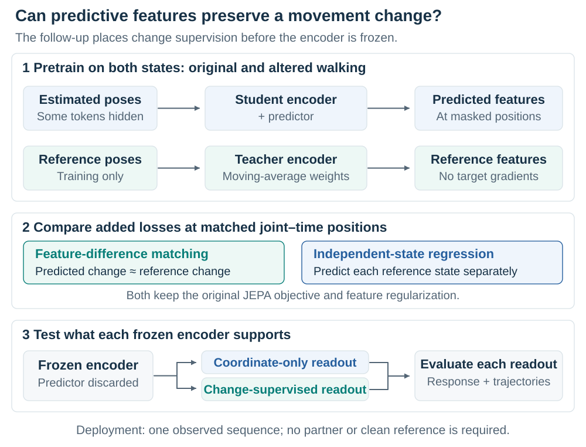
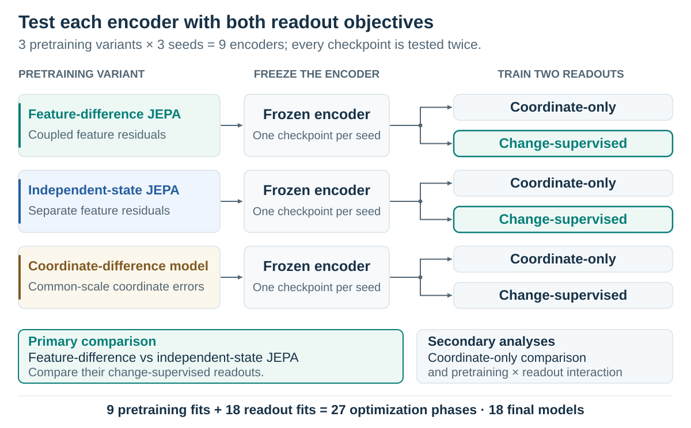
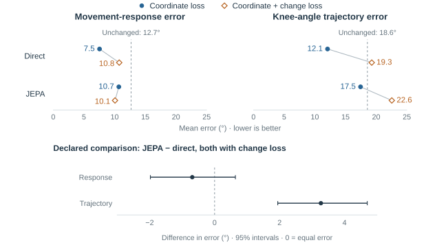

# Gait Fidelity

## Preserving movement changes in learned pose restoration

**Research proposal · 24 September 2026.** Completed synthetic core results motivate a controlled JEPA follow-up. Follow-up results are not yet available in the supplied evidence.

[Two-page overview](proposal-brief.html) · [Printable overview](proposal-brief.pdf) · [Core analysis](results/core-analysis-20260924/README.md) · [Amended experiment](methods/core-to-followup-20260924.md)

## Abstract

When video is used to compare how someone moves across conditions, an apparent change can come from the movement, the observation, or the algorithm that processes it. Gait Fidelity investigates whether learned pose restoration preserves the magnitude, direction, and side-specific structure of a defined movement change. A synthetic walking experiment showed that direct coordinate training improved the measured response, but adding explicit change supervision worsened angular trajectories across five model families. The tested JEPA procedure did not establish a response advantage. These results motivate a follow-up that adds feature-difference supervision during predictive pretraining and tests each frozen encoder with two downstream objectives. Matched controls distinguish a benefit of learning differences from additional regression supervision and dependence on the readout. The aim is to understand which training procedures support reliable movement measurement, a prerequisite for interpreting video-derived changes in biomechanics and ambient monitoring.

## 1. When a movement estimate becomes a scientific measurement

Suppose a person appears to bend one knee less after a change in their walking condition. Before interpreting that observation, we need to know whether the movement changed, the leg became harder to see, or a processing model altered the estimated trajectory. This is a measurement problem: the output must support the comparison we intend to make, with enough fidelity to distinguish movement from observation error.

In biomechanics, joint trajectories contribute to estimates of motion and, through additional modeling, forces and joint loading. Scott Delp and colleagues' **OpenCap** combines smartphone-video pose estimates, learned marker augmentation, musculoskeletal modeling, and physics-based simulation. Its evaluation includes changes between movement conditions. That use illustrates why accuracy at a single condition and accuracy of a between-condition change are related but distinct requirements. [Uhlrich et al., 2023](https://doi.org/10.1371/journal.pcbi.1011462).

*Figure 1. What must the observation support? OpenCap provides a real example of video feeding a biomechanical measurement pipeline. Two smartphone video views from Uhlrich et al. (2023), Fig. 2; cropped, [CC BY 4.0](https://creativecommons.org/licenses/by/4.0/). These recordings are not part of Gait Fidelity. [Image provenance](images/context/README.md).*

A related problem arises in **James Landay and colleagues' ambient intelligence research at Stanford HAI**. The lab describes planned studies of older adults' natural mobility alongside clinical balance tests, and field studies of sensing in everyday environments. An unobtrusive system must work with the views and walking episodes that daily life provides. In such a deployment, furniture, other people, walking aids, and changing orientation can make observations incomplete or inconsistent. Tracking a trend over time therefore requires knowing how much the sensing and processing pipeline can change the measurement. [Stanford AmI projects](https://ami.stanford.edu/).

Our study examines **pose restoration**, the learned correction of joint trajectories estimated from video. Conventional coordinate and smoothness objectives describe aspects of reconstruction quality, but do not by themselves guarantee preservation of a particular gait measurement. A correction can attenuate the size of a change, reverse its direction, or attribute it to the wrong leg. These possibilities matter when comparing movement across conditions: the apparent improvement may differ from what the person did. They must be tested, rather than inferred from a visually plausible skeleton or a smaller average position error.

Gait Fidelity makes this requirement explicit for a bounded measurement. It evaluates the change alongside the trajectory and observation errors, then asks whether predictive representation learning can improve the information available for that measurement. This complements movement-analysis and ambient-sensing research; it does not assume that either Stanford program uses this method or exhibits the particular failure under investigation.

## 2. A controlled test of movement fidelity

### Change the movement while controlling its observation

Real recordings are essential for eventual validation, but they rarely provide a clean reference for a hidden joint or a precisely matched alternative movement. We begin with recorded AMASS motions driving a three-dimensional body model. For each walking interval, we retain the original motion and generate an altered version with a controlled knee-flexion edit. The model renders images for fixed pose estimators and projects its joints into the same images to provide reference trajectories.

These are **paired movement states**: two complete versions of the same walking interval, not adjacent frames. Both retain the same source motion and camera. Related versions vary camera angle, occlusion, and left–right labeling errors. This crossed design separates the intended movement change from errors in how it is observed. It is a kinematic stress test with known projected geometry; a body-model edit does not establish a physiologically valid impairment or treatment effect.

The core uses 128-frame intervals at 25 Hz, three fixed pose estimators, and 45° and 90° camera views. Commanded knee-flexion edits are 0°, 5°, 10°, and 15°; the 15° edit is excluded from training to test a larger intervention. A commanded edit is a body-model parameter, distinct from the measured change in projected knee excursion.

*Figure 2. What must be held fixed? Compare movement states within the same observation condition; compare observation conditions at fixed movement. Changing the camera can change a two-dimensional angle even when the physical motion is unchanged, so each view has its own reference.*

### Define what must survive restoration

For each leg, we measure one knee angle per eligible video frame. Draw two lines in the image: one from the knee to the hip and one from the knee to the ankle. The angle between them is the **image-plane knee angle**; a straight projected leg gives 180°. Repeating this calculation across the walking interval produces a sequence of angles describing how that leg's projected configuration changes over time.

**Knee excursion** summarizes the range of those angles. The 5th-percentile angle is the value below which approximately 5% of the framewise angles fall; the 95th-percentile angle is the value below which approximately 95% fall. Subtracting the former from the latter gives the span of the central 90% of observed angles. For illustration, a 5th percentile of 110° and a 95th percentile of 170° give an excursion of 60°. Using these percentiles instead of the absolute minimum and maximum reduces the influence of a few extreme frames, although it can also omit brief, real movement extremes.

We calculate this quantity separately for the left and right legs, on the same reference-selected frames used to evaluate the restored trajectories. The right-minus-left excursion difference is

$$
q_{\ell}=P_{95}(\theta_{\ell})-P_{5}(\theta_{\ell}),\qquad A=q_R-q_L.
$$

Here, $\ell$ denotes a leg and the percentiles are taken over the fixed reference-supported interval. For original state $a$ and altered state $b$, define the reference change and its reconstruction error by

$$
\Delta A=A_b-A_a,\qquad E_{\Delta}=\left|\left(\widehat A_b-\widehat A_a\right)-\Delta A\right|.
$$

Hats denote measurements from restored trajectories. We call $\Delta A$ the **movement response**, meaning the difference in this measurement across the two conditions. If the reference changes from +5° to 0°, its response is −5°. A reconstructed response of −2° attenuates the change; +2° reverses it. These are illustrative numbers, not experimental results.

The sign retains the right–left ordering instead of discarding it through an absolute asymmetry score. Nevertheless, this scalar cannot describe all gait changes: equal reductions in both legs can cancel, and equal errors at the two states can conceal inaccurate measurements. We therefore evaluate each leg's excursion, the full angle trajectories, coordinate accuracy, and a geometric side-assignment diagnostic as well. That diagnostic does not independently establish anatomical identity or identify a clinically affected leg.

All angles in this study are projected two-dimensional measurements. They are neither anatomical three-dimensional range of motion nor validated fall-risk indicators. This limited scope makes the first question testable: can a processing model preserve a known movement response under the declared observation conditions?

Explore a numerical example of preserved and distorted movement change

<!-- INTERACTIVE:response -->

## 3. The representation-learning hypothesis

### What predictive pretraining is asked to learn

The completed core, detailed in Section 5, found that direct coordinate restoration improved measurements, while explicit movement-change supervision introduced trajectory tradeoffs. Those findings motivate a hypothesis about *where* supervision enters: perhaps a representation will better support movement measurement if it learns the relation between states before its encoder is frozen. The core does not establish that the encoder has lost that information, or that pretraining is the cause of the observed errors.

The tested model is inspired by **JEPA**, a joint-embedding predictive architecture. A student encoder processes noisy estimated joint trajectories with some joint–time regions masked. A predictor maps its features toward target features computed from the clean reference trajectory by a teacher network. The teacher follows the encoder through an exponential moving average of its parameters, and its outputs are treated as fixed targets during gradient calculation. The clean reference supplies privileged training supervision.

*Figure 3. Where could movement information be preserved or lost? Pretraining updates the student and predictor using teacher targets. Evaluation retains the frozen encoder and a newly trained coordinate readout; the predictor and reference teacher are absent from deployment. See the controls below before interpreting a good reconstructed trajectory as evidence of useful pretraining.*

After pretraining, the predictor is discarded and the encoder is **frozen**, so its learned parameters no longer adapt. A fresh coordinate **readout** learns to convert its features into corrections. On observed joints, the model can also add those corrections to the input coordinates through a direct residual connection. This makes an initialized-encoder control necessary: a trained readout and the observed coordinates may support useful output even without learned pretraining.

The connection to world-model research is predictive learning of representations that may retain useful physical information. This experiment predicts clean-reference features from partial observations. It does not predict future physical states, learn action-conditioned dynamics, or perform planning. At deployment it processes a single observed sequence, without the paired sequence or reference targets used during training.

### Match feature changes, with a control for added supervision

The central question is: **Does adding feature-difference supervision during JEPA pretraining improve the movement change recovered from the frozen encoder, beyond adding independent regression targets for each state?**

Let $\widetilde p_i$ and $\widetilde t_i$ denote the scaled, channel-centered predictor and teacher features at a matched joint–time position in state $i$. Their residual is $e_i$:

$$
e_i=\widetilde p_i-\widetilde t_i,\qquad e_b-e_a=(\widetilde p_b-\widetilde p_a)-(\widetilde t_b-\widetilde t_a).
$$

Thus, minimizing the difference between the residuals encourages the predicted feature change to match the teacher's feature change. For feature width $D$, we compare two additional losses:

$$
\mathcal{L}_{\Delta}=\frac{\|e_b-e_a\|_2^2}{2D},\qquad \mathcal{L}_E=\frac{\|e_a\|_2^2+\|e_b\|_2^2}{2D}.
$$

The first couples prediction errors across states; the second regresses each state's target independently and is called **endpoint regression** in the implementation. Both retain the original JEPA loss and feature regularization. Their relationship on the same feature tensors is

$$
\mathcal{L}_{\Delta}=\mathcal{L}_E-\frac{e_a^{\mathsf{T}}e_b}{D}.
$$

This control matters because a gain over ordinary JEPA could come from the extra continuous feature targets, without requiring difference supervision. The comparison holds their support and coefficient procedure fixed to isolate the objective change. Separately trained teachers evolve differently, so this algebra does not imply that targets remain numerically identical throughout training.

A feature-difference loss permits shared nonzero errors to cancel. Furthermore, learned feature distances have no physical units, so matching them need not preserve a knee measurement. The downstream experiments determine whether the additional constraint is useful.

Explore why shared feature errors can cancel

<!-- INTERACTIVE:coupling -->

## 4. Experiments that make the hypothesis interpretable

### Separate pretraining from readout supervision

The follow-up compares feature-difference JEPA with independent-state JEPA, plus an analogous difference objective for coordinate pretraining. The coordinate model tests whether the benefit extends beyond latent-feature prediction. It is compared with ordinary coordinate pretraining before drawing any cross-family conclusion.

Each variant is trained at three seeds. Each of the resulting nine encoders then receives **two readouts from the same frozen checkpoint**: one uses coordinate supervision alone; the other adds the inherited paired-change objective and its short-segment penalty. Their initialization and training exposure are matched. This produces eighteen final models through nine pretraining and eighteen readout phases.

*Figure 4. Why two readouts? The core shows that downstream change supervision can alter the result substantially. Testing both objectives asks whether a pretraining benefit persists or depends on that supervision.*

The primary comparison remains feature-difference versus independent-state JEPA **with the change-supervised readout**. The coordinate-only contrast and the interaction between pretraining and readout objectives are secondary analyses. The interaction compares the two effect estimates directly; an apparent benefit under one readout and an uncertain effect under the other does not establish an interaction. This two-readout amendment was made after examining the core and before inspecting new follow-up results.

Imported core predictions supply ordinary JEPA, coordinate pretraining, initialized encoders, shuffled-reference JEPA, and direct training under both objectives. The strongest observed baseline, direct coordinate training, remains the practical comparator. Direct training can adapt its encoder throughout fitting, whereas frozen-readout models cannot; matching nominal update counts does not equalize their optimization opportunities.

### Match the data and account for alternative explanations

The new fits inherit the core's admitted AMASS walking cohort, person splits, architecture, masks, optimizer, and actual update schedule. Both JEPA losses use only joint–time patches queried in both states with complete reference support, preventing one from receiving more targets. A fixed training-only calibration sets one shared coefficient from initial gradient magnitudes; the coordinate model is calibrated separately. Its errors are converted to a common pair scale before subtraction. These decisions reduce differences in data access and initial loss scale; they do not equalize the objectives' influence throughout training.

The evaluation retains four complementary questions:

| Question | Measurement and reason |
| --- | --- |
| Is the intended change recovered? | Person-balanced response error, signed response curves, direction accuracy, and a zero-change benchmark distinguish preserved change from attenuation, reversal, or low error on small reference changes. |
| Is the underlying motion still accurate? | Individual limb excursions, angular waveforms, and coordinates reveal shared endpoint bias or a scalar improvement purchased through trajectory distortion. |
| Does observation quality determine the answer? | Occlusion and labeling contrasts at fixed movement and camera measure sensitivity to observation error. Low sensitivity alone could also arise from an insensitive model. |
| Is the representation useful to the deployed model? | Fixed linear probes of encoder, predictor, and teacher features examine where reference movement change is accessible, and whether accessibility survives the transition from masked training to unmasked deployment inputs. |

The primary score includes all reference-eligible responses except the designated no-change state, which remains a diagnostic. Actual small changes in altered states stay included. Failed predictions receive the inherited 720° scoring penalty, a fixed cost rather than a measured knee response; the amendment separately reports successful-error and failure contributions with the same denominator. A gain from fewer failures is a reliability gain and must be distinguished from greater accuracy among successful outputs.

Correlated views and corruptions are aggregated within windows, motions, and people. A crossed bootstrap resamples people and fitted seeds while keeping methods paired. Repeated renderings do not create more participants. The reused development population and three seeds support a development comparison, not independent confirmation. The [evaluation contract](methods/evaluation.md) and technical appendix specify the remaining procedures.

## 5. Results: restoration helps, but the training objective matters

### What has been demonstrated

The completed core export contains 14 development participants evaluated across three seeds. **Direct coordinate training had the lowest mean on all nine exported metrics.** Relative to unchanged pose estimates, it reduced mean movement-response error from 12.688° to 7.544°, a 40.5% reduction, and angular-waveform error from 18.571° to 12.073°. The response improvement was 5.144°, with a descriptive 95% crossed person/seed interval of [2.152°, 8.651°]; this contrast was selected after inspection and is exploratory. The result demonstrates improvement under the tested synthetic conditions; it does not establish clinical adequacy or a benefit for every participant.

*Figure 5. Completed core: 14 development participants, three seeds. Upper panels show mean errors on identical scales; connectors join the two restoration losses within each family, and dashed lines mark unchanged pose estimates. For JEPA, these losses train the readout after pretraining. Direct coordinate training has the lowest means. The lower panel shows the declared JEPA-minus-direct contrast, both with change loss, and descriptive 95% intervals resampling people and seeds. Negative values favor JEPA; its response interval crosses zero, while its trajectory error is higher. These are core findings; follow-up results remain pending.*

The core's declared comparison was JEPA versus direct training, **both with change supervision**. JEPA had 0.688° lower mean response error, but its descriptive 95% crossed person/seed interval was **[−0.640°, +1.977°]** for direct-minus-JEPA error. Superiority remains unresolved. JEPA reduced observation-induced error in that comparison, but increased waveform error by 3.272°. The improvement in one endpoint therefore does not establish general gait fidelity.

Across all five neural families, adding the change objective worsened mean waveform error. Four also worsened in mean response error. JEPA's response advantage over the matched initialized-encoder control remained uncertain: 0.093°, with interval [−1.394°, +1.393°]. This provides no clear response-error advantage from the tested JEPA pretraining over the initialized-encoder control.

### What remains unresolved

The observed tradeoffs could arise from objective balance, readout optimization, reference support, prediction failures, or the information exposed by the representation. The aggregate export cannot identify a cause. In particular, a response improvement can reflect cancellation of endpoint errors or fewer failed measurements. The follow-up's response curves, failure decomposition, and feature probes can help distinguish these explanations.

The direct-versus-unchanged comparison and additional contrasts selected after inspection are exploratory. The available export supports reconstruction of the reported person-level summaries, but does not contain raw predictions or the complete cohort and fit receipts. No feature-difference, endpoint-regression, or coordinate-difference follow-up results are available here. The new experiment tests an unresolved hypothesis; it does not confirm a remedy suggested by the core. Full numbers, uncertainty, and reconstruction limits are retained in the [core analysis](results/core-analysis-20260924/README.md).

## 6. Discussion: from reconstruction accuracy to measurement validity

The core establishes a practical benefit from restoration and a caution about training for a single measurement. Direct coordinate learning improved response and trajectory accuracy together. Explicit supervision of the scalar change did not reliably improve that combination. A movement-analysis system therefore needs evaluation at the level of its intended inference: which change occurred, how large it was, and whether the reconstructed trajectory supports that interpretation.

*Figure 6. What evidence is needed beyond simulation? A structured residential walking test recorded with a portable depth camera in the Rush study. Independent references are needed to assess restoration in these settings. Dawe et al. (2019), Fig. 1; cropped, [CC BY 4.0](https://creativecommons.org/licenses/by/4.0/). This is prior research, not passive Stanford monitoring or the Gait Fidelity cohort. [Image provenance](images/context/README.md).*

For representation learning, the proposed contribution is a controlled test of whether supervising feature differences helps a frozen encoder support a defined physical measurement. A benefit over independent-state regression under both readouts would suggest broader utility within the tested procedures. A benefit restricted to one readout would motivate examining the estimated interaction. Similar gains from both JEPA variants would make additional continuous supervision a plausible explanation. A gain dominated by fewer failures would support a reliability explanation. Uncertain contrasts would leave the hypothesis unresolved rather than establish equivalence.

The study cannot uniquely identify a causal mechanism. Teachers evolve separately, feature differences can cancel shared bias, and no new arm re-pairs movement states during auxiliary pretraining. The shuffled-reference control tests observation–reference correspondence, not that distinct pairing question. Linear probe failure likewise does not prove the absence of nonlinear information. Related work such as [Sobolev training](https://proceedings.neurips.cc/paper/2017/file/758a06618c69880a6cee5314ee42d52f-Paper.pdf) supervises derivatives; here we match paired feature differences without estimating derivatives. The scientific value would lie in the controlled finding and its limits, rather than in the existence of a difference loss.

For **biomechanics**, the framework offers a way to test learned processing before interpreting between-condition movement changes or feeding trajectories into further models. Transfer would require synchronized observations and independent references using an appropriate anatomical convention. For **ambient intelligence**, the corresponding question is whether a measured mobility change survives realistic changes in visibility and observation quality. That requires repeated measurements in the relevant people and environments, including coverage and failure analysis. Camera placement, longitudinal health inference, and clinical risk prediction remain separate validation questions.

The next useful step is thus an independent measurement study: hold out people and conditions, compare reconstructed changes with reference changes, and report repeatability as well as mean error. It should evaluate waveform and laterality alongside the chosen scalar. A synthetic improvement would justify that test; independent movement references are needed to establish whether the benefit transfers.

## Technical details and supporting material

Exact feature residuals and common-scale coordinate errors

The main text uses scaled, channel-centered features. In the implementation, $p_i$ is the predictor output, $t_i$ is the teacher output, $c$ is the running teacher center, and $D$ is feature width. Subtracting the mean across channels defines

$$
H(v)=v-\left(\frac{1}{D}\sum_{d=1}^{D}v_d\right)\mathbf{1}.
$$

With fixed temperatures $\tau_s=0.1$ and $\tau_t=0.06$, the two features and their residual are

$$
\widetilde p_i=H(p_i/\tau_s),\qquad \widetilde t_i=H\!\left[\mathrm{sg}\!\left((t_i-c)/\tau_t\right)\right],\qquad e_i=\widetilde p_i-\widetilde t_i.
$$

The stop-gradient operation $\mathrm{sg}$ treats the teacher target and center as constants during gradient calculation. Channel centering removes the additive offset that the base softmax comparison cannot identify; it does not assign physical meaning to a feature distance. Both auxiliaries retain the original cross-entropy objective and variance/covariance regularization. Supported joint–time positions are averaged within each pair, then supported pairs are weighted equally. The [full protocol](methods/jepa-response.md) specifies query support and calibration, including the shared coefficient and training-only batches.

For the coordinate variant, $s_i$ is the positive scale used to normalize state $i$ from its observed context. Convert its normalized coordinate residual to the common scale $s_{ab}$ before taking a difference:

$$
s_{ab}=\frac{s_a+s_b}{2},\qquad r_i=\frac{s_i}{s_{ab}}\left(\widehat x_i^{\mathrm{norm}}-y_i^{\mathrm{norm}}\right).
$$

The coordinate auxiliary is $\|r_b-r_a\|_2^2/4$ per joint and frame, averaged over the four frames in a token and then over supported positions and pairs. The divisor accounts for two coordinate dimensions and two states. This scale conversion is part of the loss only.

Calibration, diagnostic probes, and execution scope

Calibration uses 32 fixed training batches at seed-17 initialization, without fitting or development selection. If $G$ denotes the sum of squared gradient norms across these batches over all trainable parameters, the two JEPA arms share

$$
\lambda_J=0.1\sqrt{\frac{G_{\mathrm{base}}}{\max(G_{\Delta},G_E)}}.
$$

The coordinate arm uses its own base and auxiliary gradient energies. Zero or nonfinite calibration quantities stop the calculation. Random states are restored before fresh training. This controls the initial gradient scale; later component gradients and clipping are logged because their relative influence can change.

The diagnostic panel selects at most three metadata-chosen source families per training person and one eligible movement pair per family. Ridge probes use three person-separated folds with fixed mean-loss penalty 0.01; standardization is fitted only within each fold's training people. They compare encoder, predictor, and teacher features, masked and unmasked inputs, and independently masked identical movements. Across-example variance is measured at fixed token positions to avoid confusing positional variation with movement information. The probes do not tune coefficients, choose variants, or stop fitting.

The amended run is `jepa-response-02`: nine pretraining and eighteen readout phases, eighteen final models, seeds 17, 29, and 43. It preserves the original primary comparison and imports both objectives of the five core model families. It introduces no new rendering, pose extraction, GAVD processing, expanded AMASS admission, or confirmation-set access. The recorded allowance is 48 H100-hours and the recorded cutoff is 25 September 2026 at 8 AM Pacific. Profiling must admit the complete matrix at the parent's actual update schedule; the cap is not a measured runtime. Original `jepa-response-01` runs retain their earlier settings.

Local tests and CPU fixtures establish software behavior. Completed HAIC predictions and evaluation are required for follow-up scientific claims. The launch guide and amendment retain the full resource and provenance requirements.

| Supporting document | Purpose |
| --- | --- |
| [Two-page overview](proposal-brief.html) / [PDF](proposal-brief.pdf) | A focused account of the question, approach, evidence, and implications. |
| [Core results and reconstruction](results/core-analysis-20260924/README.md) | Numerical results, uncertainty, exploratory comparisons, and evidence limits. |
| [Amended protocol](methods/core-to-followup-20260924.md) | Two-readout design, retained primary, interaction, and failure decomposition. |
| [JEPA methods](methods/jepa-response.md) / [evaluation contract](methods/evaluation.md) | Exact objectives, calibration, support, diagnostics, and aggregation. |
| [Data specification](data/README.md) | Motion sources, projected references, and limitations. |
| [HAIC launch](../../../slurm/gait-fidelity/START_RESPONSE_02.md) | Initialize the amended experiment without changing the parent. |
| [Image provenance](images/context/README.md) | Real-world photographs, licenses, and credited modifications. |
| [Independent review](reviews/proposal-overview-20260924.md) | Scientific, technical, visual, and adversarial review of both versions. |
| [Document builders](scripts/README.md) | Reproduce the full proposal, overview, and vector figures. |
