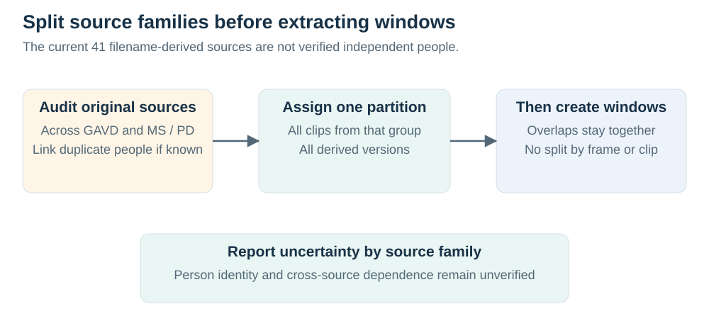
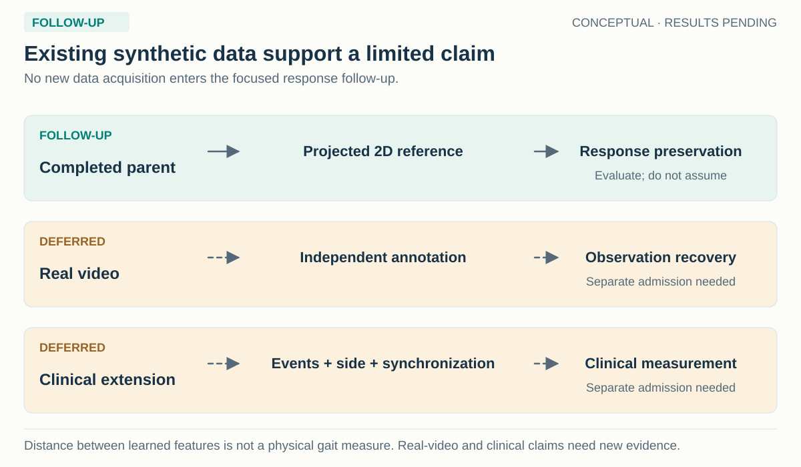

# Data: paired movement, observed poses and reference geometry

[Current proposal](../README.md#3-data-and-reference-measurements) · [Availability and paths](availability.md) · [Local-video audit](local-videos.md) · [Optional clinical sources](clinical-candidates.md)

The active JEPA response experiment reuses the prepared AMASS bundle from the completed `walking-core-01` run. It introduces no new dataset, rendering, pose extraction or confirmation exposure. Its purpose is to compare pretraining objectives on the same admitted population. This page distinguishes the data consumed by that comparison from available footage that may support later studies.

## 1. What a paired reference means

A **paired observation and reference** contains an estimated pose trajectory and a target trajectory for the same rendered movement, camera and time grid. The observation comes from a fixed pose estimator applied to rendered images. The reference comes from projecting body-model joints into those images. An error can therefore be measured at corresponding times and joints.

A **movement pair** links two such examples from the same source family: a baseline movement and a registered altered movement state. It supplies the difference the model should recover. The two endpoints are whole sequence windows, not successive frames. A source family also contains matched observation conditions, allowing joint-naming errors or obstruction to vary while reference movement remains fixed. Camera changes require recomputing projected references.

These references are synthetic joint conventions. They support reproducible projected-coordinate and movement comparisons, but are not direct measurements of a patient's anatomical joint centers. Artificial motion changes remain controlled kinematic tests unless independently validated as a clinical phenomenon.

## 2. Which inputs enter each stage

| Stage | Permitted information | What it determines |
| --- | --- | --- |
| Online encoder and deployed restorer | Estimated coordinates, observed-joint flags, confidence and timestamps through the inherited adapter | Features and restored coordinates from available observations |
| Reference teacher during training | Clean projected coordinates and their reference-validity flags, in the endpoint's observation-derived normalization | Detached target features; the teacher is unavailable at deployment |
| Loss construction | References, registered pair membership, token queries and reference support | Base losses and the additional endpoint/difference supervision |
| Evaluation | References, anatomical mapping, movement/observation metadata and fixed support | Coordinate, bilateral-response, nuisance and coverage measurements |

Pair identifiers, true anatomical assignments and intervention labels are not added to deployment inputs. A saved metadata field is not automatically a model input. The [training protocol](../methods/jepa-response.md) and [notebook F](../../../../notebooks/gait_fidelity/experiments/F_jepa_response.ipynb) expose the actual tensor paths.

The inherited **body12** representation contains six left/right landmark pairs:

| Joint pair | Body12 left/right slots | COCO-17 left/right indices | SMPL-H reference left/right indices |
| --- | --- | --- | --- |
| Shoulders | 0 / 1 | 5 / 6 | 16 / 17 |
| Elbows | 2 / 3 | 7 / 8 | 18 / 19 |
| Wrists | 4 / 5 | 9 / 10 | 20 / 21 |
| Hips | 6 / 7 | 11 / 12 | 1 / 2 |
| Knees | 8 / 9 | 13 / 14 | 4 / 5 |
| Ankles | 10 / 11 | 15 / 16 | 7 / 8 |

Matching names does not guarantee matching anatomical locations. The rendering convention is approximate COCO body12. Systematic landmark offsets and camera foreshortening remain possible; interpret improvements against this declared convention. Body12 has no heels or toes, so ankle-separation peaks are not automatically initial-contact events.

## 3. Population, splits and provenance

The parent begins from the full AMASS manifests and its registered walking selection, then screens references and admits usable source families. The child uses the resulting prepared manifest exactly. It does not repeat selection, add available nonwalking files, or replace excluded people. The older synthetic-training-v2 24/8-person roster is historical, not the current population definition.

| Record retained by the parent | Why the child binds it |
| --- | --- |
| Configuration, code identity and selected profile schedule | Identifies the executed model, processing rules and actual update counts |
| Prepared manifest and array hashes | Establishes which observations, references, people and conditions were consumed |
| Admission amendment and exclusions | Explains post-screening changes, including a training singleton exclusion needed for shuffled-reference support |
| Split, person, source-motion and source-family identifiers | Keeps correlated conditions together and preserves grouping for uncertainty estimates |
| Completed prediction/checkpoint receipts | Binds imported baselines to their actual artifacts rather than to method names alone |

The child requires a completed, verified parent before initialization. No synthetic preparation jobs are invented in its ledger. The bundle is opened read-only, and the child does not copy the pose arrays. Array and receipt hashes are rechecked to detect later modification.

Training rows supply pretraining, readout fitting and coefficient calibration. A separate training-only diagnostic panel chooses at most three metadata-selected source families per person and one registered movement pair per family. Development rows supply the declared comparison. Reserved confirmation data remain unopened; even a strong development effect is not independently confirmed by this run.

## 4. Reference quality and measurement support

Reference review should answer whether a sequence supports the intended quantity before model scores are inspected. In this run, those decisions have already been made by the parent and are inherited. Inspect the retained preparation records and the parent's `data/viewer.html` to assess body-model projection, joint correspondence, framing, imposed movement and observation conditions. The child status points to that parent viewer. The [notebook guide](../../../../notebooks/gait_fidelity/README.md) also explains source visualization.

For knee excursion, nearly coincident projected segments make angles unstable. The reference therefore determines fixed valid-frame support, minimum coverage and interval eligibility. Every method is evaluated on the same eligible reference population. An eligible reference with a failed prediction remains a prediction failure; a geometrically unsupported reference is a separate coverage limitation.

For the new auxiliary losses, a token contains four frames of one joint. Both endpoints must query the token, and all four reference frames must be valid at both endpoints. This common support prevents the paired and endpoint arms from receiving different supported target positions. Unsupported auxiliary pairs retain their original base loss and are recorded by person and condition.

Reference validity, image visibility and observed-joint availability describe different things. A joint can have a valid synthetic reference while hidden in the rendered image. Scoring it is a synthetic hidden-joint evaluation; it does not create independently observable truth for hidden joints in real videos.

## 5. What existing real datasets contribute

The full GAVD collection, approximately 1,800 sequences, is reported stored on HAIC. It is useful for investigating realistic pose-estimation failures, but its labels do not supply dense paired reference trajectories or an independently measured response between two movement conditions. It is excluded from this follow-up, even though broader Gait Fidelity scripts can process it.

The local MS/PD/Normal collection contains 91 clips from 41 filename-derived source IDs. The dated audit found that 28 source IDs, covering 61 clips, also occur in GAVD manifests. These IDs are not verified independent people. A future visible-joint study would require continuous review, independent annotations and checked exposure histories; copying the collection into a new folder would not make it external confirmation. Its 88 historical caches need revised timestamp and imputation handling before physical-time analysis. See the [local audit](local-videos.md) for the original evidence and [video gallery](video-gallery.html) for inspection.

Stroke motion capture, synchronized MoVi video/reference data and clinical candidates remain optional acquisitions. They may support future questions, but no new download or annotation is required for the active child. The [availability inventory](availability.md) distinguishes reported HAIC holdings, verified local files and unacquired datasets.

## 6. How data limitations affect the claim

A large number of rendered conditions does not supply an equally large number of independent people. Person-balanced aggregation addresses unequal repeated exposure; it cannot remove uncertainty from a small population or a narrow movement distribution. Synthetic edits also share the assumptions of their motion editor and body model.

The current design can establish whether one pretraining objective improves restoration of a reference-defined projected response within this prepared cohort. Clinical validity, diagnosis, treatment response and real-video transfer require their own independently referenced populations. No clinical finding should be inferred from a synthetic intervention name or a low latent difference loss.
