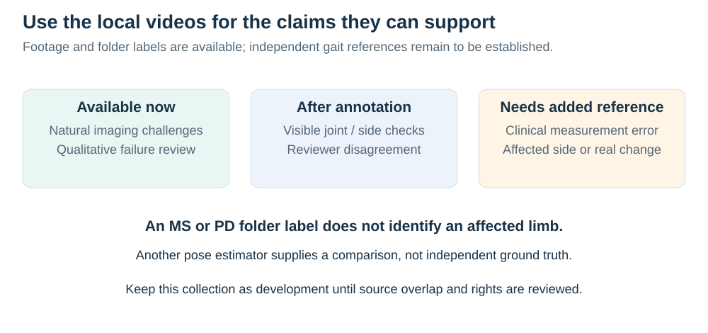

# Clinical laterality and abnormal-gait data opportunities

> **Scope in the revised study:** this is a dated feasibility audit for a deferred extension. These videos and clinical candidates do not enter `jepa-response-01`. The [active data specification](README.md) reuses the completed parent AMASS bundle; availability statements below retain their original audit dates.

Audit date: 19 September 2026. This is a research and feasibility assessment based on original papers, official repositories and the current synthetic-training-v2 plan. No clinical dataset was downloaded, no access request was submitted, and no new experiment was run. Public documentation establishes the opportunities below; successful import, usable reference coverage and permission for the intended use remain separate checks.

**Availability clarification, 21 September 2026:** the external stroke and LIVE-GaitNeuroKids datasets, the full MoVi video/reference release and other candidate datasets discussed here are optional additions that have not yet been acquired for this study. They are not installed inputs to the current HAIC experiments. Your HAIC setup already contains AMASS, GAVD and COCO; the separately audited MS/PD/Normal clips are available on your Mac, with no HAIC copy yet established. The [availability inventory](availability.md) records the paths and evidence. Start synthetic development with the existing assets; pursue these acquisitions only for an admitted extension.

The strongest extension would ask whether pose restoration preserves an independently measured difference between the two legs while reducing errors caused by the camera or pose estimator. This has a practical use in measuring movement after unilateral impairment or changes in an orthosis or prosthesis, where smoothing away a genuine limitation can produce a visually convincing but misleading result. The current normal-walking experiment supplies a reason to investigate this risk, but does not demonstrate preservation of pathological gait, identify an affected leg or establish clinical benefit.

Three different meanings of “laterality” must remain explicit. **Anatomical identity** assigns each tracked joint to the person's left or right side. **Movement asymmetry** measures a difference between the two limbs, such as their step times or knee excursions. **Clinical affected side** comes from an examination or documented diagnosis; it need not have the shorter step, smaller movement or larger error in every measurement. A model can preserve the magnitude of asymmetry while swapping the legs and reversing its meaning. An affected-side label also cannot replace a movement reference.

## Clinical motivation and the limits of symmetry

For stroke, useful applications include measuring paretic and nonparetic step timing separately, checking whether a treatment-associated change is retained in video measurements, and distinguishing improved foot placement from compensatory movement. The original study **“Persons post-stroke improve step length symmetry by walking asymmetrically” (2020)** examined nine people using kinematic, kinetic and metabolic measurements. More symmetric steps did not remove the underlying asymmetric mechanics or reduce metabolic cost in that experiment. This directly cautions against treating a restoration objective that makes both limbs look alike as a clinical improvement. It is a small mechanistic study, not a universal conclusion about rehabilitation. [Original study](https://pmc.ncbi.nlm.nih.gov/articles/PMC7397591/).

For cerebral palsy, a narrower application is preserving a clinician-observed, side-specific movement feature, such as initial foot contact or knee position during stance. The original **“Deep neural networks enable quantitative movement analysis using single-camera videos” (2020)** demonstrated prediction of clinical movement measures from videos in a large CP cohort. Its optical measurements were collected during a different walking trial in the same visit, which is suitable for some visit-level associations but cannot supply frame-aligned targets for restoring that video. Its clinical dataset also illustrates the importance of grouping every visit by patient. [Original study](https://www.nature.com/articles/s41467-020-17807-z).

Parkinson's disease offers an application in retaining freezing episodes and differences in movement across sides, provided the outcome has its own reference. Freezing, general disease severity and a more-affected body side are different labels. A dataset with a single sensor on the more-affected leg cannot establish bilateral trajectory accuracy. Prosthesis fitting provides another clear side-specific context, although improvement in a reconstructed trajectory would still need to be distinguished from improvement in the person's function.

## Priority datasets and what each can establish

### Local MS/PD videos: accessible development footage with source overlap

The [21 September local audit](local-videos.md) inspected all 91 raw files in `multiple-sclerosis/video-data-full`, checked decoded timestamp cadence and cache contents, and reviewed metadata-selected frames across all 41 filename-derived sources. Use the [local gallery](video-gallery.html) to inspect the footage and export review notes. The collection supplies useful examples of occlusion, mobility aids, difficult framing and varied cameras. Its folder labels do not supply clinical reference measurements, affected side or verified independent patient identities. Twenty-eight source IDs also occur in the local GAVD manifest, so prior exposure must be checked before any transfer claim.

*The first useful local experiment is a development audit followed by independently annotated visible-joint/side checks. Clinical measurement confirmation remains a separate reference-data task.*

The MS mapping notes identify candidate features, but their disease-general descriptions should not be treated as per-clip labels. [Filli et al.](https://pmc.ncbi.nlm.nih.gov/articles/PMC5862880/) describe heterogeneous MS gait patterns; an asymmetric pattern is one possibility among others. Preserve the movement in each recording, including bilateral or low-amplitude changes, instead of imposing a presumed disease template. The existing local cache requires re-extraction for physical-time gait measurements because it records nominal 15 Hz while some source sampling is closer to 12–12.5 Hz, interpolates gaps without a maximum length, and changes coordinates through framewise normalization.

### LIVE-GaitNeuroKids: the most promising new clinical video feasibility check

**“LIVE-GaitNeuroKids: A multimodal and Longitudinal Gait dataset with Inertial, Video and surface Electromyography in Neuromotor conditions and typically developing children” (2026)** is a data-descriptor preprint. It reports 59 children: 22 with CP, 12 with idiopathic toe walking and 25 typically developing children. The CP proportions correspond to 12 children with hemiparesis: seven right and five left. Three 30-fps cameras accompany 100-Hz Xsens kinematics and bilateral lower-leg EMG. The cameras are explicitly **not hardware-synchronized** with the sensors. Wearable signals have an alignment procedure, which does not establish video-to-reference synchronization. Follow-up visits are available with missingness. The processed gait cycles undergo a homogeneity filter; raw data are preferable when studying whether unusual movement is preserved. These are inertial-model references and EMG, rather than dense optical anatomical ground truth. [Preprint, posted 21 April 2026](https://doi.org/10.21203/rs.3.rs-9471086/v1).

The official **version 1.1**, dated 9 July 2026, lists a 7.7-GB data archive, a 1.7-GB video archive, a 76.2-MB analysis archive and a participant-characteristics workbook. Public download links are visible, but this audit did not retrieve the files. The repository's license field did not render in the research tool; the preprint's CC-BY license must not be substituted for verified dataset terms. [Official release](https://zenodo.org/records/21278362).

Recommended role: a small clinical integration and independent measurement study, conditional on synchronization and joint-convention checks. First verify that the workbook supplies affected side separately from motor dominance, that videos cover the same trials as the wearable streams, and that exported reference formats can be read without proprietary software. A fixed, auditable video-to-sensor alignment must be assessed using held-out landmarks rather than choosing an offset that makes the proposed model agree best. The 12 hemiparetic children are a small independent sample; repeated visits, cameras and steps cannot turn it into a large unilateral-CP trial. A pretreatment/post-treatment difference is observational and may include maturation or other changes.

### Stroke full-body mocap: strongest public pathological-motion source, unverified RGB

**“A full-body motion capture gait dataset of 138 able-bodied adults across the life span and 50 stroke survivors” (2023)** provides full-body Plug-in Gait kinematics, force-plate measurements and synchronized EMG. Raw C3D and processed stride-normalized data are available. The descriptor reports manually checked marker labels, gap filling and gait events, but stroke kinetic recordings are sparse and their processed kinetic outliers were not assessed as part of that release. The documented records do not establish a public synchronized RGB collection. [Original descriptor](https://www.nature.com/articles/s41597-023-02767-y), [official data collection](https://doi.org/10.6084/m9.figshare.c.6503791.v1).

Recommended role: actual stroke movement for testing whether a rendering/retargeting pipeline preserves bilateral kinematics, or as an independent source of pathological trajectories. This is considerably stronger than simply naming a perturbed healthy walk “stroke.” However, rendering these motions produces a synthetic-image experiment. Establish the clinical-side crosswalk from source metadata; do not infer it solely from lesion-side descriptions. Check raw marker gaps, force-foot assignments, hand support and the relationship between modeled joint centers and the pose-estimator landmarks. Phase-normalized exports are useful for shape comparisons but cannot replace raw timestamps for step-time asymmetry.

### Parkinson freezing dataset: public clinical video, constrained reference

**“A Public Data Set of Videos, Inertial Measurement Unit, and Clinical Scales of Freezing of Gait in Individuals With Parkinson's Disease During a Turning-In-Place Task” (2022)** reports 35 participants performing alternating turns, with lower-limb video at 30 Hz, a 128-Hz IMU on the more-affected shank and clinical scales. Two specialists reached consensus on freezing intervals. The more-affected side is based on specified motor-examination items, and video/sensor alignment uses the first movement rather than a shared hardware trigger. The protocol includes repeated sessions and medication state information. [Original paper](https://doi.org/10.3389/fnins.2022.832463), [official dataset](https://doi.org/10.6084/m9.figshare.14984667).

Recommended role: a separately named clinical stress test asking whether restoration erases independently annotated freezing or introduces apparent motion during a freeze. It can also support audited side-identity examples. It supplies neither full bilateral motion-reference trajectories nor ordinary straight-walking evaluation. A correlation with the one measured shank does not validate the other leg, and an apparently regular ankle-separation waveform would be an inappropriate success criterion during freezing. Confirm file-level access and data terms before scheduling this branch.

### ProGait: practical videos with explicit prosthesis changes, only four people

**“ProGait: A Multi-Purpose Video Dataset and Benchmark for Transfemoral Prosthesis Users” (ICCV 2025)** provides 412 clips from four above-knee prosthesis users. Its official repository documents raw videos, 23 body/foot keypoints and textual gait assessments; identifiers encode the person, prosthesis, trial and camera. This organization is useful for avoiding leakage between repeated fittings and views. The annotations should be audited for provenance before treating them as independent coordinate references. [Official repository](https://github.com/pittisl/ProGait), [paper](https://arxiv.org/abs/2507.10223).

The official dataset is gated on Hugging Face and requires agreement to share contact information. Its dataset license is CC-BY-NC-SA-4.0; the repository's MIT code license does not replace those terms. [Dataset page](https://huggingface.co/datasets/ericyxy98/ProGait).

Recommended role: a limited external demonstration with a physically identifiable side and repeated device configurations. Four people are insufficient for a broad clinical-population claim, regardless of clip count. Device changes and expert recommendations do not constitute randomized treatment effects, and a prosthetic knee is not interchangeable with a biological anatomical landmark.

### ChildGait / Children Gait Video: relevant bilateral labels, public RGB unresolved

**“Decoding Children's Gait Behavior” (2026 preprint)** describes videos of 110 children with bilateral Edinburgh Visual Gait Scores, which assign 17 observational items to each limb. It reports Sapiens-initialized keypoints adjusted by annotators and patient-level splits. The paper states that the public release is pose sequences; it also describes additional authorization requirements for using video/annotations to train large foundation models. Thus, neither unrestricted raw-video access nor independent optical truth can be assumed. [Original preprint](https://arxiv.org/abs/2608.00371).

The official Hugging Face dataset lists CC-BY-NC-4.0 and exposes pose-record previews. [Official dataset](https://huggingface.co/datasets/PediaMedAI/ChildGait).

Recommended role: a longer-term side-specific clinical scoring benchmark after resolving video access, the precise released version, patient IDs and annotation provenance. Do not treat manually adjusted estimator outputs as measurement-independent truth without a blind reference audit. The bilateral visual labels are useful outcomes, but they do not alone validate small coordinate or timing improvements.

### GaitRec: valuable bilateral force data, a separate modality

**“GaitRec, a large-scale ground reaction force dataset of healthy and impaired gait” (2020)** describes bilateral force records and metadata including `SUBJECT_ID`, `SESSION_ID` and `AFFECTED_SIDE`, with predefined evaluation partitions. Its impairments are musculoskeletal; it is not a stroke-video corpus. This is useful for studying affected-side load patterns and checking bilateral feature definitions, but it supplies no established RGB-to-joint reference pairing for this project. [Original descriptor](https://www.nature.com/articles/s41597-020-0481-z).

Use only as an explicitly separate force-domain experiment if that question becomes central. Joining its force records to unrelated pose videos would not provide supervised multimodal evidence. Verify that any adopted partition keeps every session from a person in a single split, and retain both limb waveforms before constructing asymmetry summaries.

## Controlled perturbations and synthetic pathology

Healthy unilateral perturbations are useful because the manipulated side and timing can be known. For example, the original **“A Perturbation Mechanism for Investigations of Phase-Dependent Behavior in Human Locomotion” (2016)** is accompanied by a laboratory data release documenting right-leg perturbations, bilateral kinematics, ground forces and EMG. It does not establish publicly released synchronized RGB. Such data could test preservation of an imposed movement response after rendering, with explicit control over phase. They cannot establish that the resulting movement represents a neurological condition. [Official laboratory data page](https://locolab.robotics.umich.edu/data.html).

The **GaitMotion** preprint (2024) is an example of an important naming trap: its pathological patterns were mimicked by ten healthy participants, with wearable/pressure-walkway measurements. These are simulated abnormal behaviors, not a patient cohort. [Original paper](https://arxiv.org/abs/2405.09569), [official repository](https://github.com/tensor-song/GaitMotion).

The closely related **“Utility of synthetic musculoskeletal gaits for generalizable healthcare applications” (Nature Communications, 2025)** already studies synthetic gait and self-supervised transfer. Its synthetic video inputs are projected joints with added noise. Muscle weakness/contracture parameters alter force/length scales, and generated walks are retained only when the model completes 20 m without falling. This creates a useful simulator distribution but does not validate patient-specific pathological counterfactuals. Its public CP input consists of pre-extracted poses with separately recorded visit-level references; left/right measures were averaged. Its private dementia data require ethics approval, with an expected request time of roughly three months. Component code repositories are linked, but a complete ready-to-use synthetic corpus was not verified here. [Original paper](https://www.nature.com/articles/s41467-025-61292-1).

Accordingly, simulation-based pretraining and abnormal-gait augmentation alone would be weak novelty claims. A stronger hypothesis concerns retaining the **measured response to a controlled biological change** while reducing sensitivity to image corruption, with signed side preserved. The simulator can establish this response within its own assumptions. Real clinical data must establish whether the tested measurement remains meaningful in people.

One further relevant preprint is **“GaitEncoder: A Foundation Model of Gait Kinematics for Diverse Clinical Applications and Pathologies” (July 2026)**, which explicitly flips left-leg strides to the right-leg convention. That design may be appropriate for its representation tasks, but a side-preservation study must keep the transform and original limb identity recoverable. Its existence also makes broad claims of a first clinical gait representation model untenable. [Preprint](https://www.medrxiv.org/content/10.64898/2026.07.07.26357479v1.full).

## A reference and visualization contract for this extension

*Only the raw-video gallery and metadata review are implemented in this update. Quantitative reference overlays require the new extraction and annotation artifacts.*

These are proposed requirements, not completed implementation work:

1. **Record the clinical and anatomical identities separately.** For each person, retain documented affected side, examination/date, bilateral involvement and unknown values. For each video, record camera view, walking direction, any mirroring and anatomical joint labels. A mirrored image must transform coordinates and left/right labels consistently. Keep the original labels alongside any affected/nonaffected alignment.
2. **Choose the endpoint from the available reference.** Raw paired motion can support bilateral displacement and excursion. Independently labeled initial contact and foot-off can support step, stance and swing timing. Force plates can support load or propulsion where foot assignments are reliable. Clinical scales support their own scoring task. A predicted force or clinical score from a separate network is not a new independent reference.
3. **Audit time before comparing trajectories.** Preserve native timestamps, dropped frames and synchronization uncertainty. At 30 fps, one frame spans about 33 ms; timing estimates need uncertainty that respects this sampling. Never infer heel strike from the current frontal ankle-separation peaks. Some pathological steps begin with toe or flat-foot contact, so initial contact is the more defensible event label when annotated directly.
4. **Expose the data in synchronized playback.** Show original RGB, the frozen detector/tracker crop, original estimated pose, restored pose and independently sourced reference with stable left/right colors. Place bilateral waveforms and event marks on the same timeline. Review every person's side labels, examples from every recording condition, and all automated failures. Use a blinded second reviewer on reference landmarks/events and report disagreements. Preserve both successful and failed records in the manifest.
5. **Preserve the signal being tested.** Keep physical or fixed-scale amplitudes and original time. Independent per-limb amplitude normalization removes some asymmetry; independent stride time normalization removes some timing differences. Report raw left and right measurements alongside signed and absolute asymmetry. Avoid ratios with near-zero denominators, and define the sign from documented anatomy before model results are viewed.
6. **Split people globally.** Keep both legs, all visits, repeated treatments, cameras, prostheses and derived clips from one person together. Reserve integration people before a final evaluation. Compare methods on the same attempted population, retaining detector failures and missing references with explicit reasons. Seeds and repeated strides increase measurement replication, not the number of independent patients.

The present 12-joint body schema lacks heel and toe landmarks. A clinical contact or foot-angle claim therefore requires an independently validated foot-landmark adapter or separate event annotations; it cannot be obtained by renaming the current ankle metric. For a clinically anchored endpoint, freeze a common measurement procedure across restored and original trajectories so that a changing endpoint extractor does not masquerade as a restoration gain.

## Practical prioritization and remaining unknowns

If a clinical extension is selected, prioritize **LIVE-GaitNeuroKids** for its first feasibility check because an official release lists manageable video files and includes unilateral CP with complementary wearable measurements. This optional acquisition is separate from synthetic development on the existing HAIC assets. Check terms, one participant's raw/reference files, side labels and video synchronization before committing to an experiment matrix. The stroke mocap release is a separate acquisition candidate for actual pathological motion in controlled rendering. Together they could support controlled evidence and a small clinical measurement study, provided each passes admission and has a separately stated scope.

If LIVE video-to-reference alignment cannot be established, a short deadline can still support a carefully bounded clinical-video stress test with independent contact/side annotations, or a synthetic study using real stroke motion. Neither outcome should be described as dense real clinical trajectory validation. ProGait is a secondary small-cohort option after its access terms are accepted. The Parkinson dataset is more appropriate when freezing preservation is an intended endpoint, while ChildGait depends on unresolved raw-video access. The private dementia cohort in the Nature 2025 study is unsuitable as a presumed one-week source.

An already published clinical video validation does not imply its videos can be reused. **“Clinical gait analysis using video-based pose estimation: Multiple perspectives, clinical populations, and measuring change” (2024)** explicitly withholds its stroke and Parkinson videos because they are identifiable. Its methods remain useful, but its patient videos cannot be assumed available. [Original article and data-availability statement](https://journals.plos.org/digitalhealth/article?id=10.1371/journal.pdig.0000467).

Before a substantive clinical claim, the unresolved items are the usable number of independent people after reference checks, reliable affected-side metadata, allowed raw-video use, measurable synchronization error, foot/joint conventions and independent endpoint repeatability. A reference-validated effect with uncertainty across people would support improved measurement under specified conditions. Clinical usefulness would additionally require an outcome or decision linked to those measurements; patient benefit, treatment efficacy and diagnostic performance require further studies with their own designs.
