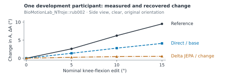
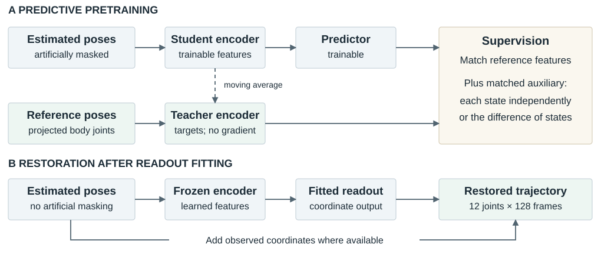
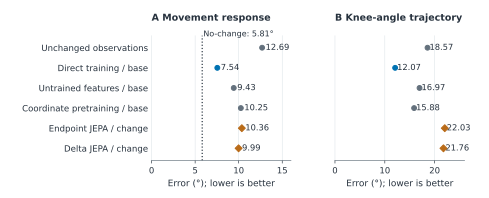
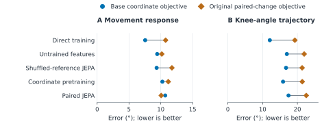
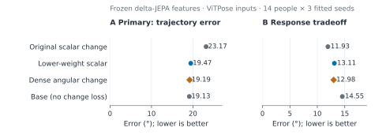

# Evaluating movement fidelity in learned pose restoration

Predictive representations, downstream supervision, and the reliability of a gait measurement

Scientific draft · 25 September 2026 · Completed synthetic development experiments

## Abstract

Movement analysis requires more than plausible joint trajectories: a reconstruction must preserve the change being measured. We evaluate this requirement using recorded human motions rendered under controlled movement and observation changes. The study tests whether joint-embedding predictive pretraining, which learns to predict reference-pose features from incomplete estimated poses, improves the recovery of bilateral knee-excursion changes. Three completed experiments train on 112 people and evaluate the same 14 development people across three seeds. Direct coordinate training reduces mean response error from 12.69° to 7.54° and knee-angle waveform error from 18.57° to 12.07°. Adding the original change-supervised objective worsens waveforms across all five core model families. Explicit feature-difference pretraining provides an uncertain 0.37° response improvement over endpoint-feature supervision (95% interval −1.11° to 1.76°). A subsequent readout experiment recovers most trajectory deterioration by reducing the scalar-loss weight; additional dense angular-change supervision has an uncertain 0.28° waveform benefit on the held-out pose estimator (−0.19° to 0.75°). Failure penalties substantially affect the response scores, and a zero-response predictor beats every learned model in the pooled response comparison. The evidence supports a controlled account of objective and measurement sensitivity, while leaving a JEPA advantage and independent movement-measurement validity unestablished.

## 1. Why pose restoration needs a measurement test

A camera-based movement system might compare a person's walking before and after rehabilitation, or look for a change across repeated observations at home. In either case, the scientific object is a movement measurement derived from estimated joint positions. Occlusion, uncertain joint locations, and left–right labeling errors can change that measurement. A restoration network can improve the visual plausibility of a pose sequence while attenuating a real change, reversing its direction, or assigning it to the wrong leg.

Consider a simple illustration. Both legs initially have a 50° knee-angle excursion, meaning a 50° spread between their near-lowest and near-highest angles. If the left excursion subsequently falls to 40° while the right stays at 50°, the right-minus-left difference changes from 0° to +10°. A reconstruction yielding +4° understates the **magnitude**; −10° reverses the **direction** and, if caused by exchanging leg identities, the **laterality**, or which anatomical side changed. These invented values explain the measurement; they are not experimental observations. Checking both individual legs and their trajectories is necessary because the same bilateral difference can arise from different movements.

This problem connects naturally to biomechanics and ambient intelligence. Delp and colleagues' OpenCap work combines video-based landmarks with biomechanical modeling to estimate movement and forces, illustrating how downstream inferences depend on the quality of movement reconstruction [1]. Ambient intelligence uses sensing embedded in everyday environments to understand human behavior; Stanford's description of Landay's Ambient Intelligence for Health work emphasizes unobtrusive, privacy-preserving monitoring [2,3]. For either setting, a useful reconstruction must support a trustworthy comparison under imperfect observation. Our experiments address one component of that requirement: preservation of a defined image-plane movement measurement. They do not evaluate joint forces, fall risk, diagnosis, or a deployed monitoring system.

**Research question.** Does learning to predict features of reference motion help a pose-restoration model recover controlled movement changes beyond direct coordinate training, and does explicitly supervising change improve that recovery without degrading the supporting trajectories?

The hypothesis is plausible but nontrivial. A learned feature vector could retain movement structure that helps correct noisy joints. Yet matching features does not guarantee that a particular angular measurement can be recovered from them. Conversely, optimizing that measurement directly constrains only a small part of the trajectory. The experiments therefore compare representations, downstream objectives, and measurement reliability together. The contribution is this controlled evaluation and its observed tradeoffs; neither a new difference-loss identity nor general JEPA superiority is claimed.

## 2. Data provenance and the observation problem

No new participants were recruited. The source is AMASS, the Archive of Motion Capture as Surface Shapes, which represents previously recorded motion-capture collections through a common body model [4]. The study selects walking candidates from the available eligible manifest, forms nonoverlapping windows, and screens projected references for usable geometry. Filename-based walking selection and geometric checks do not establish clinical status or validate every interval as natural gait.

A source window contains **128 timestamps at 25 Hz**, approximately 5.1 seconds of motion. A three-dimensional body model driven by that motion is rendered into images. Fixed image-based pose estimators—RTMPose-M, HRNet-W32, and ViTPose-base—locate joints in those images. The restoration input is a sequence of two-dimensional coordinates for 12 joints: left and right shoulders, elbows, wrists, hips, knees, and ankles, with confidence, availability, and timing information. Projecting the body-model joints into the same camera supplies the reference coordinates. These are known synthetic geometric targets, including for hidden joints; they are not independent clinical measurements.

The unmirrored motion receives a right-knee edit; physical mirroring reflects the geometry and exchanges anatomical sides. Each window is rendered in original and mirrored orientations, from oblique and side cameras, with clear or added-occlusion observations. Correct, globally exchanged, and temporarily exchanged left–right labels provide additional observation conditions. Movement edits have nominal levels 0°, 5°, 10°, and 15°. The edit composes a local rotation at the right knee with the recorded motion, gated by an ankle-height proxy and tapered to vanish at the window boundaries. It is a controlled kinematic intervention, not a simulated disease or a measured treatment effect. A nominal 10° edit need not produce a 10° change in the final projected measurement. [E1, E6]

| Population | People | Raw motions | Source windows | Role |
|---|---:|---:|---:|---|
| Admitted training cohort | 112 | 692 | 1,645 | Model fitting and training-only calibration |
| Retained development cohort | 14 | — | 155 | Reused in all three experiments |
| Planned confirmation candidates | 14 | 97 | 199 | No completed confirmation result in this evidence packet |

*Table 1. Counts distinguish source motions and windows from augmented observations. Training counts come from fit receipts; development people/window counts come from coverage exports (raw-motion count is not directly exported there). Confirmation counts describe the original cohort plan before screening, not an evaluated population. A later slim confirmation plan selected fewer windows and likewise supplies no completed confirmation result here. [E1–E3]*

Development contains 12 people from BioMotionLab_NTroje and two from KIT. Its 155 windows yield 55,800 endpoint records after expansion over conditions, including a duplicated baseline for the no-change diagnostic. Repeated renderings do not increase the number of independent people. ViTPose and the 15° intervention are excluded from restoration training and included in development evaluation. GAVD, the Gait Abnormality Video Dataset, is available to the broader project but contributes no training or evaluation data to these three runs. [E1–E3]

<figure id="fig-sample"><figcaption><strong>Figure 1. What does a recovered movement response look like?</strong> An exported example for BioMotionLab_NTroje::rub002, original physical orientation, side view, and clear observations. The curves compare reference movement changes with restored changes from direct coordinate training and delta JEPA with the original change-supervised readout. They are participant-level averages over source motions, naming conditions, estimators, and three seeds—not one pose trajectory. The participant was selected by sorted identifier rather than model performance. All repeated contrasts underlying these plotted values succeeded. Both restorers attenuate the reference response in this example; it does not establish the population effect. [E2]</figcaption></figure>

**Data-example limitation.** The transferred evidence contains aggregate measurement curves but no raw rendered frames, joint-coordinate arrays, or per-example reconstructions. Figure 1 shows actual exported study measurements. It cannot show a verified observation-to-restoration sequence, identify its pixel-level errors, or serve as a representative raw pose sample. Those artifacts remain necessary for a submission-quality qualitative reconstruction panel.

## 3. Define the measurement before evaluating the model

At each timestamp, the hip, knee, and ankle define an angle at the knee in the image plane: the angle between the knee-to-hip and knee-to-ankle vectors. A straight projected leg has an angle near 180°. For each leg, excursion is the 95th-percentile angle minus the 5th-percentile angle over the window. Using percentiles reduces dependence on individual extreme frames. The right-minus-left excursion difference is a signed summary, not a complete characterization of gait or anatomical joint range.

Here ℓ identifies the right or left leg, <i>P</i> is a percentile, and <i>a</i> and <i>b</i> are two complete movement states of the same source window. A **paired response** compares these states while holding the camera and observation condition fixed; it is not a temporal derivative or a difference between consecutive frames. Hats denote values obtained from restored coordinates. The primary response error is

A zero value means the measured change agrees with the reference. It does not imply accurate individual states: equal errors in <i>A</i>a and <i>A</i>b cancel. Each camera uses its own projected reference because changing camera angle can change a two-dimensional knee angle.

| Measurement | Inputs and operation | Scientific interpretation |
|---|---|---|
| Response error, degrees ↓ | Absolute error in Δ<i>A</i> between paired states | Does restoration preserve the magnitude and sign of the measured change? |
| Waveform error, degrees ↓ | Mean absolute knee-angle error across both legs and supported timestamps | Does the full angle-over-time trajectory remain accurate? |
| Coordinate normalized landmark error, dimensionless ↓ | Euclidean joint error divided by the frame's rendered person-box diagonal | Are the underlying positions accurate? 0.03 means 3% of that scale. |
| Nuisance error, degrees ↓ | Reference-corrected change in <i>A</i> when observation or joint naming changes at fixed movement | Does observation quality create an apparent movement change? |
| Direction accuracy, percent ↑ | Correct response sign when reference \|Δ<i>A</i>\| exceeds 1°; failures count as wrong | Is the direction recoverable when the reference change is resolvable? |

*Table 2. Complementary measurements prevent a favorable scalar score from standing in for movement fidelity. Coordinate results below use all valid synthetic joints, including those hidden in the image. [E6]*

Reference support is fixed before inspecting predictions. Angular scoring requires at least 16 frames and 80% of the window to satisfy reference geometry checks. On the admitted frames, a nonfinite predicted joint or a hip–knee or knee–ankle segment shorter than two pixels can invalidate a measurement. The declared failure costs are 180° for an eligible waveform and 720° for a response pair. These are scoring penalties, not anatomical errors. Dropping failed cases would reward an unreliable method, so results retain them and separately report their contribution.

## 4. Representations and supervision

### From observed joints to a restored trajectory

An **encoder** maps the observed coordinate sequence to numerical feature vectors, also called a latent representation. A **readout** maps these vectors back to corrected coordinates. The readout has a residual connection: it adds a predicted correction where coordinates are observed and predicts missing coordinates directly. This direct path motivates a control with a randomly initialized, fixed encoder and a trained readout. A capable readout need not demonstrate useful representation learning. A second control shuffles the reference to another accepted window from the same person, preserving the endpoint role and observation conditions. It tests whether correct motion correspondence during pretraining matters.

The shared encoder is a four-layer transformer, which uses attention to combine information across joint–time tokens. Four successive frames at one joint form a token, giving 32 temporal patches × 12 joints = 384 tokens, each with 96 feature channels. Pretraining artificially hides about half of the available tokens in connected joint regions and time intervals. This creates a prediction task distinct from the occlusions already present in the rendered input. Artificial masking is removed when training the coordinate readout and during inference. Input coordinates are centered and scaled using retained observations; the evaluation scale in Table 2 is separately defined from the rendered person box. [E1, E6]

<figure id="fig-method"><figcaption><strong>Figure 2. What is learned, and what is deployed?</strong> During predictive pretraining, a student sees incomplete estimated poses and predicts reference features supplied by a slowly updated teacher. Paired-state auxiliaries change the supervision, not the input available at deployment. A separately fitted readout converts frozen encoder features to coordinate corrections; the teacher and predictor are discarded. Direct restoration trains encoder and readout together. Arrows denote data or target flow; the dashed arrow denotes teacher parameter updates. This is an implementation schematic, not empirical evidence.</figcaption></figure>

### The JEPA hypothesis and its endpoint control

A joint-embedding predictive architecture (**JEPA**) learns by predicting another view's feature representation, rather than reconstructing its pixels [5]. In this study, a two-layer predictor attached to the student encoder predicts features from a reference-pose teacher whose parameters slowly track the student's. The inherited loss uses cross-entropy to match teacher and student distributions over feature channels; a translated-view regularizer encourages consistent, nonconstant features. This differs from the original I-JEPA regression objective. Although this design draws on self-supervised learning—constructing training targets from data rather than human class labels—it uses privileged projected reference poses. It is not learning solely from unlabeled, noisy videos. Nor do these experiments train a future-motion simulator or test world-model planning.

The response follow-up asks whether explicitly predicting the **difference between two states** helps. For a joint–time token queried in both states, let <i>e</i>a and <i>e</i>b be the student-predictor feature errors relative to detached teacher targets, after centering and temperature scaling. Centering subtracts a feature vector’s channel mean; temperatures rescale feature values before comparison. Specifically, define <i>H</i>(<i>v</i>) = <i>v</i> − (Σd<i>v</i>d)/<i>D</i> and <i>e</i>i = <i>H</i>[<i>p</i>i/0.1 − (<i>t</i>i − <i>c</i>)/0.06], where <i>p</i> is the predictor output, <i>t</i> the teacher output, and <i>c</i> its running center. The teacher and center are treated as constants when computing gradients. With <i>D</i> feature channels, the two auxiliary objectives are

Endpoint supervision penalizes each error independently. Difference supervision couples them: shared errors cancel. Both retain the original JEPA loss, use the same supported tokens, and share a training-calibrated coefficient. The identity <i>L</i>Δ = <i>L</i>E − <i>e</i>aT<i>e</i>b/<i>D</i> explains the distinction on identical tensors. The separately trained teachers subsequently evolve differently, limiting a unique mechanistic attribution. Feature errors have no angular units; useful measurement preservation must be established downstream.

Supervising change is not itself new: Sobolev training, for example, supervises derivatives alongside values [6]. Here the targets are finite differences between controlled movement states, not measured physical derivatives. Related temporal pose refinement such as SmoothNet addresses trajectory quality [7]; it was not run as a learned baseline in this study, so no superiority over it is asserted.

### Why the readout objective became a separate experiment

The base readout minimizes coordinate error. The original paired-change readout adds a squared error in Δ<i>A</i>, divided by 180° before squaring, and a short-segment geometry penalty. Once the core showed trajectory deterioration, a repair experiment compared a tenfold smaller scalar coefficient with **dense angular-change supervision**: errors are penalized at each supported timestamp and leg rather than only through the excursion summary.

The average is over the fixed common support <i>S</i>; θ is measured in degrees. The dense and low-weight scalar arms keep the coordinate term and geometry penalty identical. Their initial auxiliary gradient magnitudes are matched using 32 training-only batches, separately for each encoder and seed. A gradient indicates how changing parameters would change a loss; matching its initial scale reduces one obvious weighting confound. It does not make subsequent optimization equivalent. Dense supervision changes both temporal information and where gradients occur, so it cannot isolate percentile-gradient sparsity as the sole mechanism. [E3, E6]

## 5. Three experiments with distinct purposes

| Stage | Comparison and purpose | Completed new fitting |
|---|---|---|
| Walking core | Direct training; coordinate or JEPA pretraining; initialized and shuffled-reference encoders, each with base and paired-change objectives. Tests practical restoration benefit and whether pretraining correspondence matters. | 9 pretraining runs; 30 final neural fits |
| JEPA response | Difference-feature JEPA versus endpoint-feature JEPA; coordinate-difference control. Two readouts share each frozen encoder. Separates auxiliary pretraining from downstream supervision. | 9 pretraining runs; 18 readouts |
| Readout repair | Frozen delta and endpoint JEPA encoders receive dense or low-weight scalar supervision. Tests whether dense supervision adds benefit beyond reducing scalar weight. | 6 calibrations; 12 readouts |

*Table 3. Three seeds—17, 29, and 43—are used throughout. Later stages retain earlier predictions and reuse the development population; they are sequential development experiments, not independent replications. Six deterministic core controls include unchanged poses, temporal filters, and training-fitted joint corrections. [E1–E3]*

Pretraining and each readout use 2,000 updates; direct training uses 4,000 updates with encoder and readout jointly trainable. Batch size is 16 and the learning rate is 0.0003. Equal update totals do not equalize coordinate-supervised exposure or the opportunity to adjust the encoder. Comparisons therefore apply to this training schedule and compact residual readout, rather than to fully optimized model families. The exported records do not establish convergence.

Means first average repeated conditions within windows, windows within motions, and motions within people, then average fitted seeds. The declared primary core and response intervals use a **crossed bootstrap**: resample people and seeds separately while preserving each candidate–comparator pair. The repair instead first averages the three seed differences within each person, then uses a paired-person t interval over 14 person means. This interval is conditional on those fitted models; its crossed-bootstrap sensitivity analysis is also reported. Later changes followed inspection of earlier development outcomes. All intervals are development estimates, with secondary comparisons unadjusted for multiplicity. [E1–E4]

## 6. Results: improvement in poses does not establish preserved response

### Direct restoration helps, while the original change objective distorts trajectories

Direct coordinate training improves the noisy estimates: response error falls from **12.69° to 7.54°**, waveform error from **18.57° to 12.07°**, and coordinate normalized landmark error from **0.0718 to 0.0298**. The response reduction is 5.14° (exploratory 95% crossed interval 2.15°–8.65°). Every participant's seed-averaged waveform and coordinate error improves; response error improves for 10 of 14. These are improvements under the tested synthetic observations, not a clinical accuracy threshold. [E1, E4]

Adding the original paired-change objective increases waveform error in all five core model families, for every person's seed-averaged score and every seed's population mean. The mean increases range from 4.63° to 7.21°; coordinate error also rises in every family. Core reference-paired JEPA illustrates the tradeoff: its response error improves from 10.69° to 10.07°, while waveform error worsens from 17.45° to 22.55°. This first comparison implicates the objective package, which includes both scalar supervision and the geometry term. The later weight control is needed to refine the explanation.

<figure id="fig-results"><figcaption><strong>Figure 3. Restoration benchmarks need both response and trajectory checks.</strong> Dots are descriptive means over 14 development people and three fitted seeds, pooled across the three estimators; no error bars are implied. Base denotes coordinate-only supervision; change denotes the original scalar-change and geometry terms. Direct training adapts the whole model; the other encoders are frozen during readout fitting. The dotted line predicts zero response, has no waveform score, and outperforms all learned methods on the pooled response metric. Both plotted errors include declared failure penalties. [E1, E2]</figcaption></figure>

<figure id="fig-objective"><figcaption><strong>Figure 4. The original change objective creates a trajectory tradeoff.</strong> Each connector joins base and original change objectives within one of the five core families. Descriptive means use the same 14 people and three seeds. All five waveform means worsen; response effects vary. This first comparison tests the complete added objective package, including a geometry term. The repair experiment then examines scalar weighting while retaining that term. [E1]</figcaption></figure>

### None of the declared primary comparisons establishes the intended advantage

| Declared candidate versus comparator | Primary outcome and scope | Improvement, ° | 95% interval, ° |
|---|---|---:|---:|
| Core JEPA versus direct; both original change objective | Response; three estimators | +0.69 | [−0.64, 1.98] |
| Delta versus endpoint JEPA; both original change objective | Response; three estimators | +0.37 | [−1.11, 1.76] |
| Delta dense versus delta low-scalar readout | Waveform; ViTPose only | +0.28 | [−0.19, 0.75] |

*Table 4. Improvement is comparator error minus candidate error; positive values favor the candidate. The first two rows use crossed person/seed bootstrap intervals; the last uses the declared paired-person t interval. Outcomes and estimator populations differ, so these effects must not be pooled. Intervals spanning zero do not establish equivalence. [E1–E3]*

The core primary compares against direct training with change supervision, not the stronger direct/base model. In the follow-up, delta JEPA's 9.99° response error is only modestly below endpoint JEPA's 10.36°. The corresponding base-readout means reverse the ordering: 10.94° versus 10.23°. The secondary interaction is +1.09° (95% crossed interval −0.65° to 2.85°), leaving the apparent readout dependence uncertain. Initialized features with the original change readout reach 10.16°, further limiting a claim that the intended representation mechanism is necessary. [E2]

### A loss-weight control changes the interpretation of repair

For delta JEPA on ViTPose, waveform error falls from **23.17°** with the original scalar objective to **19.47°** with a scalar coefficient reduced from 1 to 0.1, and **19.19°** with dense supervision. The low-weight arm recovers approximately 93% of the dense arm's mean improvement over the original objective. This ratio describes mean gains; it is not a causal partition. Dense versus low scalar remains uncertain at +0.28°, as does its response improvement of +0.13° (95% interval −2.69° to 2.94°). The data therefore do not establish that the repair preserves response accuracy.

Endpoint JEPA has a favorable secondary dense-versus-low-scalar waveform improvement of 0.72° [0.39°, 1.05°]. It remains an unadjusted development result and cannot replace the delta primary. Both dense arms remain about six degrees worse than direct/base on ViTPose waveform error. Initial calibration found the original scalar gradients substantially larger than coordinate gradients, supporting the need for the low-weight control; it does not prove why the final trajectories differ. [E3, E4]

<figure id="fig-repair"><figcaption><strong>Figure 5. How much does dense supervision add beyond lower scalar weight?</strong> Means over 14 people and three seeds for delta JEPA with ViTPose observations only. Base omits the geometry penalty; the other three retain it. Dense versus low scalar is the matched primary comparison, whose waveform interval spans zero (Table 4). Reducing scalar weight recovers most of the mean waveform improvement, while response accuracy remains an explicit tradeoff. Both axes include failure costs; these numbers should not be compared directly with pooled-estimator means. [E3]</figcaption></figure>

### Failures and a zero-response baseline limit the measurement claim

| Method, pooled over estimators | Successful-output contribution, ° | Failure contribution, ° | Total response error, ° |
|---|---:|---:|---:|
| Direct coordinate/base | 5.069 | 2.475 | 7.544 |
| Delta JEPA/original change | 6.210 | 3.778 | 9.988 |
| Endpoint JEPA/original change | 6.306 | 4.055 | 10.361 |
| Always predict Δ<i>A</i> = 0 | 5.811 | 0 | 5.811 |

*Table 5. The first two numerical columns use the same population weights and sum to the total. The successful-output contribution assigns zero contribution to failures; it is not a conditional mean among successful predictions and cannot be compared alone with a complete method score. The zero-response row is a measurement baseline, not a pose-restoration method. [E2]*

Approximately **74% of delta JEPA's 0.37° mean advantage** over endpoint JEPA comes from the failure-penalty term: 0.277°, versus 0.096° from successful-output error contributions. Fewer failures would be valuable, but the overall contrast is uncertain. Because the penalty is 720°, a very small weighted failure-rate difference can matter substantially.

The constant zero-response predictor has lower pooled error than all 16 neural variants in the response export. It is therefore insufficient to claim reliable movement recovery from improvement over noisy input alone. Direct/base nevertheless contains useful response information: its direction accuracy is 66.1%, and its response error is 3.90° under clear observations versus 11.19° under occlusion; the corresponding zero-response benchmark is 5.81° in both conditions. These descriptive strata show an observation-dependent limitation. They do not establish calibration across people or performance in natural video. [E2, E4]

Feature diagnostics reinforce this caution. A linear probe—a fitted weighted combination of frozen feature coordinates—tests whether a reference response is readily decodable. It uses 333 training-population pairs with person-separated probe fitting, not unseen encoder-training participants. Delta JEPA's deployed encoder has mean squared probe error 47.87 deg² against 20.82 deg² for zero prediction, while its teacher, supplied with reference poses, reaches 6.71 deg². Favorable teacher probes cannot establish useful deployed features. Conversely, one regularized linear probe's failure does not establish that all response information is absent. [E2, E4]

## 7. Implications and limits

The strongest supported claim is that, **under this synthetic protocol, the downstream objective and measurement-failure behavior materially change the apparent value of predictive pose representations**. Direct coordinate restoration provides a useful practical baseline. The original response-supervised objective can improve a scalar response while damaging its supporting trajectories, and reducing its weight accounts for most of the mean recovery in the primary repair arm. The tested JEPA modifications have not established an incremental benefit on their declared primary outcomes.

For biomechanics, the practical lesson is to evaluate a recovered measurement alongside its underlying trajectories and side assignments before using it to compare movement conditions. For ambient intelligence, the clear-versus-occluded split motivates explicitly assessing when an observation supports a reliable measurement. A later system might withhold or qualify a measurement when geometry is unreliable, but abstention and confidence calibration were not tested here. These are possible applications of the evaluation framework, not demonstrated benefits for either research program.

Several limits constrain transfer. Fourteen repeatedly inspected development participants from two source collections provide modest independent evidence despite thousands of condition records. Two-dimensional projected angles are view-dependent and do not establish anatomical range of motion. Synthetic edits do not reproduce disease progression or natural acquisition failures. The fixed loss weights, short schedules, and compact residual readout leave optimization robustness unresolved; gradients in the six new JEPA response-pretraining fits were clipped on nearly every update, and the compact packet contains no learning curves establishing convergence. There is no completed protected-person confirmation, GAVD test, or clinical reference evaluation. [E1–E4]

A strong next test would freeze the primary comparisons and evaluate previously uninspected people, retaining failure costs, zero-response and direct-training baselines. A separate real-video study would need synchronized reference movement measurements to assess fidelity; gait-category labels alone cannot validate the recovered angular response. Before asserting a representation-learning advance, a controlled optimization study should also test whether conclusions persist across loss coefficients and training budgets. The favorable endpoint-repair secondary result can motivate that work, with its exploratory origin disclosed.

## Evidence and references

**Local evidence.** Quantitative statements are traced to this compact export and its person-level reanalysis. The 69 transferred files were checked against recorded hashes; this verifies the evidence packet, not a raw-data/checkpoint rerun. Original proposals are preserved.

- **E1.** [Walking-core configuration](../../../outputs/iclr/walking-core/config.json), [training ledger](../../../outputs/iclr/walking-core/ledger.json), [cohort plan](../../../outputs/iclr/walking-core/cohort/summary.json), [person results](../../../outputs/iclr/walking-core/evaluation/per-person.csv), [primary comparisons](../../../outputs/iclr/walking-core/evaluation/comparisons.json), and [source-motion coverage](../../../outputs/iclr/walking-core/evaluation/coverage-by-source-motion.csv).
- **E2.** [JEPA-response report](../../../outputs/iclr/jepa-response/report.md), [person results](../../../outputs/iclr/jepa-response/evaluation/per-person.csv), [response curves](../../../outputs/iclr/jepa-response/evaluation/response-curves-person.csv), [primary comparisons](../../../outputs/iclr/jepa-response/evaluation/comparisons.json), [readout comparisons](../../../outputs/iclr/jepa-response/evaluation/readout-control-comparisons.json), and [diagnostics](../../../outputs/iclr/jepa-response/diagnostics/diagnostics-summary.json).
- **E3.** [Readout-repair report](../../../outputs/iclr/readout-repair/development/evaluation/report.md), [comparison intervals](../../../outputs/iclr/readout-repair/development/evaluation/comparisons.json), [estimator-specific person results](../../../outputs/iclr/readout-repair/development/evaluation/per-person-by-extractor.csv), and [population summary](../../../outputs/iclr/readout-repair/development/evaluation/summary.json).
- **E4.** [Reproducible completed-study analysis](results/iclr-analysis-20260925/README.md), [analysis code](results/iclr-analysis-20260925/analyze.py), [verification record](results/iclr-analysis-20260925/verification.json), and [exploratory contrasts](results/iclr-analysis-20260925/exploratory-comparisons.json).
- **E5.** [Draft figure source](scripts/build_iclr_draft_figures.py) and [draft build source](scripts/build_iclr_drafts.py), including editable equations and diagram.
- **E6.** [Preparation](../../../src/gavd6_sjepa/research_directions/gait_fidelity/preparation.py), [angular evaluation](../../../src/gavd6_sjepa/research_directions/gait_fidelity/evaluation.py), [model training](../../../src/gavd6_sjepa/research_directions/gait_fidelity/training.py), [JEPA-response protocol](methods/jepa-response.md), and [readout-repair protocol](manuscript/repair-experiment-methods.md). Some protocol documents retain pre-experiment status text; completion is established from E1–E3.

**Scientific context.**

1. Uhlrich et al. (2023). [OpenCap: Human movement dynamics from smartphone videos.](https://journals.plos.org/ploscompbiol/article?id=10.1371/journal.pcbi.1011462) *PLOS Computational Biology*.
2. Haque, Milstein & Li (2020). [Illuminating the dark spaces of healthcare with ambient intelligence.](https://www.nature.com/articles/s41586-020-2669-y) *Nature*.
3. Stanford HAI (2024). [James Landay: Paving a Path for Human-Centered Computing.](https://hai.stanford.edu/news/james-landay-paving-path-human-centered-computing) Institutional description of the research context, not evidence for this study.
4. Mahmood et al. (2019). [AMASS: Archive of Motion Capture as Surface Shapes.](https://openaccess.thecvf.com/content_ICCV_2019/html/Mahmood_AMASS_Archive_of_Motion_Capture_As_Surface_Shapes_ICCV_2019_paper.html) *ICCV*.
5. Assran et al. (2023). [Self-Supervised Learning from Images with a Joint-Embedding Predictive Architecture.](https://openaccess.thecvf.com/content/CVPR2023/html/Assran_Self-Supervised_Learning_From_Images_With_a_Joint-Embedding_Predictive_Architecture_CVPR_2023_paper.html) *CVPR*.
6. Czarnecki et al. (2017). [Sobolev Training for Neural Networks.](https://proceedings.neurips.cc/paper/2017/hash/758a06618c69880a6cee5314ee42d52f-Abstract.html) *NeurIPS*.
7. Zeng et al. (2022). [SmoothNet: A Plug-and-Play Network for Refining Human Poses in Videos.](https://www.ecva.net/papers/eccv_2022/papers_ECCV/papers/136650615.pdf) *ECCV*.

