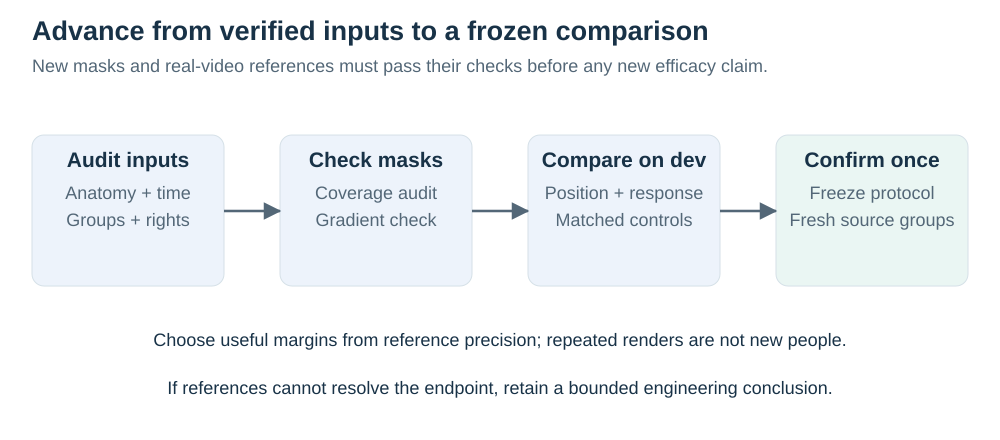

# Search coverage and evidence boundaries

Search date: 19 September 2026. Root synthesis and three independent reviewers searched primary publications, arXiv and clinical preprint servers, conference proceedings, official repositories, and original dataset documentation. This is a broad research-opportunity investigation, not a registered systematic review or proof that an idea has no prior art. Search-engine snippet dates were not used as publication dates when a paper's own record was available. Full-text facts, abstract-only facts, repository claims, and unverified access are distinguished in the supporting audits.

## Search families

| Family | Representative root queries | Important sources or conclusions |
| --- | --- | --- |
| Clinical laterality and video measurement | gait asymmetry pose estimation left right error; gait symmetry deep learning pose estimation stroke validation; laterality pose estimation | Stenum 2024; post-stroke treadmill/overground validation; identify affected-side versus measurement-sign distinction |
| Synthetic biomechanical learning | Utility of synthetic musculoskeletal gaits; Generative GaitNet; gait foundation model synthetic JEPA | Yamada 2025 is a direct precedent; projected poses and photorealistic estimator errors differ |
| New clinical synthetic systems | DeepGaitLab synthetic data asymmetry; DeepGaitLab Data Availability | July 2026 Research Square preprint already evaluates split-belt asymmetry; live data access remains a dependency |
| Representation symmetry | JEPA motion prediction symmetry equivariance; SIE; Soft Equivariance; GaitEncoder laterality | Split invariant/equivariant features and deliberately canonicalized clinical features are existing designs |
| Pathological motion synthesis | PGcGAN; LLM-conditioned pathological gait synthesis; physics gait counterfactual simulation | Recent pathology-specific generation is relevant prior art, not independently verified clinical ground truth |
| Preservation and restoration | pose estimation pathological gait oversmoothing; asymmetry pose refinement; gait counterfactual asymmetry; pose restoration pathological | Precision/smoothness refiners and clinical measurement change are established; proposed response-preservation experiment needs specific controls |
| Probabilistic inference | human pose multi-hypothesis ambiguity diffusion; pose estimation left-right uncertainty; gait selective prediction | DiffPose/D3DP and other hypothesis methods preclude a generic uncertainty-novelty claim |
| Causal learning and imaging analogy | weakly supervised causal representation paired; On hallucinations in tomographic image reconstruction | Intervention learning requires assumptions; learned priors distorting important signal has established inverse-problem precedent |
| Clinical meaning and measurement | gait measurement error asymmetry symmetry index; gait symmetry metabolic stroke symmetric | Symmetry can differ from functional improvement; agreement/repeatability and multiple bilateral quantities matter |
| Simulation alternatives | MyoSuite musculoskeletal pathological gait; gait physics counterfactual | Existing simulators can broaden conditions, but integration and policy validity are substantial dependencies |
| Local evidence | gavd5-drift laterality and reflection records; gavd6 latent-laterality theory/results; full seed-17 restoration analysis | These are separate experiments with different endpoints; current findings motivate hypotheses without proving mechanisms |

## Additional primary anchors used for inspiration

The 21 September extension inspected the local anatomical-mask notebook and its sampler, tokenization, augmentation and data-loading code, as well as the raw MS/PD/Normal videos and cached poses. A parallel primary-source search added [MAMP](https://arxiv.org/abs/2308.07092), [S-JEPA](https://www.ecva.net/papers/eccv_2024/papers_ECCV/papers/04755.pdf), [SkeletonMAE](https://arxiv.org/abs/2307.08476) and [Hui et al.](https://www.nature.com/articles/s41598-026-39330-9). These sources establish prior art for the proposed masking ingredients, rather than proof of their usefulness for gait restoration. The [masking protocol](../methods/masking.md) and [video audit](../data/local-videos.md) record the specific next tests.

*Literature and source inspection motivate hypotheses; measured restoration and independent reference evaluation determine which claims survive.*

- [On Hallucinations in Tomographic Image Reconstruction](https://arxiv.org/abs/2012.00646), Bhadra et al., arXiv 2020 / IEEE TMI 2021. The analogy is learned priors adding or removing meaningful structure. Its linear-tomography decomposition is not a theorem about nonlinear gait estimation.
- [Weakly supervised causal representation learning](https://arxiv.org/abs/2203.16437), Brehmer et al., 2022. Paired interventions motivate controlled supervision; its identifiability assumptions do not automatically hold for the proposed gait simulator.
- [Diffusion-Based 3D Human Pose Estimation with Multi-Hypothesis Aggregation](https://openaccess.thecvf.com/content/ICCV2023/papers/Shan_Diffusion-Based_3D_Human_Pose_Estimation_with_Multi-Hypothesis_Aggregation_ICCV_2023_paper.pdf), ICCV 2023. Multiple hypotheses and aggregation are established; clinical measurement risk under aggregation still requires its own evidence.
- [A Gait Foundation Model Predicts Multi-System Health Phenotypes from 3D Skeletal Motion](https://arxiv.org/abs/2603.25283), March 2026 preprint. Broad clinical phenotype representation is an active large-data direction; it does not validate our camera restoration.
- [MyoSuite](https://proceedings.mlr.press/v168/caggiano22a/caggiano22a.pdf), L4DC 2022, and [current model documentation](https://myosuite.readthedocs.io/en/latest/suite.html). The original paper focused on upper-limb tasks; current documentation includes locomotion. Do not attribute the later capabilities to the original evaluated tasks.
- [GaitGCI: Generative Counterfactual Intervention for Gait Recognition](https://arxiv.org/abs/2306.03428), 2023. Gait identity recognition and counterfactual region reasoning are different from preserving clinical change, but counterfactual gait learning is not a new phrase or ingredient.
- [CARE: Counterfactual-Based Algorithmic Recourse for Explainable Pose Correction](https://openaccess.thecvf.com/content/WACV2024/papers/Dittakavi_CARE_Counterfactual-Based_Algorithmic_Recourse_for_Explainable_Pose_Correction_WACV_2024_paper.pdf), WACV 2024. Advising a change in performed pose differs from correcting measurement error; this proposal concerns the latter.
- [Reliability of a Global Gait Symmetry Index Based on Linear Joint Displacements](https://www.mdpi.com/2076-3417/12/24/12558), 2022. A reminder to assess absolute agreement and repeatability; its healthy-cohort reliability estimates cannot supply a universal clinical threshold.
- [Reduced joint motion supersedes asymmetry in explaining increased metabolic demand during walking with mechanical restriction](https://doi.org/10.1016/j.jbiomech.2021.110621), 2021. Controlled restriction supports separating symmetry from mechanical or energetic improvement; it does not prove that any specific asymmetry is clinically harmless.

## Boundaries and unresolved questions

The search found strong precedents for nearly every proposed ingredient. The integrated design is therefore a candidate contribution, not a verified first. Further forward citation searching and expert clinical feedback would be needed before any first-of-its-kind assertion. The closest sources to compare in a paper are Yamada 2025, DeepGaitLab 2026, Stenum 2024, SIE/SER, and modern temporal/probabilistic pose methods.

Actual natural left/right error prevalence, actual loss of clinically referenced asymmetry in the current model, improvement from paired intervention training, reliable inference of assignment probabilities, patient-level benefit, data access, and training cost remain unestablished. No paper review or synthetic illustration can replace those measurements.

Search results containing generic product claims, unsourced summaries, or unrelated image-recognition tasks were not used as evidence for clinical efficacy. Publicly indexed clinical articles were not assumed to imply publicly downloadable videos. Very recent preprints are labeled and treated as prior work whose claims still need independent assessment.
