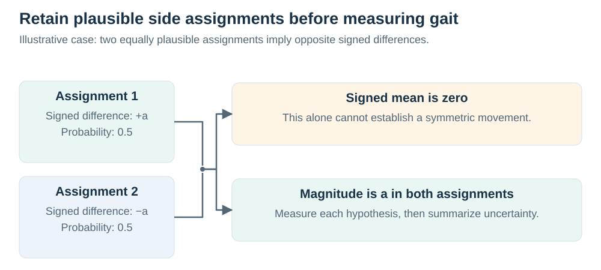

# Measuring laterality preservation and response to real movement

19 September 2026. This is a proposed measurement and experimental design, based on the retained laterality summaries, the complete seed-17 restoration diagnostics, and primary methodological and gait studies. No additional training, data collection or result analysis was performed.

**Execution update, 21 September:** the [eight-H100 plan](execution.md) assumes setup within one hour and schedules the full matched matrix across three seeds. It changes available compute and parallelism; the reference, eligibility and confirmation requirements below still apply. The numerical outcomes remain prospective.

The strongest opportunity is to show that a restoration method removes errors introduced by observation and naming while preserving a person's actual left–right differences and changes in movement. That requires separate tests for anatomical assignment, measurement preservation and uncertainty. A lower coordinate error or a more symmetric output cannot establish all three.

## What the existing evidence can motivate

The [historical laterality study](../../latent-laterality/results/validation.md) imposed coherent left/right slot exchanges on recorded AMASS motions. Its reported probability-aware model improved over correction-first learning, but a matched 50/50-probability control reproduced that improvement. Its targets were unsigned motion summaries, the result covered one development seed, and the original prediction artifacts are unavailable in this checkout. It supplies a useful control lesson rather than confirmation of an informative-probability mechanism. Its previous advancement rule kept the original test split sealed; a new study must not silently override that decision.

The [complete seed-17 restoration analysis](../../synthetic-training-v2/results/seed17-complete-analysis-20260919/README.md) shows improved positions alongside exaggerated ankle-separation amplitude and extra peaks. It also shows that framewise box scaling changes reference peak counts in 12 of 32 physical windows. These are image-plane findings from normal treadmill walking, not measurements of pathological gait asymmetry or anatomical side recovery. The results motivate testing the measurement process, but do not identify which mechanism caused the distortions.

Published gait research already demonstrates why this distinction matters. Patterson et al. compared symmetry expressions in 161 people with stroke and 81 healthy adults, finding that the equation and underlying gait variable must be specified; their recommendations concerned step length, swing time and stance time rather than an interchangeable notion of “asymmetry.” [Primary study](https://pubmed.ncbi.nlm.nih.gov/19932621/). Stenum et al. already validated video-based gait analysis across clinical populations and evaluated within-person changes associated with walking speed. Their study also found substantial viewpoint dependence for step-length asymmetry. Merely measuring a change from video would therefore be insufficient novelty. [Primary study and data-access limits](https://journals.plos.org/digitalhealth/article?id=10.1371/journal.pdig.0000467).

## Keep the physical quantity, image and joint name separate

Let `z(t)` be the anatomy-indexed physical trajectory, `C` the camera and `P(t)` a permutation of the left/right slots in the estimated track. These are different operations:

| Operation | What physically changes | Required response |
| --- | --- | --- |
| Exchange estimated left/right slots | Nothing about the person or image | Recover or explicitly represent uncertainty about the original anatomical assignment. |
| Change camera or image coordinates | The observation geometry | Transform the 2D target consistently; preserve a physical quantity only if it is measured in a justified common frame. |
| Reflect a physical motion and its anatomy | Which anatomical side performs the corresponding movement | A signed anatomical difference should change according to the declared physical transformation. |
| Alter movement, such as one limb's range or timing | The trajectory itself | Preserve the actual resulting difference, including legitimate coupled changes elsewhere. |

A camera change legitimately changes projected joint positions and can change a projected ankle statistic. Requiring identical 2D values across cameras would reward removal of real projective information. For the current 2D restorer, compare each output with the correctly projected reference and assess how its **measurement error** changes across cameras. A claim about physical step length, joint angles or foot clearance needs a separately validated measurement pipeline in the appropriate frame.

Absolute anatomical side also needs evidence. Under the old study's deliberately symmetric observation model, two globally relabeled anatomical explanations give identical inputs. Relative switch detection remains possible, but an absolute anatomical sign cannot be identified from that model alone. Test an unanchored setting separately from an anchored setting with an independently checked cue, such as a visible limb marker or audited starting frame. Give every comparator the same cue and its reliability information. An answer supplied by the synthetic generator is a training/evaluation label, not a deployable anchor. [Existing identifiability analysis](../../latent-laterality/protocol/theory.md).

## Concrete outcomes and their interpretation

### Primary engineering endpoint

The focused paper proposal selects a **signed projected knee-excursion difference** for its first controlled comparison. For each leg, form the interior 2D hip–knee–ankle angle `theta(t)` and define `q = P95(theta) − P5(theta)` over a fixed reviewed interval. The signed outcome is `A = q_right − q_left`, in image-plane degrees. A positive value means greater projected excursion on the right; it does not identify an affected limb or anatomical 3D range of motion.

Use original image geometry or an invertible shared isotropic coordinate transform. Anisotropic crop resizing changes angles. For the initial synthetic data, sample both reference and prediction on the same declared uniform physical-time grid, using linear percentile interpolation (equivalent to NumPy `quantile(..., method="linear")`). Before admitting variable-rate real measurements, freeze an explicit physical-time resampling or duration-weighted convention rather than applying unweighted percentiles to irregular samples.

Freeze interval duration, minimum projected hip–knee/knee–ankle lengths, required reference coverage and sign-resolution tolerance after reference-only development review and before comparing methods. Within each motion pair, use common reference-valid physical timestamps across both states and both legs; a changing sample set must not create an apparent response. The full two-by-two comparison and its interaction use the intersection of reference-supported timestamps across all four cells, both limbs and every method. Require sufficient support for that complete contrast; retain unsupported families in the coverage report. No prediction-dependent filtering is permitted.

A missing or degenerate predicted limb on reference-eligible support makes that measurement a prediction failure. Before ranking methods, specify either an all-attempted failure score or a joint coverage-and-conditional-error rule with explicit confidence criteria. A supported-only mean by itself cannot determine success or stand in for the population estimate. A bounded worst-case sensitivity is available because the angle lies in [0,180] degrees and the signed excursion in [−180,180], but its use and penalty must be declared before evaluation. Retain the full angular waveform, displacement and fixed full-range sensitivity analysis: percentile excursion discounts brief extremes and contains no phase or timing information.

If using this measurement in the proposed paired-change loss, validate its gradients separately from its evaluator. Exact percentiles can direct gradients to only a few samples; tied angles, nearly straight knees, vanishing segment lengths and sparse support require explicit checks. Any differentiable surrogate must be named and evaluated against the unchanged declared measurement. Apply the new term during frozen-encoder readout training for both coordinate-pretrained and JEPA arms, and identically in initialized/shuffled readout controls. Direct end-to-end arms with and without the term remain practical comparisons. Their different trainable parameter sets must not be mistaken for a pure representation-objective interaction.

The clinical initial-contact-based endpoint remains conditional on the independent event references described below. This concrete engineering choice narrows the first experiment without retroactively reclassifying the historical ankle-separation diagnostics as clinical evidence.

| Question | Proposed estimand | Evidence and failure modes to retain |
| --- | --- | --- |
| Are anatomical names correct? | Person-balanced wrong-side assignment rate, switch-boundary recall/precision and duration of incorrectly assigned intervals. | Independent side labels; ambiguity and missing-output rates; continuous and partial-joint swaps scored separately. |
| Are actual trajectories preserved? | Coordinate error and displacement error at prespecified physical time lags, with bilateral pairs named anatomically. | Visible and hidden-reference strata, original units and fixed-scale normalized values; all methods share masks and missingness penalties. |
| Is a side difference preserved? | Error in a named signed quantity `A = q_R − q_L`, and error in its magnitude `|A|`. | Report the two limb values as well as the difference. Sign accuracy is restricted by a reference-only minimum resolvable difference, with that eligible population reported. |
| Does the method erase change? | Difference between predicted and reference within-source responses to a controlled physical intervention. | The same source, nuisance realization and time interval for both intervention states; effects on other measured quantities also evaluated. |
| Is uncertainty useful? | Brier score for assignment probabilities; CRPS or a prespecified appropriate distribution score for a scalar measurement; coverage and interval width. | Compare against a constant prior and an analytic mixture baseline; give selective error versus retained coverage, including how often the model declines to name a side. |
| Does it improve measurement in patients? | Agreement and change-measurement error against independently recorded clinical references in a specified population. | Repeatability, side labels, reference uncertainty and the actual clinical measurement definition. This is not evidence that treatment outcomes improve. |

For a geometric assignment diagnostic, compare the named and exchanged-pair distances to the reference. Report a swap only when the reference separates the alternatives sufficiently to resolve the label under a frozen tolerance. Crossing or nearly coincident limbs can make distance-based assignment ambiguous even with a valid reference. Do not silently count those frames as correct, and do not use minimum-over-permutations coordinate error as the main anatomical score: that would forgive the error being studied. True swap prevalence in real videos needs independent annotation, not a detector assigning its own error labels.

Useful physical asymmetry outcomes include right-minus-left step time in seconds, step length in metres when geometry is validated, and knee range of motion in degrees when the joint convention supports it. A projected knee-angle difference or image-plane ankle-motion-energy difference is a legitimate operational 2D outcome, but must retain that label. The current horizontal ankle-separation peaks are not validated heel strikes, and their amplitude is not clinical step asymmetry.

Prefer signed differences in natural units as primary outcomes. Ratios or normalized symmetry indices can be supplementary, with a declared denominator and handling of near-zero values. Zifchock et al. demonstrated sensitivity of the conventional symmetry index to its reference value; Alves et al. developed an alternative for three-dimensional ground-reaction-force signals. Neither paper licenses treating any normalized image-coordinate statistic as a validated gait measure. [Symmetry-angle study](https://pubmed.ncbi.nlm.nih.gov/17913499/), [ground-reaction-force symmetry study](https://pubmed.ncbi.nlm.nih.gov/33195140/).

## A crossed experiment that separates preservation from nuisance removal


*The four cells support paired error contrasts. Camera-dependent references retain the observation index.*

Start with a blocked 2 × 2 design. For each source recording/person, prepare two physical states `a ∈ {0,1}` and two observation conditions `n ∈ {0,1}`. The physical pair may initially be an original motion and its fully specified physical reflection; a later dose-response experiment can use audited changes in one limb's motion. The nuisance pair changes an estimated naming path or an occlusion while keeping the underlying physical trajectory fixed. Hold camera, body, appearance and random corruption draw fixed within the relevant comparison, and randomize side and processing order so they cannot predict the answer. Blocking and factorial comparisons provide the structure for separating these effects. [NIST design guidance](https://www.itl.nist.gov/div898/handbook/pri/section3/pri332.htm).

Let `Y_an` be the reference outcome and `Ŷ_m,an` the outcome obtained from method `m`. Reference outcomes retain the nuisance index because a camera change can alter a valid projected quantity. Define `e_m,an = Ŷ_m,an − Y_an`.

**Response error under each observation condition** is:

```text
R_m(n) = (Ŷ_m,1n − Ŷ_m,0n) − (Y_1n − Y_0n).
```

It measures how much the method distorts the actual change. A model that outputs the same plausible gait for every input will fail whenever the reference response is nonzero.

**Nuisance-induced measurement error for each physical state** is:

```text
N_m(a) = (Ŷ_m,a1 − Ŷ_m,a0) − (Y_a1 − Y_a0).
```

For a naming-only intervention the second parenthesis is zero. For a projected camera-dependent outcome it is the correct reference change, preventing the test from rewarding artificial camera invariance.

**The interaction** is:

```text
I_m = (e_m,11 − e_m,01) − (e_m,10 − e_m,00)
    = R_m(1) − R_m(0).
```

It asks whether nuisance changes the method's fidelity to the physical response. Compare this interaction directly across methods instead of declaring it present because one condition is statistically significant and another is not.

Use absolute response error, absolute nuisance error and signed bias at the person level, retaining distributions and failures. Signed averages alone can hide equally large errors in opposite directions. Response error alone also permits a large constant offset, so retain level/coordinate accuracy as a guardrail. Predeclare whether the main claim requires simultaneous response improvement and nuisance/position noninferiority. A weighted scalar is acceptable only if its units, weights and acceptable tradeoffs are justified before outcomes; do not tune weights until the preferred model wins. In a joint claim requiring all conditions, each required endpoint must meet its own declared confidence-bound criterion on the same population.

A practical first core has two physical mirror states, three naming states (none, global and temporary), two occlusion states and two cameras. It yields 24 track conditions per source window. Only eight distinct RGB renderings are needed when the three naming interventions are applied after fixed pose extraction; those are controlled downstream label errors, not evidence that a pose estimator naturally makes them. Anchor availability can be crossed on those retained tracks without new rendering. Later tests should include partial-joint swaps and naturally occurring estimator errors. Every counterfactual derived from one source remains in the same person-level split.

The original/mirror pair tests sign transformation, not a range of physiological impairment. To study signal attenuation, introduce several reference-verified intervention magnitudes, including a no-change control, without selecting levels from model performance. Constrained kinematic edits must pass joint-limit, continuity, contact and rendering checks; if they lack dynamic validation, call them kinematic stress tests. An imposed knee-range edit is not a simulated stroke. Prefer independently recorded asymmetric or perturbed movements for a further source-domain test when available.

When several physical interventions and outcomes are used, report the whole response-error matrix: intervention `j` versus outcome `k`. Its off-diagonal entries are `predicted change in q_k minus actual reference change in q_k`. Do not demand zero off-diagonal physical change, because modifying one joint can legitimately affect another. This matrix can reveal that a model preserves the trained knee metric while inadvertently changing ankle excursion, trunk motion or timing.

Assess at least one prespecified outcome not used directly in the candidate's loss. Keep its calculation and reference annotation independent of model fitting, and compare the trajectories as well as summary measurements. A model should not receive credit for clamping a selected scalar to its expected value while distorting the rest of the movement. A held intervention magnitude, a second source collection and an independently annotated response provide stronger evidence against such metric-specific behavior.

## A falsifiable mechanism: uncertainty can appear as symmetry



*Both summaries use both hypotheses. The illustration is elementary probability, not an observed cause of the predecessor model's errors.*

Suppose two plausible anatomy assignments imply signed asymmetry `+a` and `−a`, with probability one half each. The expected signed value is zero, although the magnitude is `a` in both hypotheses. Averaging the two pose trajectories can also produce a trajectory with reduced limb differences. The posterior mean may be the optimal answer for a particular squared-error decision problem, but interpreting it as evidence of a physically symmetric person would be incorrect.

This is an algebraic possibility, not an established explanation of the current experiments. Test it by comparing hard correction, posterior-mean coordinates and assignment-conditioned trajectories, each followed by the same locked measurement code. Compute the measurement for each trajectory hypothesis before summarizing its distribution; a nonlinear measurement of the mean trajectory generally differs from the mean of the measurement distribution.

The decisive simple baseline is an analytic continuity/HMM assignment posterior with a two-hypothesis mixture, including the same anchor and calibration data as the learned method. Add a 50/50 mixture and an oracle-assignment diagnostic. The old uniform-control result makes this requirement particularly important. A JEPA contribution requires improvement beyond retaining two hypotheses or adding a stronger output network. Give a direct model the same coordinate, motion and intervention-response supervision, architecture where feasible and tuning allowance.

Evaluate probabilities using proper scores that penalize both wrong certainty and unnecessarily broad predictions. Report conditional calibration across anchor quality, camera, occlusion and reference-asymmetry magnitude; one aggregate reliability curve can hide failure in the population of interest. Thresholds for declining a side assignment should be selected on development/calibration people and tested at fixed retained coverage or fixed risk targets. [Proper-scoring-rule foundation](https://sites.stat.washington.edu/people/raftery/Research/PDF/Gneiting2007jasa.pdf).

An anchored setting can support signed anatomical accuracy. An unanchored setting with unresolved global symmetry can support the magnitude or a distribution over signs, together with relative-path accuracy, but must not be forced into an anatomical-sign claim. Synthetic anchor-noise rates are controlled stress conditions; real anchor reliability requires its own audit.

## Normalization can create or remove the outcome

For a coordinate divided by a time-varying scale, ordinary calculus gives:

```text
d[x(t)/s(t)]/dt = x'(t)/s(t) − x(t)s'(t)/s(t)^2.
```

Thus scale changes contribute an apparent motion term. This derivation and the existing reference-only peak changes justify comparing raw image coordinates, one fixed window scale and the historical framewise scale under a locked sensitivity analysis. Fixed window scaling avoids that extra within-window term; it does not convert perspective pixels into physical distance or eliminate camera foreshortening.

Other preprocessing choices require explicit checks. Independent unit-variance normalization of the two limbs can erase amplitude asymmetry. Aligning each limb to its own normalized phase can erase timing asymmetry. Defining the body axis from already mislabeled left/right joints can leak or propagate the assignment. Taking absolute values removes anatomical sign. Interpolating long gaps or imposing strong smoothing can create plausible symmetric motion where observations did not support it.

Use input-only quantities for model normalization. Retain physical timestamps, distinguish fixed resampling from per-limb time warping, and measure error before and after each transform on reference-only trajectories. A transformation should not be declared harmless because the final metric is insensitive to what it removes. Reference thresholds and exclusion masks must be fixed independently of method outputs.

## Real validation must match the claim

The [new local-video audit](../data/local-videos.md) makes the reference requirement concrete. The MS/PD/Normal footage is accessible, but 28 of its 41 source IDs already appear in the GAVD manifest, and existing caches omit timestamps and imputation masks. Reusing those cached poses as reference truth would confound timing, smoothing and estimator errors. For an initial real-image test, independently annotate originally visible joints and anatomical side, then impose image occlusion and re-run extraction. Evaluate against the retained original annotations, with their uncertainty and reviewed visibility. This supports controlled occlusion recovery on real footage; it cannot certify naturally hidden joints or clinical asymmetry.


*Keep the annotation and reference boundary explicit when interpreting a result.*

A first independent real benchmark can validate pose and measurement agreement on MoVi or another synchronized video/mocap source with verified identity separation, reference mapping and camera calibration. Natural healthy variation is useful for this purpose, but a healthy panel cannot establish preservation of pathological asymmetry. GAVD labels alone do not supply independent joint trajectories, side assignments or clinical change measurements. Blinded manual anatomical-side annotations on an appropriate video subset could validate swaps, while supplying no automatic ground truth for the size of gait asymmetry.

For a clinically relevant change claim, the reference must include repeated conditions or visits and the actual outcome of interest: for example independently side-labeled contact events for step time, calibrated kinematics for joint range, or force/pressure measurements for loading. Keep the physical-condition labels, source-person identity and evaluator separate from the restoration predictions. Within-person change agreement should be measured directly, with repeatability and uncertainty, rather than inferred from a high cross-sectional correlation.

Stenum et al.'s pathological gait videos are not publicly released; an accessible paper and code do not imply accessible patient data. The 2024 brace/weight dataset from Moradi et al. contains eleven healthy participants and can inform kinematic perturbation tests, but its reported sensor data do not by themselves establish a synchronized RGB benchmark or clinical disease validity. [Brace/weight data paper](https://arxiv.org/abs/2411.10485). Verify what files and reference modalities actually exist before making it the real-video plan.

A newly collected perturbation study would require appropriate ethics and clinical oversight. Randomize condition order, balance left/right perturbation when the protocol permits it, include no-change repeats, and record actual reference responses rather than assume every participant responds as instructed. This supports measurement of an induced response. A treatment-benefit claim additionally requires outcomes such as function, burden or clinical decisions under an appropriate intervention study.

Restoration should reproduce a patient's observed asymmetry rather than make the patient appear symmetric. In a primary study of nine people after stroke, improved step-length symmetry coexisted with asymmetric mechanics and no demonstrated reduction in metabolic cost. That result limits any general assumption that a numerically more symmetric gait is a better clinical outcome. [Primary biomechanics study](https://pmc.ncbi.nlm.nih.gov/articles/PMC7397591/).

## Reference uncertainty and agreement

An optical or body-model reference is a measurement with a convention, not an infallible anatomical truth. Needham et al. found systematic differences between pose-estimated and marker-derived joint centres that depended on the joint and activity. Specify the point being estimated before interpreting a calibration gain. [Primary comparison](https://www.nature.com/articles/s41598-021-00212-x). Keep independent anatomical labeling, calibration uncertainty, marker gaps, interpolation and model-derived joint centres separate in provenance.

For real measurements, show mean error, person-level absolute error and limits of agreement with uncertainty appropriate to repeated observations. Correlation alone can remain high despite systematic error. Repeated strides on one person require a repeated-measures agreement analysis; a confidence interval for the population mean does not describe the error of an individual patient's reading. [Bland and Altman's repeated-observation method](https://pubmed.ncbi.nlm.nih.gov/17613642/).

A response-gain plot can be informative: estimate how the predicted intervention contrast changes with the reference contrast, with an intercept and uncertainty around the expected slope of one. Avoid dividing each prediction by a nearly zero reference change. For exact synthetic references this is a simulation-response diagnostic. For noisy real references, ordinary regression can confuse reference error with signal attenuation. Use repeat measurements or independent calibration to estimate reference uncertainty, and use a justified errors-in-variables model or a sensitivity analysis. Deming regression assumes an error-variance ratio and independent measurement errors; shared calibration or model-derived references can violate those assumptions. Do not insert an arbitrary variance ratio or call a confidence interval containing slope one an equivalence result. [NIST errors-in-variables formulation](https://www.itl.nist.gov/div898/software/dataplot/refman1/auxillar/demfit.htm).

Choose margins in seconds, degrees or the explicitly named normalized units using repeatability and an intended use, then freeze them before testing. A minimum detectable change due to measurement noise is different from a clinically important change. No universal asymmetry percentage should be imported across diseases, endpoints and measurement systems. A statistically significant reduction smaller than reference uncertainty may remain scientifically uninformative.

## Units, uncertainty and advancement rules

Split source people before selecting windows, building mirror pairs or synthesizing body appearances. The same motion rendered onto many bodies is still repeated source motion. If body identity and motion identity are crossed, retain both factors in the manifest and either reserve both for a strong generalization test or state which remains shared. Resample source people together with all their recordings and counterfactuals; treat independent synthetic body identities as an additional factor only when they were independently sampled. Do not substitute thousands of renders for independent people.

Training seeds form a crossed factor because each fitted model is evaluated on every person. Preserve a fitted seed across its entire evaluated population in resampling, and keep paired methods together. Show individual seed results, person-conditional intervals and a crossed-factor sensitivity analysis; small seed counts limit interval calibration. New dataset collections and extractor families should receive separate results before a prespecified aggregate. [Crossed-factor bootstrap theory](https://arxiv.org/abs/1106.2125).

The old pixel-error power calculation does not determine power for intervention-response error, swap rates or clinical change. Estimate those new paired variations on a separate development set, then perform sensitivity calculations across plausible variances, seed effects and response sizes. Preregister an independent fixed test population and stopping rule. Block-based randomization tests are appropriate only for the intervention assignments actually randomized; arbitrary post-hoc sign flipping of deterministic model differences is not automatically justified. The synthetic intervention estimates a causal effect inside the specified simulator, not the effect of a physiological disease or treatment.

Choose one primary response-error comparison between the final candidate and the strongest matched direct model. If the main claim jointly requires lower response error, acceptable nuisance error and acceptable coordinate accuracy, publish the individual confidence-bound criteria and require all of them on the same prespecified population. Set a hierarchy or adjustment for additional endpoints, intervention doses, cameras and extractor tests. If a separate empirical fallback is intended, declare its contrast and rules before opening the fresh test set. Equivalence of recipes requires scientifically justified bounds and an equivalence test, not failure to reject a zero difference. [Equivalence-testing foundation](https://journals.sagepub.com/doi/10.1177/1948550617697177).

For real event outcomes, retain recall, precision, missed/extra events, unsupported references and conditional timing error. Sign accuracy should be accompanied by the fraction with a resolvable reference sign and by the model's abstention fraction. Missing outputs remain failures under the declared policy. Reference-ineligible cases must remain visible in population counts even where their quantitative endpoint cannot be scored.

The strongest falsifiable outcome would be a method that preserves the known intervention response across held nuisance conditions and independent real measurements, with a pairing-specific advantage over equally constrained direct learning and a simple analytic assignment mixture. A useful negative outcome would identify a reproducible failure boundary and show why a simpler method suffices. If the direct model or analytic mixture reproduces the gain, if the effect appears only under an implausible synthetic perturbation, or if real references cannot resolve its size, the proposed feature-learning mechanism has not been established.

## Figures needed to judge the argument

Show one synchronized 2 × 2 physical-intervention/nuisance example with the original video, side labels, input and reference/restored trajectories; the four cells must depict the same source family. Follow it with per-person intervention-response contrasts, a joint response-versus-nuisance error plot for all methods, and the full intervention/outcome response-error matrix. A separate uncertainty panel should show both anatomical hypotheses and the measurement distribution, including a case where their mean appears symmetric. Real-data figures should include repeated-measures agreement and change agreement in physical units, with the reference convention and eligible-person counts stated beside the plot.

Select ordinary examples by metadata or a frozen random sample and clearly label any outcome-selected failure case. The viewer should expose original timestamps, limb names, reference validity, camera and scale policy, missingness and model uncertainty. Neither visually pleasing motion nor an attractive symmetry index should substitute for the independent response and reference tests above.
