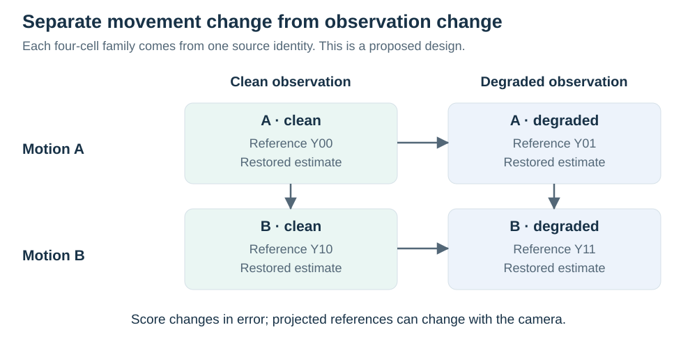

# Measuring preserved movement response

[Response protocol](jepa-response.md) · [Data specification](../data/README.md) · [Implementation](../../../../src/gavd6_sjepa/research_directions/gait_fidelity/response_evaluation.py)

A pose records joint positions at one time, and a trajectory follows those positions over time. Restoration attempts to correct noisy observed trajectories. A reference is the independently specified comparison trajectory, from which we calculate the movement that restoration should preserve. Here the model learns numerical features through JEPA, a joint-embedding predictive architecture, before a coordinate output network is trained.

**Active protocol: 23 September 2026; source results pending.** The `jepa-response-01` follow-up compares delta JEPA with independent endpoint JEPA on person-balanced `response_error`. Coordinate-delta and five retained parent methods provide additional comparisons. Evaluation uses the completed parent's development population and saved predictions. The completed CPU fixture validates calculations and artifact handling; it supplies no source-study result.

The intended finding concerns a response preserved under one synthetic observation procedure. A restoration model may reduce coordinate error while suppressing a genuine change, or preserve a difference while retaining a large common bias. The protocol therefore reads movement-response error beside level accuracy, the angular waveform, nuisance sensitivity and prediction coverage. Clinical validation, independent confirmation and additional real-video data remain prospective.

## Primary engineering endpoint

For each leg, form the interior image-plane hip–knee–ankle angle, θ(t), and compute its excursion over a fixed interval:

```text
q_left  = P95(theta_left)  − P5(theta_left)
q_right = P95(theta_right) − P5(theta_right)
A       = q_right − q_left
```

`A` is the signed projected knee-excursion difference in degrees. A positive value indicates greater projected excursion on the right. The projected angle depends on the camera and body-model joint convention; it does not identify an affected limb or anatomical three-dimensional range of motion.

The inherited source configuration samples 128 frames at 25 Hz and uses linear percentile interpolation. The angle is evaluated in original image geometry after undoing the input's fixed isotropic normalization. Anisotropic resizing would alter it. A future variable-rate dataset would need an explicit physical-time resampling or weighting rule before this percentile endpoint could be used.

Reference eligibility is independent of model predictions. Both hip–knee and knee–ankle segments must meet the saved projected-length threshold, and all required joints must have valid references. In the source defaults, the minimum segment length is two pixels, minimum support is sixteen frames and minimum coverage is 80% of the window. The child inherits the saved parent values unchanged.

The evaluator intersects support across **every row in a source family**, including both limbs, movement states and observation/camera variants, on the same physical-time grid. This is stricter than intersecting only two endpoints or four factorial cells. It prevents changing timestamps from creating an apparent response, but can remove a family from the quantitative endpoint when any part of its reference panel is poorly supported. Report those exclusions and counts.

On that fixed support, any missing, nonfinite or geometrically degenerate predicted limb makes the measurement fail. Predictions cannot choose a more favorable subset of frames. Reference-ineligible cases remain visible in coverage tables; failed predictions on eligible cases receive the scoring penalties below.

## Movement, nuisance and their interaction



A movement response compares a baseline with a registered movement state from the same source family, physical orientation, camera, naming condition, observation condition and extractor. An endpoint is a full movement sequence, not one video frame. Let Y_an be the reference outcome for movement state a and observation condition n, and Ŷ_m,an the value measured from method m. The signed error in the movement response is

```text
R_m(n) = (Ŷ_m,1n − Ŷ_m,0n) − (Y_1n − Y_0n).
```

For a successful pair, `response_error = |R_m(n)|` and `response_bias = R_m(n)`. Primary summaries exclude the explicitly named `no_change` state, which is retained in its own diagnostic table. Nonzero commanded movement levels remain in the primary population even if their projected reference change is small; the one-degree direction tolerance does not filter primary absolute error.

The actual projected reference difference defines the target. A nominal 5°, 10° or 15° movement edit is not assumed to produce the same number of degrees in `A`. The inherited 15° level is marked as held from training by its saved configuration, and condition tables separate held and seen interventions. Original and mirrored physical states remain separate from the baseline-to-movement comparison.

A nuisance changes how movement is observed without defining the movement response of interest. For nuisance sensitivity, compare each naming/occlusion condition against the correctly named, clear observation at the same movement state and camera:

```text
N_m(a) = (Ŷ_m,a1 − Ŷ_m,a0) − (Y_a1 − Y_a0).
```

A naming-only corruption leaves the reference unchanged. Camera-stratified references still matter because a camera can change the projected measurement even when the underlying movement is the same. The current nuisance table compares naming and observation conditions within cameras; it does not estimate camera invariance by forcing all projected values to match.

The interaction describes how nuisance changes response fidelity:

```text
I_m = R_m(1) − R_m(0).
```

The evaluator reports its absolute error and retains the signed value for successful complete contrasts. Neither a favorable response difference nor this interaction establishes that the full trajectory is accurate, since shared errors can cancel.

## Missing predictions and conditional diagnostics

The implemented angular penalties follow the possible ranges of the quantities. Knee excursion lies in [0, 180] degrees, `A` in [−180, 180], and a movement difference in [−360, 360]. The penalties are scoring conventions for failures, not observed physical measurements.

| Quantity | Failed reference-eligible prediction | Successful prediction |
| --- | ---: | --- |
| Each limb's excursion error | 180° | Absolute error in that limb's excursion. |
| Angular waveform error | 180° | Mean absolute error across admitted timestamps and both limbs. |
| Signed-difference error, `A_error` | 360° | Absolute error in `A`. |
| Movement `response_error` | 720° | Absolute error in the predicted baseline-to-movement difference. |
| Response-magnitude error | 360° | Absolute difference between predicted and reference response magnitudes. |
| Nuisance error | 720° | Absolute error in the nuisance-induced difference. |
| Interaction error | 1,440° | Absolute difference between the two signed response errors. |

Coordinate and displacement errors retain the independent inherited coordinate evaluator and its own missing-prediction rules. Angular penalties do not replace those rules or convert normalized coordinate error into degrees.

Response-direction accuracy is eligible only when the absolute reference change exceeds the saved tolerance, one degree in the source defaults. Every missing prediction is incorrect within that denominator. Report reference-resolvable counts, failed counts and the person-balanced accuracy; many repeated contrasts from a person do not become additional participants.

Signed response bias is conditional on successful predictions because a missing output has no signed value. Descriptive response slope and intercept are also fitted only to successful pairs and retain failed-pair counts. The plots average seeds and repeated observations into person-level points, display actual reference changes and distinguish camera, observation condition and held dose. A point may summarize only successful outputs, so its coverage must accompany it. The primary all-attempted absolute error remains the basis of the registered comparison.

No-change pairs are exported separately. They check whether the model produces a spurious response when the registered movement state is unchanged. They are distinct from the representation diagnostic that feeds the *same baseline observation* through independently sampled artificial masks.

## Person-balanced comparison and uncertainty

The primary candidate is `F-response-jepa_delta_v1-graph_time-paired_change`; the comparator is `F-response-jepa_endpoint_v1-graph_time-paired_change`. Both have the same inherited architecture, data, graph-time masking and readout objective. `coordinate_delta_v1` tests whether a corresponding difference objective also helps coordinate pretraining. The imported parent methods are plain paired JEPA, coordinate pretraining, direct end-to-end training, the initialized encoder and shuffled-reference JEPA, all with `paired_change` supervision.

For each method and seed, the evaluator averages repeated conditions within a source window, windows within the same raw motion, then raw motions within a person. Population means give equal weight to people and fitted seeds. This hierarchy prevents a longer source recording or additional render variants from dominating the estimate. Splitting a window into more examples does not increase the number of independent people.

Paired differences are comparator error minus candidate error for the same person and seed, so positive values favor delta JEPA. The crossed bootstrap estimates uncertainty by repeatedly drawing people and fitted seeds with replacement as separate factors while keeping methods paired. It uses the inherited draw count and seed, with 2,000 draws and seed 731 in the source defaults. The saved comparison includes the descriptive 95% crossed person/seed interval, an interval conditional on the fitted seeds and each seed's mean improvement. Missing person/seed support yields an explicit insufficient-support status.

Three fitted seeds provide limited precision about training variation. The development people are already part of the study's development process, and no independent confirmation population is opened here. Accordingly, these intervals are descriptive development estimates. An interval crossing zero is inconclusive rather than evidence of equivalence; a sufficiently narrow difference also needs a scientifically justified margin before an equivalence or noninferiority claim can be made. The active configuration supplies no clinical meaningful-change margin.

The evaluator reconstructs four paired delta-versus-endpoint comparisons: response error, nuisance error, `A_error` and waveform error. Only response error is primary. The other endpoints, coordinate control and parent comparisons explain practical performance and possible tradeoffs; they do not become additional primary claims after outcomes are known.

## What downstream supervision measures

The encoder maps observations to numerical feature vectors. Every new encoder is frozen, so its learned parameters stay fixed, before a fresh coordinate readout is fitted to turn those features into position corrections. That readout uses coordinate mean squared error plus the inherited paired-change term. In original image coordinates, the measurement contribution for an eligible pair is

```text
[(predicted change in A − reference change in A) / 180]²
```

It is averaged over supported pairs and accompanied by the existing short-segment penalty, which discourages degenerate predicted limbs. The coefficient is inherited unchanged. Its reference support is common across the two endpoints and both legs, while final evaluation uses the stricter complete-family intersection described above.

A gradient describes how a loss changes when a learned parameter changes. Training uses exact linear percentiles and a differentiable angle based on `atan2(abs(cross), dot)`. These percentiles send gradients through only a few order statistics. Exactly straight knees have a zero subgradient through the absolute cross product; the coordinate loss remains present, and short predicted limbs cannot remove training support. The evaluator independently computes the equivalent interior angle and marks degenerate predictions as failures. Passing these numerical checks demonstrates a defined loss, not broad clinical validity.

The same knee response is therefore supervised during every readout and measured in the primary evaluation. The follow-up asks whether a different pretrained representation makes that fixed readout more effective. Waveform, coordinate and nuisance errors help expose a gain confined to one scalar. A future claim of general gait fidelity would require additional independently justified outcomes and reference modalities.

## Inspect the artifacts and failure explanations

The [response implementation](../../../../src/gavd6_sjepa/research_directions/gait_fidelity/response_evaluation.py) writes per-window, response, nuisance, interaction, per-family and per-person tables. `response-by-condition-person.csv` preserves people in camera/naming/observation/held-intervention strata; `coverage-per-person.csv` retains eligibility and success counts. `response-comparisons.json` contains the paired intervals. `response-curves-person.csv` and `response-no-change-person.csv` retain the descriptive response points.

The saved `verify` workflow checks source and prediction identities, reconstructs the numerical tables in temporary storage and compares them with the published outputs. A successful reconstruction establishes that the saved predictions reproduce the reported statistics. It cannot independently certify references or the representativeness of the cohort.

The mechanism diagnostics have a different population and purpose. They use a fixed training-only panel, preserve joint/time positions, and fit a standardized linear ridge probe in three person-separated folds. Compare encoder, predictor and teacher features under masked and deployment inputs. A positive probe means that a specified linear decoder can recover some measured response on that panel. A failed probe cannot rule out nonlinear information, and neither result changes model admission, coefficients or stopping.

## Interpretation boundaries and later validation

| Finding | Interpretation permitted by the active design |
| --- | --- |
| Delta JEPA has lower response error than endpoint JEPA | Residual coupling helps under this inherited observation and training procedure. |
| Endpoint supervision shows a comparable, precisely estimated benefit | Extra continuous supervision may explain the gain without requiring coupling. |
| Coordinate-delta gives a comparable benefit | The remedy may extend beyond latent prediction. |
| Pretraining loss improves without downstream response | Better feature fitting has not established useful restoration. |
| Response improves while other errors worsen | The result exposes a tradeoff that must remain visible. |
| Differences are poorly resolved | The study has not established a clear comparative effect. |

The two JEPA variants have separately evolving teachers, and feature magnitude has no physical calibration. A low delta loss can arise from common residual cancellation or a teacher insensitive to movement. The fixed diagnostics constrain such explanations without proving a unique mechanism. There is no new latent re-pairing arm, so the experiment cannot establish that anatomically correct pairing uniquely causes an advantage. The larger full matrix's readout controls do not automatically resolve that pretraining question.

Graph-time masks are artificial training queries. They do not guarantee realistic image occlusion, and a deterministic restorer cannot recover hidden movement when identical supplied observations admit different physical states. Absolute anatomical side similarly needs independent evidence when relabeling symmetry leaves the input unchanged. The current geometric assignment score is a lower-limb distance diagnostic with explicit unresolved cases; it does not establish an anchored anatomical identity or a calibrated probability of switching sides.

Original/mirrored data check transformation consistency. Reference-verified edits check response to that specified manipulation. Such kinematic stress tests do not simulate a disease or treatment, and the same source movement remains repeated data regardless of rendering, body appearance or camera. Normalizing each limb independently, warping it to its own phase or taking absolute values could remove amplitude, timing or sign information; the inherited fixed observation-derived transform avoids those particular changes but does not undo camera foreshortening.

Independent real validation would need references suited to the claim. Visible-joint annotations can test controlled image occlusion on real footage, while naturally hidden joints need another reference source. Clinical step time needs side-labeled contact events, and clinical joint range needs a validated kinematic convention. Within-person change agreement must be checked directly with repeatability and reference uncertainty; correlation alone cannot establish it. GAVD labels and current local pose caches do not supply these dense paired references.

Future confirmatory work should admit fresh person/source groups, freeze the main comparison and margins before reading their outcomes, and use measurement uncertainty to justify the needed precision. A noisy reference also complicates a response-slope plot: ordinary regression can confuse reference error with model attenuation. Independent calibration or repeated measurements would be needed before an errors-in-variables analysis or clinical meaningful-change claim. The [broader literature audit](../literature/novelty.md) and [data inventory](../data/availability.md) describe those extensions; they do not enlarge the current child experiment.
