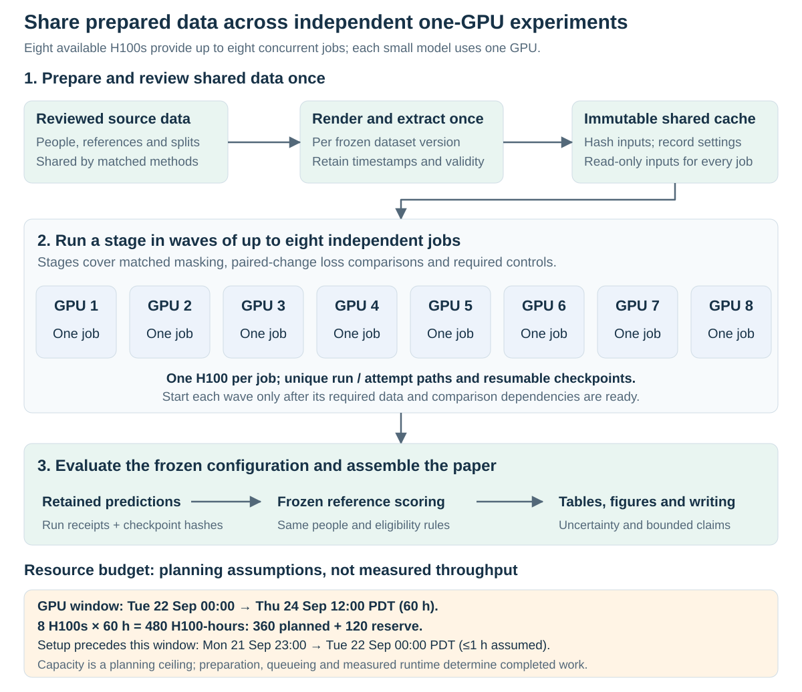

# Run the synthetic study on eight H100s

[Proposal](../README.md) · [Dataset availability](../data/availability.md) · [Measurement protocol](evaluation.md) · [Masking protocol](masking.md)

**Planning revision: 21 September 2026, Pacific time.** Assume an AI coding assistant completes the necessary experiment implementation and setup within one hour, and eight H100 GPUs are continuously available afterward. Under that premise, schedule both masking and movement-change supervision, together with their attribution controls. The previous restriction to one small new training branch no longer applies.

This document records the planning specification. The subsequent implementation is described in the [running guide](running.md), with [HAIC commands](../../../../slurm/gait-fidelity/README.md) and [notebook tutorials](../../../../notebooks/gait_fidelity/README.md). Implementing the runner does not establish source results or measured H100 throughput. The one-hour setup time remains the user's planning assumption. Data admission, correct references and successful numerical checks remain requirements for interpreting an experiment. Optional external datasets retain their [acquisition status](../data/availability.md#optional-additions-not-yet-acquired-for-this-study).

## 1. Establish the deadline and available capacity

The dated example starts setup at **23:00 on Monday, September 21**, starts GPU work at **00:00 on Tuesday, September 22**, and freezes results at **12:00 on Thursday, September 24**. All times in this plan are **America/Los_Angeles, PDT (UTC−7)**. If setup or allocation starts later, recalculate capacity from the actual start; the hours below are not a permanent balance.

| Milestone | GPU time since the planned start | Capacity with eight H100s |
| --- | ---: | ---: |
| Results freeze: September 24, 12:00 | 60 hours | **480 H100-hours** |
| Internal upload target: September 25, 18:00 | 90 hours | **720 H100-hours** |

Commit **360 H100-hours** to the planned work before the results freeze and retain **120 H100-hours** for failed attempts, slower shards and recovery. The extra 240 hours between the freeze and upload are contingency capacity, while writing and review proceed; they do not justify postponing every experiment. These allocations supersede the earlier conversational estimates of roughly 550/790 hours, which used an earlier start on September 21.

The official full-paper deadline is **September 25 at 23:59 AoE**, equivalent to **September 26 at 04:59 PDT**. This plan assumes an abstract was registered by **September 18 at 23:59 AoE**. The internal Friday upload target leaves a submission buffer. [Official dates](https://iclr.cc/Conferences/2027/CallForPapers), [author guidelines](https://iclr.cc/Conferences/2027/AuthorGuidelines).

*The diagram describes scheduling and a dated capacity example. Its lane count and budget do not measure throughput or certify experimental completion.*

## 2. Use the existing data once across all comparisons

Reuse AMASS, the body models and appearance assets already provisioned on HAIC. Prepare a versioned set of reference-verified movement pairs with camera and observation variants. Render each distinct image sequence once, extract each estimator's tracks once, and make the completed caches read-only. Joint-name perturbations applied after pose extraction reuse those tracks. They are controlled label-error tests, not observations of naturally occurring estimator mistakes.

The original/mirrored panel has eight distinct RGB variants and 24 naming/observation/camera track conditions per source window. Adding movement levels, longer intervals or new people changes that workload; record the expanded counts before estimating cost. A mirror establishes a transformation check, while graded movement-response claims need the separately validated changes in the [measurement protocol](evaluation.md).

Keep the existing 24 training people and eight inspected development people in their declared roles unless a new training roster is frozen before comparison. Identify a genuinely unused confirmation roster outside protected reservations, using reference-only coverage and a precision/resource justification. Its size is an admission decision, not a consequence of how many GPUs are available. No confirmation roster is presently certified by this document. If none is admitted, label the completed comparison as development evidence.

All compared recipes consume the same admitted data version and intended target population. Reference-supported intervals, geometry, failure handling and the primary contrast are fixed before ranking outputs. Real-video and clinical extensions can run in parallel only after their own annotations and references are available; the synthetic queue has no dependency on acquiring them.

## 3. Run the complete matched matrix

Use **seeds 17, 29 and 43** for every declared cell. A *final fit* means one recipe/seed output model; it does not mean an independent person or a distinct pretraining job. The full matrix has **34 recipe cells and 102 final fits**.

The base objective supervises the restored coordinates under one frozen recipe. Any additional motion term must be specified, implemented and shared by its matched controls: the inherited direct trainer uses coordinate MSE, so the documentation must not silently describe it as motion-supervised. Coordinate-pretrained and JEPA encoders use the same frozen-encoder readout stage. Direct training remains end to end.

| Group | Recipe cells | Cells | Three-seed fits |
| --- | --- | ---: | ---: |
| **M · Masking and change supervision** | Coordinate pretraining / paired JEPA × time blocks / uniform tokens / graph-time masks × base / base plus paired-change readout | 12 | 36 |
| **T · Mask structure controls** | The same two pretraining objectives × shuffled topology / random-joint intervals with matched durations × the same two readout objectives | 8 | 24 |
| **P · Practical benchmarks** | Direct end-to-end base; direct plus paired change; static model; verified learned temporal refiner | 4 | 12 |
| **I · Pretraining information** | Initialized encoder / shuffled-reference JEPA × base / base plus paired-change readout, compared with the graph-time recipe fixed in advance | 4 | 12 |
| **L · Additional-label and pairing controls** | Coordinate-pretrained / paired-JEPA / direct end-to-end × per-example measurement supervision / valid re-paired-change supervision, with graph-time queries for pretrained arms | 6 | 18 |
| **Total** | Distinct final recipe cells; no duplicate seed entries | **34** | **102** |

Unchanged tracks, training-only joint offsets/affine calibration and fixed temporal filters are additional deterministic baselines. Fit or tune them on permitted training/development data, then evaluate them on the same population. Repeating their predictions across neural seeds does not create independent calibration fits. Specify the temporal refiner and its adaptation before results; a SmoothNet-style implementation is labelled as an adaptation. Static/refiner base-only comparisons do not by themselves isolate temporal context or establish perfectly matched task supervision.

The graph policy in groups I and L is fixed before outcomes. Those controls support claims for that policy; do not generalize an initialization or alignment finding to every mask without the corresponding cells. Run the topology and duration controls as planned even if the initial graph result is weak. The experiment should explain both benefits and failures.

An initialized encoder has no pretraining or graph-query loss; graph-time names its prespecified comparator. Only the shuffled-reference JEPA control actually pretrains with that mask. All frozen-readout arms receive the same deployment-style observed inputs, without an additional artificial pretraining mask at readout. Introducing one only in the initialized arm would confound the comparison.

Every loss regime receives both members of the same marginal endpoint batch. Coordinate supervision applies to both; per-example measurement supervision also applies to both. Paired supervision must not gain an unreported doubling of input exposure. For the re-pairing control, use a nonidentity rearrangement across training source families, preserving endpoint roles and applicable movement-level, camera and observation strata. Recompute each reference difference from its new endpoints. Match endpoint frequency and the reference-change distribution using a frozen reference-only rule and declared tolerance, and report residual mismatch. If that tolerance cannot be met, retain the control's outcomes but narrow the pairing-specific claim because the mismatch remains a confound. Keeping the old difference after changing its endpoints would introduce false labels. This control tests pair structure, not a biological causal mechanism.

Freeze loss coefficients, tuning allowances, training updates and the primary comparison before confirmation. The inherited 2,000 pretraining/2,000 readout updates and 4,000 direct end-to-end updates are a starting budget to benchmark, not a guarantee of convergence on a larger dataset. Report sample exposure and compute as well as update counts. Extra GPU capacity is not a reason to continue adding seeds until significance appears.

### Reuse identical pretraining without confusing the counts

Identical upstream data, objective, masks, seed and code hashes allow the same frozen encoder to feed several readout objectives. Initialize each readout and optimizer separately under its declared seed stream. This yields **33 pretraining phases, 84 readout phases and 18 end-to-end fits: 135 optimization jobs/phases producing 102 final models**. Initialized encoders need no pretraining. A coordinator may combine compatible phases in an allocation, but must retain their dependencies and accounting.

These phase counts describe the final matrix only. Profiling, smoke tests, tuning trials and retries are additional work charged to the same global budget, including any GPU allocation consumed during setup. Nothing is made free by calling it a benchmark. GPU work before the dated start must reduce the study allowance or be recorded as a separately declared allocation.

The [machine-readable plan](../records/compute-plan-20260921.json) enumerates all final fits and shared pretraining dependencies. It is a planning manifest, not a runnable Slurm launcher or a set of trained checkpoints. Historical models are reused only when their complete training/data specification matches the new comparison; the existing three-seed result is background evidence, not automatic completion of these 102 cells.

## 4. Measure cost before filling the queue

Benchmark a complete preparation shard and representative pretraining, readout and end-to-end jobs on the actual H100 allocation. Include image generation, estimator extraction, loading, checkpoint writes and prediction export. Record CPU/storage requirements as well as GPU allocation so that preparation can feed the eight workers. Under the user's premise, the setup produces these checks and a working coordinator within one hour; the resulting timings still have to be measured.

The old seed-29 and seed-43 direct-plus-JEPA receipts total **7.69 and 9.21 minutes**, respectively, spanning all eight learned recipes per seed. They exclude new preparation and do not identify an H100 benchmark. Their environment records have `cuda_verified: false`; this absence of runtime certification must not be promoted to a verified hardware measurement. Cumulative GPU fields in saved configurations are not per-fit timing estimates. Use these receipts only as evidence that the prior compact recipe was inexpensive. [Retained run evidence](../../../../outputs/full-runs/).

| Planning allowance | H100-hours | Interpretation |
| --- | ---: | --- |
| Shared rendering and pose extraction | 90 | Ceiling to test against measured source-shard costs |
| All model training phases | 210 | Includes all 102 final outputs; shared pretraining charged once |
| Held-out prediction and numerical evaluation | 40 | Includes every declared camera, condition and extractor |
| Reconstruction checks and planned replay | 20 | Independent recomputation and selected fresh inference |
| **Planned work** | **360** | Allocations, not runtime forecasts |
| **Recovery reserve** | **120** | Failures, retries, slower shards and scheduling slack |

A simple sensitivity calculation treats all 102 outputs as independent complete recipes, without sharing pretraining:

| Mean complete recipe time on one H100 | Training cost | Ideal eight-GPU throughput lower bound |
| --- | ---: | ---: |
| 0.5 hour | 51 GPU-hours | 6.375 hours |
| 2 hours | 204 GPU-hours | 25.5 hours |
| 4 hours | 408 GPU-hours | 51 hours |

These scenarios omit preparation, evaluation and dependency idle time. At two hours per recipe, training fits its 210-hour allowance; at four hours it does not. With shared encoders, replace that approximation by `33 × measured_pretraining_time + 84 × measured_readout_time + 18 × measured_end_to_end_time`, or preferably sum measurements for each recipe type.

Check both total allocated work and the longest dependency path. Elapsed completion time is at least the maximum of total GPU-hours divided by eight, the serial prerequisite path and the longest indivisible job. Meeting that lower bound is not a guaranteed schedule. An early data shard can support a smoke run; a final fit may start only when its frozen training/development bundle is complete. Never let arrival order silently change its training population.

## 5. Give each worker a separate run and preserve global accounting

Schedule up to eight one-GPU jobs across preparation, pretraining, readout and prediction; keep the **combined** concurrency at eight. Independent jobs normally suit these small pose models better as the initial schedule than assigning eight GPUs to one fit. A Slurm array concurrency limit such as `%8` applies only to that array, so multiple arrays need a shared coordinator or explicit combined allocation limit. [Slurm array documentation](https://slurm.schedmd.com/job_array.html).

Dispatch each ready job as a GPU becomes free. The diagram's waves illustrate bounded concurrency, rather than requiring every job in a wave to finish before the next can start.

The existing synthetic-training-v2 launcher has sequential loops, run-level resource checks and a same-root `gpu-budget` lock. Its current configuration also limits updates and per-run GPU allowance. The one-hour setup must therefore supply a study coordinator and any validated configuration extension; launching eight copies against the same old run directory is not this plan. Preserve the old run receipts and budgets. Give every new recipe/seed attempt a unique directory and its own checkpoint state, then reconcile costs across the whole study.

The coordinator needs only a small explicit contract: data and code hashes; recipe/seed/phase; upstream checkpoint hash; requested GPU count; Slurm job and attempt IDs; timestamps/status; predicted remaining work; and actual allocated cost. A failed attempt remains in the ledger even when a later attempt succeeds.

Reserve each active job's maximum allocated cost atomically before submission. Completed allocation cost plus all active reservations plus the proposed job cap must remain within the current study allowance. Reconcile reservations against scheduler accounting as jobs finish; eight workers must not independently spend the same apparent remaining budget.

Charge allocated GPU count multiplied by allocation elapsed time, including idle GPU allocation, failures and retries. Reconcile scheduler allocation rows without also adding `.batch`/`.extern` rows or nested phase receipts for the same time. Concurrent jobs consume additive GPU-hours, while queue wait consumes deadline time. The dated capacity calculation assumes all eight GPUs remain available. [Slurm accounting fields](https://slurm.schedmd.com/sacct.html).

If the measured plan exceeds the budget, first remove optional budget/model-size sweeps and unadmitted external extensions. Preserve all 34 recipe cells and all three seeds. The predeclared fallback halves the common update schedule to 1,000 pretraining/1,000 readout updates and 2,000 direct end-to-end updates, with the corresponding shared budget for the other recipes. Choose this schedule from timing/data feasibility before ranking model results, then run the whole matrix at that schedule. It is a lower-budget study and must be reported as such. If it still cannot finish within the measured dependency schedule, revise the execution scope before final fitting; do not retain only favorable seeds or omit a losing control.

The default seed set stays fixed. Five seeds are an optional expansion only if declared before confirmation outcomes and applied to every recipe: **170 final fits and 225 optimization phases**. Select the primary candidate/control contrast and a hierarchy for the secondary comparisons on development. Evaluating many confirmation outputs does not permit choosing the best test-set arm afterward.

## 6. Run experiments and write in parallel

| Pacific time | Compute and evidence milestone | Paper work |
| --- | --- | --- |
| **Sep 21, 23:00–Sep 22, 00:00** | Assumed setup: implement the coordinator and scientific additions, run numerical checks, freeze the fit manifest and record actual start. | Create the ICLR manuscript and claim/evidence table. |
| **Sep 22, 00:00–06:00** | Benchmark preparation and each training phase. Admit data/references; forecast the full matrix and its dependency path. | Draft data, reference conventions and evaluation. |
| **Sep 22, 06:00–24:00** | Fill the shared caches and run ready pretraining/readout jobs. Both masking and change supervision are scheduled; correctness dependencies determine order. | Complete motivation, related work and methods; prepare fixed table/figure templates. |
| **Sep 23, all day** | Complete final fits and their controls. Freeze any development decisions before opening confirmation predictions. Export every seed, condition and failure record. | Write results from verified tables; keep unsupported or inconclusive findings explicit. |
| **Sep 24, 00:00–12:00** | Finish declared evaluation, numerical reconstruction and recovery. **Freeze results at noon.** | Complete the full draft and captions. |
| **Sep 24, 12:00–Sep 25, 12:00** | Reproduce selected predictions and resolve documented errors; avoid a new outcome-selected research branch. | Independent scientific/numerical review, revisions, appendix and anonymous artifacts; upload a complete draft by Friday noon. |
| **Sep 25, 12:00–18:00** | Preserve final data/configuration/model manifests and accounting. | Check the uploaded PDF and submission fields; finalize by 18:00. |

Use metadata-selected ordinary examples as well as failures. The central figures should show the source/reference/restored trajectory alignment, the coordinate-versus-movement tradeoff, response error across reference-verified changes, and the matched controls with person-level uncertainty. The existing eight development people and three seeds remain different statistical units. Fit counts and render variants are never substituted for participant counts.

Keep the main text within nine pages; references and appendices are separate. Include the required AI-use statement describing the actual research and writing assistance. The scientific conclusion follows the completed evidence, including negative results. Compute availability changes the experiment scope, not the standard of support for a clinical or mechanistic claim. [Submission requirements](https://iclr.cc/Conferences/2027/AuthorGuidelines).
