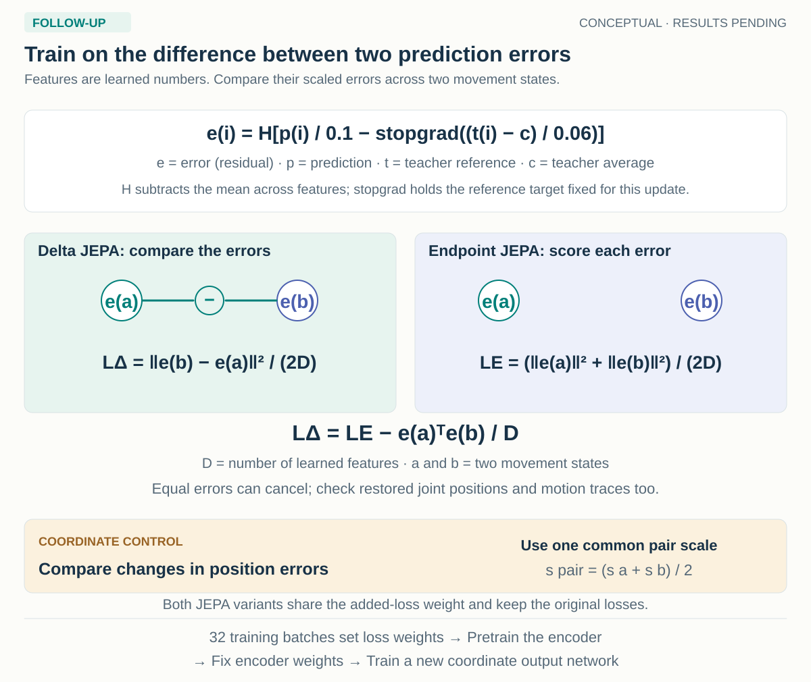

# JEPA response coupling

**24 September amendment:** the [core-informed extension](core-to-followup-20260924.md)
adds matched coordinate-only readouts, retains this primary comparison and uses a
new run with the September 25, 8 AM Pacific cutoff. The original protocol follows.

**Implemented follow-up · 23 September 2026 · CPU validation complete; source results pending**

[HAIC execution](../../../../slurm/gait-fidelity/JEPA_RESPONSE.md) · [Worked notebook](../../../../notebooks/gait_fidelity/experiments/F_jepa_response.ipynb) · [Implementation review](../reviews/jepa-response-20260923.md) · [Evaluation contract](evaluation.md)

## Motivation

A pose records joint positions at one time, and a trajectory follows those positions over time. A restoration model corrects errors in an observed trajectory using a clean reference for training and evaluation. It should preserve a genuine change in how the two legs move as it reduces tracking error.

JEPA means joint-embedding predictive architecture. Here an encoder converts observed trajectories into feature vectors, which are learned lists of numbers rather than joint coordinates. A predictor transforms those vectors toward target features extracted from the clean reference by a teacher network. During this initial learning stage, called pretraining, the existing model predicts the two movement states separately.

The encoder is then frozen: its learned parameters stop changing. A fresh coordinate output network, called a readout, learns corrections with explicit supervision of the measured movement change. The unresolved question is whether pretraining retained information that this readout can use.

The follow-up tests whether coupling prediction errors across movement states during pretraining makes that response more accessible to the fixed downstream procedure. It changes the loss without adding model parameters, conditioning inputs or deployment steps. Difference and derivative supervision have established precedents, discussed in the [literature audit](../literature/novelty.md); a useful contribution here depends on the controlled findings rather than the existence of a difference loss.



An endpoint is a complete sequence from one movement state. The teacher extracts learned vectors from the clean reference and follows the student encoder through an exponential moving average, so its parameters move gradually toward the student parameters at each update. It supplies privileged training targets, while error reduction directly updates only the student branch; the teacher changes through its moving-average rule. The deployment model uses its encoder and coordinate readout on a single observed sequence, without the teacher, partner sequence, reference or movement-state label.

## Data and comparison

The separate `jepa-response-01` experiment reads the completed `walking-core-01` bundle. It preserves the parent's AMASS population, reference geometry, physical-time grid, model, masking, optimizer, sampling and split roles. Parent binding records original receipts and the training-admission amendment, including any singleton-person exclusion. Counts come from the retained manifest rather than historical pilot sizes.

The experiment adds no new rendering, pose extraction, GAVD processing or data admission. GAVD supplies no paired movement references to this follow-up and does not enter its training or evaluation. Confirmation arrays remain unopened. Reusing the parent bundle also preserves its existing reference-review limitations.

The training objective is a loss, a number that penalizes prediction error. An auxiliary loss adds a specific constraint to the existing base loss. A residual is a prediction minus its target. The three variants differ in how they use those residuals:

| New variant | Auxiliary pretraining objective | Readout after pretraining |
| --- | --- | --- |
| `jepa_delta_v1` | Squared difference of centered student–teacher residuals. | Fresh coordinate readout, frozen encoder, existing `paired_change` objective. |
| `jepa_endpoint_v1` | Squared centered residuals at each endpoint separately. | The same readout procedure and seed-specific initialization. |
| `coordinate_delta_v1` | Squared difference of coordinate residuals in a common pair scale. | The same readout procedure and seed-specific initialization. |

Each variant uses seeds 17, 29 and 43 to set reproducible training randomness, giving **nine models through eighteen optimization phases**: nine pretraining phases and nine readouts. Their update counts inherit the parent's actual profile decision, including its registered half schedule if that was selected. The child cannot reduce the schedule again or drop a control to fit the deadline.

Original core predictions supply plain paired JEPA, coordinate pretraining, direct end-to-end training, initialized encoders and shuffled-reference JEPA, all with their original `paired_change` output objective across the three seeds. The primary contrast is delta JEPA versus endpoint JEPA. The direct model remains a practical comparison whose trainable parameters differ from those of a frozen-encoder readout.

## What the losses compute

A token groups four consecutive frames of one joint, and a query marks a token selected for prediction. Let $p_i$ be the predictor output at a queried joint/time token, $t_i$ its teacher features, $c$ the existing running average of teacher outputs, called the teacher center, and $D$ the number of entries in each feature vector. Define $H(v)=v-\operatorname{mean}_{channels}(v)$. For endpoint $i\in\{a,b\}$,

$$
e_i=H\left[p_i/\tau_s-\operatorname{stopgrad}\{(t_i-c)/\tau_t\}\right].
$$

The temperatures are fixed numerical scales applied to feature scores; the saved defaults are $\tau_s=0.1$ and $\tau_t=0.06$. The child inherits the parent's settings. `stopgrad` treats both teacher features and center as constants when calculating parameter updates. The base loss turns feature scores into probabilities using softmax, so adding a constant to every channel, or vector entry, leaves those probabilities unchanged. Subtracting the channel mean removes this unidentifiable common offset. It neither normalizes the endpoint difference to unit length nor gives feature distances physical units.

The two JEPA token losses are

$$
L_\Delta=\frac{\|e_b-e_a\|^2}{2D},\qquad
L_E=\frac{\|e_a\|^2+\|e_b\|^2}{2D}.
$$

On the same tensors and support, their difference is

$$
L_\Delta=L_E-\frac{e_a^\top e_b}{D}.
$$

This identity isolates the coupling term in the loss definition. The two trained variants can follow different optimization paths and develop different moving-average teachers; they are not constrained to share targets throughout training. A shared nonzero residual can cancel in the delta loss. The common teacher center also cancels in its endpoint difference, while it remains part of independent endpoint regression. Coordinate and level errors are therefore essential companions to response error.

Both JEPA variants retain the original centered cross-entropy and VICReg losses. Cross-entropy penalizes differences between teacher and predicted feature probabilities. VICReg is the existing variance/covariance regularizer: it encourages compatible student features across translated views while discouraging constant or redundant features. Their weights, augmentations and teacher update rule remain inherited. Pretraining minimizes $L_{base}+\lambda_J L_{aux}$, with the same $\lambda_J$ for the two auxiliaries.

For coordinate pretraining, each endpoint has its own observation-derived isotropic scale $s_i$. Define

$$
s_{ab}=(s_a+s_b)/2,\qquad
r_i=\frac{s_i}{s_{ab}}(\hat{x}^{norm}_i-y^{norm}_i).
$$

The coordinate auxiliary is $\|r_b-r_a\|^2/4$ per frame, averaged over the token's four frames. The squared norm sums the two coordinate components; the factor four accounts for two endpoints and two components, followed by a separate frame average. Since prediction and target at an endpoint use the same origin, origins cancel from their residual. Multiplying by $s_i/s_{ab}$ expresses both pixel errors in one common pair scale. Directly subtracting independently normalized errors would mix units.

This common scale is used only in the loss. It adds no paired deployment input, and the coordinate model retains its original coordinate base loss. Its coefficient is calibrated separately because latent and coordinate errors have different units.

### Queries, support and reduction

A token contains four consecutive frames of one body12 joint. Queries include artificial graph-time hiding and any naturally missing observation frame in that token. Each auxiliary uses only positions queried at **both endpoints**, with **all four reference frames valid at both endpoints**. Endpoint regression uses this same paired intersection rather than receiving extra individually valid targets.

Average supported token losses within a pair, then supported pairs equally. Pairs with no auxiliary support retain their original base-loss support and are recorded separately. An auxiliary with no supported pair contributes zero; a base training batch with no support or a nonfinite loss fails. Invalid reference coordinates are replaced before teacher projection and masked before coordinate-target arithmetic, preventing excluded numeric values from contaminating the gradient.

The mask and normalization contract is detailed in [masking.md](masking.md). In particular, each endpoint is normalized from its own retained observation context. This prevents hidden coordinates or clean references from determining the student's transform, but masking can still change that transform and hence the features being compared.

### The fixed downstream objective

After pretraining, the encoder is fixed and a separately initialized coordinate readout is trained without artificial masks. The existing `paired_change` readout loss retains coordinate mean squared error and adds squared error in the reference knee response divided by $180^2$, together with its short-segment penalty. The same inherited coefficient applies to all child readouts. Pairing information therefore enters both pretraining auxiliaries and the common supervised readout; the new comparison asks whether changing pretraining improves that fixed final procedure.

## Coefficients and optimization

Calibration sets the auxiliary-loss coefficients before fitting by a fixed training-only rule. A gradient is the derivative of a loss with respect to the learned parameters; its norm measures the combined size of those derivatives. Calibration uses **32 fixed training batches at seed-17 initialization**, with no optimizer steps or development selection. For each loss component $k$, let

$$
G_k=\sum_{b=1}^{32}\|\nabla_{\theta}L_k^{(b)}\|_2^2,
$$

where $\theta$ contains all trainable parameters for that pretraining arm and unused gradients contribute zero. The JEPA set includes encoder, predictor and projector; the coordinate set includes encoder and coordinate head. The coordinate head starts at zero, so calibrating on encoder gradients alone would give an unusable initial signal.

$$
\lambda_J=0.1\sqrt{G_{J,base}/\max(G_\Delta,G_E)},\qquad
\lambda_C=0.1\sqrt{G_{C,base}/G_{C,\Delta}}.
$$

The JEPA base includes its inherited regularizer. Using the larger of the two JEPA auxiliary gradient energies makes their shared coefficient respect the same measured initial scale. Coordinate calibration uses its own base and auxiliary energies. Every coefficient is shared across all three seeds, and zero or nonfinite calibration energies stop the calculation.

The calibration receipt binds values to data identity, code, formulas, support, precision, fixed batch/mask receipts and saved settings. Random-generator state is restored, and final fits initialize afresh. These coefficients set a scale at initialization, not a bound on influence later in optimization. Histories retain base and unweighted auxiliary gradient statistics at the first, final and configured logging updates, together with total gradient norm and clipping indicators. The teacher remains detached, and frozen-encoder readouts are checked for parameter or gradient changes.

## Mechanism diagnostics

The diagnostic panel selects at most three source families per training person using fixed hash ordering, then one hash-selected nonzero, non-held movement pair within each family. It uses no feature score or model outcome to choose examples. If a selected reference pair lacks the required support, the exporter fails rather than choosing a favorable replacement.

Encoder, predictor and teacher vectors retain joint/time positions. A ridge probe is a linear regression with a penalty on its coefficients. Three person-separated folds fit the reference change in `A` from endpoint feature differences, with the fixed objective

```text
mean((Xw + b − reference_change)²) + 0.01 × ||w||².
```

Each fold learns feature standardization, subtracting a mean and dividing by a scale, only from its training people. Report person-balanced error against a zero-change baseline. The probe is a training-person feasibility diagnostic; it does not tune a representation, coefficient or readout and cannot stop fitting. Failure of this linear probe does not prove the absence of nonlinear information.

Compare masked inputs with ordinary deployment inputs. A separate no-change diagnostic processes identical baseline observations under independently drawn masks and normalization. Student features can change because both visible context and its normalization change. The teacher's clean reference and validity are fixed in this comparison, so its variation isolates normalization. Inspect across-example variance at fixed endpoint/joint/time positions, endpoint differences, auxiliary support and optimization traces rather than pooling positional variation into a collapse score.

The new predictive cross-entropy, teacher entropy and KL divergence use identical teacher probabilities, query-valid reductions and center timing before updates. KL measures the discrepancy between teacher and predicted distributions. Historical cross-entropy minus entropy logs used different reductions or timing and are not used as a KL estimate. A small KL still does not show that the teacher encodes the movement of interest.

## Evaluation and claims

The primary contrast is **delta JEPA versus endpoint JEPA on person-balanced `response_error`**. Its endpoint is the reference-verified change in right-minus-left projected knee excursion, in image-plane degrees. Eligibility uses common reference-supported timestamps across the complete source family. Primary response summaries exclude the explicitly named no-change state; actual small reference responses within the remaining movement conditions stay included.

Aggregate repeated conditions within source windows, windows within raw motions and motions within people. Pair methods by person and seed, then apply the inherited crossed person/seed bootstrap, which repeatedly resamples people and fitted seeds as separate factors while keeping the compared methods together. Control-minus-candidate error is positive when delta JEPA is better. Three seeds limit precision about training variability, and these are descriptive development intervals rather than a confirmation test.

Failed predictions on reference-eligible responses receive the inherited **720°** absolute-error penalty. This scoring bound prevents failures from disappearing from the mean; it is not a measured response. Direction accuracy uses absolute reference changes greater than the saved one-degree tolerance and counts failed predictions as incorrect. Signed response bias and fitted response slope/intercept are conditional on successful outputs, with coverage retained beside them.

Show each limb's excursion, coordinate error and angular waveform error, which compares the angle at every admitted time. Also report nuisance sensitivity, the error caused by changing observation conditions, held-intervention results and failure counts with the primary comparison. Response plots use actual reference changes and separate camera and observation conditions. Their conditional points cannot replace the all-attempted primary score. The [evaluation contract](evaluation.md) gives exact reductions, penalties and artifact names.

| Finding | Supported interpretation |
| --- | --- |
| Delta improves over endpoint regression | Residual coupling helps under this observation and training procedure. |
| Endpoint regression shows a comparable, precisely estimated gain | Additional continuous supervision may explain the benefit. |
| Coordinate differences show a comparable benefit | The remedy need not be specific to latent prediction. |
| Latent fit improves without restored response | Better pretraining fit has not established useful restoration. |
| Response improves while other errors worsen | A measured tradeoff requires explicit reporting. |
| Intervals remain wide or cross zero | The comparison is uncertain; equivalence has not been established. |

There is no latent re-pairing arm in this budget. A gain therefore cannot establish that anatomically correct pairing uniquely causes it. Low delta loss also permits an insensitive teacher or common endpoint errors. Clinical validity, real-video transfer, a universal masking advantage and a general failure of all JEPA formulations remain beyond the supplied evidence.

## Execution and reproducibility

A separate immutable release and child directory preserve the completed core. Eighteen optimization phases reserve 36 H100-hours, calibration/profiling two, representation diagnostics four and recovery six, totaling **48 additional H100-hours**. Admission uses measured cost at the parent's actual update counts, with no reduced child schedule or dropped controls.

The results cutoff is **September 24, 2026, at 18:00 Pacific** (`2026-09-25T01:00:00Z`), with two hours reserved for queue uncertainty. A profile refusal can retain parent-only diagnostics and the resource decision. Unfinished work is recorded as incomplete; failed allocations remain charged, and no experiment stops because an interim comparison is unfavorable. The [execution contract](execution.md) details dependency and deadline handling.

Mathematical tests, a fresh parent-to-child CPU fixture, numerical reconstruction and the [dated independent review](../reviews/jepa-response-20260923.md) validate software behavior. Actual H100 compatibility, memory use and runtime still require the HAIC profile. A successful local fixture or review supplies no scientific evidence that the new objectives improve source movement response.
