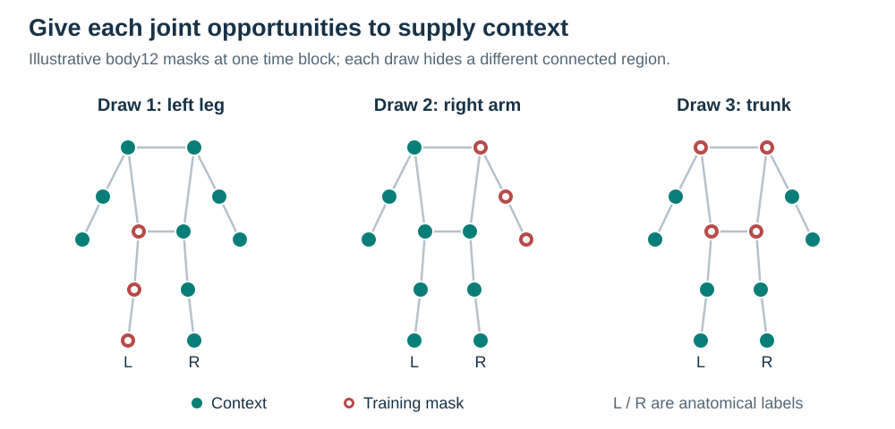
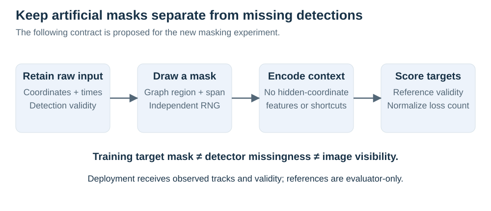
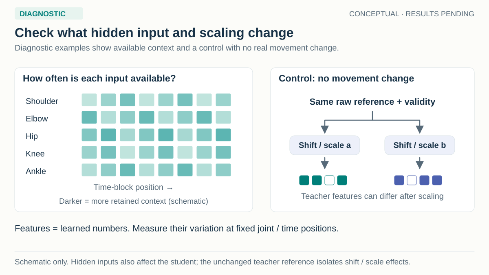

# Masking and the permitted-input contract

[Response protocol](jepa-response.md) · [Measurement protocol](evaluation.md) · [Sampler implementation](../../../../src/gavd6_sjepa/research_directions/gait_fidelity/masking.py)

**Active protocol: 23 September 2026.** The movement-response follow-up inherits the completed parent's `graph_time` sampler. All three new variants use that same policy, with seeds 17, 29 and 43. The active comparison changes pretraining supervision; it does not test a new anatomical mask. Earlier sampler audits and the broader multi-policy experiment are retained below as context.

A pose records joint coordinates, and a trajectory follows them over time. A mask marks observations that are artificially hidden during initial training, so the model must predict from the remaining context. A graph-time mask hides a sampled connected joint region over an interval. “Graph” refers to joints and their anatomical connections, while “time” refers to the consecutive frame blocks that form tokens. This mask does not require a graph neural network. Across presentations, the same joint can supply visible context or become a query whose value must be predicted.



*The mask drawings explain the policy. They are not trained outputs or a simulation of clinical impairment.*

## The implemented body12 sampler

Body12 contains left/right shoulders, elbows, wrists, hips, knees and ankles. A token represents one joint over four frames, ordered by time patch then joint. With the inherited 128-frame source window, there are 32 temporal patches and 384 joint/time tokens per example.

The sampler regards a token as available when at least one of its four observation frames is present. It samples artificial hiding from those available tokens, independently of reference validity. At the inherited nominal 50% fraction, the per-example hiding budget is

```text
min(max(1, round(available_tokens × fraction)), available_tokens − 1)
```

when more than one token is available. One or zero available tokens receive no additional hiding. This preserves at least one available context token, without inventing observations or promising enough evidence for a meaningful reconstruction.

Regions include both arm chains, both leg chains, a shoulder/hip trunk region and shorter connected segments. The region list is symmetric under left/right exchange and applies no diagnosis or clinical-joint weighting. Regions are selected uniformly; overlap means that this does not imply uniform probability for every joint.

Interval duration is sampled from one patch through half the window's patch count by default. Starts are cyclic, so an interval can wrap across the crop boundary. This balances starting positions but can show two separated runs at the edges of the model's window. These are artificial query masks, not a claim about physically contiguous image occlusion.

The sampler adds available tokens until the exact hiding budget is reached. It can truncate the final region, so an achieved mask need not consist only of whole connected regions. A bounded attempt loop falls back to uniformly filling remaining available tokens for sparse cases. Receipts record that fallback, the requested durations, actual linear-crop run lengths, hidden/context counts, achieved fraction and mask hash.

An advancing mask generator is separate from the batch generator and model initialization. The same seed and inherited sampling settings give the compared variants the same endpoint draws and mask draws. The child freezes the policy and fraction rather than searching for a mask that favors one objective. Context coverage still depends on the observations in the inherited cohort.

## Distinguish observations, hiding and supervision



Observation availability says which detector coordinates exist. Artificial hiding selects otherwise available tokens for a pretraining task. Image visibility describes the rendered or annotated scene. Reference validity says where independent supervision exists. A hidden image joint can have a valid synthetic reference, while a visible real joint may lack one. Numeric zero alone cannot encode these distinctions.

The student is the encoder being trained to turn observations into numerical feature vectors; an allow-list limits which fields it can read. Its inputs contain coordinates, observed flags, confidence and timestamps. Clean references, reference-validity flags, movement labels and pair identifiers do not enter the encoder. Query selection is the union of artificial hiding and a token having any naturally missing observation frame. The teacher is a separate network that supplies feature targets during training and may use the clean reference, its validity and the shared timestamps.

Normalization expresses coordinates relative to a common origin and scale. Before computing this transform during pretraining, artificially hidden observations are excluded from the statistics. Each endpoint receives one fixed origin, the componentwise median of retained points, and one isotropic scale, the Euclidean norm of the componentwise 95th–5th percentile span. The scale is shared by both axes and all frames in that endpoint. Fewer than two retained points or a negligible/nonfinite span trigger the fixed fallback origin zero and scale one. Fallback counts are retained.

The encoder hides selected token content after this transform; hidden coordinates cannot influence the normalization statistics. Reference values never determine the origin or scale. The same endpoint transform is applied to its clean teacher reference, and invalid reference coordinates are replaced before teacher projection. This preserves target geometry while keeping reference information outside deployment inputs.

Each pair's endpoints are normalized independently from their own retained observations. They can therefore have different scales and origins because their movement or mask differs. The coordinate auxiliary converts residuals to one common pair scale before differencing. Latent features are produced in these endpoint-specific normalized frames; a difference between them is not automatically a difference in physical units. The [response protocol](jepa-response.md#what-the-losses-compute) specifies that distinction mathematically.

Artificial masks are absent from readout training and ordinary inference. Those stages normalize from all available observations, and naturally missing coordinates remain marked missing. A partner sequence, clean teacher or movement-state label is not needed for deployment.

## Common support for the new auxiliary losses

For a token at a fixed joint/time position, both endpoints must query that position and every reference frame in both four-frame patches must be valid. This intersection is shared by paired latent, endpoint latent and coordinate-delta supervision. It differs from the base pretraining support, which remains unchanged for each objective.

Auxiliary errors are averaged over supported tokens within each pair, then equally over supported pairs. A pair with no auxiliary token is excluded only from the auxiliary reduction and retains whatever base-loss support it ordinarily has. It is recorded as unsupported, not silently treated as a successful zero-error pair. An entirely unsupported auxiliary batch contributes zero auxiliary loss; a missing or nonfinite base training loss still fails the fit.

Endpoint latent regression uses this paired intersection too. Giving it every individually eligible token would alter target exposure and weaken the residual-coupling comparison. All auxiliary teacher targets are detached; training checks that the teacher receives no gradients. The later readout similarly checks that its frozen encoder does not change.

Inspect supported/unsupported pair counts, tokens per pair, and the retained support summary by person and condition. Equal intended masks do not guarantee equal supervision across the cohort because reference coverage and natural missingness vary. The nominal 50% fraction is neither an auxiliary-support rate nor a per-frame occlusion rate.

## Use representation diagnostics to separate movement from preprocessing

The fixed training panel compares true movement pairs under artificial masks with the same pairs under deployment inputs. It also repeats identical baseline observations under independently sampled masks and context normalization. Encoder and predictor features can change from both missing context and normalization. The teacher receives the same clean baseline reference and validity in the repeat, so its differences isolate the effect of that changing normalization.

Feature statistics measure variation across examples at fixed endpoint, joint/time and channel positions. Pooling token positions would mix positional variation with between-example movement information. The diagnostic ridge probes retain all ordered positions and split people across three folds. They cannot establish that a small teacher difference means no movement information exists, and their results do not select masks, coefficients or model variants.

No deterministic restoration method can infer an unobserved physical difference when identical permitted inputs support different true trajectories. An anatomical name may identify a limb without revealing its hidden motion. Successful results should therefore be described within the inherited observation support rather than as guaranteed recovery of arbitrary occlusions.

## Earlier coverage audit and broader masking experiments

The historical sibling MS notebook uses BlazePose-33 regions, whose indices cannot be transferred directly to body12. Its clinical weighting also does not translate unchanged: body12 arm groups include shoulders, so boosting all clinical-touching groups can cancel the intended preference. The current body12 implementation uses audited named regions without that weighting. The retained [source review](../evidence/masking-source-review.md) explains this distinction.

The earlier audit drew 512 masks from the sibling sampler with eight time blocks, a nominal 0.60 ratio and clinical bias 1.5. It achieved 63.28% masking. The left hip supplied context in 7.0% of draws at the fifth block and 51.6% at the first, while the entire left hip was hidden in 21.5% of windows. These are diagnostics of that historical sampler, not measurements from the active child or estimates of restoration quality. The [audit JSON](../evidence/masking-bank.json) and [reproduction script](../scripts/audit_masking.py) retain its exact conditions.



*These are current diagnostic illustrations. The historical coverage counts above belong to the earlier sibling-sampler audit.*

A joint may be visible somewhere in most windows yet rarely provide context near their centers. Current coverage audits therefore retain both joint/time masking frequencies and whole-joint context coverage. Mask banks describe the actual input support; they cannot create observations absent from the source data.

The full, separate 34-recipe matrix crosses coordinate and JEPA pretraining with time blocks, uniform joint/time tokens and graph-time regions, using base or paired-change readouts. Its topology-shuffled and random-joint-interval controls ask whether anatomical connectivity explains any gain beyond hiding budget and temporal persistence. These recipes remain outside `jepa-response-01`.

| Broader policy or control | What it changes | Attribution limit to inspect |
| --- | --- | --- |
| Time blocks | Hides available joints in cyclic temporal order. | Complete input can yield whole-body hidden blocks. |
| Uniform joint/time tokens | Spreads hiding across independently chosen available slots. | Temporal persistence differs from interval masks. |
| Graph-time regions | Samples anatomically connected joint regions and intervals. | Region overlap changes marginal joint exposure. |
| Shuffled topology | Applies a fixed joint-name permutation to the same region scheme. | Exact token counts do not guarantee matched joint marginals. |
| Random-joint intervals | Replaces each region by a random joint subset of the same size. | Overlap and truncation can change achieved run lengths. |

The implementation matches hidden token counts exactly. It audits residual joint/time probability and run-length differences rather than assuming nominal region sizes make them equal. Failed matching tolerances limit an anatomy-specific claim and remain visible; they do not justify removing a control. The active response follow-up holds graph-time fixed, so it cannot establish that this masking policy is superior to the alternatives.

Anatomical and motion-aware masking already have prior art, discussed in the [novelty audit](../literature/novelty.md). The scientific opportunity here is a controlled account of which pretraining signal preserves a measured response. Neither a connected graph nor a passing software mask check establishes that outcome before the source experiment runs.
