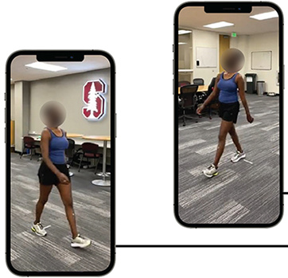
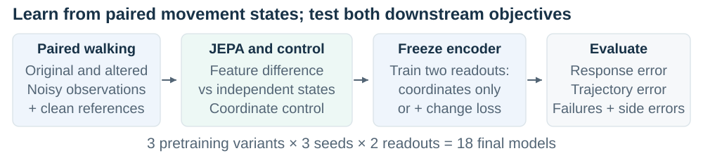
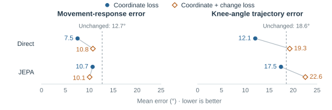
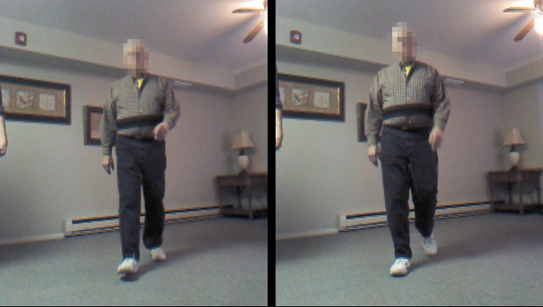

# Gait Fidelity

*Preserving movement changes in learned pose restoration*

Research overview · 24 September 2026 · Completed synthetic core; JEPA follow-up proposed

## Introduction

When video suggests that someone bends a knee less, did their movement change, or did visibility and processing alter the measurement? Biomechanics needs reliable comparisons across conditions; ambient intelligence needs reliable observations beyond the laboratory. Scott Delp and colleagues' OpenCap uses smartphone videos for movement analysis [1]. James Landay and colleagues' Stanford AmI program studies unobtrusive sensing and plans natural-mobility studies [2].

**Pose restoration** corrects estimated joint trajectories. Lower position error or a plausible skeleton does not guarantee that restoration preserves a movement change's magnitude, direction, or side. Gait Fidelity asks whether predictive representation learning can better preserve that change when observations are imperfect.

*Video as a measurement input. Uhlrich et al. [1], Fig. 2; cropped, [CC BY 4.0](https://creativecommons.org/licenses/by/4.0/). Contextual prior work, not this study's data.*

## Methodology

Recorded walking motions from AMASS, a collection of motion-capture datasets, supply original sequences and versions with controlled knee-flexion edits. Rendering supplies pose-estimator inputs and projected joint references. Comparisons within the same camera and observation condition isolate movement change; occlusion and labeling errors test sensitivity to observation quality. These are kinematic stress tests, not simulated clinical impairments.

For each leg, **knee excursion** spans the central 90% of image-plane hip–knee–ankle angles across frames: the 95th-percentile angle minus the 5th (e.g., 170° − 110° = 60°). The **movement response** is the between-state change in right-minus-left excursion, checked alongside trajectory accuracy.

A **joint-embedding predictive architecture (JEPA)** predicts clean-reference features from masked, noisy poses, using a teacher that averages the encoder's parameters over training. We hypothesize that learning relations between states before freezing makes movement changes easier to recover. The follow-up matches predicted feature differences to the teacher's differences; a control regresses each state's features independently. A new coordinate readout then learns corrections from the frozen encoder.

*Proposed follow-up. The comparison tests whether supervising differences adds value beyond independent-state supervision. Paired sequences and clean references are needed for training, not deployment.*

## Experiments

The two JEPA objectives and a coordinate-difference control use three seeds and the core data and training schedule. Each encoder receives coordinate-only and coordinates-plus-change readouts (18 models) to test dependence on downstream supervision. Matched reference support and initial loss calibration constrain alternative explanations. The primary comparison uses the JEPA variants' change-supervised readouts; the interaction is secondary. End-to-end coordinate training and frozen, randomly initialized encoders test practical utility and pretraining value. Person-balanced scores include failures and report their contribution; a zero-change benchmark checks for insensitivity.

## Results

**The completed core favors direct coordinate training.** Across 14 development participants and three seeds, it had the lowest mean on all nine exported metrics. Relative to unchanged poses, response error fell from 12.688° to 7.544° (40.5%), and waveform error from 18.571° to 12.073°. The exploratory response improvement was 5.144° (descriptive 95% interval: 2.152°–8.651°) [3].

*Core means: 14 people, three seeds. Lines connect restoration losses within each family; dashed lines mark unchanged poses. JEPA's losses train its readout. Its small response shift remains uncertain. Follow-up results are pending.*

In the declared comparison, JEPA had 0.688° lower response error than direct training, both with change supervision. The descriptive 95% interval, resampling people and seeds, was −0.640° to +1.977°: a JEPA advantage remains unresolved. Its waveform error was 3.272° higher. Adding change supervision worsened waveform error in all five neural families and response error in four. JEPA also showed no clear response advantage over the initialized-encoder control. These findings motivate the follow-up; they do not establish its mechanism or success.

## Discussion

The core shows why a movement-processing system needs evaluation of the change it will be used to interpret, alongside trajectory accuracy. The follow-up tests a feature-difference objective beyond independent-state regression and asks whether its benefit depends on readout supervision. That dependence requires a direct interaction estimate; the experiment cannot uniquely identify the cause of the core tradeoff. Shared errors can cancel in a difference, so response gains need waveform checks and failure analysis.

*Toward independent validation. Structured residential testing in the Rush study, Dawe et al. [4], Fig. 1; cropped, [CC BY 4.0](https://creativecommons.org/licenses/by/4.0/). Contextual prior work.*

The current evidence concerns synthetic observations, projected angles, and a reused development population. For biomechanics and ambient intelligence, the next step is independent validation against synchronized movement references, including repeatability and visibility changes. The connection to world-model research is predictive representation learning; this model does not forecast future motion. Its potential contribution is evidence about when learned reconstruction supports a trustworthy movement comparison.

**Sources:** [1] [Uhlrich et al., OpenCap (2023)](https://doi.org/10.1371/journal.pcbi.1011462). [2] [Stanford Ambient Intelligence](https://ami.stanford.edu/). [3] [Core analysis and uncertainty](results/core-analysis-20260924/README.md); [full proposal and amended design](proposal.html). [4] [Dawe et al. (2019)](https://doi.org/10.1371/journal.pone.0215995).
